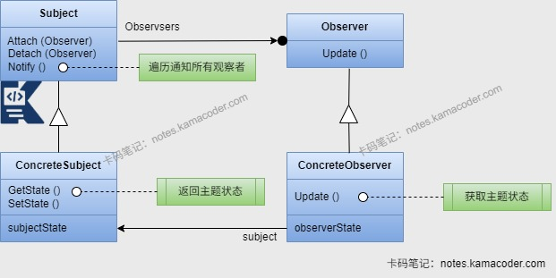

# 观察者模式

> 来源: https://notes.kamacoder.com/java/observer-pattern.html

# `# 观察者模式 

## `# 简要回答 
  - **观察者模式**是一种**行为型设计模式**，核心思想是定义一对多的对象依赖关系，让多个观察者对象同时监听某一个主题对象，这个主题对象在状态变化时会通知所有的观察者对象，触发响应行为；观察者能够动态订阅/取消订阅主题，实现了发布者与观察者的解耦。   - 观察者模式优点：除了能够**动态扩展**观察者外，还能实现观察者对象和主题对象之间的**解耦**，让耦合的双方都依赖于抽象，不会相互影响；同时**封装**了主题状态变更的通知逻辑，不用手动遍历调用观察者。   - 但是观察者模式的**通知顺序是无序**的，还有**内存泄漏**风险，若观察者订阅后没有及时取消订阅，会导致观察者对象无法被GC回收；如果观察者更新时触发主题再次变更，可能会引发**循环通知**而导致程序卡死。 

## `# 详细回答 
  - 观察者模式有四个核心角色：抽象主题、具体主题、抽象观察者、具体观察者。

    - **抽象主题**(Subject)：定义主题的核心行为规范，提供了添加/删除观察者的方法和统一通知所有观察者的方法。     - **具体主题**(ConcreteSubject)：继承抽象主题，是被观察的对象，维护自身的业务状态，存储所有已订阅的观察者对象集合；在自身状态发生变化时主动调用通知方法，通知所有已订阅的观察者对象。     - **抽象观察者**(Observer)：定义观察者的核心行为规范，声明响应主题状态变化的更新方法。     - **具体观察者**(ConcreteObserver)：是订阅消息的对象，实现抽象观察者所声明的更新方法，在自身状态发生变化时，调用该方法，将自身状态作为参数传递给观察者。   - 实现观察者模式时，需要先**定义主题接口**，包括注册、移除和通知观察者的方法；然后**定义观察者接口**，包括更新方法；再**定义具体的主题类**，维护一组观察者对象，实现在主题状态改变时，调用观察者的更新方法；最后**定义具体的观察者类**，实现更新方法。客户端负责创建主题对象和观察者对象，将观察者注册到主题中，实现主题改变状态时观察者得到通知并进行更新。 

## `# 知识图解 
  - 观察者模式结构图

 

## `# 代码示例 
  - 

以Java代码为例，实现一个简单的观察者模式如下： 

```
import java.util.ArrayList;
import java.util.List;

// 观察者接口
interface Observer {
    void update(String message);
}

// 具体观察者
class ConcreteObserver implements Observer {
    private String name;

    public ConcreteObserver(String name) {
        this.name = name;
    }

    @Override
    public void update(String message) {
        System.out.println("观察者 [" + name + "] 收到通知: " + message);
    }
}

// 被观察者接口（主题）
interface Subject {
    void attach(Observer observer);   // 添加观察者
    void detach(Observer observer);   // 移除观察者
    void notifyObservers(String message); // 通知所有观察者
}

// 具体被观察者（具体主题）
class ConcreteSubject implements Subject {
    private List<Observer> observers = new ArrayList<>();

    @Override
    public void attach(Observer observer) {
        if (observer == null) {
            throw new IllegalArgumentException("观察者不能为 null");
        }
        if (!observers.contains(observer)) {
            observers.add(observer);
        }
    }

    @Override
    public void detach(Observer observer) {
        observers.remove(observer);
    }

    @Override
    public void notifyObservers(String message) {
        if (message == null) {
            message = "";
        }
        for (Observer observer : observers) {
            observer.update(message);
        }
    }
}

// 测试类
public class ObserverPatternDemo {
    public static void main(String[] args) {
        // 创建被观察者
        ConcreteSubject subject = new ConcreteSubject();

        // 创建观察者
        Observer obs1 = new ConcreteObserver("张三");
        Observer obs2 = new ConcreteObserver("李四");
        Observer obs3 = new ConcreteObserver("王五");

        // 注册观察者
        subject.attach(obs1);
        subject.attach(obs2);
        subject.attach(obs3);

        // 发送通知
        subject.notifyObservers("第一次更新：系统即将维护");

        // 移除一个观察者
        subject.detach(obs2);

        // 再次发送通知
        subject.notifyObservers("第二次更新：维护完成");
    }
}

/* 代码执行结果：
观察者 [张三] 收到通知: 第一次更新：系统即将维护
观察者 [李四] 收到通知: 第一次更新：系统即将维护
观察者 [王五] 收到通知: 第一次更新：系统即将维护
观察者 [张三] 收到通知: 第二次更新：维护完成
观察者 [王五] 收到通知: 第二次更新：维护完成
*/

```

    - 

Java中内置了观察者模式的核心API，核心类是java.util.Observable和java.util.Observer。Observable类是被观察者（抽象主题），内置了观察者集合和增删/通知方法；Observer类是观察者（抽象观察者），定义了更新方法。 
    - 使用JDK原生API时，需要自定义主题类和观察者类并分别继承Observable和Observer类，当被观察者的状态发生改变后，需要调用setChanged()标记状态变更，然后调用notifyObservers()通知所有观察者。 

## `# 使用场景 
  - 观察者模式适用于**当一个对象状态发生改变，需要通知多个其他对象进行更新**的场景，尤其是不知道具体有多少个观察者对象的情况下，希望这些对象不是紧耦合的情况。 
  - **事件处理**场景中，当进行GUI界面开发时需要使用观察者模式监听鼠标点击、键盘输入等事件；   - 实现**发布-订阅模型**时，使用观察者模式实现有一个主题负责发送通知，多个观察者负责监听并响应通知，如微服务中的事件驱动架构或消息队列系统场景；   - 观察者模式还可以用于**实现通知业务**，如短信推送、邮件通知等场景。   - 框架中也经常使用观察者模式，如**Spring框架**中的ApplicationContext事件监听机制，其中ApplicationListener接口定义了监听器（观察者），ApplicationEvent接口定义事件（主题）；**Redis框架**中的Pub/Sub机制，也是基于观察者模式实现的。 

## `# 知识扩展 
  - 面试官可能追问： 
  - Q1：观察者模式和发布-订阅模式有什么区别？

    - 观察者模式没有中间层，主题直接持有观察者的引用，可以直接实现通知和调用其更新方法；适合单机且轻量级的场景。     - 发布-订阅模式引入了中间层实现完全的解耦，发布者负责发布消息，由中间层负责将消息分发给订阅者，发布者和订阅者互相不知道对方的存在。适合分布式、跨进程的大型系统，比如微服务、消息队列等。   - Q2：使用观察者模式的缺点有哪些，怎么解决？

    - 使用观察者模式时可以**给观察者设置优先级**，按照优先级排序通知，解决通知无序问题。     - 对于内存泄漏问题，可以**使用弱引用存储观察者**，还可以在观察者生命周期结束时主动调用detach方法移除观察者引用。     - 在update方法中**增加状态变更标记**，避免重复触发通知逻辑，可以解决循环通知问题。     - 当观察者模式使用同步通知遇到性能瓶颈时，可以**使用线程池异步通知**，主题状态变化时异步调用观察者的update方法。   - Q3：观察者模式中有哪些设计原则？

    - **依赖倒置原则**：观察者模式的主题和观察者都依赖抽象而不依赖具体实现；     - **开放闭合原则**：新增观察者时无需修改主题代码，对扩展开放、对修改闭合；     - **单一职责原则**：观察者模式的主题只负责维护状态和通知，观察者只负责处理通知。
