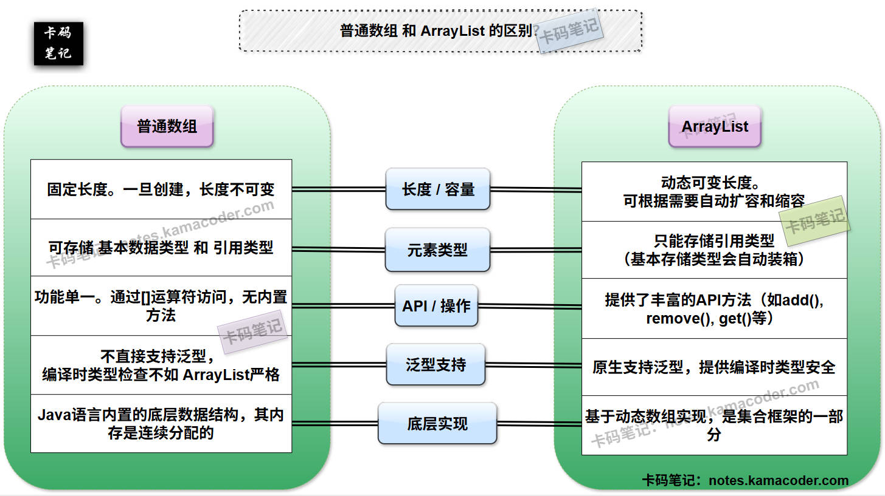

# ArrayList与数组的区别

> 来源: https://notes.kamacoder.com/java/arraylist-vs-array.html

# `# ArrayList与数组的区别 

## `# 简要回答 

### `# ArrayList 和 普通数组 的概念 
  - **普通数组（Array）**：

    - **定义**：它是 Java 语言中一个内置的、**固定大小**的数据结构，用于存储一系列**相同类型**的元素。     - **优点**：**访问速度快**（通过索引/下标直接访问元素），可以存储基本数据类型，内存开销小。     - **缺点**：数组长度固定**不可变**，**增删元素不方便**，功能单一。     - **适用场景**：元素数量已知且固定，对性能要求比较高，或仅需存储基本数据类型。   - **`ArrayList`** ：

    - **定义**：它是 `java.util` 包下的一个集合类，是 `List` 接口的最常用的实现类，ArrayList 的底层是基于**动态数组**实现的。     - **优点**：长度可变（动态扩容），具有丰富的API操作，且支持泛型。     - **缺点**：**增删元素（特别是中间位置）效率相对较低**，存储基本类型时 存在装箱拆箱带来的开销。     - **适用场景**：元素数量不确定，需要频繁查询或在末尾增删，需要集合框架提供的API操作。 

### `# ArrayList 和 普通数组 的区别 
  - 如下表所示：

| 维度  普通数组（Array）  `ArrayList` 
| **长度/容量**  **固定长度**，一旦创建，长度不可变。  **长度可变**，可根据需要自动扩容和缩容。 
| **元素类型**  可存储**基本数据类型**和**引用类型**，但不能混用。  只能存储**引用类型**（基本类型会自动装箱）。 
| **API/操作**  功能单一，通过 `[]` 运算符访问，无内置方法。  提供了丰富的 API 方法（`add()`, `remove()`, `get()` 等）。 
| **泛型支持**  不直接支持泛型，编译时类型检查不如 `ArrayList` 严格。  **原生支持泛型**，提供编译时类型安全。 
| **底层实现**  语言内置的底层数据结构。  基于**动态数组**实现，是集合框架的一部分。  

## `# 详细回答 

### `# ArrayList 和 普通数组 的概念 
  - **普通数组（Array）**：

    - **定义**：数组是 Java 语言内置的一种最基本、最底层的数据结构。它的本质是一个**固定大小**的同类型元素的集合，数组的长度在创建时就已经确定，并且在程序运行过程中不可更改。     - **优点**：  

① **访问速度快**：因为数组在内存中是**连续存储**的，所以我们可以直接通过 **索引/下标** 直接计算出元素的内存地址，实现 **O(1)** 时间复杂度的 **随机访问**。  

② **内存开销小**：数组可以直接存储 `int`, `char`, `boolean` 等基本数据类型，避免了拆装箱带来的开销。     - **缺点**：  

① **数组一旦被创建，长度就无法改变**。如果需要增加或减少元素，必须创建一个新数组并将旧数组的元素复制过去，效率较低。  

② **增删元素不便**：在数组**中间位置插入或删除元素**需要移动大量后续元素，时间复杂度是 **O(n)** 。     - **适用场景**：  

① 当**元素数量已知且固定**时；  

② 对**性能要求极高**，且主要进行随机访问操作的场景；  

③ 需要存储**多维数据**（比如说矩阵）时。   - **`ArrayList`** ：

    - **定义**：`ArrayList` 是 `java.util` 包中的一个集合类，底层是基于一个**动态数组**来实现的。它允许存储重复元素，并保持了元素的插入顺序。     - **优点**：  

① **长度可变（根据实际存储情况动态扩容）**：当元素数量超过当前容量时，它会自动扩容（通常是当前容量的 1.5 倍）。  

② 作为 Java 集合框架的一部分，`ArrayList` 提供了比方说是 `add()`, `remove()`, `get()`, `size()`, `contains()` 这些很方便操作元素的方法。  

③ **原生支持泛型**：`ArrayList<E>` 原生支持泛型，**在编译时进行类型检查**，提供了类型安全，避免了运行时 `ClassCastException`。     - **缺点**：  

① **存储基本类型时有装箱拆箱带来的开销**：因为 `ArrayList` 只能存储引用类型。如果存储 `int` 等基本数据类型，Java 会自动进行**装箱（Autoboxing）**转换为 `Integer` 等包装类，带来了额外的内存开销。  

② **扩容带来的开销**：扩容操作本身（创建新数组和复制元素）也是有性能开销的。     - **适用场景**：  

① 当需要存储的**元素数量不确定**时。  

② 当需要利用 Java 集合框架提供的 **丰富功能** 和 **类型安全** 时。 

### `# ArrayList 和 普通数组 的区别 
  - **长度/容量**：

    - **普通数组**：具有**固定长度**，一旦数组被创建，数组的大小就无法更改。如果需要一个更大或更小的数组，就必须创建一个新数组，并将旧数组中的元素复制到新数组中。     - **`ArrayList`**：具有**动态可变长度**。它是一个可变大小的集合，当集合内的元素数量达到了内部数组的当前容量，并需要添加新元素时，`ArrayList` 会自动创建一个更大的新数组，并将所有现有元素复制到新数组中（通常是当前容量的 1.5 倍），然后丢弃旧数组。   - **元素类型**：

    - **普通数组**：可以直接存储**基本数据类型**（如 `int`, `char`, `boolean`等），也可以直接存储 **引用类型**（如 `String`, `Object`等）。但是不能混用，即一旦数组被声明为某种类型，它就只能存储该类型或其子类型的元素。     - **`ArrayList`**：只能存储**引用类型**，存储基本数据类型会自动执行**装箱（Autoboxing）** 操作，将其转换为对应的包装类（例如，`int` 会被转换为 `Integer` 对象）。   - **API/操作**：

    - **普通数组**：功能相对单一，主要通过 **`[]` 运算符** 来进行元素的存取，并没有内置的方法来执行常见的集合操作，如添加、删除、查找元素、获取当前大小等，这些操作需要我们手动实现。     - **`ArrayList`**：作为 Java 集合框架的一部分，内部封装了很多实用的 **API 方法**。例如，`add()` 用于添加元素，`remove()` 用于删除元素，`get()` 用于获取元素，`size()` 用于获取当前元素数量，`contains()` 用于判断元素是否存在等。   - **泛型支持**：

    - **普通数组**：泛型支持不如 `ArrayList` 严格。虽然我们可以去声明 `Object[]` 类型的数组来存储不同类型的对象，但它在编译时不会提供严格的类型检查，这可能会导致**运行时**出现 `ArrayStoreException`。例如，`String[]` 可以赋值给 `Object[]`（数组是**协变**的），但向 `Object[]` 中添加 `Integer` 会在运行时报错。     - **`ArrayList`**：**原生支持泛型**（例如 `ArrayList<String>`）。这意味着在编译时，编译器会强制检查 要添加或获取的元素，它的类型是否与泛型参数一致，保证了**编译时类型安全**，避免了运行时出现 `ClassCastException`。   - **底层实现**：

    - **普通数组**：是 Java 语言内置的**底层数据结构**。     - **`ArrayList`**：是 Java 集合框架中的一个**集合类**，其底层是基于**普通数组**来实现的。`ArrayList` 内部维护一个 `Object[]` 数组elementData，并在此基础上封装了动态扩容、增删改查一套逻辑。  

## `# 知识拓展 
  - 

**ArrayList 和 普通数组 的区别**示意图如下：  
 
   - 

**面试官可能的追问1：在 Java 中，当需要存储大量基本数据类型时，除了数组，还有其他什么选择吗？** 
    - **Apache Commons Lang 库**：这个库提供了 `ArrayUtils` 等工具类，以及 `PrimitiveIterator` 等，可以更方便地操作基本类型数组。     - **Guava 库**：提供了 `Ints`, `Longs` 等工具类，以及 `ImmutableList` 的基本类型版本，用于处理基本类型的集合，避免装箱。     - **FastUtil 或 Trove 库**：这些是专门为高性能基本类型集合设计的第三方库，它们提供了 `IntArrayList`, `LongHashSet` 等，直接在内部使用基本类型数组，完全避免了装箱拆箱，性能远超 `java.util` 包中的标准集合类，适用于大数据量和对性能要求比较高的场景。
