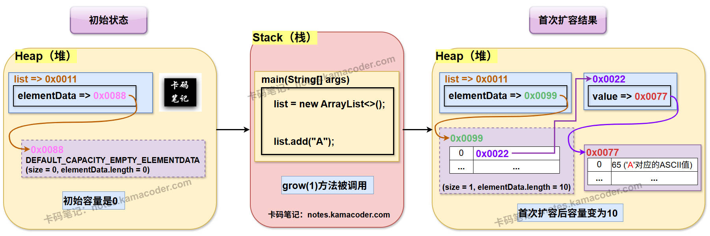
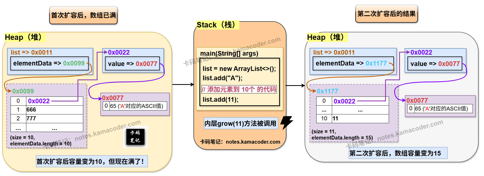

# ArrayList扩容机制

> 来源: https://notes.kamacoder.com/java/arraylist-resize.html

# `# ArrayList扩容机制 

## `# 简要回答 
  - `ArrayList` 的扩容机制：

    - 当其**内部存储元素的数组**，它的容量不足以容纳新元素时，`ArrayList` 会自动创建一个更大的新数组，并将原数组中的所有元素都复制到这个新数组中。     - 这个过程发生在当内部数组的 `size` 等于 `elementData.length` 并且还调用 `add()` 方法时触发。     - 默认的扩容策略是**将当前容量扩大 1.5 倍**（`newCapacity = oldCapacity + (oldCapacity >> 1)`）。虽然单次扩容涉及元素复制，时间复杂度为 O(N)，但由于容量是指数级增长的，因此向 `ArrayList` 中添加元素的**均摊时间复杂度为 O(1)** 。  

## `# 详细回答 (基于 JDK 17.0 源码) 

### `# 无参构造下扩容机制的底层实现 
  - 

**初始状态：** 内部的 **`elementData`** 数组会被初始化为 `DEFAULT_CAPACITY_EMPTY_ELEMENTDATA`，这是一个**共享的、静态的空数组**。此时 `size` 为 0。 

```
// ArrayList.java (JDK 17)
private static final Object[] DEFAULT_CAPACITY_EMPTY_ELEMENTDATA = {};
transient Object[] elementData; // non-private to simplify nested class access
public ArrayList() {
    this.elementData = DEFAULT_CAPACITY_EMPTY_ELEMENTDATA;
}

```

    - 

**第一次 `add()` 方法调用：** 
    - 

在 **`add(E e)`** 方法内部，jvm会进一步调用一个 **私有的、重载的** `add` 方法—— **`add(e, elementData, size)`** 。 

```
  public boolean add(E e) {
      modCount++;
      add(e, elementData, size);
      return true;
  }

  private void add(E e, Object[] elementData, int s) {
      if (s == elementData.length)
          elementData = grow();
      elementData[s] = e;
      size = s + 1;
  }

```

      - 

在 `private void add(E e, Object[] elementData, int s)` 方法中，形参`s` (大小等于当前 `size`，为 0) 等于 `elementData.length` (大小也为 0，因为是空数组 **`DEFAULT_CAPACITY_EMPTY_ELEMENTDATA`**)，条件 `s == elementData.length` 成立。     - 

于是调用 `elementData = grow(s + 1)`，此时 `s + 1` 为 `1`。这个 `1` 就是 `minCapacity` (最小所需容量)。     - 

接着进入 **`grow(int minCapacity)`** 方法： 

```
  private Object[] grow(int minCapacity) {
      int oldCapacity = elementData.length;
      if (oldCapacity > 0 || elementData != DEFAULTCAPACITY_EMPTY_ELEMENTDATA) {
          int newCapacity = ArraysSupport.newLength(oldCapacity,
                  minCapacity - oldCapacity, /* minimum growth */
                  oldCapacity >> 1           /* preferred growth */);
          return elementData = Arrays.copyOf(elementData, newCapacity);
      } else {
          return elementData = new Object[Math.max(DEFAULT_CAPACITY, minCapacity)];
      }
  }

```

      - 

可以看到，对于无参构造器创建的 `ArrayList`，第一次添加元素时，`grow` 方法的 `else` 分支会被执行，`elementData` 会被初始化为一个大小为 `Math.max(DEFAULT_CAPACITY, minCapacity)` 的数组。由于 **`DEFAULT_CAPACITY`** 是 10，`minCapacity` 是 1，所以第一次扩容后新数组的容量是 **10**。     - 

`grow` 方法返回这个新的、容量为 10 的数组，并将其赋值给 `this.elementData`。     - 

回到 `add(E e, Object[] elementData, int s)` 方法，元素被放置到 `elementData[0]`，`size` 更新为 1。   - 

**后续 `add()` 方法调用（第二次扩容时）：** 
    - 

当 `size` 达到 `elementData.length`（例如，已经添加了 10 个元素，`size` 就变成10了，`elementData.length` 也为10），再次调用 `add()` 时，内层 **`add(e, elementData, size)`** 方法中，`s == elementData.length` 再次成立，会触发第二次扩容。     - 

调用 `elementData = grow(s + 1)`，此时 `s + 1` 为 11。     - 

进入 `grow(int minCapacity)` 方法， `oldCapacity` 是 10，此时 `oldCapacity > 0` 条件成立，进入 `if` 分支。     - 

if分支中会调用newLength方法，如下所示： 

```
int newCapacity = ArraysSupport.newLength(oldCapacity,
            minCapacity - oldCapacity, /* minimum growth */
            oldCapacity >> 1           /* preferred growth */);

```

 

其中 `oldCapacity >> 1` 表示原来的数组长度对2取整，相当于传入了三个形参——①原来的数组长度；②新数组的自小增长量；③优先希望的增长量。newLength方法的源码如下： 

```
public static int newLength(int oldLength, int minGrowth, int prefGrowth) {
    // preconditions not checked because of inlining
    // assert oldLength >= 0
    // assert minGrowth > 0

    int prefLength = oldLength + Math.max(minGrowth, prefGrowth); // might overflow
    if (0 < prefLength && prefLength <= SOFT_MAX_ARRAY_LENGTH) {
        return prefLength;
    } else {
        // put code cold in a separate method
        return hugeLength(oldLength, minGrowth);
    }
}

```

      - 

从 ArraysSupport.newLength 返回的 newCapacity 将是 15。     - 

回到 grow 方法，elementData 会被 Arrays.copyOf(elementData, 15) 复制到一个新的、容量为 15 的数组。     - 

此后，每次扩容都会按照类似的逻辑进行，即 ArraysSupport.newLength 会根据 1.5 倍的“首选增长量” (oldCapacity >> 1) 和“最小增长量” (minCapacity - oldCapacity) 的最大值来计算新的容量，直到达到 MAX_ARRAY_SIZE 的限制。 

### `# 带参构造下扩容机制的底层实现 
  - 

**初始状态：** 
    - 

如果 `initialCapacity > 0`：`elementData` 数组会直接被初始化为指定大小的数组。 

```
// ArrayList.java (JDK 17)
private static final Object[] EMPTY_ELEMENTDATA = {}; // 注意与 DEFAULT_CAPACITY_EMPTY_ELEMENTDATA 的区别
public ArrayList(int initialCapacity) {
    if (initialCapacity > 0) {
        this.elementData = new Object[initialCapacity];
    } else if (initialCapacity == 0) {
        this.elementData = EMPTY_ELEMENTDATA; // 初始容量为0时，使用另一个共享空数组
    } else {
        throw new IllegalArgumentException("Illegal Capacity: "+ initialCapacity);
    }
}

```

      - 

如果 `initialCapacity == 0`：`elementData` 数组会被初始化为 `EMPTY_ELEMENTDATA`，这是另一个**共享的、静态的空数组**，与无参构造器的 `DEFAULT_CAPACITY_EMPTY_ELEMENTDATA` 不同。   - 

**`initialCapacity > 0` 时的 `add()` 行为：** 
    - 假设 `new ArrayList(3)`，此时 `elementData.length` 为 3。那么在添加前 3 个元素时，`s == elementData.length` 不成立，不会触发扩容。     - 添加第 4 个元素时 (`s` 为 3)， **`add(e, elementData, size)`** 中，`s == elementData.length` (即 `3 == 3`) 成立，会进行扩容。此时内层grow方法的形参 `minCapacity` 为 4。     - 内层grow方法中，`oldCapacity` 是 3。此时`oldCapacity > 0` 成立，进入 `if` 分支。ArraysSupport.newLength方法传入的三个形参就分别是——①oldCapacity = 3， ②minCapacity - oldCapacity = 1, ③oldCapacity >> 1 = 1;     - 新数组的长度就等于旧数组的长度加上minGrowth和prefGrowth中的最大值，也就是3 + 1 = 4.     - 最终，`elementData` 会被 `Arrays.copyOf(elementData, 4)` 复制到一个新的、容量为 **4** 的数组。   - 

**“线性增长”的效果：** 
    - 如果带参构造传入的 `initialCapacity` 小于4，那么在最初的几次扩容中，宏观上会呈现出“逐步加一”的效果。这就使得当oldCapacity等于0、1的情况下，prefGrowth都等于0；而oldCapacity等于2、3的情况下，prefGrowth都等于1。     - 直到size>=4之后，才会在宏观上更明显地看到1.5倍的扩容。  

## `# 知识图解 
  - **ArrayList初始状态和首次扩容**的示意图如下：  
 
   - **ArrayList第二次扩容**的示意图如下：

  

## `# 知识拓展——Java 8 和 Java 17 `ArrayList` 源码上的区别？以及为什么要这么改进？ 

### `# Java 8 `ArrayList` 扩容流程及源码特点 

在 Java 8 中，`ArrayList` 的 `add()` 方法触发扩容的调用链相对直接： 
  - 

**`public boolean add(E e)` 方法：** 
    - 

直接调用 `ensureCapacityInternal(size + 1)` 来确保容量。 

```
// (Java 8)
public boolean add(E e) {
    ensureCapacityInternal(size + 1);  // Increments modCount!!
    elementData[size++] = e;
    return true;
}

```

    - 

**`ensureCapacityInternal(int minCapacity)` 方法：** 
    - 

这个方法不再直接包含容量初始化的逻辑，而是调用了一个新的私有静态方法 calculateCapacity 来计算实际所需的容量。     - 

然后将计算出的容量传递给 ensureExplicitCapacity(calculatedCapacity)。 

```
//  (Java 8)
private void ensureCapacityInternal(int minCapacity) {
    ensureExplicitCapacity(calculateCapacity(elementData, minCapacity));
}

```

    - 

**`private static int calculateCapacity(Object[] elementData, int minCapacity)` 方法** ： 
    - 这个方法专门用于计算在当前 elementData 状态下，所需的最小容量。     - 它处理了**无参构造器**创建的 ArrayList 在**第一次添加元素**时，将容量从 0 初始化为 DEFAULT_CAPACITY (10) 的逻辑。

```
// (Java 8u40+)
// 这是一个辅助方法，用于计算实际所需的容量
private static int calculateCapacity(Object[] elementData, int minCapacity) {
    if (elementData == DEFAULTCAPACITY_EMPTY_ELEMENTDATA) {
        return Math.max(DEFAULT_CAPACITY, minCapacity);
    }
    return minCapacity;
}

```

    - 

**`ensureExplicitCapacity(int minCapacity)` 方法** ： 
    - 

检查 `modCount` 以支持快速失败（fail-fast）机制。     - 

如果 `minCapacity` 大于当前数组长度 (`elementData.length`)，则调用 `grow(minCapacity)` 进行实际的扩容。 

```
// ArrayList.java (Java 8)
private void ensureExplicitCapacity(int minCapacity) {
    modCount++; // 记录修改次数，用于迭代器快速失败
    // overflow-conscious code
    if (minCapacity - elementData.length > 0)
        grow(minCapacity);
}

```

    - 

**`grow(int minCapacity)` 方法：** 
    - 

这是实际执行扩容逻辑的方法。     - 

**直接在方法内部计算新容量：** `int newCapacity = oldCapacity + (oldCapacity >> 1);` (即 1.5 倍)。     - 

**直接在方法内部处理各种边界条件：** 包括 `newCapacity < minCapacity`（取 `minCapacity`）、`newCapacity > MAX_ARRAY_SIZE`（调用 `hugeCapacity`）。     - 

**直接修改 `this.elementData` 字段：** `elementData = Arrays.copyOf(elementData, newCapacity);` 

```
// ArrayList.java (Java 8)
private void grow(int minCapacity) {
    // overflow-conscious code
    int oldCapacity = elementData.length;
    int newCapacity = oldCapacity + (oldCapacity >> 1); // 直接计算 1.5 倍
    if (newCapacity - minCapacity < 0)
        newCapacity = minCapacity;
    if (newCapacity - MAX_ARRAY_SIZE > 0)
        newCapacity = hugeCapacity(minCapacity);
    // minCapacity is usually close to size, so this is a win:
    elementData = Arrays.copyOf(elementData, newCapacity); // 直接赋值给 elementData
}

```

  

### `# Java 17 `ArrayList` 扩容流程及源码特点 

在 Java 17 中，`ArrayList` 的 `add()` 方法的调用链和 `grow` 方法的实现方式发生了变化： 
  - 

**`public boolean add(E e)` 方法：** 
    - 

不再直接调用 `ensureCapacityInternal`，而是调用一个新的私有辅助方法 `add(E e, Object[] elementData, int s)`。新的辅助方法将 `elementData` 和 `size` 作为参数传入，这有助于 JIT 编译器进行优化。 

```
private void add(E e, Object[] elementData, int s) {
    if (s == elementData.length)
        elementData = grow();
    elementData[s] = e;
    size = s + 1;
}

public boolean add(E e) {
    modCount++;
    add(e, elementData, size);
    return true;
}

```

    - 

**`private Object[] grow(int minCapacity)` 方法：** 
    - 

**容量计算相关代码位置的变化** 不再自己计算 1.5 倍，而是将容量计算逻辑委托给 `jdk.internal.util.ArraysSupport.newLength` 方法。     - 

`ArraysSupport.newLength` 接收 `oldLength`、`minGrowth` (即 `minCapacity - oldCapacity`) 和 `prefGrowth` (即 `oldCapacity >> 1`) 作为参数，内部会处理 1.5 倍增长的逻辑。     - 

`grow` 方法在计算出新容量并执行 `Arrays.copyOf` 后，会**将新数组赋值给 `this.elementData` 字段，同时也将这个新数组作为方法的返回值返回**。 

```
// ArrayList.java (JDK 17)
private Object[] grow(int minCapacity) {
    int oldCapacity = elementData.length;
    if (oldCapacity > 0 || elementData != DEFAULT_CAPACITY_EMPTY_ELEMENTDATA) {
        int newCapacity = ArraysSupport.newLength(oldCapacity,
                                                  minCapacity - oldCapacity, /* minimum growth */
                                                  oldCapacity >> 1 /* preferred growth */);
        return elementData = Arrays.copyOf(elementData, newCapacity); // 赋值并返回
    } else {
        return elementData = new Object[Math.max(DEFAULT_CAPACITY, minCapacity)];
    }
}

```

  

### `# 为什么要这么改进？ 
  - **让代码变得更加模块化，提高代码复用性：** 
    - **`ArraysSupport.newLength` 的引入**是最大的变化。在 **Java 9** 之后，Oracle 将许多集合类（如 `ArrayList`, `Vector`, `HashMap` 等）中通用的数组/哈希表容量计算和增长逻辑抽象并封装到了 `jdk.internal.util.ArraysSupport` 类中。     - 这样做避免了在不同集合类中重复编写相似的扩容逻辑，提高了代码的**复用性**和**可维护性**。当需要修改扩容策略或处理边界条件时，只需修改 `ArraysSupport` 中的一处代码即可影响所有依赖它的集合类。   - **JIT 编译器优化（性能提升）：** 
    - **参数传递而非字段访问：** 在 `private void add(E e, Object[] elementData, int s)` 方法中，将 `elementData` 和 `size` 作为参数传入，而不是直接访问 `this.elementData` 和 `this.size` 字段。这为 JIT 编译器提供了更好的优化机会，例如**逃逸分析**。     - **`grow` 方法的返回值：** 尽管 `grow` 方法仍然修改了 `this.elementData`，但它同时返回新数组的设计，使得调用者能够明确接收并使用这个新数组。   - **代码清晰度与可读性：** 
    - 虽然引入了更多的内部方法，但从公共 API (`public boolean add(E e)`) 的角度看，代码整体的调用逻辑变得更加清晰明了。     - 将容量计算的复杂性隐藏在 `ArraysSupport` 之后，使得 `ArrayList` 自身的 `grow` 方法逻辑更清晰，专注于数组复制。
