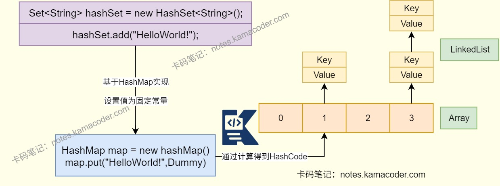

# HashMap、HashSet、HashTable与ConcurrentHashMap

> 来源: https://notes.kamacoder.com/java/hashmap-hashset-hashtable-concurrenthashmap.html

# `# HashMap、HashSet、HashTable与ConcurrentHashMap 

## `# 简要回答 
  - HashMap：存键值对（键唯一、值可重，允许 null 键值），非同步（单线程快），底层哈希表，迭代器为 Iterator（并发修改可能抛异常），可自定义初始容量和加载因子，继承 AbstractMap。   - HashTable：存键值对（键值均不允许 null），同步（方法加锁，多线程性能差），底层哈希表，迭代器为 Enumeration，初始容量和加载因子固定，继承 Dictionary。   - HashSet：存唯一元素（无键值，仅元素操作，允许 1 个 null），非同步，底层基于 HashMap（仅用键位），迭代器为 Iterator，因只存键，性能略优于 HashMap。   - ConcurrentHashMap：存键值对（键值均不允许 null），线程安全（分段锁 / Java8 后 CAS，高并发性能优），支持并发增删（迭代顺序不保证），可自定义容量、加载因子和并发级别。 

## `# 详细回答 
  - HashMap

    - 用于存储键值对，键唯一，值可以重复，通过键可以获取对应值。底层通过哈希表实现。     - 不是同步的，不能保证线程安全，可以使用Collections.synchronizedMap()创建同步的HashMap。     - 在单线程环境中可能比较快，因为没有同步开销。     - 性能会受到键的哈希分布和哈希冲突的影响。     - 允许使用null键和null值。     - HashMap是AbstractMap的子类，实现了Map接口。     - 迭代器通过Iterator实现，迭代过程中如果有其他线程对其修改，可能抛出异常。     - HashMap允许通过构造方法设置初始容量和加载因子。     - 默认初始容量是16，每次扩容变成原来的两倍。   - HashTable

    - 是同步的，方法线程安全，通过在每个方法上添加同步关键字synchronized来实现。     - 多线程环境中可能性能较差。     - 不允许使用null键和null值。     - 迭代器通过Enumeration实现。     - HashTable是Dictionary的子类。     - HashTable的初始容量和加载因子是固定的。     - 默认初始容量是11，每次扩容变成原来的2n+1。   - HashSet

    - 不是同步的，线程不安全。     - 存储唯一元素，不能重复，只能通过元素本身进行操作。     - 基于HashMap实现，使用键的部分，将值部分设置为一个固定常量。     - 允许存储一个null元素。     - 迭代器通过Iterator实现。     - 性能会受到键的哈希分布和哈希冲突的影响，但是它只存储键，通常比HashMap的性能稍好。   - ConcurrentHashMap

    - 是线程安全的，使用分段锁机制保证数据安全。     - 不允许null键或null值。     - 允许迭代时进行并发插入和删除，不能保证迭代器顺序。     - 在Java8后引入了ConcurrentHashMap(int initialCapacity,float loadFactor,int concurrentLevel)构造方法，允许设置初始容量、负载因子和并发级别。     - 高并发场景下，ConcurrentHashMap的性能比HashMap高很多。 

## `# 适用场景 
  - HashMap：适用于单线程下键值对的存储场景，如业务数据临时缓存，通过唯一键快速查询对应值，且有存储null键值的场景。   - HashTable：仅适用于低并发，需要线程安全且禁止null键值的老旧场景。如维护遗留系统，但是因为同步方式低效，性能差，基本被弃用。   - HashSet：适用于单线程下需要存储唯一元素的场景，如需要快速判断元素是否存在和需要去重的场景。   - ConcurrentHashMap：适用于高并发场景下的键值对存储场景，如多线程读写的缓存，秒杀活动中更新商品库存，能够保证线程安全同时兼顾性能。 

| 集合类  适用场景 
| HashMap  单线程下键值对的存储场景 
| HashTable  低并发，需要线程安全老旧场景 
| HashSet  单线程下需要存储唯一元素的场景 
| ConcurrentHashMap  高并发场景下的键值对存储场景 

## `# 知识图解 
  - HashSet实现唯一存储示意图

 

## `# 知识扩展 
  - 面试官可能追问： 
  - Q1：高并发场景下，为什么优先选 ConcurrentHashMap 而不是 “Collections.synchronizedMap (HashMap)”？两者的同步粒度和性能损耗有什么差异？

    - Collections.synchronizedMap (HashMap)是全表锁（对象锁），同一时间仅允许一个线程读写，但是ConcurrentHashMap采用了节点锁（局部锁），可以允许多个线程同时操作不同节点的数据。   - Q2：为什么 HashMap 允许 null 键和 null 值，而 HashTable、ConcurrentHashMap 却禁止？HashSet 允许 1 个 null 元素，是否和它底层依赖的 HashMap 特性直接相关？

    - HashMap允许null是为了简化实现，降低额外判断开销。HashMap会直接将null键视为0，并且固定存储在哈希表中第0个桶中，对null值作为普通值处理。单线程下用户可以通过containsKey(null)主动判断,避免歧义。     - HashTable和ConcurrentHashMao是线程安全的，并发场景下，null会难以判断key是否存在，为了避免歧义，直接禁止存储null键/值。     - HashSet是基于HashMap实现的，所以允许有null元素存在，插入第二个时，底层HashMap会判断已经存在null键，会返回false，所以只能插入一个null元素。   - Q3：当存储数据量较大时，HashMap 和 HashTable 的扩容机制（如初始容量、加载因子、扩容后容量）有什么不同？这会如何影响它们的性能？

    - 从哈希冲突频率来看，HashTable冲突频率高。HashMap的容量始终是2的幂次，配合扰动函数可以让元素重新分布后保持较好的均匀性，但是HashTable的容量默认是11，元素的均匀只依赖hashCode()的质量。     - 从扩容开销来看，HashTable扩容开销大。HashMap扩容容量翻倍，无需重复计算哈希值，HashTable扩容为原来的2n+1，需要对每个元素重新计算哈希值。     - 从初始化操作来看，HashMap可以自定义初始容量和加载因子，可以根据数据灵活调整，HashTable的初始容量默认为11，加载因子默认为0.75，不能自定义。
