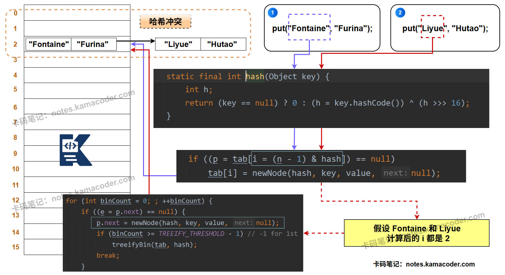

# HashMap实现原理

> 来源: https://notes.kamacoder.com/java/hashmap-implementation.html

# `# HashMap实现原理 

## `# 简要回答 
  - 在 **JDK 1.8** 之前，HashMap的底层是一个 **数组** 结构，在 **JDK 1.8** 后，为了优化哈希冲突的性能，演变成了 “**数组 + 链表 / 红黑树**” 的复合结构。   - 当我们 **`put`** 一个键值对时，会先用 **Key的哈希值** 计算出它在**数组中的位置**（也叫**桶**）。   - 如果这个位置是空的，就直接放入。如果这个位置已经有数据了（哈希冲突），在 JDK 1.7 及以前会以 **链表** 形式存储。从JDK 1.8开始，当这个链表的长度超过一个阈值（默认为8）时，它就会被转换成**红黑树**，以此将严重哈希冲突下的查询时间复杂度从 O(n) 优化到 O(log n)。  

## `# 详细回答 

### `# JDK 1.7 及之前：数组 + 链表 
  - **底层结构**：

    - 在 HashMap 内部，有一个 `Entry[]` 类型的数组，名为`table`。`Entry`是 HashMap 的一个内部类，它包含了`key`, `value`, `hash`以及一个指向下一个`Entry`的`next`指针。   - **`put`流程**：

    - 当执行`put(key, value)`时，首先计算`key`的**哈希值**。     - 然后通过这个**哈希值**与数组长度进行运算，定位到`table`数组中的一个索引位置。     - 如果该位置没有元素，就创建一个新的`Entry`对象放进去。如果该位置已经有元素了（即发生**哈希冲突**），就在这个位置形成一个链表。新加入的元素会采用 “**头插法**” 插入到链表的头部，这是因为设计者认为后插入的元素更可能被先访问。   - **缺点**：

    - 这种结构的主要问题是，一旦哈希函数设计不佳或者数据本身就容易产生大量冲突，就会导致某个桶后面的链表变得非常长。在这种极端情况下，`get()`操作需要遍历整个长链表，其时间复杂度会从理想的O(1)退化到**O(n)**，导致性能急剧下降。 

### `# JDK 1.8 及之后：数组 + 链表 / 红黑树 
  - **底层结构**：

    - HashMap 的**底层数据结构**变成了 **数组 + 链表 或 红黑树** 。数组的类型从`Entry[]`变成了 **`Node[]`** ，这个Node类型是HashMap的内部类，它又实现了Map接口的内部接口Entry，`Node`是`Entry`的替代者。`Node`还有一个子类`TreeNode`，用于表示红黑树的节点。   - **`put`流程**：

    - `put`的大体流程与之前版本的JDK源码相比不变，依然是**先计算哈希，再定位数组桶**。     - 当发生哈希冲突时，如果该桶内元素的组织形式是**链表**，那么新元素会采用 “**尾插法**” 加入到链表的末尾。     - 在插入链表后，会检查该链表的长度。如果长度**大于等于树化阈值（TREEIFY_THRESHOLD，默认为8）**，HashMap并不会立即树化，它还会再检查当前数组的长度，如果数组长度小于一个**最小树化容量（MIN_TREEIFY_CAPACITY，默认为64）**，它会优先选择扩容而不是树化。但如果数组长度足够，这条链表就会被重构为一棵**红黑树**。     - 如果该桶内已经是一棵红黑树了，那么新元素会按照红黑树的规则插入，时间复杂度为**O(log n)**。   - **优势**：

    - 通过引入红黑树，即便在最坏的情况下（即所有key都映射到同一个桶），查询一个元素的时间复杂度也从 O(n) 降低到了 **O(log n)** ，极大地提升了HashMap在恶劣情况下的性能稳定性。  

## `# 知识图解 
  - **HashMap的底层数据结构**，示意图如下：  
 
  

## `# 知识拓展 
  - **面试官可能的追问1：你提到了`hashCode`和`equals`方法，能谈谈它们在HashMap中的作用和它们之间的关系吗？** 
    - **`hashCode()` 的作用**：它是性能的关键。HashMap用它来快速计算出`key`应该被放入哪个桶，目的是将元素尽可能地散列开，减少冲突。它决定了“**去哪里找**”。     - **`equals()` 的作用**：它是正确性的保证。当`hashCode()`定位到某个桶后，如果桶内有多个元素（即当前通的结构是链表或红黑树），就需要用`equals()`方法去逐一比较，以确定哪个才是我们真正要找的`key`。它解决了“**是不是**”的问题。     - **两者关系**：有这么一个约定——如果两个对象通过`equals()`方法比较为`true`，那么它们的`hashCode()`值必须相等。反之则不要求。如果只重写`equals()`而不重写`hashCode()`，就会导致两个我们认为相等的对象，在HashMap中被定位到不同的桶，从而发生“存得进去，取不出来”的诡异情况。   - **面试官可能的追问2：为什么选择在链表长度为8的时候进行树化？这个数字有什么讲究吗？** 
    - 这是一个在**时间**和**空间**之间权衡的结果，在HashMap的源码注释中有详细说明。     - **理想情况**：在一个设计良好的哈希函数下，桶中元素的分布遵循**泊松分布**。计算可知，一个桶中出现8个元素的概率已经小于千万分之一，是极小概率事件。所以再大部分情况下都不会触发树化。     - **成本权衡**：红黑树节点的体积（`TreeNode`）大约是普通链表节点（`Node`）的两倍，所以从空间上看，我们不希望过早树化。从时间上看，当链表较短时（比如长度为6或7），其遍历成本和红黑树的查找成本相差无几，甚至可能更快。     - 所以选择8作为阈值，是在“极小概率发生”和“发生后查询性能（O(log 8)）显著优于链表（O(8)）”之间的一个折中点，同时考虑了空间和时间成本。
