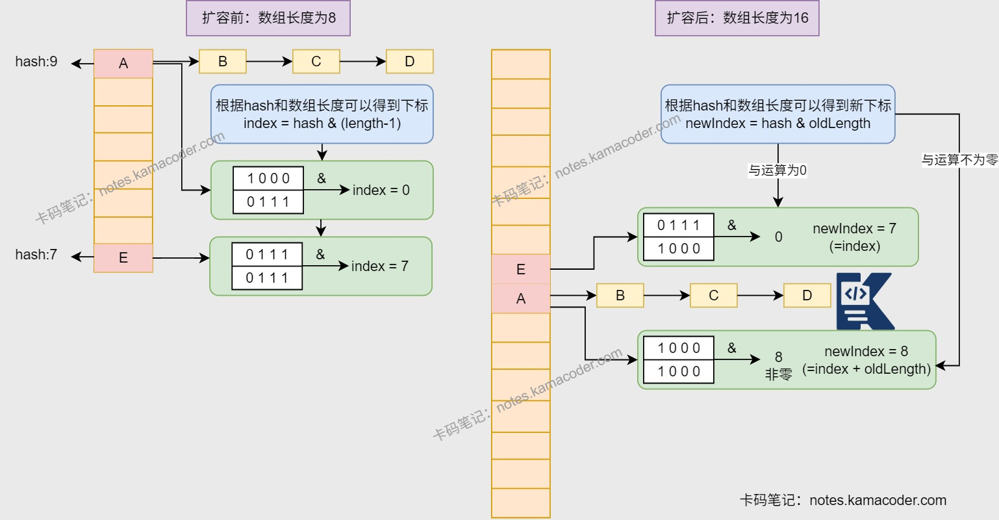

# HashMap扩容机制

> 来源: https://notes.kamacoder.com/java/hashmap-resize.html

# `# HashMap扩容机制 

## `# 简要回答 
  - Java1.7及之前生成新数组后，会遍历老数组的每个链表上元素，获取每个元素的key并基于新数组长度，计算元素在新数组中的下标，将元素放入新数组中，元素转移完后将新数组赋值给HashMap对象的table属性。   - Java1.8及之后生成新数组后，则会遍历老数组中的每个链表/红黑树。计算每个元素在新数组中的下标，将元素放入新数组中，元素转移完后将新数组赋值给HashMap对象的table属性。 

## `# 详细回答 
  - HashMap底层相关属性：

    - 加载因子：默认0.75     - 阈值：容量*加载因子，**当元素数量超过阈值时触发扩容**     - 最大容量：2^30，超过最大容量，阈值设置为Integer.MAX_VALUE   - 扩容机制：当元素数量超过阈值时，触发扩容，新容量是旧容量的2倍，但是不能超过最大容量，会调用resize()方法。   - Java1.7之前扩容机制

    - 底层结构是**数组+单链表**     - 调用 **resize()** 方法时，如果原容量没有没有达到最大，会建立新数组，再调用**transfer()** 方法将原数组的元素移动到新数组中，否则停止扩容。 

```
//resize()方法
void resize(int newCapacity) {
        Entry[] oldTable = table;
        int oldCapacity = oldTable.length;
        //如果原有容量已经达到了上限，停止扩容。
        if (oldCapacity == MAXIMUM_CAPACITY) {
            threshold = Integer.MAX_VALUE;
            return;
        }
        // 创建新数组
        Entry[] newTable = new Entry[newCapacity];
        // 调用transfer方法，将数据迁移到新数组中
        transfer(newTable, initHashSeedAsNeeded(newCapacity));
        table = newTable;
        threshold = (int)Math.min(newCapacity * loadFactor, MAXIMUM_CAPACITY + 1);
}

```

 
  - transfer()方法**遍历数组的每个Entity，重新计算其hash值**，找到新数组中的对应位置，以**头插法**的方式将元素放入新数组中。   - 头插法可能会导致**新旧链表元素转置**现象 

```
//transfer()方法
void transfer(Entry[] newTable, boolean rehash) {
        int newCapacity = newTable.length;
        for (Entry<K,V> e : table) {
            while(null != e) {
                Entry<K,V> next = e.next;
                if (rehash) {
                    e.hash = null == e.key ? 0 : hash(e.key);
                }
                int i = indexFor(e.hash, newCapacity);
                e.next = newTable[i];
                newTable[i] = e;
                e = next;
            }
        }
}

```

 
  - Java1.8之后扩容机制

    - 底层结构是**数组+链表 / 红黑树** 
      - 当**链表长度** 大于等于8时，判断**HashMap的size** 是否大于等于64，如果小于64，则进行扩容，否则将**链表转换为红黑树**。       - 当**红黑树节点数量**小于等于6时，会将**红黑树转换为链表**。     - 遍历原数组的每个桶，转移元素到新数组中，分三种情况处理：

      - 桶中没有元素：跳过       - 桶中只有一个元素：直接放入。       - 桶中是链表或者红黑树：

        - 链表：求新桶位置并放入         - 红黑树：调用split()方法将红黑树拆成两个链表，然后求新桶位置并放入     - 在扩容时，不需要计算元素的hash值，用**原先位置key的hash值**与**旧数组的长度**进行“**与**”操作，如果结果是0，则新位置就是原位置，否则新位置就是原位置+旧数组长度。     - 使用**尾插法**将元素插入新数组中。 

```
final Node<K,V>[] resize() {
        //变量初始化，获取旧数组长度、旧阈值
        Node<K,V>[] oldTab = table;
        int oldCap = (oldTab == null) ? 0 : oldTab.length;
        int oldThr = threshold;
        int newCap, newThr = 0;
        //当原数组已经初始化
        if (oldCap > 0) {
            // 原容量已经达到最大值
            if (oldCap >= MAXIMUM_CAPACITY) {
                threshold = Integer.MAX_VALUE;
                return oldTab;
            }
            // 原容量翻倍后没有达到最大值，正常扩容
            else if ((newCap = oldCap << 1) < MAXIMUM_CAPACITY &&
                     oldCap >= DEFAULT_INITIAL_CAPACITY)
                newThr = oldThr << 1; // 阈值翻倍左移一位
        }
        // 原数组未初始化，但是已经设置阈值
        else if (oldThr > 0)
            newCap = oldThr;
        // 原数组未初始化，没有设置阈值
        else {
            newCap = DEFAULT_INITIAL_CAPACITY;
            newThr = (int)(DEFAULT_LOAD_FACTOR * DEFAULT_INITIAL_CAPACITY);
        }
        // 补全新阈值
        if (newThr == 0) {
            float ft = (float)newCap * loadFactor;
            newThr = (newCap < MAXIMUM_CAPACITY && ft < (float)MAXIMUM_CAPACITY ?
                      (int)ft : Integer.MAX_VALUE);
        }
        // 更新全局阈值
        threshold = newThr;
        // 创建数组并迁移元素
        @SuppressWarnings({"rawtypes","unchecked"})
        Node<K,V>[] newTab = (Node<K,V>[])new Node[newCap];
        table = newTab;
        // 原数组非空
        if (oldTab != null) {
            for (int j = 0; j < oldCap; ++j) {
                Node<K,V> e;
                if ((e = oldTab[j]) != null) {
                    oldTab[j] = null;
                    // 桶中只有一个元素
                    if (e.next == null)
                        newTab[e.hash & (newCap - 1)] = e;
                    // 桶里是红黑树
                    else if (e instanceof TreeNode)
                        ((TreeNode<K,V>)e).split(this, newTab, j, oldCap);
                    // 桶里是链表
                    else {
                        Node<K,V> loHead = null, loTail = null;
                        Node<K,V> hiHead = null, hiTail = null;
                        Node<K,V> next;
                        do {
                            next = e.next;
                            if ((e.hash & oldCap) == 0) {
                                if (loTail == null)
                                    loHead = e;
                                else
                                    loTail.next = e;
                                loTail = e;
                            }
                            else {
                                if (hiTail == null)
                                    hiHead = e;
                                else
                                    hiTail.next = e;
                                hiTail = e;
                            }
                        } while ((e = next) != null);
                        if (loTail != null) {
                            loTail.next = null;
                            newTab[j] = loHead;
                        }
                        if (hiTail != null) {
                            hiTail.next = null;
                            newTab[j + oldCap] = hiHead;
                        }
                    }
                }
            }
        }
        return newTab;
    }

```

 

## `# 知识图解 


 

## `# 知识扩展 
  - 面试官可能追问： 
  - Q1：HashMap线程安全吗？怎么解决线程安全问题？

    - **不是线程安全的**，在多线程环境下，可能会出现数据不一致的情况。     - 解决方法：使用ConcurrentHashMap或者Collections.synchronizedMap()方法。   - Q2：HashMap的扩容条件是什么》

    - Java7中HashMap的扩容条件需要满足**当前数据存储的数量大小大于等于阈值，并且数据发生了hash冲突**。     - Java8中HashMap的扩容条件需要满足**当前数据存储的数量大小大于等于阈值**。   - Q3：HashMap为什么使用的是红黑树而不是平衡二叉树？

    - **平衡二叉树**追求**完全平衡**状态，任何节点的左右子树的高度差不能超过1。但是，在HashMap中，节点的插入和删除操作会频繁，**导致节点的左右子树的高度差会频繁变化**，因此，使用平衡二叉树会比较麻烦。     - **红黑树**追求的是“**弱平衡**”状态，整个树最长路径不会超过最短路径的两倍，所以在插入/删除操作时，**不会频繁调整树结构**。   - Q4：为什么HashMap数组长度是2的n次幂？

    - 为了**提高HashMap的性能**，HashMap的数组长度是2的n次幂。     - 这是因为，当数组长度是2的n次幂时，**hash值与数组长度-1进行“与”操作，等价于hash值对数组长度取模**。     - 而取模运算的效率要低于“与”操作，因此，使用2的n次幂作为数组长度可以提高HashMap的性能。
