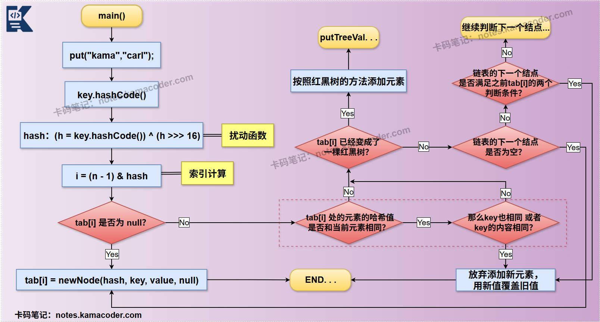

# HashMap的put方法

> 来源: https://notes.kamacoder.com/java/hashmap-put.html

# `# HashMap的put方法 

## `# 简要回答 
  - **计算哈希值和索引：** 
    - 对传入的 `key` 计算哈希值，并通过扰动函数和位运算确定其在底层数组中的**存储位置**（索引）。   - **判断位置是否为空：** 
    - 如果该索引位置**为空**，直接创建新结点并放入。     - 如果该索引位置**不为空**（发生**哈希冲突**），则需要进一步处理。   - **处理哈希冲突：** 
    - **Key已存在：** 如果链表/红黑树中已存在相同的 `key`，则放弃添加元素，更新其对应的 `value`，并返回旧值。     - **Key不存在：** 在链表末尾添加新结点。     - **链表转红黑树：** 如果链表长度达到阈值（默认为 8），会尝试将链表转换为红黑树，以提高查找效率。   - **扩容检查：** 
    - 元素添加成功后，会检查 `HashMap` 的当前元素数量 `size` 是否超过了扩容阈值 `threshold`。如果超过，则进行扩容操作，将底层数组的容量翻倍，并重新计算所有元素的索引位置。  

## `# 详细回答（结合 JDK 17.0 源码） 

### `# HashMap源码解读 
  - 

`HashMap` 的 `put` 方法内部调用了 `putVal` 方法。 `putVal` 方法的源码流程如下： 

```
final V putVal(int hash, K key, V value, boolean onlyIfAbsent, boolean evict) {
    Node<K,V>[] tab; Node<K,V> p; int n, i; // 定义局部变量：tab(当前哈希表数组), p(当前索引位置的第一个结点), n(数组长度), i(计算出的索引)

    // 1. 检查并初始化/扩容哈希表数组
    // 如果当前哈希表为空或长度为0，说明是第一次put或者之前被清空了，需要进行初始化或扩容
    if ((tab = table) == null || (n = tab.length) == 0)
        n = (tab = resize()).length; // 调用 resize() 方法进行初始化或扩容，并获取新的数组长度

    // 2. 计算索引位置并尝试直接插入
    // (n - 1) & hash 是计算索引位置的核心逻辑，利用位运算替代取模，效率更高。
    // 如果计算出的索引位置 tab[i] 为空，则直接创建新结点并放入
    if ((p = tab[i = (n - 1) & hash]) == null)
        tab[i] = newNode(hash, key, value, null); // null 表示没有下一个结点
    else {
        // 3. 处理哈希冲突（索引位置不为空）
        Node<K,V> e; K k; // e 用于存储找到的匹配结点，k 用于存储当前结点的key

        // 3.1 检查链表/红黑树的第一个结点是否就是目标key
        // 如果第一个结点的哈希值和key都匹配（key相同或equals），则 e 指向该结点
        if (p.hash == hash && ((k = p.key) == key || (key != null && key.equals(k))))
            e = p;
        // 3.2 如果第一个结点是红黑树结点（说明该桶已树化）
        else if (p instanceof TreeNode)
            // 调用红黑树的 putTreeVal 方法进行插入或更新
            e = ((TreeNode<K,V>)p).putTreeVal(this, tab, hash, key, value);
        // 3.3 如果是链表（非红黑树）
        else {
            // 遍历链表，查找是否存在相同的key
            for (int binCount = 0; ; ++binCount) { // binCount 统计链表长度
                if ((e = p.next) == null) { // 如果遍历到链表末尾，没有找到相同key
                    p.next = newNode(hash, key, value, null); // 在链表末尾添加新结点
                    // 检查链表长度是否达到树化阈值（TREEIFY_THRESHOLD - 1），如果达到，则尝试树化
                    // -1 是因为 binCount 是从0开始计数，且当前结点是第 binCount+1 个
                    if (binCount >= TREEIFY_THRESHOLD - 1)
                        treeifyBin(tab, hash); // 尝试将链表转换为红黑树
                    break; // 插入完成，跳出循环
                }
                // 如果找到相同key的结点
                if (e.hash == hash && ((k = e.key) == key || (key != null && key.equals(k))))
                    break; // 找到，跳出循环，e 指向该结点
                p = e; // p 移动到下一个结点，继续遍历
            }
        }

        // 4. 更新已存在的key的value
        // 如果 e 不为 null，说明在链表或红黑树中找到了与新key相同的旧key
        if (e != null) { // existing mapping for key
            V oldValue = e.value; // 保存旧值
            // 如果 onlyIfAbsent 为 false (put方法默认是false，表示总是更新)
            // 或者旧值为 null (表示旧key存在但value是null，也允许更新)
            if (!onlyIfAbsent || oldValue == null)
                e.value = value; // 更新value
            afterNodeAccess(e); // 钩子方法，用于LinkedHashMap等
            return oldValue; // 返回旧值
        }
    }

    // 5. 插入成功后的通用处理
    ++modCount; // 结构修改次数加1，用于迭代器快速失败
    if (++size > threshold) // 插入后，如果当前元素数量 size 超过了扩容阈值 threshold
        resize(); // 调用 resize() 方法进行扩容
    afterNodeInsertion(evict); // 钩子方法，用于LinkedHashMap等
    return null; // 返回null表示没有旧值被替换
}

```

    - 

**`resize()` 方法的流程（扩容）：** 当 `size` 超过 `threshold` 或者 `HashMap` 首次初始化时，会调用 `resize()` 方法。 

```
final Node<K,V>[] resize() {
    Node<K,V>[] oldTab = table; // 旧的哈希表数组
    int oldCap = (oldTab == null) ? 0 : oldTab.length; // 旧的容量
    int oldThr = threshold; // 旧的扩容阈值
    int newCap, newThr = 0; // 新的容量和新的扩容阈值

    // 1. 计算新的容量和阈值
    if (oldCap > 0) { // 如果旧容量大于0（非首次初始化）
        if (oldCap >= MAXIMUM_CAPACITY) { // 如果旧容量已达到最大容量
            threshold = Integer.MAX_VALUE; // 阈值设为最大值，不再扩容
            return oldTab; // 返回旧表
        }
        // 新容量为旧容量的两倍，且不超过最大容量
        // 新阈值为旧阈值的两倍
        else if ((newCap = oldCap << 1) < MAXIMUM_CAPACITY && oldCap >= DEFAULT_INITIAL_CAPACITY)
            newThr = oldThr << 1; // double threshold
    }
    // 首次初始化，但指定了初始容量（initial capacity was placed in threshold）
    else if (oldThr > 0)
        newCap = oldThr;
    // 首次初始化，使用默认值
    else {
        newCap = DEFAULT_INITIAL_CAPACITY; // 默认初始容量 16
        newThr = (int)(DEFAULT_LOAD_FACTOR * DEFAULT_INITIAL_CAPACITY); // 默认加载因子 0.75 * 16 = 12
    }

    // 2. 确保新阈值被正确计算
    if (newThr == 0) {
        float ft = (float)newCap * loadFactor;
        newThr = (newCap < MAXIMUM_CAPACITY && ft < (float)MAXIMUM_CAPACITY ? (int)ft : Integer.MAX_VALUE);
    }
    threshold = newThr; // 更新 HashMap 的扩容阈值

    // 3. 创建新的哈希表数组
    @SuppressWarnings({"rawtypes","unchecked"})
    Node<K,V>[] newTab = (Node<K,V>[])new Node[newCap];
    table = newTab; // 将 HashMap 的内部数组指向新创建的数组

    // 4. 将旧表中的元素转移到新表
    if (oldTab != null) {
        for (int j = 0; j < oldCap; ++j) { // 遍历旧表的每个桶
            Node<K,V> e;
            if ((e = oldTab[j]) != null) { // 如果当前桶不为空
                oldTab[j] = null; // 清空旧桶，帮助GC
                if (e.next == null) // 如果桶中只有一个结点
                    newTab[e.hash & (newCap - 1)] = e; // 直接将其放到新表中对应的位置
                else if (e instanceof TreeNode) // 如果是红黑树
                    ((TreeNode<K,V>)e).split(this, newTab, j, oldCap); // 调用红黑树的split方法进行分裂
                else { // 如果是链表（非红黑树）
                    // 链表拆分优化：将链表中的结点分成两部分
                    // 基于 (e.hash & oldCap) == 0 判断，将结点分配到原索引或新索引 (原索引 + oldCap)
                    Node<K,V> loHead = null, loTail = null; // 存储在新索引 j 的链表头尾
                    Node<K,V> hiHead = null, hiTail = null; // 存储在新索引 j + oldCap 的链表头尾
                    Node<K,V> next;
                    do {
                        next = e.next;
                        // 关键优化：判断结点的哈希值在旧容量二进制表示下，最高位是否为0
                        // 如果为0，则在新数组中的索引位置不变 (j)
                        // 如果为1，则在新数组中的索引位置变为 j + oldCap
                        if ((e.hash & oldCap) == 0) {
                            if (loTail == null)
                                loHead = e;
                            else
                                loTail.next = e;
                            loTail = e;
                        }
                        else {
                            if (hiTail == null)
                                hiHead = e;
                            else
                                hiTail.next = e;
                            hiTail = e;
                        }
                    } while ((e = next) != null); // 继续遍历链表
                    // 将拆分后的两个链表分别挂载到新数组的对应位置
                    if (loTail != null) {
                        loTail.next = null;
                        newTab[j] = loHead;
                    }
                    if (hiTail != null) {
                        hiTail.next = null;
                        newTab[j + oldCap] = hiHead;
                    }
                }
            }
        }
    }
    return newTab; // 返回新的哈希表数组
}

```

  

### `# `putVal` 的核心流程： 
  - 

**计算所添加元素的哈希值和索引值** 
    - 

当调用 `put(key, value)` 时，首先会对 `key` 进行哈希计算。`HashMap` 内部会调用 `key.hashCode()` 获取原始哈希值，然后通过一个**扰动函数**对其进行处理，以减少哈希冲突的概率，使哈希值分布更均匀。最终，这个处理后的哈希值（`int hash`）会被传递给 `putVal` 方法。     - 

如果 `HashMap` 尚未初始化（`table` 为 `null`）或者其容量为 0，会首先调用 `resize()` 方法进行初始化。`resize()` 方法会创建一个默认容量（16）的数组，或根据构造函数指定的容量进行初始化。     - 

接着，通过位运算确定 `key` 在数组中的 **索引位置 `i`** ，代码如下： 

```
// 计算索引位置
if ((p = tab[i = (n - 1) & hash]) == null) // (n - 1) & hash 是核心的索引计算逻辑
    tab[i] = newNode(hash, key, value, null); // 如果该位置为空，直接插入新结点

```

      - 

这里的 `(n - 1) & hash` 是一个高效的位运算，等价于 `hash % n`，但仅适用于 `n` 是 2 的幂次方的情况。它将哈希值映射到数组的有效索引范围内。如果计算出的索引位置 `tab[i]` 当前为 `null`，说明该桶是空的，没有发生哈希冲突，此时会直接创建一个新的 `Node` 并将其放入该位置。   - 

**发生哈希冲突时的处理情况** 
    - 如果 `tab[i]` 不为 `null`，则表示发生了**哈希冲突**，需要进一步处理。     - **检查首结点：** 此时，HashMap 会首先判断 **`tab[i]`** 的**第一个结点** `p` 是否与待插入的 `key` **相同**（通过哈希值和 `equals()` 方法判断）。如果相同，则同为Node<K,V>类型的 `e` 会指向 `p`，后续会更新它的 `value`。     - **红黑树处理：** 如果 `p` 是 `TreeNode` 类型（表示该桶已经转换为**红黑树**），则会调用 `TreeNode` 的 `putTreeVal` 方法，以红黑树的逻辑进行插入或更新操作，保证 **O(logN)** 的查找效率。     - **链表处理：** 如果是**普通链表**，则会遍历链表。在遍历过程中，如果找到与待插入 `key` 相同的结点，则 `e` 指向该结点，并在后续更新它的 `value`，用新值替换旧值。如果遍历到链表末尾仍未找到相同 `key`，则在链表的末尾添加新的 `Node`。     - **树化检查：** 在链表末尾添加新结点后，会立即检查当前链表的长度（`binCount`）。如果链表长度达到 `TREEIFY_THRESHOLD` (默认为 8)，并且数组容量也满足树化条件（默认为 64），则会调用 `treeifyBin` 方法，将整个链表转换为红黑树，以优化后续的查找性能。     - **关于value更新的决策：** 对于有相同key的情况，HashMap 根据 `onlyIfAbsent` 参数的设置，决定是否更新 `key` 对应的 `value`。默认情况下 (`onlyIfAbsent` 为 `false`)，旧值会被新值覆盖。   - 

**扩容检查** 
    - 

无论是否发生哈希冲突，只要成功插入了一个新的键值对（即 `e` 为 `null`，表示没有替换旧值），`HashMap` 的 `size` 都会增加。所以在 `putVal` 方法的最后，HashMap 会进行扩容检查。代码如下： 

```
// 插入成功后的通用处理
++modCount; // 结构修改次数加1
if (++size > threshold) // 如果当前元素数量超过扩容阈值
    resize(); // 调用 resize() 方法进行扩容
// ... (afterNodeInsertion 钩子方法)
return null; // 返回null表示没有旧值被替换

```

      - 

`modCount` 会增加，用于 `Iterator` 的快速失败机制。     - 

`size` 也会增加。但如果 `size` 超过了 `threshold`（扩容阈值，通常是 `容量 * 加载因子`），就会触发 `resize()` 方法。  

## `# 知识图解 
  - HashMap解决哈希冲突的方案，如下图所示：  
 
   - HashMap的底层数据结构，如下图所示：  
 
   - HashMap的put方法的流程图如下：  
 
  

## `# 知识拓展 
  - **面试官可能的追问 1：在 `resize()` 方法中，为什么链表在扩容时，元素只会分到两个位置（原位置 `j` 或 `j + oldCap`），而不是完全重新计算哈希值？这种优化是如何实现的？** 
    - 这种优化是基于哈希值和扩容特性实现的。当容量从 `oldCap` 翻倍到 `newCap` (`2 * oldCap`) 时，一个元素在新数组中的索引位置只可能保持不变或变为 `原索引 + oldCap`。     - 这是因为 `newCap` 总是 `oldCap` 的两倍，且两者都是 2 的幂。通过检查元素的 `hash` 值在 `oldCap` 位上的二进制位是 0 还是 1 (`(e.hash & oldCap) == 0`)，就可以直接判断它应该去新数组的哪个位置，避免了重新计算 `(newCap - 1) & hash`，从而大幅提高了扩容时链表元素重新分配的效率。   - **面试官可能的追问 2：`putVal` 方法中，`onlyIfAbsent` 和 `evict` 这两个参数的作用是什么？`afterNodeAccess` 和 `afterNodeInsertion` 钩子方法又是用来做什么的？** 
    - **`onlyIfAbsent`：** 这是一个布尔参数，控制是否只在键不存在时才插入。如果为 `true`，则当 `key` 已存在时，不会更新其 `value`；如果为 `false` (默认值)，则会更新 `value`。     - **`evict`：** 这是一个布尔参数，通常用于 `LinkedHashMap`。它指示在插入结点后是否需要执行逐出策略（例如删除最不常用的结点）。对于 `HashMap` 本身，这个参数通常不发挥作用。     - **`afterNodeAccess` 和 `afterNodeInsertion`：** 这些是**钩子方法 (hook methods)** ，它们是 `HashMap` 提供给其子类（如 `LinkedHashMap`）进行扩展的。 **`afterNodeAccess`** 是在**结点被访问**（如 `get` 或 `put` 更新值）后调用，`LinkedHashMap` 利用它来调整结点的访问顺序，实现 LRU (Least Recently Used) 缓存策略。 **`afterNodeInsertion`** 则是在**结点被成功插入后**调用，`LinkedHashMap` 利用它来维护其双向链表结构。 这些钩子方法使得 `LinkedHashMap` 可以在不修改 `HashMap` 核心逻辑的情况下，实现额外的功能。
