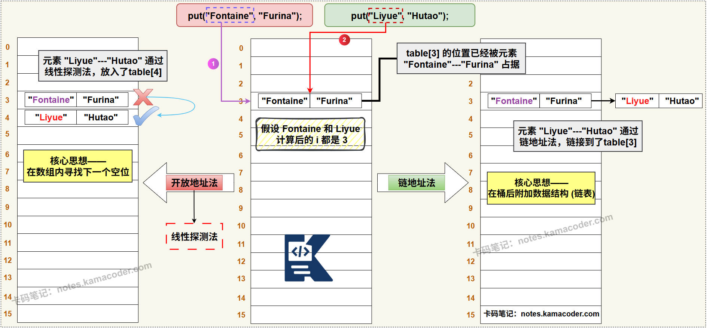

# Hash冲突解决方案

> 来源: https://notes.kamacoder.com/java/hash-collision.html

# `# Hash冲突解决方案 

## `# 简要回答 

### `# 哈希冲突的通用解决方式 
  - **开放地址法**：是指当发生冲突时，在数组中寻找下一个可用的空位。常见的探测方式有**线性探测**、**二次方探测**等。   - **链地址法（拉链法）**：是指在冲突位置拉出一个数据结构（通常是链表），然后将所有冲突的元素都存放在这个数据结构中。 

### `# HashMap对于哈希冲突的解决方案 
  - HashMap采用的是**链地址法**。并且在 JDK 1.8 中进行了优化：当链表的长度超过树化阈值 **8** 时，会自动将链表转换为**红黑树**，以将极端冲突情况下的查询时间复杂度从 O(n) 降低到 O(log n)。  

## `# 详细回答 

### `# 哈希冲突的通用解决方式 
  - **开放地址法 (Open Addressing)** ：

    - **概念**：这种方法**不使用任何外部数据结构**，所有的元素都存储在哈希表数组本身。当发生冲突时，它会通过一个 **探测（Probing）算法** 在数组中寻找下一个可用的空槽位。根据探测序列生成方式的不同，又可以细分为下面几种算法：     - **线性探测 (Linear Probing)** ：如果位置 `i` 被占用，就依次检查 `i+1`, `i+2`, `i+3`... 对应的位置。这种方式实现简单，缓存友好，但容易导致“二次聚集”（或称堆积），即冲突的元素会堆积在一起，形成连续的占用块，影响后续的查找效率。     - **二次方探测 (Quadratic Probing)** ：如果位置 `i` 被占用，就依次检查 `i+1²`, `i-1²`, `i+2²`, `i-2²`...。它能有效地缓解线性探测的堆积问题，但并不能像线性探测法一样探测到散列表的全部存储单元。     - **双重哈希 (Double Hashing)** ：使用两个不同的哈希函数。第一个用于计算初始位置，第二个用于计算每次探测的步长。双重哈希能最大程度地减少聚集现象，让元素分布得更均匀。   - **链地址法 (Separate Chaining)** ：

    - **概念**：它的核心思想是在哈希表的每一个槽位（桶）上，都维护一个**独立的数据结构**来存储所有映射到该槽位的元素。     - **实现方式**：每个桶位通常是一个指向链表头部的指针。当 `put` 一个元素时，先计算出它属于哪个桶，然后将这个元素插入到该桶对应的链表中。     - **优点**：实现简单，逻辑清晰；对于哈希函数的选择不那么苛刻；由于冲突的元素被隔离在各自的链表中，不容易产生聚集现象；且哈希表的负载因子可以超过1。     - **缺点**：需要额外的空间来存储指针和链表节点；在冲突严重时，链表过长会导致查询性能下降。 

### `# HashMap对于哈希冲突的解决方案 
  - **JDK 1.7及之前：数组 + 纯链表** ：

    - 在这个版本中，当发生哈希冲突时，HashMap会创建一个新的`Entry`节点，并通过**头插法**将其插入到对应桶位的链表头部。     - 选择头插法是因为设计者认为新插入的元素更有可能被立即访问，放在头部可以提高效率。但是，这种纯链表的结构**在哈希冲突严重时，性能会线性下降**，时间复杂度退化为O(n)。     - 同时，在**多线程**环境下进行扩容时，头插法可能会导致链表成环，造成死循环。   - **JDK 1.8及之后：数组 + 链表 / 红黑树** ：

    - 在链表中插入新元素时，**从头插法改为了尾插法**。这解决了多线程扩容时可能出现的环形链表问题，并为后续的树化转换做好了铺垫。     - 引入了**红黑树**。当一个桶中的链表长度达到**树化阈值`TREEIFY_THRESHOLD`（默认为8）**，并且整个哈希表的容量也达到**最小树化容量`MIN_TREEIFY_CAPACITY`（默认为64）** 时，这条链表就会被重构为一棵**红黑树**。     - 红黑树查找、插入、删除操作的时间复杂度稳定在**O(log n)** ，保证了即使在哈希函数设计不佳或数据分布极不均匀的**最坏情况下**，其性能也能维持在**对数级别**，而不是像旧版一样退化为线性级别。  

## `# 知识图解 
  - **哈希冲突——开放地址法和链地址法的直观对比图**：  
 
   - **HashMap解决哈希冲突的示意图如下**：  
 
  

## `# 知识拓展 
  - **面试官可能的追问1：为什么HashMap在JDK 1.8要从头插法改为尾插法？** 
    - 在JDK 1.7中，**多线程**环境下对HashMap进行扩容（resize）时，**头插法**在转移旧数据到新数组的过程中，多个线程可能会同时操作同一条链表，导致链表的`next`指针指向混乱，最终形成**环形链表**。这会导致后续`get`操作时陷入死循环，CPU占用率100%。改为**尾插法**后，在扩容迁移数据时能保持元素的相对顺序，从而**避免了环形链表的产生**。     - 尾插法能保持元素的插入顺序，这在将链表转换为红黑树或在红黑树上进行操作时，逻辑会更清晰、更易于处理结点。   - **面试官可能的追问2：既然开放地址法也能解决冲突，为什么HashMap不采用它，而是选择链地址法？** 
    - 链地址法在**删除元素时非常简单**，只需要将链表中的对应节点移除即可。而开放地址法在删除元素时会很麻烦，不能直接删除，因为这会“打断”探测链，导致后续的元素找不到。所以它通常需要一个特殊的“已删除”标记，这会使实现变得复杂，并且可能需要定期清理这些标记。     - 链地址法在冲突严重时，只会影响到特定桶的链表长度，**扩容的压力相对较小**。而开放地址法对负载因子更敏感，一旦数组变得拥挤，其性能会急剧下降，需要更频繁地进行扩容（Rehash），扩容成本更高。     - 链地址法**对哈希函数的均匀性要求相对较低**，即使有少量聚集，也只是让几条链表变长一些。而开放地址法对哈希函数的均匀性要求极高，一旦出现聚集，性能会受到严重影响。
