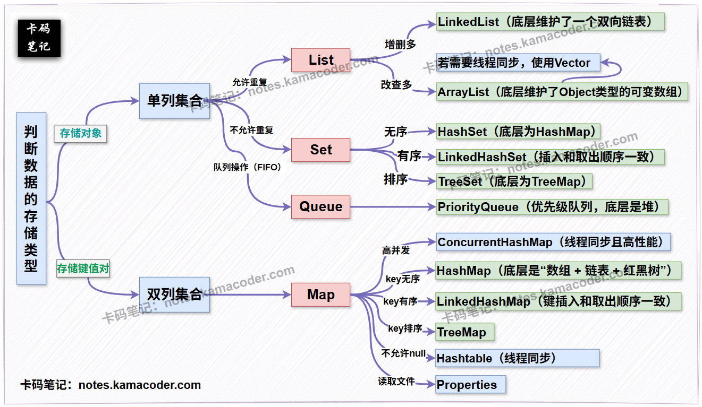

# Java常见集合类

> 来源: https://notes.kamacoder.com/java/java-collections.html

# `# Java常见集合类 

## `# 简要回答 
  - **`Collection` 接口（单列集合）**：

    - 单列集合用于存储单个元素。     - 主要的子接口包括：  

① **`List`** ：它的特点是“**有序、可重复**”。List接口的常见实现类有：`ArrayList`, `Vector` 和 `LinkedList`。  

② **`Set`** ：Set集合的特点是“**无序、不可重复**”。Set接口的常见实现类有：`HashSet`, `TreeSet`。  

③ **`Queue`** ：队列，它的特点是先进先出（FIFO）。Queue接口的常见实现类有：`PriorityQueue`。   - **`Map` 接口（双列集合）**：

    - 用于存储**键值对**（**Key-Value Pair**）。特点是“**键（Key）唯一，值（Value）可重复**”。     - Map接口的常见实现类有：：`HashMap`, `Hashtable`, `TreeMap`。  

## `# 详细回答 

### `# `Collection` 接口（单列集合） 
  - **定义**：`Collection` 是**所有单列集合的根接口**，用于存储一系列不重复或重复的单个元素。它定义了所有单列集合的通用行为，如添加、删除、判断元素是否存在等。   - **分类**：

    - **`List` 接口**：  

Δ **特点**：元素**有序**（按插入顺序），元素**可重复**。可以通过索引访问元素。  

Δ **常见的实现类**：  

① **`ArrayList`** ：底层基于**动态数组**实现。特点是**查询（随机访问）速度快**，因为可以通过索引直接定位；但**增删元素（特别是中间位置）效率相对较低**，因为可能会涉及到大量元素的移动。ArrayList类是**非线程安全的**。  

② **`LinkedList`** ：底层基于**双向链表**实现。特点是**增删元素（特别是首尾和中间位置）效率高**，因为只需修改结点指针；但**查询（随机访问）效率较低**，因为需要从头或尾遍历。LinkedList也是**非线程安全的**。  

③ **`Vector`** ：Vector类与 `ArrayList` 类似，但它是**线程安全**的（方法都加了 **`synchronized`** 关键字）。但由于**同步开销**，其性能通常低于 `ArrayList`。     - **`Set` 接口**：  

Δ **特点**：元素**无序**（不保证插入顺序），元素**不可重复**（通过 `hashCode()` 和 `equals()` 方法判断）。  

Δ **常见的实现类**：  

① **`HashSet`** ：底层其实是HashMap。特点是**增删改查效率高**，但元素**无序**。HashSet是**非线程安全的**。  

② **`LinkedHashSet`** ：继承自 `HashSet`，底层基于**哈希表和链表**实现。它在 `HashSet` 的基础上，通过链表维护了元素的**插入顺序**。LinkedHashSet也是**非线程安全的**。  

③ **`TreeSet`** ：底层基于**红黑树**实现。TreeSet类的特点是元素**有序**（按自然排序或自定义比较器排序），增删改查效率相对 `HashSet` 略低（对数时间复杂度）。TreeSet也是**非线程安全的**。     - **`Queue` 接口**：  

Δ **特点** ：遵循 **先进先出（FIFO）** 原则，常用于模拟队列数据结构。  

Δ **常见的实现类** ：  

① **`PriorityQueue`**：**优先级队列**，元素根据其自然排序或自定义比较器进行排序，每次取出的是优先级最高的元素。PriorityQueue是**非线程安全的**。 

### `# `Map` 接口（双列集合） 
  - **特点**：

    - **键（Key）是唯一的**，用于快速查找对应的值。     - **值（Value）可以重复**。     - **一个键最多映射一个值**。   - **常见的实现类**：

    - **`HashMap`** ：底层基于**哈希表**实现。它的特点是**查询、增删效率高**，但元素（键值对）**无序**。HashMap是**非线程安全的**。     - **`LinkedHashMap`** ：继承自 `HashMap`，底层基于**哈希表 和 双向链表**实现。它在 `HashMap` 的基础上，通过链表维护了键值对的**插入顺序**。LinkedHashMap是**非线程安全的**。     - **`TreeMap`** ：底层基于**红黑树**实现。它的特点是键值对**有序**（按键的自然排序或自定义比较器排序），增删改查效率相对 `HashMap` 略低。TreeMap是**非线程安全的**。     - **`Hashtable`** ：与 `HashMap` 类似，但它是**线程安全**的（方法都加了 `synchronized` 关键字），性能较低，是 Java 早期版本提供的集合类。**Hashtable的键和值都不能为 `null`** 。     - **`ConcurrentHashMap`** ：在 `JDK1.5` 之后提供的**线程安全且高性能**的双列集合实现。它通过分段锁（JDK7）或 `CAS + synchronized`（JDK8）等机制，提供了比 `Hashtable` 更好的并发性能。  

## `# 知识拓展 

### `# 图解 
  - **Java集合类的选择策略**示意图如下：  
 
 

### `# 集合与数组的区别： 
  - **元素类型**：

    - **集合**：只能存储**引用类型**。当存储基本类型时，会自动进行**装箱**（Autoboxing）转换为对应的包装类。     - **数组**：既可以存储**基本类型**，也可以存储**引用类型**。但一个数组中**不能混用**基本类型和引用类型（即数组的元素类型是固定的）。   - **元素个数（长度）**：

    - **集合**：**不固定**。集合的容量可以根据需要动态地进行扩容或缩减，可以随时添加或删除元素。     - **数组**：**固定**。数组的长度一旦指定，在创建后就不能再更改。如果需要改变数组长度，只能创建新数组并复制旧数组的元素。 

### `# 集合的好处： 
  - **动态容量**：集合不受容器大小限制，可以随时添加或删除元素，可以动态地保存任意多个对象，无需预先指定大小。这使得集合在处理不确定数量数据时非常灵活。   - **丰富操作**：集合提供了大量操作元素的方法（例如 `add()`, `remove()`, `contains()`, `size()`, `isEmpty()` 等），以及各种遍历方式（迭代器、增强for循环、Stream API），使得数据的操作和管理更加高效。
