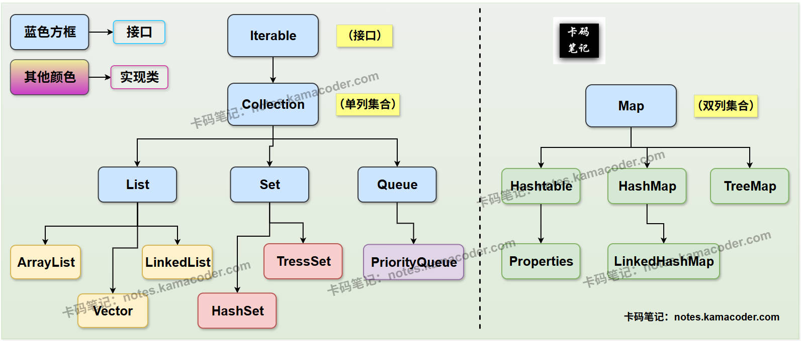

# 线程安全集合类

> 来源: https://notes.kamacoder.com/java/thread-safe-collections.html

# `# 线程安全集合类 

## `# 简要回答 
  - **`Collection` 接口（单列集合）**：

    - 单列集合用于存储单个元素。     - 主要子接口包括：  

① **`List`**：它的特点是**有序、可重复**。List接口的常见实现类有：`ArrayList` (非线程安全), `Vector` (线程安全), `LinkedList` (非线程安全)。  

② **`Set`**：Set集合的特点是**无序、不可重复**。Set接口的常见实现类有：`HashSet` (非线程安全), `TreeSet` (非线程安全)。  

③ **`Queue`**：**先进先出**（FIFO）。Queue接口的常见实现类有：`PriorityQueue` (非线程安全)。   - **`Map` 接口（双列集合）**：

    - 双列集合用于存储**键值对**（**Key-Value Pair**）。键（Key）唯一，值（Value）可重复。     - Map接口的常见实现类有：`HashMap` (非线程安全), `Hashtable` (线程安全), `TreeMap` (非线程安全), `ConcurrentHashMap` (线程安全，高性能)。 

## `# 详细回答 

### `# `Collection` 接口（单列集合） 
  - **定义**：**`Collection`** 是**所有单列集合的根接口**，用于存储一系列不重复或重复的单个元素。它定义了所有单列集合的通用行为，如添加、删除、判断元素是否存在等。   - **分类**：

    - **`List` 接口**：  

Δ **特点**：元素**有序**（按插入顺序），元素**可重复**。可以通过索引访问元素。  

Δ **常见的实现类**：  

① **`ArrayList`** ：底层基于**动态数组**实现。特点是**查询（随机访问）速度快**；但**增删元素（特别是中间位置）效率相对较低**。`ArrayList` 类是**非线程安全的**。  

② **`LinkedList`** ：底层基于**双向链表**实现。特点是**增删元素（特别是首尾和中间位置）效率高**；但**查询（随机访问）效率较低**。`LinkedList` 也是**非线程安全的**。  

③ **`Vector`** ：`Vector` 类与 `ArrayList` 类似，但它是**线程安全**的（方法都加了 **`synchronized`** 关键字）。但由于**同步开销**，其性能通常低于 `ArrayList`，是 Java 早期版本提供的集合类。     - **`Set` 接口**：  

Δ **特点**：元素**无序**（不保证插入顺序），元素**不可重复**（通过 `hashCode()` 和 `equals()` 方法判断）。  

Δ **常见的实现类**：  

① **`HashSet`** ：底层其实是 `HashMap`。特点是**增删改查效率高**，但元素**无序**。`HashSet` 是**非线程安全的**。  

② **`LinkedHashSet`** ：继承自 `HashSet`，底层基于**哈希表和链表**实现。它在 `HashSet` 的基础上，通过链表维护了元素的**插入顺序**。`LinkedHashSet` 也是**非线程安全的**。  

③ **`TreeSet`** ：底层基于**红黑树**实现。`TreeSet` 类的特点是元素**有序**（按自然排序或自定义比较器排序），增删改查效率相对 `HashSet` 略低（对数时间复杂度）。`TreeSet` 也是**非线程安全的**。     - **`Queue` 接口**：  

Δ **特点** ：遵循 **先进先出（FIFO）** 原则，常用于模拟队列数据结构。  

Δ **常见的实现类** ：  

① **`PriorityQueue`**：**优先级队列**，元素根据其自然排序或自定义比较器进行排序，每次取出的是优先级最高的元素。`PriorityQueue` 是**非线程安全的**。 

### `# `Map` 接口（双列集合） 
  - **特点**：

    - **键（Key）是唯一的**，用于快速查找对应的值。     - **值（Value）可以重复**。     - **一个键最多映射一个值**。   - **常见的实现类**：

    - **`HashMap`** ：底层基于**哈希表**实现。它的特点是**查询、增删效率高**，但元素（键值对）**无序**。`HashMap` 是**非线程安全的**。     - **`LinkedHashMap`** ：继承自 `HashMap`，底层基于**哈希表和双向链表**实现。它在 `HashMap` 的基础上，通过链表维护了键值对的**插入顺序**。`LinkedHashMap` 是**非线程安全的**。     - **`TreeMap`** ：底层基于**红黑树**实现。它的特点是键值对**有序**（按键的自然排序或自定义比较器排序），增删改查效率相对 `HashMap` 略低。`TreeMap` 是**非线程安全的**。     - **`Hashtable`** ：与 `HashMap` 类似，但它是**线程安全**的（方法都加了 `synchronized` 关键字），性能较低，是 Java 早期版本提供的集合类。`Hashtable` 的键和值都不能为 `null` 。     - **`ConcurrentHashMap`** ：在 `JDK1.5` 之后提供的**线程安全且高性能**的双列集合实现。它通过分段锁（JDK7）或 `CAS + synchronized`（JDK8）等机制，提供了比 `Hashtable` 更好的并发性能。 

## `# 知识拓展 
  - **Java集合体系图（简要版）** 如下图所示：  
 
   - **Java集合类的选择策略**，如下图所示：  
 
   - **面试官可能的追问1：在多线程环境下，除了 `Vector` 和 `Hashtable`，还有哪些推荐的线程安全集合方案？为什么？** 
    - 在多线程环境下，除了 `Vector` 和 `Hashtable`（它们因性能瓶颈而较少使用）之外，更推荐的线程安全集合方案主要有两类：     - **`java.util.concurrent` 包下的并发集合类**：  

① **`ConcurrentHashMap`** ：高性能的线程安全 `Map`。它通过更细粒度的锁机制（如分段锁或 `CAS + synchronized`）实现并发，避免了 `Hashtable` 的全局锁，提供了更高的并发吞吐量。  

② **`CopyOnWriteArrayList` / `CopyOnWriteArraySet`** ：适用于读操作远多于写操作的场景。写操作（修改、添加、删除）会复制底层数组，在新数组上修改，完成后替换旧数组。读操作无需加锁，性能极高。  

③ **`ConcurrentLinkedQueue` / `ConcurrentLinkedDeque`** ：非阻塞的线程安全队列，基于链表实现，通过 `CAS` 操作保证线程安全，性能优于阻塞队列。  

④ **`BlockingQueue` 接口及其实现**（如 `ArrayBlockingQueue`, `LinkedBlockingQueue`）：提供阻塞操作（当队列满时生产者阻塞，当队列空时消费者阻塞），常用于生产者-消费者模式。     - **使用 `Collections.synchronizedXxx()` 方法包装**：- `Collections` 工具类提供了静态方法（如 `synchronizedList()`, `synchronizedSet()`, `synchronizedMap()`），可以将非线程安全的集合（如 `ArrayList`, `HashMap`）包装成线程安全的。

      - **原理**：这些方法返回一个内部包装了原始集合，并在所有方法上添加 `synchronized` 关键字的集合。       - **缺点**：虽然线程安全，但其性能与 `Vector`/`Hashtable` 类似，都是通过粗粒度锁实现，并发性能不高。   - **面试官可能的追问2：为什么大多数 Java 集合类（如 `ArrayList`, `HashMap`）都是非线程安全的？在单线程环境下使用它们有什么好处？** 
    - **避免同步开销**：线程安全的集合需要在每次操作时进行同步（加锁），这会引入额外的性能开销（如上下文切换、锁竞争）。在单线程环境下，这些同步操作是完全不必要的负担。     - **按需同步**：Java 设计者认为，线程安全应该是按需提供的功能，而不是默认行为。开发者可以根据实际的多线程需求，选择使用线程安全的集合，或者手动进行同步控制。     - **单线程环境下的好处**：由于没有同步机制的开销，非线程安全的集合在单线程环境下**执行效率更高，吞吐量更大**。内部实现不需要考虑复杂的并发问题，**代码逻辑相对更简单**。
