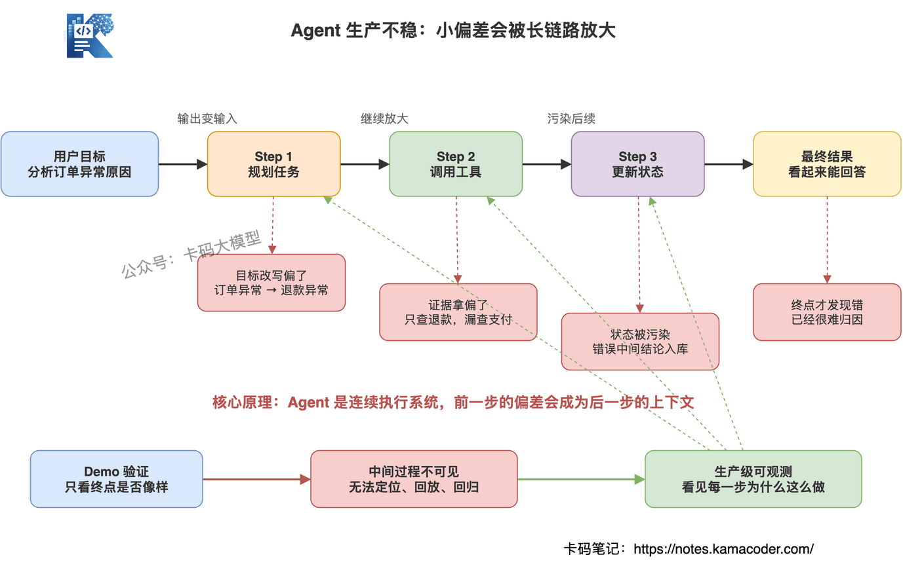
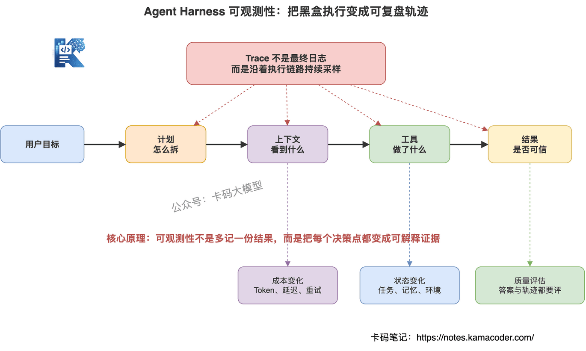
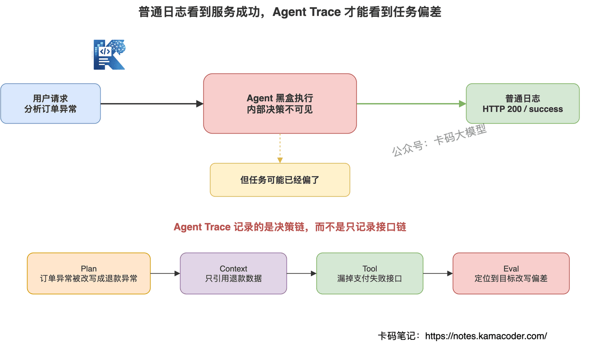
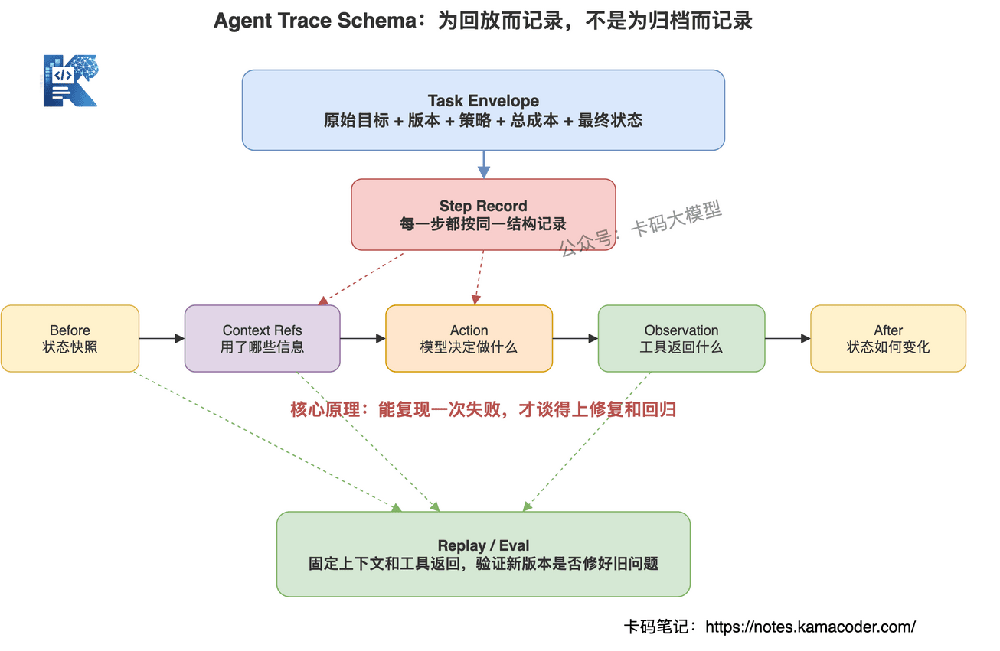
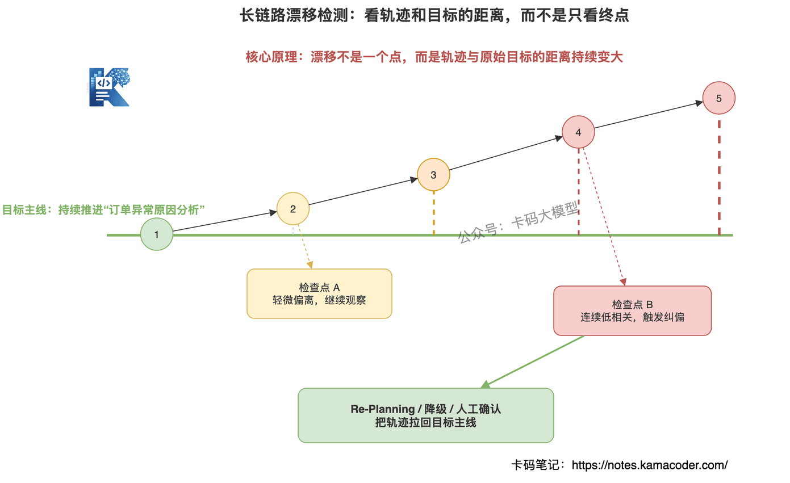
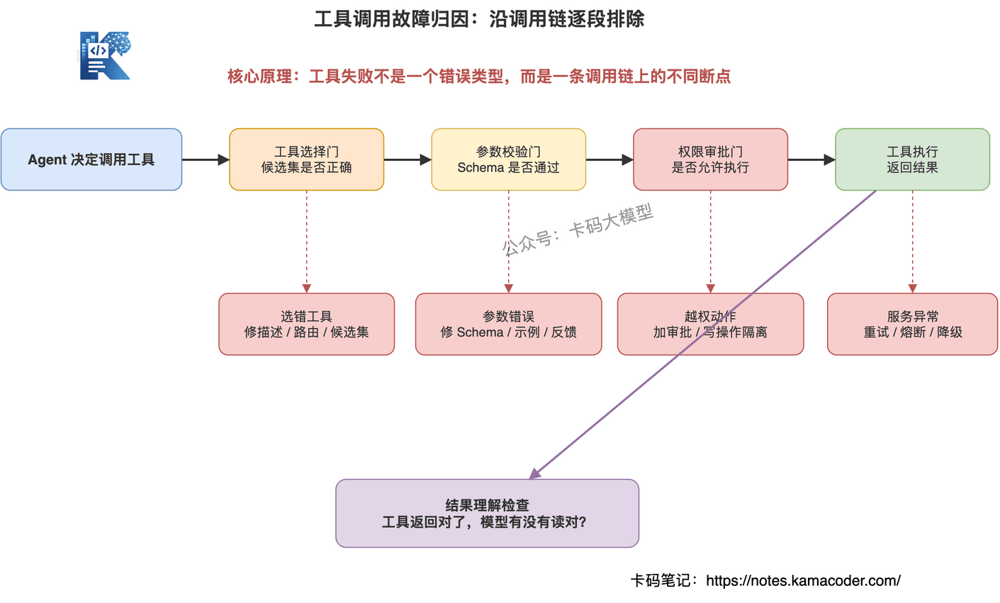
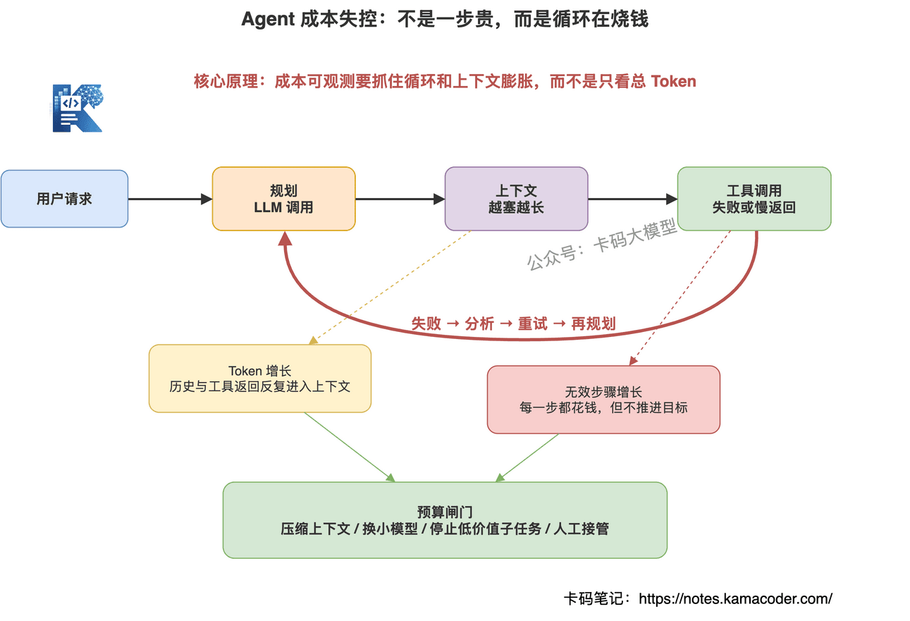
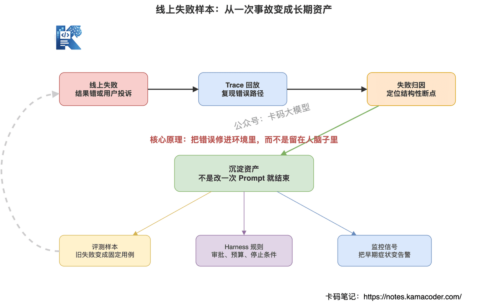
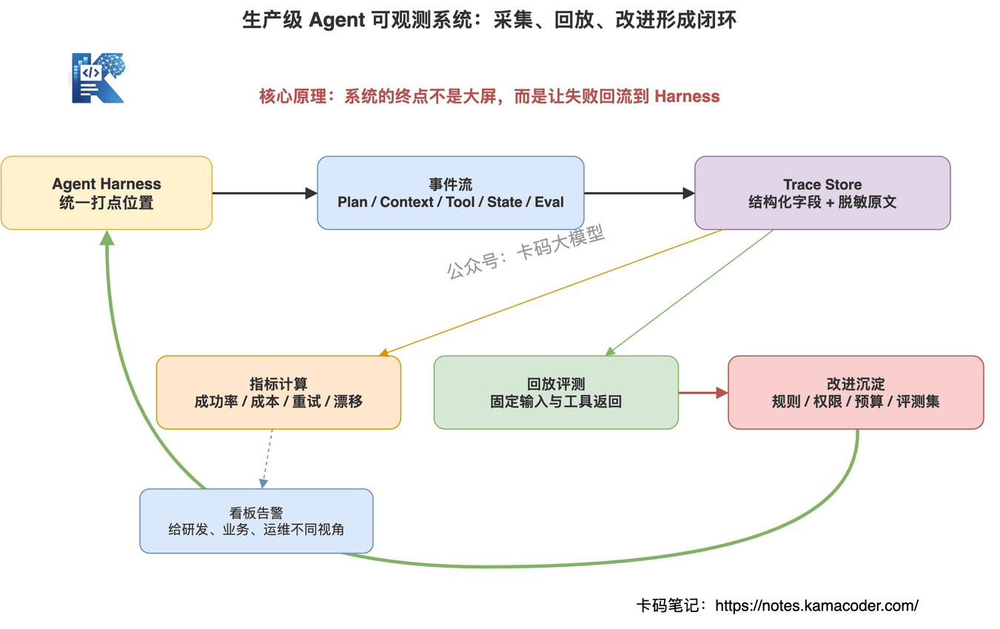

# Agent Harness 可观测性：生产级 AI 项目必须补上的一课

> 来源: https://notes.kamacoder.com/interview/llm/agent_harness_observability_interview.html

# `# Agent Harness 可观测性：生产级 AI 项目必须补上的一课 
 

前面我们聊过 Harness Engineering，讲的是 Agent 不能只靠 Prompt，要靠一整套运行环境把模型、工具、上下文、状态、评估都管起来。 

后面又聊过 Multi-Agent Harness，讲的是多 Agent 真正进生产，拼的不是 Agent 数量，而是谁的执行框架更稳。 

再往前推进一步，问题就来了。 

现在 Agent 的基础执行环境，能力上其实已经 OK 了。 

模型能推理，工具能调用，MCP 能接入，上下文能管理，任务也能拆解执行。很多产品已经不是停留在 Demo，而是真的开始往生产环境里放。 

但生产环境最残酷的地方在于： 

**Agent 能跑起来，只是第一步。** 

真正难的是：它能不能长期稳定地跑？能不能正确执行长链路复杂任务？出了错，你能不能知道它到底错在哪？ 

很多团队一开始做 Agent，关注的是"能不能完成任务"。 

一进生产才发现，更要命的问题是： 
  - 任务跑了 20 步，哪一步开始偏了？   - 工具调错了，是模型选错、参数错，还是工具返回错？   - Token 花了几万，钱到底烧在哪？   - 用户问"这个结论怎么来的"，系统能不能解释？   - 线上失败了一次，下次怎么保证不再犯？ 

如果这些问题答不上来，Agent 就是黑盒。 

**没有可观测性的 Agent，不是生产系统，是一个会自动花钱的黑盒。** 

这篇文章，我们就讲生产级 Agent 项目必须补上的一课：**Agent Harness 可观测性**。 

## `# 目录 
  - `为什么 Agent 能跑起来了，生产里还是不稳？   - `Agent Harness 可观测性到底是什么？   - `Agent 可观测性和普通日志有什么区别？   - `一个 Agent Trace 里到底要记录什么？   - `长链路任务里，怎么发现 Agent 已经跑偏了？   - `工具调用出问题，怎么定位是模型错、参数错，还是工具错？   - `Agent 成本失控，应该监控哪些指标？   - `线上失败样本，怎么沉淀成 Harness 的长期改进？   - `如果让你设计一套生产级 Agent 可观测系统，你会怎么答？ 

## `# 一、为什么 Agent 能跑起来了，生产里还是不稳？ 

面试官可能会这么问："现在模型能力、工具调用、MCP 都成熟了，为什么 Agent 真正上生产还是容易翻车？" 

这个问题很关键。 

很多录友会说："因为模型还会幻觉。" 

对，但不够。 

Agent 生产不稳，不只是模型本身的问题，而是**长链路执行系统的问题**。 

普通聊天机器人答错一句话，最多是回答质量差。 

但 Agent 不一样，它会规划任务、调用工具、读写状态、修改文件、发起请求、触发工作流。它的每一步输出，都会变成下一步输入。 

这就带来一个很大的差异： 

**Agent 的错误会沿着执行链路传播。** 

第一步目标理解偏了，后面计划全偏。 

第二步工具选错了，后面拿到的证据就是错的。 

第三步参数传错了，工具返回异常，Agent 可能又基于异常结果继续推理。 

跑到最后，结果看起来还挺像那么回事，但中间过程已经乱了。 

这也是为什么 Demo 阶段和生产阶段的关注点完全不同。 

Demo 阶段，大家看的是："它能不能跑通一次？" 

生产阶段，大家看的是： 
  - 能不能稳定跑很多次？   - 能不能在异常情况下恢复？   - 能不能控制成本？   - 能不能解释过程？   - 能不能复盘失败？   - 能不能在版本迭代后不退化？ 

如果没有可观测性，这些问题全都只能靠猜。 

 

所以面试时可以这样回答： 

**Agent 生产不稳的根因，不是某一个 Prompt 没写好，而是长链路执行过程不可见。生产级 Agent 必须把计划、上下文、工具调用、状态变化、成本和评估结果全部纳入观测，否则出了错无法定位，也无法持续改进。** 

这句话比单纯说"模型会幻觉"要高级得多。 

因为你已经从模型视角，切到了系统工程视角。 

## `# 二、Agent Harness 可观测性到底是什么？ 

面试官可能会这么问："你怎么理解 Agent Harness 可观测性？它到底要观测什么？" 

先给一个定义： 

**Agent Harness 可观测性，是对 Agent 执行过程中的目标、计划、上下文、工具调用、状态变化、成本、风险和结果质量进行全链路记录、度量、回放和评估的能力。** 

注意，不是只记录输入输出。 

Agent 真正麻烦的地方，不在输入和输出，而在中间过程。 

一次复杂任务里，Agent 可能经历这些步骤： 

用户给出目标。 

Agent 先拆计划。 

然后检索资料。 

再调用工具。 

再根据工具返回结果更新状态。 

再重新规划。 

再生成结果。 

最后还要自检或交给 Evaluator 评估。 

这里面任何一步都可能出问题。 

所以 Agent 可观测性至少要覆盖七类对象： 

**目标**：原始任务是什么，过程中有没有被改写。 

**计划**：Agent 是怎么拆任务的，每一步是否服务原始目标。 

**上下文**：哪些信息被塞进模型，来源是什么，是否过期或污染。 

**工具**：调了什么工具，参数是什么，返回了什么，耗时多久。 

**状态**：任务状态、记忆、文件、数据库记录发生了什么变化。 

**成本**：每一步消耗多少 Token、时间、工具资源。 

**评估**：最终结果是否正确，中间轨迹是否合理。 

 

这里有一个非常重要的判断： 

**可观测性不是为了事后甩锅，而是为了让 Agent 的每一次执行都能变成可分析、可复现、可改进的工程数据。** 

一个生产级 Agent 系统，不能只问"结果对不对"。 

还要问： 
  - 过程合理吗？   - 证据充分吗？   - 工具调用必要吗？   - 有没有越权动作？   - 有没有重复步骤？   - 有没有成本异常？   - 有没有潜在漂移？ 

这些问题回答清楚了，Agent 才算从"会干活"走向"可治理"。 

面试里可以这么说： 

**Agent Harness 可观测性，本质上是在 Harness 里给 Agent 装眼睛。它不只看最终答案，而是把一次任务拆成目标、计划、上下文、工具、状态、成本、评估这些可观察对象，让系统能定位错误、复盘过程、控制成本，并把失败样本沉淀成后续改进。** 

## `# 三、Agent 可观测性和普通日志有什么区别？ 

面试官可能会这么问："你们不是已经有日志、监控、链路追踪了吗？为什么 Agent 还要单独做可观测性？" 

这个问题很容易答错。 

很多人会说："我们把 Agent 输入输出打到日志里。" 

这不够。 

普通日志主要记录的是： 
  - 接口什么时候被调用   - 请求参数是什么   - 返回状态码是什么   - 服务耗时多少   - 有没有异常堆栈 

这些对传统后端系统很有用。 

但 Agent 的问题往往不是接口 500。 

Agent 最常见的问题是： 
  - 它为什么选择这个工具？   - 它为什么忽略了某段关键上下文？   - 它为什么跑到另一个子任务去了？   - 它为什么把工具返回结果理解错了？   - 它为什么重复规划了 5 次？ 

这些问题，普通日志回答不了。 

因为普通日志记录的是**发生了什么**。 

而 Agent 可观测性还要解释：**它为什么这么做**。 

 

举个例子。 

用户让 Agent："分析最近 7 天订单异常原因。" 

普通日志可能只看到： 

`POST /agent/run 200` 

`call search_orders success` 

`call query_refund_rate success` 

`LLM response success` 

看起来都成功。 

但最终结论错了。 

为什么错？ 

普通日志看不出来。 

Agent Trace 应该能看到： 
  - 原始目标是"订单异常原因"   - Agent 第一步把目标改写成了"退款率异常"   - 检索时只查了退款数据，没查支付失败数据   - 工具返回里有"支付通道超时"，但模型没有纳入结论   - 最终回答只归因到退款策略 

这样你才能定位：问题不是工具失败，而是**目标改写偏了 + 证据选择偏了**。 

这就是 Agent 可观测性和普通日志的差异。 

普通日志适合看系统有没有挂。 

Agent Trace 适合看任务有没有做对。 

面试里可以这么答： 

**传统日志关注服务状态，Agent 可观测性关注执行意图和决策过程。Agent 出问题时，HTTP 状态码可能全是 200，但任务已经偏了。所以生产级 Agent 需要结构化 Trace，把 Plan、Action、Observation、State Diff、Context Source 和 Eval Result 串起来，而不是只打输入输出日志。** 

## `# 四、一个 Agent Trace 里到底要记录什么？ 

面试官可能会这么问："如果让你设计 Agent Trace，你会记录哪些字段？" 

这个问题很实战。 

不要只说"记录输入输出"。 

一个真正可用的 Agent Trace，至少要分两层：**任务级 Trace** 和 **步骤级 Step**。 

任务级 Trace 记录这次任务的全局信息： 
  - `trace_id`：一次任务的唯一 ID   - `user_goal`：用户原始目标   - `normalized_goal`：系统改写后的目标   - `agent_version`：Agent 版本   - `model_version`：模型版本   - `policy_version`：工具权限、成本预算、审批策略版本   - `start_time` / `end_time`：任务开始结束时间   - `final_status`：成功、失败、降级、人工接管   - `total_tokens` / `total_cost`：总消耗   - `final_eval`：最终评估结果 

步骤级 Step 记录每一步发生了什么： 
  - `step_id`：第几步   - `step_type`：规划、工具调用、观察、总结、评估   - `current_goal`：当前步骤服务哪个子目标   - `context_refs`：本步使用了哪些上下文来源   - `model_input_summary`：输入摘要   - `model_output_summary`：输出摘要   - `tool_name`：调用了哪个工具   - `tool_args`：工具参数   - `tool_result_summary`：工具返回摘要   - `state_before` / `state_after`：状态变化   - `latency_ms`：耗时   - `tokens`：Token 消耗   - `risk_level`：风险等级   - `eval_result`：本步是否合理 

 

这里面有几个字段特别重要。 

第一个是 `context_refs`。 

因为很多 Agent 错误，不是模型突然变差，而是上下文给错了、给多了、给旧了。 

你必须知道本步推理到底用了哪些文档、哪些历史消息、哪些记忆。 

第二个是 `state_before` 和 `state_after`。 

Agent 是会改变环境的。它可能写文件、改数据库、创建工单、发邮件。 

如果没有状态差异记录，出事后你不知道它到底动了什么。 

第三个是 `eval_result`。 

不要等最终答案出来才评估。 

长链路任务里，中间步骤就要评估。 

因为越早发现偏差，修复成本越低。 

面试时可以这么说： 

**我会把 Agent Trace 设计成任务级和步骤级两层。任务级记录原始目标、版本、状态、总成本和最终评估；步骤级记录每一步的计划、上下文来源、模型输出、工具调用、状态差异、成本和局部评估。这样失败后既能看全局链路，也能定位到具体哪一步开始出问题。** 

## `# 五、长链路任务里，怎么发现 Agent 已经跑偏了？ 

面试官可能会这么问："Agent 跑一个长任务，执行了二三十步，你怎么判断它没有偏离原始目标？" 

这个问题和之前聊过的 Agent上下文漂移 强相关。 

长链路任务里，Agent 跑偏不是突然发生的。 

它通常是慢慢偏的。 

一开始只是处理一个小问题。 

后来这个小问题变成子任务。 

再后来子任务抢走主线。 

最后 Agent 忘了最初要干什么。 

所以漂移检测不能只看最终答案，要看执行过程里的信号。 

常见信号有五个： 

**第一，当前动作和原始目标相关度下降。** 

比如原始目标是"分析订单异常"，Agent 连续几步都在优化报表格式，这就危险了。 

**第二，子任务耗时超过预算。** 

支线任务可以做，但不能无限做。一个格式修复占掉整个任务 70% 的步骤，就说明主线被挤压了。 

**第三，重复步骤增多。** 

反复查询同一个接口，反复重写同一个计划，反复调用同一个工具，都说明 Agent 可能卡住了。 

**第四，目标表述发生变化。** 

最初是"分析订单异常原因"，中间变成"分析退款率"，再变成"输出退款建议"，这就是目标漂移。 

**第五，关键证据没有被使用。** 

工具返回里有重要异常信号，但 Agent 后续步骤完全没引用，说明注意力可能被别的信息带偏了。 

 

工程上怎么做？ 

可以加三类机制。 

**目标锚点**：每隔 N 步，把原始目标、当前计划、最近动作放在一起，让系统判断是否还在朝目标推进。 

**检查点评估**：每完成一个子任务，就评估它对原始目标的贡献，而不是只看它有没有完成。 

**漂移告警**：当相关度低、重复率高、子任务超预算时，触发重新规划、人工确认或任务终止。 

注意，这里不是让模型每一步都自我反省。 

那样成本会爆。 

更合理的是在关键节点做轻量检测。 

比如每 3 到 5 步做一次，或者在工具失败、重复调用、预算超限时触发。 

面试里可以这么答： 

**我不会只看最终结果判断 Agent 是否跑偏，而会在 Trace 里持续记录当前动作和原始目标的关系、子任务进度、重复步骤、目标改写和关键证据使用情况。工程上可以设置目标锚点和检查点评估，一旦出现连续低相关动作、重复工具调用或子任务超预算，就触发 Re-Planning、降级或人工确认。** 

## `# 六、工具调用出问题，怎么定位是模型错、参数错，还是工具错？ 

面试官可能会这么问："Agent 调工具失败了，你怎么判断问题出在模型、参数、权限，还是工具本身？" 

Agent 工具调用的问题，不能笼统归因成"模型不稳定"。 

生产里要分清楚故障类型。 

否则你根本不知道该修 Prompt、修 Schema、修权限，还是修工具服务。 

常见工具调用故障可以分成五类。 

**第一类，工具选择错误。** 

用户问订单数据，Agent 却调用了知识库搜索。 

这是模型在工具选择上出了问题，通常要优化工具描述、路由策略或工具候选集。 

**第二类，参数生成错误。** 

工具选对了，但参数错了。 

比如日期格式不对、字段名不存在、必填参数缺失。 

这类问题要靠 JSON Schema、参数校验、错误反馈和少量示例修。 

**第三类，权限边界错误。** 

Agent 调用了不该调用的写操作。 

比如用户只是询问退款规则，Agent 却尝试执行退款。 

这类问题不能靠 Prompt 兜，要靠 Tool Registry、权限策略和高风险动作审批。 

**第四类，工具服务异常。** 

工具本身超时、接口 500、依赖服务挂了。 

这不是模型问题，要走重试、熔断、降级和告警。 

**第五类，结果理解错误。** 

工具返回是对的，但 Agent 看错了。 

比如接口返回"支付失败率升高"，Agent 却归因成"退款率升高"。 

这类问题要记录工具返回摘要、证据引用、输出校验和评估结果。 

 

所以工具调用可观测性要记录完整链路： 

工具调用前，记录为什么选这个工具。 

工具调用中，记录工具名、参数、权限、耗时、重试。 

工具调用后，记录返回结果、模型如何解释结果、结果有没有被最终答案引用。 

这里有一个很实用的排查顺序： 

先看工具是否存在。 

再看权限是否允许。 

再看参数是否通过 Schema。 

再看工具服务是否成功。 

再看模型是否正确理解返回结果。 

这个顺序能把大部分问题拆开。 

面试里可以这么答： 

**工具调用失败不能一概说是模型幻觉。我会把链路拆成工具选择、参数生成、权限校验、工具执行、结果理解五段，每段都有结构化 Trace。选择错了修工具描述和路由，参数错了修 Schema 和校验，权限错了加审批边界，工具异常走熔断降级，结果理解错了做证据引用和输出评估。** 

## `# 七、Agent 成本失控，应该监控哪些指标？ 

面试官可能会这么问："Agent 一跑长任务 Token 就爆，你会怎么做成本可观测和控制？" 

这个问题很现实。 

很多 Agent Demo 看起来很猛，一到生产就贵得离谱。 

原因也很简单： 

Agent 不是一次模型调用。 

它是多次规划、多次工具调用、多次上下文拼接、多次自检、多次重试。 

一次用户请求，背后可能烧掉几十次 LLM 调用。 

所以 Agent 成本不能只看总 Token，要拆到步骤级。 

至少要监控七类指标： 

**第一，总 Token 和单步 Token。** 

总 Token 只能告诉你贵不贵，单步 Token 才能告诉你贵在哪一步。 

**第二，上下文长度。** 

很多成本不是推理难，而是上下文塞太多。尤其是把历史记录、检索文档、工具返回全部原样塞进去，成本很快爆。 

**第三，工具重试次数。** 

工具失败一次不可怕，反复失败才可怕。每次失败都可能触发新的模型分析和重试。 

**第四，重复规划次数。** 

Agent 不断 Re-Planning，说明它对任务状态不确定，或者前面步骤没有推进。 

**第五，无效步骤占比。** 

有些步骤执行了，但对目标没有贡献。这个指标越高，说明 Agent 在空转。 

**第六，模型路由成本。** 

是否所有步骤都用了大模型？简单分类、格式转换、规则判断能不能用小模型或规则？ 

**第七，端到端延迟。** 

生产系统里，时间也是成本。Agent 跑 3 分钟才给结果，很多业务场景根本不能接受。 

 

成本控制不是简单砍 Token。 

乱砍 Token，可能把质量也砍没了。 

更合理的做法是做预算分层： 

简单任务给低预算。 

复杂任务给中预算。 

高价值任务才允许高预算。 

超过预算时，不是直接失败，而是触发策略： 
  - 压缩上下文   - 换小模型   - 减少候选工具   - 停止低价值子任务   - 要求用户补充信息   - 转人工或降级输出 

面试里可以这么答： 

**Agent 成本可观测不能只看总 Token，要拆到每个 Step。重点看单步 Token、上下文长度、工具重试、重复规划、无效步骤、模型路由和端到端延迟。控制上要做预算分层，超过阈值后触发上下文压缩、小模型路由、停止低价值子任务、降级输出或人工接管，而不是简单让 Agent 继续烧。** 

## `# 八、线上失败样本，怎么沉淀成 Harness 的长期改进？ 

面试官可能会这么问："Agent 线上失败一次之后，你怎么保证下次不会再犯同样的错？" 

这个问题直接考 Harness 思维。 

很多团队处理线上失败，是这样的： 

出错了。 

查一下日志。 

改一下 Prompt。 

上线。 

然后祈祷下次别再出事。 

这不叫工程化。 

真正的 Harness 改进，要把失败样本变成资产。 

一次线上失败，至少要沉淀出四类东西： 

**第一，失败归因。** 

到底是目标理解错、上下文缺失、工具选择错、参数错、权限错、模型误读，还是评估漏掉？ 

没有归因，就没有改进方向。 

**第二，评测样本。** 

把这次失败任务变成固定测试用例。 

以后 Prompt 改了、模型换了、工具描述改了，都要跑一遍。 

**第三，Harness 规则。** 

如果是结构性错误，就要补到 Harness 里。 

比如高风险写操作必须审批，连续三次工具失败必须停止，目标相关度低于阈值必须重新规划。 

**第四，监控指标。** 

如果这次失败有早期信号，就要把信号变成告警。 

比如重复调用、成本异常、关键证据未引用、工具返回错误率升高。 

 

这就是 Harness Engineering 的核心精神： 

**不要只修这一次错误，要把错误修进环境里。** 

Agent 犯错不可怕。 

可怕的是每次犯错都靠人肉记忆，下次换个版本又犯。 

生产级 Agent 的进步，不是靠写一个完美 Prompt，而是靠持续积累失败样本、评测集、规则、监控和回归流程。 

面试里可以这么答： 

**线上失败后，我会先从 Trace 做失败归因，把问题定位到目标理解、上下文、工具、权限、状态、成本或评估某一层。然后把失败任务沉淀成评测样本，把结构性问题沉淀成 Harness 规则，把早期信号沉淀成监控指标。以后每次模型、Prompt、工具或 Harness 改动，都用这些样本做回归，避免同类错误反复出现。** 

## `# 九、如果让你设计一套生产级 Agent 可观测系统，你会怎么答？ 

面试官可能会这么问："如果让你从 0 设计一套生产级 Agent 可观测系统，你会怎么设计？" 

这类问题不要上来就讲技术组件。 

先讲目标，再讲架构。 

目标很简单： 

**让每一次 Agent 执行都可追踪、可解释、可复盘、可评估、可改进。** 

架构可以拆成六层。 

**第一层，Trace 采集层。** 

在 Harness 的关键节点打点：任务开始、计划生成、上下文组装、工具调用、状态更新、评估、任务结束。 

这里要注意，采集点应该在 Harness 里，而不是散落在各个 Agent Prompt 里。 

否则后面一定乱。 

**第二层，事件存储层。** 

把 Agent 运行事件结构化存起来。 

原始输入输出可以脱敏存储，结构化字段用于查询分析。 

比如 trace_id、step_id、tool_name、tokens、latency、status、risk_level、eval_score。 

**第三层，指标计算层。** 

从 Trace 里计算关键指标： 
  - 任务成功率   - 平均步骤数   - 平均 Token   - 工具失败率   - 重试率   - 漂移告警率   - 人工接管率   - 评测通过率 

**第四层，可视化与告警层。** 

给研发看 Trace 回放。 

给业务看任务成功率和成本。 

给运维看延迟、失败率、异常工具。 

高风险动作、成本超限、连续失败要触发告警。 

**第五层，回放与评测层。** 

线上失败任务可以一键回放。 

回放时固定输入、上下文、工具返回，判断新版本有没有修好旧问题。 

**第六层，改进闭环层。** 

把失败归因沉淀到 Prompt、工具描述、权限策略、上下文策略、评测集和 Harness 规则里。 

 

这个系统不是一天建成的。 

刚开始可以很轻。 

先把 Trace 跑通。 

再补工具调用和成本指标。 

再做失败样本回放。 

最后做评测闭环和自动告警。 

但方向一定要对： 

**不要把 Agent 可观测性做成日志大屏，要做成 Agent 改进系统。** 

面试里可以这么答： 

**我会把生产级 Agent 可观测系统拆成 Trace 采集、事件存储、指标计算、可视化告警、回放评测和改进闭环六层。Harness 在关键节点统一打点，记录计划、上下文、工具、状态、成本和评估；失败任务进入回放和评测集；结构性问题沉淀成规则、权限、预算和上下文策略。最终目标不是多一个监控大屏，而是让 Agent 的每次失败都能推动系统变稳。** 

最后说一句。 

Agent 真正进生产后，最怕的不是它犯错。 

**最怕的是它犯错了，你不知道它为什么错。** 

没有可观测性，Harness 就没有眼睛。
