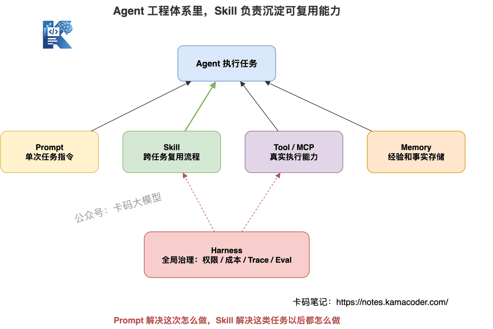
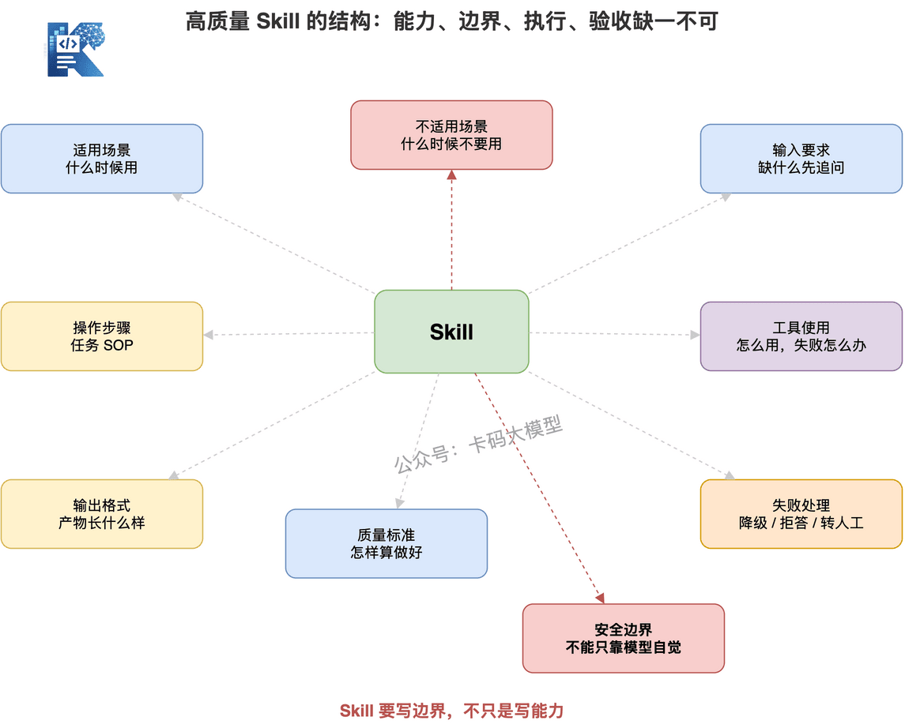
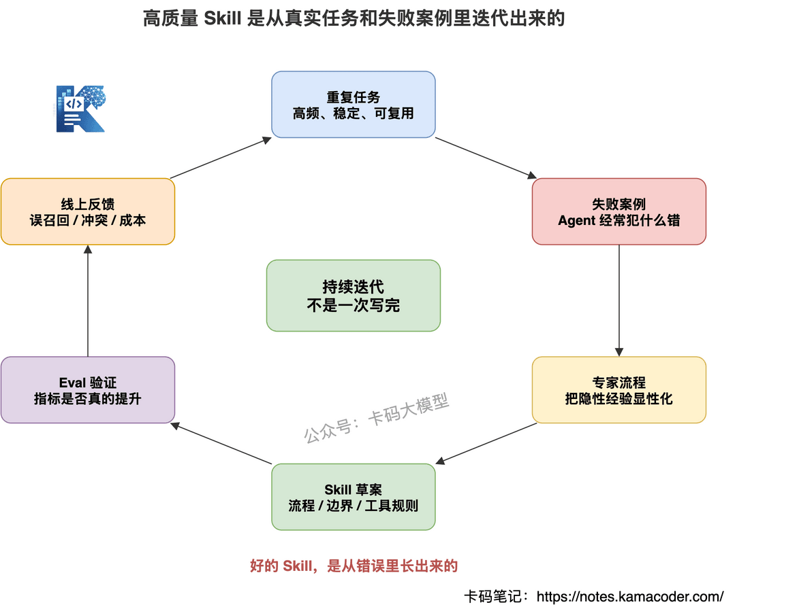
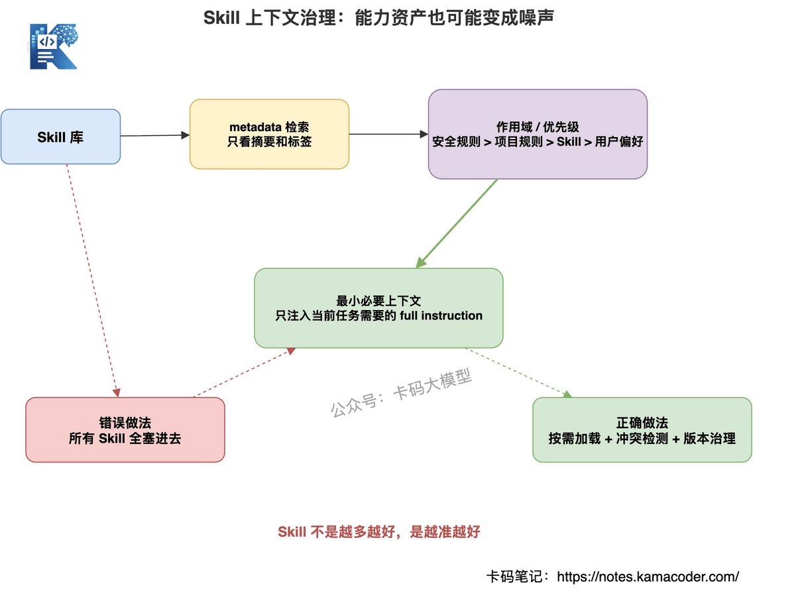
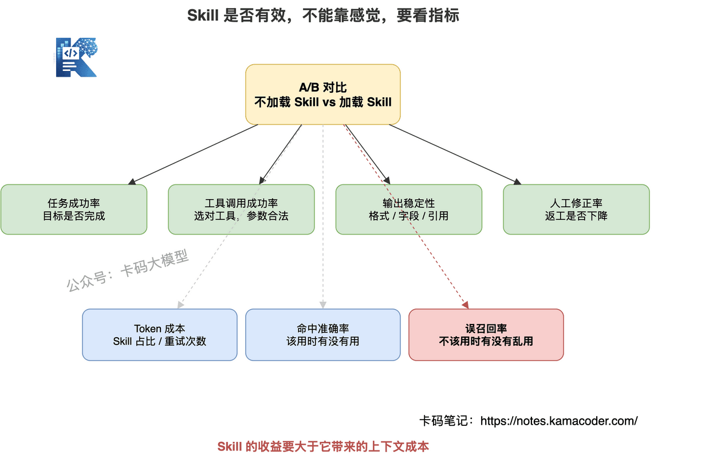
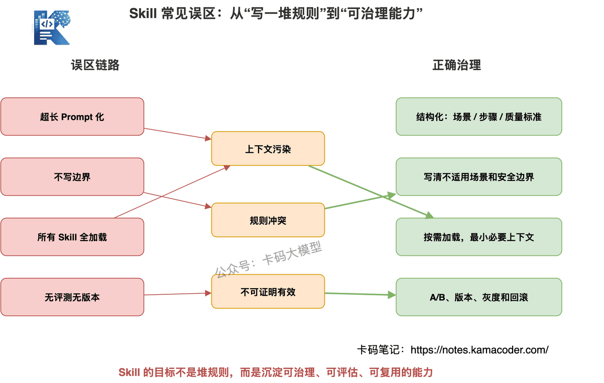

# Agent Skill 面试怎么答？如何写出高质量 Skill，真正提升 Agent 能力？

> 来源: https://notes.kamacoder.com/interview/llm/agent_skill_interview.html

# `# Agent Skill 面试怎么答？如何写出高质量 Skill，真正提升 Agent 能力？ 

最近有录友问了一个挺新的面试方向： 

"如果让你给 Agent 写 Skill，你会怎么写？" 

还有面试官会换一种问法： 

"Skill 和 Prompt 有什么区别？" 

"Skill 多了以后，怎么选择和管理？" 

"Skill 会不会污染上下文？" 

"如何评估一个 Skill 是否真的有用？" 

之前写过 Agent大厂面试题汇总，里面讲过 ReAct、Function Calling、MCP、RAG 这些 Agent 高频问题。 

也写过 未来的竞争，不是谁的 Agent 更多，而是谁的 Harness 更稳，重点讲的是生产级 Agent 怎么被 Harness 管住。 

这篇继续往下讲一个更细的点：**当 Agent 能力越来越多，怎么把重复经验沉淀成 Skill。** 

这个问题很容易答浅。 

不少录友一听 Skill，就会说： 

"Skill 不就是一段提示词吗？" 

这句话不能说完全错。 

但还不够。 

如果面试官继续追问： 
  - 什么任务适合沉淀成 Skill？   - Skill 里应该写什么，不应该写什么？   - Skill 和 Tool、MCP、Memory、Harness 有什么边界？   - Skill 太多了怎么召回？   - Skill 冲突了怎么办？   - Skill 写错了会不会误导 Agent？   - Skill 怎么进入评测和版本管理？ 

如果这些答不上来，就说明你还停留在"写 Prompt"阶段。 

**Skill 真正考的，不是你会不会写一段说明，而是你有没有把重复经验沉淀成可复用能力的工程意识。** 

这篇文章，我们就系统讲一下 Agent Skill 面试怎么答。 

## `# 目录 
  - 先说结论：Skill 不是更长的 Prompt   - Skill 到底是什么   - Skill 和 Prompt、Tool、MCP、Memory、Harness 的区别   - 一个高质量 Skill 应该包含什么   - 如何写出高质量 Skill   - Skill 如何被 Agent 选择和调用   - Skill 的上下文治理   - Skill 和生产级 Agent 的关系   - Skill 怎么评估效果   - Skill 常见误区   - 高频面试题汇总   - 面试怎么答 

## `# 一、先说结论：Skill 不是更长的 Prompt 

先给结论： 

**Skill 不是更长的 Prompt，而是把可复用经验、操作流程、工具使用方法和质量标准沉淀成 Agent 可调用的能力模块。** 

这句话要抓住两个关键词： 

第一，可复用。 

第二，能力模块。 

Prompt 更偏单次任务。 

比如用户这次让模型写一份简历点评，你在 Prompt 里告诉它： 

"先指出问题，再给出优化版本。" 

这当然有用。 

但如果你每次做简历点评，都要重新告诉模型一遍四要素框架、点评顺序、输出格式、常见问题、不要犯哪些错，那就说明这些经验应该沉淀成 Skill。 

Skill 解决的是： 

**同一类任务反复出现时，Agent 不应该每次都从零推理。** 

它应该复用已经沉淀好的流程。 

所以面试里不要把 Skill 说成"一段 Prompt"。 

更好的说法是： 

**Prompt 解决单次任务表达，Skill 解决跨任务复用。** 

这也是 Skill 的核心价值。 


 

## `# 二、Skill 到底是什么 

可以这样定义： 

**Skill 是面向某一类任务的可复用能力说明，它告诉 Agent 什么时候用、怎么做、用什么工具、按什么标准输出、遇到异常怎么处理。** 

注意，它不是简单写一句： 

```
你是一个专业的简历优化专家。

```

 

这太空了。 

一个真正有用的 Skill，应该能回答这些问题： 
  - 什么场景该用它？   - 什么场景不要用它？   - 输入需要哪些信息？   - 操作步骤是什么？   - 优先使用哪些工具？   - 输出格式是什么？   - 怎么判断结果合格？   - 信息不足怎么办？   - 工具失败怎么办？   - 有哪些安全边界？ 

举个例子。 

如果你写一个"简历项目点评 Skill"，它不应该只写： 

"帮用户优化简历项目。" 

而应该写清楚： 
  - 先判断项目描述是否有业务场景   - 再检查个人工作是否突出技术贡献   - 再看项目难点是否有挑战和解决方案   - 再给出优化版本   - 输出必须包含反面问题和正面示例   - 不要凭空编造用户没写过的经历 

这才是 Skill。 

Skill 的价值不是让模型"知道一个名词"。 

而是让模型在某类任务上更稳定地遵循流程和边界。 

## `# 三、Skill 和 Prompt、Tool、MCP、Memory、Harness 的区别 

面试官很喜欢问边界。 

因为很多人把这些概念混在一起。 

你要能讲清楚它们分别解决什么问题。 

### `# 1. Skill 和 Prompt 的区别 

Prompt 是单次指令。 

Skill 是可复用能力。 

Prompt 更像你临场告诉模型： 

"这次请按 A、B、C 做。" 

Skill 更像你提前沉淀好一套 SOP： 

"以后遇到这类任务，都按这个方法做。" 

所以： 

**Prompt 适合一次性任务，Skill 适合高频重复任务。** 

### `# 2. Skill 和 Tool 的区别 

Tool 是执行动作的能力。 

Skill 是使用能力的方法。 

比如 `search_docs` 是工具。 

它负责检索文档。 

但"什么时候检索、检索几轮、如何判断检索结果够不够、没证据时怎么拒答"，这些不是 Tool 本身解决的。 

这是 Skill 可以沉淀的流程。 

所以： 

**Tool 解决能不能做，Skill 解决怎么做得更稳。** 

### `# 3. Skill 和 MCP 的区别 

MCP 是工具接入协议。 

它解决的是工具怎么标准化暴露给模型或 Agent 应用。 

在 未来的竞争，不是谁的 Agent 更多，而是谁的 Harness 更稳 里，我们讲过 MCP 接入不能裸奔。MCP 提供的是工具生态，Harness 提供的是治理。 

Skill 不负责协议。 

Skill 负责告诉 Agent： 
  - 当前任务该不该用这个 MCP 工具   - 用之前要检查什么   - 调用结果怎么解释   - 高风险动作怎么处理 

所以： 

**MCP 提供工具生态，Skill 提供任务方法论。** 

### `# 4. Skill 和 Memory 的区别 

Memory 是经验和事实的存储。 

Skill 是可执行的任务方法。 

Memory 里可能存着： 

"用户喜欢简洁回答。" 

"某个项目曾经因为缓存击穿出过事故。" 

Skill 里应该写： 

"做项目点评时，先看业务场景，再看技术贡献，再看难点，再看收获。" 

Memory 更像材料库。 

Skill 更像操作手册。 

### `# 5. Skill 和 Harness 的区别 

Harness 是全局运行时治理。 

它负责： 
  - 编排   - 工具权限   - 状态管理   - 成本预算   - 轨迹评估   - 安全边界 

Skill 是局部任务能力。 

比如"写文档 Skill"、"分析日志 Skill"、"做 RAG 评估 Skill"。 

所以： 

**Skill 让局部任务做得更稳，Harness 让整个 Agent 系统跑得更稳。** 

之前写过 未来的竞争，不是谁的 Agent 更多，而是谁的 Harness 更稳，那篇讲的是全局执行框架。 

这篇讲的是局部能力沉淀。 

## `# 四、一个高质量 Skill 应该包含什么 

写 Skill 不能只写"你要专业"。 

这类话没什么工程价值。 

一个高质量 Skill，至少应该包含九个部分。 


 

### `# 1. 适用场景 

什么时候应该用这个 Skill？ 

比如： 

"当用户要求分析简历项目、优化项目经历、点评个人工作时使用。" 

适用场景越清楚，Agent 越不容易误用。 

### `# 2. 不适用场景 

什么时候不要用？ 

这点很重要。 

很多 Skill 只写能做什么，不写不能做什么。 

结果 Agent 一遇到相似任务就乱套。 

比如简历点评 Skill 不应该用于： 
  - 生成虚假实习经历   - 伪造项目成果   - 编造公司背景   - 替用户写不真实的技术细节 

**Skill 要写边界，不只是写能力。** 

### `# 3. 输入要求 

Skill 要说清楚，需要哪些输入。 

比如： 
  - 原始简历内容   - 目标岗位   - 项目背景   - 技术栈   - 用户想优化哪一部分 

如果输入不足，Skill 应该要求 Agent 先追问，而不是硬编。 

### `# 4. 操作步骤 

Skill 最重要的是流程。 

比如： 
  - 先识别任务类型   - 再检查信息完整性   - 再按框架分析   - 再输出优化建议   - 最后给出可直接替换的版本 

步骤要明确，但不要写死到无法适配。 

### `# 5. 工具使用 

如果任务需要工具，要写清楚： 
  - 优先用哪个工具   - 什么情况下不用工具   - 工具失败怎么办   - 工具结果如何验证 

注意，Skill 不能绕过 Tool Registry。 

它只能指导工具使用方式，不能替代权限治理。 

### `# 6. 输出格式 

Agent 最容易不稳定的地方，就是输出格式。 

Skill 里应该写清楚： 
  - 最终输出分几部分   - 是否需要表格   - 是否需要代码   - 是否需要引用来源   - 是否需要给出风险提示 

### `# 7. 质量标准 

Skill 要告诉 Agent，什么叫做好。 

比如： 
  - 是否解决用户目标   - 是否有事实依据   - 是否结构清晰   - 是否可执行   - 是否避免无关展开 

没有质量标准，Agent 只会生成"看起来像完成了"的结果。 

### `# 8. 失败处理 

真实任务里经常失败。 

Skill 要写： 
  - 信息不足怎么办   - 工具失败怎么办   - 证据不足怎么办   - 权限不足怎么办   - 结果冲突怎么办 

高质量 Skill 一定要有兜底策略。 

### `# 9. 安全边界 

比如： 
  - 不要编造事实   - 不要绕过权限   - 不要执行高风险动作   - 不要输出敏感信息   - 不要把不确定内容说成确定事实 

这里要强调： 

**安全边界不能只写在 Skill 里，工程层也要有拦截。** 

Skill 是提醒。 

Harness 和 Tool Registry 才是强制执行。 

## `# 五、如何写出高质量 Skill 

好的 Skill 不是坐在工位上拍脑袋写出来的。 

它是从真实任务里抽出来的。 

我建议用这条路径： 

**重复任务 → 失败案例 → 专家流程 → 工具经验 → Eval 反馈 → Skill 迭代。** 


 

### `# 1. 从重复任务里提炼 

不是所有任务都值得写 Skill。 

Skill 适合高频、重复、流程相对稳定的任务。 

比如： 
  - 简历点评   - 日志排查   - RAG 评估   - SQL 优化   - 文档生成   - PR Review   - 数据分析报告 

如果任务只出现一次，写 Skill 成本可能不划算。 

### `# 2. 从失败案例里补规则 

Skill 最有价值的来源，是 Agent 犯过的错。 

比如 Agent 做 RAG 评估时，经常只看最终答案，不看证据来源。 

那 Skill 里就要补： 

"必须检查答案关键结论是否被检索文档支持。" 

这和 RAG落地最难的地方在哪 里讲的生成忠实度是一回事：RAG 不是只要召回文档，还要检查回答是否真的被证据支持。 

Agent 写代码时经常忘记跑测试。 

那 Skill 里就要补： 

"修改代码后优先运行相关最小测试。" 

**好的 Skill，是从错误里长出来的。** 

之前在 Agent系统如何约束大模型幻觉 里讲过，Agent 幻觉不能只靠一句 Prompt 兜住，要靠工具、证据、输出校验和兜底机制。 

Skill 也应该从这些失败案例里吸收经验，但要记住：**Skill 是软约束，工程拦截才是硬约束。** 

### `# 3. 从专家流程里抽 SOP 

很多专家做事有隐性流程。 

比如一个资深工程师排查线上问题，不会一上来就改代码。 

他会先看影响范围，再看日志，再看最近变更，再验证假设。 

这种流程就适合沉淀成 Skill。 

Skill 的价值，就是把专家隐性经验显性化。 

### `# 4. 从工具使用经验里沉淀最佳实践 

有些工具很强，但用不好。 

比如浏览器自动化、数据库查询、RAG 检索、日志平台、代码搜索。 

Skill 可以写清楚： 
  - 查询前先缩小范围   - 不要一次取太多结果   - 先读 schema 再写 SQL   - 搜不到时换关键词   - 工具结果要二次校验 

这会显著提升 Agent 的稳定性。 

### `# 5. 从 Eval 结果里迭代 

Skill 写完不是结束。 

要看效果。 

如果某个 Skill 加载后，任务成功率上升、工具失败率下降、格式错误率降低，那说明它有效。 

如果 Skill 加载后 Token 暴涨，误召回增加，反而说明它可能污染上下文。 

所以： 

**Skill 要进入评测闭环，不是写完就放在那里。** 

## `# 六、Skill 如何被 Agent 选择和调用 

Skill 多了以后，最大的问题不是怎么写。 

而是怎么选。 

面试官很可能会问： 

"如果系统里有几十个 Skill，Agent 怎么知道该用哪个？" 

可以分四种方式。 


 

### `# 1. 显式指定 

用户或系统直接指定： 

"这次用简历点评 Skill。" 

这种最稳定。 

适合后台任务、固定流程、自动化工作流。 

### `# 2. 任务描述匹配 

系统根据用户输入和 Skill 描述做匹配。 

比如用户说： 

"帮我优化一下项目经历。" 

匹配到简历项目优化 Skill。 

这种方式灵活，但依赖 Skill 描述质量。 

### `# 3. Metadata 检索 

每个 Skill 都应该有 metadata： 
  - name   - description   - domain   - task_type   - input_requirements   - tools   - risk_level   - version 

系统可以根据 metadata 做检索和路由。 

这比全文塞上下文更可控。 

### `# 4. Harness 控制注入 

生产系统里，不应该让 Agent 自己随便加载所有 Skill。 

Harness 应该根据任务类型、用户权限、上下文预算、风险等级决定注入哪些 Skill。 

这和前面讲的 Harness 思路是一致的： 

**Agent 可以建议用 Skill，但 Harness 应该控制 Skill 注入。** 

### `# 5. Skill 选择失败怎么办 

Skill 召回错了，会误导 Agent。 

比如用户只是问"怎么写简历"，系统却加载了"简历造假美化 Skill"。 

这就危险了。 

所以要有： 
  - Skill 命中置信度   - 多 Skill 冲突检测   - 低置信度时追问用户   - 高风险 Skill 需要显式确认   - Skill 使用记录进入 Trace 

## `# 七、Skill 的上下文治理 

Skill 多了以后，会出现一个新问题： 

**Skill 本来是能力资产，但管理不好会变成上下文噪声。** 

很多团队一开始很兴奋，写了几十个 Skill。 

然后每次任务都塞一堆进去。 

结果模型看了一大堆不相关规则，反而更容易跑偏。 

这就是 Skill 污染上下文。 


 

### `# 1. 按需加载 

不要把所有 Skill 都放进上下文。 

只加载当前任务需要的最小集合。 

Skill 应该像工具一样按需调用，而不是像背景音乐一样一直播放。 

### `# 2. 分层摘要 

Skill 可以分层： 
  - metadata：用于检索和路由   - summary：用于快速判断是否适用   - full instruction：真正执行时再加载 

这样可以减少上下文浪费。 

### `# 3. 优先级和作用域 

不同 Skill 可能冲突。 

比如一个 Skill 要求"回答尽量简洁"。 

另一个 Skill 要求"详细解释每一步"。 

这时要有优先级。 

通常可以按： 

系统安全规则 > 项目级规则 > 任务级 Skill > 用户偏好。 

作用域也要清楚。 

不要让一个局部 Skill 影响全局任务。 

### `# 4. 版本管理 

Skill 会迭代。 

每次修改都应该有版本。 

至少要记录： 
  - 修改原因   - 影响场景   - 评测结果   - 回滚方式 

否则 Skill 越改越乱。 

### `# 5. 过期 Skill 淘汰 

业务会变，工具会变，模型能力也会变。 

旧 Skill 可能不再适用。 

所以要定期检查： 
  - 是否还被命中   - 是否提升指标   - 是否产生误导   - 是否和新工具冲突 

无效 Skill 要下线。 

**Skill 不是越多越好，是越准越好。** 

## `# 八、Skill 和生产级 Agent 的关系 

Skill 不是孤立存在的。 

它要放在 Agent 工程体系里看。 

可以这样理解： 
  - Prompt：单次任务指令   - Skill：局部可复用能力   - Tool：真实执行动作   - MCP：工具接入协议   - Memory：经验和事实存储   - Harness：全局运行时治理 

如果没有 Skill，Agent 每次处理复杂任务都要从零推理。 

如果没有 Tool，Skill 只是纸上流程。 

如果没有 Memory，Skill 无法利用历史经验。 

如果没有 Harness，Skill 可能被乱加载、乱组合、乱执行。 

所以生产级 Agent 不是只靠某一层。 

而是这些层一起工作。 

尤其要注意： 

**Skill 不能替代 Harness，也不能替代 Tool Registry。** 

比如 Skill 里写： 

"删除文件前必须确认。" 

这有帮助。 

但真正的删除权限、确认流程、审计日志，必须在工具治理层强制执行。 

只把安全写在 Skill 里，不做工程拦截，生产上是不够的。 

## `# 九、Skill 怎么评估效果 

面试里说 Skill，有一个很重要的加分点： 

**不要只说写了 Skill，要说怎么证明它有用。** 

如果你说： 

"我加了 Skill 后感觉效果更好了。" 

这不算工程结论。 

要看指标。 


 

### `# 1. 任务成功率 

加载 Skill 后，任务是否更容易完成？ 

比如： 
  - 简历点评是否覆盖四要素   - 日志排查是否定位到根因   - 代码修改是否通过测试   - RAG 回答是否有证据支持 

### `# 2. 工具调用成功率 

Skill 是否减少了错误工具调用？ 

比如： 
  - 工具选错率下降   - 参数非法率下降   - 无意义重复调用减少   - 高风险工具误调用减少 

### `# 3. 输出稳定性 

看输出是否更稳定。 

比如： 
  - 格式错误率   - 字段缺失率   - 引用缺失率   - 不按流程输出的比例 

### `# 4. 人工修正率 

如果 Skill 有效，人工修正应该减少。 

特别是面向内容生成、代码修改、数据分析的任务。 

人工返工率比"看起来不错"更有说服力。 

### `# 5. Token 消耗 

Skill 不是免费的。 

加载 Skill 会占上下文。 

如果 Skill 很长，但收益很小，那不划算。 

所以要看： 
  - Skill Token 占比   - 总 Token 是否上升   - 重试次数是否下降   - 单任务成本是否下降 

### `# 6. Skill 命中准确率和误召回率 

这是 Skill 系统特有指标。 

Skill 命中准确率：该用的时候有没有用。 

Skill 误召回率：不该用的时候有没有乱用。 

误召回很危险。 

因为错误 Skill 会给 Agent 带来错误方向。 

### `# 7. A/B 测试 

可以做对比： 
  - 不加载 Skill vs 加载 Skill   - 旧 Skill vs 新 Skill   - 单 Skill vs Skill 组合   - 全量 Skill vs 最小必要 Skill 

有对比，才能知道 Skill 是真的有效，还是只是心理安慰。 

## `# 十、Skill 常见误区 

这里面试也很容易问。 

因为很多团队引入 Skill 后，确实会踩坑。 


 

### `# 1. 把 Skill 写成超长 Prompt 

Skill 不是越长越好。 

太长会挤占上下文，还会让模型抓不住重点。 

好的 Skill 应该结构清楚、边界明确、只包含必要信息。 

### `# 2. 只写步骤，不写边界 

只写"怎么做"，不写"什么时候不要做"，很容易误用。 

Skill 必须写不适用场景和风险边界。 

### `# 3. Skill 互相冲突 

多个 Skill 同时加载时，规则可能冲突。 

所以要有优先级、作用域和冲突检测。 

### `# 4. 工具细节写得太死 

如果 Skill 把某个工具的参数写死，工具一升级就坏。 

Skill 应该描述工具使用原则，具体 schema 以 Tool Registry 为准。 

### `# 5. Skill 不更新 

业务变了，工具变了，模型能力变了，Skill 也要变。 

过期 Skill 会误导 Agent。 

### `# 6. 所有任务都强制加载 Skill 

这会造成上下文污染。 

Skill 应该按需加载。 

不是越多越专业。 

### `# 7. 没有 eval，只靠感觉迭代 

没有指标，就不知道 Skill 有没有价值。 

最后会变成一堆没人敢删的历史规则。 

### `# 8. 把安全约束只写在 Skill 里 

这是很危险的误区。 

Skill 可以提醒模型不要越权。 

但真正的权限、审批、审计，必须在 Harness 和 Tool Registry 层实现。 

## `# 十一、高频面试题汇总 

下面这些问题，录友可以一起准备。 

### `# 1. Skill 是什么？ 

Skill 是面向某一类任务的可复用能力模块，沉淀任务边界、操作流程、工具使用方法、输出格式、质量标准和失败处理。 

### `# 2. Skill 和 Prompt 有什么区别？ 

Prompt 是单次任务指令。 

Skill 是跨任务复用的能力说明。 

Prompt 解决这次怎么做，Skill 解决这类任务以后都怎么做。 

### `# 3. Skill 和 Tool 有什么区别？ 

Tool 是执行动作。 

Skill 是指导 Agent 何时、如何、按什么标准使用能力。 

Tool 解决能不能做，Skill 解决怎么做得稳。 

### `# 4. Skill 和 MCP 有什么关系？ 

MCP 是工具接入协议，让工具更标准化。 

Skill 可以描述某类任务中如何使用这些工具，但不能替代 MCP 或 Tool Registry。 

### `# 5. Skill 和 Memory 有什么区别？ 

Memory 存经验和事实。 

Skill 存可执行的方法和流程。 

Memory 更像材料库，Skill 更像操作手册。 

### `# 6. 什么任务适合沉淀成 Skill？ 

高频、重复、流程稳定、质量标准明确、容易出错但可以通过流程约束改善的任务。 

比如简历点评、代码 Review、日志排查、RAG 评估、文档生成、数据分析。 

### `# 7. 如何设计一个高质量 Skill？ 

要写清适用场景、不适用场景、输入要求、操作步骤、工具使用、输出格式、质量标准、失败处理和安全边界。 

### `# 8. Skill 太多以后怎么选择？ 

可以通过显式指定、任务描述匹配、metadata 检索和 Harness 路由选择。 

生产里不应该把所有 Skill 全塞进上下文。 

### `# 9. Skill 会不会污染上下文？ 

会。 

如果 Skill 召回错误、注入过多、内容过长、规则冲突，就会污染上下文。 

解决方式是按需加载、分层摘要、优先级、作用域和版本治理。 

### `# 10. Skill 冲突怎么办？ 

要设计优先级和作用域。 

通常系统安全规则 > 项目级规则 > 任务级 Skill > 用户偏好。 

冲突严重时，应该由 Harness 裁决或要求用户确认。 

### `# 11. Skill 如何版本管理？ 

每次修改要记录版本、修改原因、影响场景、评测结果和回滚方式。 

线上 Skill 要能灰度、回滚和对比。 

### `# 12. Skill 如何评估效果？ 

看任务成功率、工具调用成功率、格式错误率、人工修正率、Token 成本、Skill 命中准确率和误召回率。 

最好做 A/B 测试。 

### `# 13. Skill 能不能替代工具治理？ 

不能。 

Skill 是软约束。 

Tool Registry 和 Harness 是硬约束。 

高风险动作必须在工程层拦截。 

### `# 14. Skill 在 Multi-Agent 里怎么用？ 

不同 Agent 可以有不同 Skill。 

但 Skill 注入要由 Harness 管控，避免多个 Agent 加载冲突 Skill，或者把局部 Skill 扩散成全局规则。 

### `# 15. 如何从失败案例迭代 Skill？ 

先做事故归因。 

如果是流程遗漏，就补步骤。 

如果是工具误用，就补工具使用规则。 

如果是边界不清，就补不适用场景。 

如果是输出不稳定，就补格式和质量标准。 

然后跑回归评测。 

## `# 十二、面试怎么答 

如果面试官问： 

"你怎么理解 Agent Skill？如何写一个高质量 Skill？" 

可以这样答： 

"我不会把 Skill 理解成一段更长的 Prompt。Prompt 更偏单次任务指令，而 Skill 的价值是把一类高频任务中的流程、边界、工具使用经验、输出标准和失败处理沉淀成可复用能力。 

一个高质量 Skill，首先要写清适用场景和不适用场景，避免误召回。其次要写输入要求、操作步骤、工具使用原则、输出格式和质量标准。最后还要写失败处理和安全边界，比如信息不足时先追问，工具失败时降级处理，证据不足时不要编造，高风险动作不能只靠模型自觉。 

我认为 Skill 不能孤立看。 

它和 Prompt、Tool、Memory、MCP、Harness 都有边界。 

Prompt 是单次指令，Tool 是执行能力，MCP 是工具协议，Memory 是经验存储，Harness 是全局治理，而 Skill 是局部可复用任务能力。 

Skill 可以指导 Agent 怎么做，但不能替代 Tool Registry 的权限控制和 Harness 的运行时约束。 

在生产系统里，Skill 还要做选择和治理。不能把所有 Skill 都塞进上下文，而应该通过任务类型、metadata、置信度和 Harness 路由按需加载。 

Skill 太多会造成上下文污染和规则冲突，所以要有优先级、作用域、版本管理和过期淘汰。 

最后，Skill 是否有效不能靠感觉，要看评估指标。比如任务成功率、工具调用成功率、格式错误率、人工修正率、Token 成本、Skill 命中准确率和误召回率。 

最好通过 A/B 测试比较加载 Skill 前后的效果。" 

这个回答的重点不是"我会写 Skill 文件"。 

而是告诉面试官： 

**你知道怎么把重复经验沉淀成能力，也知道怎么治理这些能力。** 

这才是 Skill 面试真正想考的东西。
