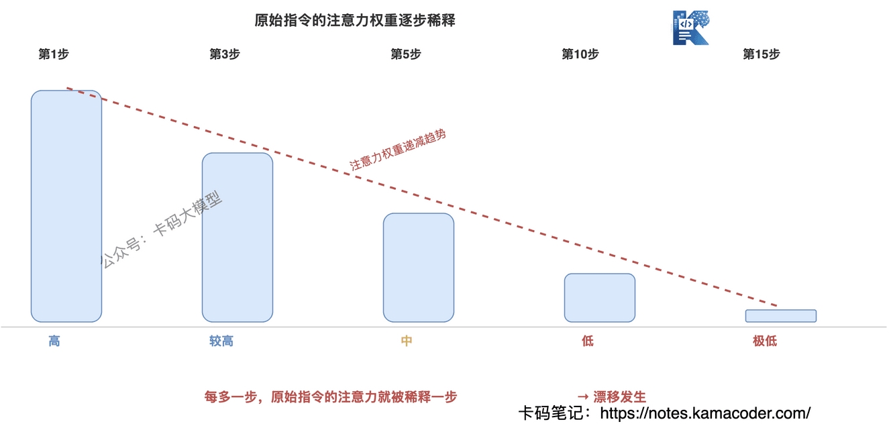
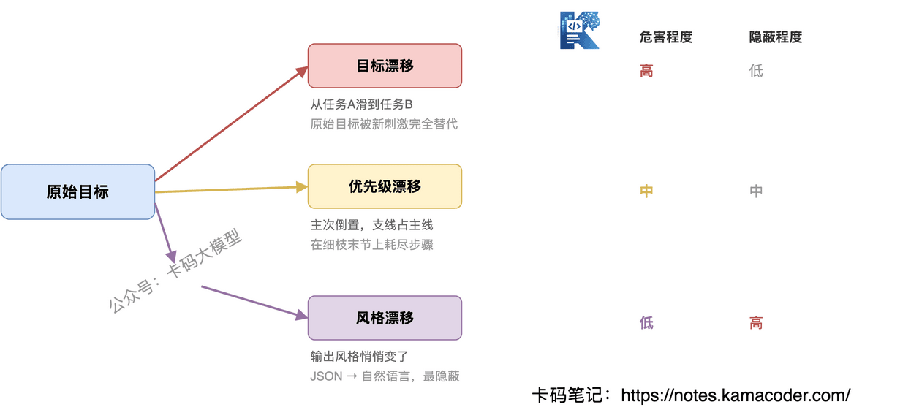
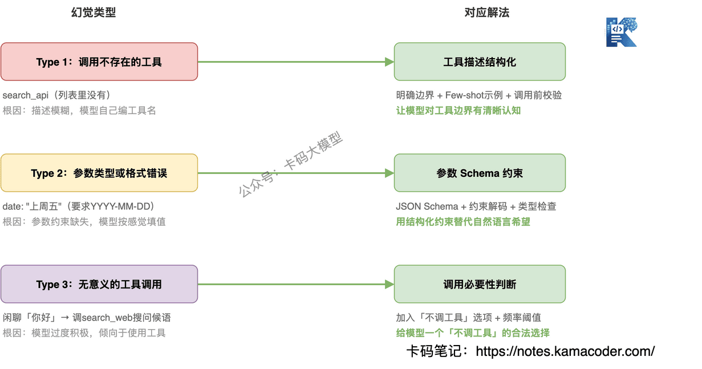
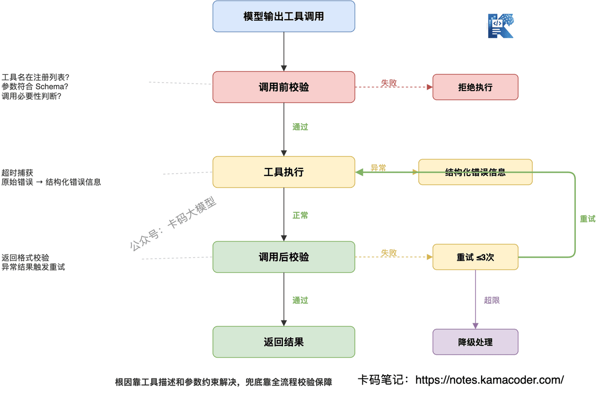

# Agent上下文漂移与工具调用幻觉：深度拆解与面试回答思路

> 来源: https://notes.kamacoder.com/interview/llm/agent_drift_hallucination_interview.html

# `# Agent上下文漂移与工具调用幻觉：深度拆解与面试回答思路 
 

之前分享了录友四面字节Agent开发岗的面经，里面就有一个很不错的面试问题：“如何解决 Agent 的上下文漂移以及工具调用幻觉类问题” 

有的面试官会这么问："你的 Agent 跑了10轮之后还靠谱吗" 

很多录友都答不上来。 

**不稳在哪？就两个核心问题：上下文漂移和工具调用幻觉**。 

Agent 跑几步就偏了，忘了原始任务；该调工具的时候调错了，不该调的时候瞎调。 

这篇文章，我们好好拆解一下这两个问题，**讲清楚为什么跑偏、为什么会有幻觉、怎么发现、怎么解决**。 

## `# 目录 
  - 上下文漂移：Agent 为什么跑着跑着就偏了？

    - 现象：目标悄悄变了     - 根因：从注意力机制理解"为什么偏"     - 漂移的三种模式     - 检测信号：怎么知道漂移了？     - 解法分层：从简到难，每个都有代价   - 工具调用幻觉：Agent 为什么调了不该调的工具？

    - 现象：不是不会调，是调错了     - 根因：从概率生成理解"为什么幻觉"     - 幻觉的三种类型     - 解法：每种幻觉对应不同策略     - 通用防线：调用全流程校验   - 面试怎么答 

## `# 一、上下文漂移：Agent 为什么跑着跑着就偏了？ 

### `# 现象：目标悄悄变了 

你让 Agent "分析这份销售数据，找出下滑原因"，理想流程是：读数据 → 分析趋势 → 定位原因 → 输出报告。 

实际跑起来可能是：读数据 → 发现格式有问题，开始修格式 → 修完格式又发现某个字段缺失，去查文档 → 查文档时被另一段内容吸引，开始做竞品分析 → 跑了10步，原始任务"找出下滑原因"一个字没碰。 

**这就是上下文漂移：Agent 的执行方向，悄悄偏离了原始目标。** 

不是模型"变傻了"，是它在每一步都在做"当前上下文下最合理的下一步"，但"最合理"不等于"最符合原始目标"。 

### `# 根因：从注意力机制理解"为什么偏" 

一些录友会说"Agent 跑久了会偏"，但讲不清为什么偏。要真正理解漂移，得回到 Transformer 本身。 

Transformer大厂面试题汇总 里讲过 Self-Attention 的核心机制：每个 Token 对所有 Token 计算注意力权重，加权求和得到表示。这个机制带来了两个直接后果： 

**第一，注意力有"近因效应"。** Self-Attention 的权重不是均匀分配的，模型倾向于给最近的 Token 更高的权重。 

原始指令在最前面，中间隔着大量中间结果，到后面几步时，原始指令的注意力权重已经被"稀释"了。Agent 不是"忘了"目标，是目标在它的注意力里占比越来越低。 

**第二，中间结果会"抢焦点"。** Agent 每一步的输出都追加到上下文里，这些中间结果本身就是新的刺激信号。 

比如修格式时产生的日志、查文档时看到的内容，都会吸引模型的注意力。上下文越长，干扰信号越多，原始目标越容易被淹没。 

这和 Transformer 那篇讲的 **"Lost in Middle"** 是同一类问题：上下文中间的信息最容易被忽略，而原始指令恰好被推到了"中间"甚至"开头"的位置。 

**总结一句话：上下文漂移的本质，是原始目标在注意力分配中逐渐失焦。** 

 

### `# 漂移的三种模式 

不是所有漂移都一样，识别模式才能对症下药： 

**目标漂移**：Agent 从任务 A 滑到任务 B。本来在分析销售数据，跑着跑去做竞品分析了。原始目标被新刺激完全替代。 

**优先级漂移**：任务没变，但主次倒置了。本来"找出下滑原因"是主线、"修格式"是支线，结果 Agent 在支线上花了大半步骤，主线反而没推进。 

**风格漂移**：目标和优先级都没偏，但输出风格变了。开头按要求输出结构化 JSON，跑了几步开始写大段自然语言解释。这种漂移最隐蔽，不影响任务完成但影响下游消费。 

 

### `# 检测信号：怎么知道漂移了？ 

漂移不是突然发生的，是有信号的。关键是你得监控这几个指标： 
  - **当前动作与原始目标的关联度**：如果连续两步的输出和原始目标没有直接关系，大概率在漂   - **步骤重复率**：Agent 反复执行同一类操作（比如反复修格式），说明卡在子任务里出不来了   - **目标完成进度**：跑了N步，原始目标的完成度还是0%，明显偏了 

工程上可以做一个简单的漂移检测：每执行K步，把当前状态和原始目标丢给模型，让它判断"当前是否还在朝目标前进"。成本不高，但能有效抓住漂移。 

### `# 解法分层：从简到难，每个都有代价 

**第一层：任务分解 + 子目标检查点** 

把复杂任务拆成有序子任务，每个子任务有明确的完成标准。Agent 完成一个子任务后，先检查"原始目标推进了吗"，再决定下一步。 

这是最简单也最有效的方式，适用于大部分场景。代价是：需要提前设计任务分解策略，对简单任务来说增加了不必要的开销。 

**第二层：上下文压缩** 

当上下文过长时，对历史步骤做摘要压缩，只保留关键信息。核心思路是控制上下文中"干扰信号"的量，让原始目标始终保持足够的注意力占比。 

代价是：压缩可能丢失细节，某些场景下摘要信息不够精确。 

**第三层：定期 Re-Planning** 

每隔N步，暂停执行，让 Agent 重新审视原始目标和当前进度，重新规划后续步骤。相当于一个"航向校正"机制。 

代价是：每次 Re-Planning 都是一次额外的 LLM 调用，增加了延迟和成本。但对长任务来说，这个代价远低于跑偏后全部重来的成本。 

 

## `# 二、工具调用幻觉：Agent 为什么调了不该调的工具？ 

### `# 现象：不是不会调，是调错了 

你给 Agent 配了3个工具：`search_database`、`search_web`、`send_email`。 

理想情况：用户问"上个月销售额多少"，Agent 调用 `search_database`，拿到数据，回复用户。 

实际可能发生的事： 
  - Agent 调了一个 `search_api`——你的工具列表里根本没有这个   - Agent 调了 `search_database`，但参数传了 `date: "明天"`——接口要求 `YYYY-MM-DD` 格式   - 用户只是闲聊"今天天气不错"，Agent 硬是调了 `search_web` 去搜天气——根本不需要调工具 

**这就是工具调用幻觉：Agent 在工具调用上产生了"虚构"行为。** 

### `# 根因：从概率生成理解"为什么幻觉" 

理解工具调用幻觉，要搞清楚一个关键事实：**模型选工具，不是在查表，是在猜。** 

大模型的每一步输出都是概率采样。工具调用也一样——模型不是从工具列表里"查找"最匹配的工具，而是根据上下文预测"下一个最可能出现的工具名"。 

这意味着： 
  - 如果工具描述模糊，多个工具看起来"都可能对"，模型就靠概率选，选错就是幻觉   - 如果参数类型没约束，模型按"感觉"填值，填出来的格式和类型可能完全不对   - 如果模型被训练得"太积极"（过度倾向于使用工具），它会在不需要工具的时候也硬调一个 

**总结一句话：工具调用幻觉的本质，是概率生成遇到了结构性约束不足。** 

### `# 幻觉的三种类型 

不同类型的幻觉，根因不同，解法也不同： 

**Type 1：调用不存在的工具** 

Agent 生成了一个工具列表里没有的工具名。比如你只有 `search_database` 和 `search_web`，它调了 `search_api`。 

根因：工具描述和任务描述之间存在"语义缝隙"，模型根据任务"编"了一个看起来合理的工具名。你的工具叫 `search_database`，但任务描述里提到"搜索数据"，模型可能觉得 `search_api` 更匹配。 

**Type 2：参数类型或格式错误** 

工具调对了，但参数传错了。比如接口要求 `limit: integer`，模型传了 `limit: "十个"`；要求 `date: "YYYY-MM-DD"`，模型传了 `date: "上周五"`。 

根因：参数的类型约束和格式约束没有在工具描述中明确声明，模型按自然语言习惯生成参数值，而不是按接口要求。 

**Type 3：无意义的工具调用** 

本来不需要调工具，Agent 硬调了一个。用户问"你好"，Agent 调 `search_web` 搜"问候语"。 

根因：模型有"工具使用倾向"——训练数据中，使用工具的对话往往得到更高的奖励信号，导致模型过度倾向于调用工具，哪怕当前不需要。 

 

### `# 解法：每种幻觉对应不同策略 

**对抗 Type 1（调错工具）：工具描述结构化** 

核心思路：让模型对工具的"边界"有清晰认知。 
  - 工具描述不要只写"搜索数据库"，要写清楚"搜索数据库，仅支持SQL查询，不支持API调用"   - 每个工具加 Few-shot 示例，展示什么场景该调这个工具、什么场景不该调   - 调用前校验：模型输出的工具名必须在注册列表中，否则拒绝执行 

**对抗 Type 2（参数错误）：参数 Schema 约束** 

核心思路：用结构化约束替代自然语言"希望"。 
  - 工具的每个参数都要有 JSON Schema 定义：类型、枚举值、格式、是否必填   - 利用模型的结构化输出能力（`response_format` 或 `tool_choice`），让模型按 Schema 生成参数   - 调用前对参数做类型检查和格式验证，不通过则重试 

**对抗 Type 3（无意义调用）：调用必要性判断** 

核心思路：给模型一个"不调工具"的选项。 
  - 在工具列表中显式加入"无工具需要调用"的选项，让模型知道不调工具也是合法选择   - 调用前加一层判断：当前用户意图是否真的需要工具？如果只是闲聊、确认、总结，直接回复   - 设置调用频率阈值：同一轮对话中，如果工具调用次数超过N次，触发人工确认 

### `# 通用防线：调用全流程校验 

不管哪种幻觉，都可以用一套"三段式"防线兜底： 

**调用前**：校验工具名是否在注册列表中，参数是否符合 Schema，是否满足调用必要性 

**调用中**：设置超时和异常捕获，工具执行失败不要直接暴露给模型原始错误（容易触发下一轮幻觉），而是转化为结构化的错误信息 

**调用后**：校验返回结果是否符合预期格式，异常结果触发重试（最多2-3次），超过重试次数则降级处理 

这套防线不解决根因，但能有效拦截大部分幻觉的后果。**根因靠工具描述和参数约束解决，兜底靠全流程校验保障。** 

 

## `# 三、面试怎么答 

面试官问 Agent 可靠性问题，不要只说"会用 XX 框架"，要展示**从根因到解法的系统性思维**。 

**参考回答思路：** 

"Agent 的核心可靠性问题，我认为最关键的是上下文漂移和工具调用幻觉。 

上下文漂移的根因在注意力机制——上下文越长，原始目标在注意力分配中占比越低，Agent 被'近因效应'带偏。我的解法是分层处理：短任务用任务分解加检查点，长任务加定期 Re-Planning 做航向校正，超长任务用上下文压缩控制信息量。 

工具调用幻觉的根因在概率生成——模型不是查表选工具，是预测下一个最可能的工具名，约束不足就会猜错。我的解法是按幻觉类型对症下药：调错工具靠描述结构化，参数错误靠 Schema 约束，无意义调用靠必要性判断。再叠加调用前中后的三段式校验做兜底。 

这两个问题的共同点是：**都是概率生成模型的固有特性，不是 bug，需要在工程层面做约束和兜底。**" 

这个回答从模型机制讲到工程方案，再给出取舍判断，比只背解法清单高一档。 

面试官问 Agent 可靠性，不是要你证明"我的 Agent 不出错"，是要你证明**你知道它会出什么错、为什么出错、出了错怎么兜住**。
