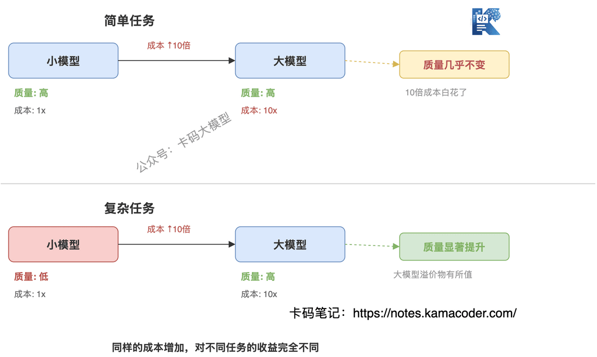
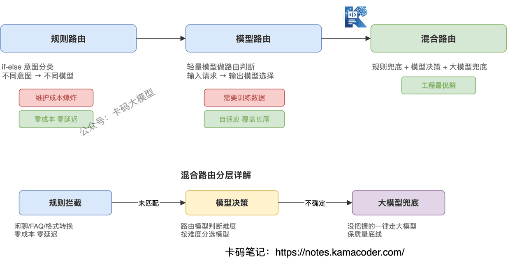
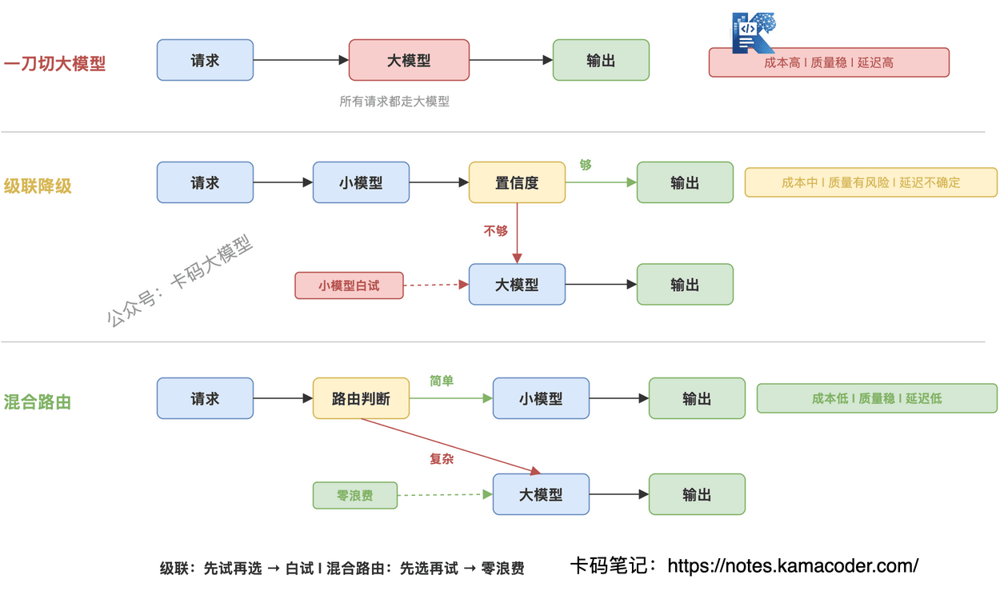

# Agent混合路由优化：从"一刀切"到"看菜下碟"

> 来源: https://notes.kamacoder.com/interview/llm/agent_hybrid_routing_interview.html

# `# Agent混合路由优化：从"一刀切"到"看菜下碟" 

录友四面字节Agent开发岗的面经里录友分享自己面字节的时候，面试官问：agent里 混合路由优化 是怎么回事 

有的录友可能还不知道**混合路由优化** 是啥。 

混合路由优化在 Agent 里主要指：根据任务复杂度动态选择不同的模型或执行路径，比如简单任务走小模型（快+便宜），复杂任务走大模型（准但贵），中间层用路由模型做判断。 

你的Agent每次都调GPT-5.5，跑10轮下来，那美刀是哗哗的。 

但仔细看这些调用，80%其实都是简单任务——闲聊、FAQ、格式转换，小模型完全够用。 

**一刀切用大模型，钱烧了，速度慢了，简单任务的质量也没比小模型好多少。** 

可能大家也知道这个道理，简单任务用便宜的模型，那么问题又来了，什么样的任务是简单任务，如何定义？ 

这篇文章拆解Agent的路由优化问题：**怎么让Agent在合适的场景采用合适的模型，既省钱又不牺牲质量**。 

## `# 目录 
  - 为什么需要路由？单模型走不通

    - 现象：大模型不是万能药     - 根因：成本-质量的不对称   - 三种路由策略

    - 规则路由：快但死板     - 模型路由：灵活但需数据     - 混合路由：工程最优解   - 路由器怎么训练

    - 数据从哪来     - 分类器 vs 评分器     - 冷启动问题   - 级联降级：小模型先试，不行再升级

    - 级联流程     - 算一笔账     - 级联的坑   - 面试怎么答 

## `# 一、为什么需要路由？单模型走不通 

### `# 现象：大模型不是万能药 

很多团队上线Agent的第一反应是：全用最强的模型，GPT-5.5或者Claude Opus，保证质量。 

但跑到生产环境一看，真实数据是这样的： 

用户问"你好"——GPT-5.5回复"你好！有什么可以帮你的？"——花了0.03美元，延迟2秒。 

用户问"帮我总结这段话"——GPT-5.5回复了一段总结——花了0.05美元，延迟3秒。 

用户问"分析这个销售数据下滑的原因，给出策略建议"——GPT-5.5做了完整分析——花了0.5美元，延迟8秒。 

看出问题了吗？前两个请求，用GPT-4.1-mini或者更小的模型，质量完全一样，成本降10倍，延迟还可以更低。 

**一刀切用大模型，不是在用模型的能力，是在浪费模型的溢价。** 

### `# 根因：成本-质量的不对称 

为什么"一刀切"走不通？因为存在两个不对称： 

**第一，任务难度是长尾分布的。** 生产环境里，80%的请求是简单任务，只有20%是真正需要大模型能力的复杂任务。但你按100%的顶配去打，等于用大炮打蚊子。 

**第二，质量提升和成本投入不是线性的。** 对于简单任务，小模型和大模型的质量几乎一样——GPT-4.1-mini和GPT-5.5在闲聊场景的表现差距，远小于它们的价格差距。但对于复杂任务，大模型的质量优势是压倒性的。 

 

这就引出了路由的核心逻辑：**把简单任务交给小模型，复杂任务交给大模型，在成本和质量之间找到最优平衡点。** 

## `# 二、三种路由策略 

知道了"为什么要路由"，接下来的问题是"怎么路由"。有三种策略，从简到难，各有取舍。 

### `# 规则路由：快但死板 

最直接的方式：用规则做意图分类，不同意图走不同模型。 

比如： 
  - 包含"你好"/"谢谢"/"再见" → 小模型   - 包含"分析"/"对比"/"推理" → 大模型   - 包含"翻译"/"总结" → 中等模型 

**优势**：零额外成本（不需要调路由模型），延迟最低（if-else瞬间完成），完全可控（规则透明可审计）。 

**致命问题**：规则维护成本随业务增长爆炸。上线初期5条规则够用，业务跑半年变成50条规则，互相冲突、边界模糊。更关键的是，规则处理不了"看起来简单但实际复杂"的请求——用户问"这个数对吗"，可能是简单确认，也可能是需要推理的验证，规则区分不了。 

### `# 模型路由：灵活但需数据 

用一个轻量模型（通常比推理模型小1-2个量级）做路由判断：输入用户请求，输出"该用哪个模型"。 

**优势**：自适应，能处理规则覆盖不到的长尾场景。训练数据越多，路由越准。 

**致命问题**：需要训练数据——你得先知道"哪些请求小模型就够了"，但这恰恰是你要解决的问题。而且路由模型本身也会误判，把复杂任务分给小模型，结果质量崩了。 

### `# 混合路由：工程最优解 

实际工程中，没有人纯用规则或纯用模型，都是混合的： 

**高频场景用规则兜底**：闲聊、FAQ、格式转换这些明确的简单意图，用规则拦截，零成本、零延迟。 

**模糊地带用模型决策**：规则覆盖不到的请求，交给路由模型判断。路由模型只需要处理长尾case，训练数据的需求大幅降低。 

**兜底策略用大模型**：路由模型没把握的请求，一律走大模型。宁可多花点钱，也不能漏掉复杂任务。 

 

混合路由的核心思路是：**规则拦截确定的简单case，模型处理模糊的中间地带，大模型兜底不确定的复杂case。** 每一层只处理自己有把握的部分，没把握的往下传。 

## `# 三、路由器怎么训练 

混合路由里，路由模型是关键组件。怎么训练它？ 

### `# 数据从哪来 

路由模型需要标注数据："这个请求该用小模型还是大模型"。数据来源有三个： 

**历史调用日志**：如果你已经在用大模型处理所有请求，那日志里天然有"大模型对这个请求的输出质量"。可以用大模型的置信度或输出质量做标签——置信度高的说明请求简单，置信度低的说明请求复杂。 

**人工标注**：从历史请求中采样一批，人工判断"这个请求小模型能不能搞定"。标注成本高，但标签质量最可靠。 

**主动探索**：随机抽取一小部分请求（比如5%），同时用大模型和小模型处理，对比质量差异。如果小模型效果不差，就标记为"简单请求"。这是获取训练数据最直接的方式，代价是探索期间有小概率质量下降。 

### `# 分类器 vs 评分器 

训练路由模型，有两种思路： 

**分类器**：直接预测"该用哪个模型"——输出是离散的类别（小模型/中等模型/大模型）。优点是训练简单，缺点是新增模型时要重新训练分类器。 

**评分器**：预测任务的"难度分"——输出是连续的分数（0-1），再按阈值映射到模型级别。优点是灵活，新增模型只需调整阈值，缺点是评分标准需要校准。 

工程上更推荐评分器。因为模型列表可能会变（今天3个模型，下个月4个），难度分是比模型名更稳定的标签。 

 

### `# 冷启动问题 

最大的坑：刚上线时，没有历史数据，路由模型怎么训练？ 

**保守策略**：初期全部走大模型，同时记录所有请求的"大模型置信度"。跑一周后，用置信度作为难度标签的代理——置信度高的标记为"简单"，低的标记为"复杂"，先训一个初版路由模型。 

**渐进放开**：初版路由模型只处理置信度极高（>0.95）的请求，把这部分放给小模型。其余仍然走大模型。随着数据积累，逐步降低阈值，放大小模型的比例。 

**关键原则**：冷启动阶段宁可多花点钱，也不能让质量出问题。成本优化是锦上添花，质量是底线。 

## `# 四、级联降级：小模型先试，不行再升级 

除了"先路由再选模型"，还有一种思路：**先让小模型试，不行再升级到大模型。** 这就是级联降级。 

### `# 级联流程 
  - 请求进来，先让小模型处理   - 判断小模型的输出置信度   - 置信度够高 → 直接用小模型的结果   - 置信度不够 → 升级到大模型重新处理 

听起来很完美？小模型能搞定的就省钱，搞不定的再上大模型。 

但实际有坑。 

### `# 算一笔账 

假设你的请求分布是：70%简单、30%复杂。 

**一刀切大模型**：100%请求走大模型，成本100单位。 

**级联降级**：70%简单请求被小模型搞定（成本10单位），30%复杂请求先走小模型失败（成本10单位），再走大模型（成本30单位）。总成本 = 10 + 10 + 30 = 50单位。 

**理想路由**：70%直接走小模型（成本10单位），30%直接走大模型（成本30单位）。总成本 = 40单位。 

级联降级比一刀切省了50%，但比理想路由多花了25%——因为那30%复杂请求被小模型"白试"了一次。 

 

### `# 级联的坑 

**第一，双倍延迟。** 复杂请求走了两遍——先小模型再大模型，延迟是小模型时间+大模型时间。对延迟敏感的场景（实时对话），级联可能比直接走大模型还慢。 

**第二，置信度阈值的选择。** 太松（小模型通过的门槛低）→ 复杂任务被小模型错误输出，质量下降。太紧（小模型通过的门槛高）→ 大量请求升级到大模型，级联形同虚设。 

**第三，错误传播。** 小模型的输出不是"对/错"的二值判断，而是有灰度。有些请求小模型给了一个"看起来对但实际有微妙错误"的答案，置信度判断可能放过去，但下游消费时会出问题。 

 

级联降级适合"成本极其敏感、能容忍一定延迟"的场景。如果对质量和延迟都有要求，混合路由是更好的选择——**先路由判断再选模型，避免小模型白试的浪费。** 

## `# 五、面试怎么答 

面试官问Agent成本优化，不要只说"我会用小模型"，要展示**从问题本质到方案取舍的完整思维链**。 

**参考回答思路：** 

"Agent的成本优化，核心问题是任务难度和模型能力的不对称——80%的请求是简单任务，用大模型是浪费。我的解法是三层路由：高频简单场景用规则拦截，零成本零延迟；模糊地带用路由模型做难度评分，按分选模型；不确定的一律走大模型兜底，保质量底线。 

路由模型的训练，我倾向于用评分器而不是分类器，因为难度分比模型名更稳定，新增模型时只需要调阈值。冷启动阶段用大模型置信度当难度标签的代理，渐进放大小模型比例。 

级联降级（小模型先试、不行再升级）看似合理，但复杂请求会被小模型白试一次，既浪费成本又增加延迟。对质量和延迟有要求的场景，先路由再选模型比先试再升级更优。" 

这个回答从问题本质讲到方案设计，再指出级联降级的坑，比只背"用小模型省钱"高一档。 

路由只是 Agent 成本与稳定性的一环。它在多 Agent 系统里怎么和预算熔断、降级策略配合，看 Multi-Agent Harness 面试详解；成本和质量怎么被持续监控、做评估闭环，看 Agent Harness 可观测性面试详解；Agent 的整体原理和考点回到 Agent 大厂面试题汇总。 

加油
