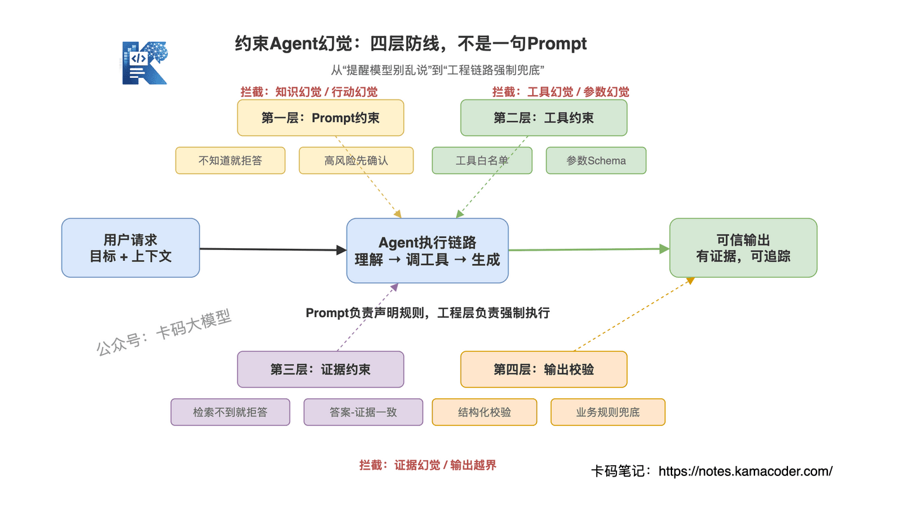
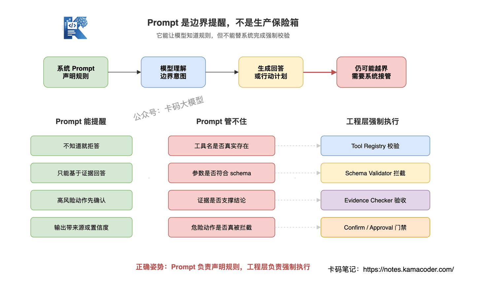
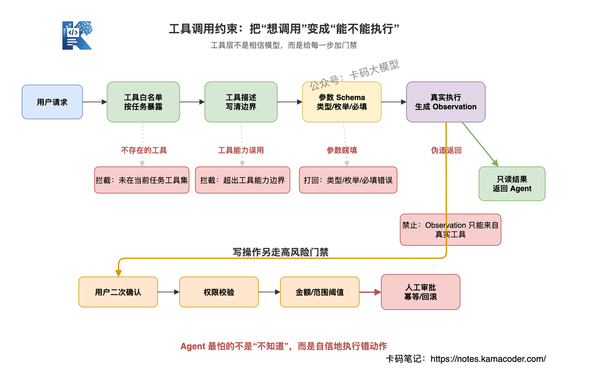
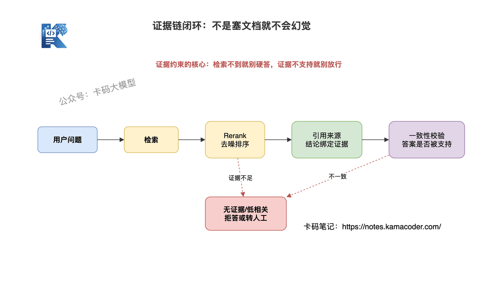
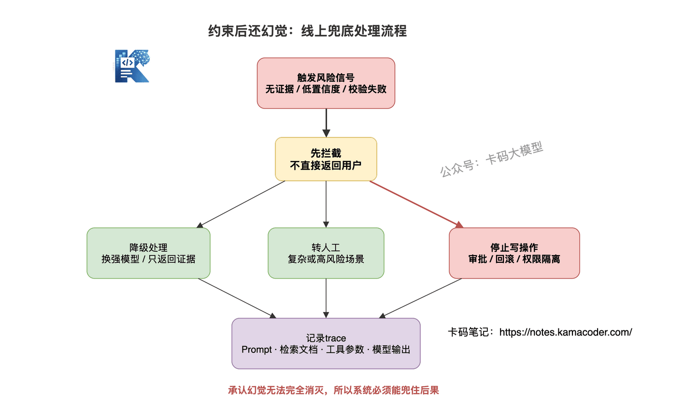

# Agent系统如何约束大模型幻觉？约束后还幻觉怎么办？

> 来源: https://notes.kamacoder.com/interview/llm/agent_hallucination_control_interview.html

# `# Agent系统如何约束大模型幻觉？约束后还幻觉怎么办？ 
 

之前写过 Agent上下文漂移与工具调用幻觉，重点讲的是为什么会漂移、为什么会工具幻觉。 

这篇继续往下讲：**怎么系统性约束幻觉，以及约束后仍然幻觉时怎么处理。** 

这也是很经典的 Agent面试题。 

"在 Agent 系统里，你们怎么约束大模型幻觉？如果约束之后还是出现幻觉，该怎么办？" 

这个问题很容易答浅。 

不少录友上来就说："我会在 Prompt 里要求模型不要编，不知道就说不知道。" 

这句话对不对？ 

对，但太浅了。 

因为 Agent 不是普通聊天机器人。普通 LLM 幻觉，最多是说错一句话；Agent 幻觉，可能会调错工具、传错参数、引用不存在的证据，甚至执行了不该执行的动作。 

**Agent 的幻觉问题，不是只靠一句 Prompt 能兜住的。** 

真正的工程解法，要从输入、工具、证据、输出、兜底全链路约束。 

这篇文章，我们就讲透这个问题 

## `# 目录 
  - 先搞清楚：Agent里的幻觉不止一种   - 总体思路：不要指望一层防线解决所有问题   - 第一层：Prompt约束，只能管边界，管不住全部   - 第二层：工具调用约束，防止Agent乱行动   - 第三层：证据约束，让回答有据可依   - 第四层：输出校验，生成完不是结束   - 约束之后还幻觉，怎么办？   - 工程上怎么长期治理幻觉   - 面试怎么答 

## `# 一、先搞清楚：Agent里的幻觉不止一种 

面试官问"Agent 幻觉怎么处理"，你不要一上来就讲 Prompt。 

先把幻觉类型拆清楚。 

因为不同类型的幻觉，根因不同，解法也不同。 

### `# 1. 知识幻觉 

这是最常见的幻觉：模型编造不存在的事实。 

比如用户问："某个产品支持私有化部署吗？" 

文档里没写，模型却回答："支持，并且支持 Kubernetes 部署。" 

这就是知识幻觉。 

它的问题在于：**模型把训练数据里的通用经验，硬套到了当前业务上。** 

### `# 2. 工具幻觉 

Agent 调用了一个不存在的工具，或者把工具能力想象得比实际更强。 

比如系统里只有 `search_docs`，它却生成了一个 `query_database`。 

这类幻觉比知识幻觉更危险，因为它已经开始影响执行链路了。 

### `# 3. 参数幻觉 

工具是对的，但参数是瞎填的。 

比如接口要求： 

```
{
  "date": "YYYY-MM-DD",
  "limit": "number"
}

```

 

模型传了： 

```
{
  "date": "上周五",
  "limit": "十个"
}

```

 

工具名没错，但参数不符合 schema，照样会出问题。 

### `# 4. 证据幻觉 

RAG 场景最容易出现这个问题。 

模型明明没有从文档里检索到相关内容，却说："根据文档可知……" 

或者文档 A 只说了"支持退款"，模型回答成"支持 7 天无理由退款"。 

**这类幻觉最隐蔽，因为它披着"有来源"的外衣。** 

### `# 5. 行动幻觉 

这是 Agent 系统里最危险的一类。 

该确认的不确认，该审批的不审批，该只读的不小心变成写操作。 

比如用户只是问："帮我看看这个订单能不能退款。" 

Agent 却直接调用退款接口，把钱退了。 

这就不是回答错了，而是系统事故。 


 

所以，Agent 幻觉不能只说"模型会编"。 

更准确的说法是：**Agent 幻觉是模型在事实、工具、参数、证据和行动上产生了不受控的生成。** 

## `# 二、总体思路：不要指望一层防线解决所有问题 

约束 Agent 幻觉，不能只靠一层。 

Prompt 要不要写？ 

当然要。 

但 Prompt 只是第一层边界提醒，不是保险箱。 

真正的工程防线至少有四层： 
  - **Prompt约束**：告诉模型什么能做、什么不能做   - **工具约束**：限制它能调什么工具、参数能怎么填   - **证据约束**：要求回答必须有来源，没有证据就拒答   - **输出校验**：生成后再检查，不能让结果直接裸奔给用户 


 

这四层解决的问题不一样。 

Prompt 约束解决的是"模型知道边界"。 

工具约束解决的是"模型不能乱行动"。 

证据约束解决的是"模型不能空口编事实"。 

输出校验解决的是"模型说完以后还要验收"。 

**面试里能说出这四层，基本就比只会说 Prompt 的同学高一档。** 

## `# 三、第一层：Prompt约束，只能管边界，管不住全部 

Prompt 是必须要做的。 

但你要知道它的能力边界。 

### `# Prompt 能做什么 

它能把系统规则说清楚： 
  - 不知道就说不知道   - 只能基于工具结果和检索文档回答   - 文档没有提到的信息不要补充   - 高风险动作必须先确认   - 输出必须包含来源或置信度 

比如系统提示词可以写： 

```
你只能基于提供的工具结果和检索文档回答。
如果证据中没有出现相关信息，必须回答“当前资料中未提及”。
涉及支付、退款、删除、发邮件等写操作时，必须先向用户确认，不能直接执行。

```

 

这类 Prompt 很有用。 

它至少让模型知道边界。 

### `# Prompt 管不住什么 

但是，只靠 Prompt 管不住这些东西： 
  - 工具名是否真实存在   - 参数类型是否符合接口要求   - 检索文档是否真的支持回答   - 高风险操作是否真的被拦截   - 模型输出是否和证据一致 

为什么？ 

因为 Prompt 本质上还是自然语言约束。 

它是"希望模型遵守"，不是"系统强制执行"。 

**只说"我在Prompt里要求模型不要幻觉"，面试官一听就知道你没做过生产。** 


 

正确姿势是：Prompt 负责声明规则，工程层负责强制执行。 

## `# 四、第二层：工具调用约束，防止Agent乱行动 

Agent 和普通 LLM 最大的区别是：Agent 会调用工具。 

所以 Agent 的幻觉，很多时候不是"说错"，而是"做错"。 

工具层要做的不是相信模型，而是限制模型。 

### `# 1. 工具白名单 

不要把所有工具都暴露给 Agent。 

当前任务只给当前需要的工具。 

用户只是问知识库问题，就不要给它退款、删除、发邮件这种写工具。 

这样即使模型想乱调，也没有工具可调。 

### `# 2. 工具描述要写清边界 

工具描述不能只写： 

```
search_order：查询订单

```

 

太粗了。 

应该写成： 

```
search_order：只读工具，用于按订单ID查询订单状态、金额、时间。
不能修改订单，不能退款，不能查询用户隐私字段。

```

 

工具描述越含糊，模型越容易误用。 

### `# 3. 参数 schema 校验 

工具参数必须有 schema。 

类型、枚举、必填字段、格式，都要约束清楚。 

比如： 

```
{
  "type": "object",
  "properties": {
    "order_id": {
      "type": "string",
      "description": "订单ID"
    },
    "action": {
      "type": "string",
      "enum": ["query", "refund_preview"]
    }
  },
  "required": ["order_id", "action"]
}

```

 

模型传错参数，不能直接执行。 

要么打回重试，要么降级处理。 

### `# 4. Observation 必须来自真实工具结果 

这是一个很关键的点。 

工具返回结果不能让模型自己编。 

Agent Loop 里，`Observation` 必须来自真实工具执行结果，而不是模型生成一句"查询结果如下"。 

否则工具调用就失去意义了。 

### `# 5. 高风险工具必须审批 

只读工具和写工具要分开。 

查询订单是一回事，退款是另一回事。 

高风险动作至少要加： 
  - 用户二次确认   - 权限校验   - 金额/范围阈值   - 人工审批   - 幂等和回滚机制 

**Agent 系统里，最怕的不是模型不知道，而是模型自信地执行错动作。** 


 

## `# 五、第三层：证据约束，让回答有据可依 

很多人以为接了 RAG，就不会幻觉了。 

这也是误区。 

RAG 只能给模型提供外部证据，但不能保证模型一定忠实于证据。 

之前在 RAG落地最难的地方在哪 里讲过，RAG 最难的不是某一个环节，而是文档预处理、召回质量、生成忠实度三个环节级联放大。 

在 Agent 系统里，证据层至少要做五件事。 

### `# 1. 先检索，再回答 

涉及业务事实、产品规则、公司政策的问题，不要让模型凭记忆答。 

必须先检索。 

模型训练数据里再懂，也不一定懂你们公司昨天刚更新的退款规则。 

### `# 2. 强制引用来源 

回答里要能追溯到文档。 

比如： 

```
根据《退款规则》第3节，未发货订单支持原路退款。

```

 

不是为了让回答看起来正式，而是为了逼模型把结论和证据绑定。 

### `# 3. 检索不到就拒答 

如果检索结果为空，或者相关性低，就不要硬答。 

应该回答： 

```
当前资料中没有检索到相关规则，无法确认。

```

 

这比编一个看起来合理的答案强太多。 

### `# 4. Rerank 降低噪声 

召回文档多，不等于证据强。 

Top-K 拉得太大，噪声文档混进来，模型反而更容易被带偏。 

工程上常见做法是：先粗召回，再 Rerank，最后只把最相关的证据给模型。 

### `# 5. 答案和证据做一致性校验 

生成之后，再检查一遍： 
  - 回答里的关键结论，证据里有没有出现？   - 数字、时间、限制条件是否一致？   - 有没有文档没提到但模型自己补充的内容？ 

这一步可以用规则，也可以用一个轻量模型做 LLM-as-Judge。 

但注意，Judge 也会错，所以高风险场景不要只靠它，要结合规则和人工审核。 


 

## `# 六、第四层：输出校验，生成完不是结束 

很多系统把"模型生成回答"当成最后一步。 

这不对。 

在 Agent 系统里，生成之后还要验收。 

### `# 1. 结构化输出校验 

能用 JSON，就不要让模型自由发挥。 

比如客服工单分类，输出应该是： 

```
{
  "category": "refund",
  "confidence": 0.86,
  "need_human": false,
  "evidence_ids": ["doc_102", "doc_305"]
}

```

 

这样才能校验字段是否缺失、枚举值是否合法、置信度是否低于阈值。 

自由文本看起来顺滑，但很难管。 

### `# 2. 业务规则校验 

模型说"可以退款"，系统还要检查： 
  - 订单是否存在   - 是否超过退款期限   - 金额是否异常   - 用户是否有权限   - 当前状态是否允许退款 

这些不能交给模型自由判断。 

应该由业务代码兜底。 

**确定性规则，别让概率模型拍脑袋。** 

### `# 3. 敏感内容校验 

涉及医疗、法律、金融、隐私、公司内部数据的内容，要做额外校验。 

比如： 
  - 是否泄露个人信息   - 是否给出越权建议   - 是否包含未经证实的结论   - 是否把建议说成了确定事实 

这类场景里，模型最好只输出建议，不直接给最终决策。 

### `# 4. 多模型或双阶段审查 

复杂场景可以加一个 Reviewer： 

第一阶段：Generator 生成回答。 

第二阶段：Reviewer 检查回答是否被证据支持、是否违反规则、是否需要人工介入。 

这就是 Reflection / Review 的思路。 

但别滥用。 

每加一层模型调用，成本和延迟都会上升。 

简单 FAQ 没必要这么重，高风险动作才值得上。 

## `# 七、约束之后还幻觉，怎么办？ 

这是面试官最喜欢追问的地方。 

因为现实里没有 100% 不幻觉的 Agent。 

你不能说："我约束完就不会幻觉了。" 

这句话太假了。 

更好的回答是：**我承认幻觉无法完全消灭，所以系统要有拦截、降级、记录和复盘机制。** 

### `# 1. 先拦截 

出现这些情况，不能直接返回给用户： 
  - 没有证据来源   - 置信度低   - 输出校验失败   - 工具参数不合法   - 高风险动作没有确认   - 生成结果和证据冲突 

拦截不是失败，而是保护系统。 

### `# 2. 再降级 

拦截之后怎么办？ 

看场景： 
  - 换更强模型重新生成   - 只返回检索到的原始证据   - 让用户补充信息   - 转人工处理   - 对写操作直接停止执行 

比如用户问一个政策问题，模型没有证据支持，那就只展示检索到的相关文档，让用户自己看，不要让模型总结。 

### `# 3. 高风险动作要回滚或审批 

如果幻觉影响的是写操作，就不能只靠"重新回答"解决。 

比如错误发邮件、错误退款、错误删除数据，这些都是动作层事故。 

所以高风险工具必须提前设计： 
  - 审批流   - 幂等机制   - 回滚机制   - 操作日志   - 权限隔离 

否则出了问题，你连怎么恢复都不知道。 

### `# 4. 必须记录 trace 

只要出现幻觉，就要能复盘。 

至少记录： 
  - 用户原始输入   - 系统 Prompt   - 检索到的文档   - 工具调用参数   - 工具真实返回   - 模型最终输出   - 校验失败原因   - trace_id 

没有 trace，就没有复盘。 

没有复盘，幻觉就会反复发生。 


 

## `# 八、工程上怎么长期治理幻觉 

线上兜底只能止血。 

真正要把幻觉率降下来，还得做长期治理。 

### `# 1. 先归因分类 

每次幻觉事故，都要归因。 

到底是： 
  - Prompt 边界没写清？   - 工具描述太模糊？   - 参数 schema 太松？   - RAG 没召回正确文档？   - Rerank 把噪声排前面了？   - 输出校验没拦住？ 

不归因，后面只能瞎改。 

### `# 2. 把事故样本加入 eval 

这是很多团队容易忽略的地方。 

出了幻觉，不是改完 Prompt 就算完。 

要把这次失败样本加入评测集。 

以后每次改 Prompt、改工具、改 RAG，都要跑一遍回归测试。 

否则你修好了这个 case，可能又把另一个 case 搞坏了。 

### `# 3. 建立监控指标 

Agent 幻觉不能只靠用户投诉发现。 

至少要监控这些指标： 
  - 无证据回答率   - 检索为空仍回答的比例   - 工具调用失败率   - 参数校验失败率   - 输出校验失败率   - 人工接管率   - 用户纠错率 

这些指标不是为了好看，是为了告诉你系统哪里在变差。 

### `# 4. 分场景设置不同安全等级 

不是所有场景都要同一套防线。 

闲聊场景，可以轻一点。 

业务咨询，要证据约束。 

写操作，要审批。 

医疗、金融、法律，要更严格，很多时候只能给建议，不能替用户做决定。 

**安全等级要跟风险匹配。** 

不要简单任务上重防线，也不要高风险任务裸奔。 

## `# 九、面试怎么答 

面试官问"Agent 系统如何约束大模型幻觉，如果约束后还出现幻觉怎么办"，不要只说"我会写 Prompt"。 

要体现你知道 Agent 幻觉的类型、链路和兜底。 

**参考回答思路：** 

"我不会只靠 Prompt 约束幻觉。Agent 的幻觉不止是知识幻觉，还包括工具幻觉、参数幻觉、证据幻觉和行动幻觉，所以要分层处理。 

**第一层是 Prompt 约束**，明确不知道就拒答、只能基于证据回答、高风险动作必须确认。但 Prompt 只是边界提醒，不是强制机制。 

**第二层是工具约束**。 

当前任务只暴露必要工具，工具描述要写清能力边界，参数必须有 schema 校验，Observation 必须来自真实工具返回。写操作要做权限控制、二次确认和审批。 

**第三层是证据约束**。 

涉及业务事实的问题必须先检索再回答，回答要带来源，检索不到就拒答。生成后还要做答案和证据的一致性校验，避免模型把文档没有的内容补出来。 

**第四层是输出校验**。 

结构化输出要校验字段、枚举和置信度，业务规则用确定性代码兜底，高风险场景可以加 Reviewer 或人工审核。 

如果这些约束之后仍然出现幻觉，线上不能直接放行，要先拦截，再根据场景降级：换强模型、只返回证据、让用户补充信息、转人工，写操作直接停止或走审批。 

同时保留 trace，包括 Prompt、检索文档、工具参数、工具返回和模型输出。事后把事故样本加入 eval，修 Prompt、工具 schema、RAG 召回和输出校验，并监控无证据回答率、工具调用失败率、人工接管率等指标。" 

这个回答的重点不是承诺"Agent 不会幻觉"。 

而是告诉面试官：**我知道它一定可能幻觉，所以我有分层约束、线上兜底和事后治理。** 

这才是生产系统的思路。 

加油
