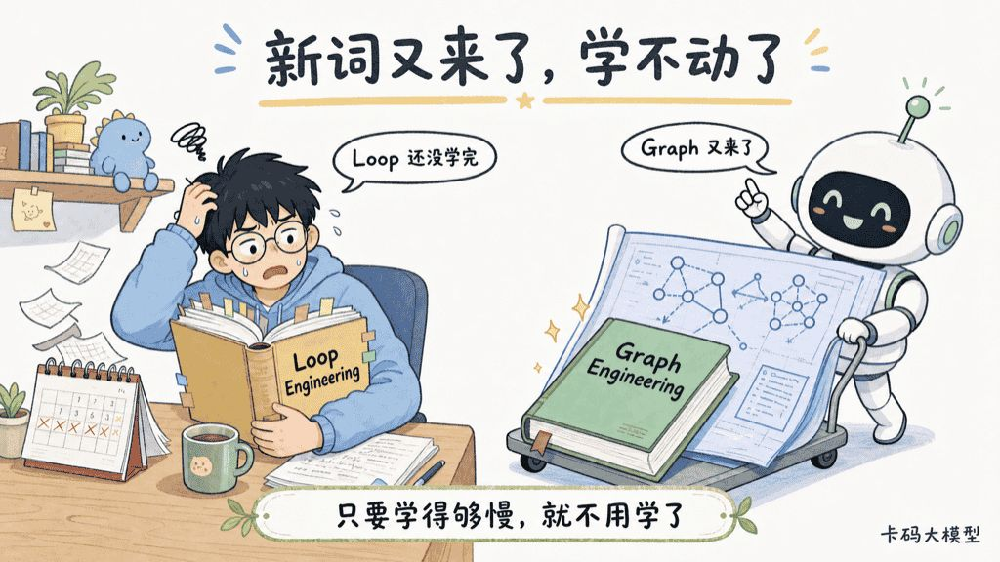
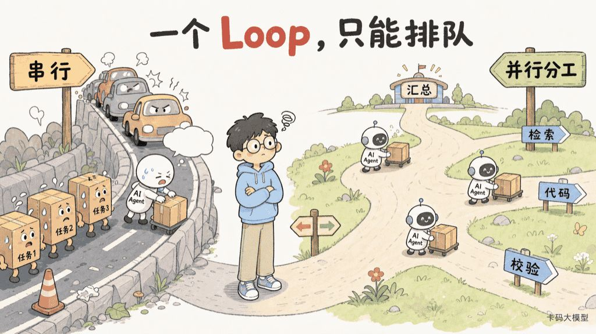

# Graph Engineering详解：Loop还没学完，Graph又来了，Agent图编排到底是什么

> 来源: https://notes.kamacoder.com/interview/llm/graph_engineering_interview.html

# `# Graph Engineering详解：Loop还没学完，Graph又来了，Agent图编排到底是什么 

前面在 Loop Engineering 详解 里，我们把 Agent 那个 `while` 循环拆开了：上下文、状态、预算、工具、终止条件，缺一个都可能线上翻车；在 GraphRAG 与 LightRAG 里，又讲过知识图谱怎么帮 RAG 找实体关系。 

现在，又来了一个新词：**Graph Engineering**。 

AI 时代新词出现得太快。之前 Loop Engineering 还没学完，现在又 Graph Engineering。果然 AI 时代，**只要你学得足够慢，你就不用学了。** 

先别急着焦虑。这个词背后不是凭空冒出一门新玄学，它说的就是一个很朴素的工程问题：**一个 Agent Loop 能把一件事转起来；当任务需要并行、分工、校验、人工确认、断点恢复时，这些 Loop、代码和人该怎么连起来？** 


 

最近关于这个词的讨论很热。有观点认为，单一 Agent Loop 已经暴露出串行、状态全在 transcript 里、失败难恢复的上限，因此下一层抽象应该是显式的图；LangChain 的回应则更克制：图编排是成熟的做法，Loop 只是其中最简单的有环图，不存在“谁取代谁”。Josh C. Simmons 的文章  (opens new window) 和 LangGraph 官方复盘  (opens new window) 放在一起看，答案反而更清楚。 

这篇不带你追名词，直接把面试官真正关心的几件事讲透：Graph Engineering 到底是什么、Loop 为什么会长成图、什么时候该用、和 GraphRAG 到底有什么关系、落地时怎么避免把自己编排进坑里。 

## `# 目录 
  - `Graph Engineering 到底是什么   - `为什么一个 Loop 会长成一张图   - `图里的三个主角：节点、边、状态   - `生产里真正值钱的五个能力   - `Graph Engineering、GraphRAG、工作流、Harness 怎么区分   - `别一上来就画图：什么时候该用，什么时候不该用   - `面试追问怎么答 

## `# 1. Graph Engineering 到底是什么 

一句话：**Graph Engineering 是把 Agent 系统设计成一张显式的控制图，而不是把所有决策都塞进一个隐式的 while 循环。** 

这里的“图”不是你在白板上随手画几个框，也不是知识图谱。它是可执行的控制结构： 
  - **节点（Node）**：一个能独立完成、独立测试的能力单元。可以是一次 LLM 调用、一个工具、普通代码、完整 Agent，甚至一个人。   - **边（Edge）**：从哪个节点走到哪个节点的规则。它可以是确定的，也可以基于状态或模型判断做条件路由。   - **状态（State）**：随着边在节点间传递的结构化数据，包括任务进度、中间产物、预算、审批结果等。 

LangGraph 官方把它概括为一种状态机：节点做事，边决定下一步，状态承载步骤间的数据。关键不是让模型决定一切，而是把你已经知道的业务结构写进系统：哪里必须检索，哪里必须校验，哪里不允许越过人工审批。官方文章  (opens new window) 里特别强调，这种“确定路径 + Agent 步骤”的混合，往往比纯模型自由发挥更快、更便宜、更可预测。 

可以把它理解成一句大白话： 
> 

**模型负责它擅长的判断，代码负责你本来就确定的规则。**
 

不是让 Agent “更自由”，而是让它在该自由的地方自由，在不该自由的地方别乱动。 

## `# 2. 为什么一个 Loop 会长成一张图 

在 Loop Engineering 里，最常见的 Agent 是这样转的：模型思考 → 调工具 → 观察结果 → 再思考。它很适合一件目标明确、步骤大致线性的事。 

但真实任务一复杂，问题马上不是“这一圈怎么转”，而是“**下一件事该由谁做、能不能同时做、失败后从哪接着做**”。 


 

例如“把一份需求变成可 review 的 PR”： 
  - 先分类：是文档、代码还是安全问题？   - 如果是代码，代码 Agent 可以查仓库；同时，检索 Agent 可以查规范和历史 issue。   - 两路都回来后，再由一个节点综合。   - 涉及发布或外部写入，必须让人审批。   - 单元测试不通过，就只回到修复节点重试，不应该从头再跑一遍。 

一个单 Loop 也不是绝对做不了。它可以先查仓库，再查规范，再写，再测，像排队一样一个一个来。但你会付出四个代价：**本可并行的工作被串行化、失败只能大面积重跑、状态散在 transcript 里、审批只能靠“暂停一下”的临时补丁。** 

因此别把 Loop 和 Graph 看成对立面。**Loop 本来就是一张有环的有向图。**它只是图里路径最简单的那一种：只有一条主路，不断回到前面的节点。Graph Engineering 做的，是把这条隐式小路展开，让分叉、汇合、重试、暂停都成为明确结构。 

这也是一个很重要的面试表述：**Loop 没死，它被降到节点内部了。**一个“代码修复 Agent”节点内部仍然可以跑 ReAct Loop，仍然要做上下文压缩、预算控制、终止校验；图处理的是这个 Agent 之外的协调关系。 

## `# 3. 图里的三个主角：节点、边、状态 

### `# 节点：越“无聊”越好 

不少人听到 Agent Graph，就开始设计“万能节点”：一个节点既规划、又检索、又写代码、又判断风险、又发消息。这样看上去节点少，实际是把一个失控的大 Loop 换了个名字。 

**好节点应该无聊。**它只做一件清楚的事，所以能单测、能缓存、能重试、能替换。 


 

举个例子，下面这些节点的边界就很清楚： 

| 节点  输入  输出  失败后怎么处理 
| `classify_ticket`  用户请求  任务类别、风险级别  低置信度转人工 
| `search_policy`  类别、关键词  证据片段  重试或降级检索 
| `draft_reply`  请求、证据  草稿  回到检索补证据 
| `validate_reply`  草稿、规则  通过/失败原因  失败回到草稿节点 
| `human_approval`  高风险草稿  批准/拒绝  等待后恢复 

注意，节点不等于模型调用。一个普通的权限检查函数，恰恰是最该做成确定节点的东西；一个需要搜索、阅读、写代码的开放任务，则可以是一个内部自带 Loop 的 Agent 节点。 

### `# 边：把“下一步”从模型脑子里拿出来 

边不只是连线。**边是决策。** 

如果“测试通过就发布”是硬规则，就不该每次都问模型“你觉得要不要发布”；如果“这个投诉属于计费还是内容安全”需要语义判断，才交给模型分类。Graph Engineering 的关键能力，是把两类决策分开： 
  - **确定边**：规则、权限、阈值、测试结果直接决定，例如 `tests_passed → deploy`。   - **条件边**：根据 state 选择分支，例如风险等级高则去人工审批。   - **模型边**：模型在受限选项中判断下一步，例如三类工单该转给哪个专用 Agent。 


 

越是模型决策的边，越要记录：它看到了什么状态、为什么选这条路、置信度多少、走错后代价是什么。因为生产事故往往不是某个节点“不会干活”，而是**路由走错了**。 

### `# 状态：别再把 transcript 当数据库 

裸 ReAct 最大的问题之一，是“当前做到哪里”混在一长串对话里。上下文被压缩、模型注意力下降或者进程重启，进度就像失忆一样丢了。 

Graph Engineering 需要一份明确的 state schema。先画状态，再写 Prompt，这句话很值钱：**你说不清每一步系统知道什么，说明你还只有 Demo。** 

```
type TicketState = {
  ticketId: string
  request: string
  category?: 'billing' | 'abuse' | 'technical'
  evidence: Evidence[]
  draft?: string
  validation?: { passed: boolean; reasons: string[] }
  approval?: 'pending' | 'approved' | 'rejected'
  budget: { stepsLeft: number; tokenLeft: number; deadline: number }
}

```

 

这份 state 有两个作用：一是让每个节点只读写自己负责的字段；二是让系统能在**跨边时做检查点（Checkpoint）**。机器崩了、人工周末才回复、某次工具超时，都不用从第一步重新烧 Token。 


 

## `# 4. 生产里真正值钱的五个能力 

Graph Engineering 不是“把 if else 换成一个框架”。它真正解决的是生产系统里最讨厌的五类问题。 

### `# 4.1 并行与汇合：把可拆的活同时干 

研究、代码检索、多个数据源拉取，这些常常互不依赖。图可以做 fan-out：从一个拆分节点分出多个 worker；再做 fan-in：等必要结果齐了再汇总。 

注意，图不代表所有东西都要并行。并发有成本：配额、上下文合并、重复工作、结果冲突都要管。正确做法是：**先找真正独立的分支，再并发。** 

### `# 4.2 失败隔离与恢复：坏一个节点，重试一个节点 

工具调用失败、模型输出格式不对、外部 API 超时，都是节点级故障。边界清楚并且有检查点时，失败意味着“重试这个节点 / 走降级边”，不是“60 步跑到第 40 步挂了，全部重来”。 

这会倒逼你做两个老牌工程问题：幂等性和可重试性。比如外部发消息节点必须带幂等键，否则恢复时可能给用户发三遍；写数据库节点要能知道上一次是否已经成功。 

### `# 4.3 人在回路：人不是异常处理器 

很多 Demo 的人工确认，是最后临时弹一个框。真正上线后它会变成系统最脆弱的地方：人没回怎么办？批准和拒绝后状态去哪？审批期间任务是不是占着一个上下文窗口？ 

把人当一个节点，问题就清楚了：有输入边、有可见状态、有等待、有批准和拒绝两条输出边。 

这样高风险动作（转账、发布、删除数据、对外发送）才不是“模型先做了再补救”，而是**结构上根本过不了审批门就做不了。** 

### `# 4.4 预算与安全：把闸门放在边上 

在 Loop Engineering 里讲过步数、Token、时间预算。图时代这些仍然存在，只是预算不再只盯一个 Loop，而是整个 state 的一部分： 
  - fan-out 前，检查剩余预算是否够开 N 个 worker；   - 进入昂贵模型节点前，决定是否先走便宜模型或缓存；   - 跨越“外部写入”边前，检查权限、审批和策略；   - 到 deadline 时，走“基于已有结果收敛”的边，而不是继续发散。 

**预算和权限不是监控面板上的数字，它们是能阻止边被跨越的规则。** 

### `# 4.5 轨迹评估：别只看最后答案 

用户只看最终答案，工程师不能只看最终答案。一个回答答对了，但它绕了 20 次路、重复调了 5 次昂贵工具、跳过了本该有的校验，下一次就会出事故。 

因此图系统要评估轨迹：经过哪些节点、每条边为何被选中、耗时和成本、重试次数、最后是否走过关键校验。这和 Agent Harness 可观测性 讲的 Trace 是一件事：**输出评估告诉你结果好不好，轨迹评估告诉你系统靠不靠谱。** 

## `# 5. Graph Engineering、GraphRAG、工作流、Harness 怎么区分 

“Graph”这几个字太容易让人混。面试一混，前面讲得再多也要扣分。 

| 概念  图里装的是什么  解决什么问题  例子 
| **Graph Engineering**  节点、边、运行状态  任务下一步怎么走  检索 → 写作 → 校验 → 审批 
| **GraphRAG**  实体、关系、社区摘要  知识怎么找、怎么关联  从文档里找跨实体关系 
| **工作流编排**  任务、依赖、触发条件  让确定的业务流程跑起来  ETL、订单、CI/CD 
| **Harness Engineering**  模型、上下文、工具、记忆、安全、观测  给 Agent 提供完整运行外壳  产品级 Coding Agent 

Graph Engineering 和 GraphRAG 最容易混： 
  - **Graph Engineering 的图是控制图**：它关注“检索完之后去哪、失败怎么办、谁审批”。   - **GraphRAG 的图是知识图谱**：它关注“张三和项目 A 是什么关系、哪些实体属于同一社区”。 

两个可以一起用。比如客服 Agent 的控制图里有一个“检索知识”节点，这个节点内部可以用 GraphRAG；但不能因为你用了 GraphRAG，就说自己做了 Agent 图编排。 

至于它和 Harness 的关系：Harness 是更大的运行外壳；Graph 是一种把 Harness 中多个组件排布起来的控制结构；Loop 是 Graph 中最简单的循环结构。它们不是互相取代，而是在不同抽象层做同一件事：**让不稳定的模型调用，变成稳定的系统行为。** 

## `# 6. 别一上来就画图：什么时候该用，什么时候不该用 

Graph Engineering 最危险的误用，是听完名词就把一个简单问答 Agent 改造成小型分布式系统。图不是越复杂越高级，图多一条边，就多一条要测试、监控、恢复的路径。 

适合用图，通常有这些信号： 
  - **有真并行**：多路检索、多 Agent 独立处理、结果需要汇合。   - **有明确分支**：不同任务类别必须走不同工具、模型或权限路径。   - **有独立校验**：生成后要测试、审稿、事实核验或对抗检查。   - **有长时间等待**：需要人工审批、异步回调、跨天恢复。   - **有高风险操作**：对外发送、写库、交易、发布，必须被结构性约束。   - **有高失败成本**：不能因为一个节点失败就从头跑，也不能丢状态。 

反过来，如果就是“根据用户问题查一次知识库再回答”、任务路径很短且开放性很强，先用一个治理好的 Loop 就够了。LangGraph 的官方复盘也明确提醒：深度研究这类路径难以预先固定的任务，强行硬编码图可能不如一个更 Agentic 的 Harness；图的价值在于混合已知结构与运行时变化，而不是消灭模型的自主性。原文  (opens new window) 

所以选型别背框架名，先问四个问题： 
  - 哪些步骤我已经确定，应该交给代码？   - 哪些步骤真的可以并行？   - 哪些状态必须跨失败和跨时间保存？   - 哪些动作必须让人或规则拦住？ 

四个问题都没有明确答案，先别上图，先把 Loop 做稳。 

## `# 7. 面试追问怎么答 

**Q：Graph Engineering 是不是就是画工作流图？** 

不是。画图只是表达，Graph Engineering 是让节点、边和 state 真正成为可执行、可测试、可恢复的运行结构。你得讲清节点边界、条件路由、检查点、失败重试和观测，而不是“我用某框架连了几个框”。 

**Q：Graph Engineering 会替代 Loop Engineering 吗？** 

不会。Loop 是有环的简单图。一个节点内部仍可运行 ReAct/Agent Loop，Loop Engineering 解决其上下文、预算、工具、终止治理；Graph Engineering 解决多个节点、多个 Loop、工具和人的编排。**里面的 Loop 要稳，外面的图才不会乱。** 

**Q：一个节点应该做多大？** 

以“能否单独测试、缓存、重试、替换”为边界。一个节点只承担一种主要责任；如果它同时规划、检索、执行、校验，失败时你既不知道该重试哪里，也很难评估它。 

**Q：为什么要把 state 从上下文里拿出来？** 

上下文是给模型推理用的，不是可靠数据库。它会被截断、压缩、稀释，也不适合跨进程恢复。state 要有 schema、版本和检查点；模型需要时再把与本步相关的 state 投影成上下文。 

**Q：模型路由和代码路由怎么分？** 

能用规则确定的就用代码：权限、测试结果、阈值、固定业务流程。需要语义理解但输出空间有限的，才交给模型：分类、复杂任务拆解、证据不足判断。并且模型路由要有限候选项、有结构化输出、有 fallback。 

**Q：Graph Engineering 和 GraphRAG 有什么关系？** 

都是图，但一张是“控制图”，一张是“知识图谱”。Graph Engineering 管工作如何流动；GraphRAG 管知识如何检索。项目里可以用控制图把请求路由到 GraphRAG 检索节点，但两者不能混为一个概念。 

## `# 写在最后 

从 Prompt Engineering、Context Engineering、Harness Engineering、Loop Engineering 到今天的 Graph Engineering，词会继续换，下一周可能又有新名字。 

但核心没变：**把不稳定的模型调用拆成清楚的职责，给它状态、约束、校验、恢复和观察，让它最后像一个可靠系统那样交付。** 

所以别被新词追着跑。图也好，环也好，重要的不是你会不会把架构画得很复杂，而是你能不能说清楚：这件事怎么分工、怎么走、怎么停、坏了怎么接着跑、谁有最后决定权。 

加油，录友。  

## `# 参考资料 
  - Josh C. Simmons，《We Are Entering the Graph Engineering Phase》：https://www.drjoshcsimmons.com/writing/we-are-entering-the-graph-engineering-phase   - LangChain，《3 Years of Graph Engineering with LangGraph》：https://www.langchain.com/blog/3-years-of-graph-engineering-with-langgraph   - Turing Post，《Is Graph Engineering Real? Why Everyone Is Talking About It》：https://www.turingpost.com/p/is-graph-engineering-real-why-everyone-is-talking-about-it
