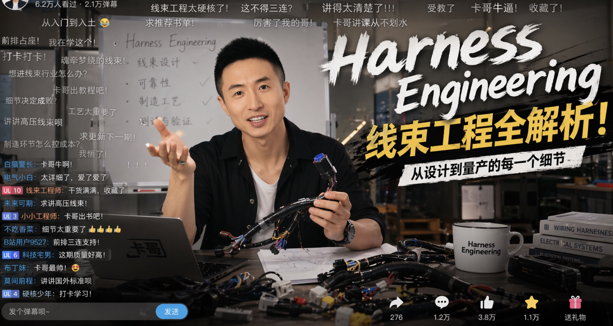
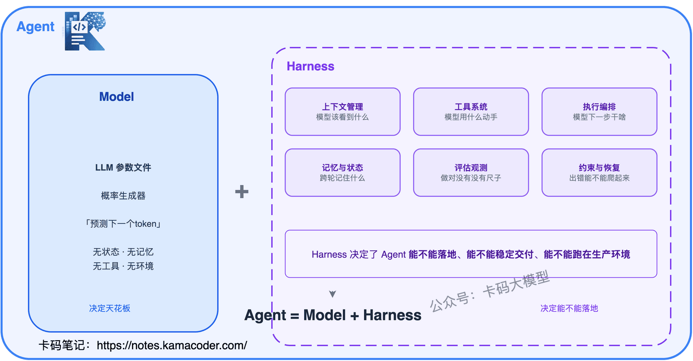
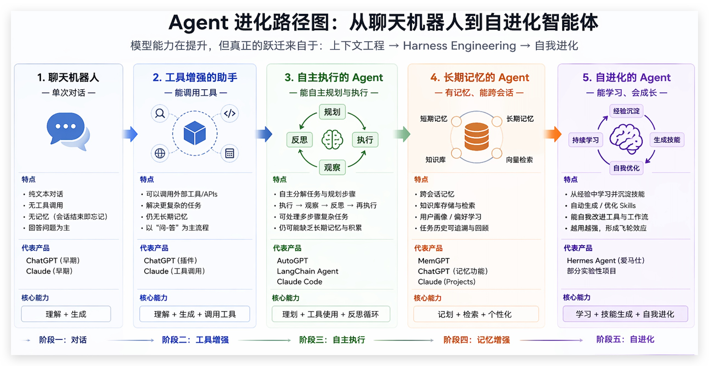
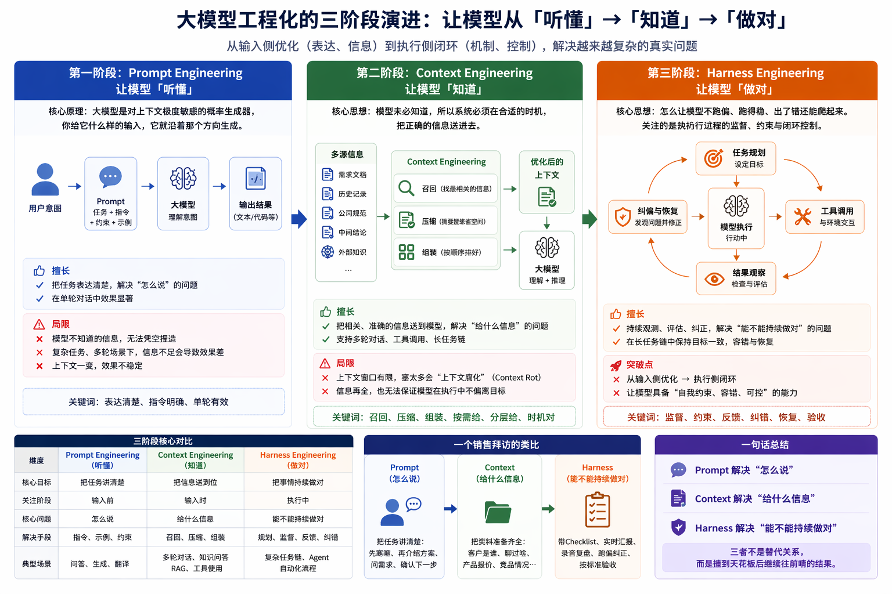
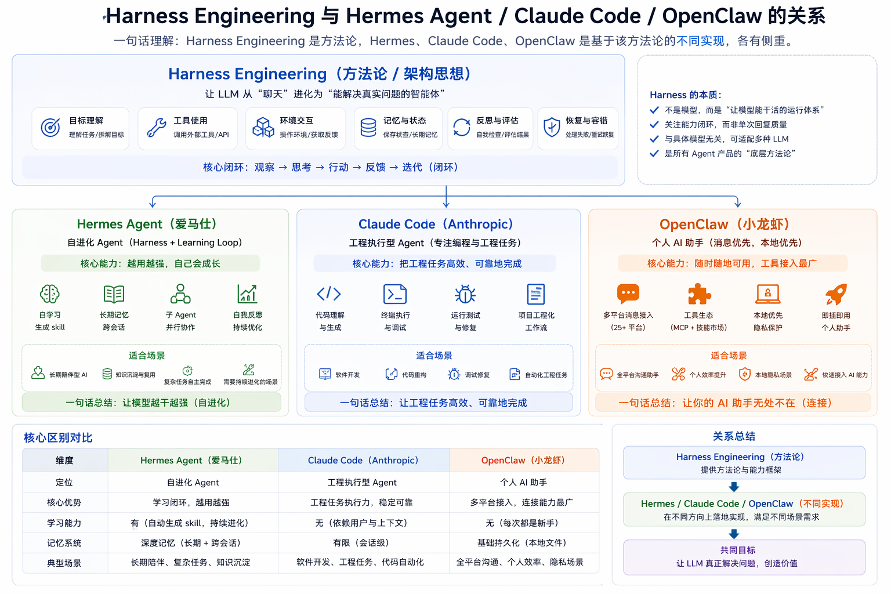
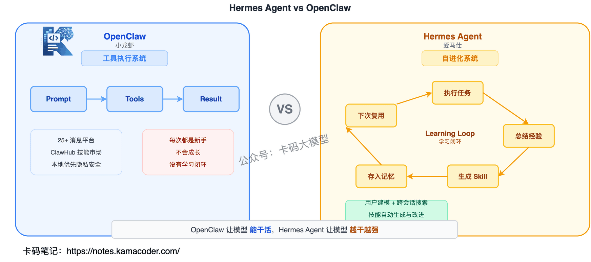

# Harness Engineering大厂面试题汇总：从Prompt到Context到Harness

> 来源: https://notes.kamacoder.com/interview/llm/harness_interview.html

# `# Harness Engineering大厂面试题汇总：从Prompt到Context到Harness 

卡哥昨天在代码随想录B站  (opens new window)直播在讲Harness Engineering，直播非常火爆： 


 

（不开玩笑了，此图来此 GPTImages 2.0） 

但这篇确实来讲讲Harness Engineering。 

最近知识星球  (opens new window)里，录友反馈最多的面试新词就是：**Harness Engineering**。 

现在ai迭代速度太快。很多人刚整明白 Prompt Engineering，又来一个 Context Engineering，还没消化完，Harness Engineering 又上了热搜。 

甚至有录友面试直接被问到"你怎么理解 Harness 工程"，当场愣住。 

**Harness 到底是啥？跟 Prompt Engineering、Context Engineering 什么关系？Hermes Agent 和 OpenClaw 又是什么？** 搞不清楚这些，面试官一深挖就原形毕露。 

这篇文章把 Harness Engineering 从来龙去脉到实战落地全部讲透，认真看完，面试不再怕被追问。  

## `# 目录 
  - `Harness Engineering 是什么？从哪冒出来的？   - `从 Prompt 到 Context 到 Harness：AI 工程的三次重心转移   - `Harness 拆开看：六层核心组件   - `大厂踩过的五个真实难题   - `Hermes Agent vs OpenClaw：两种 Harness 实现   - `和 Prompt/Context Engineering 到底什么关系？   - `大厂真实面试追问汇总  

## `# 1. Harness Engineering 是什么？从哪冒出来的？ 

面试官一般这么问："你听说过 Harness Engineering 吗？"或者"Agent = Model + Harness，你怎么理解这个等式？" 

### `# 先搞清楚：Harness 是什么？ 

Harness 这个词直译叫**"马具"**，或者**"缰绳"**。 

想象一下骑马：马本身有强大的力量，能跑能跳能驮东西。但如果没有缰绳和马具，这股力量就是失控的——马可能往悬崖上跑，可能甩你下来，可能跑去吃草不回来了。 

马具的作用，就是让这股力量**为你所用**。 

AI 系统也一样。LLM 很强，Agent 很能干，但如果没有一套东西把它们"拴住"、监测住、约束住，它们就是脱缰的野马——可能跑偏、可能幻觉、可能越权、可能悄悄变差。 

**Harness Engineering 就是给 AI 系统装上缰绳的工程学科。** 

### `# 这个词是谁先喊出来的？ 

很多人跟风聊 Harness Engineering，但压根不知道它最早是谁提的。搞清楚来源，你就明白为什么它这次真的能火，而不是又一个换皮概念。 

**2026 年 2 月 5 号**，Mitchell Hashimoto（HashiCorp 联合创始人，Vagrant、Terraform 的作者）发了一篇博客，叫《My AI Adoption Journey》。他把接纳 AI 的过程拆成 6 步，第 5 步的名字就叫**"Engineer the Harness"**。 

他的定义特别简洁： 
> 

每次当你发现 Agent 犯了一个错误，就花点时间去工程化一个解决方案，让它永远不会再犯同样的错误。
 

你品品这个思路。绝大多数人遇到 Agent 犯错，骂两句手动改掉，祈祷下次别再犯。但 Mitchell 不是这么干的——他每次 Agent 犯错，都会停下来问自己：我能不能把这个错误永久性地修到环境里，让它下次在结构上就不可能再犯？ 

可能是给 AGENTS.md 加一条规则，可能是加一个 linter，可能是补一个自动化测试，也可能是搞一个 Git Hook。关键是：**这个修补必须沉淀到环境里，而不是留在人脑子里。** 

这套做法是**复利**的。每次 Agent 犯错，环境就变强一点；环境变强一点，Agent 下次就更少犯错；犯错变少，你改进的速度就更快。时间一长，你的 Harness 越来越坚固，Agent 在你这个项目里越跑越稳。 

博客发出来一周后，OpenAI 紧接着发了一篇官方博客，标题就叫《Harness engineering: leveraging Codex in an agent-first world》。讲的是他们内部一个小团队，从一个空仓库出发，用 5 个月时间靠 Agent 写出了 100 万行代码、合并了 1500 个 PR，全程没人手动写过一行代码。 

这个词的路径很清晰：**基础设施圈的老法师先喊出来 → OpenAI 几天后发文背书 → 一周内整个 AI 圈刷屏。** 这种出身决定了它不会像很多 AI 新词一样"炒一波就凉"，它更像是在真实工程土壤里长出来的东西。 

### `# 一个核心等式 

圈子里流传着一个特别简洁的等式： 

**Agent = Model + Harness** 

翻译成人话：在一个 AI Agent 系统里，除了模型本身之外，几乎所有决定它能不能稳定交付的东西，都属于 Harness。 

你也可以反过来推：**Harness = Agent − Model** 

这个公式把 Harness 的边界划得清清楚楚。 


 

### `# 面试核心点 

别把 Harness Engineering 理解成某个具体工具或产品。面试官问的是**方法论**——你怎么设计一整套运行环境，让模型持续做对。Mitchell Hashimoto 的定义和 OpenAI 的实践，面试时要能说出来，这是概念来源。  

## `# 2. 从 Prompt 到 Context 到 Harness：AI 工程的三次重心转移 

面试官会问："Harness Engineering 和 Prompt Engineering、Context Engineering 到底什么区别？" 

要真正讲清楚 Harness 在解决什么问题，不能一上来就讲它。因为它不是凭空冒出来的，是 AI 工程这几年一步一步**被逼出来的**。 

### `# Agent 本身的演进 

在聊工程重心怎么转移之前，先看一眼 Agent 本身经历了什么变化——因为正是 Agent 的形态变了，才逼着工程方法跟着变。 


 

最早是**聊天机器人**——你问我答，单轮对话，模型说啥就是啥，不需要任何工程化手段。 

后来接上**检索和工具**——模型能查文档、调 API 了，但问题也来了：查出来的信息怎么喂给它？工具返回的结果它能不能正确理解？这时候光靠提示词就不够了，你需要管上下文。 

再后来是**自主 Agent**——模型自己规划任务、自己拆步骤、自己执行、自己检查。一跑就是几十步，中间任何一步出问题，后面全跟着错。这时候光管上下文也不够了，你需要一整套机制保证它"跑得稳"。 

最前沿的是**自进化 Agent**——不只是跑得稳，还能从错误中学习、生成新技能、下次直接复用。这就把 Harness 和学习闭环绑在了一起。 

**Agent 从"问答"→"干活"→"长期干活"→"越干越强"，每一步升级都暴露了前一代工程方法的短板，逼着新的工程方法诞生。** 

### `# 第一阶段：Prompt Engineering——让模型"听懂" 

大模型本质上是一个**对上下文极度敏感的概率生成器**。你给它什么样的输入，它就沿着那个方向生成。你给它一个角色身份，它就用那个角色的思路回答；你给几个示例，它就沿那个范式补全；你强调什么约束，它就把那个约束当重点。 

所以同一件事，换个说法效果能差十倍。"加个排序"可能给你一段没头没尾的代码片段，但"这是完整代码，帮我加按年龄从大到小的排序，保留所有逻辑，输出完整代码"就能给你靠谱的结果。 

Prompt Engineering 解决的核心问题就一个：**模型不是不会，而是你没把话说明白。** 

它在单轮对话场景里很好用。但很快，大家想做的事情变复杂了，提示词工程就撑不住了——你让大模型"分析公司财报"，它没看过你的财报，分析啥？你让它"按公司代码规范写功能"，它没看过你的规范，怎么知道该怎么写？ 

**提示词擅长把任务表达清楚，但不擅长凭空补出模型不知道的知识。** 它解决的是"表达"的问题，不是"信息"的问题。 

### `# 第二阶段：Context Engineering——让模型"知道" 

为什么 Context Engineering 会火？因为大家做的产品形态变了。之前是聊天机器人，问一句答一句。后来 Agent 火了，模型要进真实环境去"干活"——多轮对话、调用工具、写代码、查数据库，要在多个步骤之间传递中间结果。 

一个完整的任务，模型至少需要拿到：当前的需求文档、历史评审记录、公司相关规范、当前任务的具体目标、之前分析的中间结论。这些东西全部加起来，才叫一个完整的"上下文"。 

Context Engineering 的核心思想就一句话：**模型未必知道，所以系统必须在合适的时机，把正确的信息送进去。** 

但上下文窗口是有限的。更要命的是，上下文塞得太满，模型会出现**"上下文腐化"**（Context Rot）——记不住前面内容，前后矛盾，忽略最初定下的规则。像被信息淹没的人，你给他太多东西要看，反而抓不住重点。 

所以 Context Engineering 要做三件事：**召回**（找最相关的信息）、**压缩**（摘要提炼省空间）、**组装**（按顺序排好，重要的放后面）。 

Anthropic 的 Agent Skills 就是这个思路——一开始只给模型看"目录"，等它真的需要某个工具时再动态加载详细说明。上下文优化的本质不是"给得更多"，而是**"按需给、分层给、在正确的时机给"**。 

**但到这儿还没完。** 

### `# 第三阶段：Harness Engineering——让模型"做对" 

你把提示词写得再漂亮，把上下文管得再完美，模型在单步上的表现确实越来越好。但只要任务的链路一长，还是会出问题： 
  - 计划做得很好，执行时突然跑偏   - 调用工具调对了，但理解错了返回结果   - 在长任务链里悄悄偏离初衷，系统完全没察觉   - 跑着跑着忘了自己最初要干啥 

提示词优化的是"意图表达"，上下文优化的是"信息供给"，但这两个都还停留在**输入侧**。当模型真正开始连续行动时，会出现一个全新的问题：**谁来监督它？谁来约束它？谁来在它跑偏时把它拉回来？** 

这就是 Harness Engineering 要解决的问题。前两代工程关注的是"怎么让模型更会想"，Harness 关注的是**"怎么让模型不跑偏、跑得稳、出了错还能爬起来"**。 


  

## `# 3. Harness 拆开看：六层核心组件 

面试官会问："如果让你设计一个 Harness，你里面会装什么？" 

去看 OpenAI、Anthropic、LangChain 这些做 Agent 的顶级团队，产品形态不同、技术栈不同，但把 Harness 掀开看内部结构，组件惊人地相似。因为"让 Agent 在真实世界稳定工作"这个命题，天然推着所有人往同一方向收敛。 

一个成熟的 Harness 大致可以拆成六层，按"它在干啥"分成三组： 


 

**输入侧**（让模型看到正确的东西）：上下文精细化管理 + 记忆与状态管理 

**动作侧**（让模型做出正确的事）：工具系统 + 任务执行编排 

**校验侧**（让模型知道做没做对 + 出错能爬起来）：评估观测 + 约束恢复 

三组对应一个工程师在真实环境里干活的三个必要条件：**看得准 → 做得对 → 错了能兜底。** 

| 层  解决的核心问题 
| 上下文精细化  模型这一轮该看到什么？ 
| 工具系统  模型用什么动手？ 
| 执行编排  模型下一步该干啥？ 
| 记忆与状态  模型跨轮该记住什么？ 
| 评估与观测  模型做得好不好有没有尺子？ 
| 约束与恢复  模型出错了能不能爬起来？ 

我们一层一层看。 

### `# 第一层：上下文精细化 

这一层管的是"空间"——**这一轮发给模型的那一坨上下文，长啥样、装了些啥、怎么排布**。它容易和第四层（记忆与状态）搞混，区别是：第一层管"这一轮看到什么"，第四层管"上一轮的事怎么流到下一轮"。 

核心做三件事： 

**① 把角色和目标钉死。** 大部分 Agent 跑偏，根源是身份没说清楚。模型得知道自己是谁、当前任务是啥、成功标准是什么。 

**② 动态筛选，不是一次塞满。** Anthropic 把这个叫"just-in-time retrieval"——让 Agent 边干活边按需抓信息，而不是一上来把所有可能有用的东西一股脑塞进去。塞得越多，注意力越散。 

**③ 结构化组织。** 固定规则放一处，动态证据放一处，中间结论放一处，三者分开。否则模型会"自我污染"——用前面错的中间结论去影响后面判断。 

### `# 第二层：工具系统 

没有工具的大模型就是个文本预测器。接上工具之后，Agent 才真正活过来。但工具不是接得越多越好。 

OpenAI 做Codex早期踩过这个坑：一开始给 Agent 接了一堆工具，想着"选择多总是好的"，结果 Agent 频繁用错工具、用错时机。后来砍掉一大半，效果反而上去了。 

这一层要回答三个问题：**给它哪些工具**（只给真正需要的）、**什么时候用哪个**（该查的时候查，不该查的时候别瞎查）、**工具结果怎么喂回模型**（30条搜索结果别原样塞回去，先提炼再喂）。 

MCP（Model Context Protocol）本质上就是在做工具层的标准化，让任何工具都能用同一种方式接到任何 Agent 上。 

### `# 第三层：执行编排 

Agent 的本质，说白了就是一个 **for 循环**：思考一步 → 行动一步 → 观察结果 → 再思考下一步。经典名字叫 ReAct（Reasoning + Acting）。 

但魔鬼藏在这个循环里。Agent 经常翻车的场景是：每一步它都会做，但把所有步骤串起来之后就不会了。它知道拉数据、知道写摘要，但不知道应该先拉全量再逐个分析，最后交付给你的经常是一堆半成品。把这个循环本身工程化（上下文、状态、预算、工具、终止怎么治理），就是 Loop Engineering，Loop 可以说是 Harness 的心脏，单独展开见 从 ReAct 到 Loop Engineering。 

这一层的职责就是**给模型一条明确的工作轨道**，让它知道"我现在在哪一步，下一步该干啥"。 

### `# 第四层：记忆与状态 

没有状态管理的 Agent，每一轮调用之间都是失忆的。今天跑了一遍，明天再跑完全不记得"这个任务昨天已经处理过了"，于是又处理一遍。 

Anthropic 给出了一个关键做法：**Agent 的状态不应该放在上下文窗口里，而应该外化到文件系统。** 让 Agent 维护一份进度日志、一份启动脚本、一个完整的 git history，作为"长期记忆介质"。下一轮换一个全新的上下文窗口接手时，从这些文件里一读，立刻就知道"现在到哪一步了"。 

记忆必须分层存：**任务状态**（写到 progress 文件里，任务完就归档）、**会话中间结果**（当轮用完就丢）、**长期记忆**（写在常驻配置里，每次调用都注入）。三类记忆生命周期完全不同，混在一起就乱了。 

Claude Code 里的 CLAUDE.md、Cursor 里的 .cursorrules，就是"长期记忆"这一类的典型实现。 

### `# 第五层：评估与观测 

这一层最容易被跳过，但跳过之后就进退两难。 

太多团队做出 Agent 高高兴兴上线，跑了两周才发现实际成功率只有 50%——不是它不出结果，而是它每次都出结果，但一半时候是错的。这两周里没人发现，因为根本没有机制能告诉团队"它这次到底做得对不对"。 

两件事： 

**Eval 集**——手写一批典型任务，每个标注"正确答案长啥样"，每次改完 Agent 就跑一遍，对比成功率。没有 Eval 集，你对 Agent 好不好的判断永远停留在"我感觉这次变好了"的玄学阶段。 

**Trace**——看到 Agent 每一步的真实足迹：做了什么决策、调了哪个工具、拿到什么返回、花了多少 token。LangSmith、Langfuse 这类 trace 系统就是干这个的。能看到 trace，调试就从"猜"变成了"看"。 

### `# 第六层：约束与恢复 

在真实环境里，失败不是例外，是常态。这一层做三件事： 

**约束**——定义"什么事 Agent 不能做"。这些约束最好硬编码到代码或 linter 规则里，而不是写在提示词里靠 Agent 自己遵守。 

**校验**——在每一步输出前后做自动检查。格式对不对？频道名在不在白名单里？校验不是审美品味，是硬规则。 

**恢复**——失败之后有预案。API 限流就等一会重试；发送失败就先落本地队列；token 快耗光就立即停下保存进度。每种典型失败都应该有明确恢复路径。 

### `# Mitchell 的"复利效应"落到哪一层？ 

还记得 Mitchell Hashimoto 说的"每次 Agent 犯错，把修复沉到环境里"吗？那个修复到底沉到哪？ 
  - Agent 总是漏掉某个上下文信息 → 改第一层   - 它总是用错工具 → 改第二层   - 步骤乱 → 改第三层   - 跨天记不住进度 → 改第四层   - 没法判断做得好不好 → 搭第五层   - 一失败就崩溃 → 强化第六层 

这六层不是"必须一次搭完"的任务清单，是一张**路标**——告诉你下次 Agent 犯错时，修复该落到哪里。随着时间推移，每一层被你一点一点填充、加固，Harness 就是这样一寸一寸长大的。  

## `# 4. 大厂踩过的五个真实难题 

面试官会问："你们做 Agent 踩过什么坑？怎么解决的？" 

概念清晰是一回事，落地是另一回事。Harness 真正的难度根本不在蓝图，而在这些具体的坑里。 

### `# 难题一：Agent 跑久了为什么会越走越偏？ 

这是几乎所有做长链路 Agent 的团队都会遇到的问题。一开始 Agent 表现挺好，但跑着跑着开始"忘"——忘了最初的目标，忘了之前的决定，开始重复劳动，偏离主线。 

Cognition（做 Devin 的公司）在用 Claude Sonnet 4.5 重做 Devin 时，观察到一个有趣现象，他们叫**"上下文焦虑"（Context Anxiety）**——模型自己好像也能感觉到"我快撑不住了"，不仅丢细节，还会着急收尾：突然简化方案、跳过验证、急匆匆宣布"任务完成"。更神奇的是，模型对自己"还剩多少上下文"的估计非常不准，经常以为自己快没空间了，其实还剩一大半。 

很多人的第一反应是做"上下文压缩"——把历史压成摘要腾空间。这个思路对不对？对，但不够。Anthropic 挑明了一个更扎心的观察：光压缩不够，那种"已经累了"的负担感模型还是带着。 

真正解开这个结的关键动作叫 **Context Reset**——直接把旧的上下文窗口整个丢掉，换一个干净的接手。 


状态全部外化到文件系统，新窗口从文件里读进度，立刻知道"现在到哪一步"。这特别像工程里遇到内存泄漏时的做法——不拼命优化内存，直接重启进程，从磁盘恢复状态。 

**原则：重启胜过修补，状态沉到文件里。** 

### `# 难题二：让 Agent 自己给自己打分，为什么总偏乐观？ 

很多人做 Agent 时让模型干完活再自评"做得怎么样"。听起来合理，但 Agent 永远觉得自己干得不错，尤其在没标准答案的任务上，自评偏差特别明显。 

Anthropic 后来想明白了一件事：**让干活的和验收的，必须是不同的人。** 他们搞出了一个三角分工：Planner（规划者）负责拆需求、Generator（生成者）负责实现、Evaluator（验收者）负责真实测试。Evaluator 不是简单看一眼代码，必须真的操作页面、看交互、检查运行结果。三个角色足够独立，才能形成有效闭环：规划 → 生成 → 验收 → 修复 → 再验收。 

**原则：生产和验收必须分离，验收方必须能摸到真实世界。** 

### `# 难题三：Agent 反复失败，工程师到底该干啥？ 

当 Agent 反复失败时，绝大多数人的本能反应只有两个：再调调提示词，或者换个更强的模型。但 OpenAI 在做 Codex 项目时发现，这两招其实都是错的方向。 

他们干了一件很离谱的事：在百万行代码项目里，人类工程师几乎不写代码，全部由 Agent 来写。那人在干啥？**三件事**： 
  - 把产品目标拆成 Agent 能力边界内的小任务；   - 当 Agent 反复失败时看"环境里缺了什么能力"然后补进去；   - 建立反馈链路让 Agent 看到自己的工作结果。 

以前遇到 Agent 写代码有 bug，加一句提示词"请仔细检查代码不要有 bug"，祈祷模型听话。Codex 团队的做法是：给 Agent 接上 lint、单测、运行环境，让它自己写完自己跑，看见 bug 自己改。同样的问题，前者在求模型发挥，后者在改造环境。 

**原则：Agent 反复失败时，别问模型能不能更努力，要问环境还缺什么。** 

### `# 难题四：规范文件越写越长，Agent 为什么反而更糊涂？ 

OpenAI 自己踩过的坑。早期做 Codex 时搞了一个巨大的 AGENTS.md，把所有规范、约定、最佳实践全塞进去。想法是：规则写得越全，Agent 越不会出错。结果呢？Agent 更糊涂了——上下文窗口是稀缺资源，文件越来越长，模型注意力被严重稀释。 

OpenAI 后来怎么改的？把 AGENTS.md 从"百科全书"改成"目录页"——主文件只保留约 100 行核心索引，详细内容拆到子文档里。Agent 平时只看目录，真的需要某部分时才钻进去。这就是**渐进式披露**（Progressive Disclosure）——上下文优化的本质不是"给得越多越好"，而是"该给的时候给，不该给的时候藏起来"。 

如果你现在在写 CLAUDE.md 或 Cursor Rules，强烈建议回头看看自己有没有"百科全书化"。如果有，赶紧拆。 

**原则：规则文件宁缺毋滥，给模型看的东西少即是多。** 

### `# 难题五：Agent 写的代码越堆越烂，技术债怎么还？ 

这个特别接地气。Agent 负责写绝大多数代码后，会疯狂模仿仓库里已有的模式——好的被复制，坏的也被复制。一旦早期某段代码写歪了，Agent 把那个歪写法当"惯例"，越堆越歪。OpenAI 给它起了个扎心的名字：**AI slop（AI 代码泔水）**。 

OpenAI 一开始的办法是靠人工清理——每周拿出周五一整天让工程师手工打扫。结果失败了：Agent 产出代码的速度太快，人类清理的速度跟不上，周五清一天，周一又堆满了。 

最后的解法非常 Harness：**把工程师的经验写成"黄金原则"（Golden Principles）沉进仓库**，然后让一批后台 Agent 按固定节奏自动扫描仓库，找出偏离的地方，自动开修复 PR。大部分修复 PR 一分钟审完直接 auto merge。技术债从"一周一次人工清扫"变成了"每天持续自动偿还"。 

OpenAI 原文里有一句话特别准：**技术债就像一笔高利息贷款，几乎永远应该每天小额还一点，而不是攒着等某一天集中还。** 

**原则：技术债不是攒一堆集中还，而是每天让后台 Agent 自动偿还一点。** 

### `# 总结 

重启胜过修补，生产验收分家，与其催模型不如改环境，规则宁缺毋滥，技术债天天还。  

## `# 5. Hermes Agent vs OpenClaw：两种 Harness 实现 

面试官会问："你了解 Hermes Agent 和 OpenClaw 吗？它们和 Harness Engineering 什么关系？" 

### `# 先定性：Harness 是方法论，Hermes 和 OpenClaw 是实现 

Harness Engineering 是"方法论 / 架构思想"，Hermes Agent 和 OpenClaw 是"基于这种思想的两种具体实现"。 

```
          ┌────────────────────┐
          │ Harness Engineering │  ← 方法论（抽象层）
          └─────────┬──────────┘
                    │
     ┌──────────────┼──────────────┐
     │              │              │
 Hermes Agent   Claude Code     OpenClaw
 （实现A）       （实现B）       （实现C）

```

 

面试时先把这个结构说出来，面试官就知道你分得清"思想"和"产品"。 


 

### `# OpenClaw（小龙虾） 

OpenClaw 是一个开源的个人 AI 助手，你可以在自己的设备上运行。吉祥物是一只太空龙虾叫 Molty，所以圈子里叫它"小龙虾"。 

它的核心定位是**消息优先、本地优先**——一个网关进程打通 25+ 消息平台（WhatsApp、Telegram、Slack、Discord、微信、QQ、飞书……），你的 AI 助手无处不在。 

OpenClaw 的 Harness 特点： 

| 能力  实现方式 
| 上下文管理  AGENTS.md / SOUL.md / TOOLS.md 注入 
| 工具系统  MCP 协议 + ClawHub 技能市场 
| 执行编排  单 Agent 循环 
| 记忆与状态  本地文件持久化 
| 评估与观测  基础日志 
| 约束与恢复  沙盒后端（Docker/SSH） 

OpenClaw 是个成熟的个人助手——消息全平台覆盖、本地隐私优先、技能市场丰富。但它的 Harness 本质上是一个**工具执行系统**：你给 prompt、给 tools，它调工具、返回结果。 

### `# Hermes Agent（爱马仕） 

Hermes Agent 是 Nous Research 出品的自进化 Agent，标语是"The agent that grows with you"（和你一起成长的 Agent）。 

Hermes 做了一个非常关键的升级：**从"工具执行系统" → "自进化系统"**。 

它和 OpenClaw 最大的区别，就是内置了一个**学习闭环（Learning Loop）**： 


 

```
执行任务 → 总结经验 → 生成 skill → 存入记忆 → 下次复用

```

 

Hermes 的 Harness 特点： 

| 能力  实现方式 
| 上下文管理  AGENTS.md + 动态加载 
| 工具系统  MCP + 自生成技能（~/.hermes/skills/） 
| 执行编排  单 Agent + 子 Agent 并行委派 
| 记忆与状态  持久化记忆 + Honcho 方言式用户建模 + FTS5 会话搜索 
| 评估与观测  自我督促 + LLM 摘要跨会话回忆 
| 约束与恢复  6 种终端后端 + 定时任务（cron） 

### `# 核心对比：谁强在哪？ 

| 维度  OpenClaw  Hermes Agent 
| 定位  个人 AI 助手  自进化 Agent 
| 语言  TypeScript  Python 
| 消息平台  25+（覆盖最广）  6 个（CLI/Telegram/Discord/Slack/WhatsApp/Signal） 
| 技能来源  ClawHub 市场（社区贡献）  自主生成 + agentskills.io 标准 
| 记忆系统  基础持久化  深度：用户建模 + 跨会话搜索 + 自我督促 
| 学习能力  无（每次都是"新手"）  有（从经验中创建技能，越用越强） 
| 研究能力  无  批量轨迹生成 + RL 训练环境 
| 迁移友好度  —  内置 `hermes claw migrate` 从 OpenClaw 导入 

**一句话总结区别**： 

OpenClaw 让模型**能干活**——全平台接入，工具齐全，但每次都是"新手"。 

Hermes Agent 让模型**越干越强**——它会记住做过的事、生成新技能、下次直接复用，是 Harness + Learning Loop 的结合体。 

### `# 面试答法 

面试时先说清楚 Harness 是方法论、Hermes 和 OpenClaw 是实现。然后对比两者：OpenClaw 是"工具执行系统"，消息覆盖广；Hermes 是"自进化系统"，核心差异化是学习闭环。  

## `# 6. 和 Prompt/Context Engineering 到底什么关系？ 

面试官会问："这三个 Engineering 是替代关系吗？我都要学吗？" 

### `# 不是替代，是包含 

三者根本不是替代关系，而是**包含关系**： 
  - Prompt 是对"指令"的工程化   - Context 是对"输入环境"的工程化   - Harness 是对"整个运行系统"的工程化 

边界一层比一层大。**Prompt 是 Context 的一部分，Context 是 Harness 的一部分。** 当你做 Harness 的时候，里面一定包含 Context 工程，Context 工程里又一定包含 Prompt 工程。 

### `# 四层递进 

如果你把 Hermes Agent 的学习闭环也加进来，可以看成四层递进： 

| 层次  解决什么  一句话 
| Prompt Engineering  怎么说  让模型听懂你想干啥 
| Context Engineering  给什么信息  让模型知道该用什么 
| Harness Engineering  能干什么  让模型持续做对 
| Learning Loop  会不会变强  让模型越干越强 

### `# 面试核心点 

面试时别说"我三个都会"，要说出理解层次：先说清三者是包含关系不是替代关系，再强调 Harness 是站在更大系统视角把前面两个包进去了，最后点出真正的分水岭——**当任务还是单轮对话时 Prompt 就够，需要外部知识时 Context 关键，但进入"长链路、可执行、低容错"的真实场景，Harness 几乎是不可避免的。**  

## `# 7. 大厂真实面试追问汇总 

以下是各大厂在 Harness Engineering 方向的真实追问，整理汇总。 

### `# 概念理解类 

**Q：Harness Engineering 和 MLOps 有什么区别？** 

MLOps 侧重模型训练、部署、版本管理的工程化流程；Harness Engineering 侧重模型上线后的运行环境设计——工具、约束、评估、恢复。MLOps 是"怎么把模型搞上线"，Harness 是"上线后怎么让它跑得稳"。两者互补，MLOps 偏训练侧，Harness 偏运行侧。 

**Q：Agent = Model + Harness 这个等式你怎么理解？** 

除了模型本身之外，几乎所有决定 Agent 能不能稳定交付的东西都属于 Harness——工具、上下文文件、记忆系统、评估机制、约束规则、恢复策略。换模型提升的是天花板，搭 Harness 提升的是落地能力。在模型迭代速度放缓的今天，Harness 这部分的提升空间可能比你想象的大得多。 

**Q：Context Engineering 和 RAG 是什么关系？** 

RAG 是 Context Engineering 的一种具体实现技术——它解决"召回"这一步（从大量文档中找出最相关的）。Context Engineering 还包括压缩（摘要提炼）和组装（按顺序排布），RAG 只管了第一步。 

### `# 技术深挖类 

**Q：Agent 跑久了上下文腐化怎么办？** 

三步：先做上下文压缩（摘要提炼历史对话，腾出空间），如果压缩还不够（模型带着"疲惫感"），做 Context Reset（整个上下文窗口丢掉，换干净的，状态从文件系统恢复），关键是状态必须外化到文件而不是留在上下文窗口里。 

**Q：AGENTS.md 越写越长效果变差怎么办？** 

改成渐进式披露：主文件只保留核心索引（OpenAI 建议约 100 行），详细规则拆到子文档，Agent 按需加载。这和 Anthropic 的 Agent Skills 是同一思路——不一开始塞所有信息，而是需要时才动态注入。 

**Q：Hermes Agent 的学习闭环具体怎么工作？** 

Agent 执行完一个复杂任务后，自动从经验中提取模式生成一个 skill 文件（存在 ~/.hermes/skills/），下次遇到类似任务时搜索已有 skill 直接复用，同时在使用中不断改进 skill。这和 Mitchell Hashimoto 说的"复利效应"一脉相承——每次犯错都沉到环境里，环境越来越强，Agent 越来越稳。 

### `# 生产实战类 

**Q：你们 Agent 的技术债怎么管理？** 

技术债不能攒着集中还。两种做法：一是把工程师的经验写成 Golden Principles（黄金原则）沉进仓库，让 Agent 按规则写代码；二是让后台 Agent 定期自动扫描仓库找偏离，开修复 PR，人类快速审核合并。每天自动还一点，比攒到周五集中清效果好得多。 

**Q：怎么给非技术人员解释 Harness Engineering 的价值？** 

"LLM 就像高速公路上的自动驾驶——能跑很快，但如果不装刹车、不装安全气囊、不装仪表盘，你敢坐吗？Harness Engineering 就是给 AI 装刹车和安全气囊。没有它，AI 越强大越危险。"  

## `# 写在最后 

AI 工程的重心，过去两年换了三次：Prompt 解决"怎么说"，Context 解决"给什么信息"，Harness 解决"能不能持续做对"。这三个不是替代关系，是包含关系——Prompt 是 Context 的一部分，Context 是 Harness 的一部分。 

Harness Engineering 之所以在 2026 年火了，不是因为又造了个新词，而是因为 AI 真正上了生产。银行用 LLM 审贷款、医院用 LLM 辅助诊断、客服用 Agent 处理投诉——**能用不等于可靠**，模型幻觉一次就是真金白银的损失。 

Agent = Model + Harness。换模型提升天花板，搭 Harness 提升落地能力。Hermes Agent 比 OpenClaw 多走了一步——不只是让模型能干活，而是让模型越干越强。 

如果你最近在做 Agent，别再把所有精力花在调模型、调提示词上了。回过头看看你的 Harness 长啥样——有没有规则文件、有没有校验闭环、有没有任务编排、有没有评估机制、有没有失败恢复、有没有学习闭环。这些东西，每一项都能让你的 Agent 上一个台阶。 

**会搭 Agent 的人越来越多，但能让 Agent 在生产环境稳定运行的人，才是稀缺的**。 

顺着这条线继续深挖：想先建立从技术架构到组织人才的整体认识，看 生产级 Agent 全景面试详解；Agent 的底层原理和协议体系看 Agent 大厂面试题汇总；多 Agent 场景下 Harness 怎么编排调度看 Multi-Agent Harness 面试详解；怎么给 Agent 装上"仪表盘"做可观测看 Agent Harness 可观测性面试详解；几个主流框架的 Harness 实现对比看 Agent 框架横评。 

加油  

## `# 参考文献 
  - Mitchell Hashimoto，《My AI Adoption Journey》 — Harness Engineering 概念的起源，第5步首次提出 "Engineer the Harness"：https://mitchellh.com/writing/my-ai-adoption-journey   - OpenAI，《Harness engineering: leveraging Codex in an agent-first world》— OpenAI 官方背书，5个月100万行代码实践：https://openai.com/index/harness-engineering/   - Anthropic，《Effective harnesses for long-running agents》— Anthropic 对 Harness 设计的工程实践，Context Reset 方案：https://www.anthropic.com/engineering/effective-harnesses-for-long-running-agents   - Anthropic，《Harness design for long-running application development》— 上下文焦虑、三角分工、生产验收分离：https://www.anthropic.com/engineering/harness-design-long-running-apps   - Anthropic，《Effective context engineering for AI agents》— Context Engineering 的官方指南，渐进式披露：https://www.anthropic.com/engineering/effective-context-engineering-for-ai-agents   - Anthropic，《Building effective agents》— Agent 工作流模式、ACI 设计原则：https://www.anthropic.com/engineering/building-effective-agents   - LangChain，《Improving Deep Agents with harness engineering》— LangChain 的 Harness 实践，Eval 集与 trace 回放：https://blog.langchain.com/improving-deep-agents-with-harness-engineering/   - Cognition，《Rebuilding Devin for Claude Sonnet 4.5: Lessons and Challenges》— 上下文焦虑现象的首次报告：https://cognition.ai/blog/devin-sonnet-4-5-lessons-and-challenges   - Nous Research，Hermes Agent — 自进化 Agent 开源项目（学习闭环 + 技能生成）：https://github.com/NousResearch/hermes-agent   - OpenClaw — 个人 AI 助手开源项目（全平台消息 + ClawHub 技能市场）：https://github.com/openclaw/openclaw
