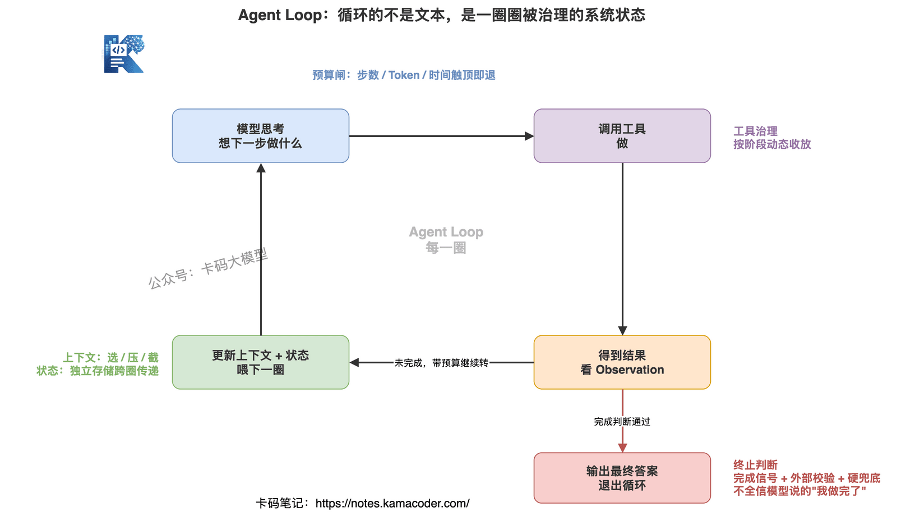
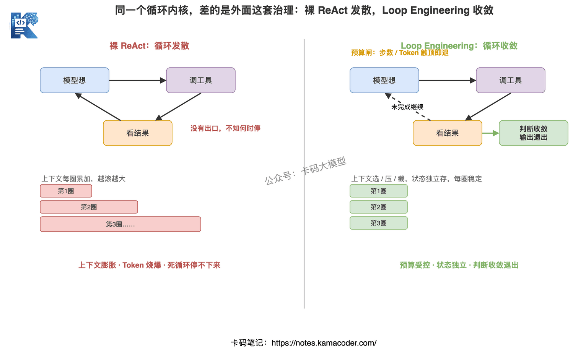

# Loop详解：从ReAct到Loop Engineering，Agent到底在循环什么

> 来源: https://notes.kamacoder.com/interview/llm/loop_engineering_interview.html

# `# Loop详解：从ReAct到Loop Engineering，Agent到底在循环什么 
 

前面在 Agent 大厂面试题汇总 里讲过 ReAct，把它当作四种 Agent 工作模式之一，知道了"思考-行动-观察"这个三步循环；在 Claude Code 深度拆解 里又看到，一个真实的 AI 编程工具，核心就是一个 while 循环。 

这篇接着往里走一层。 

最近 知识星球  (opens new window) 里冒出来一个新词——**Loop Engineering**。有录友面试被问到"你怎么理解 Agent 的 Loop Engineering"，当场卡住，因为他只知道"ReAct 不就是个循环吗，写个 while 就完事了"。 

**问题恰恰就出在这。** 

如果你觉得 Agent 的循环就是"写个 while 把模型和工具串起来"，那面试官追一句"那这个循环里到底在循环什么、怎么保证它收敛、怎么不让它把 Token 烧爆"，你就答不下去了。 

ReAct 是 2022 年的东西，它是个 Prompt 范式。而 2026 年大厂在生产里跑的 Agent，循环这件事早就不是"写个 while"那么简单了。**循环本身，已经成了一个需要专门工程化的对象。** 这就是 Loop Engineering。 

这篇文章把"循环"这件事单独拎出来，从 ReAct 讲到 Loop Engineering，把"Agent 到底在循环什么"这个问题彻底讲透。认真看完，面试再被追问循环，你能一层层接住。 

## `# 目录 
  - `回到原点：ReAct 到底是什么   - `ReAct 撑不住了：纯 Prompt 范式的五个裂缝   - `Loop Engineering 是什么？循环从"技巧"变成"系统"   - `Agent 到底在循环什么？拆开循环里流动的五样东西   - `ReAct → Loop Engineering：演进对比   - `和 Context / Harness Engineering 什么关系   - `大厂真实面试追问汇总 

## `# 1. 回到原点：ReAct 到底是什么 

面试官常这么开场："你说说 ReAct 的原理？"——很多人答到"思考-行动-观察循环"就停了。这只答了一半，另一半是 **ReAct 的本质是什么**。 

ReAct 出自 2022 年 Google 的论文《ReAct: Synergizing Reasoning and Acting in Language Models》。它解决的问题是：早期的大模型要么只会"想"（Chain-of-Thought，推理一长串但不动手），要么只会"做"（直接调工具但不解释为什么）。ReAct 把两者拧到一起——**让模型在每一步先写出推理（Reasoning），再给出动作（Acting），看到结果后继续推理**。 

跑起来就是那段经典的文本： 

```
Thought: 用户问北京明天天气，我需要调天气工具
Action: get_weather(city="北京", date="明天")
Observation: {"weather":"中雨","temp":"14-20°C"}
Thought: 查到了，是中雨，可以回答了
Final Answer: 明天北京中雨，14-20°C，记得带伞

```

 

这里有个关键认知，面试要能说出来：**ReAct 的本质是一个 Prompt 范式，不是一套系统架构。** 

它的全部"魔法"就在于，用一段精心设计的提示词，诱导模型按 `Thought / Action / Observation` 这个格式输出，外面再写个循环，把 Observation 拼回上下文喂给模型，让它接着想。**循环的对象，是一段不断变长的文本。** 

这就是 ReAct 的历史地位：它第一次让"让模型自己决定下一步干什么"变得可行，几乎所有早期 Agent 框架（LangChain、AutoGPT）都建在它之上。 

但也正因为它是个纯文本范式，往生产里一放，问题全来了。 

## `# 2. ReAct 撑不住了：纯 Prompt 范式的五个裂缝 

面试官会问："ReAct 这么经典，为什么大厂生产环境不直接用裸 ReAct？" 这道题答得好不好，直接区分"看过博客"和"真上手做过"。 

裸 ReAct 在 Demo 里很惊艳，一上量就裂。五个裂缝： 

**裂缝一：上下文越滚越长。** ReAct 每一圈都把新的 Thought、Action、Observation 拼回上下文。一个工具返回 2000 行日志，原封不动塞进去；跑 30 步，上下文直接撑爆窗口。结果是 Token 成本指数上涨，而且模型注意力被稀释——关键指令淹没在一堆 Observation 里，越跑越蠢。这个现象在 Agent 漂移与幻觉怎么解 里叫"注意力稀释"。 

**裂缝二：状态全靠上下文记。** 裸 ReAct 没有独立的状态存储，"我已经做到哪一步了、拿到过什么结果"全靠模型从上下文里自己读。上下文一截断，状态就丢了，模型可能重复执行已经做过的步骤，甚至忘了原始目标——这就是任务漂移的源头。 

**裂缝三：死循环。** 工具反复失败时，模型会一遍遍用相同参数重试同一个工具，卡死在那。裸 ReAct 自己跳不出来，因为它"看不见"自己在重复。 

**裂缝四：终止判断不可靠。** 循环什么时候停？裸 ReAct 全交给模型——模型说"Final Answer"就停。但模型可能没做完就宣布完成（偷懒），也可能做完了还在反复确认（停不下来）。把收敛判断完全托付给概率模型，本身就不工程。 

**裂缝五：不可观测。** 出了问题，你只有一坨混在一起的对话文本。哪一步调了什么工具、花了多少 Token、为什么走偏，全得人肉从文本里扒。生产环境根本没法排查。 

看明白这五个裂缝，你就懂了：**问题不在模型，在循环。** 模型负责"想",但"循环怎么转、转几圈、每圈喂什么、什么时候停、转的过程能不能看见"——这些全是循环这个控制结构的事，模型管不了。 

把这些问题一个个工程化解决，就是 Loop Engineering。 

## `# 3. Loop Engineering 是什么？循环从"技巧"变成"系统" 

一句话定义：**Loop Engineering 就是把 Agent 的循环本身当作一个需要设计、控制和观测的工程系统，而不是一段顺手写出来的 while。** 

ReAct 时代，循环是"技巧"——你的精力花在调 Prompt，让模型乖乖输出 `Thought/Action`。循环代码本身是个无脑 while，没人当回事。 

Loop Engineering 时代，循环是"系统"——Prompt 怎么写当然还重要，但工程重心转移到了**循环这个控制结构上**： 
  - 每一圈往模型喂什么上下文（不是无脑全拼，要选、要压、要截）   - 状态独立存哪、怎么在圈与圈之间传递   - 这一圈花了多少 Token、还剩多少预算、超了怎么办   - 这一圈模型能用哪些工具（工具集可以动态变）   - 凭什么判断该停了（不全信模型说的"我做完了"）   - 整圈过程怎么记录下来供回放和排查 

说白了，**ReAct 关心的是"模型这一步想对了没"，Loop Engineering 关心的是"这台不断转的机器会不会失控、会不会跑偏、会不会烧钱、停不停得下来"。** 

这正好呼应 Claude Code 深度拆解 里那句话：Agent 架构没有魔法，核心就是个 while 循环——但**所有的复杂性，工具选择、上下文管理、安全检查，都是在这个循环的各个环节上做文章**。那篇讲的是"循环长什么样"，这篇讲的是"循环里的每个环节具体要工程化什么"。 

## `# 4. Agent 到底在循环什么？拆开循环里流动的五样东西 

这是全文的核心，也是面试最能拉开差距的一问："你说 Agent 在循环，那它到底在循环什么？" 

普通答案："循环思考-行动-观察。" —— 这是 ReAct 的答案，停在 2022 年。 

好的答案："表面上循环的是思考-行动-观察，但工程上真正在每一圈流动和变化的，是五类变量。Loop Engineering 就是分别治理这五个。" 然后逐个展开。 


 

### `# 变量一：上下文（Context）——循环里要选、要压、要截 

每一圈喂给模型的上下文都在变。裸 ReAct 是"无脑往后拼"，Loop Engineering 是**主动管理**： 
  - **选**：这一圈模型真正需要哪些历史信息？不相关的工具结果别全带上。   - **压**：长的 Observation 先摘要再入上下文，2000 行日志压成 3 行结论。   - **截**：超过阈值时，把早期的对话压缩成一段摘要（Auto-Compact），给关键状态留出空间。 

上下文这块单独展开是另一门学问——往循环里喂什么、怎么喂，是 Context Engineering 的范畴，详见 Claude Code 上下文窗口面试详解。这里要记住的是：**上下文是循环里第一个会失控的变量，不管它，Token 和注意力一起崩。** 

### `# 变量二：状态与记忆（State）——循环里要独立存、要传递 

裸 ReAct 的状态藏在上下文文本里，截断就丢。Loop Engineering 把状态**从上下文里拎出来，独立维护**： 
  - 当前进度（已完成哪些子任务、待办哪些）   - 已经拿到的关键结果（结构化存储，而不是混在对话里）   - 原始目标（单独钉住，每圈提醒模型，防止漂移） 

这样即使上下文被压缩，状态依然完整。这就是为什么生产级 Agent 都有独立的 state/scratchpad 机制——它是循环能跨多步保持一致的基础。记忆系统的设计见 Agent 大厂面试题汇总 的记忆部分。 

### `# 变量三：预算（Budget）——循环里要计数、要设上限 

这是裸 ReAct 完全没有、而生产环境必须有的东西。每一圈都要问： 
  - 已经转了几步？（步数预算，通常 15-50 步封顶）   - 累计花了多少 Token / 多少钱？（成本预算）   - 跑了多久？（时间预算） 

任何一个预算触顶，循环就该优雅退出——基于已有信息给个答案，而不是无限烧下去。**把预算当成循环的一等公民，是 Loop Engineering 和裸 ReAct 最直观的区别。** 面试时这点一定要主动提，体现你有成本意识，相关的成本治理见 Multi-Agent Harness 面试详解。 

### `# 变量四：可用工具集（Tools）——循环里可以动态变 

裸 ReAct 通常把所有工具一股脑塞给模型。但工具一多（几十上百个），模型选工具就开始出错、甚至调用不存在的工具。Loop Engineering 让**工具集随循环阶段动态收放**： 
  - 规划阶段只给"检索类"工具，执行阶段才放开"写入类"工具   - 根据当前子任务，只暴露相关的工具子集   - 危险工具（删除、转账）加二次确认或权限门 

工具集是循环里一个常被忽略、但很影响稳定性的变量。工具怎么治理详见 Multi-Agent Harness 面试详解。 

### `# 变量五：终止与收敛判断（Termination）——循环里最难、不能全信模型 

循环什么时候停，是 Loop Engineering 里最硬的一块。不能像裸 ReAct 那样"模型说 Final Answer 就停"，要多重信号： 
  - **结构化完成信号**：让模型输出明确的 `done: true` 字段，而不是靠解析自然语言   - **外部校验**：模型说做完了，用规则或另一个检查再验一遍（任务目标真达成了吗）   - **兜底闸**：预算触顶、重复动作检测、超时——这几道是硬退出，不给模型商量的余地 

死循环防控（最大步数、重复动作检测、超时）的代码示例，Agent 大厂面试题汇总 里给过，这里强调的是更上一层：**收敛判断要"模型信号 + 外部校验 + 硬兜底"三层叠加，不能单点依赖模型。** 

把这五个变量摆在一起看，"Agent 到底在循环什么"就有答案了：**循环的不是一段文本，是一个由上下文、状态、预算、工具、终止条件构成的、不断演化的系统状态。** Loop Engineering 就是让这个系统状态可控地收敛到目标，而不是放任它发散。 

## `# 5. ReAct → Loop Engineering：演进对比 

把前面拆的东西收成一张对比，面试时能照着这个框架答： 


 

| 维度  ReAct（2022，Prompt 范式）  Loop Engineering（生产范式） 
| 循环的对象  一段不断变长的文本  上下文+状态+预算+工具+终止的系统状态 
| 工程重心  调 Prompt 让模型按格式输出  设计循环的每个环节怎么转、怎么收敛 
| 上下文  无脑往后拼  主动选/压/截 
| 状态  藏在上下文里，截断即丢  独立存储，跨圈传递 
| 预算  没有概念  步数/Token/时间多重上限 
| 工具  全量暴露  按阶段动态收放 
| 终止  模型说停就停  模型信号+外部校验+硬兜底 
| 可观测  一坨文本，靠人肉扒  每圈结构化记录，可回放 

要强调的是：**Loop Engineering 不是要取代 ReAct，而是把 ReAct 这个内核，包进一套工程治理里。** 最里面那圈"想-做-看"还在，只是外面多了五道治理。就像裸 SQL 和带连接池、超时、重试、监控的数据库访问层的区别——内核没变，但能不能上生产，差的就是外面这套。 

## `# 6. 和 Context / Harness Engineering 什么关系 

这几个词最近一起火，面试官爱拿来一起问，搞混了会很尴尬。一句话各自划清： 
  - **Context Engineering**：管的是"往循环里**喂什么**"——上下文怎么选、怎么压、怎么排布。   - **Loop Engineering**：管的是"循环这个**控制结构本身**怎么转、怎么收敛"——步数、预算、状态、终止。   - **Harness Engineering**：管的是把循环、上下文、工具、记忆、安全、可观测**全部包在一起的那层外壳**。 

三者是嵌套关系，不是并列竞争：**Context 是循环的输入治理，Loop 是循环的控制治理，Harness 是把这一切兜住的整体框架。Loop 是 Harness 的心脏。** 

记住一个等式（Harness 面试题 里讲过）：**Agent = Model + Harness**。模型负责想，Harness 负责让它在一个受控的循环里把事干完。Loop Engineering，就是这颗心脏怎么跳得稳。Harness 的完整六层组件和来龙去脉，看 Harness Engineering 大厂面试题汇总。 

## `# 7. 大厂真实面试追问汇总 

把高频追问和回答思路整理出来，看完能直接在面试里说。 

**追问一："ReAct 不就是个 while 循环吗，有什么好讲的？"** 

别顺着说"是"。要答：ReAct 的内核确实是循环，但它是个 Prompt 范式，循环的是文本，生产环境有五个裂缝——上下文膨胀、状态易丢、死循环、终止不可靠、不可观测。真正要讲的是怎么把这个裸循环工程化，也就是 Loop Engineering。 

**追问二："你做的 Agent，循环里到底在循环什么？"** 

不要只说"思考-行动-观察"。答：每一圈真正在变化的是五类变量——上下文、状态、预算、工具集、终止判断，然后挑你项目里实际治理过的两三个展开（比如"我们对 Observation 做了摘要压缩，避免上下文爆炸""我们把进度状态独立存了，防止上下文截断丢失"）。 

**追问三："怎么保证 Agent 循环不失控、不死循环、不烧爆 Token？"** 

答四道闸：最大步数限制、重复动作检测、Token/成本预算上限、超时控制。再加一句进阶：终止判断不全交给模型，用"结构化完成信号 + 外部校验 + 硬兜底"三层收敛。 

**追问四："循环跑出问题了，你怎么排查？"** 

答可观测性：每一圈结构化记录（这步调了什么工具、入参出参、花了多少 Token、耗时多少、状态怎么变），出问题能回放定位到具体某一圈，而不是从一坨对话文本里人肉扒。展开看 Agent Harness 可观测性面试详解。 

**追问五："Loop Engineering、Context Engineering、Harness Engineering 怎么区分？"** 

答嵌套关系：Context 管喂什么进循环，Loop 管循环本身怎么转怎么停，Harness 是把循环+上下文+工具+记忆+安全+可观测包在一起的外壳，Loop 是 Harness 的心脏。 

**追问六："那 ReAct 还有用吗？以后是不是被淘汰了？"** 

答：没被淘汰，被"包"起来了。Loop Engineering 最里面那圈"想-做-看"还是 ReAct 的内核，只是外面加了五道工程治理。理解 ReAct 仍是地基，但只懂 ReAct 不够。 

## `# 常见问题（FAQ） 

**Q：ReAct 和 Loop Engineering 是什么关系？** 

ReAct 是 2022 年提出的一个 Prompt 范式，循环的是"思考-行动-观察"这段文本模板。Loop Engineering 是把循环本身当作工程对象来设计，循环里要治理的是上下文、状态、预算、工具、终止判断这一整套系统变量，ReAct 只是它最朴素的起点。 

**Q：Agent Loop 到底在循环什么？** 

不只是"思考-行动-观察"。每一圈真正在流动和变化的是五样东西：上下文（Context）、状态与记忆（State）、预算（Budget，Token 和步数）、可用工具集（Tools）、终止与收敛判断（Termination）。Loop Engineering 就是分别工程化这五个变量。 

**Q：为什么纯 ReAct 在生产环境撑不住？** 

ReAct 是纯 Prompt 范式，有五个裂缝：上下文越滚越长导致 Token 爆炸和注意力稀释、状态全靠上下文记忆容易丢、工具反复失败时会死循环、终止判断交给模型不可靠、整个循环不可观测难排查。生产环境必须在循环外面加工程治理。 

**Q：怎么防止 Agent Loop 失控或死循环？** 

至少四道闸：最大步数限制（通常 15-50 步）、重复动作检测（连续相同调用直接退出）、Token/成本预算上限、超时控制。更进一步是终止判断不全交给模型，用结构化的完成信号加外部校验来收敛。 

**Q：Loop Engineering 和 Harness Engineering、Context Engineering 什么关系？** 

Context Engineering 关注往循环里喂什么上下文，Loop Engineering 关注循环这个控制结构本身怎么转、怎么收敛，Harness Engineering 是把循环、上下文、工具、记忆、安全、可观测包在一起的整套外壳。Loop 是 Harness 的心脏。 

## `# 写在最后 

很多录友学 Agent，停在"ReAct 就是思考-行动-观察"这一句话上。这句话没错，但它是过去的认知。 

2026 年面试官想听的，是你知道这个循环放到生产里会怎么裂、你怎么把它治住。**循环不是写个 while 就完事，循环本身就是工程。** 上下文要管、状态要存、预算要卡、工具要收放、终止要校验、过程要可观测——这六件事做到位，你的 Agent 才从"Demo 能跑"变成"线上能用"。 

把这篇和 Graph Engineering 与 Agent 图编排、Agent 大厂面试题汇总、Harness Engineering 大厂面试题汇总、Claude Code 深度拆解 串起来看，ReAct 是地基、Loop 是单个控制单元、Graph 是多个单元之间的编排、Context 是输入、Harness 是外壳，这张网连起来，面试里关于 Agent 循环的追问，你就能一层层接住了。 

加油
