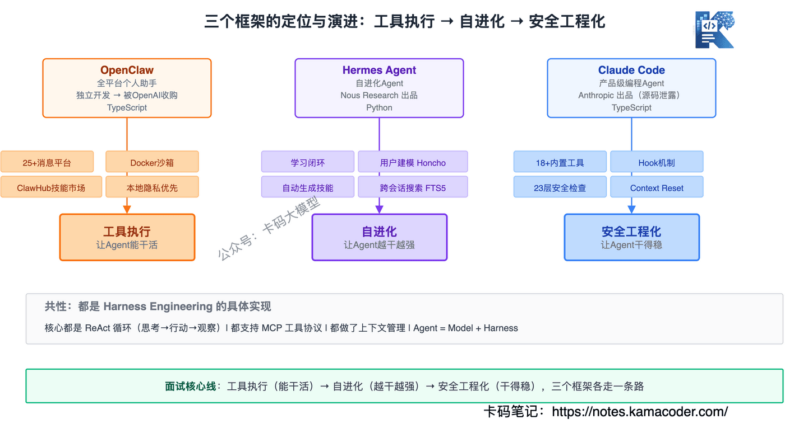
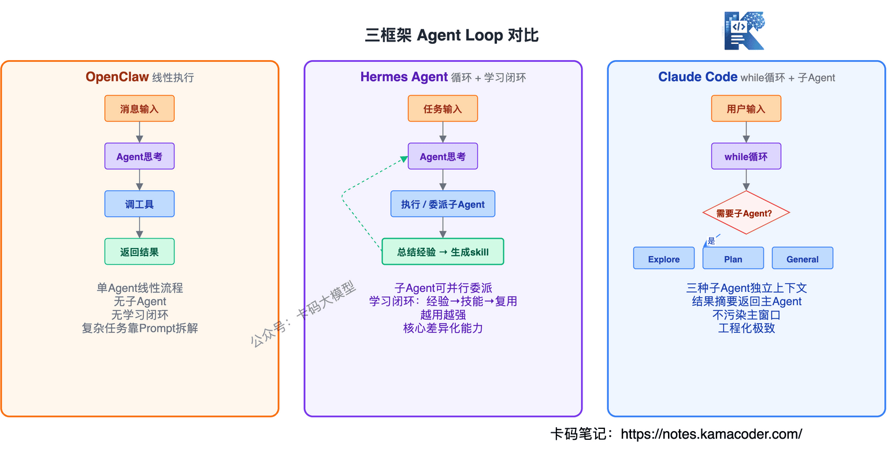
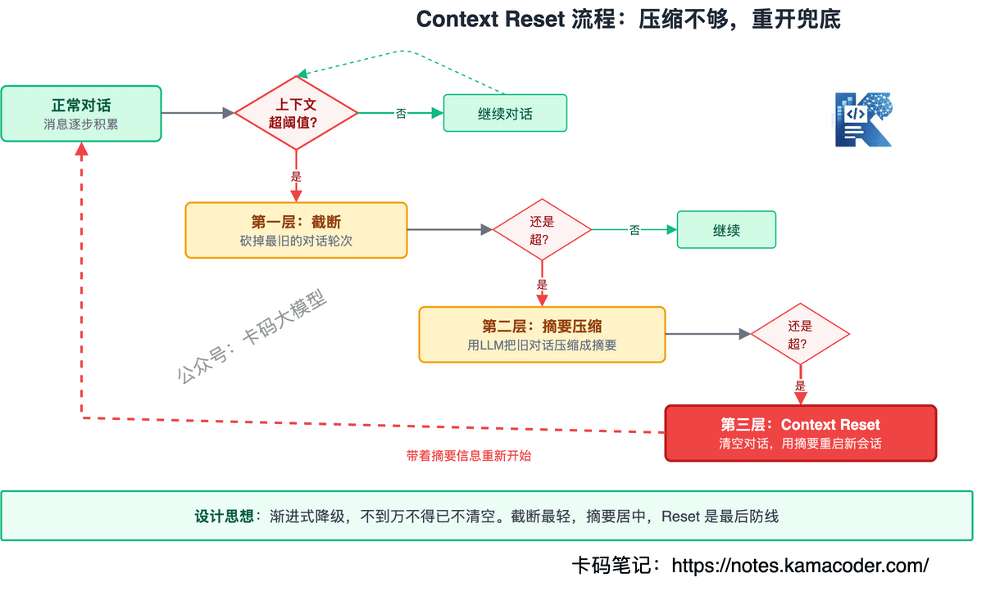
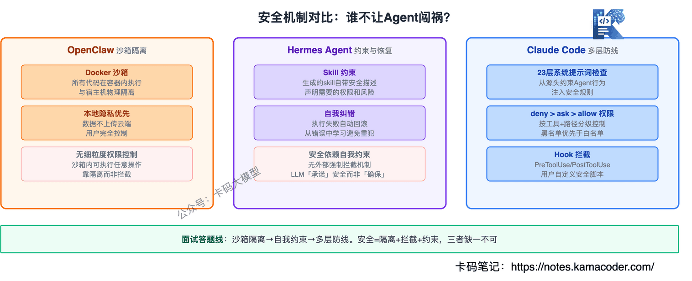

# OpenClaw、Hermes Agent、Claude Code三框架横评：面试必懂的对比

> 来源: https://notes.kamacoder.com/interview/llm/agent_framework_comparison.html

# `# OpenClaw、Hermes Agent、Claude Code三框架横评：面试必懂的对比 
 

现在大厂面Agent开发岗，面试官动不动就问："**你了解哪些Agent框架？它们的记忆机制、工具调用、上下文管理有什么不同**？" 

不少录友能说出OpenClaw、Hermes Agent、Claude Code这三个名字，但一追问就露馅——只知道名字，不知道里面怎么干的，更说不清楚三者之间到底差在哪。 

字节agent开发岗的面试里，就有录友被问到"这三个框架的记忆系统怎么实现的"、"Claude Code的Hook是怎么实现的"这种深挖题。 

这篇文章把三个框架**从底层架构到核心机制全部对比讲透**，认真看完，面试官再追问你就不怕了。 

**三者的定位一句话区分**：OpenClaw是全平台个人助手，Hermes Agent是自进化Agent，Claude Code是产品级编程Agent。它们都是Harness Engineering的具体实现，但各自走了不同的路。 

关于Harness Engineering的完整拆解，可以看这篇Harness面试文章。关于Claude Code的万字深度解析，可以看这篇Claude Code拆解。本文聚焦在**三者对比**，不重复展开细节。  

## `# 目录 
  - **一、三个框架是什么？怎么冒出来的？**   - **二、架构对比：底层设计思路有什么不同？**   - **三、记忆机制对比：各自怎么管理状态？**   - **四、工具调用对比：各自怎么调工具？**   - **五、上下文管理对比：窗口满了怎么办？**   - **六、安全机制对比：各自怎么防"翻车"？**   - **七、什么时候选哪个？**   - **八、大厂真实面试追问汇总**  

## `# 一、三个框架是什么？怎么冒出来的？ 

面试官会问："你了解OpenClaw、Hermes Agent、Claude Code吗？它们分别是什么？" 

### `# OpenClaw：全平台个人助手 

OpenClaw是一个开源的个人AI助手，吉祥物是一只太空龙虾叫Molty，所以圈子里叫它"小龙虾"。 

核心定位是**消息优先、本地优先**——一个网关进程打通25+消息平台（WhatsApp、Telegram、Slack、Discord、微信、QQ、飞书……），你的AI助手无处不在。 

OpenClaw最早由独立开发者社区打造，后来被OpenAI收购纳入旗下。它不是OpenAI内部团队从零写的，而是先有社区产品，再被大厂收编——这个出身决定了它的基因是**开源、开放、社区驱动**。 

技术栈是TypeScript，跑在本地，隐私优先。 

### `# Hermes Agent：自进化Agent 

Hermes Agent是Nous Research出品的自进化Agent，标语是"The agent that grows with you"（和你一起成长的Agent）。 

它做了一个非常关键的升级：**从"工具执行系统"→"自进化系统"**。内置了学习闭环（Learning Loop），会从经验中生成新技能，下次直接复用。 

技术栈是Python，核心差异化是学习闭环。 

### `# Claude Code：产品级编程Agent 

Claude Code是Anthropic官方推出的AI编程助手，和Cursor、Windsurf是同类产品，但它是目前唯一一个完整源码被泄露过的——2026年3月31日，Anthropic不小心把512,000行TypeScript代码全部公开了。 

这次泄露让我们第一次看到了一个产品级AI编程工具的完整内部结构。系统提示词、工具定义、安全规则、子Agent架构、上下文管理策略，全部一览无余。 

技术栈是TypeScript，定位是**编程场景的专用Agent**。 

### `# 一句话区分 

| 框架  一句话定位  核心差异化 
| OpenClaw  全平台个人助手  消息覆盖最广，本地隐私 
| Hermes Agent  自进化Agent  学习闭环，越用越强 
| Claude Code  产品级编程Agent  工程化极致，安全最完善 


  

## `# 二、架构对比：底层设计思路有什么不同？ 

面试官会问："这三个框架的底层架构有什么区别？" 

### `# Agent Loop的实现方式 

三个框架的核心都是一个循环：接收任务→思考→执行→观察→继续或结束。但循环的"编排方式"不同。 

**OpenClaw：单Agent线性循环** 

OpenClaw是最简单的结构——一个Agent跑一个循环，你给它消息，它调工具，返回结果。没有子Agent，没有复杂编排，就是"输入→工具调用→输出"的线性流程。 

简单，但意味着复杂任务要么靠Prompt拆，要么靠外部系统调度。 

**Hermes Agent：单Agent + 子Agent并行委派** 

Hermes在单Agent循环的基础上，加了子Agent并行委派能力——主Agent可以把子任务派给子Agent并行执行，结果汇总后主Agent继续决策。 

更关键的是，Hermes在循环里嵌了一个**学习闭环**： 

```
执行任务 → 总结经验 → 生成skill → 存入记忆 → 下次复用

```

 

这让Hermes不是简单的"跑完就忘"，而是越跑越强。 


 

**Claude Code：while循环 + 三种子Agent** 

Claude Code的核心就是一个while循环——不断"思考→行动→观察"，直到模型自己判断任务完成。伪代码就几行： 

```
while (true) {
  response = claude.chat(messages)
  if (response.type === 'text') break    // 模型认为任务完成
  if (response.type === 'tool_use') {
    result = executeTool(response.tool, response.params)
    messages.push(result)                 // 结果加入下一轮
  }
}

```

 

但它在这个简单循环上做了三种子Agent扩展：Explore（搜索探索）、Plan（规划拆解）、General-purpose（通用执行）。子Agent是独立上下文窗口，跑完把结果摘要返回主Agent，不污染主窗口。 

### `# 架构对比表 

| 维度  OpenClaw  Hermes Agent  Claude Code 
| 核心循环  单Agent线性  单Agent + 子Agent并行  while循环 + 三种子Agent 
| 编排方式  线性执行  可并行委派  串行为主，子Agent独立上下文 
| 学习能力  无  学习闭环  无（但靠CLAUDE.md积累项目知识） 
| 复杂任务处理  靠Prompt拆解  子Agent并行  子Agent隔离执行 
| 语言  TypeScript  Python  TypeScript 


 

### `# 面试答法 

先说共性：三个框架核心都是ReAct循环。再说差异：OpenClaw是线性执行，适合单任务场景；Hermes加了并行委派和学习闭环，适合需要积累经验的长期任务；Claude Code用子Agent隔离复杂任务，每个子Agent有独立上下文窗口，不会互相污染。  

## `# 三、记忆机制对比：各自怎么管理状态？ 

这是面试最核心的考点。面试官会问："这三个框架的记忆系统分别怎么实现的？有什么区别？" 

### `# OpenClaw：文件注入 + 本地持久化 

OpenClaw的记忆靠三个文件： 
  - **AGENTS.md**——项目级规范和上下文，每次对话都注入   - **SOUL.md**——Agent的"灵魂"，定义角色、性格、说话风格   - **TOOLS.md**——可用工具的说明和规则 

每次对话开始，这三个文件的内容直接塞进System Prompt。对话过程中的中间结果，写到本地文件系统持久化。 

问题在于：**OpenClaw没有跨会话记忆**。每次对话都是"新手"，不会记住上次聊了什么、做过什么。AGENTS.md是你手动写的规则，不是Agent自己学到的经验。 

### `# Hermes Agent：分层记忆 + 用户建模 + 跨会话搜索 

Hermes的记忆是三个框架里最深的，分了好几层： 

**第一层：持久化记忆**——对话历史和执行结果存到本地，下次启动可以加载。 

**第二层：用户建模（Honcho）**——Hermes内置了一个方言式用户建模系统，会主动学习和记录用户的偏好、习惯、工作方式。不是简单的"记住你上次说了什么"，而是"理解你是哪种类型的人"。 

**第三层：跨会话搜索（FTS5）**——用SQLite的FTS5全文搜索引擎，在历史对话中检索相关片段。你问"上次那个部署脚本怎么写的"，Hermes能从过去的会话里搜出来。 

**第四层：自我督促**——Hermes会主动提醒自己"这个用户上次不喜欢长回复"、"这个项目用TypeScript"。相当于Agent自己给自己写备忘录。 

最关键的是，Hermes的记忆不只是"记住"，还能**转化为技能**——执行完一个复杂任务，自动从经验中提取模式生成一个skill文件，存在`~/.hermes/skills/`，下次遇到类似任务直接复用。 

### `# Claude Code：CLAUDE.md + .claude/目录 + 外化状态 

Claude Code的记忆系统有三个层次： 

**第一层：CLAUDE.md（项目知识）**——放在项目根目录，定义项目规范、技术栈、代码风格。每次对话都注入，但不是放在System Prompt里，而是作为用户消息注入——优先级低于安全规则，但高于普通用户消息。这是Anthropic做的一个安全设计。 

CLAUDE.md还有层级结构：根目录的`CLAUDE.md`全局生效，子目录的`CLAUDE.md`只在进入该目录时注入。这样不同模块可以有不同的规范。 


 

**第二层：.claude/目录（会话状态）**——Agent的中间状态、任务进度、分析结论都外化到文件系统。这就是Harness Engineering里说的"状态外化"——不在上下文窗口里存状态，而是写到文件里。 

好处是：即使Context Reset（整个上下文窗口丢掉换新的），从文件里一读就知道"现在到哪一步了"。 

**第三层：记忆文件系统**——Claude Code支持在`~/.claude/`目录下存放跨项目的长期记忆，比如用户偏好、常用命令模式。 

### `# 记忆机制对比表 

| 维度  OpenClaw  Hermes Agent  Claude Code 
| 工作记忆  AGENTS.md/SOUL.md/TOOLS.md注入  AGENTS.md + 动态加载  CLAUDE.md作为用户消息注入 
| 短期记忆  本地文件持久化  对话历史 + FTS5搜索  .claude/目录 + 会话状态文件 
| 长期记忆  无  Honcho用户建模 + 跨会话搜索  ~/.claude/目录 + 分层CLAUDE.md 
| 经验积累  无（每次都是新手）  学习闭环：执行→总结→生成skill  无自动积累，靠人维护CLAUDE.md 
| 跨会话  不支持  支持（FTS5 + Honcho）  支持（文件系统外化） 
| 记忆检索  无  FTS5全文搜索 + 语义匹配  文件读取（Read工具） 


 

### `# 面试答法 

先说分层：三个框架都有工作记忆（规则注入），但在短期和长期记忆上差异很大。 

OpenClaw最简单——只靠文件注入，没有跨会话记忆，每次都是"新手"。 

Hermes最深——有用户建模、跨会话搜索、学习闭环，能从经验中自动生成技能，越用越强。 

Claude Code最工程化——靠文件系统外化状态，CLAUDE.md分层注入，不做自动学习但做安全隔离。关键设计是CLAUDE.md作为用户消息注入而非System Prompt，防止安全规则被覆盖。  

## `# 四、工具调用对比：各自怎么调工具？ 

面试官会问："这三个框架的工具调用机制有什么不同？" 

### `# OpenClaw：MCP协议 + ClawHub技能市场 

OpenClaw的工具系统基于**MCP协议**，所有工具都通过MCP标准化接口接入。 

它还有一个**ClawHub技能市场**——社区贡献的工具和技能包，装上就能用。这就像手机上的App Store，技能生态丰富是OpenClaw的一大优势。 

执行环境方面，OpenClaw用**Docker沙箱**或SSH后端来隔离工具执行——工具跑在沙箱里，不会直接操作宿主系统。 

### `# Hermes Agent：MCP + 自生成技能 

Hermes也用MCP协议，但在工具系统上做了两个升级： 

**第一，技能可以自动生成**——不是只靠社区贡献，Agent执行完任务后能自己总结出一套技能，存在`~/.hermes/skills/`，遵循`agentskills.io`标准。下次遇到类似任务，搜索已有技能直接复用。 

**第二，工具白名单机制**——不是所有MCP工具都给Agent用，而是根据任务动态决定哪些工具可用。减少Agent"选错工具"的概率。 

Hermes还支持6种终端后端（本地、Docker、SSH、K8s等），适应不同部署环境。 

### `# Claude Code：18+内置工具 + 权限分级 

Claude Code没有用MCP协议（虽然支持MCP Server接入），它走的是**专用内置工具**路线——18+工具全部在代码里定义，每个工具有严格的参数Schema和使用规则。 

工具分五大类：文件操作（Read/Write/Edit/Glob/Grep）、执行（Bash/NotebookEdit）、网络（WebFetch/WebSearch）、Agent（Agent/Skill）、交互（AskUserQuestion/TodoWrite）。 

最关键的设计是**权限分级**： 

```
deny > ask > allow

```

 

每个工具调用前，先查权限表： 
  - **deny**：直接拒绝，不执行   - **ask**：弹窗问用户，用户确认才执行   - **allow**：直接执行 

而且权限可以按工具+路径粒度配置——比如"允许读src/目录，但写src/目录要ask"。 

Claude Code还做了一个设计：**专用工具优先于通用命令**。系统提示词里明确写了"Prefer dedicated tools over Bash"——能用Read就读文件，别用`cat`；能用Edit就改文件，别用`sed`。因为专用工具有更好的错误处理和权限控制。 

### `# 工具调用对比表 

| 维度  OpenClaw  Hermes Agent  Claude Code 
| 工具协议  MCP  MCP  内置定义 + MCP Server支持 
| 工具来源  ClawHub社区市场  自动生成 + agentskills.io标准  18+内置工具 
| 执行隔离  Docker/SSH沙箱  6种终端后端  本地直接执行 + 权限分级 
| 权限控制  沙箱隔离  工具白名单  deny > ask > allow三级 
| 工具选择策略  Prompt驱动  动态白名单  工具描述即规则 + 专用工具优先 
| 技能复用  社区市场下载  自动生成 + 社区标准  Skill调用预定义工作流 


 

### `# 面试答法 

先说共性：三者都支持MCP协议接入外部工具。再说差异：OpenClaw靠ClawHub社区生态，工具多但Agent容易选错；Hermes加了技能自动生成和动态白名单，减少选错概率；Claude Code走专用工具路线，每个工具都有严格定义和权限控制，工具描述里就嵌了使用规则，相当于双重保险。  

## `# 五、上下文管理对比：窗口满了怎么办？ 

面试官会问："这三个框架怎么管理上下文窗口？窗口满了怎么办？" 

### `# OpenClaw：文件注入 + 动态裁剪 

OpenClaw的上下文管理比较简单：每次对话开始，把AGENTS.md、SOUL.md、TOOLS.md的内容注入，然后对话历史逐步累积。 

窗口快满的时候，OpenClaw的策略是**动态裁剪**——按时间顺序把最早的对话内容裁掉，保留最近的。这和大多数聊天应用的"滑动窗口"一样，简单粗暴但没有更精细的策略。 

OpenAI在做Codex时踩过一个坑：早期把AGENTS.md写成百科全书，内容越来越长，模型注意力被严重稀释。后来改成"目录页"模式——主文件只保留约100行核心索引，详细内容拆到子文档，Agent按需加载。这就是**渐进式披露（Progressive Disclosure）**。 

### `# Hermes Agent：just-in-time retrieval + 分层注入 

Hermes的上下文管理更精细，核心是**just-in-time retrieval**——不是一开始就把所有信息塞进去，而是Agent边干活边按需抓取。 

分层注入策略： 
  - **始终注入**：AGENTS.md核心规则、当前任务目标   - **按需加载**：技能详情、历史会话片段、工具说明   - **动态替换**：根据当前步骤，把不再需要的上下文替换成新的 

Hermes还用FTS5做上下文检索——不是把所有历史对话都塞进窗口，而是根据当前任务搜索最相关的片段，只把相关片段注入。 

### `# Claude Code：200K窗口 + 三层压缩 + Context Reset 

Claude Code的上下文管理是三个框架里最工程化的，分三层： 

**第一层：对话历史管理** 

200K Token的上下文窗口，按优先级排列： 
  - System Prompt（~8,700 Token，不可压缩）   - 对话历史（最近N轮完整保留）   - 工具返回结果（大文件自动截断） 

**第二层：自动压缩** 

当上下文接近窗口上限时，Claude Code自动触发压缩： 
  - 早期对话压缩成摘要   - 工具返回的大文件只保留关键片段   - 子Agent的执行结果只保留摘要，不保留完整过程 

**第三层：Context Reset** 

这是Anthropic在Harness Engineering里提出的关键方案——当压缩都不够时，**直接把整个上下文窗口丢掉，换一个干净的**。 

听起来很暴力，但逻辑是：状态已经外化到文件系统了，新窗口从文件里一读就知道"现在到哪一步"。这比在腐化的上下文里硬撑要好得多。 

就像遇到内存泄漏时的做法——不拼命优化内存，直接重启进程，从磁盘恢复状态。**重启胜过修补。** 


 

### `# 上下文管理对比表 

| 维度  OpenClaw  Hermes Agent  Claude Code 
| 上下文窗口  依赖底层模型  依赖底层模型  200K Token 
| 满窗口策略  动态裁剪（滑动窗口）  just-in-time检索  三层压缩 + Context Reset 
| 规则文件策略  全量注入  渐进式披露  CLAUDE.md分层 + 按目录注入 
| 历史对话管理  裁剪旧内容  FTS5检索相关片段  摘要压缩 
| 子Agent上下文  不支持  并行子Agent共享  子Agent独立窗口，结果摘要返回 


 

### `# 面试答法 

先说核心矛盾：上下文窗口是稀缺资源，三个框架都在解决"有限窗口里放什么"的问题。 

OpenClaw最简单——滑动窗口裁剪旧内容。Hermes更精细——just-in-time按需加载，只把相关的片段注入。Claude Code最工程化——三层压缩机制，实在不行就Context Reset整个换新窗口，状态从文件系统恢复。 

Context Reset是面试加分点：说清楚"重启胜过修补"的思路，状态外化到文件是前提条件，否则Reset就真的失忆了。  

## `# 六、安全机制对比：各自怎么防"翻车"？ 

面试官会问："这三个框架怎么保证安全？Agent不会乱来吗？" 

### `# OpenClaw：沙箱隔离 

OpenClaw的安全主要靠**执行环境隔离**——工具跑在Docker容器或SSH远程机器里，不直接操作宿主系统。即使Agent执行了危险命令，影响范围也限制在沙箱内。 

但OpenClaw没有细粒度的权限控制——要么在沙箱里全都能做，要么不在沙箱里啥都做不了。缺少"这个可以读但那个不能写"的精细度。 

### `# Hermes Agent：约束与恢复层 

Hermes的安全体现在Harness的第六层——**约束与恢复**： 
  - **约束**：定义Agent不能做什么，硬编码到代码或linter里，不靠Prompt   - **校验**：每步输出前后做自动检查，格式、内容、权限   - **恢复**：失败有预案——API限流就等一会重试，token快耗光就保存进度 

Hermes还支持定时任务（cron），可以设定期检查和自修复任务。 

### `# Claude Code：23层安全检查 + Hook机制 

Claude Code的安全是三个框架里最完善的，分两套体系： 

**第一套：23层顺序安全检查** 

每次工具调用前，都要过23层检查——从权限评估到内容审查到敏感信息过滤。核心逻辑是`deny > ask > allow`的权限分级： 
  - 先查deny列表——在deny里的操作直接拒绝   - 再查allow列表——在allow里的操作直接放行   - 都不在的默认ask——弹窗问用户 

权限可以按工具+路径+参数粒度配置。比如"允许读src/目录的文件，但写src/目录要确认，删除任何文件都拒绝"。 

**第二套：Hook机制（面试加分点）** 

Hook是Claude Code里一个非常重要的安全机制，面试官特别喜欢问。 

Hook的本质是**在工具调用的前后插入自定义逻辑**。它的工作方式： 

```
用户输入 → Hook Pre-processing → 模型推理 → 工具调用 → Hook Post-processing → 返回结果

```

 

具体来说，Hook支持四种事件： 
  - **PreToolUse**：工具执行前触发——可以拦截、修改参数、记录日志   - **PostToolUse**：工具执行后触发——可以检查结果、追加操作、过滤敏感信息   - **Notification**：通知事件——Agent向用户发送消息时触发   - **Stop**：停止事件——Agent循环结束时触发 

配置写在`.claude/settings.json`里，比如： 

```
{
  "hooks": {
    "PreToolUse": [
      {
        "matcher": "Bash",
        "command": "check-dangerous-cmd.sh"
      }
    ],
    "PostToolUse": [
      {
        "matcher": "Write",
        "command": "scan-secrets.sh"
      }
    ]
  }
}

```

 

这段配置的意思是：每次调用Bash工具前，先跑`check-dangerous-cmd.sh`检查命令是否危险；每次Write工具执行后，跑`scan-secrets.sh`扫描有没有写入敏感信息。 


 

**Hook为什么重要？** 因为它把安全规则从"写在Prompt里靠模型自觉遵守"变成了"硬编码到执行层强制执行"。模型想绕过Prompt里的规则是有可能的，但绕不过Hook——Hook在代码层面拦截，模型看不到也改不了。 

### `# 安全机制对比表 

| 维度  OpenClaw  Hermes Agent  Claude Code 
| 核心策略  沙箱隔离  约束与恢复层  23层检查 + Hook 
| 权限粒度  沙箱级（全有或全无）  工具白名单  工具 + 路径 + 参数级 
| 规则执行方式  环境隔离  代码硬编码  deny > ask > allow + Hook 
| 事后审计  基础日志  自我督促 + LLM摘要  Hook PostToolUse + 审计日志 
| 敏感信息防护  沙箱隔离  校验层  23层内容审查 + Hook扫描 
| 自定义安全逻辑  无  linter规则  Hook脚本 


 

### `# 面试答法 

先说思路差异：OpenClaw靠隔离（沙箱），Hermes靠约束（代码硬编码），Claude Code靠分层检查+Hook。 

Hook是加分点——说清楚Hook在工具调用前后插入自定义逻辑，把安全规则从"靠Prompt"变成"靠代码强制执行"。模型可能绕过Prompt里的规则，但绕不过Hook。  

## `# 七、什么时候选哪个？ 

面试官会问："这三个框架分别适合什么场景？" 

### `# 按场景选 


 

**选OpenClaw**——你需要一个**全平台在线的AI助手**，能在微信、飞书、Discord、Telegram上随时随地响应。本地运行，隐私有保障。个人使用场景最合适。 

**选Hermes Agent**——你需要一个**越用越强的Agent**，能从经验中学习、自动生成新技能、跨会话记住你的偏好。长期运行的Agent场景最合适，比如持续运维、个人知识管理。 

**选Claude Code**——你需要一个**安全可控的编程Agent**，能在真实代码仓库里干活，有完善的权限管理和Hook机制。团队协作、生产环境编程场景最合适。 

### `# 按团队阶段选 

| 阶段  推荐  原因 
| 个人开发者  OpenClaw  上手快，全平台覆盖，社区生态丰富 
| 想做自进化系统  Hermes Agent  学习闭环是核心竞争力 
| 企业级编程  Claude Code  安全最完善，权限最细粒度 
| 多Agent协作  Hermes Agent  子Agent并行委派 
| 长链路任务  Claude Code  Context Reset + 状态外化 

### `# 注意：不冲突 

三个框架不是二选一的关系。Hermes内置了`hermes claw migrate`命令，可以从OpenClaw导入配置。Claude Code也支持MCP Server接入，可以和OpenClaw的工具生态打通。 

实际项目中完全可以组合使用——比如用OpenClaw做消息入口，Hermes做后台自进化，Claude Code做代码编辑。  

## `# 八、大厂真实面试追问汇总 

### `# 概念理解类 

**Q：为什么这三个框架放在一起比？它们有什么共性？** 

它们都是Harness Engineering的具体实现——Agent = Model + Harness，这三个框架做的都是Harness这一层。共性是都用了ReAct循环、都支持MCP工具协议、都做了上下文管理。差异是各自在Harness六层组件上的侧重不同：OpenClaw重工具生态，Hermes重学习闭环，Claude Code重安全机制。 

**Q：为什么面试官喜欢问这三个框架？** 

因为它们代表了Agent框架的三种演进方向：OpenClaw是"工具执行系统"（让Agent能干活），Hermes是"自进化系统"（让Agent越干越强），Claude Code是"安全工程化系统"（让Agent干得稳）。面试官问你这三个框架，本质上是在考你对Agent演进方向的理解。 

### `# 技术深挖类 

**Q：Hermes的学习闭环具体怎么工作？** 

Agent执行完一个复杂任务后，自动从经验中提取模式生成一个skill文件，存在`~/.hermes/skills/`。下次遇到类似任务时搜索已有skill直接复用，同时在使用中不断改进。这和Mitchell Hashimoto说的"复利效应"一脉相承——每次犯错都沉到环境里，环境越来越强，Agent越来越稳。这是OpenClaw做不到的——OpenClaw每次都是"新手"。 

**Q：Claude Code的Hook是怎么实现的？具体机制是什么？** 

Hook是在工具调用的前后插入自定义脚本的机制。支持四种事件：PreToolUse（工具执行前拦截或修改）、PostToolUse（工具执行后检查或过滤）、Notification、Stop。配置写在`.claude/settings.json`里，用matcher匹配工具名，用command指定要执行的脚本。关键点：Hook在代码层面执行，模型看不到也改不了，所以比靠Prompt约束更可靠。 

**Q：CLAUDE.md为什么作为用户消息注入而不是System Prompt？** 

安全设计。System Prompt优先级最高，如果CLAUDE.md放在System Prompt里，用户自定义指令就和Anthropic的安全规则同级，可能被用来绕过安全限制。作为用户消息注入，优先级低于安全规则但高于普通用户消息，是安全和灵活性的平衡。 

**Q：Context Reset和上下文压缩有什么区别？什么时候用哪个？** 

上下文压缩是把历史对话压缩成摘要，腾出空间但模型还带着"疲惫感"——Cognition（做Devin的公司）观察到模型在长上下文里会出现"上下文焦虑"，即使空间够了也想赶紧收尾。Context Reset更暴力——直接把整个上下文窗口丢掉换新的，状态从文件系统恢复。好处是模型没有"疲惫感"，坏处是需要状态完全外化。一般先用压缩，压缩不够再用Reset。 

### `# 生产实战类 

**Q：你们选框架的时候怎么评估的？** 

先看场景：需要全平台消息覆盖选OpenClaw，需要自进化能力选Hermes，需要编程场景的安全控制选Claude Code。再看团队技术栈：TypeScript团队选OpenClaw或Claude Code，Python团队选Hermes。最后看安全要求：企业级高安全要求选Claude Code（23层检查+Hook），个人项目可以选OpenClaw。而且三者不冲突，可以组合使用。 

**Q：AGENTS.md越写越长效果变差怎么办？** 

OpenAI自己踩过这个坑——Codex早期的AGENTS.md变成百科全书，Agent反而更糊涂。解法是渐进式披露：主文件只保留核心索引（约100行），详细规则拆到子文档，Agent按需加载。Anthropic的Agent Skills也是这个思路——不一开始塞所有信息，需要时才动态注入。如果你现在在写CLAUDE.md或Cursor Rules，回去看看自己有没有"百科全书化"，有的话赶紧拆。  

## `# 写在最后 

三个框架，三种演进方向：OpenClaw让Agent**能干活**（全平台+工具生态），Hermes让Agent**越干越强**（学习闭环），Claude Code让Agent**干得稳**（安全工程化）。 

面试时别只会说名字。面试官想听的是你对这三个方向的理解：为什么Agent需要从"能干活"进化到"越干越强"再到"干得稳"？因为真实生产环境里，能用不等于可靠，能用不等于可持续。 

记住这条线：**工具执行→自进化→安全工程化**，面试官问你"Agent框架怎么选"，按这条线答就行。 

加油
