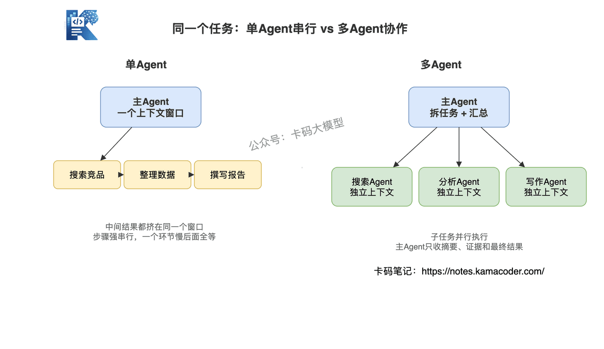
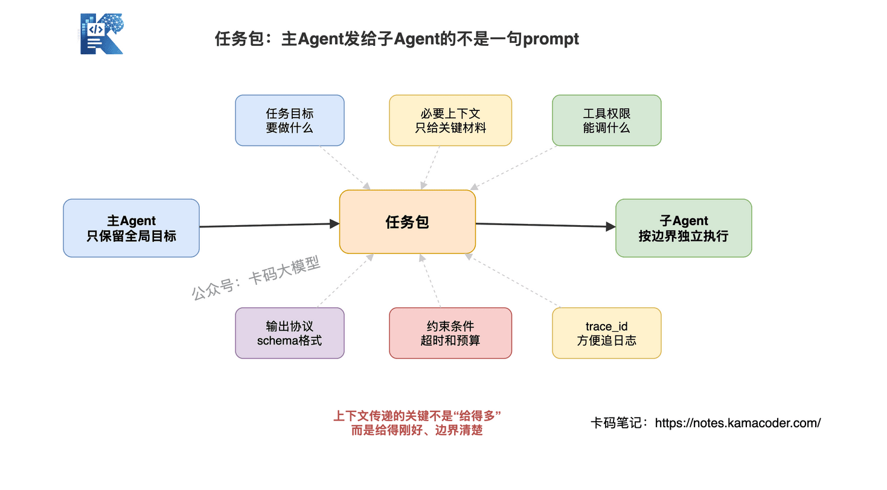
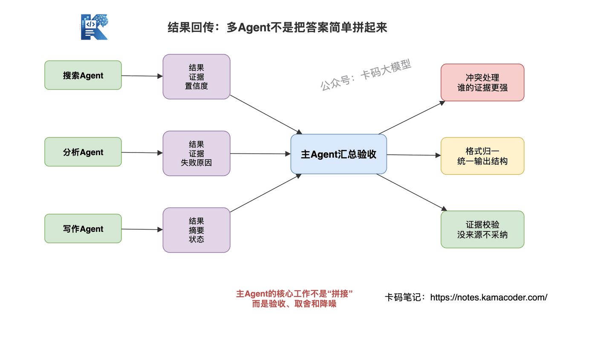
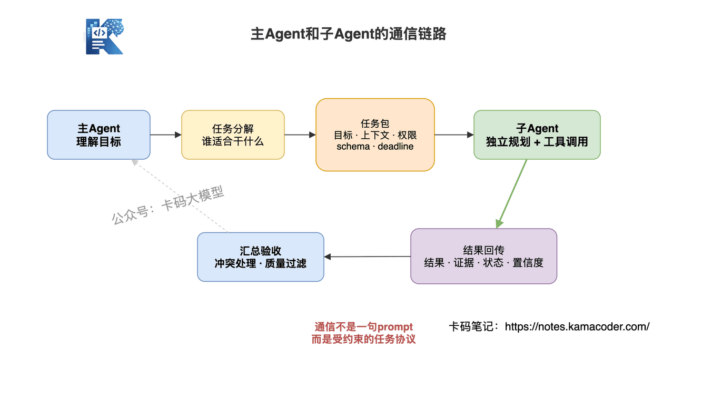
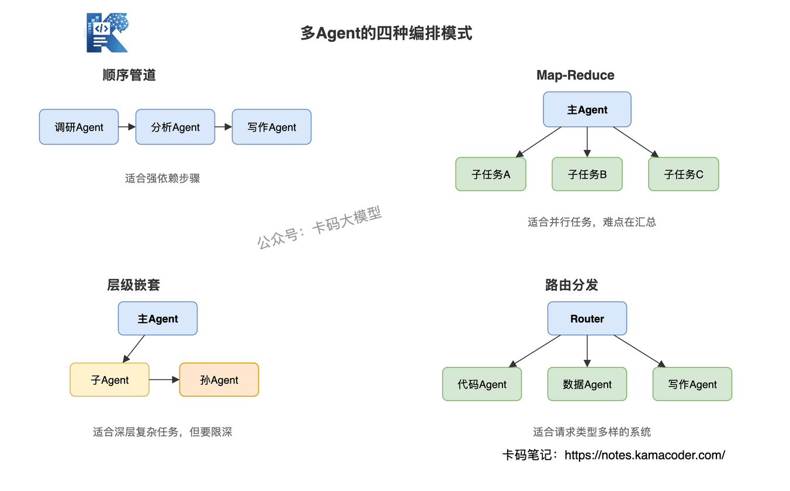
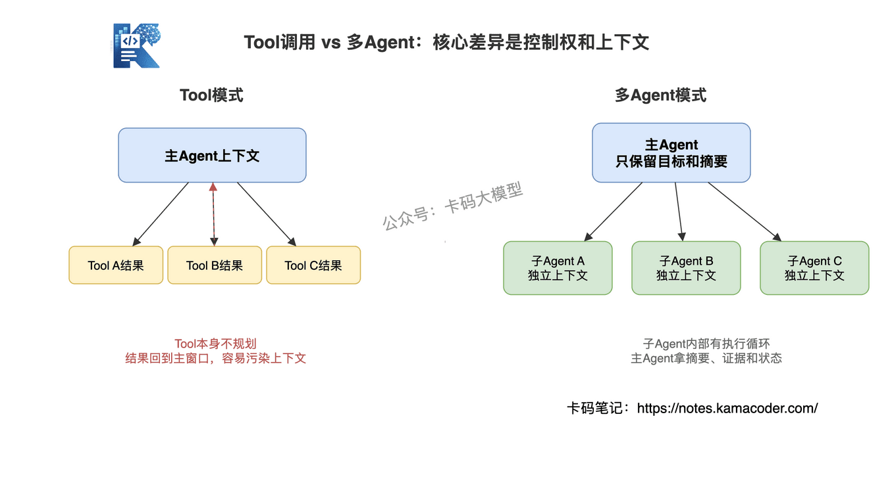
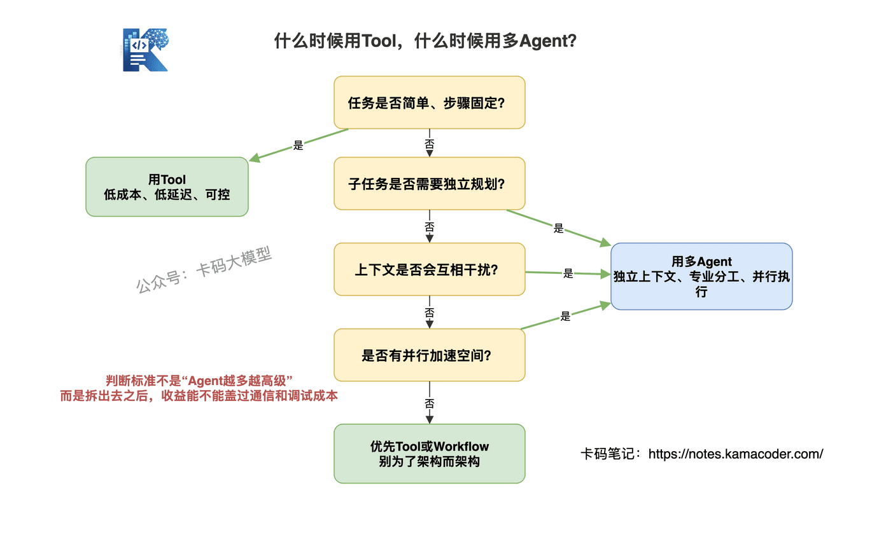
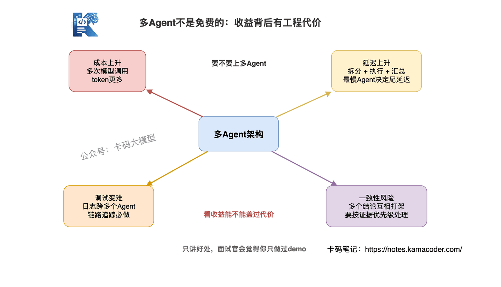

# 多Agent架构面试全解析：通信、编排、Tool取舍与工程代价

> 来源: https://notes.kamacoder.com/interview/llm/multi_agent_communication_interview.html

# `# 多Agent架构面试全解析：通信、编排、Tool取舍与工程代价 

之前分享了录友四面字节Agent开发岗的面经，里面就有一个很不错的面试问题： 

"为什么你这里要拆多个 Agent？一个 Agent 多挂几个 Tool 不行吗？" 

这个问题就是问多Agent架构，看起来简单，但特别容易把人问虚。 

很多录友会答："多 Agent 更智能。" 

这个回答，太浅了。 

面试官下一句大概率就是："智能在哪里？通信怎么做？失败怎么兜底？成本和延迟怎么算？" 

Claude Code大厂面试题汇总 里拆解过 Claude Code 的子Agent机制——主Agent通过Agent工具启动Explore、Plan、General-purpose三类子Agent，各自独立执行，结果回传汇总。这就是一个典型的多Agent架构：看起来是调Tool，内部其实是完整的Agent。 

但Claude Code只是多Agent架构的一种实现。 

更本质的问题是：主Agent和子Agent之间的通信链路到底长什么样？子Agent有几种编排方式？Tool和多Agent的核心区别到底是什么？什么场景值得付出多Agent的代价？ 

这篇文章，把这些问题拆透。 

## `# 目录 
  - 先搞清楚：什么是主Agent和子Agent   - 通信链路全拆解：主Agent和子Agent之间发生了什么

    - 任务分解     - 上下文传递     - 子Agent独立执行     - 结果回传与汇总   - 编排模式：主Agent协调子Agent的四种方式

    - 顺序管道     - Map-Reduce     - 层级嵌套     - 路由分发   - Tool调用 vs 多Agent架构：本质区别在哪   - Agent-as-Tool：中间态，不是非黑即白   - 什么场景用多Agent，什么场景Tool就够了   - 多Agent的代价：不是免费的午餐   - 真实框架怎么做多Agent通信   - 面试怎么答 

## `# 一、先搞清楚：什么是主Agent和子Agent 

先看一个具体场景：用户对AI助手说"帮我分析竞品并生成报告"。 

如果是**单Agent**，它得自己一步步完成：搜索竞品信息 → 整理数据 → 生成图表 → 撰写分析报告。所有步骤共享一个上下文窗口，搜索结果和报告模板挤在一起，工具调用串行执行，一个环节卡住后面全等。 

如果是**多Agent架构**，主Agent收到请求后，拆成三个子任务，分别交给不同的子Agent：搜索Agent负责信息检索，分析Agent负责数据处理和可视化，写作Agent负责撰写报告。三个子Agent并行工作，各自有独立的上下文，互不干扰。 


 

核心区别就一句话：**子Agent不是主Agent的"手"，而是有独立大脑的"协作者"**。主Agent负责规划和协调，子Agent负责执行和反馈。 

注意，这里说的"独立大脑"，不是玄学。 

它具体体现在三个地方：独立的上下文窗口、独立的系统提示词、独立的工具权限。也就是说，搜索Agent可以只拿搜索相关上下文，写作Agent只拿报告结构和结论，不需要把所有中间噪声都塞进同一个窗口里。 

## `# 二、通信链路全拆解：主Agent和子Agent之间发生了什么 

主Agent和子Agent之间的通信，不是简单的"发个指令→收个结果"，而是一个完整的四步链路。 

### `# 第一步：任务分解 

主Agent拿到用户请求后，首先要判断：这个任务能不能一个人干？如果不能，怎么拆？ 

任务分解有三种常见策略： 
  - **按功能域拆**：不同子Agent负责不同专业领域。比如搜索Agent、分析Agent、写作Agent，各管一摊   - **按执行步骤拆**：任务的先后步骤交给不同子Agent。比如"先调研→再分析→最后输出"，每步一个子Agent   - **按专业能力拆**：根据子Agent的擅长领域分配。比如代码相关的给编程Agent，数据相关的给分析Agent 

分解的质量直接决定后续环节的效率。拆太细，通信开销大；拆太粗，子Agent又变成单Agent了。 

面试里可以补一句：**任务拆分的本质，是把"强耦合步骤"留在一个Agent里，把"可独立完成、可并行、上下文互相干扰"的部分拆出去。** 

这句话比单纯背"按功能拆、按步骤拆"更像做过工程。 

### `# 第二步：上下文传递 

主Agent给子Agent传递的不只是一句任务描述，而是一个"任务包"。 

这个任务包里至少包含这些字段： 
  - **任务描述**：要做什么，期望什么输出格式   - **必要上下文**：完成任务所需的关键信息（不是全部上下文，是精简过的）   - **工具权限**：这个子Agent能调用哪些工具，不能调用哪些工具   - **输出协议**：结果要按什么schema返回   - **约束条件**：超时限制、token预算、不能做什么   - **trace_id**：方便后面串联日志和排查问题 

上下文传递的度很关键：传太少，子Agent不理解任务，输出质量差；传太多，浪费token还引入噪声，子Agent反而被干扰。 

比如主Agent让搜索Agent查"竞品A的定价策略"，没必要把用户的完整对话历史都传过去，传"竞品A的公司名、产品线、需要查的信息类型"就够了。 

一个简化后的任务包可以长这样： 

```
{
  "task_id": "research_pricing_001",
  "role": "search_agent",
  "goal": "调研竞品A的定价策略",
  "input_context": ["竞品A公司名", "产品线", "需要对比的价格维度"],
  "allowed_tools": ["web_search", "read_webpage"],
  "output_schema": {
    "summary": "string",
    "evidence": "array",
    "confidence": "number",
    "risks": "array"
  },
  "deadline_ms": 30000
}

```

  


 

### `# 第三步：子Agent独立执行 

子Agent收到任务后，进入**独立规划+执行**阶段。这一步是子Agent和Tool的根本区别——Tool是被动执行，子Agent是主动规划。 

子Agent拿到"查竞品A的定价策略"这个任务后，会自己决定： 
  - 先调用搜索工具查官网定价   - 如果官网信息不全，再调用网页爬取工具查第三方评测   - 把收集到的信息整理成结构化摘要   - 返回结果 

这个过程中，主Agent一般不干预。子Agent有自己的推理链路、工具调用权限、上下文管理。 

这也是多Agent的价值所在：**主Agent不需要关心每个子任务内部怎么绕路、怎么重试、怎么补证据，只需要控制目标、边界和最终验收。** 

### `# 第四步：结果回传与汇总 

子Agent执行完后，返回给主Agent的不只是最终结果，通常包含： 
  - **执行结果**：任务的核心产出   - **执行摘要**：做了什么、怎么做的（让主Agent能判断结果质量）   - **证据来源**：用了哪些网页、文档、工具结果   - **置信度/状态**：是否确信结果正确，是否部分失败   - **失败原因**（如果失败）：哪个环节出了问题，方便主Agent决定重试还是降级 

主Agent收到多个子Agent的结果后，需要做汇总。汇总不是简单拼接，而是要处理几个问题： 
  - **结果冲突**：搜索Agent说定价$99，分析Agent根据历史数据推算应该是$79，听谁的？   - **格式统一**：不同子Agent返回格式可能不同，需要归一化   - **质量过滤**：置信度低的结果要降权或丢弃   - **证据校验**：没有来源的结论不能直接进入最终答案 


 


 

## `# 三、编排模式：主Agent协调子Agent的四种方式 

主Agent怎么协调多个子Agent，不是只有一种模式。根据任务特点和子Agent关系，常见的有四种： 

### `# 1. 顺序管道 

子Agent按顺序依次执行，前一个的输出是后一个的输入。 

比如：调研Agent → 分析Agent → 写作Agent，像流水线一样串起来。 

适用于：步骤有严格先后依赖的任务。缺点是串行执行，总延迟是所有子Agent执行时间之和。 

这类模式更像Workflow，只是每个节点从普通函数变成了Agent。 

### `# 2. Map-Reduce 

主Agent同时派发任务给多个子Agent，各自独立执行，全部完成后主Agent汇总结果。 

比如：主Agent让三个搜索Agent分别查三个竞品的信息，全部返回后统一分析。 

适用于：子任务之间没有依赖、可以并行的场景。优点是速度快，缺点是汇总时可能需要处理结果冲突。 

面试里说到这里，可以顺手补一个点：Map-Reduce 模式最怕"Reduce写得太弱"。多个Agent各说各话，如果主Agent没有证据合并和冲突处理能力，最后输出会像拼接作文。 

### `# 3. 层级嵌套 

主Agent把任务拆给子Agent，子Agent还可以继续往下拆，形成树状结构。 

比如：主Agent拆出"市场分析"和"技术评估"两个子任务，"市场分析"子Agent又拆出"竞品调研"和"用户反馈"两个孙任务。 

适用于：任务层次深、子任务本身也复杂的场景。缺点是层数越多，通信开销和调试难度指数级上升。 

所以生产里一般要限制层级深度，不能让Agent无限往下拆。否则你以为它在协作，其实是在烧钱。 

### `# 4. 路由分发 

主Agent不拆任务，而是判断任务类型，分给对应的专家子Agent。 

比如：用户发来一条请求，主Agent判断是代码问题，转给编程Agent；判断是数据问题，转给分析Agent。主Agent更像一个调度员。 

适用于：请求类型多样、每种类型有专门处理逻辑的场景。类似Agent混合路由优化里讲的思想：先判断任务类型和复杂度，再选择最合适的执行路径。 


 

## `# 四、Tool调用 vs 多Agent架构：本质区别在哪 

这是面试的核心问题。很多人会说"Tool就是简单调用，Agent更智能"，但这样说太笼统，面试官要的是你能把区别拆到具体维度上。 

### `# 1. 执行能力：单次执行 vs 独立规划 

Tool是**单次调用、单次返回**。你调一个`search_weather(city="北京")`，它返回天气数据，结束。Tool不会自己想"天气数据不够，我再去查一下历史数据做对比"。 

子Agent拿到任务后，**自己规划执行路径**。它可能先调一个工具，看了结果觉得不够，再调另一个工具，中间还可能修正策略。这是Tool做不到的——Tool没有规划能力，它不会"想一想再行动"。 

### `# 2. 上下文：共享 vs 隔离 

Tool调用的输入输出通常会回到主Agent的上下文窗口里。所有Tool结果都挤在同一个窗口里，互相争夺空间。 

子Agent有**独立的上下文窗口**。主Agent只需要传递精简的任务描述和必要上下文，子Agent在自己的窗口里独立工作，不影响主Agent的上下文。 

这带来两个好处：一是主Agent的上下文不会被子任务的大量中间结果污染；二是子Agent的上下文可以更大——因为不用和主Agent共享额度。 


 

### `# 3. 自主性：被动执行 vs 主动决策 

Tool是"你让我做什么我就做什么"。调用参数错了它也照做，结果不对它也不知道。 

子Agent有自主性。它可以判断"这个搜索结果不可靠，换个数据源试试"，或者"这个任务我完成不了，返回失败让主Agent重新分配"。子Agent能根据执行情况调整策略，Tool不行。 

### `# 4. 并行性：串行 vs 并行 

Tool不是不能并行，工程上当然可以让多个Tool并发调用。 

但注意，**Tool本身没有自主并行和调度能力**。并不并行、怎么重试、什么时候停，都是主Agent或外层代码决定的。 

多个子Agent可以**并行执行**。主Agent同时派发三个任务给三个子Agent，各自独立工作，总耗时取决于最慢的那个子Agent，而不是三个加起来。 

### `# 5. 容错：一损俱损 vs 独立恢复 

Tool调用失败，如果主Agent没有额外写重试和降级逻辑，整个链路就很容易断。比如搜索API超时，主Agent拿不到结果，后续步骤全卡住。 

子Agent失败，主Agent可以**选择重试、降级、或用其他子Agent的结果替代**。一个子Agent挂了不影响其他子Agent的工作，容错粒度更细。 

### `# 6. 协调开销：低 vs 高 

这是多Agent的劣势。Tool调用简单直接，没有额外开销。多Agent需要任务分解、上下文传递、结果汇总、冲突处理，协调成本明显高于Tool调用。 

| 维度  Tool调用  多Agent架构 
| 控制权  主Agent或代码控制  子Agent内部也有控制循环 
| 执行能力  单次调用返回结果  独立规划，多步推理 
| 上下文  结果回到主Agent窗口  子Agent独立上下文 
| 自主性  被动执行  主动规划、调整策略 
| 并行性  由外层代码决定  天然适合并行拆分 
| 容错  需要主Agent额外处理  可按子任务重试/降级 
| 协调开销  低  高（通信、汇总、冲突处理） 

## `# 五、Agent-as-Tool：中间态，不是非黑即白 

Tool和多Agent之间不是非此即彼，实际工程中存在一个**中间态：把Agent包装成Tool**。 

具体做法是：主Agent通过Function Calling调用一个"工具"，但这个工具的内部实现不是简单的代码逻辑，而是一个完整的Agent。对主Agent来说，它只是在调一个Tool；但这个Tool内部有独立的推理、工具调用、多步执行。 

Claude Code就是这种模式的典型实现。主Agent（Orchestrator）通过Task工具调用子Agent，子Agent在自己的上下文中独立工作，完成后把结果返回给主Agent。主Agent不需要知道子Agent内部怎么执行的，只关心结果。 

这种模式的好处是：**兼顾了Tool的简单性和Agent的自主性**。主Agent的协调逻辑不用改，还是标准的Tool调用流程；子Agent内部可以获得独立规划的能力，不受主Agent上下文的约束。 

但也有局限：主Agent对子Agent的控制力弱了。如果子Agent执行方向偏了，主Agent没办法中途纠正，只能等它执行完看结果再决定下一步。这在子Agent执行时间长、成本高的场景下是个问题。 

所以 Agent-as-Tool 的关键，不是把Agent随便包一层就完事，而是要把**输入边界、工具权限、输出schema、超时和预算**限制好。 

边界不清楚，子Agent就会越跑越散。 

## `# 六、什么场景用多Agent，什么场景Tool就够了 

不是所有场景都要上多Agent。判断标准看两个维度：**任务复杂度**和**子任务独立性**。 

### `# Tool就够了的场景 
  - **任务简单、步骤固定**：查天气、查库存、发邮件——调用参数明确，结果确定，不需要规划   - **子任务之间强依赖**：每一步的输出是下一步的输入，没有并行空间，拆成多Agent反而增加通信开销   - **对延迟敏感**：多Agent的通信和协调有额外延迟，简单任务用多Agent反而更慢   - **结果要求强一致**：比如金额计算、权限校验、订单状态流转，用确定性代码和Tool更靠谱 

### `# 需要多Agent的场景 
  - **任务复杂、需要独立规划**：每个子任务都有多步推理的需求，不是一次Tool调用能搞定的   - **上下文会互相干扰**：多个子任务的中间结果如果共享上下文，会挤占窗口、互相带偏   - **需要并行加速**：多个子任务之间没有依赖，并行执行可以大幅缩短总耗时   - **需要专业化分工**：不同子任务需要不同的系统提示词、工具集、领域知识   - **需要隔离风险**：搜索、代码执行、外部写操作可以拆到不同子Agent里，用权限控制降低误操作概率 


 

## `# 七、多Agent的代价：不是免费的午餐 

面试里只讲多Agent的好处不讲代价，面试官会觉得你只做过demo没踩过坑。多Agent架构有几个必须正视的代价： 


 

### `# 1. 成本和延迟 

每个子Agent都是一次独立的模型调用，有自己的上下文窗口。三个子Agent并行执行，API调用量可能就是单Agent的三倍，token消耗也可能更多（因为每个子Agent都需要独立的系统提示词和上下文初始化）。 

延迟方面，并行模式下总延迟取决于最慢的子Agent，加上主Agent的分解和汇总时间。对于简单任务，这个总延迟可能比单Agent串行执行还长。 

### `# 2. 协调复杂度 

任务分解的质量、上下文传递的粒度、结果汇总时的冲突处理，这些都是额外的工程复杂度。分解不合理，子Agent执行方向偏了，比单Agent更糟——因为还有汇总时的纠错成本。 

### `# 3. 可观测性和调试 

单Agent出问题，看一遍推理链路就能定位。多Agent出问题，你得跨多个Agent的日志追踪：是主Agent分解错了？还是子Agent执行偏了？还是汇总时结果冲突没处理好？ 

**多Agent系统的调试难度比单Agent高一个量级**。实际落地中，链路追踪、日志串联、执行可视化，这些都是必须提前建设的工程能力。 

最少要记录这些东西：主Agent怎么拆任务、传给每个子Agent的任务包、每个子Agent调用了哪些工具、返回了什么证据、最后主Agent为什么采纳或丢弃某个结果。 

### `# 4. 一致性风险 

多个子Agent可能对同一个问题给出不一致的结论。主Agent汇总时如果处理不好，最终输出可能自相矛盾。这在需要高一致性的场景（如合同审核、医疗诊断）中尤其危险。 

一致性风险的解法不是"相信多数Agent"，而是要做**证据优先级**：权威数据源高于网页摘要，结构化数据库高于模型推断，最新版本高于历史版本。 

否则三个Agent都错了，你投票也只是选了一个更热闹的错误。 

## `# 八、真实框架怎么做多Agent通信 

### `# CrewAI 

CrewAI的多Agent通信采用**流程驱动**模式。定义一组Agent（Crew），每个Agent有角色、目标和工具集。通信通过"任务链"实现——一个任务的输出自动成为下一个任务的输入。 

编排模式主要是顺序管道和层级模式。在层级模式中，有一个Manager Agent负责任务分配和结果汇总，其他Agent是执行者。 

特点：角色定义清晰，通信模式相对简单，适合流程明确的场景。 

### `# AutoGen 

AutoGen采用**对话驱动**模式。多个Agent之间通过对话交互完成任务，不强制指定谁是指挥者。两个Agent可以你来我往地讨论，直到达成共识。 

这种方式更灵活，但也更难控制。没有明确的主Agent时，可能出现无限对话循环，需要设置最大轮次限制。 

特点：灵活性高，适合需要多轮讨论和协商的场景，但协调成本更高。 

### `# Claude Code 

Claude Code采用**Agent-as-Tool**模式。主Agent（Orchestrator）通过Task工具调子Agent，子Agent独立执行后返回结果。对主Agent来说，子Agent就是一个"工具"，但这个工具内部有完整的推理链路。 

特点：兼顾简单性和自主性，是目前比较务实的工程方案。但主Agent对子Agent的控制力有限，无法中途干预。 

三者放在一起看，差异就更清楚： 

| 框架/产品  通信方式  适合场景  主要风险 
| CrewAI  任务链/Manager分配  流程明确、角色清晰  流程一复杂，Manager质量决定上限 
| AutoGen  Agent之间多轮对话  需要讨论、评审、协商  对话轮次失控，成本和延迟上升 
| Claude Code  主Agent通过Task调用子Agent  复杂代码任务、上下文隔离  子Agent跑偏时中途控制弱 

面试里别只背框架名字。要说清楚：**CrewAI偏流程编排，AutoGen偏对话协作，Claude Code偏Agent-as-Tool的工程落地。** 

## `# 九、面试怎么答 

面试官问主Agent和子Agent的通信链路、为什么用多Agent而不是Tool，不要只说"Agent更智能"，要展示**对通信机制的理解 + 对架构取舍的判断**。 

**参考回答思路：** 

"主Agent和子Agent的通信链路分四步：任务分解、上下文传递、子Agent独立执行、结果回传汇总。 

任务分解是起点，按功能域、执行步骤或专业能力拆，但不是拆得越细越好。 

我的判断标准是：强耦合步骤留在一个Agent里，可独立完成、可并行、上下文互相干扰的部分才拆出去。 

**上下文传递的关键是'度'**。主Agent不会把完整对话都丢给子Agent，而是发一个任务包，里面包括任务目标、必要上下文、工具权限、输出schema、超时和预算。 

子Agent执行阶段是它和Tool的根本区别：Tool是被动单次调用，子Agent可以独立规划、多步推理、中途调整策略。结果回传不只是返回结果，还要带执行摘要、证据来源、状态和置信度，方便主Agent做质量判断。 

**为什么不用Tool？**核心有几点：一是上下文隔离，Tool结果通常回到主Agent窗口里，多Agent各有独立上下文；二是控制权下放，子Agent内部有自己的执行循环，Tool本身没有自主规划能力； 

三是并行和专业化，不同子Agent可以用不同提示词、工具权限和知识边界；四是容错粒度更细，某个子Agent失败可以重试、降级或丢弃，不一定拖垮全链路。 

**但多Agent不是免费的**。 

协调复杂度、API成本、调试难度都更高。 

我的判断标准是：任务需要独立规划、上下文会互相干扰、或需要并行加速时才上多Agent，简单任务Tool就够了。 

实际项目中可以用Agent-as-Tool的混合模式——对主Agent来说是Tool调用，内部是完整的Agent执行，兼顾简单性和自主性，但一定要限制输入边界、工具权限、输出schema和超时预算。" 

这个回答从通信机制到架构取舍，再到"不是所有场景都要多Agent"的判断，比只背"Agent比Tool智能"高一档。 

加油
