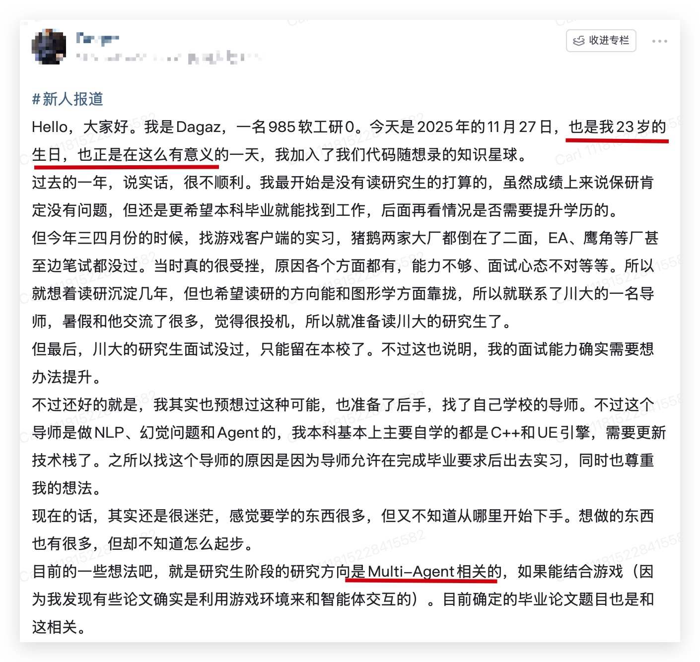
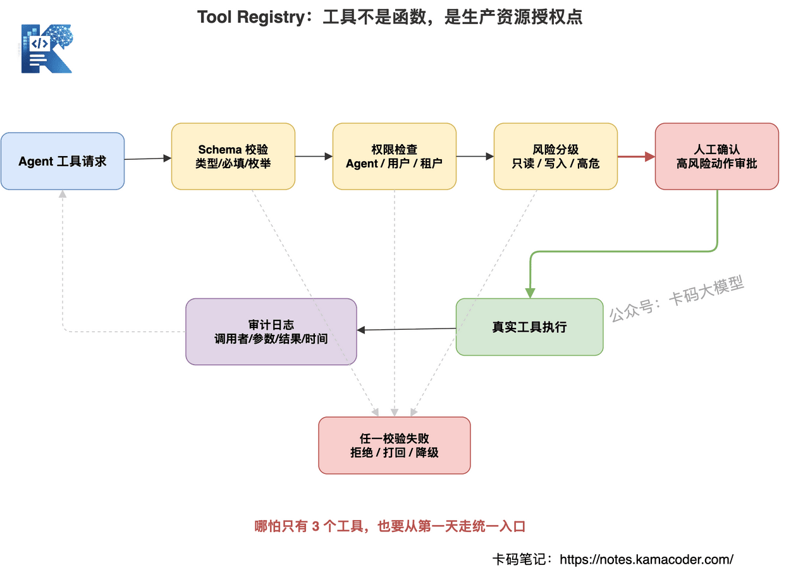
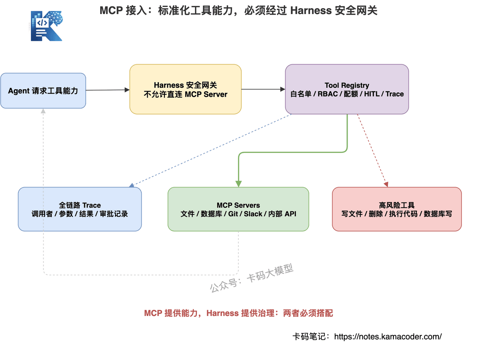

# 未来的竞争，不是"谁的 Agent 更多"，而是"谁的 Harness 更稳"

> 来源: https://notes.kamacoder.com/interview/llm/multi_agent_harness_interview.html

# `# 未来的竞争，不是"谁的 Agent 更多"，而是"谁的 Harness 更稳" 

现在业内都开始在聊 Multi-Agent。 

知识星球  (opens new window)里有一位录友，研究生方向就是 Multi-Agent，这个方向还是不错的，有很大的应用前景。 


 

什么是Multi-Agent，也就是大家听说的，负责 开发代码的Agent，负责写需求的Agent，负责产品的Agent，负责测试的Agent。 

这些 Agent 都云端一起做一个项目，一个Agent team不眠不休的干活，顶过去一个大团队的工作量。 

过去一年，几乎每个做大模型应用的团队，都试过 AI Agent。 

一个输入框，一个大模型，几个工具，一段 System Prompt，再配一个漂亮前端。 

演示会上看起来很猛。 

老板觉得：这不就是数字员工吗？ 

业务觉得：终于能自动干活了。 

研发也觉得：Planner、Worker、Reviewer 一拆，事情稳了。 

这个故事，看起来太诱人了，但如果大家没有深入了解，就不知道这里有多少坑。 

我最近和身边很多 做muti-agent的同学交流，结合自己的经验，给大家分享一下，为什么理想很丰满，现实很骨感。 

但你的multi agent 真正进生产，问题马上来了。 

为什么 Agent 会反复调用同一个工具？ 

为什么一个简单任务能烧掉几十万 Token？ 

为什么某个子 Agent 失败后，整条链路都挂了？ 

为什么最终结果看起来对，但中间过程完全说不清？ 

为什么接入一个新工具，要改十几处胶水代码？ 

为什么业务问一句"这个结论怎么来的"，系统就只能沉默？ 

这就是 Demo 和生产之间的鸿沟。 

很多人以为，跨过这条鸿沟靠的是更强的模型，或者更精妙的 Prompt。 

不够。 

真正决定 Multi-Agent 系统能不能落地的，是背后的运行时底座： 

**Multi-Agent Harness。** 

也就是 

**Agent 负责局部智能，Harness 负责全局控制。** 

现在很多大厂招人，越来越倾向于招聘 能够驾驭多个agent一起工作的开发人员。 

大家可以想，驾驭多个agent有啥难的。 

这篇文章，我们就用面试视角，把这个问题讲透，**本篇难度较高，适合社招有Agent相关工作经验的录友学习**，刚接触Agent的在校学生可以做一个粗略了解。 

## `# 目录 
  - 先说结论：生产级 Multi-Agent 拼的不是 Agent 数量   - Harness 到底是什么   - 面试官真正想考什么   - 第一层：架构编排，Agent 出主意，Harness 拿决定   - 第二层：工具治理，Tool Registry 是安全边界   - 第三层：状态与记忆，记住该记的，忘掉该忘的   - 第四层：评估体系，不要只看答案，要看轨迹   - 第五层：成本控制，Token Budget 是生命线   - 第六层：MCP 接入，标准化不等于裸奔   - 第七层：可观测性和落地路线   - 面试怎么答 

## `# 一、先说结论：生产级 Multi-Agent 拼的不是 Agent 数量 

先把结论放前面： 

**未来的竞争，不是谁的 Agent 更多，而是谁的 Harness 更稳。** 

Multi-Agent Demo 很容易做。 

你可以很快拆出一堆角色： 
  - Planner Agent 负责拆任务   - Researcher Agent 负责查资料   - Coder Agent 负责写代码   - Reviewer Agent 负责审查   - Writer Agent 负责总结 

听起来很专业。 

但生产环境不是角色扮演。 

生产环境真正关心的是： 
  - 任务有没有生命周期？   - 失败后谁决定重试还是终止？   - 工具调用有没有权限和审计？   - 记忆会不会污染上下文？   - Token 会不会无限烧？   - 轨迹能不能复盘？   - 高风险动作有没有审批？   - 接入 MCP 工具后会不会裸奔？ 

这些问题，靠"多加几个 Agent"解决不了。 

甚至 Agent 越多，问题越复杂。 

因为多个 Agent 会带来更多中间状态、更多工具调用、更多上下文复制、更多失败路径和更多不可观测行为。 

所以面试里，如果你只说： 

"我用了 Planner、Executor、Reviewer 多 Agent 协作。" 

这个回答还不够。 

更高级的回答是： 

**我怎么用 Harness 管住这些 Agent，让它们可控、可评估、可追踪、可降级。** 


 

## `# 二、Harness 到底是什么 

先解释概念。 

Harness 这个词，直译有"挽具、束具、约束装置"的意思。 

放在 Agent 系统里，可以理解为： 

**Harness 是把模型、Agent、工具、状态、记忆、评估、预算、安全统一收束起来的运行时框架。** 

它不是一个单纯的 Prompt。 

Prompt 解决的是：怎么让模型理解任务。 

Harness 解决的是：怎么让模型可靠地完成任务。 

它也不只是 Orchestrator。 

Orchestrator 主要解决执行顺序。 

Harness 还要解决： 
  - 资源分配   - 状态管理   - 工具治理   - 成本预算   - 安全边界   - 轨迹记录   - 评估回归   - 失败兜底 

它也不等于某个 Agent Framework。 

LangGraph、AutoGen、CrewAI 这些可以是搭建 Harness 的积木。 

但 Harness 是把这些积木拼成生产系统的工程方案。 

可以用一个类比理解： 

Prompt 是台词。 

Agent 是演员。 

Tool 是道具。 

Model 是大脑。 

**Harness 是导演、调度台、安全规章、监控系统和预算中心。** 

没有 Harness，Agent 再多也只是即兴表演。 

有了 Harness，Agent 才可能稳定地做生产任务。 


 

## `# 三、面试官真正想考什么 

面试官问 Multi-Agent，不一定是想听你背框架 API。 

他真正想看的是你有没有生产级系统思维。 

比如他问： 

"你们 Multi-Agent 是怎么协作的？" 

很多录友会答： 

"我们有一个 Planner 负责拆解任务，然后交给多个 Worker，最后由 Reviewer 汇总。" 

这个答案没错。 

但还停留在 Demo 层。 

面试官会继续追问： 
  - Planner 生成的计划谁来审查？   - Worker 失败后谁决定重试？   - 一个 Agent 能不能调用所有工具？   - 工具参数错了怎么拦？   - Agent 调用次数有没有上限？   - 中间轨迹怎么评估？   - Token 超预算怎么办？   - 用户问"为什么这么回答"，你能不能还原过程？ 

这些问题都指向同一个核心： 

**Multi-Agent 系统里，决策权到底在 Agent 手里，还是在 Harness 手里。** 

生产级原则只有一句： 

**Agent 负责局部智能，Harness 负责全局控制。** 

如果你把调度、权限、预算、重试、终止都交给模型自己决定。 

那系统就很容易变成： 
  - Agent 想继续就继续   - Agent 想调什么工具就调什么工具   - Agent 想重试几次就重试几次   - Agent 想怎么解释就怎么解释 

这不是智能。 

这是失控。 

## `# 四、第一层：架构编排，Agent 出主意，Harness 拿决定 

Multi-Agent 最常见的失败模式，不是 Agent 不够聪明。 

而是决策权交错了人。 

很多系统会让 Planner Agent 自己决定： 
  - 调哪个 Agent   - 要不要继续   - 要不要重试   - 什么时候结束   - 是否跳过某个步骤 

短期看很灵活。 

长期看很危险。 

因为大模型不是可靠调度器。 

它没有天然的成本意识、并发意识、权限意识、全局一致性意识。 

真正生产级的做法是： 

**Planner 可以提出计划，但 Orchestrator 必须裁决计划。** 

具体来说，Harness 至少要掌握五类决策权。 

### `# 1. 任务生命周期 

每个任务都要有明确状态。 

比如： 

```
created → planned → running → reviewing → completed
                         ↓
                      failed / cancelled / timeout

```

 

不能只是一个模糊的"Agent 还在跑"。 

有状态机，才能做超时、重试、回滚、审计。 

### `# 2. 执行计划裁决 

计划可以来自静态 DAG，也可以来自 Planner Agent。 

但计划生成后，必须由 Orchestrator 接管。 

每一步能不能跑、能不能并行、是否越权、是否超预算，都要由 Harness 判断。 

这里有一个细节： 

**Planner 应该输出声明式计划，而不是命令式调用。** 

声明式计划长这样： 

```
{
  "step": 1,
  "intent": "research",
  "agent": "researcher",
  "input": "检索相关资料"
}

```

 

命令式调用长这样： 

```
await researcher.run("检索相关资料")

```

 

区别很大。 

声明式计划给 Harness 留了介入空间。 

Harness 可以重排、并行、拒绝、降级、加审批。 

命令式调用等于把方向盘交给 Agent。 

**别让 Agent 开车，让 Agent 当导航。** 

### `# 3. Agent 路由 

不是每个 Agent 都能处理每个任务。 

Researcher 不该写数据库。 

Coder 不该处理财务审批。 

Reviewer 不该直接执行删除操作。 

路由要结合： 
  - 任务类型   - Agent 能力   - 工具权限   - 历史质量评分   - 当前成本预算 

这不是 Prompt 能稳定解决的。 

这是 Harness 的调度逻辑。 

### `# 4. 失败处理 

某个 Agent 失败后怎么办？ 

是重试、降级、跳过、转人工，还是终止？ 

这不能让出错 Agent 自己说了算。 

失败处理必须由 Harness 统一管理。 

比如： 
  - 参数错误：打回重填   - 工具超时：换备用工具   - 预算不足：降级模型   - 高风险动作失败：终止并记录审计   - 多次失败：转人工 

### `# 5. 硬终止条件 

Agent 最怕没有边界。 

生产系统必须有硬闸： 
  - `max_steps`   - `max_tokens`   - `max_duration`   - `max_tool_calls`   - `max_retries` 

这些条件不能写在 Prompt 里当建议。 

必须是代码层面的强制约束。 


 

## `# 五、第二层：工具治理，Tool Registry 是安全边界 

Agent 的能力，绝大部分来自工具。 

没有工具，Agent 只是会聊天。 

有了工具，Agent 才能查数据库、读文件、跑代码、调接口、生成工单。 

但工具越强，风险越大。 

一个能读文件的 Agent，可能读到不该读的。 

一个能写数据库的 Agent，可能误删生产数据。 

一个能跑代码的 Agent，可能直接造成事故。 

一个能调外网的 Agent，可能把敏感信息发出去。 

所以生产级 Harness 里，工具不能是普通函数。 

**工具是生产资源的授权点。** 

所有工具调用都应该经过 Tool Registry。 

一个合格的 Tool Registry，至少要登记这些信息： 
  - 工具名称   - 工具描述   - 输入 JSON Schema   - 允许调用的 Agent 列表   - 超时和速率限制   - 风险等级   - 是否需要人工确认   - 输出结构   - 审计日志策略 

这背后的思维转变很关键： 

**给 Agent 一个工具，不是给它一个函数，而是给它一把权限钥匙。** 

这把钥匙能开哪些门、谁能用、什么时候用、留不留痕，必须从第一天就设计。 

很多团队会说： 

"MVP 阶段先不上 Tool Registry 行不行？" 

我不建议。 

因为工具治理不是装饰层。 

它是结构层。 

如果一开始每个 Agent 都各自直接调工具，后面系统会迅速变成一堆散落的特权代码。 

等你想统一收回来，代价很高。 

正确做法是： 

**哪怕只有 3 个工具，也从第一天开始强制走 Tool Registry。** 

先有规矩，再扩规模。 


 

## `# 六、第三层：状态与记忆，记住该记的，忘掉该忘的 

Multi-Agent 系统里，"记忆"这个词经常被浪漫化。 

很多文章会说： 

"Agent 要像人一样积累经验。" 

但生产环境里，记忆首先不是浪漫问题。 

而是工程问题。 

记忆系统最常见的坑有四个： 
  - 记得太少：每次都像第一次   - 记得太多：上下文膨胀，成本爆炸   - 不分层：临时状态和长期知识混在一起   - 不遗忘：过期信息长期污染决策 

正确做法是先分清： 

**State 是当前任务运行所需的数据。Memory 是跨任务复用的经验和知识。** 

### `# 1. State：当前任务的运行状态 

State 生命周期短，关心一致性。 

可以分三层： 

**Working State**：当前步骤的临时上下文，任务结束就丢。 

**Session State**：一次会话里多个 Agent 共享的信息，可以放 Redis，设置 TTL。 

**Execution Log**：不可变执行日志，不一定参与推理，但必须用于审计、回放、评估。 

### `# 2. Memory：跨任务复用的经验 

Memory 生命周期长，关心相关性。 

常见分两类： 

**Episodic Memory**：事件记忆，比如踩过的坑、用户偏好、某类问题处理经验。 

**Semantic Memory**：语义记忆，比如领域概念、业务规则、工具约束。 

### `# 3. 注入时机：不要把所有记忆都塞进上下文 

记忆不是越多越好。 

任务前自动注入，简单稳定，但费 Token。 

按需检索，省钱，但 Agent 可能忘记调用。 

生产上更推荐混合模式： 

**前置注入少量高置信记忆，再提供 `memory_search` 工具让 Agent 按需查。** 

### `# 4. 遗忘机制：记忆需要修剪 

一个只增不删的记忆系统，迟早会退化。 

检索越来越慢。 

相关性越来越差。 

过期信息还会污染新决策。 

所以记忆要有保留分数。 

可以综合： 
  - 访问频次   - 创建时间   - 重要性   - 最近使用   - 是否仍被验证有效 

低分记忆删除。 

中分记忆压缩摘要。 

高分记忆保留原文。 

**记忆不是仓库，是花园。需要定期修剪。** 


 

## `# 七、第四层：评估体系，不要只看答案，要看轨迹 

Multi-Agent 系统的评估，是最容易被低估的环节。 

单 Agent 评估相对简单： 

输入一个问题，看最终答案对不对。 

Multi-Agent 不一样。 

它有计划、有中间步骤、有工具调用、有 Agent 协作、有重试、有审查、有最终合成。 

如果只看最终答案，会漏掉很多危险信号。 

比如： 
  - 最终报告对了，但中间用了未授权数据源   - 最终代码能跑，但 Agent 调了十几次无意义工具   - 最终回答完整，但关键事实来自错误检索   - 某次任务成功，只是因为重试碰巧撞上了正确答案 

所以 Multi-Agent Eval 不能只看 final answer。 

**要看轨迹。** 

生产级 Eval 至少四层。 

### `# 1. Component Eval 

评估单个 Agent 或工具调用。 

比如： 
  - Agent 是否选对工具   - 参数是否合规   - 输出是否符合角色职责   - 是否调用了禁止工具 

### `# 2. Trajectory Eval 

评估中间执行轨迹。 

这是 Multi-Agent 最大的重点。 

要看： 
  - 步骤是否必要   - 顺序是否合理   - 是否重复调用   - 是否陷入循环   - 是否过早下结论 

### `# 3. Task Completion Eval 

评估任务完成度。 

比如： 
  - 是否满足用户目标   - 是否覆盖必要信息   - 是否存在事实错误   - 是否需要人工补救 

### `# 4. End-to-End Eval 

评估端到端业务效果。 

比如： 
  - 用户是否采纳   - 人工返工率   - 处理时长   - 单位任务成本   - 投诉率 

这里要特别说一句： 

**LLM-as-Judge 不是万能药。** 

它适合评估表达完整性、总结质量、推理连贯性。 

但事实正确性、代码可运行性、SQL 结果、权限合规，应该优先用确定性检查。 

成熟 Eval 一定是混合的： 
  - 单元测试检查代码   - Schema 校验结构化输出   - 规则引擎检查安全约束   - 检索对齐校验证据来源   - LLM-as-Judge 评开放式表达   - 人工抽检校准 Judge 偏差 

更重要的是： 

**Eval 必须进入 CI。** 

每次改 Prompt、换模型、加工具、调参数，都要跑回归。 

对 Agent 系统来说，Prompt 就是代码，工具 Schema 就是接口，执行轨迹就是日志，Eval 就是测试体系。 

没有 Eval，每次优化都是凭感觉调参。 


 

## `# 八、第五层：成本控制，Token Budget 是生命线 

很多团队第一次跑通 Agent，最震惊的不是模型能力。 

而是账单。 

Multi-Agent 为什么烧钱？ 

因为每个 Agent 都有 System Prompt。 

每个 Agent 都需要上下文。 

工具结果会被塞回模型。 

Planner 生成计划，Worker 执行步骤，Reviewer 审查输出。 

失败后还要重试。 

多轮协作让历史不断复制膨胀。 

如果没有成本控制，Agent 系统会从"智能助手"变成"预算黑洞"。 

生产级 Harness 必须有 Token Budget。 

它不是事后统计。 

而是实时调度。 

核心逻辑是： 

**根据任务复杂度分配预算，执行中实时监控，触发不同等级的降级策略。** 

### `# 1. Model Routing 

不是所有步骤都需要最强模型。 

分类、摘要、格式转换，用小模型。 

复杂推理、最终合成，用强模型。 

高风险审查，用强模型加规则校验。 

低价值重试，禁止使用高价模型。 

目标不是一味省钱。 

而是在质量和成本之间找到可控平衡。 

### `# 2. Context Compression 

很多 Token 浪费来自历史膨胀。 

有效做法是： 

保留最近几轮原文。 

更早历史压缩成结构化摘要。 

摘要里只保留关键事实、决策、未解决问题、工具结果引用。 

但不能一刀切。 

事实型任务必须保留原始引用。 

合规型任务关键证据不可压缩。 

### `# 3. Budget 分级降级 

可以把预算分成四个区间： 
  - 绿区：正常执行   - 黄区：压缩上下文   - 红区：切小模型，跳过非必要步骤   - 熔断区：强制收束，返回 partial result 或转人工 

这就是 Harness 的价值。 

它不等 Agent 自己发现没钱了。 

它在执行中实时控制。 

生产环境至少要监控： 
  - 单任务 Token 总量   - 单 Agent Token 占比   - 工具结果 Token 占比   - 重试 Token 占比   - 预算熔断次数   - 单位业务结果成本 

当你能回答"每完成一个合格任务多少钱"，Agent 系统才真正进入可运营阶段。 


 

## `# 九、第六层：MCP 接入，标准化不等于裸奔 

MCP，也就是 Model Context Protocol，是现在 Agent 工具体系里很值得关注的方向。 

它解决的是工具接入标准化问题。 

过去每接一个工具，都要为不同模型、不同框架写不同适配器。 

MCP 把这件事标准化了。 

工具一次实现，支持 MCP 的 LLM 应用都可以调用。 

你可以把它理解成： 

**MCP 之于 AI 工具，就像 USB-C 之于充电接口。** 

它对 Multi-Agent Harness 的意义很大： 
  - 快速扩展工具能力   - 复用生态里的 MCP Server   - 解耦工具和模型   - 降低工具接入成本 

但注意： 

**标准化不等于安全。** 

工具越容易接入，越需要 Harness 做安全网关。 

这里一定要说清楚： 

**MCP 提供能力，Harness 提供治理。** 

不要把 MCP Server 直接暴露给 Agent。 

必须经过 Tool Registry。 

接入 MCP 的最佳实践： 

### `# 1. MCP Server 不直连 Agent 

Agent 不能直接看到 MCP Server 暴露的所有工具。 

必须先经过 Harness 过滤。 

### `# 2. 工具白名单 

哪怕 MCP Server 暴露 50 个工具，也只开放当前业务需要的几个。 

而且要按 Agent 授权。 

### `# 3. 单独配额 

每个 MCP Server 都要有独立 timeout、rate limit、并发限制和预算。 

一个异常 MCP Server 不应该拖垮整个系统。 

### `# 4. 高风险 Human-in-the-Loop 

文件写入、删除、代码执行、数据库写、外部支付，这些都不能让 Agent 自动执行。 

必须走人工确认或审批。 

### `# 5. 全链路 Trace 

每次 MCP 调用都要记录： 
  - 调用者是谁   - 调用了哪个工具   - 参数是什么   - 返回是什么   - 是否被审批   - 是否触发降级 

没有 Trace，就没有生产级 Agent。 


 

## `# 十、第七层：可观测性和落地路线 

传统后端出问题，我们看日志、指标、链路追踪。 

Agent 系统更需要这些。 

因为 Agent 的错误很多时候不是异常。 

而是过程偏移。 

它可能调用了错误工具。 

可能读取了错误记忆。 

可能误解了用户目标。 

可能因为压缩丢了关键约束。 

可能因为预算不足提前收束。 

可能因为路由用了能力不够的小模型。 

这些如果没有 Trace，你根本不知道问题在哪。 

一个可观测的 Harness，至少要记录： 
  - 用户原始输入   - Planner 输出的计划   - 每一步 Agent 输入输出   - 工具调用参数和结果   - 检索到的记忆和文档   - 模型路由选择   - Token 消耗   - 失败和重试原因   - 降级和熔断记录   - 最终输出和评估结果 

这样出了问题，才能复盘。 

不然你只能听模型解释。 

那不叫可观测。 

**那叫祈祷。** 

### `# 落地路线：不要一步到位 

Multi-Agent Harness 不是一天建成的。 

我建议分三阶段。 

### `# Phase 1：MVP 

目标是跑通一条端到端业务闭环。 

最小配置： 
  - 简单 Orchestrator   - Tool Registry   - 基础状态管理   - 基础 Trace   - 小规模评估集 

不要一开始就上十个 Agent、动态 Planner、复杂长期记忆。 

先把一条链路跑稳。 

### `# Phase 2：Hardening 

目标是把 Demo 变成可控系统。 

这一阶段补： 
  - 权限控制   - Token Budget   - 重试和降级   - 上下文压缩   - 轨迹评估   - 审计日志   - 回归测试 

重点解决： 

为什么错？ 

哪里贵？ 

哪里慢？ 

哪里不安全？ 

### `# Phase 3：Scale 

目标是支撑更多场景和并发。 

这一阶段再做： 
  - 分布式队列   - 多租户隔离   - 动态模型路由   - Agent 质量排行榜   - A/B 测试   - 长期记忆治理   - 统一 MCP 接入平台   - 成本看板 

很多团队的问题，是一开始就想进 Phase 3。 

结果基础 Harness 没搭好，系统直接变成一团复杂胶水。 

**先稳定，再扩规模。** 

## `# 十一、面试怎么答 

如果面试官问： 

"你怎么看 Multi-Agent 的未来？是不是 Agent 越多越强？" 

你可以这样答： 

"我不认为未来竞争是看谁堆了更多 Agent。Multi-Agent Demo 阶段，确实可以靠 Planner、Worker、Reviewer 这些角色快速做出效果，但生产环境真正难的是稳定性、成本、权限、评估和可观测性。 

我的理解是，Agent 负责局部智能，Harness 负责全局控制。Agent 可以提出计划、执行局部任务、调用工具，但任务生命周期、执行计划裁决、Agent 路由、失败重试、预算控制和硬终止条件，必须由 Harness 掌握。 

生产级 Multi-Agent Harness 至少要有几层能力。第一是编排调度，Planner 输出声明式计划，Orchestrator 统一裁决。 

第二是工具治理，所有工具必须经过 Tool Registry，做 schema 校验、权限控制、风险分级、人工确认和审计。 

第三是状态和记忆，要区分短期 State 和长期 Memory，并且有检索时机和遗忘机制。 

第四是 Eval，不只看最终答案，还要评估中间轨迹、工具调用、任务完成度和端到端业务指标。 

第五是 Token Budget，通过模型路由、上下文压缩和预算熔断控制成本。第六是 MCP 接入，MCP 提供工具标准化能力，但不能直连 Agent，必须经过 Harness 安全网关。 

所以我会把 Multi-Agent 落地理解成一个系统工程，而不是多 Prompt 拼盘。 

未来真正有壁垒的不是 Agent 数量，而是 Harness 能不能让这些 Agent 在边界内稳定行动，并且做到可追踪、可评估、可降级、可审计。" 

这个回答的重点，不是说你知道多少框架。 

而是让面试官听出来： 

**你知道 Agent 为什么在 Demo 里很热闹，也知道它为什么在生产里容易翻车。** 

更重要的是，你知道怎么把它管住。 

这就是 Harness 的价值。 

这篇讲的是多 Agent 的全局治理，几个相关方向可以连着看：Harness 的来龙去脉和六层组件看 Harness Engineering 大厂面试题汇总；多个 Agent 之间到底怎么通信和编排看 多 Agent 通信与编排面试详解；轨迹评估和可观测怎么落地看 Agent Harness 可观测性面试详解；成本控制里的模型路由怎么设计看 Agent 混合路由优化详解。
