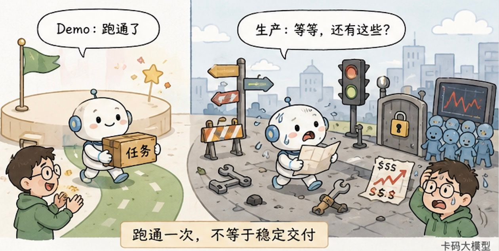
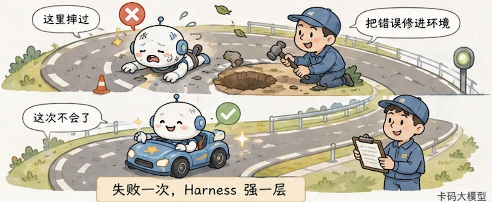
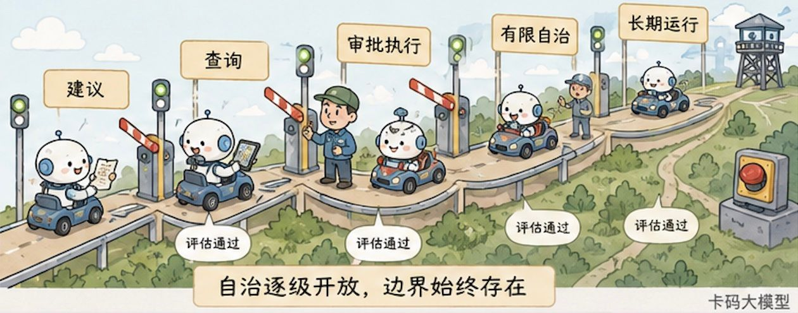

# 生产级Agent全景面试详解：系统架构、Harness工程、组织协作与人才能力

> 来源: https://notes.kamacoder.com/interview/llm/production_agent_architecture_harness_org_talent.html

# `# 生产级Agent全景面试详解：系统架构、Harness工程、组织协作与人才能力 

最近越来越多录友发现，Agent 面试已经不满足于问 ReAct、Function Calling 和 MCP 了。 

面试官开始换一种问法： 

**“如果让你负责一个生产级 Agent 系统，你会怎么设计？”** 

这个问题一出来，只会背 Agent Loop 的人马上就卡住了。 

因为 Demo 里的 Agent 很简单：接一个模型，挂几个工具，模型决定下一步，跑通一次，看起来就挺智能。 

生产环境完全不是这么回事。 

工具会超时，数据会冲突，用户会说一半藏一半，模型会选错路径，长任务会中断，高风险操作会越权，版本升级还可能把原来能跑的任务搞坏。 

更麻烦的是，Agent 不是只回答一句话。它会连续行动。前面一步错了，后面十步可能全错。 

我们前面已经分别讲过 Agent 的基础原理、Agent Loop 怎么治理、Harness Engineering 到底是什么、Multi-Agent Harness 怎么搭 和 Agent 可观测性。 

那些文章讲的是零件。 

这一篇把零件装起来，回答一个更大的问题： 

**一个 Agent 从“能演示”走到“敢交给真实用户”，技术架构、Harness、组织和人到底要一起发生什么变化？** 

先说结论： 

**生产级 Agent = 模型能力 × 系统架构 × Harness 工程 × 组织运行机制。** 

不是加法，是乘法。任何一项接近零，最后的落地效果都会接近零。 

 

## `# 一、生产级的标准，不是“它成功过一次” 

传统软件也会出错，但传统软件的执行路径基本是人提前写好的。 

同样的输入、同样的状态，通常会走同样的分支。 

Agent 不一样。 

它会根据上下文动态判断下一步，会选择不同工具，会生成不同参数，还会根据中间结果临时修改计划。 

这给了 Agent 灵活性，也让生产问题从“某个接口有没有 Bug”，升级成了“整条行动轨迹是否可信”。 

比如一个退款 Agent 最后回答： 

“退款已经为你处理完成。” 

这句话不代表任务真的成功。 

你还要去支付系统看退款单是否存在，金额是否正确，订单状态是否同步，是否重复执行，审计记录是否完整。 

**Agent 的结果不能由 Agent 自己宣布，必须由外部环境验证。** 

所以生产级至少要过五道门槛。 

| 门槛  真正要回答的问题 
| 任务效果  它是否真的完成了业务目标，而不只是生成了一段像成功的回答？ 
| 稳定性  面对模糊输入、工具失败和长链路任务，结果是否仍然可接受？ 
| 安全性  它能看到什么数据，能调用什么工具，哪些动作必须由人批准？ 
| 可运营性  延迟、Token、成本、并发和人工接管比例能否长期承受？ 
| 可改进性  失败能否定位、复现，并进入下一轮评估和工程修复？ 

这五道门槛里，模型只直接决定一部分。 

剩下的大部分工作，都发生在模型外面。 

这也是为什么很多团队换了更强的模型，Demo 分数涨了，线上问题却没有消失。 

**模型能力决定天花板，系统工程决定你能不能稳定摸到这个天花板。** 

## `# 二、先看全景：生产级 Agent 不是一个模型服务 

如果面试官让你画生产级 Agent 架构，最差的答法是画一个大模型，左边接用户，右边接工具。 

那只是最小 Agent Loop，不是生产架构。 

真实的一次请求，至少要经过下面几层。 

### `# 第一层：业务入口与风险分级 

用户从网页、App、客服系统或者内部工单发起任务。 

系统先做身份校验、租户隔离、输入安全检查和风险分级。 

“帮我查一下订单”与“帮我退掉订单”不能走同一套权限。 

查询是只读操作，退款会改变真实业务状态。金额再大一点，还可能必须人工审批。 

**生产系统不是先让模型自由发挥，再看结果危不危险。风险边界必须在执行前就存在。** 

### `# 第二层：Agent Harness 

Harness 接住用户目标，组织这一轮 Agent 怎么运行。 

它负责装配上下文、选择模型、暴露工具、维护状态、处理重试、控制预算、设置停止条件，并在关键节点请求人工确认。 

模型可以提出计划，但计划能不能执行，要由 Harness 裁决。 

模型可以申请调用工具，但它不能绕过权限系统直接碰生产数据库。 

模型可以说任务完成，但 Harness 还要调用验证器检查真实结果。 

### `# 第三层：模型、上下文、状态和记忆 

模型负责理解、推理和决策。 

上下文负责告诉模型当前目标、已有证据、可用工具和行为约束。 

状态记录当前任务已经执行到哪一步。 

记忆保存跨任务真正值得复用的信息。 

这四个东西不能混在一起。 

聊天历史不是任务状态，RAG 文档不是长期记忆，模型上下文窗口更不是可靠数据库。 

长任务如果只靠越来越长的对话历史维持，一旦上下文压缩、进程重启或者模型切换，任务就可能失忆。 

### `# 第四层：工具、业务系统与执行环境 

Agent 真正产生业务价值，靠的是行动。 

行动可能发生在订单系统、数据库、浏览器、代码仓库、云平台，也可能发生在隔离沙箱里。 

工具层要处理的不只是 Function Calling 格式，还包括： 
  - 工具发现与版本管理；   - 参数校验和返回值结构；   - 身份传递与最小权限；   - 超时、重试、幂等和补偿；   - 敏感数据脱敏；   - 高风险动作审批；   - 调用日志和审计证据。 

工具不是给模型的一组 API 说明书。 

**工具是 Agent 能力边界，也是事故爆炸半径的边界。** 

### `# 第五层：验证、观测与人工接管 

执行完成后，要有独立验证器检查结果。 

运行过程中，要记录完整 Trace：模型版本、提示词版本、上下文来源、工具参数、工具返回、状态变化、Token、延迟、重试和最终结果。 

当 Agent 连续失败、预算超限、置信不足或者触发高风险动作时，系统要能暂停并交给人。 

Human in the Loop 不是在页面上摆一个“找人工”按钮。 

它至少要明确三件事： 
  - 什么情况必须找人；   - 人接手时能看到哪些证据；   - 人处理完以后，Agent 从哪里继续。 

 

## `# 三、Harness 工程：把“希望模型做到”变成“系统保证做到” 

Harness 这个词容易被讲虚。 

有人把系统提示词叫 Harness，有人把 LangChain、Agents SDK 叫 Harness，也有人把整个 Agent 平台都叫 Harness。 

为了面试时不说乱，可以这样划边界： 

**Agent Harness 是包围模型、驱动 Agent Loop、连接状态和工具、约束执行并收集结果的运行支架。** 

框架是你开发 Harness 时可能使用的代码库。 

平台是让多个 Harness 能够统一部署、治理和运营的基础设施。 

三者有关联，但不是一回事。 

Anthropic 在 Agent 评估文章里强调，真正被评估的“Agent”其实是模型和 Harness 的组合。OpenAI 在 Codex 实践里也发现，Agent 做不好时，问题往往不是模型不会，而是环境对 Agent 不可见、约束不可执行、结果不可验证。 

所以 Harness Engineering 的核心不是“再写一层胶水代码”，而是完成六个转换。 

### `# 1. 把模糊目标变成可验收任务 

“帮我把客服体验优化一下”不是任务。 

Agent 不知道改什么，也不知道什么时候算完成。 

你要把目标变成明确输入、范围、约束、产物和验收条件。 

例如：分析过去七天的一星工单，归纳前三类问题，每类至少引用五条真实工单作为证据，输出改进建议，但不允许直接修改线上客服话术。 

Agent 越自主，任务规格越不能模糊。 

### `# 2. 把隐性知识变成可发现上下文 

业务规则藏在员工脑子里，架构决策藏在群聊里，历史事故藏在某份没人知道的文档里。 

对 Agent 来说，这些知识等于不存在。 

生产团队要把稳定规则放进版本化文档、Schema、知识库和工具描述中，并按任务动态加载。 

不是把所有资料一次性塞进上下文。 

**上下文工程的目标不是给得多，而是在正确时机给正确证据。** 

### `# 3. 把口头提醒变成可执行约束 

“不要越权”“记得跑测试”“不要重复退款”都不能只写在 Prompt 里祈祷模型遵守。 

能硬编码的约束就硬编码： 
  - 权限交给 IAM；   - 参数范围交给 Schema；   - 重复执行交给幂等键；   - 架构边界交给 Lint；   - 发布门槛交给 CI；   - 高风险动作交给审批流；   - 预算上限交给 Harness。 

提示词负责告诉模型应该怎么做，系统负责保证它不能胡做。 

### `# 4. 把最终回答变成可验证结果 

验证不能只让原 Agent 自己反思一句“我做对了吗”。 

能用确定性程序验证的，优先用程序。 

代码任务跑测试，数据任务查数据库，文件任务比对产物，流程任务检查状态机，内容任务再引入规则、模型评审和人工抽检。 

越靠近真实业务状态，越不能只看自然语言答案。 

### `# 5. 把偶发失败变成可复现样本 

没有 Trace，线上失败只能靠猜。 

你必须知道当时用了哪个模型、拼了哪些上下文、调用了哪个工具、参数是什么、工具返回什么、失败前状态在哪。 

然后在隔离环境中重放这条轨迹。 

如果不能复现，就无法判断修复是否有效，更无法防止回归。 

### `# 6. 把一次修复变成长期能力 

修完一个线上问题，不是手动改掉结果就结束。 

要继续追问： 
  - 是不是缺了一条工具参数校验？   - 是不是上下文里用了过期知识？   - 是不是应该新增审批节点？   - 是不是停止条件太宽松？   - 是不是评估集缺少这一类边界样本？ 

修复最终要进入规则、工具、测试、评估集或者运行策略。 

**每次失败都让 Harness 变强一点，这才叫工程复利。** 

卡通插画提示词 3：Harness 把失败变成护栏 

## `# 四、生产架构里，确定性和自治必须同时存在 

很多人一说 Agent，就追求“全自动”。 

这是生产落地最危险的误区之一。 

Agent 的价值来自动态决策，但生产系统不能把所有事情都交给动态决策。 

最稳的结构通常是： 

**外层确定性 Workflow + 内层有限自治 Agent。** 

Workflow 管生命周期、权限、预算、审批、回滚和最终交付。 

Agent 只在确实需要判断的局部空间里选择路径。 

比如理赔 Agent 可以阅读非结构化材料、判断缺什么证据、决定下一步查询什么系统。 

但它不能自己修改赔付上限，不能绕过审批，也不能在证据不足时偷偷把任务标记为成功。 

### `# 单 Agent 优先，多 Agent 后置 

生产架构的另一个常见误区，是一上来就画十几个 Agent。 

规划 Agent、搜索 Agent、写作 Agent、审核 Agent、记忆 Agent，再来一个总控 Agent。 

看起来很高级，实际上每拆一个 Agent，就会多一份上下文初始化、多一次网络调用、多一个状态同步点和多一种失败方式。 

只有遇到下面几种情况，拆多 Agent 才更有价值： 
  - 子任务需要明显不同的工具和权限；   - 子任务可以真正并行，能够抵消额外开销；   - 需要隔离上下文，避免不同任务互相污染；   - 需要独立视角做对抗式评审；   - 单 Agent 的上下文和职责已经无法维护。 

否则，先用一个 Agent 加清晰工具，再用 Workflow 固定关键路径。 

### `# 状态必须外化，任务才能恢复 

长任务不能把生命全押在一个上下文窗口里。 

生产系统至少要区分： 
  - Session：这次会话发生过什么；   - Task State：任务现在执行到哪里；   - Memory：跨任务复用的稳定经验；   - Artifact：已经生成的计划、文件、报告和代码；   - Trace：系统实际上执行了什么。 

Anthropic 在 Managed Agents 架构中，把持久 Session、负责循环的 Harness 和执行计算的 Sandbox 分开。这个思路很重要：**模型上下文可以被压缩和替换，但任务事实必须在外部可靠保存。** 

### `# 权限要跟着动作走，不跟着 Agent 名字走 

“这是客服 Agent，所以给它客服系统权限”太粗了。 

同一个客服 Agent 既可能查询订单，也可能修改地址、退款、发优惠券。 

权限应该按工具、参数、资源范围、风险等级和当前用户身份动态判断。 

高风险操作采用短期凭证、最小权限和明确审批。 

这样即使模型被提示注入诱导，或者规划发生漂移，也不能直接越过系统边界。 

## `# 五、评估与可观测：不要只看答案，要看轨迹和结果 

普通聊天机器人可以抽样看回答好不好。 

Agent 不够。 

Agent 可能给出正确答案，却走了一条危险路径；也可能最后说失败，但其实已经产生了副作用。 

所以生产评估要分四层。 

| 评估层  关注点  示例 
| 组件评估  单个模型、工具、检索器是否工作正常  工具选择率、参数准确率、检索召回率 
| 轨迹评估  中间步骤是否合理、安全、高效  重复调用、无效步骤、越权尝试、恢复路径 
| 结果评估  外部环境中的任务是否真实完成  数据库状态、文件产物、测试结果、业务状态 
| 系统评估  整体是否值得长期运行  成功率、正确失败率、延迟、成本、人工接管率 

这里有一个特别重要的指标：**正确失败率。** 

信息不足时主动询问，权限不够时拒绝执行，工具故障时停止并转人工，都比编一个成功结果更可靠。 

生产系统不是要求 Agent 永远成功。 

而是要求它成功时真的成功，失败时失败得正确。 

线上 Trace 也不是为了做一个漂亮大屏。 

Trace 要能支持三件事： 
  - 快速判断问题发生在哪一层；   - 固定环境重放失败任务；   - 把失败样本加入回归评估。 

只有完成这三步，可观测性才真正进入 Harness 改进闭环。 

## `# 六、组织怎么变：不能成立一个 AI 团队包办所有 Agent 

技术架构讲到这里，组织问题自然就出来了。 

很多公司最初的做法是成立一个 AI 创新小组。 

业务部门把需求扔过来，AI 小组负责接模型、写 Prompt、做 Demo。 

刚开始很快，半年后一定堵。 

原因很具体： 
  - AI 小组不懂每个业务的隐性规则；   - 业务团队不懂 Agent 的失败方式；   - 平台、安全和运维介入太晚；   - 出现事故以后，不知道谁对动作负责；   - 每个项目重复搭工具、权限、评估和日志。 

生产级 Agent 更适合“三层协作”。 

### `# 场景团队：对业务结果负责 

场景团队由产品、领域专家和应用工程师组成。 

他们负责定义任务范围、业务规则、工具语义、验收标准和人工接管流程。 

Agent 最后有没有创造价值，场景团队最清楚。 

### `# Agent 平台团队：对通用能力负责 

平台团队提供模型网关、Harness Runtime、Session、Sandbox、Tool Registry、身份权限、Trace、评估框架和发布能力。 

他们不替业务决定“退款是否合理”，但要保证退款工具有权限控制、幂等机制和审计记录。 

### `# 安全、合规与运营：对边界和持续运行负责 

安全团队定义数据边界、身份策略和高风险动作规则。 

合规团队确认哪些决策必须由人承担。 

运营和评估团队维护失败分类、线上指标和回归样本。 

三层之间交接的不能只是会议结论，而应该是版本化资产：任务规格、工具 Schema、权限策略、评估集、Trace 和事故记录。 

**平台统一能力，场景承担结果，安全守住底线。** 

这比“所有 Agent 都归 AI 团队”靠谱得多。 

 

## `# 七、人才怎么变：稀缺的不是“最会写 Prompt 的人” 

很多录友看到 Agent 变强，就担心开发岗位是不是没了。 

岗位不会凭空消失，但工作重心确实在移动。 

过去工程师主要把业务逻辑翻译成代码。 

Agent 时代，越来越多代码可以由模型生成。人的价值会更多集中在四件事上： 
  - 把模糊目标定义清楚；   - 给 Agent 构造能干活的环境；   - 把风险变成机器不能越过的边界；   - 用证据判断它到底有没有做好。 

这不是“不需要工程师”。 

恰恰相反，它要求工程师从实现一个函数，走向设计一套生产系统。 

### `# Agent 应用工程师 

Agent 应用工程师站在业务与模型之间。 

他要懂任务拆解、Prompt、Context、RAG、工具设计、状态管理、评估和业务指标。 

面试时只说“我用 LangChain 搭了一个 Agent”远远不够。 

面试官更想听：为什么这个场景需要 Agent，哪些步骤保留确定性，工具失败怎么恢复，结果怎么验收，线上指标怎么定义。 

### `# Agent 平台工程师 

平台工程师负责模型网关、Agent Runtime、Session、Sandbox、调度、权限、可观测性和评估基础设施。 

这类岗位很像后端、基础设施、分布式系统和安全工程的交叉。 

真正难的不是调用一次模型，而是长任务如何恢复、多租户如何隔离、工具如何治理、不同模型如何路由、Trace 如何回放。 

### `# Agent 产品与领域专家 

Agent 不是技术团队自己玩出来的。 

领域专家要把“老师傅凭感觉知道”的东西，变成规则、案例、边界和验收标准。 

产品人员也不能只写一句“做一个智能助手”，而要定义自治范围、失败体验、人工接管和业务责任。 

### `# 所有人都需要的共同能力 

无论你偏应用、平台还是产品，未来都绕不开几种能力： 
  - Spec 能力：把需求写成 Agent 可以执行、系统可以验收的任务；   - Context 能力：知道什么信息该在什么时候给模型；   - Tool 能力：把业务动作封装成清晰、安全、可恢复的工具；   - Eval 能力：用样本、轨迹和业务结果判断改动是否有效；   - Systems 能力：理解状态、权限、并发、成本和故障恢复；   - Domain 能力：知道业务真正的例外、风险和价值在哪里。 

**真正稀缺的，不是能写一句神奇 Prompt 的人，而是能把组织经验变成 Agent 可读取、可执行、可验证资产的人。** 

 

## `# 八、企业从 0 到 1，应该按什么顺序落地 

如果面试官继续追问：“那你会怎么从零落地？” 

不要回答先选模型、再选框架、最后接 MCP。 

正确顺序应该从业务风险和可验证性开始。 

### `# 阶段一：先证明任务值得做 

优先选择下面这类任务： 
  - 需要处理大量非结构化信息；   - 传统规则难以覆盖大量例外；   - 结果可以被清楚验证；   - 失败成本可控；   - 有明确人工流程可以作为基线。 

如果固定规则已经能稳定解决，就不要为了追热点硬上 Agent。 

### `# 阶段二：做受控 MVP 

先用单 Agent 或 Workflow 加局部 Agent。 

工具以只读为主，写操作全部人工确认。 

建立最小 Trace，至少记录输入、模型、工具调用、结果、延迟和成本。 

同时收集一批真实任务，建立最小评估集。 

MVP 阶段的目标不是追求全自动，而是看清失败分布。 

### `# 阶段三：补齐 Harness 

把高频失败逐步工程化： 
  - 上下文不够，就改进检索与装配；   - 工具参数错，就补 Schema 和示例；   - 重复执行，就加幂等和状态机；   - 长任务中断，就做持久状态和恢复；   - 容易越权，就收紧工具权限和审批；   - 无法判断效果，就补验证器和评估集。 

这一阶段，系统的可靠性提升通常比盲目换模型更明显。 

### `# 阶段四：逐级提高自治 

自治不是开关，而是一条梯子。 

可以按风险逐级开放： 
  - 只给建议，不执行；   - 自动查询，写操作由人确认；   - 低风险写操作自动执行，高风险审批；   - 在预算、权限和任务范围内有限自治；   - 长时间运行，但保留监控、熔断和人工接管。 

每升一级，都要有评估数据证明系统扛得住，而不是因为老板说“能不能再自动一点”。 

### `# 阶段五：多个场景出现后再平台化 

当多个团队开始重复建设模型接入、Session、工具权限、Trace 和评估系统时，再抽象 Agent 平台。 

平台化的目标不是做一个万能 Agent，而是让不同场景复用同一套生产底座。 

业务差异留在场景层，通用能力沉到平台层。 

 

## `# 九、面试时怎么回答“生产级 Agent 怎么设计” 

这个问题不要一上来背组件。 

建议按“目标、架构、Harness、治理、组织”五步回答。 

可以直接这样说： 

**我理解的生产级 Agent，不是模型接几个工具，而是一套可控制、可观测、可恢复、可评估的业务系统。第一步我会判断场景是否真的需要 Agent，固定流程能解决的部分保留 Workflow，只把不确定决策交给 Agent。架构上由确定性外层管理身份、权限、状态、预算、审批和交付，Harness 负责上下文装配、模型调用、工具路由、失败恢复和停止条件，模型只在授权范围内决策。工具层采用最小权限、结构化参数、幂等和审计，高风险动作必须 Human in the Loop。评估时既看最终业务结果，也看执行轨迹、成本、延迟、错误恢复和正确失败率；线上失败通过 Trace 回放进入回归评估，并沉淀成规则、工具、测试或权限策略。组织上由场景团队对业务结果负责，平台团队提供通用 Runtime 和治理能力，安全与运营团队负责边界和持续反馈。这样才能让 Agent 从一次 Demo 变成可持续运营的生产能力。** 

如果面试官继续追问，可以往下面几个方向展开。 

### `# 追问一：模型变强以后，Harness 还重要吗？ 

更重要。 

模型变强会提高推理、规划和工具使用能力，但不会自动知道公司的权限规则、业务例外、验收标准和事故历史。 

而且模型越能行动，错误动作的影响越大，越需要身份、权限、验证和审计。 

### `# 追问二：怎么证明 Agent 已经达到生产标准？ 

不能只看离线问答准确率。 

要用真实任务评估任务完成率、正确失败率、工具调用质量、错误恢复、安全违规、成本和延迟；同时灰度上线，逐级放开权限，并持续比较线上结果和人工基线。 

### `# 追问三：为什么不直接上 Multi-Agent？ 

多 Agent 会增加通信、上下文、状态和评估成本。 

只有存在明确专业分工、上下文隔离、并行收益或者独立评审需求时才拆。单 Agent 加确定性 Workflow 能解决时，优先保持简单。 

### `# 追问四：Agent 出事故，责任算谁的？ 

不能把责任推给模型。 

场景负责人定义业务边界，平台团队保障运行机制，安全团队定义高风险策略，工具所有者保障接口与权限，发布负责人决定是否开放自治。 

每个真实动作都要有可审计的身份、策略版本和审批记录。 

## `# 写在最后 

生产级 Agent 最容易被误解成一个技术升级：换个强模型，接上 MCP，再搭个多 Agent 框架。 

真落地以后你会发现，它更像一次系统工程和组织工程的共同升级。 

模型负责想。 

Harness 负责让它在边界里做。 

平台负责让这套能力可以复用。 

组织负责定义目标、承担结果、消化失败。 

**模型决定 Agent 能不能做，Harness 决定它能不能稳定做，组织决定这套能力能不能复制。** 

## `# 参考资料 
  - OpenAI：A practical guide to building agents：https://openai.com/business/guides-and-resources/a-practical-guide-to-building-ai-agents/   - OpenAI：Harness engineering, leveraging Codex in an agent-first world：https://openai.com/index/harness-engineering/   - OpenAI：Unlocking the Codex harness：https://openai.com/index/unlocking-the-codex-harness/   - Anthropic：Building effective agents：https://www.anthropic.com/engineering/building-effective-agents   - Anthropic：Demystifying evals for AI agents：https://www.anthropic.com/engineering/demystifying-evals-for-ai-agents   - Anthropic：Scaling Managed Agents：https://www.anthropic.com/engineering/managed-agents   - Google Cloud：Agentic AI enterprise systems architecture：https://docs.cloud.google.com/architecture/agenticai-orchestrate-access-disparate-systems
