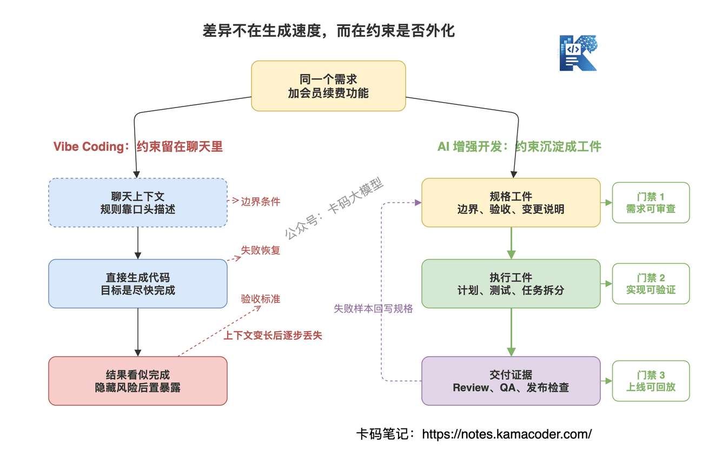
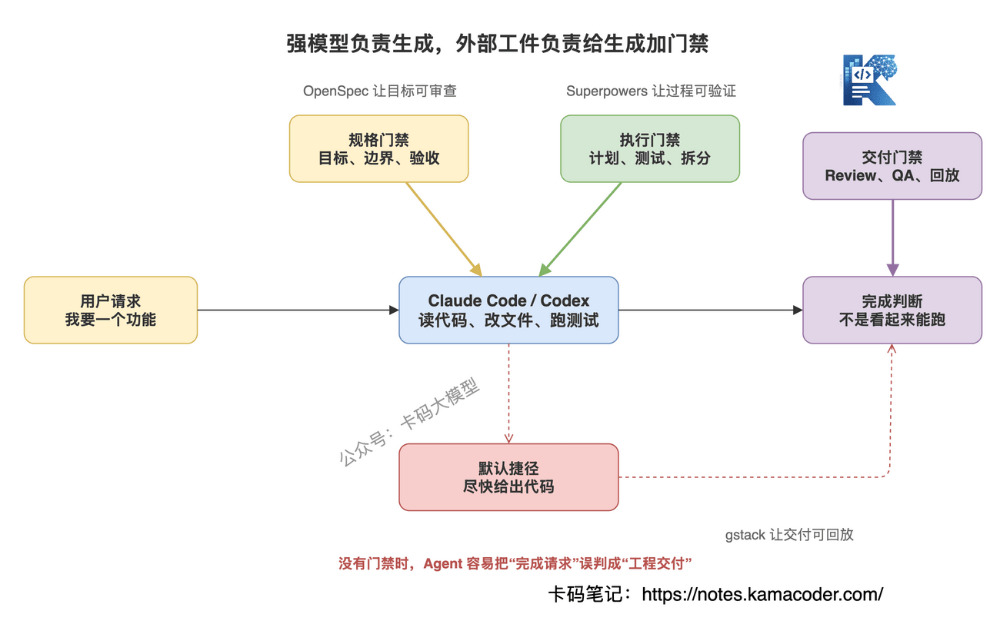
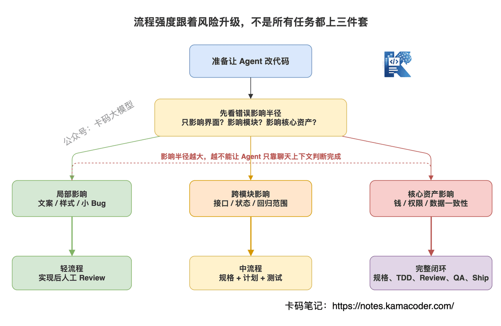

# AI增强开发三件套：OpenSpec、Superpowers、gstack怎么把 Vibe Coding 拉回工程交付

> 来源: https://notes.kamacoder.com/interview/llm/ai_enhanced_development_openspec_superpowers_gstack.html

# `# AI增强开发三件套：OpenSpec、Superpowers、gstack怎么把 Vibe Coding 拉回工程交付 

前面我们聊过 Vibe Coding，讲的是 AI 编程时代，程序员的优势不是比 AI 写得好，而是让 AI 写得更对、更稳、更可控。 

如果你更关心真实项目里最容易翻车的 Git 恢复点、数据库备份、代码和数据隔离、线上环境差异，可以先看 Vibe Coding 避坑指南。那篇讲的是底线，这篇讲的是进一步工程化。 

后面又聊过 Claude Code 深度解析，把 Agent Loop、工具调用、上下文管理、安全机制都拆了一遍。 

再往前走一步，问题就来了： 

**工具越来越强，但为什么很多人用 AI 写代码，还是越写越乱？** 

不是模型不够强。 

而是你把 AI 当成了一个“更快的打字员”，没有给它工程约束。 

产品说：“加一个会员续费功能。” 

很多录友直接丢给 Claude Code 或 Codex：“帮我实现会员续费。” 

AI 很快就开始写代码。 

接口有了，页面有了，数据库字段也有了。 

但你回头一看： 
  - 续费失败怎么处理，没想清楚   - 优惠券和续费能不能叠加，没写   - 幂等性没保证   - 回调失败没有补偿   - 测试只覆盖了成功路径   - 最后上线前也没人认真 Review 

这不是 AI 的问题。 

这是你把一个模糊需求，直接丢进了一个能写代码的 Agent。 

**AI 增强开发的核心，不是让 AI 更快开写，而是让 AI 在正确的规格、正确的流程、正确的交付闭环里写。** 

今天这篇文章，我们讲 AI 增强开发的三件套： 
  - OpenSpec：把模糊需求变成可审查规格   - Superpowers：让 Agent 按工程纪律开发   - gstack：把 Review、QA、Ship、Retro 补成交付闭环 

这三件套不是让你“装更多插件”。 

它真正解决的是一个问题： 

**怎么把 Vibe Coding 拉回工程交付。** 

## `# 目录 
  - `AI 增强开发和 Vibe Coding 的区别是什么？   - `为什么光靠 Claude Code 或 Codex 还不够？   - `OpenSpec：先把需求变成规格   - `Superpowers：让 Agent 按工程纪律执行   - `gstack：把交付闭环补完整   - `三件套怎么组合？   - `面试怎么回答？   - `什么时候该用，什么时候别用？ 

## `# 一、AI 增强开发和 Vibe Coding 的区别是什么？ 

面试官可能会这么问：“你怎么看 AI 增强开发？它和 Vibe Coding 有什么区别？” 

这个问题现在很常见。 

很多人回答得太虚：“AI 增强开发就是用 AI 提高效率。” 

这句话没错，但太浅了。 

真正的区别不是“有没有用 AI”，而是**你有没有把 AI 纳入工程流程**。 

Vibe Coding 的典型模式是： 

需求一句话，AI 直接写。 

写完能跑，直接 Accept。 

报错了，再把报错粘给 AI。 

这个过程看起来很快，但它有一个致命问题： 

**需求、设计、验证、交付，全靠聊天过程临时维持。** 

一旦上下文变长，或者换一个窗口，或者中间改过几次方向，Agent 很容易忘掉最初的约束。 

AI 增强开发不一样。 

它不是把 AI 放在流程外面随便问，而是把 AI 放进流程里面： 
  - 先把需求写成规格   - 再把规格拆成设计和任务   - 开发时按测试和计划执行   - 交付前做 Review 和 QA   - 失败样本沉淀成下一轮规则 


 

所以面试时可以这样答： 

**Vibe Coding 是把 AI 当成一次性代码生成器，AI 增强开发是把 AI 放进工程闭环。前者关注“能不能写出来”，后者关注“需求是否清楚、实现是否符合规格、测试是否覆盖边界、上线是否可控”。** 

这句话一定要记住。 

面试官问这个问题，不是在问你会不会用工具。 

他是在问你：**你用 AI 写代码，是不是还保留工程判断力。** 

## `# 二、为什么光靠 Claude Code 或 Codex 还不够？ 

面试官可能会追问：“Claude Code 和 Codex 已经很强了，为什么还需要 OpenSpec、Superpowers、gstack 这种东西？” 

先承认事实： 

**Claude Code 和 Codex 确实很强。** 

它们能读代码、改文件、跑测试、处理错误、调用工具，复杂任务也能跑很多步。 

但强模型解决的是“能力问题”，不是“流程问题”。 

一个很强的 Agent，也可能犯这些错误： 
  - 需求没澄清就开始写   - 只实现 happy path   - 测试写得像证明自己没错   - 代码 Review 只看表面   - 浏览器里真实流程没走一遍   - 上线后没有复盘失败原因 

这些问题不是换一个更大的模型就自动消失。 

因为 Agent 的默认倾向是“尽快完成用户请求”。 

用户说“帮我做个功能”，它就会努力做功能。 

但一个成熟工程师不会立刻开写。 

成熟工程师会先问： 
  - 这个需求到底解决谁的问题？   - 哪些场景必须支持？   - 哪些边界不能碰？   - 失败后怎么恢复？   - 代码改动会影响哪些模块？   - 怎么证明它真的对？ 

AI 增强开发三件套，就是把这些工程动作外化出来。 


 

你可以把它们理解成三层： 

**OpenSpec 管“做什么”。** 

它把需求变成 proposal、design、tasks、spec delta，让需求变化能被审查。 

**Superpowers 管“怎么做”。** 

它把澄清需求、设计确认、TDD、子 Agent 执行、代码审查变成 Agent 应该遵守的开发纪律。 

**gstack 管“怎么交付”。** 

它把产品复盘、工程计划评审、代码 Review、浏览器 QA、发布检查、复盘沉淀串成一个交付流程。 

一句话： 

**模型负责生成，三件套负责约束生成。** 

## `# 三、OpenSpec：先把需求变成规格 

OpenSpec 解决的第一个问题是：**需求太模糊。** 

如果你想把这里的“规格驱动”继续往下挖，搞清楚它为什么在 AI 编程时代重新流行、和 PRD/TDD/BDD 有什么区别、完整流程怎么落地，可以接着看 Spec-Driven Development 规约驱动开发详解。 

AI 最怕的不是需求复杂，而是需求含糊。 

你说“做会员续费”，AI 可以写。 

但它不知道： 
  - 月卡续费和年卡续费规则是否一样   - 过期后续费是从今天算，还是从原到期日算   - 续费失败后订单状态怎么流转   - 支付回调重复到达怎么处理   - 管理后台是否要看到续费记录 

这些如果不先写清楚，AI 只能猜。 

猜得像，不代表猜得对。 

OpenSpec 的价值就在这里。 

它不是普通的长 Prompt，而是把需求放进仓库里的规格体系。 

OpenSpec 官方文档里强调几个点： 
  - 它是轻量级 spec-driven framework   - 支持 Claude Code、Cursor、Codex、GitHub Copilot 等工具   - 每次变更会产生 spec delta，方便审查需求变化   - specs 会和代码一起放在仓库里，作为长期上下文 

这几个点很关键。 

因为 AI 编程最大的问题之一，就是**上下文不持久**。 

今天这个聊天窗口里，你解释了 20 分钟业务规则。 

明天换一个窗口，规则没了。 

换一个人接手，也不知道当时为什么这么写。 

OpenSpec 把规格放到仓库里，就等于把“需求意图”变成了代码旁边的长期资产。 

典型结构大概是这样： 

```
openspec/
  specs/
    membership-renewal/
      spec.md
  changes/
    add-renewal-coupon/
      proposal.md
      design.md
      tasks.md
      specs/
        membership-renewal/
          spec.md

```

 

注意，这里的重点不是目录本身。 

重点是：**Agent 不再只看你当前这一句话，而是可以读取历史规格，知道系统原来应该怎么工作。** 

面试时可以这么说： 

**OpenSpec 的核心价值不是“帮我写计划”，而是把需求意图变成可版本管理、可审查、可复用的规格。它解决的是 AI 开发里最容易失控的上游问题：需求没定义清楚，Agent 就开始写代码。** 

这比说“OpenSpec 是一个写文档工具”要高级很多。 

## `# 四、Superpowers：让 Agent 按工程纪律执行 

OpenSpec 解决了“要做什么”。 

但规格写完，不代表 Agent 就一定会按好习惯开发。 

很多 Agent 最大的问题是：**太急着写代码。** 

用户刚说完需求，它马上开始改文件。 

看起来很主动，实际上风险很大。 

Superpowers 解决的是第二个问题：**开发过程没有纪律。** 

它的官方 README 里说得很直接：Superpowers 是给 coding agents 用的一套完整软件开发方法论，基于可组合 skills 和初始指令，让 Agent 使用这些方法。 

它的核心动作大概是： 
  - 先澄清你到底要做什么   - 把对话整理成 spec   - 分块给你确认设计   - 再生成可执行的 implementation plan   - 强调 red/green TDD、YAGNI、DRY   - 执行时用 subagent-driven development   - 每个任务完成后检查和 Review 

这套东西不是让 Agent “更聪明”。 

而是让 Agent **别乱来**。 

很多录友用 AI 写代码，最容易犯的错误是：把所有东西塞给一个 Agent，让它一次性完成。 

结果就是： 
  - 前面规划得很好，后面实现跑偏   - 测试写了，但只是验证自己生成的逻辑   - 代码能跑，但架构越来越绕   - 中间失败了，Agent 自己找理由继续往下写 

Superpowers 的思路是反过来： 

**先把流程变硬，再让 Agent 在流程里发挥。** 

比如 TDD。 

AI 当然会写测试，但它默认经常是“代码写完后补测试”。 

这类测试很容易变成证明题：证明自己刚刚写的代码没错。 

如果按 red/green TDD，就要先写失败测试，再写最小实现，再重构。 

这会逼 Agent 先明确行为预期，而不是直接堆实现。 

面试时可以这么说： 

**Superpowers 解决的不是模型能力问题，而是 Agent 开发纪律问题。它把澄清、设计确认、TDD、任务拆分、子 Agent 执行和 Review 变成默认流程，避免 Agent 一上来就写代码。** 

这个回答能体现你知道一件事： 

AI 编程不是只拼模型，**还拼工作流约束**。 

## `# 五、gstack：把交付闭环补完整 

前两层做完，代码已经更可控了。 

但还没结束。 

真正的工程交付，不是“代码写完”。 

而是： 
  - 代码有没有被审查？   - 页面有没有真实跑过？   - 回归测试有没有补？   - 发布前检查有没有做？   - 这次踩过的坑有没有沉淀？ 

gstack 解决的是第三个问题：**交付链路容易被跳过。** 

它官方页面把自己定义成一个 AI coding 的 delivery loop，而不是一堆 prompt。 

这个描述很准确。 

gstack 的流程大概是： 
  - Think：用 `/office-hours` 把需求重新想清楚   - Plan：用 `/plan-ceo-review`、`/plan-eng-review`、`/plan-design-review` 压测产品、架构、UX 和测试   - Build：按确定的 brief 开发   - Review：用 `/review` 查回归、缺测试、隐藏风险   - Test：用 `/qa` 跑真实浏览器 QA   - Ship：用 `/ship` 做最后发布检查   - Reflect：用 `/retro` 复盘本轮模式和问题 

这套流程的重点不是命令名字。 

重点是它把很多团队最容易省略的步骤，变成了 Agent 工作的一部分。 

尤其是 Browser QA。 

很多 AI 代码“测试通过”，但页面一打开就露馅： 
  - 按钮挡住了   - 表单状态没清   - 移动端布局炸了   - 登录态下流程不对   - 错误提示压根没出现 

单靠单元测试，发现不了这些问题。 

gstack 把真实浏览器 QA 放进流程里，本质上是在提醒你： 

**AI 写的是代码，但用户用的是产品。** 

面试时可以这么说： 

**gstack 的价值在交付闭环。它不是替代编码工具，而是把产品复盘、工程评审、代码 Review、浏览器 QA、Ship 和 Retro 串起来，防止 AI 写完代码后直接跳过验证和发布纪律。** 

这也是很多 AI 编程项目从 Demo 到生产必须补的一环。 

## `# 六、三件套怎么组合？ 

这三件套不要混着讲。 

混着讲，面试官会觉得你只是在罗列工具。 

要按链路讲。 


 

完整链路可以这样理解： 

**第一步，OpenSpec 把需求变成规格。** 

先问清楚要做什么，边界是什么，验收标准是什么。 

输出是 proposal、design、tasks、spec delta。 

**第二步，Superpowers 按规格执行开发。** 

先确认设计，再按任务拆分，尽量用 TDD，把复杂任务交给子 Agent 分段完成，最后做自检和 Review。 

**第三步，gstack 做交付前后的闭环。** 

用产品和工程视角压测计划，用 Review 找隐藏风险，用 Browser QA 跑真实流程，用 Ship 做发布检查，用 Retro 沉淀经验。 

这就是三者的组合关系： 

| 工具  解决的问题  核心产物  主要阶段 
| OpenSpec  需求模糊、上下文不持久  spec、proposal、design、tasks  开发前 
| Superpowers  Agent 急着写、流程不稳定  设计确认、TDD、任务执行、Review  开发中 
| gstack  Review、QA、发布和复盘容易缺失  plan review、browser QA、ship checklist、retro  交付前后 

所以不要说“OpenSpec、Superpowers、gstack 都是 AI 开发工具”。 

这太泛了。 

应该说： 

**OpenSpec 是规格层，Superpowers 是执行纪律层，gstack 是交付闭环层。** 

这句话很适合面试。 

## `# 七、面试怎么回答？ 

下面给几组面试高频问题。 

### `# 1. AI 增强开发和普通 AI 辅助编程有什么区别？ 

可以这样答： 

**普通 AI 辅助编程更像局部提效，比如补代码、解释报错、生成测试。AI 增强开发强调把 AI 纳入完整工程流程，从需求规格、设计、实现、测试、Review 到发布复盘都由流程约束。区别不在于是否使用 AI，而在于 AI 是否被工程化治理。** 

再补一句： 

**如果没有规格和验证，AI 越强，越可能把错误快速放大。** 

### `# 2. 为什么 OpenSpec 比一个详细 Prompt 更可靠？ 

可以这样答： 

**详细 Prompt 只能服务当前聊天窗口，OpenSpec 把需求规格放进仓库，能被版本管理、Review，也能跨会话复用。对 Agent 来说，它不是临时上下文，而是长期上下文。对团队来说，它不只是给 AI 看，也是给人审查需求变化用的。** 

### `# 3. Superpowers 解决的是模型能力问题吗？ 

可以这样答： 

**不是。Superpowers 解决的是 Agent 工作习惯问题。强模型也会急着开写、跳过澄清、测试写得不严谨。Superpowers 用 skills 和方法论让 Agent 先澄清、再设计、再计划、按 TDD 和任务拆分执行，核心是把工程纪律变成默认行为。** 

### `# 4. gstack 为什么强调 Review 和 QA？ 

可以这样答： 

**因为 AI 生成代码最危险的地方是“看起来完成了”。代码能编译、测试能过，不代表用户流程真的没问题。gstack 把 Review、Browser QA、Ship、Retro 纳入交付闭环，防止 AI 写完代码后直接跳过人工团队原本会做的工程检查。** 

### `# 5. 如果让你在项目里落地这三件套，你会怎么做？ 

可以这样答： 

**我不会一上来全量铺开，而是按风险分层。低风险小改动可以直接用 Claude Code 或 Codex 加简单 Review。涉及核心业务逻辑、跨模块改动、支付权限数据一致性这类任务，先用 OpenSpec 写清规格，再用 Superpowers 按任务和 TDD 执行，最后用 gstack 做 Review、浏览器 QA 和 Ship 检查。** 

这个回答很重要。 

因为它说明你不是工具党。 

你知道什么时候该加流程，什么时候不要过度工程化。 

## `# 八、什么时候该用，什么时候别用？ 

三件套不是银弹。 

所有流程都有成本。 

如果你只是改一个按钮文案，或者修一个明显的 CSS 问题，没必要先写一堆 spec。 

但如果是下面这些场景，就很适合： 
  - 支付、订单、会员、权限这类核心业务   - 一次改动跨前端、后端、数据库、任务队列   - 需求边界多，失败场景多   - 新人或 Agent 不熟悉项目上下文   - 需要团队 Review 需求变化，而不只是 Review 代码   - 上线后出错代价很高 


 

可以用一个判断标准： 

**如果错误只影响局部样式，可以轻流程。** 

**如果错误会影响钱、权限、数据一致性、用户主流程，就上规格和交付闭环。** 

面试最后可以这样收： 

**AI 增强开发不是反对 Vibe Coding 的速度，而是给速度加边界。OpenSpec 让需求可审查，Superpowers 让开发有纪律，gstack 让交付有闭环。真正成熟的 AI 编程，不是让 Agent 写得更多，而是让 Agent 在正确约束下写得更可靠。** 

这就是 AI 编程时代程序员的新优势。 

不是和 AI 比谁敲代码快。 

是你能不能把 AI 管成一个靠谱的工程队友。
