# Claude Code上下文窗口面试详解：Auto-Compact、上下文压缩与Agent记忆管理

> 来源: https://notes.kamacoder.com/interview/llm/claude_code_context_window_interview.html

# `# Claude Code上下文窗口面试详解：Auto-Compact、上下文压缩与Agent记忆管理 
 
> 

不少读者问我，如何充值Claude会员，我在这里篇单独讲一下：国内Claude充值会员的方法
 

前面我们已经写过两篇 Claude Code 文章： 
  - Claude Code大厂面试题汇总：从 Agent Loop、工具链、系统提示词、安全机制整体拆了一遍   - Claude Code为什么不用RAG检索代码：重点讲 Grep、Glob、Read、子 Agent 和代码检索的关系 

但还有一个问题，面试官特别爱追问： 

**Claude Code 上下文窗口快满了怎么办？Auto-Compact 到底在压什么？为什么压完之后还能继续干活？** 

很多同学一听上下文窗口，就回答："就是模型能记住多少内容。" 

上下文窗口不是记忆。上下文压缩也不是简单"总结一下"。 

如果你做过 Agent，就会知道：**上下文管理是 Agent 能不能长时间稳定工作的核心能力。** 

今天这篇，我们从最基础的上下文窗口讲起，一步一步讲到 Claude Code 的 Auto-Compact，最后给你一套面试可以直接说的回答框架。 

## `# 目录 
  - `面试官到底想考什么？   - `上下文窗口不是记忆，只是本轮输入空间   - `为什么 Agent 跑起来分分钟爆窗口？   - `上下文满了，真正的问题不是放不下，而是质量下降   - `业界常见上下文方案，为什么单独用都不够看？   - `Claude Code 的上下文治理，不是只靠 Auto-Compact   - `Auto-Compact 什么时候触发？   - `Auto-Compact 压什么、留什么、丢什么？   - `摘要 prompt 不是"总结一下"，而是生成任务状态快照   - `压完之后，Claude Code 怎么接续对话？   - `这道面试题该怎么答？   - `面试官可能继续追问什么？   - `普通开发者怎么用得更稳？ 

## `# 一、面试官到底想考什么？ 

面试官问 Claude Code 上下文窗口，一般不是想听你背一个概念。 

他真正想看三件事： 

第一，你是否理解大模型是怎么"看见"当前任务的。 

第二，你是否理解 Agent 和普通聊天在上下文消耗上的差异。 

第三，你是否知道工程上怎么在"不丢关键状态"和"释放 token 空间"之间做取舍。 

所以这道题不能上来就说："Claude Code 会自动 compact。" 

这样答，面试官继续追一句："compact 之后为什么不会断片？" 

你就很难接了。 

更好的回答顺序是： 
  - 先解释上下文窗口是什么   - 再解释 Agent 为什么比普通聊天更容易爆窗口   - 再说常见方案为什么单独用都不够   - 最后讲 Claude Code 是分层治理，Auto-Compact 只是最后一层 

这条线讲清楚，面试官就知道你不是只会用工具，而是真的理解 Agent 工程。 

## `# 二、上下文窗口不是记忆，只是本轮输入空间 

先把最基础的概念讲清楚。 

**上下文窗口，就是模型一次推理时能看到的全部 token 空间。** 

注意，是"一次推理时能看到"，不是模型永久记住。 

每次你给模型发消息，系统都会把一大坨内容拼成输入： 
  - 系统提示词   - 开发者规则   - 用户当前问题   - 历史对话   - 工具定义   - 工具调用结果   - 文件内容   - 命令输出   - CLAUDE.md、memory、skills 等额外上下文 

然后模型基于这批输入生成下一步响应。 

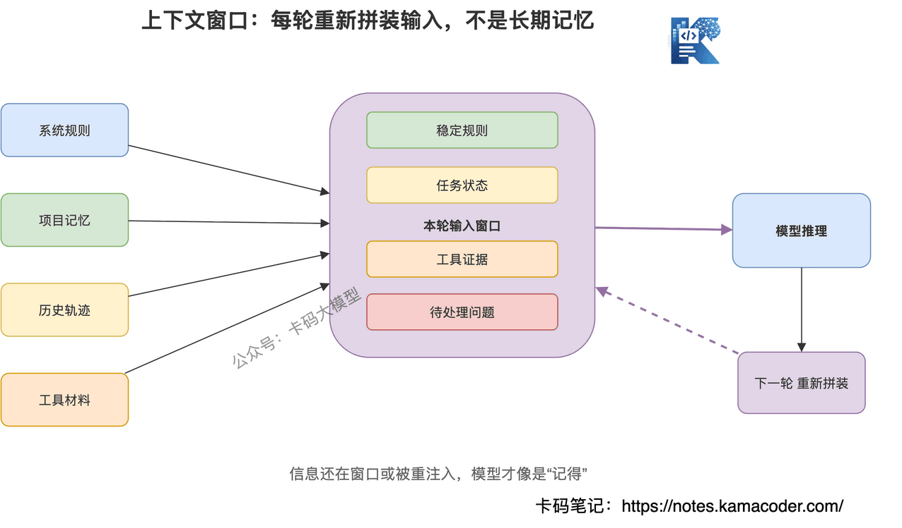
 

这里有个关键点：**模型不是从脑子里掏出历史，而是每一轮都重新读一遍上下文。** 

你以为 Claude Code "记得"刚才读过的文件，其实是因为文件内容或者文件摘要还在上下文里。 

你以为它"记得"你刚才说不要改某个文件，其实是因为这句话还在上下文里。 

一旦这部分被压缩、裁剪、丢弃，模型就可能忘。 

所以，真正的上下文管理不是"让模型记住更多"，而是**决定哪些信息值得继续塞进下一轮输入**。 

## `# 三、为什么 Agent 跑起来分分钟爆窗口？ 

普通聊天为什么不容易爆？ 

因为普通聊天主要就是用户问题和模型回答。 

你问一句，模型答一句。内容再多，也通常是线性增长。 

但 Agent 不一样。 

Agent 每一轮都可能调用工具，而工具结果也会进入上下文。 

Claude Code 这种编程 Agent，一次任务里可能会做这些事： 
  - 读 `package.json`   - 搜索路由入口   - 读取组件文件   - 执行测试命令   - 拿到几百行报错日志   - 修改文件   - 再跑测试   - 再读相关依赖   - 再对比 diff   - 再生成下一步计划 

这不是聊天，这是**带执行轨迹的工作流**。 

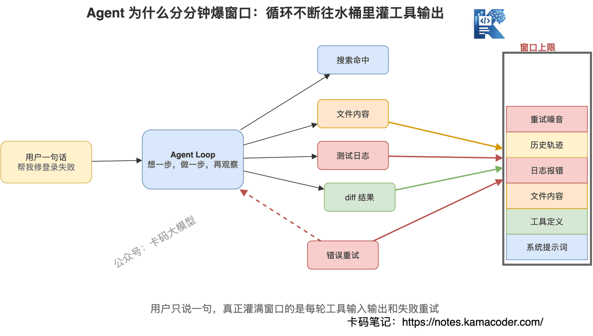
 

一个最典型的场景是修 bug。 

你只说了一句话："帮我修一下登录失败的问题。" 

但 Claude Code 可能要跑很多步： 
  - 搜 `login`   - 读登录页   - 读 API 封装   - 读鉴权中间件   - 跑测试   - 看到报错   - 再读环境变量配置   - 改代码   - 再跑测试   - 再看新报错 

每一步都会产生上下文。 

尤其是三类内容，特别吃 token： 

**第一类，大文件内容。** 

读一个几百行文件，很容易就是几千 token。 

**第二类，命令输出。** 

测试日志、构建日志、堆栈报错，一长就是几百行。 

**第三类，中间推理轨迹。** 

模型每一步的解释、计划、工具调用参数、工具返回结果，都会累计。 

所以面试时要说清楚：**Agent 爆上下文，不是因为用户说得多，而是因为工具调用轨迹太重。** 

这句话很关键。 

## `# 四、上下文满了，真正的问题不是放不下，而是质量下降 

很多人以为上下文窗口满了，只是报错。 

不完全是。 

更麻烦的是：**在还没彻底满之前，模型质量已经开始下降。** 

为什么？ 

因为上下文越长，模型越容易遇到三类问题。 

第一，注意力被稀释。 

重要约束和大量日志混在一起，模型未必能稳定抓住重点。 

第二，早期指令被压到很远。 

你一开始说"不要动数据库结构"，后面塞了几十轮工具结果，这句话就离当前推理越来越远。 

第三，中间状态变脏。 

Agent 做过的错误尝试、失败路径、旧假设，如果一直留在上下文里，会干扰后续判断。 

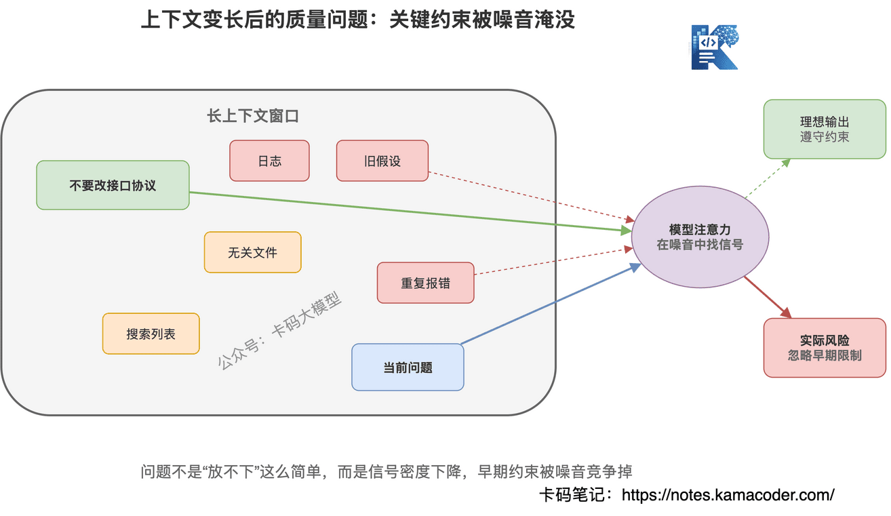
 

所以，上下文管理不是等满了再救火。 

真正好的 Agent 系统，会从一开始就控制上下文质量。 

少拿没用的信息，少保留噪音，少让失败路径污染后续决策。 

Claude Code 的设计思路也是这样：**Auto-Compact 很重要，但它不是第一道防线。** 

## `# 五、业界常见上下文方案，为什么单独用都不够看？ 

讲 Claude Code 之前，我们先看业界常见方案。 

因为面试官很可能追问："为什么不直接用 RAG？为什么不直接摘要？为什么不直接开大窗口？" 

你要能说出每个方案的边界。 

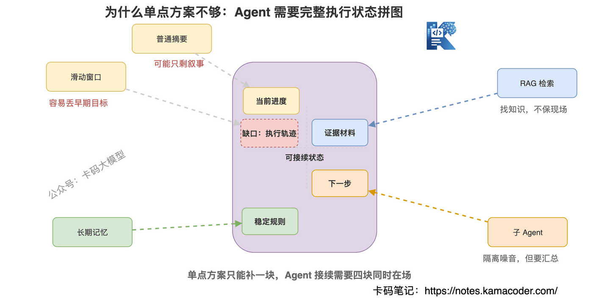
 

### `# 1. 滑动窗口：简单，但容易丢任务背景 

滑动窗口就是先进先出。 

上下文满了，就把最早的内容丢掉。 

这个方案最简单，但对 Agent 很危险。 

因为最早的内容里可能有： 
  - 用户最初目标   - 关键限制条件   - 为什么选择某个方案   - 哪些文件不能改   - 哪些路径已经验证过不通 

这些东西一旦丢掉，Agent 就可能开始乱改。 

所以滑动窗口适合普通聊天，不适合复杂任务执行。 

### `# 2. 摘要压缩：能省 token，但容易丢细节 

摘要比直接丢好。 

它会把旧对话压成一段短文本。 

但问题是：**普通摘要天然偏叙事，不一定保留可执行状态。** 

比如它总结："我们分析了登录模块，并尝试修复 token 失效问题。" 

这句话看起来没错，但对继续干活帮助不大。 

真正有用的信息应该是： 
  - 已确认 `auth.ts` 里 token 续期逻辑有问题   - 已修改 `refreshToken()` 的异常处理   - `login.spec.ts` 还剩一个超时用例没过   - 用户要求不要改接口协议 

所以 Agent 需要的不是作文式摘要，而是**任务状态快照**。 

### `# 3. RAG 检索：适合找资料，不适合保存执行轨迹 

RAG 很适合解决"知识在哪里"的问题。 

比如你问一个函数在哪里定义，或者某个概念在哪篇文档里，它很好用。 

但 Agent 的上下文问题不只是知识检索。 

它还要保存： 
  - 当前任务目标   - 已做过哪些尝试   - 哪些结论已经验证   - 哪些错误路径不要再走   - 当前文件改到了什么状态 

这些是执行轨迹，不是静态知识。 

你把它们丢进向量库再检索，未必能稳定召回关键状态。 

所以 RAG 可以帮 Agent 找代码、找文档，但不能替代任务状态管理。 

### `# 4. 长期记忆：适合规则，不适合临时状态 

长期记忆适合放稳定信息： 
  - 项目技术栈   - 编码规范   - 用户偏好   - 常用命令   - 目录结构说明 

但它不适合放临时任务状态。 

比如"刚刚第 7 步测试失败，原因是 mock 数据缺字段"，这种信息放长期记忆就很怪。 

长期记忆解决的是跨会话规则，不是当前会话执行轨迹。 

### `# 5. 子 Agent 隔离：能分流噪音，但主线还要接得住 

子 Agent 很重要。 

比如让一个子 Agent 去搜索整个代码库，主 Agent 只拿结论。 

这样大量文件读取就不会污染主上下文。 

但子 Agent 也不是万能的。 

因为最终主 Agent 还是要知道： 
  - 子 Agent 发现了什么   - 哪些证据可靠   - 下一步该怎么做 

所以子 Agent 的价值是隔离探索噪音，不是取消上下文管理。 

## `# 六、Claude Code 的上下文治理，不是只靠 Auto-Compact 

现在进入重点。 

Claude Code 的上下文治理，可以理解成五层防线。 

这不是官方术语，而是从工程视角抽象出来的结构。 

**它不是等窗口满了再压缩，而是从拿上下文的那一刻起就开始控制。** 

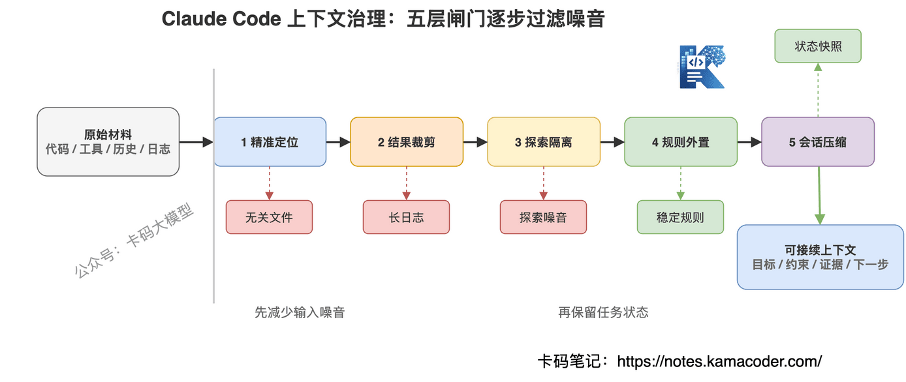
 

### `# 第一层：精准取上下文，少读无关内容 

Claude Code 不鼓励一上来把整个项目塞给模型。 

它更常见的路径是： 

先用 Glob 找文件范围，再用 Grep 定位关键词，最后用 Read 读取关键文件片段。 

这背后有个原则：**上下文不是越多越好，而是越准越好。** 

你让 Agent 一次性读十几个文件，看起来信息全了，但模型注意力会被稀释。 

相反，先搜索，再定位，再读取，虽然多几步工具调用，但上下文质量更高。 

### `# 第二层：工具结果裁剪，别让日志淹没任务 

Agent 最容易被工具输出拖垮。 

所以 Claude Code 会优先处理旧工具输出。 

官方文档里也提到，接近上下文上限时，会先清理较早的工具输出，如果还不够，再做对话摘要。 

这非常合理。 

因为很多工具输出只在当时有用。 

比如一次失败的测试日志，后面你已经根据它修完了，日志本身就没必要完整保留。 

真正需要保留的是结论： 

**哪个测试失败、为什么失败、修到了哪里、还剩什么问题。** 

### `# 第三层：子 Agent 隔离探索，把噪音挡在主线外 

Claude Code 可以让子 Agent 处理研究类任务。 

子 Agent 有自己的上下文窗口。 

它可以去读大量文件、跑搜索、做对比，最后只把摘要和少量元信息返回主 Agent。 

这层设计的价值非常大。 

因为主 Agent 最怕被"探索过程"污染。 

探索过程里有很多不确定信息： 
  - 这个文件可能相关   - 那个路径可能有问题   - 搜出来十几个候选点   - 其中九个最后被证明没用 

这些都塞给主 Agent，会让主上下文又长又脏。 

子 Agent 相当于一个信息过滤器：**把大范围探索变成小体积结论。** 

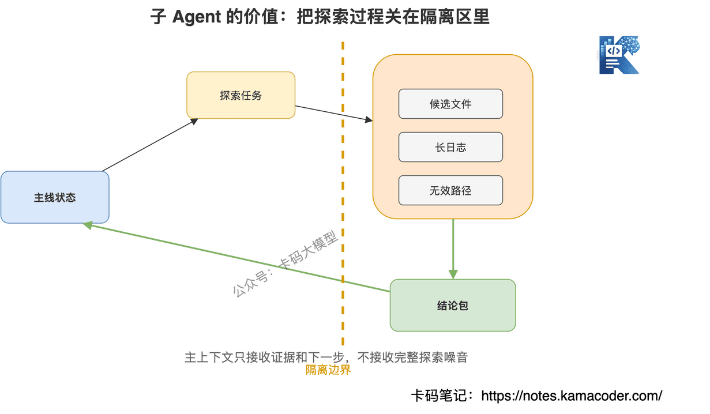
 

### `# 第四层：把稳定规则放到 CLAUDE.md 和 memory 

有些内容不应该依赖聊天历史。 

比如： 
  - 项目必须用 pnpm   - 不允许直接改数据库 schema   - 代码风格遵循现有模式   - 测试命令是什么   - 业务里的关键术语是什么意思 

这些都是稳定规则。 

如果你只在对话一开始说一次，压缩之后很可能丢。 

更好的做法是放到 `CLAUDE.md` 或 memory。 

Claude Code 在压缩之后，会重新注入一部分启动内容，比如项目根的 `CLAUDE.md`、auto memory 等。 

这就保证了稳定规则不会完全依赖早期聊天记录。 

### `# 第五层：Auto-Compact 做会话级压缩 

前四层都是减负。 

但复杂任务跑久了，上下文还是会接近上限。 

这时候才轮到 Auto-Compact。 

Auto-Compact 的核心不是"把旧消息压短"这么简单。 

它真正做的是：**把冗长执行轨迹，压成后续 Agent 能继续工作的状态快照。** 

## `# 七、Auto-Compact 什么时候触发？ 

Auto-Compact 的触发逻辑，可以用一句话理解： 

**不是等窗口彻底满了才压，而是在接近上限、还留有摘要空间时提前压。** 

为什么要提前？ 

因为压缩本身也需要 token。 

如果等上下文真的 100% 塞满，再让模型生成摘要，就可能已经没有足够空间完成压缩。 

所以成熟系统都会预留一段空间给压缩流程。 

Claude Code 里你也可以通过 `/context` 看当前上下文使用情况，通过 `/compact` 手动压缩，通过 `/clear` 清空当前对话历史。 

这三个命令的语义不一样： 

| 命令  作用  适合场景 
| `/context`  查看上下文占用  想知道 token 花在哪 
| `/compact`  摘要当前会话并继续  当前任务没做完，还要接着干 
| `/clear`  清空聊天历史  已切换任务，不需要旧上下文 

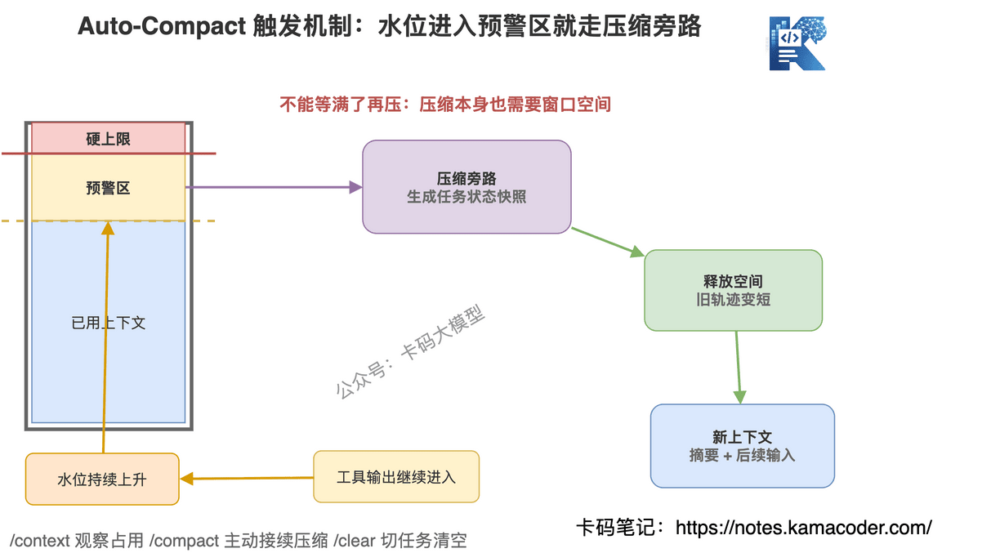
 

面试时这里可以加一句： 

**Auto-Compact 不是异常恢复机制，而是上下文预算管理机制。** 

这句话比"满了就总结"高级很多。 

## `# 八、Auto-Compact 压什么、留什么、丢什么？ 

这是面试最容易被追问的地方。 

如果你只说"压缩历史对话"，还是太粗。 

要按信息价值分层讲。 

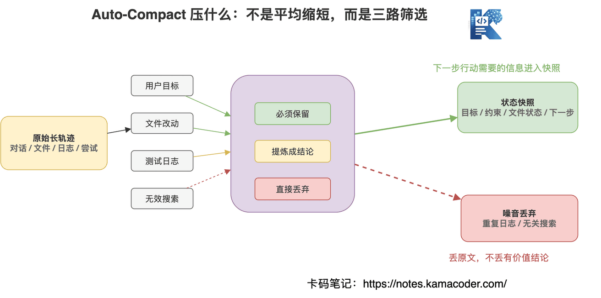
 

### `# 1. 优先压工具输出 

工具输出通常体积最大。 

比如： 
  - 完整测试日志   - 大段构建输出   - 文件读取结果   - 搜索命中列表   - 重复报错堆栈 

这些内容不是完全没用，而是**原文不一定需要保留**。 

更值得保留的是从工具输出里提炼出的状态。 

例如： 

不要保留 300 行测试日志。 

要保留："`auth.spec.ts` 中 refresh token 用例失败，原因是 mock 响应缺少 `expiresAt` 字段。" 

这就是压缩的价值。 

### `# 2. 保留用户目标 

用户最初要做什么，一定要保留。 

比如： 
  - 修登录失败   - 不要改接口协议   - 保持兼容旧版本   - 只改前端，不动后端 

这些是任务边界。 

丢了，Agent 就容易漂移。 

### `# 3. 保留关键决策 

Agent 在执行过程中会做很多判断。 

有些判断是关键决策，必须保留： 
  - 为什么选择方案 A，不选方案 B   - 哪个文件是问题根因   - 哪条错误路径已经排除   - 哪个约束不能破坏 

这些信息决定后续方向。 

如果压缩摘要里没有这些，Agent 可能重复走老路。 

### `# 4. 保留文件状态 

编程 Agent 必须知道文件改到了哪里。 

至少要保留： 
  - 已修改文件列表   - 每个文件改了什么   - 尚未验证的改动   - 还没完成的 TODO   - 已运行和未运行的测试 

否则压缩后继续对话，Agent 就会像重新接手一个陌生现场。 

### `# 5. 丢弃重复和无效过程 

什么可以丢？ 

主要是这些： 
  - 重复搜索结果   - 已经被结论覆盖的长日志   - 无关文件内容   - 被排除的候选路径细节   - 中间寒暄和无执行价值的解释 

注意，不是所有失败路径都能丢。 

如果某个失败路径对后续有警示作用，要保留结论："不要再从 X 模块入手，已验证无关。" 

丢的是原始过程，不是关键结论。 

## `# 九、摘要 prompt 不是"总结一下"，而是生成任务状态快照 

很多人低估了摘要 prompt 的重要性。 

普通摘要 prompt 会写： 

"请总结以上对话。" 

这对 Agent 不够。 

因为 Agent 不是要读一篇摘要文章，而是要接着干活。 

所以摘要 prompt 更应该要求模型输出结构化状态。 

比如： 

```
请把当前会话压缩成后续 Agent 可以继续执行的状态快照。

必须保留：
1. 用户的原始目标和限制条件
2. 当前任务进度
3. 已读取/已修改的关键文件
4. 已确认的事实和关键决策
5. 已排除的错误路径
6. 未完成事项和下一步建议
7. 仍需注意的风险

可以丢弃：
1. 重复日志
2. 无关搜索过程
3. 已被结论覆盖的中间输出
4. 寒暄和非任务信息

```

 

这类 prompt 的目标不是"短"，而是**可接续**。 

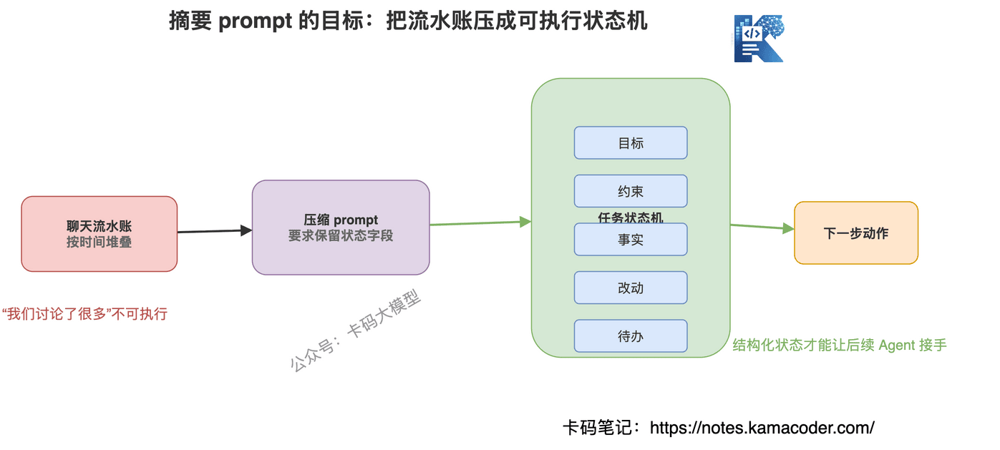
 

面试时你可以这样说： 

**Auto-Compact 的摘要不是给人看的会议纪要，而是给下一轮 Agent 使用的状态转移记录。** 

这句话很重要。 

它能体现你理解 Agent 的执行连续性。 

## `# 十、压完之后，Claude Code 怎么接续对话？ 

压缩之后发生了什么？ 

简单理解，旧的长历史被替换成一段结构化摘要。 

然后新一轮对话继续运行。 

但这里还有几个细节。 

第一，系统提示词不属于普通对话历史，它不会因为 compact 消失。 

第二，项目根的 `CLAUDE.md`、auto memory 这类启动内容会重新注入。 

第三，路径规则、嵌套目录里的 CLAUDE.md、某些按文件触发的规则，可能要等再次读取对应文件后才重新加载。 

第四，已经调用过的 skill 可能会被重新注入，但会受 token 预算限制。 

这说明什么？ 

说明压缩后的接续，不是靠模型"记忆力好"。 

而是靠系统把上下文重新组织成几类内容： 
  - 稳定规则：系统提示词、根 CLAUDE.md、memory   - 当前任务状态：compact 生成的摘要   - 后续按需加载：文件内容、路径规则、子目录规则、工具结果 

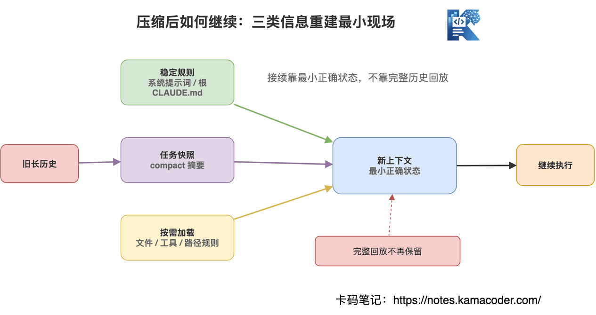
 

所以 Claude Code 压完还能继续，不是因为所有细节都保住了。 

而是因为它保住了继续执行所必需的最小状态。 

这也是上下文压缩的核心取舍： 

**不是尽量不丢信息，而是优先不丢会影响下一步行动的信息。** 

## `# 十一、这道面试题该怎么答？ 

现在把前面内容压成面试回答。 

面试官问： 

**"你了解 Claude Code 的上下文窗口和 Auto-Compact 吗？它是怎么做上下文管理的？"** 

你可以这样回答： 

"上下文窗口本质上是模型一次推理能看到的 token 空间，不是长期记忆。Claude Code 作为编程 Agent，比普通聊天更容易消耗上下文，因为它不仅有用户消息和模型回复，还会持续累积工具定义、文件读取内容、命令输出、测试日志、diff、错误重试和中间决策。 

真正把窗口撑爆的，往往不是用户说了多少，而是工具调用轨迹太重。 

常见方案比如滑动窗口、摘要、RAG、长期记忆和子 Agent 都有价值，但单独用都不够。滑动窗口容易丢任务背景，普通摘要容易丢约束，RAG 更适合找知识，不适合保存执行轨迹，长期记忆适合稳定规则，不适合当前任务状态，子 Agent 能隔离探索噪音，但主 Agent 仍然需要拿到可执行结论。 

所以 Claude Code 更像是分层做上下文治理。前面先通过 Glob、Grep、Read 精准取上下文，减少无关文件； 

再对工具结果做裁剪，避免日志淹没任务； 

复杂探索交给子 Agent，用独立窗口跑，主 Agent 只接收摘要； 

稳定规则放到 CLAUDE.md 和 memory；最后当上下文接近上限时，由 Auto-Compact 把旧对话和工具轨迹压成结构化任务状态。 

Auto-Compact 不是简单总结聊天记录，而是保留用户目标、约束、关键决策、已修改文件、当前进度、未完成事项和风险，把重复日志、无关搜索、已被结论覆盖的中间过程丢掉。 

压缩后，系统提示词、根 CLAUDE.md、memory 等稳定规则会重新进入上下文，compact 摘要作为当前任务状态，后续文件和规则再按需加载，所以 Agent 能继续执行。核心思想是：保留状态，丢弃噪音。" 

这个回答已经够用了。 

如果想再加分，可以补一句： 

**Claude Code 的上下文管理不是为了让模型看见更多，而是为了让模型在每一步都看见更有价值的信息。** 

## `# 十二、面试官可能继续追问什么？ 

### `# 追问 1：为什么不直接把上下文窗口做大？ 

窗口变大能缓解问题，但不能解决问题。 

因为上下文越大，成本越高，延迟越高，注意力稀释也更明显。 

Agent 真正需要的是高质量上下文，不是无限长上下文。 

大窗口适合兜底，不能替代上下文治理。 

### `# 追问 2：RAG 能不能替代 Auto-Compact？ 

不能。 

RAG 解决的是外部知识召回，Auto-Compact 解决的是会话执行状态压缩。 

RAG 适合问"相关代码在哪里"，Auto-Compact 适合保留"当前任务做到哪一步"。 

一个偏检索，一个偏状态延续。 

### `# 追问 3：压缩会不会导致幻觉？ 

会有风险。 

如果摘要把不确定信息写成确定结论，后续 Agent 就会沿着错误状态继续执行。 

所以压缩摘要里要区分： 
  - 已确认事实   - 推测判断   - 未验证事项   - 已排除路径 

好的 compact 摘要必须保留不确定性，不能把所有中间过程都写成结论。 

### `# 追问 4：项目规则应该放对话里，还是 CLAUDE.md 里？ 

稳定规则放 `CLAUDE.md`。 

临时任务要求放当前对话。 

如果某条规则跨任务都重要，比如"不要改数据库 schema"，就不应该只靠一次聊天告诉模型，应该写进项目级记忆。 

因为早期对话可能被压缩，但项目根 `CLAUDE.md` 这类稳定规则会在压缩后重新注入。 

### `# 追问 5：如果你自己设计 Agent 的上下文压缩，会怎么做？ 

我会分三步。 

第一步，先做上下文预算统计，知道 token 花在哪：系统提示词、工具定义、文件内容、命令输出、历史对话分别占多少。 

第二步，按信息价值压缩：工具原文优先裁剪，任务目标和约束必须保留，文件状态和未完成事项必须保留。 

第三步，用结构化摘要接续任务，而不是自然语言闲聊摘要。摘要里明确写目标、进度、已改文件、关键决策、未完成事项和风险。 

最后再配合子 Agent 隔离大范围探索，避免主上下文被噪音污染。 

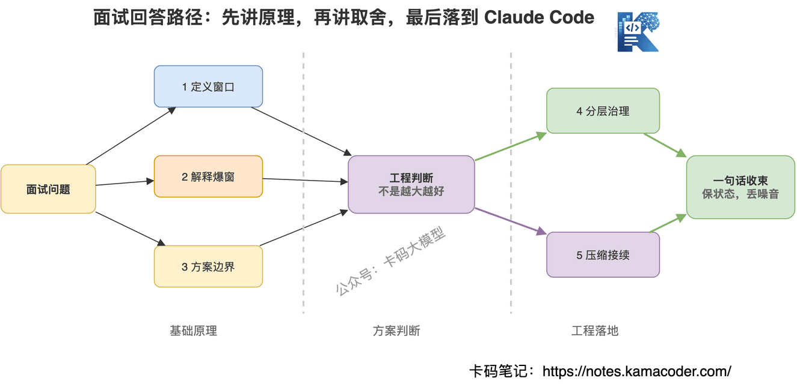
 

## `# 十三、普通开发者怎么用得更稳？ 

理解原理之后，使用建议也就很清楚了。 

**第一，一次会话只做一个主任务。** 

不要在同一个会话里又修 bug、又重构、又加功能、又讨论方案。 

任务越杂，compact 摘要越难保留正确状态。 

**第二，稳定规则写进 CLAUDE.md。** 

比如技术栈、测试命令、禁止改动范围、代码风格，不要只在聊天里说。 

**第三，长日志不要无脑贴。** 

能让工具跑就让工具跑，能截关键报错就截关键报错。 

**第四，压缩前主动说清楚保留重点。** 

如果当前任务复杂，可以手动 `/compact focus on ...`，明确让它保留某个模块、某个 bug、某个改动方向。 

**第五，换任务就 `/clear`。** 

不要让旧任务的上下文污染新任务。 

很多 Agent 漂移，不是模型能力不行，而是上下文太脏。 

## `# 结尾 

Claude Code 的上下文窗口问题，本质不是"200K 够不够"。 

真正的问题是：**Agent 执行过程中，哪些信息应该继续影响下一步决策，哪些信息应该及时退出上下文。** 

会用 Claude Code，只是工具熟练。 

能讲清楚上下文窗口、Auto-Compact、子 Agent 隔离、CLAUDE.md 重注入和任务状态快照，才说明你真的理解 Agent 工程。 

加油 

## `# 参考资料 
  - Claude Code Docs：Explore the context window：https://code.claude.com/docs/en/context-window   - Claude Code Docs：How Claude Code works：https://code.claude.com/docs/en/how-claude-code-works   - Claude Help Center：Models, usage, and limits in Claude Code：https://support.claude.com/en/articles/14552983-models-usage-and-limits-in-claude-code
