# Claude Code为什么不用RAG检索代码？Grep、Glob、Read与代码检索设计哲学

> 来源: https://notes.kamacoder.com/interview/llm/claude_code_grep_rag_interview.html

# `# Claude Code为什么不用RAG检索代码？Grep、Glob、Read与代码检索设计哲学 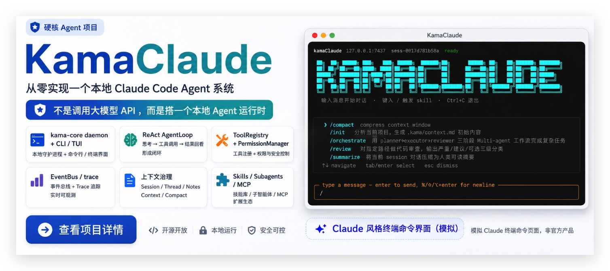
 

最近知识星球  (opens new window)有录友问了一个很容易被面试官拿来深挖的问题： 

"为什么 Claude Code 不用 RAG 检索代码，而是直接用 grep？" 

这个问题听起来像工具选型，其实不是。 

它问的是：**你到底懂不懂代码检索和普通知识库检索的区别。** 

很多录友一听检索，脑子里就自动冒出 RAG、Embedding、向量数据库、Top-K、Rerank。 

这套东西当然重要。 

之前写 RAG大厂面试题汇总 的时候，卡哥也讲过，RAG 是大模型应用开发绕不开的基础能力。 

但注意，**RAG 很强，不等于所有检索都该用 RAG。** 

尤其是代码检索。 

代码不是一篇篇静态文档，代码是每天都在变的、强结构化的、需要精确定位的工程对象。 

你找 `getUserById`，要的就是这个函数，不是"语义上差不多的用户查询函数"。 

你找 `LoginController`，要的是这个文件、这个类、这几行调用链，不是一堆和登录相关的片段。 

所以 Claude Code 这种编程 Agent，没有把核心检索路径押在传统 RAG 上，而是把最朴素的工具做到了极致： 

**Glob 找文件，Grep 搜内容，Read 读上下文，再让模型多轮判断下一步。** 

看起来土。 

但这恰恰是工程判断。 

这篇文章，我们从代码检索的本质开始讲，一层层拆： 
  - 代码检索到底在解决什么问题   - 为什么传统 RAG 放到代码里会别扭   - Claude Code 的 Grep、Glob、Read 为什么不是简单 shell 命令   - 多轮 Agent 检索为什么比一次性 Top-K 更适合写代码   - 子 Agent 为什么能解决上下文污染   - grep 也不是银弹，什么场景仍然该用 RAG 或混合检索   - 面试里怎么回答，才能答出架构感 

认真看完，面试官再问这题，你别只说"因为 grep 快"。 

## `# 目录 
  - 先说结论：这不是 grep 赢了 RAG   - 代码检索和文档检索，根本不是一类问题   - RAG 检索代码的四个硬伤   - Claude Code 为什么把检索拆成三件套   - Grep 不是简单 grep，而是受控的代码搜索工具   - Glob 和 Read 解决的是"文件入口"和"上下文边界"   - 真正关键的是多轮循环，不是某个工具   - 子 Agent：把探索过程隔离出去   - grep 方案也有边界，什么时候 RAG 仍然有价值   - 面试怎么答 
> 

不少读者问我，如何充值Claude会员，我在这里篇单独讲一下：国内Claude充值会员的方法
 

## `# 一、先说结论：这不是 grep 赢了 RAG 

先把结论放前面： 

**Claude Code 不用传统 RAG 作为代码检索主路径，不是因为 RAG 落后，而是因为代码检索更需要实时性、精确性、可解释性和多轮决策。** 

这四个词，就是这道题的核心。 

RAG 的典型思路是： 

先把代码切块，做 Embedding，写进向量库。用户提问时，再把 Query 也向量化，召回语义相似的 Top-K 片段，塞给模型。 

这套方案适合什么？ 

适合知识库问答、产品文档、FAQ、政策条文、客服资料。 

因为这些内容有几个特点： 
  - 文档相对稳定   - 用户问题偏语义匹配   - 目标通常是"找到相关材料"   - 答案可以由多个文档片段综合出来 

但代码检索经常是另一种形态： 
  - 文件刚改完，下一秒就要读到最新内容   - 函数名、类名、变量名必须精确匹配   - 调用链不能被切碎   - 搜索过程要能根据结果不断改方向   - 错了要能知道是哪一步搜错了 

所以这不是"grep 技术含量比 RAG 高"。 

不是。 

grep 本身很普通。 

真正厉害的是：**Claude Code 把 grep 放进了 Agent 的多轮工具调用循环里，让模型像程序员一样边搜、边读、边判断、边修正。** 

如果只看工具，grep 很老。 

如果看系统，grep + Agent Loop 就不老了。 

它不是一个搜索框。 

它是一个会自己改搜索策略的代码侦查流程。 

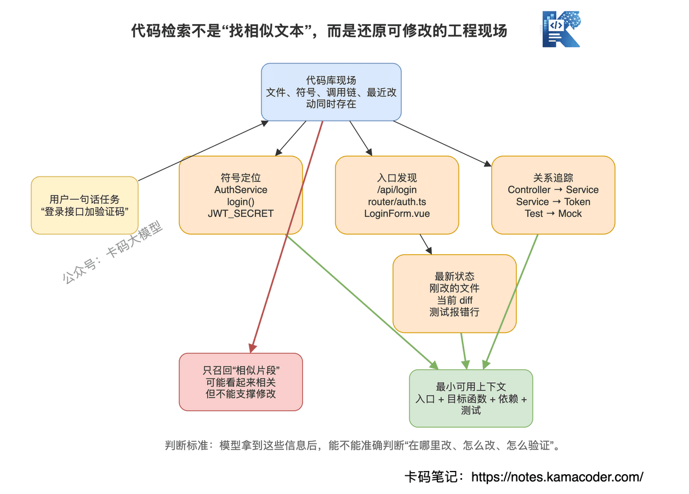
 

## `# 二、代码检索和文档检索，根本不是一类问题 

很多人把代码库当成"一堆文本"。 

这就是第一层误解。 

代码当然是文本，但它不是普通文本。 

一篇产品文档里，某句话断在两段之间，可能还凑合能读。 

代码不行。 

一个 `if` 的条件在上面，分支在下面，你只召回下面那几行，模型根本不知道为什么走到这里。 

一个函数只看函数体，不看它的类型定义、调用方、配置文件、路由入口，也很容易改错。 

代码检索至少有四类目标。 

第一类，**找符号**。 

比如找 `getUserById`、`UserService`、`AuthMiddleware`。 

这类问题不需要语义相似。 

要的就是字面命中。 

面试里你可以直接说：**代码里大量检索任务是 symbol lookup，不是 semantic search。** 

第二类，**找入口**。 

比如"登录逻辑在哪"。 

这时你可能不知道具体函数名，但你会先搜 `login`、`auth`、`token`、`passport`，再看命中的文件。 

这是关键词探索，不是一次向量召回就结束。 

第三类，**找关系**。 

比如"这个字段从接口进来以后，在哪里校验、在哪里入库、哪里返回给前端"。 

这就不是找一个片段，而是找一条路径。 

你要沿着 controller、service、dao、model、schema 一路读下去。 

第四类，**找变化**。 

比如"刚才改了支付状态，为什么测试挂了"。 

这时最重要的是最新文件内容、git diff、最近修改的文件。 

RAG 索引如果没更新，召回的就是旧代码。 

旧代码拿来修新 bug，这不是帮忙，是添乱。 

所以代码检索的核心不是"找相似内容"，而是： 

**在一个不断变化的结构化工程里，快速定位当前任务真正需要的最小上下文。** 

这句话很重要。 

最小上下文，不是越多越好。 

很多录友用 AI 写代码效果差，就是喜欢把一堆无关文件塞给模型。 

模型看得越多，注意力越散。 

你以为是在补充信息，其实是在制造噪声。 

## `# 三、RAG 检索代码的四个硬伤 

RAG 能不能检索代码？ 

能。 

但如果你把传统文档 RAG 直接搬到代码库，问题会非常明显。 

### `# 1. Chunk 很容易破坏代码结构 

RAG 的第一步是切块。 

文档切块主要考虑语义段落。 

代码切块就麻烦了。 

按固定行数切，函数会被切断。 

按函数切，类上下文可能丢了。 

按类切，文件又可能太大。 

按 AST 切，语言多了以后工程复杂度直接上来。 

更要命的是，代码片段不是孤立的。 

一个函数的意义，往往来自： 
  - 参数类型   - 返回类型   - 调用方   - 被调用函数   - 配置项   - 数据库 schema   - 测试用例 

传统 RAG 召回一个函数片段，看起来相关，但上下文可能是残的。 

模型基于残缺上下文改代码，幻觉概率就上来了。 

### `# 2. 向量相似不等于代码正确 

向量检索擅长找"意思相近"。 

但代码场景经常要找"名字相同"。 

你让系统找 `validateToken`，向量库可能召回： 
  - `verifyToken`   - `decodeToken`   - `refreshToken`   - `validateSession` 

这些语义都很像。 

但你要改的是 `validateToken`。 

别的函数再像，也不是目标。 

这就是代码场景里最典型的问题： 

**语义相似是优势，但精确匹配是底线。** 

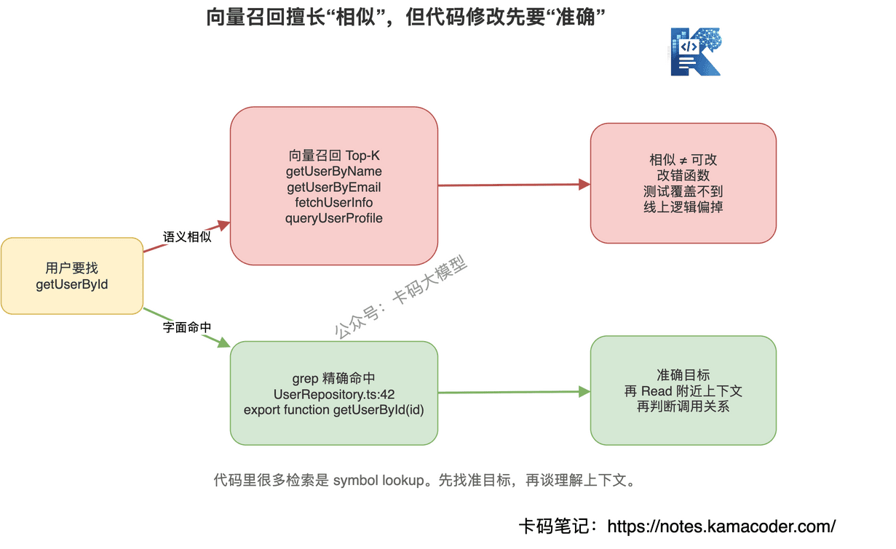
 

没有底线，召回越多越乱。 

### `# 3. 索引滞后会伤害实时开发 

知识库 RAG 可以每天更新一次。 

代码不行。 

你让 Claude Code 改一个文件，它刚写完，下一步就要读这个文件验证。 

如果走 RAG，就有一个尴尬问题： 

索引更新了吗？ 

没更新，查到旧代码。 

更新，谁来决定哪些 chunk 失效？跨文件引用怎么同步？刚改了函数签名，调用方 chunk 要不要重算？ 

这些都能做。 

但代价很大。 

而 grep 和 Read 是现读磁盘。 

文件是什么样，它看到的就是什么样。 

这里没有缓存一致性问题。 

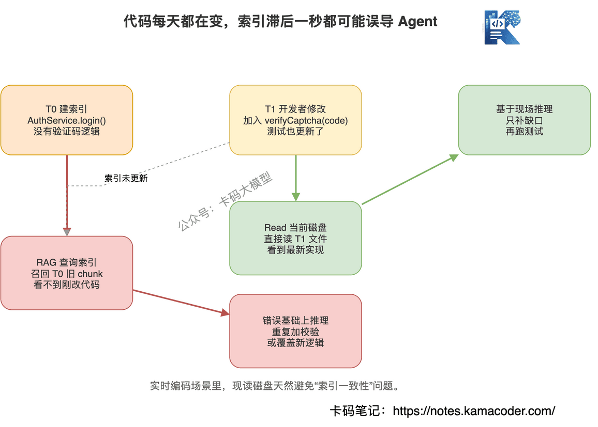
 

### `# 4. Top-K 是一次性下注，Agent 需要边走边看 

传统 RAG 的核心流程是一次召回： 

用户问问题，系统召回 Top-K，模型基于 Top-K 回答。 

如果 Top-K 召回错了，后面就全歪。 

代码开发不是这样。 

程序员找问题，一般是这样的： 

先搜一个关键词。 

没搜到，换个词。 

搜到太多，缩小目录。 

看到一个文件，发现它调用另一个函数。 

再跟过去看。 

看到测试报错，再回头查实现。 

这是一串动态决策。 

不是一次性把材料发完。 

**RAG 更像发试卷，Agent 检索更像现场排查。** 

写代码需要的是后者。 

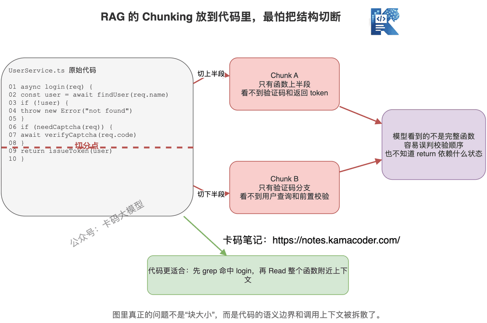
 

## `# 四、Claude Code 为什么把检索拆成三件套 

Anthropic 官方文档里列出的 Claude Code 工具，能看到 `Glob`、`Grep`、`Read`、`Task` 这些工具。 

其中 `Glob` 是按模式找文件，`Grep` 是搜文件内容，`Read` 是读取文件，`Task` 是跑子 Agent 处理复杂多步任务。 

这几个工具合起来，就是 Claude Code 代码理解的底层动作。 

为什么不直接开放一个万能 Bash，让模型自己跑 `grep`、`find`、`cat`？ 

因为产品级 Agent 不能这么粗。 

Claude Code 把这几个动作拆成专用工具，至少有三层考虑。 

第一，**权限边界清楚**。 

`Grep` 和 `Read` 是只读工具。 

`Write`、`Edit` 是会改文件的工具。 

这种边界对安全非常关键。 

如果都塞进 Bash，模型到底只是搜索，还是顺手执行了危险命令，就不好控制。 

第二，**返回结果可控**。 

普通 shell 输出是纯文本。 

工具可以控制输出结构，比如文件路径、行号、匹配内容、截断策略。 

这对模型很重要。 

模型不是人眼看终端，它需要干净、稳定、可预测的观察结果。 

第三，**提示词可以教模型怎么用**。 

工具不是 API 那么简单。 

工具描述会进入模型上下文，告诉模型什么时候用、参数怎么填、什么情况不要用。 

也就是说，工具定义本身就是 Agent 行为的一部分。 

所以别把 `Grep` 理解成"包装了一下 grep 命令"。 

更准确的说法是： 

**Grep 是一个带权限、带输出约束、带使用规范的代码搜索能力。** 

这才是工程化。 

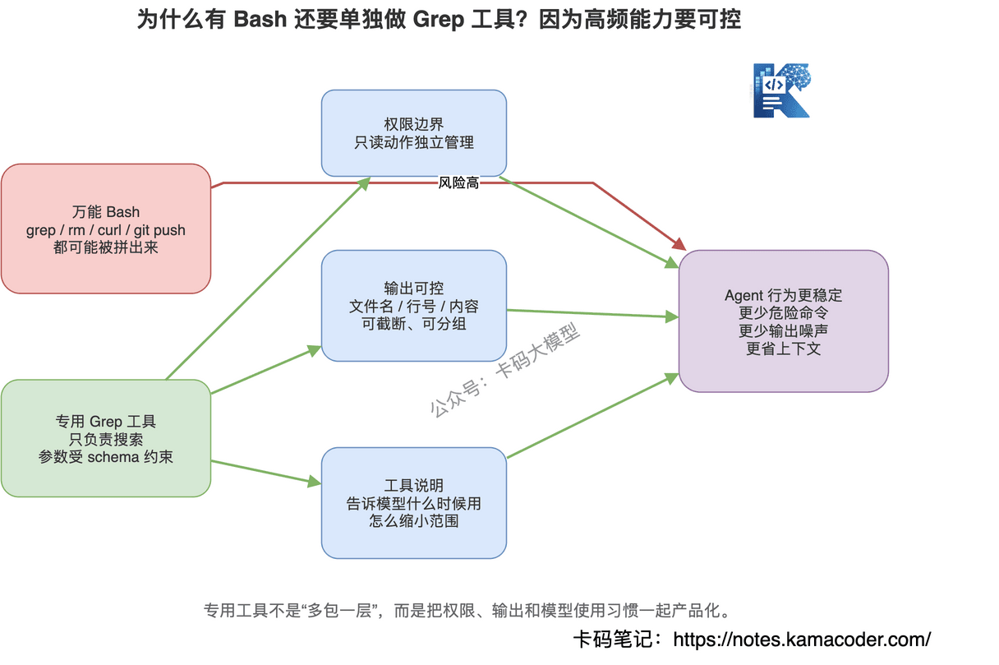
 

## `# 五、Grep 不是简单 grep，而是受控的代码搜索工具 

面试官如果继续追问： 

"既然有 Bash，为什么还要单独做 Grep 工具？" 

你可以从四个角度答。 

### `# 1. 搜索是高频动作，必须产品化 

编程 Agent 每完成一个任务，可能会搜索很多次。 

找文件、找函数、找错误信息、找测试、找配置。 

如果每次都让模型自由拼 shell 命令，风险和噪声都会增加。 

把高频动作做成专用工具，就是把最常用的路径铺平。 

### `# 2. grep 的确定性适合代码符号 

代码里很多东西，就是字面符号。 

函数名、类名、变量名、路由路径、错误码、配置 key。 

这些东西用正则和关键词搜，效果非常好。 

比如： 

```
rg "getUserById"
rg "POST /login"
rg "JWT_SECRET"
rg "ORDER_STATUS_PAID"

```

 

这种任务，向量检索没有优势。 

你要的是确定命中，不是语义相似。 

### `# 3. grep 结果天然可解释 

grep 命中了哪一行，一眼就能看出来。 

模型也能继续基于这个结果推理： 

"这个文件命中了 `login`，我需要 Read 它附近 80 行。" 

"命中太多了，我要限定到 `src/server` 目录。" 

"这个关键词没搜到，我换成 `signin`。" 

RAG 的 Top-K 召回则比较黑盒。 

你很难解释为什么这五个 chunk 排在前面。 

一旦答错，排查也麻烦： 

是 Embedding 不行？ 

是 chunk 切错？ 

是 Top-K 太小？ 

是 Rerank 误排？ 

是生成阶段没看？ 

链路长了，定位问题就难。 

### `# 4. grep 可以和目录约束组合 

真实代码搜索里，"在哪搜"和"搜什么"同样重要。 

你不会每次都全仓库搜。 

你会先判断： 
  - 前端逻辑去 `src/pages`、`src/components`   - 后端逻辑去 `server`、`api`、`controller`   - 测试去 `__tests__`、`tests`   - 配置去 `.env`、`config` 

Grep 和 Glob 配合，就能让模型逐步缩小范围。 

这比一次 Top-K 更像真实开发。 

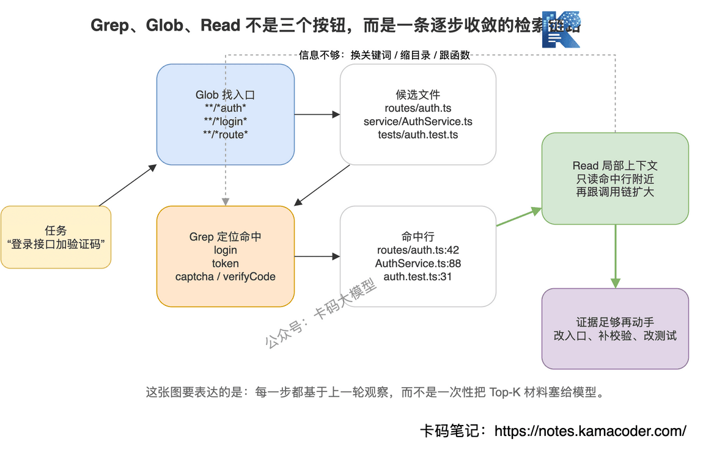
 

## `# 六、Glob 和 Read 解决的是"文件入口"和"上下文边界" 

只讲 grep 还不够。 

Claude Code 不是只靠 grep。 

它靠的是三件套。 

### `# Glob：先找可能相关的文件 

Glob 解决的是文件入口问题。 

有时候你不知道内容关键词，只知道文件形态。 

比如： 
  - 找所有路由文件：`**/*route*.ts`   - 找所有测试文件：`**/*.test.ts`   - 找所有 Vue 组件：`**/*.vue`   - 找所有配置文件：`**/*config*` 

这类检索用向量库很别扭。 

因为你不是在问语义，你就是在找文件名模式。 

文件名本身就是工程约定。 

项目越规范，Glob 越好用。 

### `# Read：只读需要的上下文 

Read 解决的是上下文边界问题。 

很多人让 AI 读文件，一上来就整文件塞进去。 

这很浪费。 

真正合理的方式是： 

先 Grep 命中行号。 

再 Read 命中行附近几十行。 

如果发现需要函数定义，再扩大一点。 

如果发现调用另一个文件，再跳过去读。 

这叫按需读取。 

**代码理解不是把仓库倒进模型，而是把模型需要的证据逐步拿出来。** 

这个思路非常重要。 

面试里你说出来，面试官基本能听出你真的用过 AI 编程工具，而不是只背概念。 

### `# 三件套的标准路径 

举个例子。 

用户说："登录接口加一个验证码校验。" 

Claude Code 大概率不是直接写代码。 

它会先探索： 
  - 用 Glob 找路由和登录相关文件，比如 `**/*auth*`、`**/*login*`   - 用 Grep 搜 `login`、`signin`、`token`、`password`   - 用 Read 读取命中文件附近逻辑   - 发现登录调用了 `AuthService`   - 再 Grep `AuthService`   - Read service 实现   - 找到测试文件   - 修改代码   - 跑测试或读取测试逻辑验证 

你看，这不是一次检索。 

这是一个不断收敛的链路。 

每一步都在问： 

"我现在知道了什么？下一步最该看哪里？" 

这就是 Agent。 

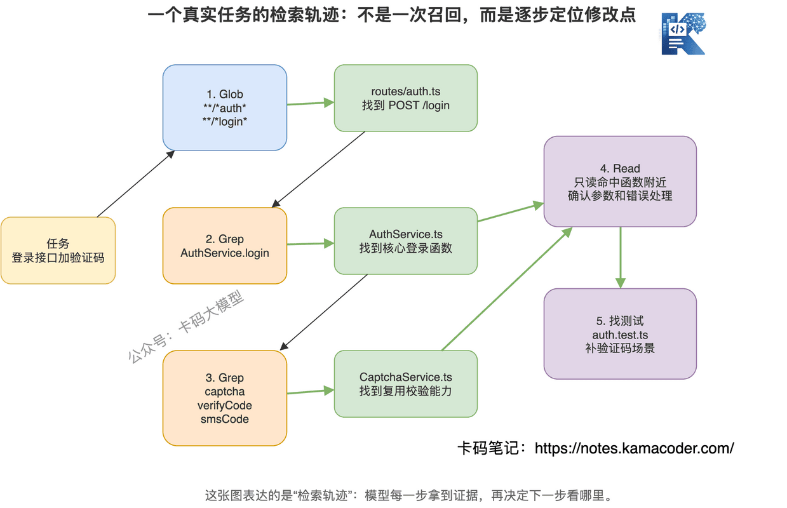
 

## `# 七、真正关键的是多轮循环，不是某个工具 

如果只说 Claude Code 用 grep，所以不用 RAG，这个答案还不够。 

真正核心是： 

**Claude Code 的检索发生在 Agent Loop 里。** 

之前写 Claude Code大厂面试题汇总 的时候讲过，Claude Code 的底层形态就是多轮循环： 

模型思考下一步，调用工具，拿到工具结果，再继续判断。 

代码检索放进这个循环以后，就变成了动态搜索。 

动态搜索和 RAG 的差别很大。 

### `# RAG 是一次性给材料 

典型 RAG 是： 

用户问题 → 向量召回 Top-K → 拼 Prompt → 模型回答。 

它的问题是，召回阶段一旦选错，模型没有机会修正检索策略。 

当然，Agentic RAG 可以多轮检索。 

但传统 RAG 面试里大家讲的那套，核心还是"先召回，再生成"。 

### `# Agent 检索是边看边改方向 

Agent 检索是： 

用户问题 → 模型决定先搜什么 → 工具返回结果 → 模型看结果 → 决定下一步读哪里或换什么关键词。 

这更接近人类程序员的工作方式。 

比如搜 `login` 结果太多。 

模型会缩小目录。 

搜 `captcha` 没结果。 

模型会试 `verifyCode`、`smsCode`、`validateCode`。 

读到 `AuthService.login()`，发现调用了 `issueToken()`。 

模型会继续跟进去。 

读到测试用例，发现已有登录测试。 

模型会优先修改测试覆盖。 

这就是多轮循环的价值： 

**工具结果不是答案，而是下一轮决策的证据。** 

这句话可以直接放进面试回答。 

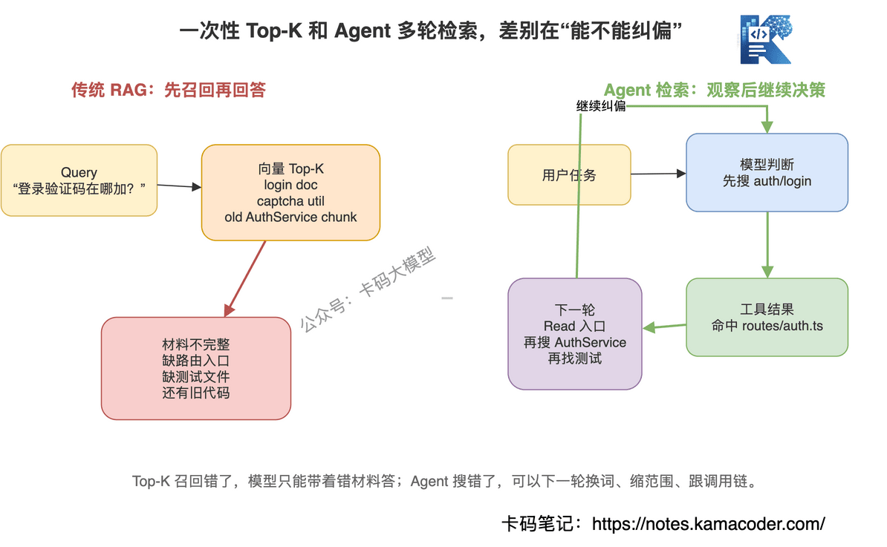
 

## `# 八、子 Agent：把探索过程隔离出去 

还有一个面试官很爱追问的点： 

"如果让主 Agent 一直 Grep、Read，上下文不会爆吗？" 

会。 

所以 Claude Code 还有 `Task` 工具，也就是让子 Agent 去处理复杂、多步的探索任务。 

Anthropic 官方文档也明确讲了 subagents 的价值：子 Agent 有独立的上下文窗口，可以避免污染主对话，并且能限制工具权限。 

这点非常关键。 

### `# 什么叫上下文污染 

你让 Agent 调研一个项目的鉴权流程。 

它可能要： 
  - 搜 `auth`   - 搜 `login`   - 搜 `jwt`   - 搜 `middleware`   - 读路由   - 读 service   - 读配置   - 读测试   - 读拦截器 

中间会产生大量搜索结果和文件片段。 

这些信息有用吗？ 

对探索过程有用。 

对最终写代码不一定都有用。 

如果全塞进主 Agent 上下文，主 Agent 后面真正要修改代码时，注意力就会被一堆中间过程占满。 

这就是上下文污染。 

### `# 子 Agent 怎么解决 

主 Agent 可以派一个探索型子 Agent： 

"你去调研登录链路，给我返回关键文件、核心流程、修改点。" 

子 Agent 在自己的上下文里随便 Grep、Read。 

它可以看很多文件，做很多中间判断。 

最后只把压缩后的结论返回给主 Agent。 

主 Agent 不需要记住所有 grep 输出。 

它只需要知道： 
  - 登录入口在哪个文件   - 验证逻辑在哪个函数   - token 在哪里生成   - 测试应该改哪里   - 需要注意什么边界 

这就是上下文治理。 

**子 Agent 的价值不是"更聪明"，而是把探索过程和执行上下文隔离开。** 

这比"多开几个 Agent 并行干活"更本质。 

并行只是收益之一。 

隔离才是核心。 

### `# 子 Agent 也要控制权限 

生产级 Agent 里，子 Agent 不能随便拥有所有工具。 

探索型子 Agent 最好只给只读工具。 

比如 Glob、Grep、Read。 

它负责调研，不负责改代码。 

主 Agent 拿到结论后，再决定是否 Edit。 

这个设计能降低误操作风险。 

面试里可以这么说： 

**复杂探索用子 Agent，简单定向搜索用 Grep/Glob/Read。子 Agent 最好限制为只读工具，把上下文污染和权限风险都隔离出去。** 

这就是很工程化的回答。 

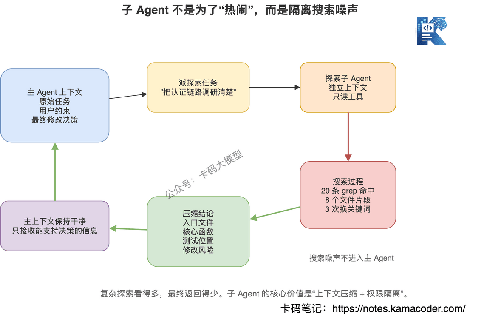
 

## `# 九、grep 方案也有边界，什么时候 RAG 仍然有价值 

写到这里，录友别误会。 

不是说 RAG 没用。 

更不是说做代码检索就只能 grep。 

**技术选型最忌讳站队，应该看场景。** 

Claude Code 的选择适合它的主战场： 

本地或单仓代码库、实时开发、精确修改、需要多轮探索。 

但下面这些场景，RAG 或混合检索仍然有价值。 

### `# 1. 超大规模跨仓库检索 

如果是公司级代码搜索，几十个仓库、几亿行代码。 

只靠 grep 不一定合适。 

这时候需要索引。 

但注意，索引不一定就是纯向量。 

更常见的是： 
  - 关键词倒排索引   - 符号索引   - AST 索引   - 调用图索引   - 向量索引 

组合起来用。 

代码检索最强的形态，往往不是纯 RAG，而是混合检索。 

### `# 2. 模糊需求探索 

用户问： 

"找一下项目里和权限收敛相关的逻辑。" 

"有没有类似限流熔断的实现？" 

"哪里处理了用户风险等级？" 

这类问题不一定有明确关键词。 

向量检索可以帮你找到语义相近的代码和文档。 

然后再用 grep 精确追踪。 

所以比较好的路径是： 

**语义检索做发现，grep 做确认，Read 做证据。** 

这个说法比"RAG 不行"高级得多。 

### `# 3. 代码加文档的综合问答 

很多企业内部问题，不只在代码里。 

还在设计文档、接口文档、ADR、Wiki、故障复盘里。 

比如： 

"为什么订单状态这里要分成 PAID 和 CONFIRMED？" 

答案可能不在代码里，而在历史设计文档里。 

这种场景 RAG 很适合。 

因为它检索的是知识背景，不是当前文件的精确修改点。 

### `# 4. 长期记忆和团队知识沉淀 

Claude Code 读当前代码库很强。 

但如果你要做的是团队级知识助手，长期积累： 
  - 常见故障原因   - 历史架构决策   - 代码规范   - 业务词表   - 工程实践经验 

那 RAG 仍然很重要。 

grep 只能搜当前文件。 

RAG 可以承载长期知识。 

所以最终答案应该是： 

**代码实时修改主路径用 grep/Glob/Read，跨仓语义发现和知识背景用 RAG 或混合检索。** 

这才是成熟架构师的判断。 

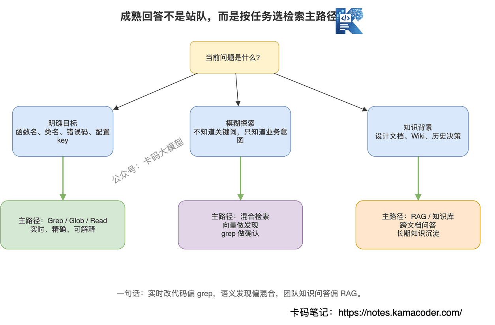
 

## `# 十、面试怎么答 

最后我们把这道题收回来。 

面试官问： 

"为什么 Claude Code 不用 RAG 检索代码，而是直接用 grep？" 

不要上来就说： 

"因为 grep 快。" 

太简单了。 

你可以分三层答。 

### `# 第一层：代码检索不是普通文档检索 

可以这么说： 

"代码检索和知识库文档检索不一样。文档 RAG 更关注语义相关，但代码检索经常是符号定位、文件入口、调用链追踪和最新内容读取。比如我找一个函数名或配置 key，精确匹配比语义相似更重要。" 

这一层回答的是场景差异。 

### `# 第二层：传统 RAG 在代码场景有结构性问题 

接着说： 

"如果把传统 RAG 直接用到代码库，会遇到几个问题。第一，chunking 容易破坏函数、类、调用链这些结构。第二，向量召回是近似匹配，容易把相似函数召回来，但代码修改要的是准确目标。第三，代码每天都在变，索引容易滞后。第四，Top-K 是一次性召回，写代码更需要根据搜索结果不断调整方向。" 

这一层回答的是 RAG 的短板。 

### `# 第三层：Claude Code 的关键不是 grep，而是 Agent Loop 

最后升维： 

"Claude Code 的设计不是简单用 grep 替代 RAG，而是把 Grep、Glob、Read 放进 Agent Loop 里。模型先搜，再读，再根据结果决定下一步。这种多轮检索更像程序员现场排查问题。复杂探索还可以交给子 Agent，在独立上下文里搜索和总结，避免污染主 Agent 上下文。" 

这一层回答的是 Agent 设计哲学。 

如果想再加一句，可以这样收尾： 

"所以这不是 grep 和 RAG 谁高级的问题，而是主路径选型。实时、精确、可解释的代码修改，grep/Read 更合适；跨仓语义发现、代码加文档的知识问答，RAG 或混合检索仍然有价值。" 

这套回答就完整了。 

## `# 高频追问 

### `# 追问1：那 grep 搜不到语义怎么办？ 

答： 

"grep 不擅长纯语义搜索，所以 Claude Code 这类工具通常会通过多轮关键词改写、文件结构探索、调用链阅读来弥补。如果是跨仓库的模糊语义发现，我会引入混合检索，用向量召回做发现，用 grep 和 Read 做确认。" 

关键词是：**向量做发现，grep 做确认。** 

### `# 追问2：为什么不用 AST 索引？ 

答： 

"AST 索引对代码结构理解很有价值，尤其适合符号跳转、引用查找、调用关系分析。但它的工程成本更高，多语言支持复杂，实时更新也麻烦。Claude Code 的核心场景是快速适配任意项目，所以用通用的文件模式搜索和内容搜索作为基础能力，更轻量。理想情况下，AST 索引可以作为增强能力，不一定替代 Grep。" 

这回答比较稳。 

不要把 AST 贬低，它很有用。 

但要讲清楚成本和适用范围。 

### `# 追问3：RAG 能不能做增量更新？ 

答： 

"能做，但增量更新本身就是复杂工程。代码改动会影响 chunk、符号引用、调用链和测试上下文，单纯替换某个向量不一定够。对于实时编码场景，现读磁盘天然避免索引一致性问题。对于公司级知识库或跨仓检索，再做增量索引是合理的。" 

### `# 追问4：子 Agent 为什么能减少上下文污染？ 

答： 

"因为子 Agent 有独立上下文。它可以在自己的上下文里做大量 Grep 和 Read，最后只把压缩后的结论返回给主 Agent。主 Agent 不需要承载所有中间搜索结果，后续修改代码时注意力更集中。" 

### `# 追问5：一句话总结 Claude Code 的设计哲学？ 

答： 

"把确定性工具交给模型，把检索决策权还给模型，让模型在多轮工具反馈中逐步逼近答案。" 

这句话就够狠。 

## `# 最后 

这道题表面问的是： 

"Claude Code 为什么不用 RAG？" 

实际问的是： 

**你能不能根据任务特点做检索架构选型。** 

RAG 很重要，但不要把 RAG 当万能钥匙。 

代码检索最怕的不是"搜不到很多相关内容"。 

最怕的是搜到一堆看起来相关、实际上不能改的内容。 

AI 编程工具的核心，不是把整个仓库喂给模型。 

而是让模型像一个靠谱工程师一样： 

先找入口，再看证据，再跟调用链，再动手改。 

别迷信复杂架构。 

能用简单工具解决的问题，先把简单工具用到极致。 

这也是工程能力。 

## `# 参考资料 
  - Anthropic Claude Code Settings，工具列表里包含 `Glob`、`Grep`、`Read`、`Task` 等工具：https://docs.anthropic.com/en/docs/claude-code/settings   - Anthropic Claude Code Subagents，子 Agent 独立上下文和工具权限说明：https://docs.anthropic.com/en/docs/claude-code/sub-agents
