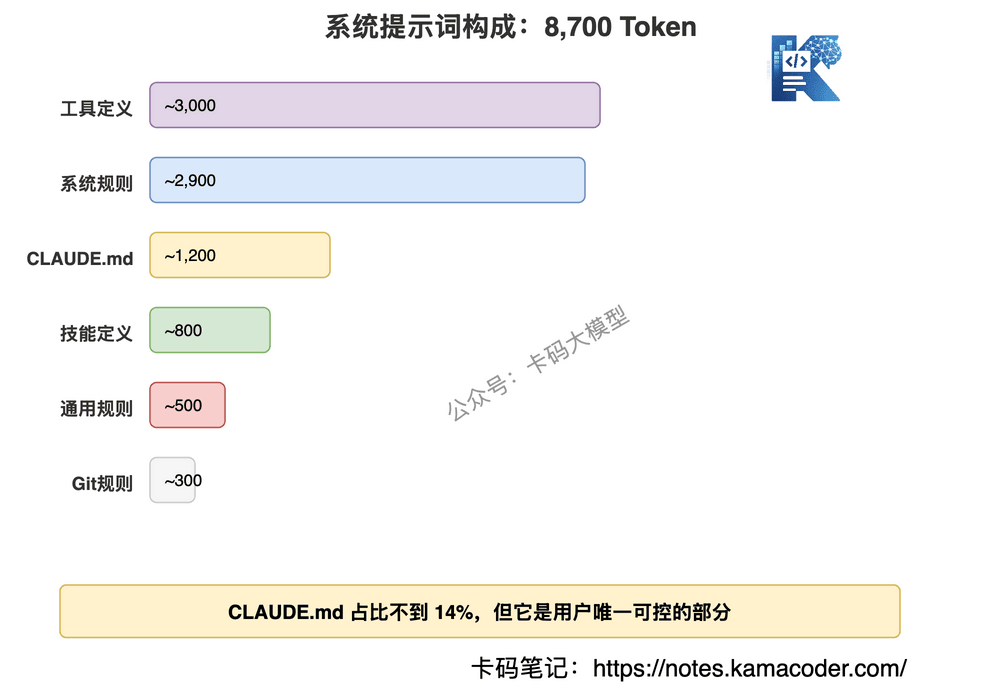
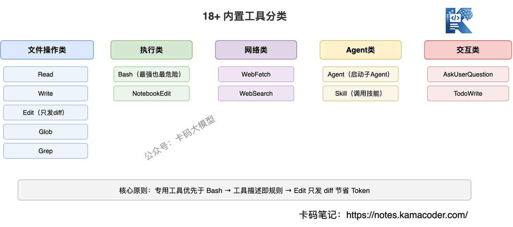
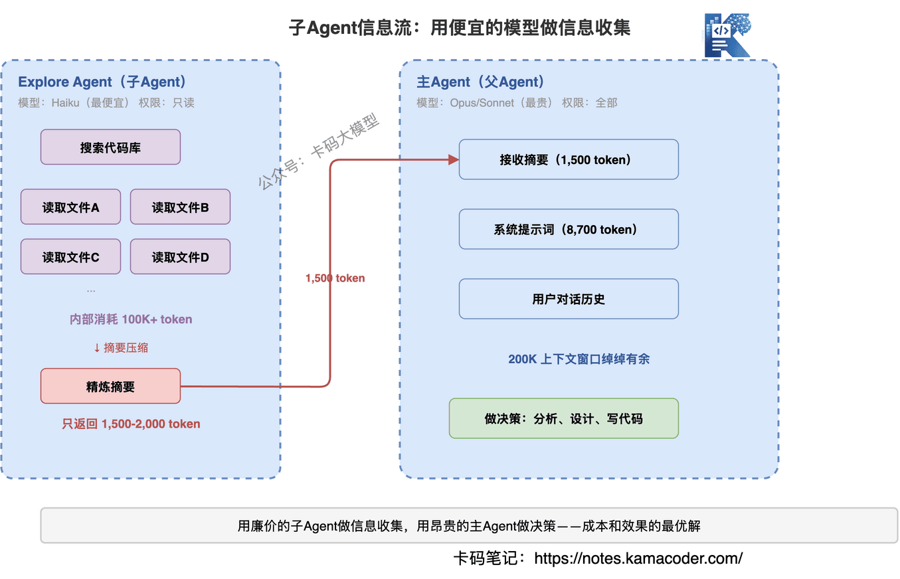
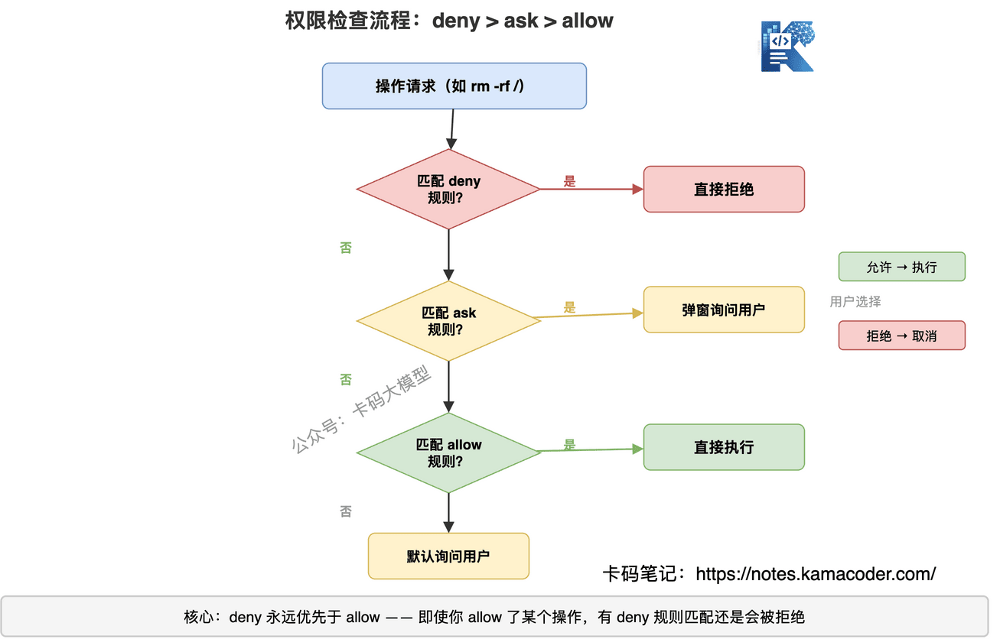
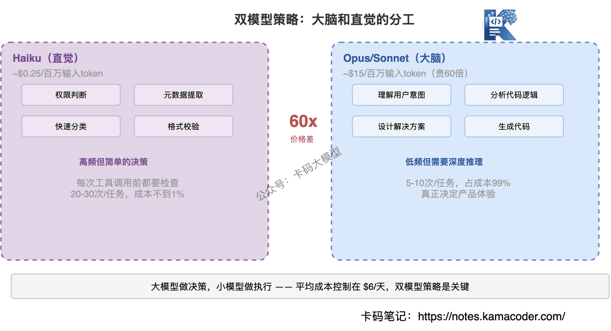

# Claude Code大厂面试题汇总：源码泄露、Agent Loop、系统提示词全拆解|深度解析Claude Code工作原理

> 来源: https://notes.kamacoder.com/interview/llm/claude_code_deep_dive.html

# `# Claude Code大厂面试题汇总：源码泄露、Agent Loop、系统提示词全拆解|深度解析Claude Code工作原理 
 
> 

不少读者问我，如何充值Claude会员，我在这里篇单独讲一下：国内Claude充值会员的方法
 

录友们好，今天写一篇硬核长文。 

现在编程agent已经融入到我们的日常编码工作里了，但你有没有想过：**这些工具底层到底是怎么工作的？** 

大部分人只会用，不知道原理。用得好的时候觉得AI无所不能，用得差的时候觉得AI是智障。**根本原因是你不理解它的工作机制。** 

今天这篇文章，卡哥带你从底层拆解Claude Code的完整工作原理。为什么选Claude Code？ 

因为2026年3月31日发生了一件事——**Anthropic不小心把Claude Code的完整源码泄露了**。512,000行TypeScript代码，包括系统提示词、工具定义、安全规则，全部公开。 

这是AI编程工具领域第一次有产品级源码完整泄露。卡哥学习了GitHub上 learn-claude-code：https://github.com/shareAI-lab/learn-claude-code 这个仓库的整理分析，结合自己的理解，写成这篇万字解析。 

**读完这篇，你会理解所有AI编程工具的底层逻辑——因为它们的架构大同小异**。 

## `# 目录 
  - `Claude Code源码是怎么泄露的？泄露了什么？   - `AI编程工具的底层架构是什么？和普通对话有什么区别？   - `8700 token的系统提示词里写了什么？   - `18+内置工具怎么设计？为什么要专用工具不用Bash？   - `子Agent机制怎么工作？什么场景会启动子Agent？   - `200K上下文窗口怎么管理？压缩机制是什么？   - `23层安全检查怎么防护？权限怎么评估？   - `CLAUDE.md和记忆系统怎么让AI「认识」项目？   - `双模型策略怎么分工？成本怎么控制？   - `从Claude Code能学到什么对开发者有用的？   - `大厂真实面试追问汇总  

## `# 一、Claude Code源码是怎么泄露的？泄露了什么？ 

面试官一般这么问："你了解过Claude Code的源码泄露事件吗？从中学到了什么？" 

2026年3月31日，有人发现Claude Code的npm包（v2.1.88）体积异常——**59.8MB**，比正常版本大了10倍。 

原因很简单：Anthropic的工程师在发布时忘记排除source map文件。Source map是什么？就是编译后的代码到源码的映射文件，有了它就能完整还原TypeScript源码。 

泄露的内容包括： 
  - **完整的系统提示词**——约8,700 token，包含所有行为规则   - **18+内置工具的完整定义**——每个工具的参数、描述、使用规则   - **安全检查机制**——23层顺序检查的完整逻辑   - **子Agent架构**——Explore、Plan、General-purpose三种子Agent的设计   - **上下文管理策略**——200K窗口的三层压缩机制   - **权限系统**——deny > ask > allow的评估顺序 

Anthropic在几小时内修复了这个问题，但源码已经被社区完整保存。 

**这次泄露让我们第一次看到了一个产品级AI编程工具的完整内部结构。** 接下来，我们一层一层拆。  

## `# 二、AI编程工具的底层架构是什么？和普通对话有什么区别？ 

面试官会问："AI编程工具的底层架构是什么样的？和普通ChatGPT对话有什么本质区别？" 

很多人以为AI编程工具很复杂。其实Claude Code的核心架构，**就是一个while循环**。 

没错，就这么简单。 

### `# 核心循环：用户输入 → 模型思考 → 工具调用 → 结果反馈 

Claude Code的工作流程可以用一句话概括：**不断循环"思考-行动-观察"，直到任务完成。** 


 

用伪代码表示： 

```
while (true) {
  // 1. 把对话历史 + 系统提示词发给Claude
  response = claude.chat(messages)
  
  // 2. 如果模型返回纯文本，说明任务完成，退出循环
  if (response.type === 'text') {
    display(response.text)
    break
  }
  
  // 3. 如果模型返回工具调用，执行工具
  if (response.type === 'tool_use') {
    // 权限检查
    if (!checkPermission(response.tool)) {
      result = askUserPermission(response.tool)
    }
    // 执行工具
    result = executeTool(response.tool, response.params)
    // 把结果加入对话历史
    messages.push({ role: 'tool', content: result })
  }
}

```

 

**这就是Claude Code的全部核心逻辑。** 所有的复杂性——工具选择、上下文管理、安全检查——都是在这个循环的各个环节上做文章。 

### `# 为什么是while循环，不是单次调用？ 

这是AI编程工具和普通ChatGPT对话的本质区别。 


 

普通对话是**一问一答**：你问一个问题，AI回答一次，结束。 

AI编程工具是**多轮自主决策**：你说"帮我修这个bug"，AI可能需要： 
  - 先读文件，理解代码结构   - 再搜索相关文件，找到问题根源   - 编辑代码，修复bug   - 运行测试，验证修复   - 发现测试还有问题，继续修   - 最终确认修复完成，返回结果 

每一步都是循环里的一次迭代。**模型自己决定下一步做什么，直到它认为任务完成。** 

### `# 停止条件 

循环什么时候停？两种情况： 
  - **模型返回纯文本**——模型认为任务完成了，不再调用工具，直接输出结果   - **触发安全限制**——比如工具调用次数超限、用户手动中断 

这个设计的精妙之处在于：**停止条件是模型自己判断的**。不是写死的"调用3次工具就停"，而是模型根据任务完成度自主决定。这就是为什么Claude Code有时候能连续执行几十步操作来完成一个复杂任务。 

### `# 和ReAct模式的关系 

如果你了解Agent开发，会发现这就是经典的**ReAct（Reasoning + Acting）模式**： 
  - **Reasoning**：模型思考下一步该做什么   - **Acting**：调用工具执行操作   - **Observation**：观察工具返回的结果   - 循环往复 

Claude Code没有发明新东西，它只是把ReAct模式做到了工程化极致。**架构不复杂，工程细节才是壁垒。**  

## `# 三、8700 token的系统提示词里写了什么？ 

面试官会问："Claude Code的系统提示词有多长？里面写了什么？" 

系统提示词是AI的行为准则。Claude Code的系统提示词约8,700 token，是目前已知最详细的AI编程工具系统提示词。 

### `# 8,700 Token的构成 


 

系统提示词不是一整块文本，而是由多个模块拼接而成： 

| 模块  Token数  作用 
| 系统规则  ~2,900  核心行为准则、安全规则 
| 工具定义  ~3,000  18+工具的参数和使用说明 
| CLAUDE.md  ~1,200  项目级自定义指令 
| 通用规则  ~500  代码风格、输出格式 
| Git规则  ~300  Git操作的安全规范 
| 技能定义  ~800  可调用的技能列表 

### `# 关键设计：CLAUDE.md作为用户消息注入 

这里有一个非常有意思的设计决策：**CLAUDE.md的内容不是放在系统提示词里，而是作为用户消息注入的。** 

为什么？因为系统提示词的优先级最高，如果CLAUDE.md放在系统提示词里，用户的自定义指令就会和Anthropic的安全规则同级，可能被用来绕过安全限制。 

把CLAUDE.md作为用户消息注入，优先级低于系统提示词中的安全规则，但高于普通用户消息。**这是一个安全和灵活性的平衡。** 

### `# 提示词里的"规则嵌套" 

Claude Code的系统提示词有一个特别的设计：**安全规则不只写在系统提示词里，还嵌入在每个工具的描述中。** 

比如Bash工具的描述里就写了： 
  - 不要用cat/head/tail读文件，用Read工具   - 不要用sed/awk编辑文件，用Edit工具   - 不要用echo写文件，用Write工具 

这意味着即使模型"忘记"了系统提示词里的规则，在调用工具时还会再看到一遍。**双重保险。** 

### `# 提示词的"语气"设计 

仔细看Claude Code的系统提示词，你会发现它的语气非常具体： 
> 

"Don't add features, refactor, or introduce abstractions beyond what the task requires."
"Three similar lines is better than a premature abstraction."
"Default to writing no comments."
 

这不是泛泛的"请写好代码"，而是非常具体的编码哲学。**Anthropic把自己的工程文化写进了提示词。** 这也是为什么Claude Code写出来的代码风格比较统一——不是模型天生如此，是提示词约束的。  

## `# 四、18+内置工具怎么设计？为什么要专用工具不用Bash？ 

面试官会问："Claude Code有哪些内置工具？为什么要设计专用工具而不是全用Bash？" 

模型再聪明，没有工具就只能说话。Claude Code的18+内置工具，就是它的手和脚——让它能真正操作你的代码。 

### `# 工具全景图 


 

按功能分类： 

**文件操作类** 

| 工具  功能  关键特点 
| Read  读取文件  支持图片、PDF、Jupyter Notebook 
| Write  写入文件  完整覆盖，适合新建文件 
| Edit  编辑文件  精确替换，只发送diff 
| Glob  文件搜索  按模式匹配文件路径 
| Grep  内容搜索  在文件内容中搜索关键词 

**执行类** 

| 工具  功能  关键特点 
| Bash  执行Shell命令  支持超时、后台运行 
| NotebookEdit  编辑Jupyter  操作notebook的cell 

**网络类** 

| 工具  功能  关键特点 
| WebFetch  抓取网页  自动HTML转Markdown 
| WebSearch  搜索网络  获取实时信息 

**Agent类** 

| 工具  功能  关键特点 
| Agent  启动子Agent  并行处理复杂任务 
| Skill  调用技能  执行预定义的工作流 

**交互类** 

| 工具  功能  关键特点 
| AskUserQuestion  向用户提问  多选/单选/自由输入 
| TodoWrite  任务管理  创建和跟踪任务列表 

### `# 工具设计的核心原则 

**原则一：专用工具优先于通用命令** 

Claude Code的系统提示词里明确写了： 
> 

"Prefer dedicated tools over Bash when one fits (Read, Edit, Write) — reserve Bash for shell-only operations."
 

为什么不直接用`cat`读文件、用`sed`改文件？因为专用工具有更好的错误处理、权限控制和用户体验。用户能看到"Claude正在编辑文件"，而不是看到一堆shell命令。 

**原则二：Edit工具只发送diff** 

这是一个很聪明的设计。Edit工具不是重写整个文件，而是指定`old_string`和`new_string`，只替换匹配的部分。 

好处： 
  - 节省Token——不需要在上下文里放整个文件内容   - 减少冲突——只改需要改的部分   - 便于审查——用户一眼看到改了什么 

坏处： 
  - `old_string`必须唯一匹配——如果文件里有重复内容，需要提供更多上下文来定位 

**原则三：工具描述即规则** 

每个工具的description字段里都嵌入了使用规则。比如Bash工具的描述长达几百字，包含： 
  - 什么时候该用Bash，什么时候不该用   - 怎么处理长时间运行的命令   - Git操作的安全规范   - 多命令并行的最佳实践 

**模型每次想调用工具时，都会重新看到这些规则。** 这比只在系统提示词里写一次要可靠得多。 

### `# Bash工具：最强大也最危险 

Bash是Claude Code里最强大的工具——理论上它能执行任何shell命令。但也正因如此，它的限制最多： 
  - **默认2分钟超时**——防止无限循环   - **不支持交互式命令**——不能用vim、不能用git rebase -i   - **长时间命令要后台运行**——dev server、watch模式不能阻塞   - **权限检查最严格**——rm -rf、git push --force都需要用户确认 

这个设计体现了一个核心理念：**给AI足够的能力，但用规则约束它的行为边界。**  

## `# 五、子Agent机制怎么工作？什么场景会启动子Agent？ 

面试官会问："Claude Code的子Agent是怎么工作的？什么场景下会启动子Agent？" 

当任务太复杂，一个Agent处理不过来时，Claude Code会启动子Agent——相当于"分身"去处理子任务。 

### `# 三种子Agent 


 

| 类型  模型  能力  适用场景 
| Explore  Haiku（最便宜）  只读（搜索、读文件）  快速探索代码库 
| Plan  继承父Agent模型  只读  设计实现方案 
| General-purpose  继承父Agent模型  全部工具  复杂多步骤任务 

### `# Explore Agent：用最便宜的模型做最多的脏活 

Explore Agent是最常用的子Agent。它的设计非常精妙： 
  - **用Haiku模型**——成本极低，速度极快   - **只有只读权限**——不能修改任何文件，只能搜索和阅读   - **内部可以消耗100K+ token**——在自己的上下文里大量读文件   - **返回给父Agent只有1,500-2,000 token的摘要** 

这意味着什么？Explore Agent可以读几十个文件、搜索整个代码库，但最终只返回一个精炼的摘要给主Agent。**主Agent的上下文窗口不会被大量代码撑爆。** 

这是一个非常重要的架构决策：**用廉价的子Agent做信息收集，用昂贵的主Agent做决策。** 

### `# 子Agent的限制 
  - **最多1层嵌套**——子Agent不能再启动子Agent，防止无限递归   - **独立上下文**——子Agent看不到父Agent的对话历史，必须在prompt里给足信息   - **结果不可见给用户**——子Agent的输出只返回给父Agent，用户看不到中间过程 

### `# 并行子Agent 

Claude Code支持同时启动多个子Agent并行工作。比如： 
  - 同时让一个Explore Agent搜索前端代码，另一个搜索后端代码   - 同时让一个Agent跑测试，另一个Agent检查类型 

**并行子Agent是Claude Code处理大型任务的关键能力。** 一个人干不完的活，分给几个"分身"同时干。 

### `# 子Agent的成本考量 

这里有一个很现实的问题：子Agent也要花钱。 
  - Explore Agent用Haiku，成本很低（约$0.25/百万输入token）   - General-purpose Agent用Opus/Sonnet，成本和主Agent一样 

所以Claude Code的策略是：**能用Explore解决的问题，绝不用General-purpose。** 只有真正需要修改文件或执行复杂操作时，才启动全能力子Agent。 

据统计，Claude Code的平均使用成本约**$6/开发者/天**，月均$100-200。子Agent的合理使用是控制成本的关键。  

## `# 六、200K上下文窗口怎么管理？压缩机制是什么？ 

面试官会问："200K的上下文窗口为什么还是不够用？Claude Code怎么处理上下文溢出？" 

Claude Code的上下文窗口是200K token。听起来很大，但在实际编程任务中，消耗速度远超你的想象。 

### `# 上下文是怎么被吃掉的 

一个典型的编程任务，上下文消耗大概是这样的： 

| 内容  Token消耗 
| 系统提示词  ~8,700 
| 用户的问题  ~100-500 
| 读一个文件（500行）  ~3,000-5,000 
| Bash命令输出  ~500-2,000 
| 模型的思考和回复  ~1,000-3,000 
| 每轮工具调用结果  ~1,000-5,000 

一个"帮我修这个bug"的任务，可能需要读5-10个文件、执行几次搜索、多次编辑——**轻松消耗50K-100K token**。复杂任务甚至能把200K吃满。 

### `# 三层压缩机制 


 

当上下文接近容量上限（92-95%）时，Claude Code会触发压缩机制。这个机制分三层： 

**第一层：工具结果截断** 

最先被压缩的是工具调用的结果。比如你读了一个1000行的文件，压缩后可能只保留前100行和后100行，中间用摘要替代。 

**第二层：对话历史压缩** 

早期的对话轮次会被压缩成摘要。比如你30分钟前让AI读的文件内容，会被压缩成"之前读取了config.js文件，其中包含路由配置"这样的摘要。 

**第三层：强制截断** 

如果前两层压缩还不够，会强制截断最早的对话内容。这时候模型可能会"忘记"早期的上下文。 

### `# 压缩带来的问题 

压缩不是免费的，它会导致信息丢失。最常见的问题： 
  - **忘记早期的修改**——你让AI改了文件A，后来又改了很多文件，回头发现AI忘了文件A的修改内容   - **重复读取文件**——AI忘了之前读过某个文件，又读一遍，浪费token   - **丢失用户指令**——你在对话开头说的"不要改这个文件"，可能在压缩后被丢掉 

### `# 实际使用建议 

理解了上下文管理机制，你就知道怎么更高效地使用Claude Code： 
  - **一次对话只做一件事**——不要在一个对话里又修bug又加功能又重构，上下文会爆   - **关键指令放在最近的消息里**——不要指望AI记住你30分钟前说的话   - **复杂任务用CLAUDE.md**——把项目规则写在CLAUDE.md里，每次对话都会加载，不会被压缩掉   - **善用子Agent**——让Explore Agent去读文件，主Agent的上下文就不会被大量代码占满  

## `# 七、23层安全检查怎么防护？权限怎么评估？ 

面试官会问："AI编程工具最大的安全风险是什么？Claude Code怎么防止AI执行危险操作？"或者"Claude Code的权限模型是怎么设计的？deny、ask、allow的优先级怎么排？" 

AI编程工具最大的风险是什么？**它能执行任意shell命令。** 

想象一下：你让AI"清理一下临时文件"，它执行了`rm -rf /`。或者你让它"推送代码"，它`git push --force`覆盖了同事的提交。 

Claude Code用一套23层的安全检查机制来防止这类事故。 

### `# 权限模型：deny > ask > allow 


 

Claude Code的权限评估遵循严格的优先级： 
  - **deny（拒绝）**——最高优先级，匹配到就直接拒绝，不问用户   - **ask（询问）**——中间优先级，匹配到就弹窗问用户是否允许   - **allow（允许）**——最低优先级，匹配到就直接执行 

这个顺序很重要：**deny永远优先于allow。** 即使你在配置里allow了某个操作，如果有deny规则匹配，还是会被拒绝。 

### `# 四种权限模式 

| 模式  说明  适用场景 
| default  大部分操作需要确认  日常使用 
| acceptEdits  文件编辑自动允许，其他需确认  信任AI的代码修改 
| plan  只允许只读操作  让AI分析但不修改 
| bypassPermissions  全部自动允许  完全信任（危险） 

### `# 安全规则嵌入在哪里 

Claude Code的安全规则不是集中在一个地方，而是**分散嵌入在系统的各个层面**： 


 

**第一层：系统提示词** 

```
"Be careful not to introduce security vulnerabilities such as 
command injection, XSS, SQL injection..."

```

 

**第二层：工具描述** 

```
Bash工具描述里：
"Never skip hooks (--no-verify) or bypass signing"
"Before running destructive operations, consider safer alternatives"

```

 

**第三层：Git专用规则** 

```
"NEVER run force push to main/master"
"NEVER update the git config"
"Always create NEW commits rather than amending"

```

 

**第四层：Hooks机制** 

用户可以配置Hooks——在工具调用前后执行自定义脚本。比如： 
  - `PreToolUse`：在工具执行前检查，可以拦截危险操作   - `PostToolUse`：在工具执行后检查，可以回滚错误操作   - `Stop`：在AI完成回复后执行，可以做最终检查 

### `# "测量两次，切割一次" 

系统提示词里有一句话特别值得注意： 
> 

"measure twice, cut once"（测量两次，切割一次）
 

这是Claude Code安全设计的核心哲学：**宁可多确认一次，也不要执行一个不可逆的操作。** 

具体体现在： 
  - 删除文件前要确认   - force push前要确认   - 修改CI/CD配置前要确认   - 发送消息到外部服务前要确认 

**所有难以撤销的操作，都需要用户明确同意。** 

### `# 双模型安全检查 

这里有一个很巧妙的设计：Claude Code用**两个模型**做安全检查。 
  - **Haiku（小模型）**：做快速的权限判断——这个操作需不需要问用户？   - **Opus/Sonnet（大模型）**：做复杂的安全推理——这个操作有没有潜在风险？ 

为什么不全用大模型？因为权限检查是高频操作，每次工具调用都要检查。用Haiku做初筛，成本低、速度快；只有需要复杂判断时才用大模型。**这就是下一章要讲的双模型策略。**  

## `# 八、CLAUDE.md和记忆系统怎么让AI「认识」项目？ 

面试官会问："CLAUDE.md是干什么的？为什么不能放在系统提示词里？"或者"AI的记忆系统怎么设计？记忆和实际代码状态不一致怎么办？" 

每次开启新对话，Claude Code都是一张白纸——它不知道你的项目结构、编码规范、技术栈偏好。**CLAUDE.md就是解决这个问题的。** 

### `# CLAUDE.md：项目级的"说明书" 

CLAUDE.md是一个放在项目根目录的文件，每次对话开始时会自动加载到上下文中。你可以在里面写： 
  - 项目架构说明   - 常用命令（构建、测试、部署）   - 编码规范和风格要求   - 技术栈和依赖说明   - 已知问题和注意事项 

```
# CLAUDE.md

## 项目概述
这是一个基于Next.js 14的电商平台，使用App Router。

## 常用命令
- npm run dev：启动开发服务器
- npm run test：运行测试
- npm run build：构建生产版本

## 编码规范
- 使用TypeScript strict模式
- 组件使用函数式写法
- 状态管理使用Zustand
- API请求使用React Query

```

 

### `# 三层CLAUDE.md 

Claude Code支持三个层级的CLAUDE.md，优先级从高到低： 

| 层级  位置  作用域 
| 项目级  项目根目录/CLAUDE.md  整个项目 
| 目录级  子目录/CLAUDE.md  该目录下的文件 
| 用户级  ~/.claude/CLAUDE.md  所有项目 

**目录级CLAUDE.md特别有用。** 比如你的前端目录和后端目录有不同的编码规范，可以分别写CLAUDE.md。 

### `# 记忆系统：跨对话的持久化 

CLAUDE.md解决了项目级的上下文问题，但还有一类信息是跨项目、跨对话的——比如你的编码偏好、你的角色背景、你之前给过的反馈。 

Claude Code的记忆系统用文件存储这些信息： 

```
~/.claude/projects/<project>/memory/
├── MEMORY.md          # 记忆索引
├── user_role.md       # 用户角色信息
├── feedback_style.md  # 用户反馈的工作风格偏好
└── project_context.md # 项目背景信息

```

 

记忆分四种类型： 
  - **user**：用户的角色、偏好、知识背景   - **feedback**：用户对AI行为的纠正和确认   - **project**：项目的目标、进度、决策背景   - **reference**：外部资源的指针（如"bug追踪在Linear的INGEST项目里"） 

### `# 记忆的核心原则："可疑索引，不是可信真相" 


 

这是记忆系统设计中最重要的一点：**记忆是索引，不是真相。** 

系统提示词里明确写了： 
> 

"Memory records can become stale over time... Before answering the user or building assumptions based solely on information in memory records, verify that the memory is still correct and up-to-date by reading the current state of the files."
 

翻译成人话：**AI不能因为记忆里写了"config.js在第50行有路由配置"就直接去改第50行——它必须先读文件确认。** 因为上次记忆的时候是第50行，现在可能已经变了。 

这个设计非常务实。记忆帮AI快速定位信息，但最终决策必须基于当前代码的实际状态。 

### `# CLAUDE.md的安全边界 

前面提到，CLAUDE.md是作为用户消息注入的，不是系统提示词。这意味着： 
  - CLAUDE.md**不能**覆盖Anthropic的安全规则   - CLAUDE.md**不能**让AI执行被deny的操作   - CLAUDE.md**可以**自定义编码风格、项目规范、工作流程 

**这是一个精心设计的信任边界：项目维护者可以定制AI的行为，但不能突破安全底线。**  

## `# 九、双模型策略怎么分工？成本怎么控制？ 

面试官会问："Claude Code为什么用两个模型？全用大模型不行吗？"或者"双模型策略的成本优化效果怎么样？什么操作用小模型，什么操作用大模型？" 

Claude Code不是只用一个模型，而是用两个模型配合工作。这是一个非常聪明的成本优化策略。 

### `# 两个模型，两种角色 


 

| 模型  角色  负责什么  成本 
| Haiku  "直觉"  权限判断、元数据提取、快速分类  ~$0.25/百万输入token 
| Opus/Sonnet  "大脑"  代码理解、方案设计、复杂推理  ~$15/百万输入token 

价格差**60倍**。如果所有操作都用Opus，成本会高到不可接受。 

### `# Haiku负责的"快决策" 

每次工具调用前，Claude Code需要判断：这个操作需不需要问用户？这是一个高频但简单的决策——不需要理解代码逻辑，只需要匹配规则。 

比如： 
  - `Read("config.js")` → 读文件，安全，直接允许   - `Bash("rm -rf node_modules")` → 删除操作，需要确认   - `Edit("app.js", ...)` → 编辑文件，看权限模式决定 

这类判断用Haiku就够了，快且便宜。 

### `# Opus/Sonnet负责的"慢思考" 

真正需要大模型的场景是： 
  - 理解用户的意图——"帮我优化这个函数"到底要优化什么？   - 分析代码逻辑——这个bug的根因是什么？   - 设计解决方案——应该怎么重构这段代码？   - 生成代码——写出正确的、符合项目风格的代码 

这些任务需要深度推理能力，只有大模型能胜任。 

### `# 成本控制的实际效果 

通过双模型策略，Claude Code把大量低价值的判断交给Haiku，只在真正需要推理时才用Opus/Sonnet。 

粗略估算： 
  - 一次典型的编程任务，可能有20-30次权限检查（Haiku）   - 但只有5-10次真正的代码推理（Opus/Sonnet）   - 如果全用Opus，权限检查的成本会占总成本的30-40%   - 用Haiku做权限检查，这部分成本降到不到1% 

**这就是为什么Claude Code能把平均成本控制在$6/天——双模型策略是关键。**  

## `# 十、从Claude Code能学到什么对开发者有用的？ 

面试官会问："从Claude Code的架构设计中，你觉得对开发AI应用有什么启示？"或者"如果让你从零设计一个AI编程工具，你会怎么设计？" 

拆解完Claude Code的架构，最后聊聊对我们开发者的启示。不管你是用AI编程工具，还是自己开发AI应用，这些设计思路都值得借鉴。 

### `# 启示一：Agent架构没有魔法，就是while循环 

很多人觉得Agent很神秘。看完Claude Code的源码你会发现，**核心就是一个while循环+工具调用**。没有复杂的状态机，没有花哨的架构模式。 

如果你在做Agent开发，不要过度设计。先把最简单的循环跑起来，再逐步加规则、加工具、加安全检查。**简单的架构+丰富的规则，比复杂的架构+稀疏的规则更可靠。** 

而所谓"逐步加规则"，加的就是循环这个控制结构上的工程治理——上下文、状态、预算、工具、终止判断，这套东西现在有个专门的名字叫 Loop Engineering，系统讲解见 从 ReAct 到 Loop Engineering：Agent 到底在循环什么。 

### `# 启示二：提示词工程是真正的产品壁垒 

Claude Code的512,000行代码里，真正决定产品体验的不是代码逻辑，而是那8,700 token的系统提示词。 
  - 什么时候该问用户，什么时候自己决定   - 什么样的代码风格是好的   - 什么操作是危险的   - 怎么平衡自主性和安全性 

**这些"软规则"才是AI产品的核心竞争力。** 代码可以抄，提示词的调优经验抄不走。 

### `# 启示三：安全不是功能，是架构 

Claude Code的安全机制不是一个独立的模块，而是渗透在系统的每一层：系统提示词、工具描述、权限模型、Hooks、双模型检查。 

**如果你在开发AI应用，安全必须从架构层面考虑，不能事后补。** 一个没有权限控制的AI Agent，就像一个有root权限的实习生——能力很强，但随时可能闯祸。 

### `# 启示四：上下文管理决定了AI的"智商上限" 

很多人抱怨AI"变笨了""忘记了之前说的话"。现在你知道原因了——**上下文窗口被压缩了，信息丢失了。** 

理解这个机制后，你可以： 
  - 把重要信息写在CLAUDE.md里（不会被压缩）   - 一次对话只做一件事（减少上下文消耗）   - 关键指令放在最近的消息里（最后被压缩） 

**不是AI笨，是你没有在它的认知范围内给够信息。** 

### `# 启示五：双模型策略是AI应用的标配 

不是所有任务都需要最强的模型。Claude Code用Haiku做权限检查、用Opus做代码推理，成本降了几十倍。 

如果你在开发AI应用，想想哪些环节可以用小模型： 
  - 意图分类 → 小模型   - 内容过滤 → 小模型   - 格式校验 → 小模型   - 核心推理 → 大模型 

**大模型做决策，小模型做执行——这是成本和效果的最优解。**  

## `# 十一、大厂真实面试追问汇总 

以下是各大厂在AI编程工具方向的真实追问，整理汇总。 

### `# 系统设计类 

**Q：如果让你设计一个AI编程工具，你会怎么设计安全机制？** 

必答四个要点： 
  - **分层嵌入**——安全规则不能只放在系统提示词里，要嵌进工具描述、专用规则、用户Hooks，做到即使模型"忘记"某一层，还有其他层兜底   - **权限分级**——deny > ask > allow 严格优先级，deny永远覆盖allow，不能被用户配置绕过   - **不可逆操作必须确认**——rm -rf、git push --force、数据库DROP等操作，永远不能自动执行   - **审计可追溯**——所有工具调用记录完整日志，出问题能回溯定位 

**Q：AI编程工具的上下文窗口管理有什么挑战？怎么解决？** 

核心矛盾：**任务越复杂，需要的信息越多，但窗口只有200K。** 

解决策略： 
  - **专用工具节省Token**——Edit只发diff，Glob/Grep按需搜索，不全量加载文件   - **分层压缩**——早期对话摘要压缩，中间结果只保留关键信息，系统提示词按模块裁剪   - **子Agent隔离**——探索代码库交给Explore Agent，内部消耗100K+，返回父Agent只占1,500-2,000 token   - **双模型路由**——简单任务用小模型，减少单次调用Token消耗 

### `# 原理深挖类 

**Q：为什么CLAUDE.md不放在系统提示词里？** 

安全和优先级的平衡。系统提示词优先级最高，如果把CLAUDE.md放进去，用户的自定义指令就和Anthropic的安全规则同级，可能被用来覆盖安全规则。作为用户消息注入，CLAUDE.md的优先级低于系统提示词中的安全规则，但高于普通用户消息。**用户能自定义行为，但不能突破安全底线。** 

**Q：子Agent的上下文和父Agent的上下文是什么关系？** 

完全隔离。子Agent有自己的上下文窗口，不共享父Agent的对话历史。父Agent只给子Agent一个任务描述，子Agent返回一个摘要。这种设计的核心目的是**保护父Agent的上下文不被大量代码撑爆**。代价是子Agent看不到父Agent的完整上下文，可能重复做父Agent已经做过的工作。 

**Q：Edit工具为什么只发diff而不是整个文件？** 

三个好处：节省Token（不需要把整个文件内容放进上下文）、减少冲突（只改需要改的部分）、便于审查（用户一眼看到改了什么）。代价是old_string必须唯一匹配，文件里有重复内容时需要提供更多上下文来定位。这是**带宽和精度的权衡**——在200K窗口的约束下，省Token是第一优先级。 

**Q：Claude Code的权限检查为什么用deny > ask > allow而不是allow优先？** 

因为安全的原则是**默认拒绝，显式允许**。如果allow优先，用户配置一条allow规则就可能绕过安全检查。deny优先意味着：即使你不小心allow了一个危险操作，只要有deny规则匹配，还是会被拦截。这和防火墙的设计思路一致——**宁可多拦截一次，也不要放行一个危险操作。** 

### `# 工程实践类 

**Q：Claude Code和Cursor、Windsurf有什么区别？** 

核心架构大同小异，都是Agent Loop + 工具调用 + 上下文管理。区别在于： 
  - **Cursor**：IDE深度集成，代码补全是独立功能（不经过Agent Loop），Agent模式类似Claude Code   - **Windsurf**：Cascade模式自动多步执行，强调"意图理解"   - **Claude Code**：纯CLI，权限控制最严格，子Agent机制最完善 

面试时不要只说"都差不多"，要能说出各自的设计取舍。 

**Q：怎么写好CLAUDE.md？** 

三条原则： 
  - **写约束不写愿望**——"不要加注释"比"写简洁的代码"更有用，模型对禁止性规则的遵守远强于建议性规则   - **写具体不写抽象**——"函数名用驼峰"比"遵循项目风格"更有用，模型需要明确的判断标准   - **写原因不写指令**——"VuePress 1.x插件版本必须统一为1.5.3，混用会导致运行时错误"比"注意插件版本"更有用，知道原因模型才能举一反三 

**Q：实际使用AI编程工具遇到过什么问题？** 

常见五个坑： 
  - **上下文污染**——对话太长后AI开始"忘记"早期约定 → 解法：新任务开新对话，关键指令放最近的消息   - **幻觉编辑**——AI编辑了一个不存在的文件路径 → 解法：用Glob确认路径再编辑   - **过度重构**——AI把简单任务改成复杂设计 → 解法：CLAUDE.md里明确写"不要引入不必要的抽象"   - **权限绕过**——用户习惯性点"允许全部" → 解法：用plan模式先让AI分析，确认方案再切回default模式   - **成本爆炸**——复杂任务消耗大量Token → 解法：拆分子任务，用Explore Agent做前期调研减少主Agent消耗  

## `# 常见问题（FAQ） 

**Q：Claude Code 的底层架构是什么？和普通对话有什么区别？** 

Claude Code 是 while 循环的 Agent 模式，模型决定调用工具、执行后把结果喂回模型、继续循环直到任务完成。普通对话是一问一答，Claude Code 能多轮自主调用工具完成复杂编程任务。 

**Q：为什么 Claude Code 用专用工具而不是直接用 Bash？** 

专用工具如 Read、Edit、Glob、Grep 有明确的输入输出 schema，模型更容易正确调用，也方便做权限控制和安全校验；全靠 Bash 则难以约束行为、容易出错和越权。 

**Q：Claude Code 怎么管理 200K 上下文窗口？** 

通过 Auto-Compact 自动压缩历史对话、保留任务关键状态、用子 Agent 隔离上下文等机制，避免长任务把上下文窗口撑爆。 

**Q：Claude Code 的子 Agent 机制怎么工作？** 

主 Agent 通过 Agent 工具启动 Explore、Plan 等子 Agent，各自独立执行后把结果回传汇总。适合前期调研、大范围搜索这类消耗大量上下文的子任务，避免污染主 Agent。 

**Q：CLAUDE.md 怎么写才有效？** 

三条原则是写约束不写愿望、写具体不写抽象、写原因不写指令。禁止性规则比建议性规则更被遵守，明确的判断标准和原因能让模型举一反三。 

**Q：学 Claude Code 原理对用其他 AI 编程工具有用吗？** 

有用。Cursor、Windsurf、Copilot 等工具底层架构大同小异，都是 Agent Loop 加工具链加上下文管理加系统提示词，理解 Claude Code 就能理解这一类 AI 编程工具。 

## `# 写在最后 

这篇文章从源码泄露事件出发，拆解了Claude Code的10个核心模块：Agent Loop、系统提示词、工具链、子Agent、上下文管理、安全机制、CLAUDE.md、记忆系统、双模型策略、开发者启示。 

**Claude Code不是魔法，是工程**。 每一个让你觉得"AI好聪明"的瞬间，背后都是精心设计的规则和约束。 

理解这些原理，你不仅能更好地使用Claude Code，还能更好地理解所有AI编程工具——Cursor、Windsurf、Copilot，底层逻辑大同小异。 

这篇是整体拆解，几个模块还有专门的深挖：它为什么用 Grep 而不是 RAG 检索代码看 Claude Code 为什么不用 RAG 检索代码，200K 上下文窗口怎么压缩和管理看 Claude Code 上下文窗口面试详解，它和 Hermes Agent、OpenClaw 的架构对比看 Agent 框架横评。想从"程序员怎么用好 AI 编程"这个角度看，可以读 Vibe Coding 大厂面试题汇总。 

再次感谢 learn-claude-code：https://github.com/shareAI-lab/learn-claude-code 仓库的整理，让我们有机会看到一个产品级AI编程工具的完整内部结构。 

加油
