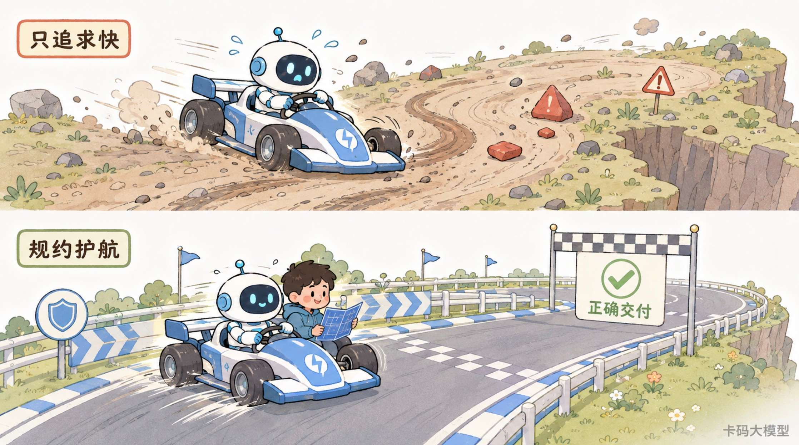
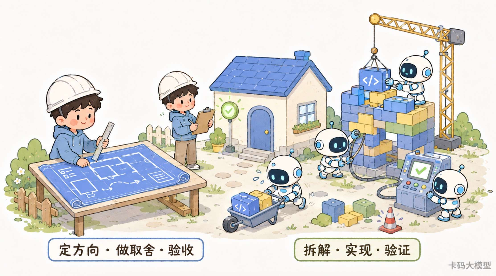

# Spec-Driven Development规约驱动开发：AI写代码越快，为什么越要先写清楚

> 来源: https://notes.kamacoder.com/interview/llm/spec_driven_development_interview.html

# `# Spec-Driven Development规约驱动开发：AI写代码越快，为什么越要先写清楚 

前面我们聊过 Vibe Coding，核心问题是：AI 可以把代码写得很快，但“写得快”不等于“写得对”。 

后面又聊了 AI 增强开发三件套，其中 OpenSpec 负责把模糊需求变成可审查的规格。 

这篇继续往下挖一个更底层的问题： 

**为什么 AI 编程发展得越快，大家反而重新重视写规约？** 

先看一个很真实的场景。 

你对 AI 说：“帮我加一个会员续费功能。” 

几分钟后，接口、页面、数据库字段、支付回调全写出来了，测试也是绿的。 

看起来效率高得吓人。 

但你仔细一问，问题全出来了： 
  - 未过期会员续费，到底从原到期日顺延，还是从付款日重算，AI 自己猜了一个   - 支付回调重复到达会不会重复增加时长，需求没写，AI 只实现了成功路径   - 你在前一轮对话里说过“不能改旧接口”，上下文压缩后它忘了   - 一个任务同时改了十几个文件，等你 Review 时，已经很难找到从哪一步开始跑偏   - 测试虽然全过，但测试验证的是 AI 自己写出的逻辑，不是你真正想要的业务规则 

这几个问题都不是“AI 不会写代码”。 

恰恰相反，**就是因为 AI 写得太快，模糊需求、错误假设和遗漏边界也被它一起快速放大了。** 

你以为自己缺的是一个更强的模型。 

实际上缺的是一份能让人和 AI 共同确认的规约：做什么、不做什么、边界在哪里、什么结果才算完成。 

很多录友第一反应是：“以前写需求文档还不够吗？这不就是换了一个新名字？” 

还真不是。 

传统文档经常写完就躺在角落里，代码还是代码，文档还是文档。 

Spec-Driven Development，简称 SDD，想做的是另一件事： 

**让规约不再只是开发前的参考材料，而是驱动设计、任务、代码、测试和验收的核心工件。** 

说得再直接一点： 

过去是“先聊个大概，然后边写边猜”。 

现在是“先把意图变成可检查的规约，再让 Coding Agent 沿着规约执行”。 


 

## `# 一、Spec-Driven Development 到底是什么？ 

先给一个能直接拿去面试的定义： 

**Spec-Driven Development 是一种以规约为核心工件的软件开发方式。团队先把目标、用户行为、边界条件和验收标准写成可审查的规约，再由规约推导技术方案、实施任务、代码和测试，并在需求变化或实现反馈出现时持续同步规约。** 

中文社区里也有人把它翻译成“规格驱动开发”或“规范驱动开发”。说的是同一套思路，本文统一使用“规约驱动开发”。 

这里有三个关键词。 

### `# 1. 规约不是一篇“大作文” 

很多人一听“写规约”，脑子里立刻出现几十页 Word 文档。 

这就把方向想偏了。 

一份能驱动开发的规约，至少要回答这些问题： 
  - 为什么要做，解决谁的问题   - 用户能做什么，系统必须表现成什么样   - 哪些边界必须处理，哪些内容明确不做   - 什么结果算完成，拿什么证据验收   - 性能、安全、兼容性等非功能约束是什么 

它可以是 Markdown，可以放在代码仓库，也可以拆成多份结构化工件。 

**格式不是重点，能不能减少歧义、驱动后续动作才是重点。** 

### `# 2. 规约要能一路追到代码和测试 

普通需求文档常见的问题是：产品写一份，开发自己理解一份，测试再猜一份。 

最后三个人说的好像是同一个功能，实际上不是一回事。 

SDD 要求把这条链路串起来： 

```
用户意图 → 行为规约 → 技术方案 → 可执行任务 → 代码与测试 → 验收证据

```

 

每个任务应该能回答“它对应哪条需求”，每条验收标准也应该能回答“由哪个测试或检查证明”。 

### `# 3. 规约不是写完就锁死 

开发过程中一定会发现新情况。 

比如第三方支付接口不支持原来设想的状态，或者旧系统的数据模型根本承载不了新规则。 

这时候不是偷偷把代码改掉，然后让文档继续过期。 

而是把实现发现反馈到规约和计划，再重新确认。 

所以 SDD 更接近**活的规约**，不是“一次性的大前期设计”。 

## `# 二、规约驱动开发为什么会在 AI 编程时代重新火起来？ 

规约不是 2025 年才出现的概念。 

需求分析、软件规格说明书、接口契约、验收标准、BDD、TDD，这些东西软件行业早就在做。 

但过去很长时间里，团队经常遇到一个现实问题： 

**把规约写得足够详细很贵，而代码变化又很快，文档很容易跟不上。** 

于是很多团队走向另一个极端。 

能开会说清楚的就不写，能在群里确认的就不沉淀，先把代码做出来再说。 

在纯人工开发时代，这套方法虽然也会出问题，但资深工程师还能靠业务经验、代码 Review 和团队默契补回来。 

到了 Coding Agent 时代，情况变了。 

### `# 1. 代码生成成本突然下降了 

以前一个模糊需求交给工程师，工程师会一边理解、一边追问、一边写。 

现在你只说一句“帮我加一个会员续费功能”，AI 几分钟就能改十几个文件。 

代码生成变快了，但需求并没有自动变清楚。 

于是新的瓶颈从“怎么写代码”转向了“到底应该写什么”。 

### `# 2. AI 很能执行，但不会读心 

AI 面对缺失信息时，通常不会停在那里等你。 

它会根据训练数据和当前代码，补出一个“最像正确答案”的方案。 

这正是危险的地方。 

**AI 的猜测经常很合理，但合理不等于符合你的业务。** 

GitHub 在 2025 年 9 月发布开源 Spec Kit  (opens new window) 时，把核心流程整理成 `Specify → Plan → Tasks → Implement`。Kiro  (opens new window) 也在 2025 年 7 月发布时，把 requirements、design、tasks 做成 Coding Agent 可以持续读取和执行的工件。 

这些工具带火的不是“多写几份 Markdown”。 

它们背后的变化是：**自然语言规约第一次可以被 Agent 直接消费，并持续转化成计划、代码和测试。** 

规约从“给人看的文档”，开始变成“人和 Agent 共同执行的接口”。 


 

## `# 三、没有规约，AI 开发最容易出现什么问题？ 

### `# 问题一：模糊需求会变成“假设爆炸” 

还是会员续费这个例子。 

你说：“增加会员续费功能。” 

至少有这些问题没有答案： 
  - 未过期会员续费，是从当前到期日顺延，还是从付款日重算   - 过期会员续费，算续费还是重新开通   - 支付回调重复到达，能不能重复加时长   - 优惠券能不能和续费折扣叠加   - 续费成功后，旧权益和新权益怎么衔接   - 支付成功但本地更新失败，怎么补偿 

人看到这些问题，会知道“需求还没说清楚”。 

Agent 如果直接开写，就必须为每个空白做一次假设。 

一个假设错了，可能只是一个小 Bug。 

十几个假设互相影响，最后就是整条业务链路返工。 

### `# 问题二：聊天记录不是可靠的项目记忆 

很多 AI 开发看起来有上下文，其实上下文只存在当前对话里。 

你上午说“不要改旧接口”，下午上下文压缩后，Agent 忘了。 

你换一个窗口，原来的业务解释没了。 

另一个同事接手，只能从已经生成的代码反推意图。 

**聊天适合探索，仓库里的规约才适合长期协作。** 

规约进入版本管理后，团队可以看 diff，可以 Review，可以知道某条规则什么时候、为什么发生变化。 

### `# 问题三：任务太大，Agent 容易一路跑偏 

“帮我把会员系统做完”不是一个任务，只是一个愿望。 

如果 Agent 一口气改数据库、接口、前端、定时任务和支付回调，等你看到结果时，可能已经是一份上千行 diff。 

这时候 Review 非常痛苦。 

你既不知道它从哪一步开始理解错了，也不敢确认删掉哪部分不会影响其他代码。 

SDD 会把工作拆成可以单独验证的小任务。 

例如先完成会员期限计算规则，再做幂等订单，再接支付回调，最后补页面和端到端测试。 

**任务越可检查，Agent 越不容易带着错误跑很远。** 

### `# 问题四：“代码写完了”和“需求完成了”被混为一谈 

AI 最容易给你一种错觉：文件改了，测试绿了，任务就完成了。 

但测试可能只覆盖了它自己选择实现的 happy path。 

如果一开始没有验收标准，你根本说不清它漏了什么。 

规约把“完成”的定义提前。 

不是 Agent 说完成就完成，而是预先约定的场景有证据通过，才算完成。 

### `# 问题五：错误会被高速复制 

人工写错一个方向，可能一天后才产出几百行代码。 

AI 理解错一个方向，几分钟就能把错误扩散到接口、数据库、测试和文档。 

所以模型越强，越不能只关注生成速度。 

**没有方向盘时，发动机越强，冲出去越快。** 

## `# 四、一套完整的 SDD 流程怎么跑？ 

不同工具的文件名不完全一样，但核心链路基本一致。 

GitHub Spec Kit 当前的基础流程是 `Spec → Plan → Tasks → Implement`；Kiro 常见的三个核心工件是 `requirements.md`、`design.md`、`tasks.md`。 

工具可以换，下面这条逻辑不能丢。 

### `# 第一步：先写“做什么”和“为什么” 

这一阶段先别急着选框架、定数据库表。 

先把用户和业务讲清楚。 

拿会员续费举例，一份最小规约可以这样写： 

```
目标：
允许有效会员在权益到期前续费，续费时长从当前到期时间顺延。

核心场景：
- 当有效会员购买 30 天续费包并支付成功时，系统在原到期时间上增加 30 天。
- 当同一支付回调重复到达时，系统只能增加一次会员时长。
- 当支付成功但权益更新失败时，订单进入待补偿状态，并可被后台任务重试。

不在本次范围：
- 不支持续费券和其他优惠叠加。
- 不修改自动续费协议。

验收证据：
- 核心场景有自动化测试。
- 重复回调测试证明会员时长只增加一次。
- 测试环境完成一次真实支付回调链路验证。

```

 

注意，这里面写的是行为和边界，不是先规定 Controller 必须有几个类。 

### `# 第二步：主动消灭歧义 

规约初稿出来后，不要立刻进入开发。 

先专门找这些内容： 
  - 模糊词：“尽快”“友好”“支持常见格式”到底是什么意思   - 缺失场景：失败、超时、重复、并发、权限不足怎么办   - 冲突规则：两个需求同时触发时听谁的   - 隐藏约束：旧接口、数据迁移、合规、性能有没有限制   - 范围膨胀：哪些需求看似顺手，其实不在本次交付里 

这一轮的目标不是把文档写长。 

是让 Agent 少猜。 

### `# 第三步：再写技术方案 

需求确认后，才讨论“怎么做”。 

技术方案至少要说明： 
  - 会改哪些模块，哪些模块不能动   - 数据结构和接口契约怎么变化   - 核心状态如何流转   - 异常怎么恢复，是否需要回滚或补偿   - 测试分几层，分别证明什么   - 有哪些技术选择，为什么选当前方案 

这里最重要的是把“业务决定”和“技术决定”分开。 

需求说的是支付回调必须幂等。 

设计才决定用唯一索引、幂等键还是状态机保证。 

**稳定的是什么，灵活的是什么，必须分清。** 

### `# 第四步：拆成可独立验证的任务 

好的任务不是“完成后端开发”。 

好的任务应该小到可以单独 Review、单独测试，并且能追到某条规约。 

例如： 
  - 为续费订单增加幂等键和唯一约束，并写重复请求测试。   - 实现会员期限顺延规则，并覆盖未过期、刚过期和跨月场景。   - 接入支付回调状态流转，并补失败补偿测试。   - 增加续费页面和错误提示，完成端到端验证。 

任务拆分不是为了让清单更好看。 

**它是在限制每一次 Agent 执行的影响半径。** 

### `# 第五步：按任务实现，每一步都拿证据 

执行阶段不要只看 Agent 的自然语言总结。 

要看证据： 
  - 改了哪些文件，diff 是否符合当前任务   - 单元测试、集成测试、端到端测试分别通过了什么   - 有没有修改规约之外的代码   - 有没有遗留假设、失败测试或未完成项   - 当前实现能不能追溯到验收标准 

规约不是替代 Review。 

规约是让 Review 有尺子。 

### `# 第六步：把实现反馈同步回规约 

开发不是单向流水线。 

如果实现时发现原方案不成立，应该回到规约或设计层更新，再继续执行。 

否则很快会出现三套事实： 
  - 规约写的是一套   - 代码实现的是另一套   - 团队口头理解的又是一套 

到这里，SDD 才真正形成闭环： 

```
规约 → 设计 → 任务 → 实现 → 验证
 ↑                            ↓
 └────── 发现与反馈回流 ──────┘

```

 


 

## `# 五、SDD 为什么重要？ 

很多文章会说 SDD 可以“提升代码质量”。 

没错，但这句话太泛。 

它真正重要的地方，是重新分配了 AI 开发里的注意力。 

### `# 1. 把人的精力从“逐行生产”移到“定义正确” 

AI 越来越擅长把一个明确方案翻译成代码。 

人更应该把精力放在： 
  - 问题值不值得解决   - 业务边界是否完整   - 技术取舍是否合理   - 风险能不能接受   - 证据能不能证明结果正确 

这不是程序员不写代码了。 

而是程序员的价值往上游移动了。 

### `# 2. 让上下文从临时聊天变成长期资产 

规约、设计和任务放进仓库后，不依赖某个聊天窗口。 

它们可以被不同 Agent 读取，也可以被不同成员 Review。 

对于长任务来说，这相当于给 Agent 一份稳定的任务状态和项目记忆。 

这和 Claude Code 上下文窗口 里讲的道理是一致的：上下文窗口会压缩、会丢细节，关键约束必须沉淀到外部工件，不能只藏在对话里。 

### `# 3. 让并行开发有共同坐标 

多个 Agent 或多名开发者并行工作时，最怕大家各自理解一套。 

清晰的接口契约、任务边界和验收标准，可以让不同执行者围绕同一个目标拆分工作。 

但要注意，规约只是并行的前提，不是并行不会冲突的保证。 

模块边界、依赖关系和合并策略仍然要设计。 

### `# 4. 让 Review 从“看起来行不行”变成“是否符合约定” 

没有规约时，Review 经常只剩代码风格、空指针和性能问题。 

最关键的业务正确性反而没人说得清。 

有规约后，Review 可以逐条检查： 
  - 这个实现对应哪条需求   - 这个边界有没有覆盖   - 这个测试证明了哪条验收标准   - 这次额外修改是不是超出范围 

### `# 5. 让变更的影响更容易被发现 

当规约、技术计划、任务和测试之间有追溯关系时，一条需求变化不会只是“改一句话”。 

团队能顺着链路看到它会影响哪些接口、数据结构、任务和测试。 

这会显著降低“产品只改了一个规则，开发漏改三个地方”的概率。 


 

## `# 六、SDD 和 PRD、TDD、BDD、瀑布模型有什么区别？ 

这几个概念很容易混。 

### `# SDD 和 PRD 

PRD 主要讲产品需求。 

SDD 覆盖的链路更长，它关心如何从需求规约继续推导设计、任务、实现和验证。 

**PRD 可以成为规约的一部分，但一份 PRD 不等于完整的 SDD。** 

### `# SDD 和 TDD 

TDD 用测试先定义代码行为，再写最小实现让测试通过。 

SDD 的范围更大，它从用户意图和系统边界开始。 

两者非常适合组合：规约里的验收标准继续下沉成测试，TDD 再用测试约束具体实现。 

### `# SDD 和 BDD 

BDD 强调用业务可读的场景描述系统行为，常用 Given-When-Then 表达。 

这些场景可以直接成为 SDD 里的行为规约和验收标准。 

但 SDD 还会继续覆盖技术设计、任务拆分和变更同步。 

### `# SDD 和瀑布模型 

两者表面上都强调“先想清楚再开发”，但不能画等号。 

瀑布模型更强调阶段顺序，容易让人联想到大批量、一次性的前置文档。 

现代 SDD 更强调小步迭代和双向反馈。 

规约可以先做到“足够支持下一步”，实现发现也可以反向更新规约。 

**SDD 反对的是无规约地乱冲，不是要求一次把未来所有变化写死。** 

### `# SDD 和一个超长 Prompt 

超长 Prompt 仍然是一次对话输入。 

规约是被版本管理、可 Review、可追溯、能跨会话复用的项目工件。 

一个写得很详细的 Prompt 可以成为规约初稿，但如果它没有进入持续维护和验证链路，就还不是完整的 SDD。 

## `# 七、规约要维护到什么程度？ 

不是所有团队都要把规约当成唯一源代码。 

现在常见的做法大致有三层。GitHub Spec Kit 的规约持久化说明  (opens new window)也强调，团队要先约定规约在功能完成后保留多久、需求变化时以哪份工件为准。 

| 模式  规约怎么用  适合场景  主要风险 
| Spec-first  开发前写清楚，完成后不强制长期维护  一次性功能、小型项目  后续变更时规约容易过期 
| Spec-anchored  规约长期保留，重要变更持续同步  大多数长期维护的业务系统  需要团队建立同步纪律 
| Spec-as-source  人主要修改规约，代码和其他工件尽量由规约再生成  高度自动化、边界清晰的系统  工具链和验证能力要求很高 

很多团队刚开始落地，选择第二种更实际。 

别一上来就喊“以后禁止手改代码”。 

先做到核心业务规则、接口契约和验收标准不漂移，价值已经很大。 

## `# 八、什么时候值得用 SDD？ 

适合上完整规约流程的场景： 
  - 需求有很多边界和异常路径   - 一次改动跨前端、后端、数据库或多个服务   - 涉及支付、权限、隐私、数据一致性   - 多人或多个 Agent 要并行协作   - 功能会被长期维护，需求还会持续变化   - 错误的返工和上线代价很高 

可以轻量处理的场景： 
  - 修改一处明确文案   - 修复范围清楚的样式问题   - 一次性探索原型   - 很容易撤销、几分钟就能验证的小改动 

判断标准别搞复杂： 

**需求的不确定性越高、改动的影响半径越大、错误代价越高，规约就应该越完整。** 


 

## `# 九、落地 SDD 最容易踩哪些坑？ 

### `# 坑一：让 AI 写完规约，人直接点确认 

这和让 AI 写完代码直接 Accept 没区别。 

AI 可以帮你发现遗漏、整理结构，但业务目标和取舍必须由人负责。 

**规约的价值来自审查，不来自文件数量。** 

### `# 坑二：把规约写成实现说明书 

需求阶段就把类名、方法名、数据库字段全部写死，会把探索空间提前堵住。 

先稳定“做什么”，再讨论“怎么做”。 

除非某项技术本身就是硬约束，否则别过早锁死。 

### `# 坑三：规约越来越长，却没人能找到关键约束 

不是信息越多越好。 

关键目标、边界、非目标、验收标准必须醒目。 

历史讨论可以另存决策记录，不要全塞进主规约。 

### `# 坑四：代码变了，规约没变 

一旦团队发现规约经常过期，就不会再信它。 

规约失去可信度，SDD 很快退化成文档表演。 

要么把变更同步纳入 PR Review，要么明确采用只保留历史的模式。 

最怕的是谁都不知道该信哪份。 

### `# 坑五：只验证“有没有做”，不验证“做得对不对” 

任务打勾只是进度，不是证据。 

每条关键验收标准都要落到测试、运行结果、页面检查或其他可复核证据上。 

### `# 坑六：任何小改动都套完整流程 

流程本身也有成本。 

改一个错别字写三份文档，不叫工程化，叫形式主义。 

规约应该按风险分层：简单任务用一段明确说明，高风险功能再上完整 requirements、design、tasks 和验收门禁。 

## `# 十、在真实项目里，怎么轻量开始？ 

如果团队以前没有 SDD，不要先研究十种工具。 

先在一个中等复杂度功能上试这份最小模板： 

```
功能名称：

背景与目标：
为什么做，解决谁的问题，成功结果是什么。

核心场景：
用户在什么条件下做什么，系统应该返回什么结果。

边界与异常：
失败、重复、超时、并发、权限不足时怎么办。

非目标：
这次明确不做什么。

技术约束：
必须遵守的架构、接口、安全、性能和兼容要求。

验收标准：
每条标准对应什么测试或检查证据。

实施任务：
拆成可独立实现、Review 和验证的小任务。

```

 

然后把它和代码一起提交、一起 Review。 

跑完一轮后再看： 
  - 哪些字段真的减少了返工   - 哪些内容总是没人读   - 哪些约束应该沉淀为项目级规则   - 哪些验收标准可以自动化 

**先让规约真的驱动一次开发，再谈建设完整平台。** 

## `# 十一、面试官问 SDD，怎么回答？ 

### `# 问题一：“什么是 Spec-Driven Development？” 

可以这样答： 

**SDD 是以规约为核心工件的开发方式。先把用户目标、系统行为、边界条件和验收标准写清楚，再由规约推导技术计划和可执行任务，Coding Agent 按任务实现，并用测试和运行证据验证。需求或实现变化后，规约也要同步演进。它不是简单的先写文档，而是让意图可以持续驱动代码。** 

### `# 问题二：“它解决了 AI 编程里的什么问题？” 

可以这样答： 

**它主要解决四类问题：第一，减少模糊需求导致的假设错误；第二，把关键上下文从聊天迁移到可版本管理的长期工件；第三，用小任务和检查点限制 Agent 跑偏的影响半径；第四，用验收标准区分‘代码生成完成’和‘需求真正完成’。** 

### `# 问题三：“为什么现在它特别重要？” 

可以这样答： 

**因为 AI 把代码生成速度提升后，工程瓶颈从写代码转向了定义问题和验证结果。方向错一点，AI 会更快地产生更多错误代码。SDD 的价值就是先稳定意图，再利用 AI 的执行速度。** 

### `# 问题四：“SDD 会不会重新走回瀑布开发？” 

可以这样答： 

**不一定。现代 SDD 强调的是可执行、可演进的规约，不是一次性写完所有文档。规约、设计、任务和实现之间可以双向反馈，小步确认、小步生成、小步验证。真正要避免的是无边界地直接开写，而不是禁止迭代。** 

### `# 问题五：“人的价值还剩什么？” 

可以这样答： 

**人负责定义问题、做业务和技术取舍、审查规约、处理冲突并对验收负责；Agent 负责研究、拆解、实现和执行验证。AI 可以生成规约草稿，但不能替团队决定什么才是正确需求。** 


 

## `# 最后 

Spec-Driven Development 不是让程序员重新沉迷写文档。 

它是在 AI 能高速写代码之后，逼团队重新回答一个最基本的问题： 

**我们到底要让它写出什么，又凭什么证明它写对了？** 

Vibe Coding 给了开发速度。 

规约驱动开发给速度装上方向盘、护栏和验收线。 

模型会越来越强。 

但需求不会自己变清楚，责任也不会自动消失。
