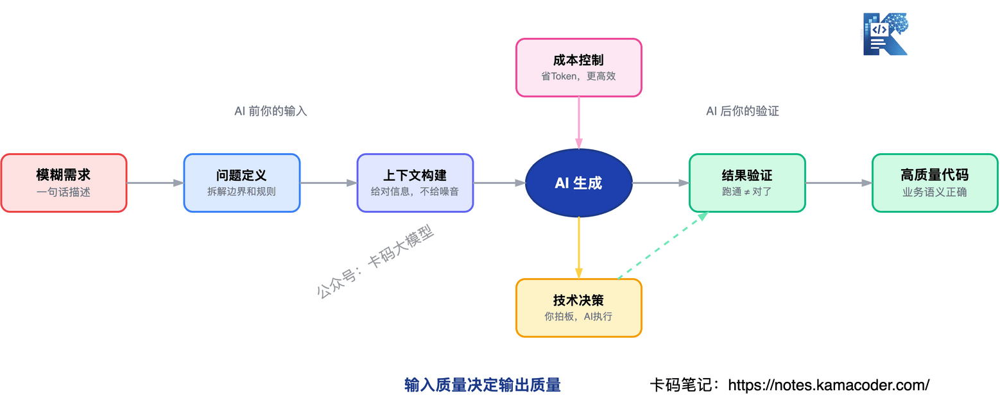
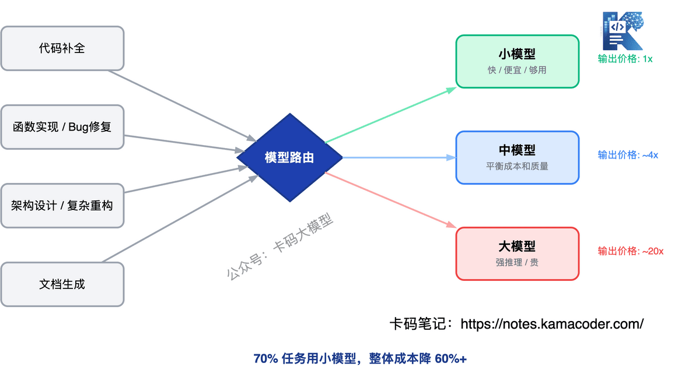
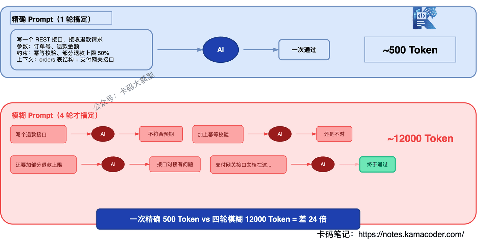
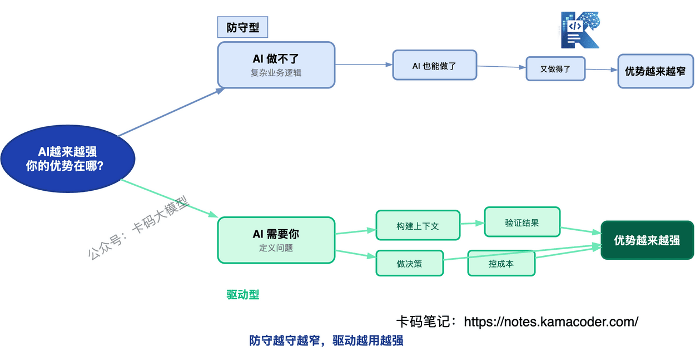

# Vibe Coding大厂面试题汇总：AI编程时代你的优势到底在哪

> 来源: https://notes.kamacoder.com/interview/llm/vibe_coding_interview.html

# `# Vibe Coding大厂面试题汇总：AI编程时代你的优势到底在哪 

现在大厂面试官最喜欢问一个灵魂问题：**在 vibe coding 盛行以及基模越来越强的当今，你觉得你的优势是什么？** 

我估计很多录友都不知道怎么回答。 

或者说，**之前的回答思路已经不够用了**。 

为什么这么说？ 

因为之前的套路是说"AI 做不了复杂业务逻辑""AI 写不了安全代码""AI 处理不了并发"——但说实话，**2026 年了，AI 这些都写得挺好**。 

Claude Code 能写出带完整异常处理的微服务调用，Codex 能处理复杂的状态机逻辑，Cursor 能一次改十几个文件还不乱。 

**继续说"AI 做不了这个"，面试官只会觉得你脱离实际。** 

那你的优势到底在哪？这篇文章重新回答这个问题，并且聚焦面试官真正关心的实操问题——**Token 成本怎么控制、AI 代码怎么管、效果怎么评估**。  

## `# 目录 
  - Vibe Coding 到底是什么？   - AI 越来越强，你的优势到底是什么？

    - 优势一：问题定义能力     - 优势二：上下文构建能力     - 优势三：结果验证能力     - 优势四：技术决策能力     - 优势五：成本控制能力     - 五大优势总结   - AI 编程工具的 Token 成本怎么控制？

    - 策略一：模型路由——什么活用什么模型     - 策略二：上下文管理——别把整个代码库塞进去     - 策略三：Prompt 优化——一次说清楚，别来回改     - 策略四：缓存和复用     - 策略五：评估——哪些任务让 AI 做更贵     - Token 成本控制总结   - 面试高频问题汇总

    - 场景类     - 工程落地类  

## `# 1. Vibe Coding 到底是什么？ 

2025 年 2 月 Andrej Karpathy 提出这个词的时候，定义很明确：**不审查、不理解、直接 Accept AI 生成的代码**。 

| 维度  Vibe Coding  AI 辅助编程 
| 代码生成  AI 生成  AI 生成 
| 代码审查  不看，直接 Accept  逐行审查 
| 报错处理  粘贴给 AI  分析根因再决定 
| 对代码负责  不负责  完全负责 

面试官问你是不是 Vibe Coding，其实是在问一个问题：**你对你 Accept 的代码负不负责？** 

这个定义不用多展开，重点是下面两个问题。  

## `# 2. AI 越来越强，你的优势到底是什么？ 

先承认一个事实：**AI 现在确实写得好**。 

复杂业务逻辑？给它足够的上下文，它能写出符合你公司规则的结算代码。 

安全代码？告诉它要注意什么，它能写出带输入校验和权限检查的代码。 

跨模块调用？把接口文档喂给它，它能生成正确的调用链路。 

性能优化？让它关注性能，它能帮你找出 N+1 查询和内存泄漏。 

所以如果你的回答还是"AI 做不了 XX"，面试官一句话就能怼回来："你给够上下文了吗？" 

**那你的优势到底在哪？不是"AI 做不了什么"，而是"AI 做什么都需要你先做对什么"。** 

### `# 优势一：问题定义能力 

AI 能解决你定义好的问题，但**定义问题本身就是最难的部分**。 

产品经理说"加个退款功能"——这不是需求，这是一句话。真正的需求定义要回答： 
  - 部分退款怎么处理？   - 退款和优惠券的互斥规则是什么？   - 多次退款的幂等性怎么保证？   - 退款超时了怎么自动关闭？ 

这些问题的答案，AI 不知道，产品经理也没说清楚。**是你把一句话变成了可执行的规格，AI 才能写出正确的代码。** 

反过来，如果你自己都没想清楚，AI 写出来的代码一定也是模糊的——你给它一句话，它给你一个"看起来像那么回事"的接口，跑是能跑，但业务逻辑经不起推敲。 

**面试怎么说**："AI 很强，但它需要精确的问题定义。我的优势在于能把模糊的需求拆解成清晰的技术规格——边界条件、异常处理、业务规则，这些 AI 不会主动问你，但不说清楚代码一定写不对。" 

### `# 优势二：上下文构建能力 

**AI 的输出质量，直接取决于你给的上下文质量。** 

同样的需求，两种人用 AI： 
  - A 直接说"写一个退款接口" → AI 凭想象写，大概率不符合你的业务   - B 给了完整的业务规则、数据库表结构、上下游接口文档 → AI 写出来的代码基本能直接用 

差距在哪？不是 AI 的能力差距，是**喂给 AI 的上下文质量**的差距。 

上下文构建能力包括： 
  - **知道给什么**：哪些信息是 AI 必须知道的，哪些是噪音   - **知道不给什么**：塞 10 万行无关代码进上下文，既浪费 Token 又干扰模型   - **知道怎么组织**：先给背景再给需求，和反过来，AI 的生成质量完全不同 

这也是为什么同一个 AI 工具，高手用和新人用效果差 10 倍。不是工具不同，是输入不同。 

关于怎么科学地构建上下文，之前写过一篇 Claude Code 深度解析，里面有专门讲 200K 上下文窗口的管理策略，录友们可以翻翻。 

**面试怎么说**："同样用 Claude Code，不同人产出质量差很多。差别在于上下文构建——我给 AI 的 Prompt 包含完整的业务规则、相关代码片段和边界条件，而不是一句话就让它写。AI 的上限是由你的输入质量决定的。" 

### `# 优势三：结果验证能力 

**代码跑起来了 ≠ 代码对了。** 

AI 生成的代码经常"看着对、跑得通、但语义是错的"。比如： 
  - 退款接口返回成功，但实际是退到了错误的账户   - 权限校验通过了，但用的是错误的角色   - 数据处理完成了，但精度丢失了两位小数 

这些 bug 跑测试不一定能发现，因为**测试是按你的预期写的，而你的预期可能和业务需求有偏差**。 

验证能力不是"跑一下看有没有报错"，而是： 
  - **业务语义验证**：这段代码的行为是否符合业务意图   - **边界验证**：极端情况下的行为是否符合预期   - **回归验证**：这次改动有没有影响其他功能 

特别要注意 AI 的"合理但错误"代码——逻辑通顺、能跑通、但语义和业务需求不一致。这种代码最容易通过 Code Review，因为看起来真的很合理。 

**面试怎么说**："AI 生成的代码我会重点验证业务语义，不是看能不能跑通，而是看行为是否符合业务意图。比如退款接口我会验证退款金额、退款对象、幂等性，这些是测试覆盖不到的，必须人工理解。" 

### `# 优势四：技术决策能力 

AI 能列出方案 A 和方案 B 的 pros/cons，但**拍板选哪个是你决定的**。 

技术决策包括： 
  - **选型决策**：用 Redis 还是 Memcached？用 gRPC 还是 REST？AI 能分析，但你的业务场景只有你知道   - **架构决策**：拆微服务还是单体优先？同步还是异步？短期快还是长期稳？   - **成本决策**：花 3 天重构还是花 3 个月重构？用贵的模型还是便宜的模型？ 

AI 的建议是通用的，你的决策是具体的。**通用建议和具体场景之间，永远需要人来做判断。** 

举个实际例子：AI 会告诉你"高并发场景用缓存"，但不会告诉你**你们团队的缓存之前出过两次线上事故，这次要用就得多加一层降级**。这个判断只能你做。 

**面试怎么说**："AI 能帮我分析方案，但最终的选型决策是我做的。因为决策要考虑的不仅是技术因素，还有团队现状、业务阶段、历史教训——这些 AI 不知道，也不应该由 AI 决定。" 

### `# 优势五：成本控制能力 

这一条在面试里越来越重要，因为**AI 编程不是免费的**。 

一次 Claude Code 的交互，可能消耗 5 万到 20 万 Token。一个项目跑下来，Token 费用可能比工程师工资还高。 

成本控制能力包括： 
  - **知道什么时候用大模型，什么时候用小模型**   - **知道怎么组织上下文才能省 Token**   - **知道怎么写 Prompt 才能减少来回次数**   - **知道哪些任务让 AI 做更贵，自己做更便宜** 

这一点很重要，放在本篇下一节单独说。 

### `# 五大优势总结 

一句话：**AI 的输出质量取决于你的输入质量——定义问题、构建上下文、验证结果、做决策、控成本，这五件事 AI 替代不了你。** 

不是"AI 做不了"，是"AI 做什么都需要你先做对"。 

这两种说法看起来差不多，但逻辑完全不同： 
  - "AI 做不了"的潜台词是：等 AI 也能做了，你就没优势了   - "AI 需要你"的潜台词是：只要 AI 还需要人来驱动，你的优势就在 

**前者是防守型思路，越守越窄。后者是驱动型思路，越用越强。** 

  

## `# 3. AI 编程工具的 Token 成本怎么控制？ 

这个问题面试官越来越爱问，因为这是**团队用 AI 编程最实际的问题**。 

不控制成本，一个月 Token 账单可能比工程师工资还高。控制得太狠，AI 产出质量又下降。**关键是在成本和质量之间找到平衡点。** 

### `# 策略一：模型路由——什么活用什么模型 

不是所有代码都需要最强的模型来写。根据任务复杂度路由到不同模型： 

| 任务类型  推荐模型级别  原因 
| 代码补全、简单修改  小模型  速度快、成本低、够用 
| 函数实现、Bug 修复  中模型  平衡成本和质量 
| 架构设计、复杂重构、代码审查  大模型  需要深度推理 
| 代码解释、文档生成  小模型  不需要强推理 

**成本差距有多大？** 大模型的输出价格是小模型的近 20 倍。如果一个 70% 的任务能用小模型解决，整体成本能降 60% 以上。 

 

当然，模型路由不是让你手动选。Claude Code 内部已经在做这件事——简单补全走轻量模型，复杂推理走主力模型。Claude Code 深度解析 里有讲它的双模型策略。 

但面试官想听的不是"工具自动做了"，而是**你理解为什么这么做**。 

**面试怎么说**："我们团队做了模型路由策略——简单补全用小模型，复杂任务才用大模型。70% 的日常编码任务其实不需要最强模型，这样整体 Token 成本能降 60% 以上。" 

### `# 策略二：上下文管理——别把整个代码库塞进去 

**上下文窗口是 Token 消耗的大头。** 

很多人用 Claude Code 的时候，习惯把整个项目目录打开，让它自己找文件。结果每次交互，模型都要读取大量无关代码，Token 消耗直接翻几倍。 

正确的做法： 
  - **只给相关的代码**：修改用户模块，就不要把支付模块的代码也塞进去   - **用摘要代替全文**：不需要把 500 行的配置文件全给 AI，给关键部分就行   - **按需加载**：先让 AI 看接口定义，需要实现细节时再给具体代码   - **定期清理上下文**：长时间对话会积累大量历史 Token，该开新会话就开新会话 

**实际效果**：只给相关代码 vs 给整个项目，Token 消耗可能差 3-5 倍。 

还有一个容易忽略的点：**AI 读到的无关代码越多，生成质量反而越差**。因为无关信息会干扰模型的注意力，让它关注到不该关注的地方。所以上下文管理不只是省钱，也是在提升质量。 

 

**面试怎么说**："我会主动管理上下文，只给 AI 相关的代码片段而不是整个项目。修改用户模块就只给用户模块的代码和它依赖的接口定义。这样做 Token 消耗能降 3-5 倍，而且 AI 生成质量反而更好——因为无关信息少了，模型不容易被干扰。" 

### `# 策略三：Prompt 优化——一次说清楚，别来回改 

**来回改是最浪费 Token 的。** 

模糊的 Prompt → AI 生成不符合预期 → 再改 Prompt → 再生成 → 还是不对 → 再改…… 

一次说清楚，直接省掉 3-4 轮交互。 

怎么写好 Prompt： 
  - **说清楚目标**：不是"写个接口"，是"写一个 REST 接口，接收退款请求，参数包括订单号和退款金额，需要幂等校验"   - **说清楚约束**：性能要求、安全要求、代码规范   - **说清楚上下文**：相关的数据库表结构、上下游接口   - **给示例**：一个具体的输入输出示例，比 100 字描述更有效 

**成本对比**：一次精确 Prompt 可能 500 Token，四轮模糊 Prompt 可能 12000 Token——差 24 倍。这还没算时间的浪费。 

 

之前写过一篇 Harness Engineering 面试题，核心观点就是 AI 编程的重心正在从 Prompt Engineering 转向 Context Engineering——不是你怎么说，是你给什么信息。录友们可以连着看。 

### `# 策略四：缓存和复用 

相似的问题，不要让 AI 从零生成。 
  - **Prompt 缓存**：相同的 Prompt 前缀，API 层面可以缓存，省掉重复计算的 Token。Anthropic 的 API 已经原生支持了 Prompt Caching，相同前缀的输入可以打到 90% 的缓存命中率   - **代码模板**：常见的 CRUD 接口、表单验证，维护一套模板，AI 只需要填差异部分   - **会话复用**：同一类任务的 Claude Code 会话，可以复用之前的上下文，不要每次从零开始 

**面试怎么说**："我们团队维护了一套代码模板，AI 只需要根据具体需求填充差异部分，而不是每次从零生成。配合 Prompt Caching，相似任务的 Token 消耗能降低 50% 以上。" 

### `# 策略五：评估——哪些任务让 AI 做更贵 

**不是所有任务都适合让 AI 做。** 

有些任务你自己写 10 分钟搞定，让 AI 写要花 20 分钟来回改 Prompt + 审查代码，Token 费用还不少。这种情况下，直接自己写才是最优解。 

适合让 AI 做的： 
  - 重复性高、模式固定的代码（CRUD、样板代码）   - 你知道要什么但手写太慢的代码   - 需要快速探索多种方案的场景   - 不熟悉的语言或框架的入门代码 

不适合让 AI 做的： 
  - 改一行配置就能解决的小修改   - 你已经非常熟悉的代码区域，手写比解释更快   - 需要深度理解业务上下文的决策型代码   - 已经有精确模板、复制粘贴比生成更快的情况 

举个日常开发的例子：线上报了一个 NullPointerException，你翻日志定位到是 `OrderService.java` 第 127 行，`user.getAddress()` 没做空判断。你加一行 `if (user.getAddress() != null)` 10 秒搞定。 

但如果你交给 AI？ 

很多录友是这样的，具体哪里报错也不看，上来就粘贴报错信息给AI，让AI去修复。 

等AI读报错信息，再去读文件，又要分析上下文，再生成修复代码，AI还有自己的一套校验机制。 

这一套流程下来，至少10k token就花出去了。 文件如果大一点，就是几十k token 

然后你还得审查它是不是改对了地方、有没有多改别的。 

前后 3 分钟，Token 消耗可能几万。**10 秒的手工活，变成了 3 分钟的 AI 交互**，还更贵。 

这就是"让 AI 做更贵"的典型场景：**你已经知道问题在哪、怎么改，这时候直接改就是最优解。** 

### `# Token 成本控制总结 

| 策略  核心思路  预期效果 
| 模型路由  简单任务用小模型  成本降 60%+ 
| 上下文管理  只给相关代码  消耗降 3-5 倍 
| Prompt 优化  一次说清楚  往返次数降 3-4 倍 
| 缓存复用  不从零开始  消耗降 50%+ 
| 任务评估  不该用 AI 的就别用  视场景  

## `# 4. 面试高频问题汇总 

### `# 场景类 

**Q：AI 越来越强，你的优势是什么？** 

差的回答："AI 做不了复杂业务逻辑和安全代码。" 

好的回答："AI 确实越来越强，很多之前说 AI 做不了的场景现在都做得不错。但 AI 的输出质量直接取决于人的输入质量——定义问题、构建上下文、验证结果、做决策、控成本，这五件事 AI 替代不了我。**我的优势不是比 AI 写得好，是让 AI 写得更好。**" 

**Q：你负责的项目里，哪些让 AI 写，哪些自己写？** 

判断标准不是"AI 做得了还是做不了"，而是**"这段代码出 bug 的代价有多大"和"让 AI 写和手写哪个综合成本更低"**。 

代价大、AI 写更贵的：自己写或 AI 写但严格审查。代价小、AI 写更便宜的：让 AI 加速。 

**Q：你怎么审查 AI 生成的代码？** 

重点查三样：**业务语义**（代码行为是否符合业务意图）、**安全风险**（输入校验、权限控制、敏感数据）、**工程性**（性能、可维护性、规范一致性）。 

特别注意 AI 的"合理但错误"代码——逻辑通顺、能跑通、但语义和业务需求不一致。这种代码最容易漏过 Review。 

**Q：AI 生成的代码出了线上 bug，你怎么处理？** 

三步走：**先止血，再定因，最后补流程**。 

止血：回滚或降级，先让线上恢复，不管是不是 AI 写的代码，处理方式一样。 

定因：看监控确认影响范围，看日志追踪调用链路，定位到具体的问题代码。如果是 AI 生成的代码，还要想清楚**审查的时候为什么没拦住**——是安全没审到，还是边界条件没覆盖，还是业务语义理解有偏差。 

补流程：补充测试用例、加强审查重点、甚至调整哪些场景允许 AI 生成。**一个 bug 不可怕，同类 bug 再出一次才可怕。** 

**Q：AI 写的代码上线出问题了，让 AI 修，结果 AI 也修不好，你怎么兜底？** 

这个问题很刁钻，但确实会发生。AI 自己写的代码，自己修不好——可能是因为它对线上环境没有感知，也可能是因为问题根因涉及多个模块的交互，AI 的上下文窗口里装不下全局信息。 

兜底的关键是**你不能等 AI 来救你，你得自己能接手**： 
  - **先止血**：不管 AI 能不能修，先回滚到上一个稳定版本，线上用户等不了   - **自己排查**：看日志、看监控、看链路追踪，定位根因。这时候你之前审查 AI 代码积累的理解就派上用场了——如果你审查的时候理解了逻辑，排查速度会快很多；如果你审查的时候是"看着没问题就过了"，那排查起来跟看别人的代码没区别   - **修复上线**：自己改代码，走正常的测试和发布流程   - **复盘**：为什么 AI 修不好？是上下文不够，还是问题超出它的能力范围？这次复盘的结论，决定下次类似问题还要不要交给 AI 

**说到底，AI 修不了的时候，你得能修。这是底线。** 

### `# 工程落地类 

**Q：AI 编程工具的 Token 成本怎么控制？** 

五个策略：模型路由（70% 任务用小模型）、上下文管理（只给相关代码）、Prompt 优化（一次说清楚）、缓存复用（维护模板 + Prompt Caching）、任务评估（不该用 AI 的就别用）。核心是在成本和质量之间找平衡，不是越便宜越好，也不是越贵越好。 

**Q：你们团队怎么管理 AI 生成的代码？** 

四件事：**代码归属**（谁 Accept 谁负责）、**审查流程**（AI 代码走和人工代码一样的 Review）、**监控指标**（追踪 AI 代码的 Bug 率和漏洞率）、**持续优化**（根据数据调整 AI 使用策略）。 

**Q：用 AI 写代码，怎么保证不泄露公司代码？** 

很多公司，还没有自己的私有化Agent，那么业务开发就面临代码安全问题。 

AI 编程工具都有代码上传的行为——你的代码会发送到模型的服务端做推理，虽然厂商说不会用来训练，但**合规部门不一定买账**。 

实际操作： 
  - **敏感代码不上传**：核心算法、密钥管理、交易策略这些代码，不在 AI 工具里打开，更不让 AI 生成和审查   - **用企业版而非个人版**：企业版有数据隔离协议，代码不会被用于训练，合规风险小得多   - **配置 .gitignore 和 .claudeignore**：把敏感目录和文件排除在 AI 的访问范围之外，防止工具自动读取不该读的代码   - **团队统一规范**：哪些项目可以用 AI、哪些不能，写进开发规范，新人入职就知道边界 

**面试怎么说**："我们区分了敏感项目和非敏感项目，敏感项目不用 AI 工具，非敏感项目用企业版。同时配置了 .claudeignore 排除敏感文件，确保 AI 不会读到不该读的代码。"  

## `# 写在最后 

回到开头的灵魂问题：**在 vibe coding 盛行以及基模越来越强的当今，你觉得你的优势是什么？** 

答案是：**AI 做什么都需要你先做对——定义问题、构建上下文、验证结果、做决策、控成本。** 

不是"AI 做不了"，是"AI 需要你"。 

"AI 做不了"是防守，越守越窄。 

"AI 需要你"是驱动，越用越强。 

 

**你的优势不是比 AI 写得好，是让 AI 写得更好。** 

至于怎么把"让 AI 写得更好"落到工程纪律上——Git 恢复点、数据库备份、模块拆分、线上回滚，可以接着看 Vibe Coding 避坑指南；为什么要从模糊 Prompt 走向规格、计划、任务和验证，看 Spec-Driven Development 规约驱动开发详解；OpenSpec、Review 闭环和 QA 交付，看 AI 增强开发三件套面试详解；想搞懂 AI 编程工具底层原理，看 Claude Code 大厂面试题汇总。 

加油
