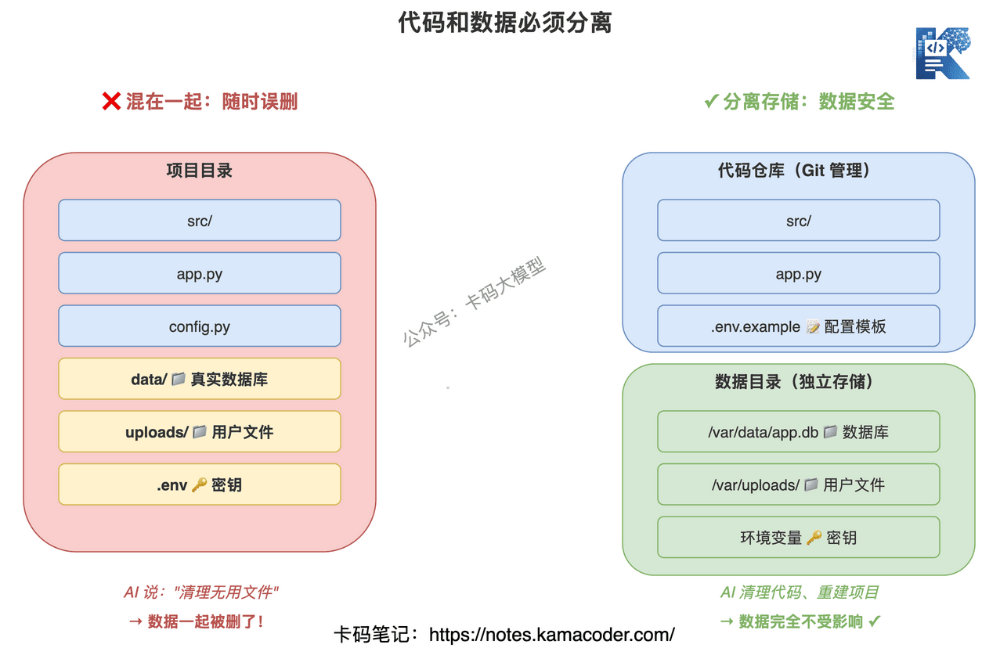
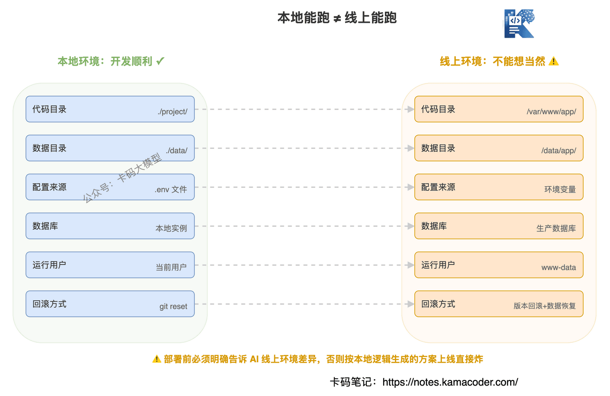

# Vibe Coding避坑指南：Git提交、数据库备份、模块拆分、线上回滚怎么做

> 来源: https://notes.kamacoder.com/interview/llm/vibe_coding_backup_engineering.html

# `# Vibe Coding避坑指南：Git提交、数据库备份、模块拆分、线上回滚怎么做 

前面我们讲过 Vibe Coding，也讲过 AI 增强开发三件套。 

这篇不讲概念，讲卡哥自己在 Vibe Coding 里提炼出来的经验之谈。 

很多录友一聊到 Vibe Coding，就觉得：“这有啥难的，不就是让 AI 干活吗？” 

真这么想，项目迟早会被 AI 改成一坨。 

之前网上盛传什么某歌手，写出APP，代码质量很高，上线了之类的。 

(当然这位歌手一定是对着AI自己口喷了几句，但大部分一定是专业人员辅助的） 

内行人，一看就是炒作，没有编程功底的人，Vibe Coding 只能做一个小demo，稍稍复杂的功能再涉及到上线，那就是灾难的开始。 

Vibe Coding 不是把需求丢给 AI，然后自己等结果。**Vibe Coding 真正难的地方，是你要知道什么时候让 AI 干，怎么让 AI 干，干错了怎么退回来。** 

AI 写代码很快，但写得快不代表工程质量高。本地能跑，不代表线上能跑。代码能恢复，不代表数据也能恢复。 

今天这篇，就讲几个最容易翻车的点。 

**本篇内容：** 
  - 一、不会 Git，别让 AI 大规模改代码   - 二、数据库不要和代码混在一起   - 三、备份不是上线前才想   - 四、不要让 AI 一口气完成整个项目   - 五、本地能跑，不代表线上能跑   - 六、数据库操作必须默认高危   - 七、给 AI 任务时，要写"不能做什么"   - 八、先沉淀文档，再开发功能   - 九、面试怎么讲这段经历   - 十、最后给录友一句话 

## `# 一、不会 Git，别让 AI 大规模改代码 

先说最重要的：**没有 Git 提交点，就不要让 AI 大规模改项目。** 

很多录友是这么用 AI 的： 

“帮我加登录。” 

“再帮我加会员。” 

“再帮我优化页面。” 

“再帮我整理一下目录。” 

AI 一路改，文件越改越多。最后项目跑不起来了，你想回到“刚才还能跑的状态”，发现回不去了。 

因为你根本没有提交。 

这时候 AI 也救不了你，它只能根据当前乱掉的代码继续猜。 

Git 不是装成熟。Git 是你和 AI 协作的安全绳。 

最基本要做到： 
  - 每完成一个小功能，提交一次。   - 每次让 AI 大改前，先看 `git status`。   - 不要在一堆未提交改动上继续叠需求。   - AI 改完后，用 `git diff` 看它到底动了什么。   - 验证没问题，再提交。 

**没有 Git，Vibe Coding 就不是开发，是赌命。** 

AI 干活干一半，方向错了，你必须能退。退不回来，后面所有补救都是硬扛。 


 

## `# 二、数据库不要和代码混在一起 

第二个坑，比代码更危险：数据库备份。 

很多小项目一开始图省事，把 SQLite、上传文件、导出文件、日志都放在项目目录里。看起来方便，但让 AI 整理目录、重建项目、部署覆盖的时候，就容易出事故。 

比如你让 AI： 

“帮我清理一下无用文件。” 

“帮我重新初始化项目。” 

“帮我把代码部署到服务器。” 

AI 可能不知道哪些是代码，哪些是真实数据。它把 `data/`、`db/`、`uploads/` 当普通目录处理，数据就没了。 

代码没了可以从 Git 找。数据没了，很多时候是真没了。 

所以项目一开始就要定规矩： 
  - 代码目录只放代码、配置模板、迁移脚本。   - 数据库、上传文件、日志放到独立数据目录。   - `.gitignore` 明确排除真实数据文件。   - 仓库里只放 `.env.example`，不要提交真实 `.env`。   - 测试数据和生产数据分开。 

**数据库不是代码的一部分，数据库是线上资产。** 

你不能让 AI 像改组件一样随便动数据库。 


 

## `# 三、备份不是上线前才想 

很多录友对备份的理解是：“上线前备份一下。” 

晚了。 

备份应该在设计初期就考虑。因为备份会影响目录结构、部署方式、权限设计、恢复流程。 

你一开始把代码、数据库、上传文件全混在一起，后面再补备份，就会很别扭。 

设计项目时，先问三个问题： 
  - 哪些东西不能丢？   - 丢了以后从哪里恢复？   - 恢复要多久？ 

比如用户表、订单表、支付记录、上传文件、配置文件、业务日志，这些都要有恢复思路。 

对应的工程动作也要提前准备： 
  - 数据库定时备份。   - 高风险操作前手动备份。   - 迁移脚本要有回滚方案。   - 上传文件单独存储。   - 生产配置不要跟代码一起覆盖。 

**备份不是怕你写错代码，备份是承认线上一定会出错。** 

成熟工程师和新手的区别，不是不犯错，是出错后能回来。 

## `# 四、不要让 AI 一口气完成整个项目 

Vibe Coding 新手最爱说一句话：“帮我做一个完整系统。” 

包含登录、文章、评论、后台、上传、搜索、部署。 

AI 会给你一个完整项目。目录有了，页面有了，接口也有了。但一看细节，通常都是问题： 
  - 权限边界不清楚   - 接口错误处理很随意   - 数据库设计临时拼出来   - 前端状态到处传   - 后台权限形同虚设   - 测试基本没有   - 部署配置和本地配置混在一起 

这就是“一坨”的来源。 

不是 AI 不会写。是你让它在一个超大上下文里同时做太多决策。 

正确做法是小步闭环： 
  - 先做登录注册，跑通后提交。   - 再做文章 CRUD，跑通后提交。   - 再做评论，跑通后提交。   - 再做上传和搜索。   - 最后再做部署。 

每一步都要告诉 AI： 
  - 这次只改哪些文件。   - 哪些模块不要动。   - 怎么验证完成。   - 失败了怎么回退。 

**AI 可以帮你写模块，但不能替你做架构拆分。** 

架构拆分是人的责任。 


 

## `# 五、本地能跑，不代表线上能跑 

第四个坑，是线上线下环境差异。 

这类事故特别常见。本地路径是 `./data/app.db`，线上路径可能是 `/var/www/app/data/app.db`。本地配置读 `.env`，线上配置可能来自环境变量。本地运行用户是你自己，线上运行用户可能是 `www-data` 或 `app`。 

AI 如果只看本地项目，它默认会按本地逻辑生成方案。 

结果就是：本地没问题，上线直接炸。 

所以涉及上线时，先把环境差异写给 AI： 

| 项目  本地  线上 
| 代码目录  项目根目录  `/var/www/xxx` 
| 数据目录  `./data`  独立挂载目录 
| 配置来源  `.env`  环境变量或配置中心 
| 数据库  本地实例  生产数据库 
| 上传文件  本地目录  独立存储 
| 运行用户  当前用户  服务专用用户 
| 回滚方式  Git 回退  发布版本回滚 + 数据恢复 

**线上事故，很多不是代码逻辑错，而是环境假设错。** 

环境不说清楚，AI 只能猜。 


 

## `# 六、数据库操作必须默认高危 

只要 AI 要动数据库，就先停一下。 

建表、删表、改字段、导入导出、数据清洗、初始化脚本，都算高危。 

动手前必须问三个问题： 
  - 有没有备份？   - 能不能回滚？   - 操作的是测试库还是生产库？ 

没有备份，不做。不能回滚，要谨慎。分不清环境，绝对不能执行。 

尤其不要随便对 AI 说：“帮我重置数据库。” 

这句话太危险了。 

重置哪个库？保留哪些表？有没有备份？是不是生产环境？ 

这些没写清楚，AI 只能按字面执行。 

**数据库操作不要让 AI 直接干，先让它生成脚本和风险说明，再人工确认。** 

## `# 七、给 AI 任务时，要写“不能做什么” 

很多录友只会写目标： 

“帮我修复登录问题。” 

“帮我优化项目结构。” 

“帮我上线部署。” 

这不够。你还要写边界： 
  - 只允许修改登录相关文件。   - 不要改数据库结构。   - 不要删除上传文件。   - 不要修改生产配置。   - 不要执行迁移命令，只生成脚本给我审核。   - 先给计划，等我确认后再改代码。 

AI 的默认倾向是完成任务。如果你只说“修好”，它可能会为了修好扩大改动范围。 

而工程协作最怕的就是改动范围失控。 

**让 AI 干活，不只是告诉它目标，还要告诉它边界。** 

## `# 八、先沉淀文档，再开发功能 

很多录友用 AI 开发时，从来不写文档。 

需求来了，直接让 AI 开始改代码。改完能跑就算完成。 

这样干一个月，项目就变成黑盒了。你自己都不知道这个功能是怎么实现的，换个 AI 工具更是抓瞎。 

**正确流程是：先让 AI 生成开发文档，扫一遍没问题，再让 AI 去写代码。** 

比如你要加支付功能，先让 AI 写一份技术文档： 
  - 支付流程：用户下单 → 调起支付 → 回调确认 → 更新订单状态   - 数据库表设计：订单表、支付记录表、字段说明   - 接口设计：创建订单、发起支付、支付回调、查询订单   - 异常处理：超时、重复支付、金额校验   - 安全措施：签名验证、幂等性、敏感信息加密 

文档写完后，你先看一遍。流程合理吗？表设计有坑吗？安全措施到位吗？ 

确认没问题，再让 AI 按文档去实现。 

功能开发完成后，还要让 AI 更新文档： 
  - 实际表结构（可能和设计有微调）   - 实际接口路径和参数   - 已知问题和待优化点   - 部署注意事项 

**其实文档不是给开发人员看的，是给下一个接手这个项目的 AI 看的。** 

你今天用 Claude Code 开发，明天可能换 Cursor，后天可能换 Codex。如果没有文档，每次切换工具都要重新理解项目。有了文档，切换成本直线下降。 

更重要的是，文档让你保持对项目的控制权。 

你不能只知道"这个功能 AI 帮我做的"，你得知道"这个功能是怎么做的、为什么这么做、有哪些坑"。 

具体落地方法： 
  - 项目根目录建 `docs/` 目录，按模块分文档：`docs/auth.md`、`docs/payment.md`、`docs/upload.md`   - 在 `CLAUDE.md` 里写文档映射规则：

```
## 文档映射
- 开发登录相关功能时，先读 docs/auth.md
- 开发支付相关功能时，先读 docs/payment.md
- 开发上传相关功能时，先读 docs/upload.md

```

    - 每次开发新功能前，先让 AI 补充对应文档，确认后再开发   - 功能开发完成后，让 AI 同步更新文档（实际实现可能和设计有出入） 

这样做的好处： 
  - AI 开发前有明确蓝图，不会乱写   - 你可以先审查设计，再审查代码，分层把关   - 切换 AI 工具时，新工具直接读文档就能接手   - 多人协作时，文档是统一理解的基础   - 面试时，你能清晰讲出每个模块的设计思路 

**Vibe Coding 不是让 AI 狂写代码，是让 AI 帮你把工程流程走完整。** 

没有文档的项目，就是技术债的温床。 

## `# 九、面试怎么讲这段经历 

如果面试官问：“你怎么用 Vibe Coding？踩过什么坑？” 

不要只说：“我用 AI 提高了效率。” 

太浅了。 

可以这样说： 

“我刚开始用 Vibe Coding 时，发现最大的问题不是 AI 写不出来，而是恢复点不足。AI 一次改太多文件，如果没有 Git 小步提交，后面出问题很难回退。所以我现在会按模块拆任务，每个功能一个闭环，先让 AI 出计划，再限制改动范围，改完看 diff、验证、提交。” 

再补一句： 

“另一个坑是数据和代码边界。小项目很容易把 SQLite、上传文件、配置文件放在项目目录，部署覆盖时可能误伤真实数据。所以我会把代码目录和数据目录隔离，仓库只放配置模板，真实数据库和上传文件单独存储。涉及数据库操作时，先备份，只让 AI 生成脚本，不直接执行生产动作。” 

最后说上线： 

“本地方案不能直接等价于线上方案。线上路径、运行用户、配置来源、数据库实例都可能不同，所以部署前我会先列出本地和线上环境差异，再让 AI 基于差异生成方案。” 

再加一句文档： 

“还有一个经验是文档先行。我现在开发新功能前，会先让 AI 生成技术文档，包括流程设计、表结构、接口定义、异常处理。我先审查文档，确认没问题再让 AI 写代码。功能完成后再让 AI 更新文档，记录实际实现。这样切换 AI 工具时，新工具直接读文档就能接手，不用每次都重新理解项目。” 

这段回答比”我会用 Cursor”强太多。 

因为它体现的是工程判断力。 

## `# 十、最后 

Vibe Coding 可以用，而且要用。但别裸奔。 

**Git 是代码恢复点，备份是数据恢复点，模块拆分是复杂度边界，环境核对是上线安全线。** 

你把这些东西建起来，AI 是效率工具。 

你不建这些东西，AI 就会更快地把项目改乱。 

先把安全绳系好，再让 AI 加速。
