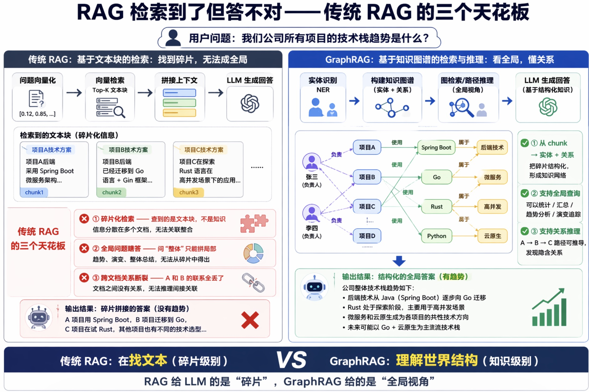
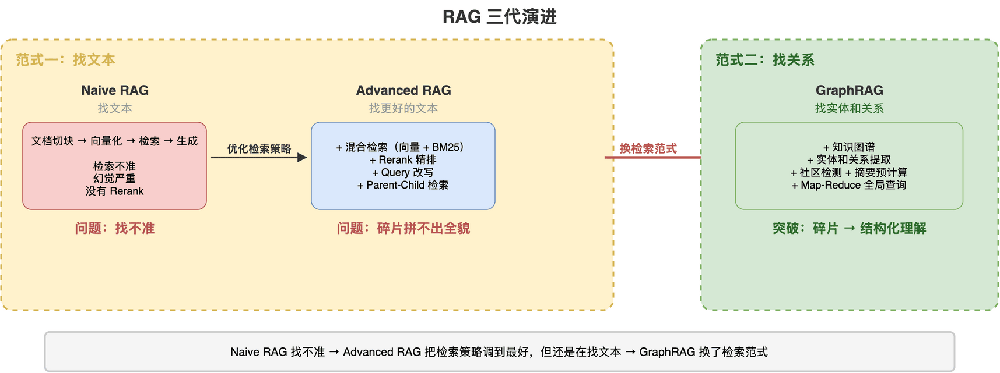
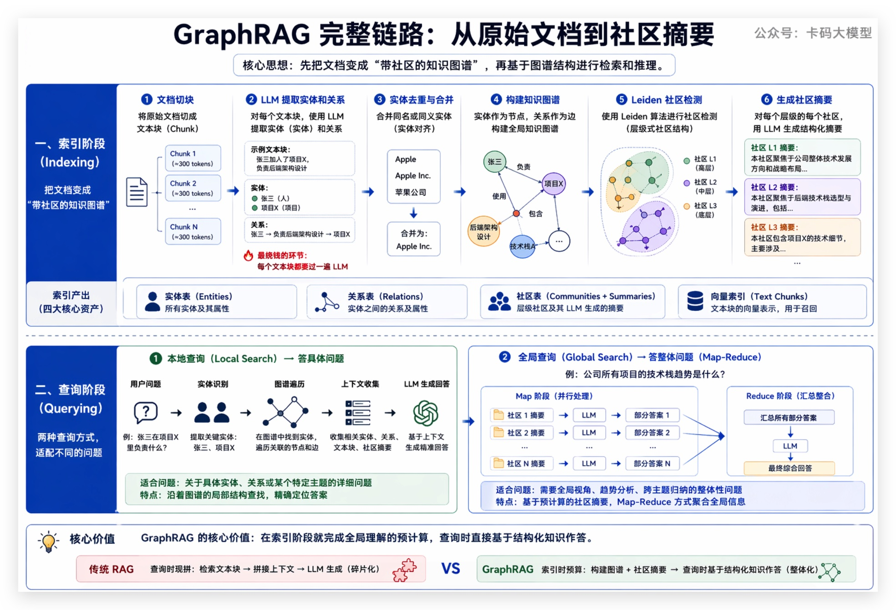

# GraphRAG与LightRAG大厂面试题汇总：从RAG到知识图谱检索

> 来源: https://notes.kamacoder.com/interview/llm/graphrag_interview.html

# `# GraphRAG与LightRAG大厂面试题汇总：从RAG到知识图谱检索 

之前写了讲透RAG，把向量检索、混合检索、Rerank、幻觉处理这些讲透了。 

很多录友看完后反馈：传统 RAG 的那些优化手段确实好用，但有一类问题怎么优化都答不好—— 

问"某某文档里提到的某个具体技术细节"，RAG 没问题；但问"整个知识库的核心主题是什么""这几个概念之间有什么关联"，RAG 就开始瞎拼碎片了。 

这不是调参能解决的问题，是**传统 RAG 的结构性天花板**。 

后来面试官也追上来了："你们 RAG 检索到了但答不对，怎么办？""GraphRAG 了解吗？""LightRAG 和 GraphRAG 区别？"一问一个不吱声。 

先避开一个最近很容易混淆的词：这里的 GraphRAG 说的是**知识图谱检索**，不是 Agent 的控制图。后者讲“任务下一步怎么走”，详见 Graph Engineering 与 Agent 图编排；本篇讲“知识里的实体关系怎么检索”。 

**传统 RAG 到底卡在哪？GraphRAG 怎么突破的？LightRAG 又是什么？两者怎么选**？这篇把 RAG 的下一代演进从头讲透。 

读完这篇，你会搞清楚：传统 RAG 的天花板在哪、GraphRAG 的完整链路怎么跑、GraphRAG 落地踩什么坑、LightRAG 怎么补位、实战场景怎么选。这些搞明白，面试官追问到多深都不怕。  

## `# 目录 
  - `RAG 检索到了但答不对——传统 RAG 的三个天花板   - `RAG 的演进：从"找文本"到"找关系"   - `GraphRAG 的完整链路：从原始文档到社区摘要   - `GraphRAG 落地踩的三个坑   - `LightRAG：更轻、更快、增量友好   - `GraphRAG 和 LightRAG 到底怎么选   - `大厂真实面试追问汇总  

## `# 1. RAG 检索到了但答不对——传统 RAG 的三个天花板 

面试官一般这么问："你们 RAG 系统有没有遇到检索到了但答不对的情况？什么类型的问题答不好？"或者"RAG 检索到了正确信息，但生成的回答还是拼凑感很强，你怎么理解这个问题？" 

### `# 一个例子说清楚 RAG 撞墙在哪 

假设你有一个公司内部知识库，里面全是项目文档、技术方案、会议纪要。有人问了一个问题： 

**"我们公司所有项目的技术栈趋势是什么？"** 

传统 RAG 怎么答？它把问题转成向量，去向量库里找最相似的文本块。找到的是一堆零散的片段："项目 A 用了 Spring Boot""项目 B 迁移到了 Go""项目 C 在试 Rust"……然后把这些片段丢给 LLM 拼一个回答。 

拼出来的是一堆事实的堆砌，不是"趋势"。因为你根本没有一个视角能把所有项目的全貌看清楚，LLM 拿到的就是碎片，它再怎么聪明也只能拼碎片。 

这不是 RAG 的 bug，是**向量检索的本质限制**。 

### `# 传统 RAG 的三个天花板 

**① 碎片化检索——查到的是文本块，不是知识** 

传统 RAG 把文档切成 chunk，每个 chunk 独立变成向量。检索的时候，你拿到的是"和问题最相似的文本块"。但很多问题的答案不是一个文本块能覆盖的，它需要把多个文本块里的信息关联起来。 

比如"张三和李四在哪个项目上有合作"，这个信息可能分散在三个文档里——文档 1 提到张三负责项目 X，文档 2 提到李四参与了项目 X，文档 3 提到项目 X 的具体内容。传统 RAG 最多能捞到其中一个，很难同时把三个都捞出来并关联上。 

**② 全局问题瞎答——问"整体"只能拼局部** 

像"核心技术主题有哪些""整体技术路线怎么演变的"这种全局性问题，需要的是**对整个知识库的理解**，而不是几个相似的文本块。 

上篇讲过 Rerank 和混合检索能提升检索精度，但它们优化的是"找更相似的文本块"，不是"把碎片拼成全貌"。你把 Top-5 变成 Top-20，拿到的还是碎片，只是碎片更多了。 

**③ 跨文档关系断裂——A 和 B 的联系全丢了** 

"公司 A 收购了公司 B"在文档 1 里，"公司 B 和公司 C 有合作"在文档 2 里。那公司 A 和公司 C 之间有没有间接关系？传统 RAG 答不了——因为每个 chunk 是独立 embedding 的，chunk 之间没有"关系"这个概念。 

### `# 这不是调参能解决的 

讲透RAG讲的混合检索、Rerank、Query 改写，都是在"找更好的文本块"。但有些问题需要的不是更好的文本块，是**实体之间的关系**和**全局的结构性理解**。 

这才是 GraphRAG 要解决的问题。 


  

## `# 2. RAG 的演进：从"找文本"到"找关系" 

面试官会问："GraphRAG 和传统 RAG 本质区别是什么？RAG 这条线是怎么演进过来的？" 

### `# 三代 RAG 的演进路线 

要理解 GraphRAG 为什么出现，得先看 RAG 这条线是怎么一步步走过来的。 

**Naive RAG**——最原始的 RAG：文档切块 → 向量化 → 检索 → 塞给 LLM 生成。问题很多：检索不准、幻觉严重、没有 Rerank。讲透RAG讲的很多优化手段，在 Naive RAG 里都没有。 

**Advanced RAG**——在讲透RAG里详细讲过的那些优化：混合检索补上关键词匹配的短板、Rerank 做精排提准、Query 改写对付模糊问题、Parent-Child 检索兼顾精度和上下文。这些优化确实把"找文本块"这件事做到了极致。 

**GraphRAG**——换了一条路：不再只找文本块，而是先建一个知识图谱，把实体和关系都结构化地存下来，检索时走图谱找关系。**从"找文本"变成了"找关系"。** 

演进逻辑特别清晰：**Naive RAG 的问题是"找不准"→ Advanced RAG 把检索策略调到最好 → 但有些问题不是找文本块能解决的 → GraphRAG 换了检索范式。** 


 

### `# 一句话定位 GraphRAG 

**给 RAG 装上知识图谱，让检索从"找文本块"变成"找实体和关系"。** 

传统 RAG 检索的是"和问题相似的文本"，GraphRAG 检索的是"和问题相关的实体、关系、社区"。前者是局部匹配，后者是结构化理解。  

## `# 3. GraphRAG 的完整链路：从原始文档到社区摘要 

面试官会问："GraphRAG 的索引阶段是怎么工作的？查询阶段有几种方式？" 

### `# GraphRAG 是谁做的？ 

微软研究院，2024 年 4 月公开，核心团队是 Darren Edge 等人。论文标题叫《From Local to Global: A Graph RAG Approach to Query-Focused Summarization》。开源在 GitHub 上，2024 年底已经在 Azure 上正式商用。 

微软做这个的动机很直接：他们试了很多传统 RAG 的优化，发现全局性问题怎么都答不好。于是换了个思路——与其优化检索策略，不如换一种知识组织方式。 

### `# 索引阶段：把文档变成"带社区的知识图谱" 

整个索引阶段分六步： 

**第一步：文档切块**。和传统 RAG 一样，把原始文档切成文本块（默认约 300 token，带 overlap）。 

**第二步：LLM 提取实体和关系**。每个文本块送给 LLM，让 LLM 识别出里面的实体（人、组织、地点、事件、概念等）和关系（谁做了什么、谁和谁什么关系）。**这一步是整个流程最烧钱的地方——每个文本块都要过一遍 LLM**。 

```
文本块：["张三加入了项目X，负责后端架构设计"]
        ↓ LLM提取
实体：[张三(人), 项目X(项目)]
关系：[张三 → 负责后端架构设计 → 项目X]

```

 

**第三步：实体去重与合并**。同一个实体在不同文档里可能出现多次，"Apple"和"Apple Inc."是同一个实体，得合并成一个节点。 

**第四步：构建知识图谱**。所有实体变成节点，关系变成边。至此，你的文本语料变成了一个结构化的图。 

**第五步：Leiden 社区检测**。用 Leiden 算法（Louvain 的改进版）对图谱做社区划分，找出紧密连接的实体群。Leiden 会产生**层级式的社区结构**——底层是小社区（几个紧密关联的实体），上层是社区之社区，最顶层是整个图。 

**第六步：生成社区摘要**。对每个层级的每个社区，用 LLM 生成一份结构化摘要（community report），描述这个社区里的关键实体、核心关系、主要主题。 

索引阶段最终产出四个东西：实体表、关系表、社区表（含摘要）、文本块的向量索引。 

### `# 查询阶段：本地查询 vs 全局查询 

GraphRAG 提供两种查询方式，对应两类完全不同的问题： 

**本地查询（Local Search）**——答具体问题 

从用户问题里提取关键实体 → 在图谱里找到对应节点 → 沿着边遍历关联的实体、关系、文本块、所在社区的摘要 → 把这些上下文喂给 LLM 生成回答。 

适合问："张三在项目 X 里负责什么？"——沿着实体"张三"和"项目X"在图上走一圈就能答。 

**全局查询（Global Search）**——答整体问题 

这是 GraphRAG 的杀手锏，用 Map-Reduce 方式回答全局性问题： 
  - **Map 阶段**：把某个层级所有社区的摘要分成若干组，每组摘要 + 用户问题送给 LLM，让 LLM 生成一个"部分答案"   - **Reduce 阶段**：把所有部分答案汇总，再送给 LLM 生成最终的综合回答 

层级可以调：选低层级社区 → 答案更细致；选高层级社区 → 答案更概括。 

适合问："公司所有项目的技术栈趋势是什么？"——每个社区摘要已经预计算好了局部主题，Map-Reduce 再把它们综合成全局答案。 

### `# 用开头讲的例子再走一遍 

回到那个问题："公司所有项目的技术栈趋势是什么？" 

**传统 RAG**：检索几个提到技术栈的文本块 → LLM 拼碎片 → 答案是零散事实的堆砌。 

**GraphRAG**：索引阶段已经把所有项目的技术实体和关系提取到了图谱里，每个社区的摘要已经预计算了局部技术主题 → 全局查询走 Map-Reduce 把所有社区摘要综合 → 答案是有结构、有层次的趋势总结。 

**这就是 GraphRAG 的核心价值：它不是在查询时现拼，而是在索引阶段就把全局理解预先算好了。** 


  

## `# 4. GraphRAG 落地踩的三个坑 

面试官会问："GraphRAG 这么好，你们落地遇到什么问题？" 

概念漂亮是一回事，落地是另一回事。GraphRAG 真正的难度不在理论，在这些具体的坑里。 

### `# 坑一：建图太贵——token 烧钱、索引慢 

索引阶段每个文本块都要过一遍 LLM 提取实体和关系，然后每个社区还要过一遍 LLM 生成摘要。这意味着你原始文档有多少 token，索引阶段的 token 消耗至少是 2-5 倍。 

具体数字：100 万 token 的原始文档，索引阶段可能消耗 200-500 万 token。而且不是钱花完就行的，索引时间也长——百万级文档的索引可能要跑好几个小时。 

对比传统 RAG：只需要 Embedding 一次，几乎不花 LLM token。GraphRAG 的索引成本可能是传统 RAG 的 **10 倍以上**。 

### `# 坑二：增量更新难——新增文档，图要重建吗？ 

这是 GraphRAG 最头疼的问题。 

知识库不可能一成不变，每天都有新文档进来。但 GraphRAG 的社区结构是**全局性的**——新增一批实体和关系进去，整个图的社区边界可能全变了。原来 A 和 B 是同一个社区，加了新实体后可能被拆开；原来 C 和 D 不在一个社区，加了新关系后可能合并。 

这意味着：**新增 10% 的文档，可能需要重跑 30-50% 的索引流程**（重新做社区检测、重新生成社区摘要）。 


 

微软在 2024 年 10 月推出了 DRIFT 搜索模式（Dynamic Reasoning and Inference with Flexible Traversal），这是本地查询和全局查询之外的**第三种查询方式**——先用社区摘要做全局预判，再沿着图谱做局部深挖，在成本和深度之间找平衡。 

但这仍然没有解决增量更新的问题——DRIFT 改进的是查询策略，不是索引策略。新增文档后社区结构变了，还是得重建。 

### `# 坑三：社区粒度难定——太粗丢细节，太细则爆炸 

Leiden 算法会产生多层级的社区结构，但到底用哪一层做查询，没有万能答案。 

层级太高（社区太大）→ 每个社区涵盖太多实体，摘要太笼统，细节丢光。层级太低（社区太小）→ 社区数量爆炸，Map-Reduce 时要处理几百上千个社区摘要，token 成本飙升，延迟也跟着涨。 

实际操作中，这个层级得根据你的数据量和查询需求反复调试。没有一个公式能直接算出来。 

### `# 三个坑的本质 

| 坑  本质 
| 建图太贵  用 LLM 做结构化提取，成本是 Embedding 的 10 倍+ 
| 增量更新难  社区是全局结构，局部变更会引发全局调整 
| 粒度难定  层级选择是精确性和成本之间的权衡，没有银弹 

这三个坑有一个共同根源：**GraphRAG 用了"全局预计算"的思路**——先花大成本把整个知识库的结构理解预先算好，查询时直接用。这个思路答全局性问题确实强，但代价就是贵、重、不灵活。 

LightRAG 就是从这个矛盾里长出来的。  

## `# 5. LightRAG：更轻、更快、增量友好 

面试官会问："LightRAG 是什么？和 GraphRAG 有什么区别？为什么会有 LightRAG？" 

### `# LightRAG 为什么会出现 

GraphRAG 的核心矛盾：**它的强项（全局预计算）恰恰是它的弱点（成本高、更新难）**。 

很多团队看完 GraphRAG 的论文觉得好，一算成本直接劝退。或者建好图了，结果知识库每天都在更新，增量更新跑不起。而且不是所有场景都需要那么强的全局理解能力，很多时候只是想在传统 RAG 基础上加点"关系"能力就够了。 

LightRAG 就是冲着这个矛盾来的：**能不能用更轻的方式获得图增强检索的好处，同时还能方便地增量更新？** 

LightRAG 由港大数据科学实验室（HKUDS）开发，2024 年 10 月发布，论文标题《LightRAG: A Lightweight Retrieval-Augmented Generation Framework》。 

### `# 核心原理：双层检索图谱 

LightRAG 不搞社区检测那一套，它建的是一个**双层图谱**： 

**底层：实体层图谱** 
  - 节点 = 实体（人、组织、概念等）   - 边 = 实体之间的直接关系   - 每个节点存：实体名称、类型、描述、来源文本块 

这一层管具体查询——"张三在项目 X 里做什么"这种问题，在实体层图谱上找"张三"节点，沿着边走就能拿到相关上下文。 

**上层：关系层图谱** 
  - 节点 = 关键关系/交互（不是实体本身）   - 边 = 关系之间的连接（因果、时序、主题关联） 

这一层管全局查询——"技术栈趋势是什么"这种问题，关系层图谱已经把跨实体的模式捕捉到了，不需要预计算社区摘要。 

两层图谱都带有向量嵌入，检索时走"图遍历 + 向量相似度"的混合方式。 


 

### `# 四种查询模式 

LightRAG 提供四种查询模式，按需选： 

| 模式  怎么查  适合什么问题 
| Naive  纯向量检索（和传统 RAG 一样）  简单事实查询 
| Local  在实体层图谱找实体 → 遍历邻居 → 生成回答  具体问题（"张三做什么"） 
| Global  在关系层图谱找主题模式 → 生成回答  全局问题（"核心趋势"） 
| Hybrid  Local + Global 合并  兼顾细节和全局 

### `# 增量插入：LightRAG 的杀手锏 

这是 LightRAG 和 GraphRAG 最大的区别。 

**GraphRAG 增量更新**：新文档进来 → 可能要重新做社区检测 → 重新生成社区摘要 → 大量 LLM 调用 → 成本高、耗时长。 

**LightRAG 增量插入**：新文档进来 → LLM 提取实体和关系 → 和已有图谱做实体去重匹配 → 新实体加节点，已有实体合并描述 → 新关系加边 → 只更新受影响的向量嵌入 → **完事**。 

关键区别：LightRAG **没有社区结构**，所以不需要重跑聚类算法。图谱只是往里加节点和边，局部更新就行。增量插入的复杂度是 O(局部变更)，不是 O(整个图谱)。 

实体去重怎么做？三层匹配：名称精确匹配 → 名称模糊匹配 + 描述向量相似度 → 模糊时 LLM 辅助判断。匹配上了就合并，没匹配上就新增。 

### `# 用开篇的例子再走一遍 

"公司所有项目的技术栈趋势是什么？" 

**LightRAG**：在关系层图谱上检索，找到和"技术栈"相关的高层关系节点 → 这些节点已经跨实体地捕捉了项目间的技术关联模式 → 生成回答。 

和 GraphRAG 的区别：GraphRAG 是预计算好的社区摘要做 Map-Reduce，LightRAG 是在关系层图谱上实时检索。GraphRAG 的全局答案通常更完整（毕竟是预计算好的），但 LightRAG 的增量更新成本低得多，而且大部分场景下回答质量也够用。  

## `# 6. GraphRAG 和 LightRAG 到底怎么选 

面试官会问："你们项目用的 GraphRAG 还是 LightRAG？为什么？什么场景该用哪个？" 

### `# 核心区别 

| 维度  GraphRAG  LightRAG 
| 开发者  微软研究院  港大 HKUDS 
| 知识结构  知识图谱 + Leiden 社区层级  双层图谱（实体层 + 关系层） 
| 全局理解方式  预计算社区摘要 → Map-Reduce  关系层图谱实时检索 
| 索引成本  高（2-5x 源 token）  中（比 GraphRAG 少约 40-60%） 
| 索引耗时  长（百万文档约 3.8 小时）  短（同规模约 2.1 小时） 
| 增量更新  难（需重建社区结构）  易（直接往图里加节点和边） 
| 全局查询质量  强（预计算摘要，完整性好）  中上（实时检索，够用但不如预计算） 
| 本地查询质量  强  强 
| 部署复杂度  高  低 

### `# 什么场景选 GraphRAG 
  - **知识库大且相对稳定**——法律档案、研究论文库、历史文档，建一次图用很久   - **全局洞察是刚需**——"所有案件的判决趋势""跨论文的药物相互作用模式"，这类问题 GraphRAG 的预计算摘要优势明显   - **预算充足**——能接受 10 倍于传统 RAG 的索引成本   - **更新频率低**——周更或月更，增量更新的痛点不大 

典型场景：律所的案件分析系统、药企的文献检索平台、情报分析系统。 

### `# 什么场景选 LightRAG 
  - **知识库动态更新**——新闻聚合、客服知识库、产品文档，每天都有新内容   - **成本敏感**——创业团队或中小规模项目，GraphRAG 的索引成本扛不住   - **快速上线**——想先跑起来看效果，不想花几小时建图   - **查询类型混合**——既有具体问题又有全局问题，但全局问题不需要极致完整 

典型场景：新闻聚合平台的智能问答、客服知识库、研究者的个人论文库。 

### `# 总结 

**要深度选 GraphRAG，要灵活选 LightRAG。** 

GraphRAG 像"先花大价钱修一条高速公路"——前期投入大，但跑起来又快又稳；LightRAG 像"修一条普通公路，随时可以加宽"——前期成本低，增量灵活，但极致性能不如高速公路。 

面试时别只说"我用了 GraphRAG"，要说清楚**为什么选它**——你的数据规模多大、更新频率多高、查询类型偏什么、预算多少。选型的逻辑比选型本身更重要。 


  

## `# 7. 大厂真实面试追问汇总 

以下是各大厂在 GraphRAG / LightRAG 方向的真实追问，整理汇总。 

### `# 概念理解类 

**Q：GraphRAG 和知识图谱问答（KGQA）有什么区别？** 

KGQA 是直接在已有知识图谱上做问答，图谱是事先人工或半人工构建的。GraphRAG 的图谱是**自动从文本中提取**的，不需要预先建好图谱。另外 GraphRAG 还保留了原始文本块，图谱和文本协同检索，不只是靠图谱。这是它比纯 KGQA 更鲁棒的地方。 

**Q：为什么 GraphRAG 用 Leiden 不用 Louvain？** 

Louvain 有一个已知问题：可能产生"内部不连通"的社区——社区里的节点并不全连通。Leiden 是 Louvain 的改进版，保证社区内部一定连通。对于知识图谱这种节点连接不均匀的图，这个保证很重要。 

**Q：传统 RAG 加上知识图谱就是 GraphRAG 吗？** 

不完全是。加一个知识图谱做辅助检索确实能提升效果，但 GraphRAG 的核心创新不在"有图谱"，而在**社区摘要的预计算**。如果只是建个图谱做实体检索，没有社区层级和预计算摘要，全局性问题还是答不好。GraphRAG = 知识图谱 + 社区层级 + 预计算摘要 + Map-Reduce 查询，四个缺一不可。 

### `# 技术深挖类 

**Q：GraphRAG 的实体提取准确率不够怎么办？** 

三个方向：一是优化提取 Prompt，给 LLM 提供领域术语表和实体类型定义；二是后处理过滤，用规则或二次 LLM 调用清洗低置信度的实体和关系；三是引入 NER 模型做初筛，再用 LLM 做精细提取。实际项目中，纯靠 LLM 提取的准确率在 70-80%，加上后处理能到 85%+。 

**Q：LightRAG 的增量插入会不会导致图谱越来越乱？** 

会。随着不断插入新实体和关系，图谱可能变得稀疏或冗余。LightRAG 的去重机制能防住大部分重复节点，但长期运行后还是需要定期做一次图谱清洗——合并冗余节点、修剪低权重的边、删除孤立的实体。这和数据库需要定期维护是一个道理。 

**Q：GraphRAG 的 Map-Reduce 查询 token 消耗大不大？** 

大。全局查询要把所有相关社区的摘要都过一遍 LLM，社区数量多的话 token 消耗很高。优化方式：选择更高层级的社区（数量更少、每个更概括），或者先对社区摘要做一次筛选，只把和问题相关的送进 Map 阶段。 

### `# 场景设计类 

**Q：设计一个法律文档检索系统，GraphRAG 和 LightRAG 你选哪个？** 

选 GraphRAG。理由：法律文档库通常规模大但更新频率低（法规变动不频繁），全局性问题多（"近五年合同纠纷案件的判决趋势"），而且预算通常充足。法律场景对答案完整性要求高，GraphRAG 的预计算社区摘要优势明显。 

**Q：设计一个新闻聚合平台的智能问答，你选哪个？** 

选 LightRAG。理由：新闻每分钟都在更新，增量插入是刚需；用户查询既有具体的（"某某事件的最新进展"）也有偏全局的（"本周科技行业的热点话题"），LightRAG 的四种查询模式都能覆盖；而且新闻平台通常对成本敏感，LightRAG 的索引成本只有 GraphRAG 的一半左右。 

**Q：如果预算有限但又有全局查询需求，怎么办？** 

三种思路：一是用 LightRAG 的 Hybrid 模式，大部分场景够用；二是传统 RAG + 简单图谱辅助（不加社区摘要，只在实体检索时走图谱），成本可控、效果有提升；三是用 GraphRAG 但只在核心数据子集上建图，非核心数据走传统 RAG，混合架构。  

## `# 写在最后 

传统 RAG 优化了"找更好的文本块"，但有些问题需要的不是更好的文本块，是实体之间的关系和全局的结构性理解。这是 GraphRAG 出现的根本原因。 

GraphRAG 用知识图谱 + 社区摘要预计算的方式突破了传统 RAG 的天花板，尤其擅长全局性问题。但代价也很明确：索引成本高、增量更新难、社区粒度难调。 

LightRAG 用双层图谱 + 增量插入的方式，在"图增强检索"和"轻量灵活"之间找到了平衡点。它不强求预计算的全局理解，但增量友好、成本低、部署快。 

**要深度选 GraphRAG，要灵活选 LightRAG。** 选型的关键是看你的数据特征（静态 vs 动态）、查询需求（具体 vs 全局）和资源约束（预算、时间）。 

如果你正在做 RAG 项目，先想清楚：你的知识库多久更新一次？用户问得最多的是具体问题还是全局问题？预算多少？这三个答案决定了你的选择。 

加油  

## `# 参考文献 
  - Microsoft Research，《GraphRAG: Unlocking LLM discovery》— GraphRAG 概念首次公开：https://www.microsoft.com/en-us/research/blog/graphrag-unlocking-llm-discovery/   - Edge D, Trinh H 等，《From Local to Global: A Graph RAG Approach to Query-Focused Summarization》— GraphRAG 论文：https://arxiv.org/abs/2404.16130   - Microsoft GraphRAG 开源仓库：https://github.com/microsoft/graphrag   - Microsoft GraphRAG 索引流程文档：https://microsoft.github.io/graphrag/   - Luo Z, Song K 等，《LightRAG: A Lightweight Retrieval-Augmented Generation Framework》— LightRAG 论文：https://arxiv.org/abs/2410.05796   - HKUDS LightRAG 开源仓库：https://github.com/HKUDS/LightRAG   - Microsoft Tech Community，《Microsoft's GraphRAG now generally available》— GraphRAG 商用发布：https://techcommunity.microsoft.com/t5/ai-machine-learning-blog/microsoft-s-graphrag-now-generally-available-enterprise-knowledge/ba-p/4123353
