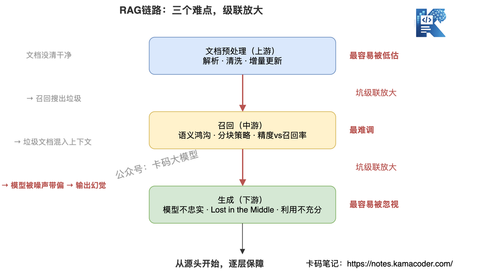
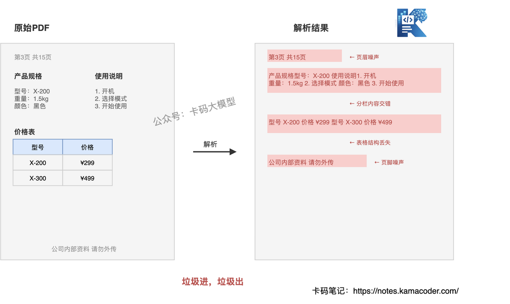
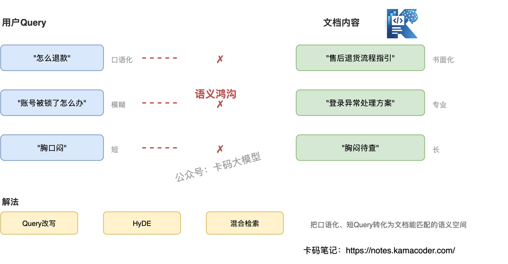
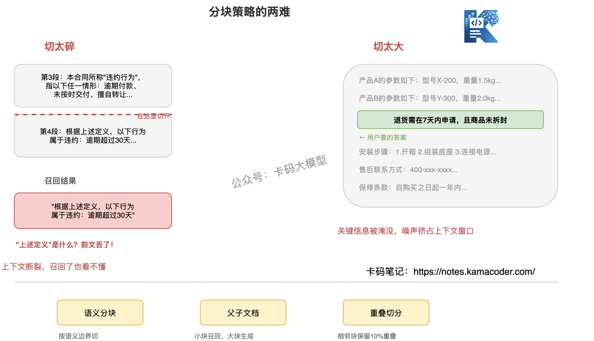
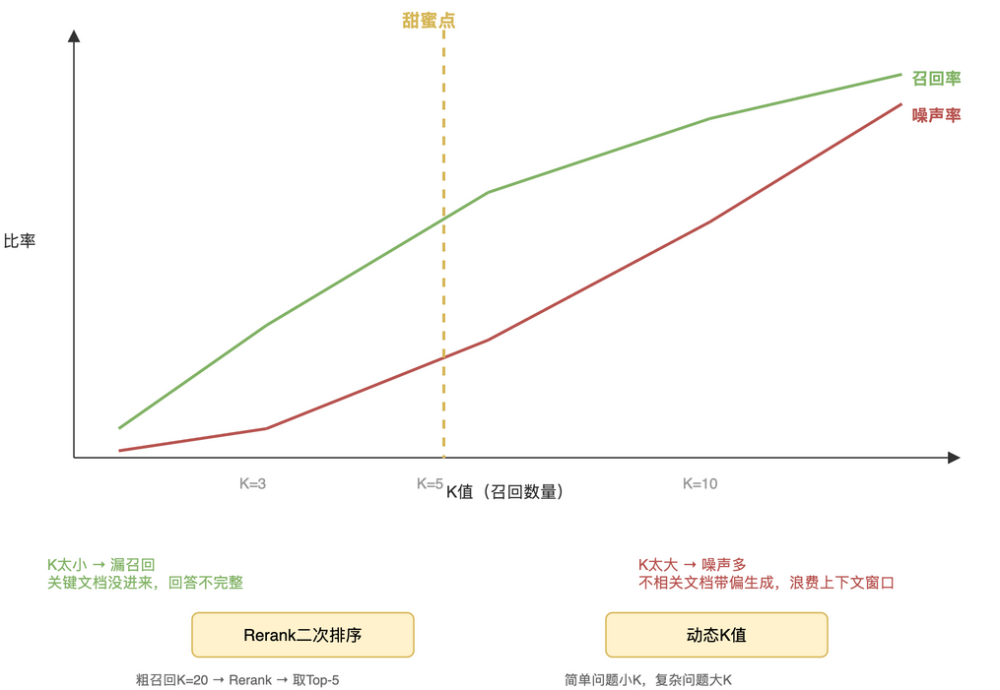
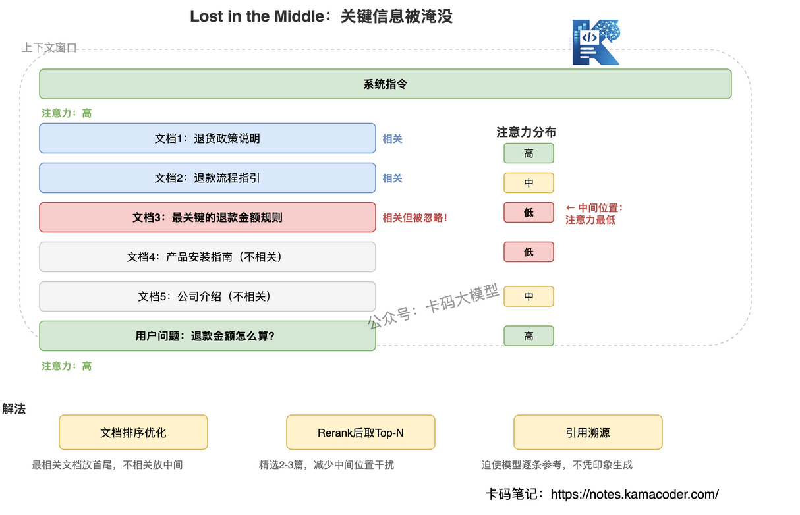

# RAG落地最难的地方在哪？文档预处理、召回质量、生成忠实度

> 来源: https://notes.kamacoder.com/interview/llm/rag_hardest_parts_interview.html

# `# RAG落地最难的地方在哪？文档预处理、召回质量、生成忠实度 

如果大家简历上有RAG的项目，或者 【专业技能】上写了RAG相关内容。 

面试官很可能就会问你："在实际落地中，你觉得 RAG 最难的地方是哪里？" 

这个问题其实很考察候选人的实战经历，也是可以作为面试官判断你是不是就只简单背一背八股，做个demo项目。 

面对这个问题，有的录友会答"幻觉"，有的答"分块策略"，有的答"Embedding 选型"。 

这些都不算错，但还是差点意思。 

**RAG 最难的不是某一个环节，是三个环节都有坑，而且上游的坑会级联放大。** 

文档预处理没做好 → 召回搜不到对的文档 → 召回混入噪声 → 生成被带偏产生幻觉。 

很多人只盯着召回调优，却忽略了文档预处理才是源头。 

这篇文章，我们把 RAG 落地的三大难点拆开讲：**文档预处理（最容易被低估）、召回质量（最难调）、生成忠实度（最容易被忽视）**，每个难点讲清楚为什么难、难在哪、怎么解。 

## `# 目录 
  - 三个难点，级联放大   - 文档预处理：最容易被低估的难点

    - 解析：格式复杂，解析就是大坑     - 清洗：噪声不除，后患无穷     - 增量更新：知识库不是一锤子买卖   - 召回质量：最难调的难点

    - 语义鸿沟：用户问法和文档写法对不上     - 分块策略：切太碎丢上下文，切太大引入噪声     - 精度 vs 召回率：多召回还是少召回   - 生成忠实度：最容易被忽视的难点

    - 召回对了但模型不忠实     - Lost in the Middle：关键信息被淹没     - 上下文利用不充分   - 面试怎么答 

## `# 一、三个难点，级联放大 

先看 RAG 的完整链路（向量检索、Rerank、Chunk 这些基础概念如果还不熟，建议先看 RAG 大厂面试题汇总）：用户提问 → 检索相关文档 → 把文档和问题一起丢给大模型 → 大模型生成回答。 

这个链路看似简单，实际每个环节都有坑： 

 

**文档预处理**是源头。文档解析不清、清洗不干净，后面的召回和生成都是在"脏数据"上工作。垃圾进，垃圾出。 

**召回质量**是中枢。召回错了，后面全白费——生成模型再强也救不回来。但"搜不准"比"搜不到"更可怕：不相关文档混进来，反而会把生成带偏。 

**生成忠实度**是出口。即使召回对了，模型也可能不忠实于检索到的文档，自己编造信息，或者忽略了最关键的那段文档。 

这三个难点不是独立的，**上游的坑会级联放大**。文档没清干净 → 召回搜出垃圾 → 垃圾文档混入上下文 → 模型被噪声带偏 → 输出幻觉。 

所以调 RAG，不能只盯一个环节，得**从源头开始，逐层保障**。 

## `# 二、文档预处理：最容易被低估的难点 

很多人聊 RAG，直接从 Embedding 和检索开始聊，好像文档天然就是干净的结构化文本。但真实场景里，**文档预处理才是最耗时间、最容易被低估的环节**。 

做过 RAG 落地的都知道：80% 的工期花在数据上，20% 花在模型和检索上。 

### `# 解析：格式复杂，解析就是大坑 

企业的知识库不是干净的 Markdown 文本，而是 PDF、Word、扫描件、PPT、Excel、图片混在一起。 

一个典型的 PDF 文档，里面可能包含：多层嵌套表格、分栏排版、页眉页脚、内嵌图片、扫描的图片版文字。通用解析工具处理这些，出来的结果经常是乱的——表格被打散成零散的文本行，分栏内容交错在一起，页眉页脚混入正文。 

**解析做不好，后面的召回就变成了在乱码里找答案。** 

 

实际解法： 
  - **表格处理**：用专门的表格解析工具（如 Camelot、pdfplumber），把表格提取为结构化数据（HTML/Markdown 表格），不要和正文混在一起   - **扫描件**：OCR 是必须的，但 OCR 本身也有错误率，需要后处理纠错   - **多格式统一**：不管源文档是什么格式，最终都要归一化为统一的中间格式（如 Markdown），方便后续处理 

### `# 清洗：噪声不除，后患无穷 

解析完的文档不是直接能用的，里面有很多噪声： 
  - 页眉页脚（"第3页 共15页"、"公司内部资料 请勿外传"）   - 导航栏和目录（从网页抓取的文档尤其严重）   - 重复内容（同一份文档的多个版本）   - 格式残留（残缺的 HTML 标签、乱码字符） 

这些噪声不清洗，就会变成召回时的干扰项。你搜"退货流程"，召回来一段"公司内部资料 请勿外传"，这段噪声占用了上下文窗口，挤掉了真正有用的文档。 

实际解法： 
  - **规则过滤**：用正则匹配常见的噪声模式（页码、版权声明、导航链接），直接过滤   - **去重**：对文档做去重（SimHash、MinHash），避免重复内容占据检索空间   - **质量打分**：对每个文档块做质量打分（长度、完整性、可读性），低分的不入库 

### `# 增量更新：知识库不是一锤子买卖 

上线初期，你花了两周把文档预处理干净、入库，以为搞定了。但知识库是活的——产品规则变了、价格调整了、新功能上线了，文档每天都在变。 

**增量更新要解决三个问题**：哪些文档变了？变了的部分怎么更新？旧的版本怎么处理？ 
  - 哪些变了：用文档的元数据（更新时间、版本号）做变更检测，或者对文档内容做哈希比对   - 变了怎么更新：不能全量重建（太慢），要做增量更新——只重新处理变更的部分，替换向量库中对应的向量   - 旧版本怎么处理：有些场景需要保留历史版本（如合同变更追溯），有些可以直接覆盖 

**这一步做不好，知识库就会逐渐"腐烂"——召回的文档是过时的，生成的回答也是错的。** 

## `# 三、召回质量：最难调的难点 

文档预处理做好之后，接下来是召回。这一步是 RAG 的中枢——**召回错了，后面全白费**。 

召回难，不是"搜不到"，而是"搜不准"。向量检索是基于语义相似度的，但语义相似不等于任务相关。 

### `# 语义鸿沟：用户问法和文档写法对不上 

用户问"怎么退款"，文档写的是"售后退货流程指引"——语义相近但字面不匹配，通用 Embedding 可能匹配不上。 

用户问"账号被锁了怎么办"，文档里没有"账号被锁"，写的是"登录异常处理方案"——模型得理解"账号被锁"和"登录异常"是一回事。 

 

这种鸿沟在专业领域更严重。医疗场景里，患者说"胸口闷"，病历写"胸闷待查"；法律场景里，当事人说"被辞退了"，法条写"劳动合同解除"——不是同一个词，但是同一件事。 

实际解法： 
  - **Query 改写/扩展**：用大模型把用户的口语化提问改写为更规范的查询，或者扩展为多个查询维度。比如"怎么退款" → ["退款流程", "售后退货", "退款申请"]   - **HyDE（Hypothetical Document Embedding）**：先让大模型生成一个"假设性回答"，用这个回答的 Embedding 去检索。假设性回答和真实文档的语义更接近，比直接用短 Query 检索效果好   - **混合检索**：关键词检索（BM25）擅长精确匹配，语义检索（Embedding）擅长语义匹配，两者结合覆盖更全 

### `# 分块策略：切太碎丢上下文，切太大引入噪声 

文档不能整篇存入向量库，需要分块（Chunking）。但分块大小是个两难： 

 

切太碎的典型问题：一份合同里，第3段定义了"违约行为"，第4段说"根据上述定义，以下行为属于违约"。如果恰好在第3段和第4段之间切开，第4块变成"以下行为属于违约"，召回了也看不懂。 

切太大的典型问题：一整页产品文档，只有中间两行是用户问题的答案，但整页都被召回了。无关内容占据上下文窗口，挤掉了其他相关文档的位置。 

实际解法： 
  - **语义分块**：不按固定字数切，而是按语义边界切——用模型判断哪里是段落/主题的自然分割点   - **父子文档**：小块做召回（精准定位），大块做生成（保留上下文）。召回时命中小块，生成时把小块对应的父文档整段喂给模型   - **重叠切分**：相邻块之间保留一定重叠（如10%），避免关键信息正好在切点处断裂 

### `# 精度 vs 召回率：多召回还是少召回 

Top-K 参数的选取是个经典取舍： 
  - K 太小（如 K=3）：可能漏掉关键文档，回答不完整   - K 太大（如 K=10）：噪声文档混进来，反而带偏生成，还浪费上下文窗口 

 

更关键的是，这个"甜蜜点"不是固定的，不同类型的问题需要不同的 K 值。简单事实型问题（"公司地址在哪"）K=3 就够了，复杂分析型问题（"分析去年营收下滑原因"）可能需要 K=10 以上。 

实际解法： 
  - **Rerank 二次排序**：先用较大 K 值（如 K=20）粗召回，再用 Cross-Encoder 做精准排序，取 Top-N（如 N=5）。粗召回保证不漏，Rerank 保证精度   - **动态 K 值**：根据问题类型动态调整 K 值——简单问题用小 K，复杂问题用大 K。问题分类可以用规则或轻量模型判断 

混合检索 + Rerank 是目前工业界的标配方案，效果比单独用关键词或语义检索都好。 

但如果知识本身是图状的——实体之间多跳关联、需要全局归纳，向量召回再怎么调也会碰天花板，这时候得换知识图谱检索的思路，见 GraphRAG 与 LightRAG 大厂面试题汇总。 

## `# 四、生成忠实度：最容易被忽视的难点 

文档预处理做好了，召回也对了，是不是就稳了？不是。**召回对了但模型不忠实，是 RAG 里最隐蔽的问题。** 

### `# 召回对了但模型不忠实 

模型拿到了正确的文档，但生成的回答里有文档没提到的内容——这就是 RAG 场景下的幻觉。 

比如文档写的是"退货需在7天内申请，且商品未拆封"，模型回答"退货需在7天内申请"——这还OK。但有的模型会接着说"超过7天也可以联系客服协商处理"——文档里根本没这句话，模型自己"补"的。 

**这种幻觉最危险，因为它和正确信息混在一起，用户很难分辨。** RAG 只是幻觉的一个来源，Agent 系统里还有工具调用、多轮上下文等更多触发点，系统性的幻觉约束思路见 Agent 系统如何约束大模型幻觉。 

实际解法： 
  - **Prompt 强约束**：在系统提示词中明确要求"只根据提供的文档内容回答，文档中没有的信息不要编造，不确定时回答'文档中未提及'"。这一条看起来简单，但实际效果立竿见影   - **引用溯源**：要求模型在回答中标注信息来源，比如"根据文档A，退货需在7天内申请"。模型要编造内容时，找不到对应的文档引用，就编不下去了   - **后处理校验**：生成回答后，用一个轻量模型或规则引擎，把回答和原始文档做交叉比对，检测回答中是否包含文档未提及的声明，发现幻觉就打回重新生成   - **拒绝回答机制**：当模型对回答的置信度不够时，宁可说"根据已有文档无法回答"，也不要硬编。可以通过调整 temperature（降低随机性）或在 Prompt 中设置拒绝条件来实现 

### `# Lost in the Middle：关键信息被淹没 

Transformer大厂面试题汇总 里讲过 "Lost in the Middle" 现象：大模型对上下文中间位置的信息关注度最低。 

RAG 场景里，检索到的多篇文档拼接后塞进 Prompt，关键信息可能恰好落在中间位置。模型"看到了"但"没注意到"，生成时忽略了最重要的那段文档。 

 

实际解法： 
  - **文档排序**：把最相关的文档放在上下文的首尾位置（开头和结尾），不相关的放中间。或者只用最相关的2-3篇，不要贪多   - **Rerank 后取 Top-N**：通过 Rerank 精选最相关的文档，减少塞入上下文的文档数量，降低"中间位置"的干扰 

### `# 上下文利用不充分 

给了模型5段相关文档，但模型只用了2段——另外3段明明也相关，但模型没有利用。 

这在多维度问题上尤其明显。比如用户问"产品X和产品Y的区别"，检索到了产品X的文档和产品Y的文档，但模型只看了产品X的，对产品Y的信息一笔带过，导致对比不完整。 

实际解法： 
  - **Prompt 约束**：在 Prompt 中明确要求"必须基于所有提供的文档回答，不要遗漏"   - **分解回答**：对于复杂问题，把问题拆成子问题，每个子问题单独检索+生成，最后合并。这样每个子问题只需要处理少量文档，利用率更高   - **引用溯源**：要求模型在回答时标注信息来源（如"根据文档A，..."），迫使模型逐条参考文档，而不是凭印象生成 

## `# 五、面试怎么答 

面试官问 RAG 落地最难的地方，不要只说"召回不准"或"模型幻觉"，要展示**从全链路视角的系统性理解**。 

**参考回答思路：** 

"RAG 落地最难的不是某一个环节，是三个环节都有坑，而且级联放大。 

最容易被低估的是文档预处理。很多团队上来就调 Embedding 和检索，但文档没清干净、表格解析乱了、知识库没更新，后面的召回和生成都是在脏数据上工作。我做过一个项目，80% 的工期花在数据上，20% 花在模型和检索上。 

最难调的是召回质量。核心难点是用户问法和文档写法之间的语义鸿沟，以及分块策略的两难——切太碎丢上下文，切太大引入噪声。我的解法是混合检索加 Rerank，粗召回保证不漏，二次排序保证精度。 

最容易被忽视的是生成忠实度。召回对了但模型不忠实，幻觉和正确信息混在一起，用户很难分辨。还有 Lost in the Middle 问题——关键文档落在上下文中间，模型注意力不够。解法是文档排序优化和引用溯源。 

这三个问题的共同点是：**都是工程问题，不是算法问题。调模型参数解决不了，得在链路的每个环节做约束和保障。**" 

这个回答从全链路视角讲，先说级联关系，再逐个拆解，最后点出"工程问题不是算法问题"，比只背"混合检索效果好"高一档。
