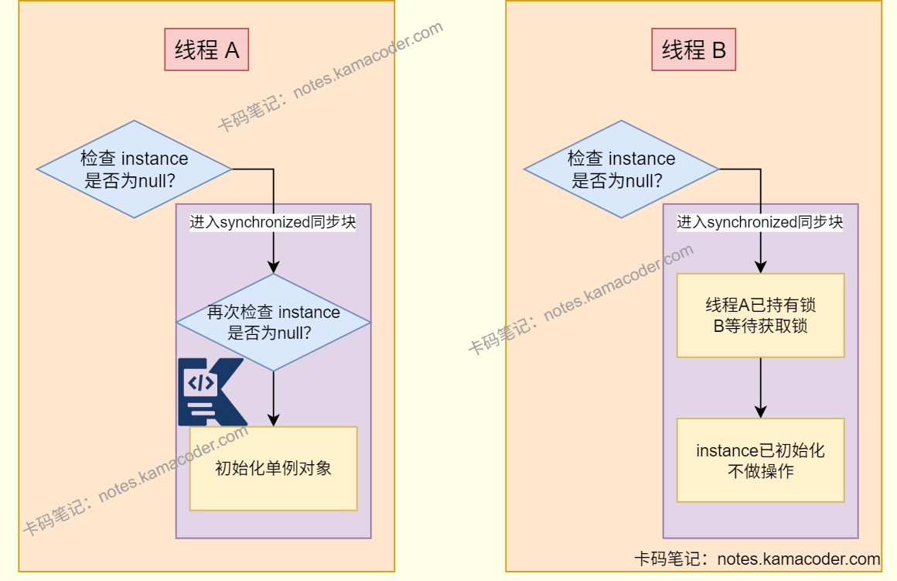

# 12.10京东面经

> 来源: https://notes.kamacoder.com/interview/java/jd-interview-12-10.html

# `# 12.10京东面经 

## `# 成员变量和局部变量有什么区别？ 
  - **成员变量**属于类或对象，可以被public、private和static等修饰符修饰；具有默认值；被static修饰的类变量生命周期与类相同，存储在方法区，没有被static修饰的实例变量生命周期和对象相同，存储在堆内存中。   - **局部变量**是在代码块或方法中定义的，不能被访问控制修饰符修饰；不会被自动赋值；生命周期与方法相同，存储在对应方法的栈帧中。 

## `# 重载和重写的区别？ 
  - 重载是**编译时多态**，发生在同一个类中，方法名相同，参数列表（参数类型、个数、顺序）必须不同，返回值与访问修饰符不影响。   - 重写是**运行时多态**，子类重新编写父类允许访问的方法实现。方法名和参数列表相同，子类返回值比父类返回值类型小或相等，异常范围小于等于父类，访问修饰符的范围大于等于父类，构造方法无法被重写。如果父类的方法被private/final/static修饰时，子类不能重写该方法，不过被static修饰的方法可以被再次声明。 

## `# Java中有哪些基本数据类型？ 
  - Java中有八种基本数据类型，其中包含六种数字类型，分别是byte、short、int、long、float和double，还有字符类型char和布尔型boolean。 

## `# 怎么理解包装类？和普通类有区别吗？ 
  - 包装类型将基本类型包装，属于引用类型，拥有对象的特征适配面向对象编程，可以为基本类型增加属性和方法。包装类作为对象类型存储在堆内存中，包装类不进行赋值默认为null，还可以用于泛型。   - 基础类型具有非null默认值，不可以用在泛型中，根据变量类型存放在虚拟机栈帧或堆内存中，占用空间小。 

## `# 听过包装类的缓存机制吗？ 
  - 包装类使用缓存机制提升性能，在类初始化时创建好频繁使用的包装类对象，当需要使用某个类的包装类对象时，如果该对象包装的值在缓存范围内，直接返回缓存的对象，否则创建新的对象并返回。不过**使用构造函数创建包装类对象时不使用缓存**。   - Byte、Short、Integer、Long缓存了-128~127范围的对象，其中Integer类型可以通过-XX:AutoBoxCacheMax参数调整上限。Character缓存了0~127的字符，Boolean缓存了Boolean.TRUE和Boolean.FALSE两个对象，浮点数的小值区间不固定，没有设置缓存。   - 使用valueOf()方法可以从缓存中取值，命中缓存可以减少资源的开销。 

## `# 了解自动拆箱和装箱吗？ 
  - **装箱**是将基本类型用他们对应的包装类（引用类型）包装起来；**拆箱**是将包装类转换为基本数据类型。   - Java程序中可以实现自动的拆箱与装箱，包装类和基本类型之间可以自动转换。如果想手动实现类型转换，可以使用valueOf()将其他类型转为包装类型，parseXxx()将字符串转为基本数据类型。 

## `# 面向对象有什么原则？ 
  - **单一职责原则**，使每个类只负责一个职责，只有一个原因会引起该类变化。   - **开放闭合原则**，对扩展开放，对修改封闭，不能修改已经写好的属性和方法。   - **里氏替换原则**，要求在使用父类的地方一定可以使用子类，替换后不会改变原有程序的正确性。   - **接口隔离原则**，将接口拆分为细粒度接口，让客户端只依赖自己需要的方法。   - **依赖倒置原则**，将高层与低层模块解耦，二者都依赖接口或抽象类实现。 

## `# 怎么理解ThreadLocal？ 
  - ThreadLocal是一个线程的本地变量工具类，可以实现**线程数据隔离**，每一个线程独享一个ThreadLocal，在接收请求的时候使用set()方法存储当前线程中变量的副本，使用get()方法获取ThreadLLocal在当前线程中保存的变量副本，线程可以存储私有数据而互不干扰。   - ThreadLocal通过Thread类的局部变量和哈希表实现，每个Thread中持有一个ThreadLocalMap，ThreadLocalMap中有一个Entry，以ThreadLocal实例为key，当前线程中变量副本为value。 

## `# ThreadLocal有没有内存泄漏问题？ 
  - 如果是线程池场景下，线程内部的ThreadLocalMap持有ThreadLocal弱引用，当业务代码执行完之后ThreadLocal被回收，ThreadLocalMap中Entry的键会变成null，但仍然存在**ThreadLocalMap.Entry对value的强引用**，如果线程是长期存在的核心线程则value无法被GC回收，导致内存泄漏。   - 如果使用了ThreadLocal，需要在使用完毕后在finally块中调用remove()释放对象，手动清理value，可以避免线程泄漏。 

```
public class ThreadLocalLeakDemo {
    // 定义 ThreadLocal 变量
    private static ThreadLocal<User> userThreadLocal = new ThreadLocal<>();

    public static void main(String[] args) {
        // 创建线程池（核心线程数 5，长期存活）
        ExecutorService executor = Executors.newFixedThreadPool(5);

        for (int i = 0; i < 100; i++) {
            executor.submit(() -> {
                try {
                    // 存入数据（value 是 User 对象）
                    userThreadLocal.set(new User("张三", 20));
                    // 业务逻辑...
                } finally {
                    // 不使用remove()方法导致内存泄漏
                    // userThreadLocal.remove();
                }
            });
        }
    }
}

```

 

## `# 还有哪些情况会导致内存泄漏?怎么避免？ 
  - **内存泄露**就是程序中的对象不会再被使用时，仍存在错误的引用，无法被垃圾回收，导致内存占用，可能会引发OOM导致程序崩溃。   - 常见的内存泄露场景有在静态集合中添加对象后没有移除，使用缓存时没有过期策略，没有移除对象的监听器，资源没有关闭等。   - 尽量不使用static对象，使用时及时清理无用对象，可以将不用的对象手动设置为null；使用资源时及时关闭资源与连接；使用带有过期策略的框架缓存；在监听器回调注册后，在对象销毁时主动移除； 

## `# 线程池是怎么处理线程的？ 
  - 当有任务被提交到线程池中时，如果当前线程池中线程数小于核心线程数，则新建线程执行该任务；如果线程数大于等于核心线程数且当前任务队列未满时将当前任务添加到任务队列中等待执行；如果任务队列已满，且当前线程池中线程数小于最大线程数，则创建新线程执行任务；如果当前线程数已经等于最大线程数了，线程池会调用拒绝策略方法。 


 

## `# synchronized和volatile有什么区别？ 
  - 

synchronized可以确保数据的一致性和线程安全，解决多个线程之间访问资源的同步性，而volatile确保变量在多个线程的可见性和有序性，不能保证原子性。   - 

volatile不需要获取/释放锁，性能较高且轻量级，synchronized可能会造成线程阻塞。   - 

synchronized可以修饰类、方法或代码块，而volatile只能修饰变量。   - 

volatile关键字的作用示意图

   - 

synchronized底层示意图

 

## `# 了解volatile和synchronized实现双重检查锁吗？ 
  - 使用volatile和synchronized的双重检查锁实现单例模式，可以实现在实例未创建时加锁，保证线程安全和并发性能；通过synchronized保证多线程下的原子性，volatile解决指令重排问题。使用外层检查避免频繁加锁，内层加锁后二次检查防止多线程并发创建实例，最终实现高性能的懒加载与线程安全。

 

```
public class Singleton {
    // 1. volatile修饰单例引用，禁止指令重排序
    private static volatile Singleton instance;

    // 2. 私有构造器，防止外部实例化
    private Singleton() {}

    // 3. 双重检查锁定获取实例
    public static Singleton getInstance() {
        // 第一次检查：避免不必要的同步（提高性能）
        if (instance == null) {
            // 同步块：保证只有一个线程进入初始化流程
            synchronized (Singleton.class) {
                // 第二次检查：防止多线程并发时重复初始化
                if (instance == null) {
                    // 若不加volatile，可能发生指令重排序导致的问题
                    instance = new Singleton();
                }
            }
        }
        return instance;
    }
}

```

 

## `# 还有哪些实现单例模式的方式呢？ 
  - 单例模式保证一个类在程序运行期间只有一个实例，提供全局唯一访问入口，解决频繁创建和销毁全局使用的类实例问题，当需要控制实例数目节省资源时使用。常见的实现方式有懒汉式、饿汉式、双重检查锁(DCL)、静态内部类和枚举单例。   - 饿汉式是在类加载时就创建实例，线程安全但可能导致资源浪费。   - 懒汉式是在第一次使用时才创建实例，线程不安全，但可以延迟加载，避免了资源浪费。如果想实现线程安全的单例模式，可以使用 synchronized 关键字修饰 getInstance() 方法，不过添加synchronized后会影响效率。   - 静态内部类也可以实现单例，将构造函数私有，内部类仅在调用getInstance()时加载，并且类加载的初始化阶段线程安全。   - 枚举方式实现单例是由JVM保证唯一，且枚举类的构造器默认是私有，能够防止反射创建实例，支持序列化机制，防止反序列化重新创建新对象。

```
public enum Singleton {
    INSTANCE;
    public void someMethod() {
    }
}

```

  

## `# 为什么类加载的初始化阶段线程安全？ 
  - 类加载的初始化阶段中，JVM对类的初始化过程加了初始化锁，保证只有一个线程能够获取该锁并执行初始化逻辑，其他线程阻塞；类初始化时会触发 < clinit > 方法，只有一个线程能够执行 < clinit> 方法并只执行一次，保证类加载过程中的线程安全，进而可以实现饿汉式与静态内部类的线程安全。 

## `# 怎么理解事务的特性？ 
  - 关系型数据库中的事务存在ACID特性，分别是原子性、一致性、隔离性和持久性。   - **原子性**(Atomicity)指事务是最小执行单位，不可分割，保证动作要么全部完成要么全部失败。   - **一致性**(Consistency)指执行事务前后数据保持一致，数据库从一个状态转换到另一个一致状态。   - **隔离性**(Isolation)指并发访问数据库时用户不被其他事务干扰，并发事务之间的数据库独立。   - **持久性**(Durability)指在一个事务被提交之后对数据库中数据的改变是持久的，数据库发生故障也不会影响数据。 

## `# Zookeeper有哪些功能？ 
  - Zookeeper是一种**分布式协调服务**，提供高可用、高性能以及稳定的分布式数据一致性解决方案，可以用来实现数据发布与订阅、负载均衡、集群管理和分布式锁等功能。   - Zookeeper使用临时有序节点和Watcher机制实现分布式锁，让最小序号的节点获得锁，其他节点监听前序节点，通过监听节点变化可以实现配置的动态更新；还可以通过ZooKeeper的顺序节点生成全局唯一的ID，实现命名； 

## `# 讲讲Zab协议？ 
  - Zab协议是**ZooKeeper原子广播协议**，可以实现集群数据一致性，通过**崩溃恢复阶段**选举出唯一Leader节点，再通过**原子广播阶段**保证所有写操作按顺序，原子性地同步到集群的所有节点中，最终实现集群数据的顺序一致性与最终一致性，是Zookeeper作为分布式协调服务的底层原理。   - **崩溃恢复**是当主节点故障或者集群中多数节点与主节点失联时出现，此时会根据事务ID和节点ID选举出新的Leader节点，新节点需要包含集群中所有已提交的事务，并获得超过半数的其他节点的支持。   - **原子广播**是在主节点选举完成后的阶段，将Leader接收的写操作原子性地同步到所有Follower节点中以保证数据一致性。
