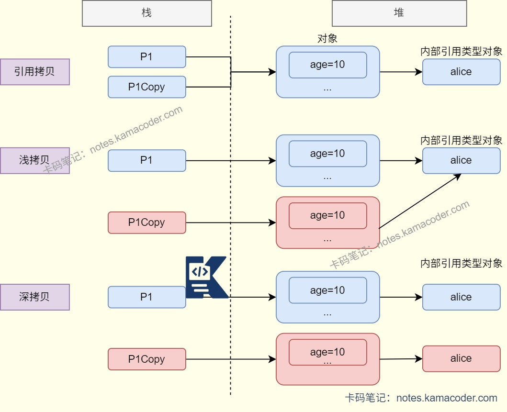

# 12.27腾讯面经

> 来源: https://notes.kamacoder.com/interview/java/tencent-interview-12-27.html

# `# 12.27腾讯面经 

## `# 浮点数运算为什么不精确？能不能解决？ 
  - 计算机使用二进制进行数据的运算和存储，如果有无限循环的小数会被截断，导致小数精度损失。   - 使用BigDecimal可以解决浮点数运算的精度丢失问题，BigDecimal可以适配十进制小数表示，使用十进制整数和小数位数的存储方式替代二进制存储，避免了转换过程中的精度损耗。 

## `# sleep()和wait()的区别？ 
  - sleep()方法是线程类的方法，可以使正在执行的线程主动让出CPU，在指定时间后回到该线程继续往下执行，不会释放资源锁；可以在任何地方使用；   - wait()方法是Object的方法，可以使当前线程退出并进入等待队列，释放同步资源锁，使其他正在等待该资源的线程得到该资源并运行，调用wait()方法的线程需要等待notify()/notifyAll()方法唤醒；只能在同步方法或者同步块中使用； 

## `# 引用拷贝、浅拷贝和深拷贝是什么？ 
  - 引用拷贝不创建新对象，仅复制对象的引用地址。   - 浅拷贝会在堆上创建新的对象。但是当原对象内部的属性是引用类型时，浅拷贝会复制内部对象的引用地址，拷贝对象和原对象共用一个内部对象。   - 深拷贝则会完全复制整个对象，包括对象所含的内部对象。

 

## `# String,StringBuilder,StringBuffer有什么区别？ 
  - String是不可变的字符串类，因为其内部数组使用了final修饰，每次改变String对象会创建新的String对象。由于String的不可变，String的线程是安全的。适合常量等字符串不经常变化的场景。   - StringBuilder和StringBuffer是可变的，对字符串进行修改不会创建新的对象，有append()、insert()等操作字符串方法。   - StringBuilder适合运行在单线程环境中，比如SQL语句拼装和JSON封装；   - StringBuffer中的方法使用synchronized修饰，线程安全，适合多线程环境下使用，比如XML解析，HTTP参数解析和封装。 

## `# 介绍字符串常量池？ 
  - 字符串常量池是JVM为了优化字符串设计的缓存池，在堆内存中，保存所有在编译器确定的字符串字面量和常量，通过intern()方法可以在运行中向字符串常量池添加字符串，能够避免字符串的重复创建。   - 创建字符串时JVM会检查字符串常量池，如果字符串已经存在常量池中，则返回其引用；不存在则将字符串放入池中后返回其引用。 

## `# 讲一下java的异常机制？ 
  - Java的异常体系以Throwable为根类，有Error和Exception两个子类；   - Error表示运行时环境的错误，是程序无法处理的问题，可能是系统崩溃，虚拟机错误等。   - Exception是程序本身可以处理的异常，分为非运行时异常和运行时异常。非运行时异常在编译时就必须被捕获或声明抛出，比如文件不存在(FileNotFoundException)、类未找到(ClassNotFoundException)等，程序员必须进行显式抛出；运行时异常则是由代码逻辑错误导致的，比如数组越界、空指针异常等。一般可以通过try...catch...finally捕获异常或使用throw/throws抛出异常。 

## `# SPI是什么？ 
  - SPI(Service Provider Interface)机制可以将服务接口与具体的实现分离，提升程序的扩展性与可维护性，调用方只依赖接口，所以在修改或替换服务实现时不需要修改调用方。体现了面向接口编程和动态加载机制。
-Java中很多框架与扩展都使用了SPI机制，比如JDBC中使用SPI加载驱动，SpringBoot Starter的自动装配等。 

## `# SPI机制的工作流程是什么？ 
  - SPI机制在定义服务接口后，由实现方编写接口实现类，然后在META-INF/services/下创建接口文件，文件中写入实现类的全限定名，调用方会通过ServiceLoader.load()方法加载所有的实现类并遍历使用。 

## `# Java8有哪些新特性？ 
  - Java8引入的核心新特性包括Lambda表达式，Stream API、函数式接口、默认方法、Optional类和新的日期与时间API。   - Lambda表达式把函数作为一个方法的参数，提供简洁的语法编写匿名函数。   - 引入的函数式接口注解@ FunctionalInterface，作为Lambda表达式的接口，比如Consumer、Supplier、Function和Predicate。   - Stream API是数据流处理工具，提供了一种声明式的方式来对集合进行操作，如过滤、映射、排序和去重等。   - Java8也引入了java.time包，提供了全新的日期和时间API，线程安全且易用，加强了对日期与时间的处理。 

## `# HTTP长连接开启和关闭有啥区别？ 
  - HTTP基于TCP协议，关闭长连接（短连接）是HTTP/1.0默认的行为，客户端每次请求时建立TCP连接，请求响应完成后会立即断开。短连接频繁新建连接会消耗CPU资源，性能开销较大，同时服务器并发连接数高可能会导致大量短时TCP连接占用文件描述符，触发too many open files。适合客户端单次请求和服务端无法维持大量空闲连接的场景。   - HTTP/1.1会默认为长连接，通过请求头Connection:keep-alive标识，当客户端与服务端完成一次请求响应后，TCP连接会保持一段时间以供后续请求复用。长连接可以减少握手/挥手次数降低网络延迟和服务器负载，同时后续请求可以直接发送数据，提升响应速度。适合客户端会频繁请求的场景，也是较为主流的使用方式。 

## `# TCP 的两个状态 ，time_wait 和close_wait是什么？ 

 
  - TIME_WAIT和CLOSE_WAIT是TCP四次挥手过程中出现的两个核心状态，TIME_WAIT属于主动关闭方，CLOSE_WAIT属于被动关闭方。   - 当被动关闭方收到主动关闭方的FIN报文后会回复ACK报文确认，此时被动关闭方的连接状态就会从ESTABLISHED变为CLOSE_WAIT。表示已经收到了对方的断开请求，在处理自己的业务数据，处理完剩余数据后被动方会主动发FIN报文给对方，连接状态就会从CLOSE_WAIT变为LAST_ACK；   - 当主动关闭方收到被动关闭方的FIN，发送最后一个ACK报文后，连接状态会变成TIME_WAIT，这个状态会保存2MSL，也就是两倍的报文最大生存时间。主动方保持TIME_WAIT状态不立即释放连接，如果被动关闭方没有收到ACK报文会在2MSL内重发FIN报文，因此可以保证最后一个ACK能够到达，同时2MSL内可以使旧连接中残留的报文失效，避免旧连接的报文干扰新连接。 

## `# 如果有大量的CLOSE_WAIT或TIME_WAIT堆积，可能是什么原因？ 
  - 如果CLOSE_WAIT大量堆积，可能是服务器故障，被动关闭方收到FIN报文后没有调用close()接口发送FIN报文，导致连接卡在CLOSE_WAIT状态，最后可能会因为占用文件描述符引发"too many open files"。开发者需要确保业务逻辑处理完后主动关闭socket或设置socket超时时间。   - TIME_WAIT大量堆积可能出现在高并发客户端或反向代理中，会占用端口资源而无法创建新连接，开发者可以开启tcp_tw_reuse复用TIME_WAIT连接，或者尝试缩短MSL的时间。 

## `# 什么是粘包问题？ 
  - 如果发送方连续发送多个数据包，可能会被接收方一次性读取或者拆分读取，造成粘在一起或者碎片化的情况。本质上是发送方使用Nagle算法合并小数据包发送，并且接收方的接收缓冲区未及时读取，造成多个数据包堆积。 

## `# 你怎么解决粘包问题？ 
  - 可以使用定长包，约定每个数据包的字节长度固定，接收方每次读取固定长度的字节，不足则补充，超出则截断，适合消息长度固定的场景。   - 还可以使用分隔符解决，即在每个数据包末尾添加唯一的分隔符，接收方读取字节流时按照分隔符拆分消息，实现时需要保证分隔符唯一，适合HTTP协议场景。   - 最通用的方案是长度前缀，适合任意消息类型。将每个数据包分为长度头和消息体两部分，长度头固定字节数，存放消息长度，消息体则是实际的内容，接收方读取长度头后根据长度读取消息体，保证消息完整，绝大多数业务场景都使用此方案。 

## `# UDP存在哪些问题？ 
  - UDP没有粘包问题，但是可能会出现报文截断、丢包、乱序或者重复报文的情况。   - 报文截断：如果发送的报文超过了报文的最大长度限制（MTU），IP层会进行分片传输，如果某片丢失则接收方无法重组完整报文，则会丢弃整个报文。   - 丢包：UDP没有确认重传机制，所以在报文丢失时没有感知，也不会触发重传。   - 乱序：UDP没有序列号限制，多个报文经过不同路由到达，可能会导致接收顺序和发送顺序不一样。   - 重复报文：如果网络层产生异常可能会重复发送报文，接收方会收到多个相同的完整报文，需要在业务层进行去重。 

## `# 一般怎么保证DB和Redis的一致性？ 
  - 需要根据业务场景选择适合的一致性方案，对于大多数场景来说，只需保证最终一致性，允许在缓存删除失败或并发读的情况下导致的短暂不一致发生。读操作先查缓存，命中则返回，未命中则查DB后写入缓存并返回；写操作则先更新DB再删除缓存。   - 在交易等核心场景下，需要保证强一致性时，可以使用分布式锁+双写同步实现，在写操作时先获取分布式锁，更新DB和缓存的数据之后再释放锁，可以避免并发读写导致的不一致，同一时间只有一个请求操作数据。   - 在高并发场景下，使用DB更新和MQ异步更新缓存保证最终一致性，写操作更新DB后发送MQ消息，消费端异步删除/更新缓存，同时添加定时任务对比数据库与缓存数据，作为兜底机制。
