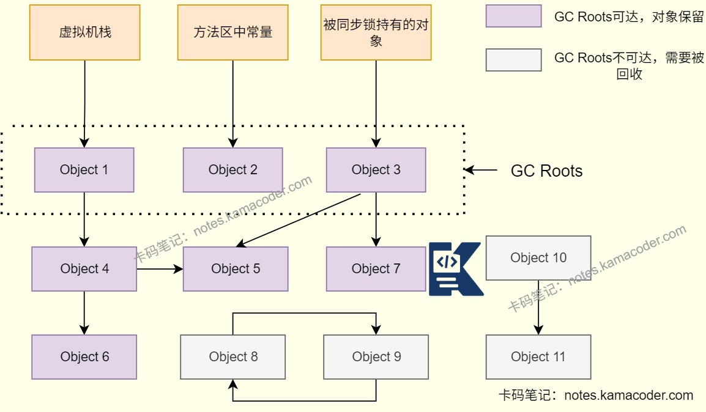
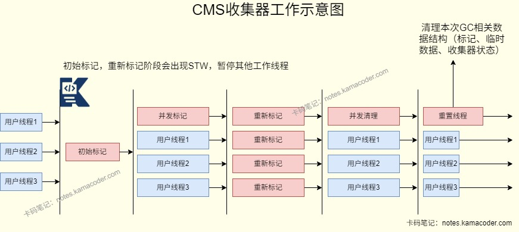

# 26.1.1字节跳动二面

> 来源: https://notes.kamacoder.com/interview/java/bytedance-interview-round2-1-1.html

# `# 26.1.1字节跳动二面 

## `# synchronized和ReentrantLock的区别？ 
  - synchronized是基于**JVM的内置隐式锁**，只能用于方法和代码块，需要与wait() 和notify()/notifyAll() 方法一起使用，用于线程等待和通知。   - ReentrantLock是Java提供的**显式锁机制**，需要手动获取和释放锁，更加灵活，支持响应中断、设置锁的公平性等，与Condition接口结合可以实现更细粒度的线程等待和通知机制。 

 

## `# 二者的底层实现机制分别是什么？ 
  - synchronized的核心机制是JDK1.6之后引入的锁升级机制，即偏向锁-轻量级锁-重量级锁，其中重量级锁依赖Monitor实现。

    - JDK1.6默认开启偏向锁，没有开启偏向锁时为无锁，**偏向锁**可以减少无竞争场景下的锁开销，当有线程获取到偏向锁时会记录线程ID，即JVM在对象头的Mark Word字段中记录当前线程ID，后续相同线程进入或退出同步块时无需CAS操作，仅需检查ID是否相同；有新线程竞争偏向锁时锁会升级为**轻量级锁**，JDK1.8后默认锁为轻量级锁，能够在无激烈竞争场景下解决多线程交替执行同步块问题，每个线程在自身栈帧中创建锁记录(Lock Record)，通过CAS操作尝试将锁对象头的Mark Word设置为自身线程，如果成功设置则说明获取锁成功，自旋次数或者线程数过多则会升级为重量级锁。**重量级锁**依赖操作系统的互斥量实现，线程会被挂起节省CPU资源，但是存在内核态和用户态切换开销。线程会为对象创建一个监视器锁Monitor，获取锁时线程阻塞在Monitor的等待队列中，持有锁的线程释放锁时操作系统会唤醒等待线程。   - ReentrantLock则是在**JUC层面**基于AQS实现的，同时结合**CAS自旋**减少阻塞开销。

    - AQS内部维护一个**state变量**记录锁状态和一个**双向链表（CLH队列）** 管理等待线程，线程调用lock()时会通过CAS尝试将state从0改为1，成功则获取锁，失败则调用acquire(1)，先执行tryAcquire(1)尝试再次CAS，如果当前线程已经持有锁则对state+1实现可重入，否则将线程封装为Node节点加入AQS等待队列，然后通过自旋和CAS尝试获取锁，自旋失败则阻塞线程，在锁释放时会调用unlock()执行release(1)将state-1，若state为0则唤醒队列中的后继线程。 

## `# volatile的作用是什么？ 
  - **保证可见性**：一个线程修改了变量值，其他线程能够立即看到修改的值。

    - volatile修饰的变量不会被缓存在寄存器或者对其他处理器不可见的地方，保证每次读写变量都从主内存中读，跳过CPU cache。所以当一个线程修改了这个变量的值，新值对于其他线程是立即得知的。避免了多线程环境下因缓存不一致导致的读取脏数据问题。   - **禁止指令重排（保证有序性）**：对一个volatile变量的写操作，执行在任意后续对这个volatile变量的读操作之前。

    - 原理是volatile会在读写操作指令前后插入内存屏障，指令重排序时不能把后面的指令重排序到内存屏障内。 

## `# volatile能保证原子性吗？ 
  - volatile只能保证可见性和有序性，但**对于i++这类‘读取-修改-写入’的复合操作，volatile无法将其变成不可分割的原子操作**，多个线程执行时会出现操作拆分、中途被打断的情况，导致数据竞争和丢失更新。要保证原子性，需结合锁或原子类使用。 

## `# ThreadLocal的原理？ 
  - ThreadLocal是一个线程的本地变量，可以实现**线程隔离**，每一个线程独享一个ThreadLocal，在接收请求的时候使用set()设置当前线程中变量的副本，使用get()方法获取ThreadLLocal在当前线程中保存的变量副本，**线程可以存储私有数据而互不干扰**。   - ThreadLocal通过Thread类的局部变量和哈希表实现，每个Thread中持有一个ThreadLocalMap，ThreadLocalMap中有一个Entry，以ThreadLocal实例为key，当前线程中变量副本为value。 

## `# 为什么会发生内存泄露？ 
  - 如果是线程池场景下，线程内部的ThreadLocalMap持有ThreadLocal弱引用，当业务代码执行完之后ThreadLocal被回收，ThreadLocalMap中Entry的键会变成null，但仍然存在ThreadLocalMap.Entry强引用，如果线程是长期存在的核心线程则value无法被GC回收，导致内存泄漏。   - 所以如果使用了ThreadLocal，需要在使用完毕后在finally块中调用remove()释放对象，手动清理value，可以避免线程泄漏。 

## `# 线程池的参数配置？ 
  - 线程池的构造函数有七个参数，分别是核心线程数（**corePoolSize**）、最大线程数（**maximumPoolSize**）、空闲线程存活时间（**keepAliveTime**）、时间单位（**TimeUnit**）、线程池任务队列（**workQueue**）、线程工厂（**ThreadFactory**）和拒绝策略（**RejectedExecutionHandler**）。 

## `# 拒绝策略有哪些？ 
  - **AbortPolicy是默认的拒绝策略**，如果线程池队列满了丢掉这个任务并且抛出RejectedExecutionException异常。   - **DiscardPolicy是AbortPolicy的slient版本**，直接丢掉任务而不产生异常。   - **DiscardOldestPolicy是丢弃最老的策略**，会将最早进入队列的任务删掉，也就是把队头移除再尝试入队。   - **CallerRunsPolicy是添加到线程池失败时调用线程自己去执行任务**，不会等待线程池中的线程去执行。 

## `# 在高并发场景怎么设计？ 
  - 高并发下设计线程池，首先按任务类型确定线程数：CPU密集型设为CPU核心数+1，IO密集型设为CPU核心数 ×2；队列选有界的ArrayBlockingQueue，避免OOM；拒绝策略核心业务用自定义（落库 + 告警），非核心用 CallerRunsPolicy降级；同时自定义线程名方便排查，参数通过配置中心动态调整，配合监控和熔断，保证吞吐量和稳定性。 

## `# JVM内存结构？ 
  - JVM内存结构（**运行时数据区**）可以分为Java虚拟机栈、堆、方法区、本地方法栈和程序计数器五个部分。在JDK8之前，方法区通过永久代实现，JDK8及以后，永久代被元空间取代。   - 其中堆和方法区是线程共享的，虚拟机栈、程序计数器和本地方法栈是线程私有的。   - Java虚拟机栈存储方法执行时的栈帧，用来存储局部变量、操作数栈动态链接和返回地址，每个线程的虚拟机栈生命周期和线程相同；堆存放对象的实例和数组，是垃圾回收的主要区域；本地方法栈登记本地方法，管理本地方法的调用；程序计数器记录当前线程执行的字节码指令地址；方法区保存已经被加载的类信息、静态变量和即时编译后的代码等数据，关闭JVM后释放。

 

## `# GC Roots有哪些？ 
  - 如果一个对象到GC Roots没有任何引用链相连，则该对象不可用，需要被回收。可以避免使用引用计数器产生的循环引用对象不可回收的问题。   - GC Roots对象是垃圾回收器可直接访问的起点，且对象本身不能被回收。可以作为GC Roots的对象包括**虚拟机栈中引用的对象，方法区中类静态属性引用的对象，方法区中常量引用的对象和被同步锁(synchronized)持有的对象以及JNI中引用的对象**等。   - 标记阶段根据引用链判断对象是否可达示意图

 

## `# CMS和G1垃圾回收器的区别与使用场景？ 
  - CMS和G1核心区别体现在内存布局、回收算法和停顿控制上：CMS是老年代专用回收器，基于标记-清除算法，并发回收但有内存碎片，适合4GB以下小堆；G1是整堆回收器，基于Region分区和标记-整理算法，可控制停顿时间，无碎片，适合4GB以上大堆。   - 使用场景上，CMS适合小堆、能接受不可预测短停顿的中小型服务；G1适合大堆、对停顿时间有明确要求的高并发/大型分布式系统，比如电商秒杀、大数据处理场景优先选G1。   - CMS回收示意图

   - G1回收示意图

 

## `# 遇到线上Full GC频繁，你会怎么排查？ 
  - Full GC频繁可能是有老年代内存泄漏或溢出、垃圾回收器配置不合理或者是代码异常导致的。   - 我会先用jstat查看GC的基础指标，检查Full GC耗时、次数确认频率、关注老年代和元空间是否被填满，如果jstat中的OldUsed持续接近OldMax，并且老年代在Full GC后使用率没有明显下降时，说明发生内存泄漏，对象无法回收，可以临时扩容堆内存或限流止损；如果老年代使用率不高，有可能是因为垃圾回收器的参数设置不合理导致的，比如CMS的触发阈值过高，或者G1的停顿时间设置过小；如果MC>=MCMA说明元空间溢出触发Full GC，可以通过调大元空间参数解决。   - 然后可以使用jmap命令拿到堆内存快照，然后使用MAT分析内存泄漏/大对象，检查Top Consumers找到内存占用最高的对象。Dominator Tree可以定位大对象的引用链，检查是否有未清理的静态集合、缓存不过期或未释放的连接池；使用Leak Suspects可以自动检查内存泄漏对象，比如线程本地变量ThreadLocal没有移除等。   - 还可以通过jstack检查是否有大对象直接进入老年代，导致老年代直接占满，可以通过调大新生代Eden空间大小解决。 

## `# 说一下MySQL的事务隔离级别，每一级别可能出现的问题。 
  - MySQL有四种隔离级别，按照隔离性从低到高分别是读未提交、读已提交、可重复读或串行化。   - **读未提交**是读取其他事务未提交的修改，存在脏读、幻读、不可重复读的问题，适合对数据一致性要求极低的场景。   - **读已提交**是只能读取其他事务已提交的修改，能够解决脏读问题，但是仍有不可重复读和幻读问题。   - **可重复读**是同一事务内多次读取同一数据时结果保持一致，能够解决脏读和不可重复读问题。它是MySQL InnoDB引擎的默认隔离级别，InnoDB使用MVCC和Next-Key Locks间隙锁机制可以解决幻读。   - **串行化**会给记录加读写锁，能够完全解决脏读、不可重复读和幻读问题 ，但是并发性能差，适用于对数据一致性要求高的场景。 

## `# MySQL中的索引类型有哪些？ 
  - 

按照物理存储分类，可以分为聚簇索引和非聚簇索引（二级索引） 
    - 聚簇索引是将数据和索引放在一块，B+树索引的叶子节点直接存储完整的数据行，查询效率高；而非聚簇索引则是数据与索引分开存储，叶子节点存储的是主键值。查询时需要先找到主键值再通过聚簇索引定位数据行，进行“回表”，这样会多一次查询开销，适合非主键列的查询。   - 

按照应用分类，可以分为主键索引，唯一索引，普通索引和前缀索引 
    - 主键索引是建立在主键字段上的索引，不允许为空。     - 唯一索引是建立在UNIQUE字段上的索引，允许有一个空值，列值要求唯一。     - 普通索引建立在普通字段上，对字段没有其他要求。     - 前缀索引是指对字符类型字段的前几个字符建立的索引，可以建立在char,varchar,binary,varbinary这些字段类型的列上，比普通索引建立的数据更小，提升查询效率。   - 

按照字段个数可以分为单列索引和联合索引 
    - 像主键索引一样建立在单列上的索引就是单列索引     - 将多个字段组合成一个索引则是联合索引，可以优化多列联合查询，不用为每个列都单独创建索引。适合在多条件查询时使用，能够减少索引数量和实现索引覆盖，但是使用时必须遵循最左前缀原则，否则会导致索引失效。 

## `# 为什么用B+树而不是B树？ 
  - MySQL索引的核心数据结构是B+树，是适配磁盘存储的多路平衡查找树。B+树采用分层存储，key和data存在叶子节点中，其他节点只有key，叶子节点之间通过双向链表连接，支持范围查询，并且左右子树高度差不超过1，保证查询效率稳定。   - 与B树相比，B树的所有节点都存放键和数据，每个节点存储的索引值少，树的深度大；B树的叶子节点没有链表连接，范围查询时需要回溯，效率较低。B+树的磁盘读写代价低，查询效率稳定，便于扫库和区间查询。 

## `# Redis的缓存穿透、击穿、雪崩问题是怎么解决的？ 
  - 解决缓存穿透需要先进行参数校验拦截无效请求，再缓存空值（短期过期），海量key场景用布隆过滤器拦截；   - 解决缓存击穿可以设置热点key永不过期，或用分布式锁保证单线程更新缓存，同时热点数据预热+过期时间随机化；   - 解决缓存雪崩可以设置过期时间随机化避免批量失效，部署Redis集群保证高可用，增加多级缓存+熔断限流兜底。 

## `# LRU缓存的核心逻辑是什么？ 
  - LRU缓存的核心是HashMap和双向链表，实现缓存满时淘汰最久未被访问的元素。   - 先定义双向链表节点，HashMap将key映射到双向链表节点，双向链表的头部是最近访问的节点，尾部是最久未被访问，在使用get时查HashMap，存在则将节点移动到头部，put时如果不存在则创建节点并添加到头部，如果已存在则更新节点内容并移动到头部。
