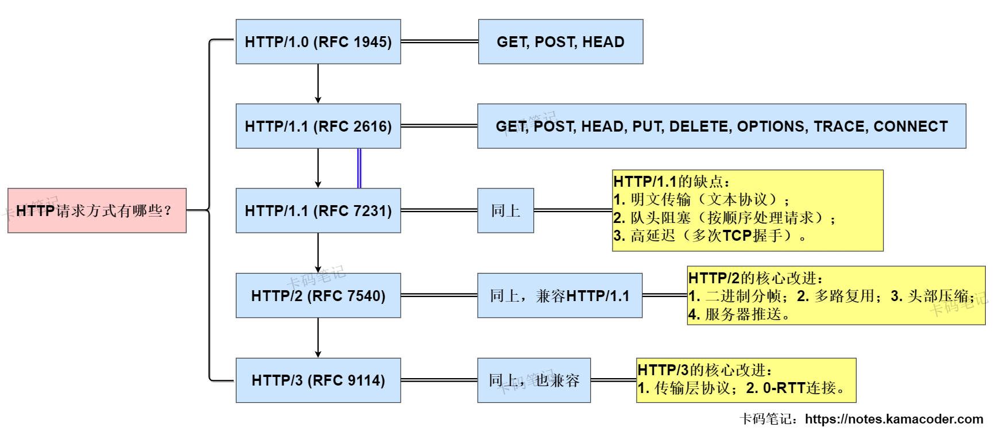
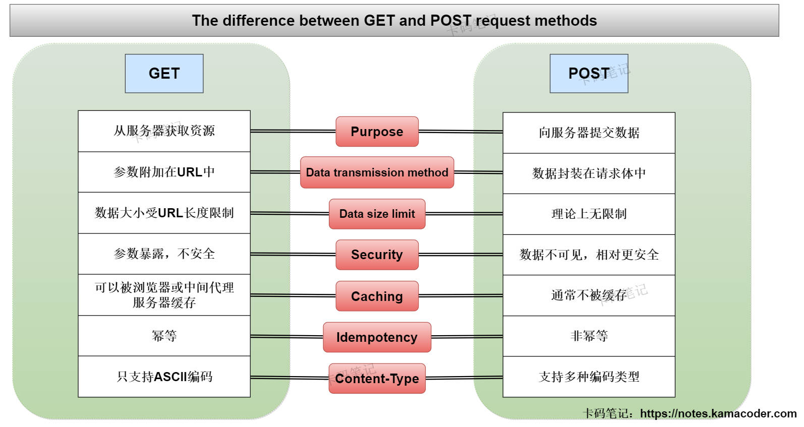

# 26.1.22海康威视面经

> 来源: https://notes.kamacoder.com/interview/java/hikvision-interview-1-22.html

# `# 26.1.22海康威视面经 

## `# java常见注解有哪些？ 
  - 我经常使用的注解就是Spring框架的核心注解，比如使用 **@Autowired** 进行依赖注入， **@Component** 进行组件注册，使用 **@Controller/@Service/@Repository** 进行控制器、服务、数据访问对象注册；在进行接口映射时使用 **@RequestMapping/@GetMapping/@PostMapping** 注解；   - 我还会用到Java的原生注解，如使用 **@Override**用于重写方法， **@Deprecated** 用于标记方法或类已过时；在Junit测试时使用 **@Test**进行测试。 

## `# autowired和resource区别？ 
  - @Autowired是Spring的原生注解，默认会按类型匹配注入，且@Autowired必须找到匹配的bean，否则会报错。   - @Resource是JDK注解，是优先按照名称匹配的，如果想按照类型匹配需要指定type属性。 

## `# Java常见集合类有哪些？ 
  - Java集合可以分为**Collection**和**Map**两类。Collection是单列集合，用于存储单个角色，主要子接口有**List、Set和Queue**，其中List是有序可重复的，常见的实现类有ArrayList、Vector和LinkedList；Set是无序不可重复的，常见的实现类有HashSet、TreeSet和LinkedHashSet；Queue是先进先出的队列，常见的实现类有PriorityQueue。   - Map是双列集合，用于存储键值对，键唯一，值可重复。常见的实现类有**HashMap、TreeMap、Hashtable还有ConcurrentHashMap**。 

## `# array和arrayList区别? 
  - Array是**数组**，是Java的数据结构，数组长度在初始时固定，只能存储基本类型和引用类型，且只有length属性。   - ArrayList是**集合框架的实现类**，可以进行动态扩容，只能存储引用类型，基本类型需要转换为包装类，ArrayList还提供了add()/remove()/contains()等多种方法。 

## `# 哪些集合是线程安全的？ 
  - 传统的旧集合是线程安全的，如Vector、Hashtable、Stack等，这些类的内部方法都使用了synchronized关键字进行同步。   - JUC包下的并发集合类也是线程安全的，并发的List有**CopyOnWriteArrayList** ，是ArrayList的线程安全的变体，通过对底层数组进行复制实现线程安全；并发的Set有**CopyOnWriteArraySet**和**ConcurrentSkipListSet**，是线程安全的集合实现；并发的Queue有**ConcurrentLinkedQueue**，通过CAS实现高并发下的高性能；除此之外还有并发的Deque，包含**LinkedBlockingDeque**和**ConcurrentLinkedDeque**。并发的Map有**ConcurrentHashMap**，ConcurrentHashMap比Hashtable高效，且通过分段锁、CAS等机制实现；   - Collections工具类的synchronizedXXX()方法也可以把非线程安全集合包装成线程安全的集合，但是性能不如JUC的集合。 

## `# mybatis有哪些标签？ 
  - Mybatis有**核心配置标签**如< configuration >（根标签）、< environments >（环境配置标签）、< mappers >（映射器配置标签）等；还有**Mapper映射文件标签**如< select >/< insert >/< update >/< delete >用于基础的CRUD操作，还可以使用< sql >标签定义可重复使用的SQL片段，< resultMap >标签定义结果映射，< parameterMap >标签定义参数映射等。 

## `# http有哪些请求？ 

 
  - 常用的核心请求方法有GET，POST，PUT，DELETE四种，其中**GET**用于获取资源，多次执行相同的请求返回的结果一致，满足幂等性；**POST**请求可以提交资源，非幂等；**PUT**请求进行资源更新和全量替换，是幂等的；**DELETE**删除资源，也是幂等。   - 除此之外还有**PATCH**，可以部分更新资源，**HEAD**只返回响应头，与GET类似但无响应体、**OPTIONS**用于查询服务器支持的请求方法、**TRACE**回显请求，常用于测试。 

## `# get和put区别？ 

 
  - GET是获取服务器资源，只获取而不会修改服务器数据，且参数一般拼在URL里，因此请求长度有限制，GET请求还可以被缓存。   - PUT则是全量更新服务器上的资源，比如更新用户信息，会修改服务器数据，参数会放在请求体里，所以支持大体积数据，PUT一般不缓存。 

## `# springboot自动装配是通过哪个注解开启的？ 
  - SpringBoot是通过@SpringBootApplication注解中的 **@EnableAutoConfiguration** 触发自动配置，借助SpringFactoriesLoader加载META-INF/spring.factories中的自动配置类；通过条件注解（如@ ConditionalOnClass）筛选出符合当前环境的配置类后，向IoC容器注入默认Bean；同时遵循 “自定义优先” 原则，开发者可手动配置Bean或禁用自动配置类，覆盖默认行为，最终实现 “按需配置、简化开发” 的目标。 

## `# MongoDB有了解过吗？ 
  - 我了解过MongoDB的基础使用，它是**文档型的NoSQL数据库**，存储**BSON格式的文档**，没有表结构约束，灵活性比较高。MongoDB**在高负载的情况下支持水平扩展和高可用**，可以很方便地添加更多的节点或实例，在许多场景下可以替代传统的关系型数据库，为Web应用提供可扩展的高可用、高性能数据存储解决方案。   - 我使用过它的CRUD操作，比如使用MongoTemplate做数据操作；了解它支持的多种索引类型，有单字段索引、复合索引、多键索引、文本索引、地理位置索引等；还有聚合查询、分片集群等高可用方案；在项目中用它存储非结构化/半结构化数据，在读写高并发的情况下比MySQL的性能高，但是在事务支持方面不如关系型数据库。 

## `# springcloud有了解过吗？ 

 
  - SpringCloud是基于SpringBoot的微服务治理框架，提供微服务架构中的组件。常见的组件有服务注册与发现(Eureka/Nacos)、负载均衡(Ribbon/OpenFeign)、服务熔断降级(Hystrix/Sentinel)、网关(Zuul/Gateway)、配置中心等等。   - 微服务的核心思路是把单体应用拆成多个独立服务，通过SpringCloud的组件解决服务通信、治理、监控等问题。 

## `# git常用命令？ 
  - 我经常使用的Git命令可以分为几类，**基础的操作**比如使用git init初始化仓库、git clone进行仓库克隆、git add进行暂存和git commit进行提交、git pull/push进行代码的拉取或推送等；   - 关于**分支操作**我会使用git branch查看/创建分支、git checkout切换分支、git merge合并分支；   - 需要**版本管理**时，git log可以查看提交日志、git reset --hard可以进行版本的回退，还有git status可以查看当前的文件状态，git fetch拉取远程分支的信息。 

## `# 创建线程的方法？ 
  - Java中创建线程可以**继承Thread类**,重写run()方法，随后调用start()方法启动线程。   - 可以**实现Runnable接口**，实现run()方法后会将实例传给Thread构造器，再调用start()方法启动线程。   - 可以**实现Callable接口**（配合Future/FutureTask），实现call()方法，能够有返回值并抛出异常。   - 在实际开发时会使用**线程池**(Executor框架/ThreadPoolExecutor)管理线程而不手动创建线程，避免频繁创建销毁线程的性能开销。
