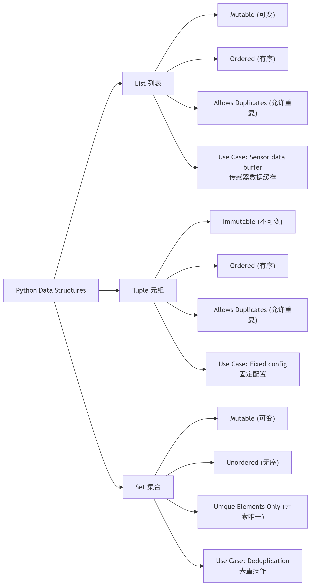
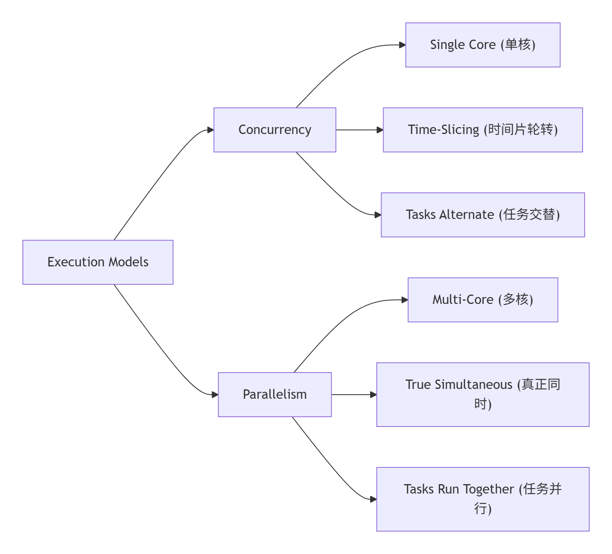
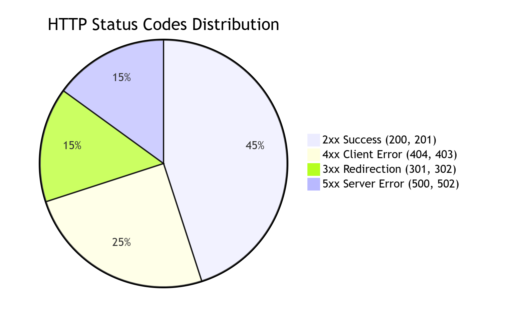

# Baidu Test Interview

> 来源: https://notes.kamacoder.com/interview/cpp/baidu-test-interview.html

# `# Baidu Test Interview 

## `# 百度测试开发一面面经 

#### `# **1. 你在 Python 开发过程中，用到的模块或者包有哪些？他们有什么功能？常用的包？还有文件读取啊，网络请求之类的包有哪些？**（简历中有python项目） 

在 Python 开发中，我常用以下模块/包： 

**（1）常用基础包：** 
  - **`numpy`**：用于科学计算，提供高效的多维数组（`ndarray`）和矩阵运算。   - **`pandas`**：用于数据处理和分析，提供 `DataFrame`和 `Series`数据结构，支持 CSV/Excel 等文件读写。   - **`matplotlib`/ `seaborn`**：用于数据可视化，绘制折线图、柱状图、热力图等。   - **`OpenCV`**：用于计算机视觉任务，如图像处理、边缘检测、目标检测等。   - **`PyQt5`**：用于 GUI 开发，构建桌面应用程序（如我的 **AI 智能体数学系统** 项目）。 

**（2）文件读取相关：** 
  - **`open()`（内置函数）**：用于读取/写入文本文件（如 `.txt`）。   - **`pandas.read_csv()`/ `pandas.read_excel()`**：用于读取 CSV/Excel 文件（如我的 **AI 智能体数学系统** 项目）。   - **`with open()`**：推荐方式，自动管理文件资源（如 `with open('data.txt', 'r') as f:`）。 

**（3）网络请求相关：** 
  - **`requests`**：用于发送 HTTP 请求（GET/POST），常用于 API 调用（如爬虫或 Web 服务交互）。   - **`urllib`（内置库）**：Python 自带的 URL 处理模块，但 `requests`更易用。 

**（4）其他常用包：** 
  - **`os`/ `sys`**：用于操作系统交互（如文件路径、命令行参数）。   - **`json`**：用于 JSON 数据解析（如 API 返回的数据）。   - **`threading`/ `multiprocessing`**：用于多线程/多进程编程（如并发任务）。  

**2. Python 中的元组（tuple）、列表（list）、集合（set）这三个有什么区别？基础概念介绍一下？**（简历中有python项目） 

| **数据结构**  **可变性**  **有序性**  **唯一性**  **适用场景** 
| **列表（list）**  **可变**（可增删改）  **有序**（索引访问）  **允许重复**  存储可变数据（如传感器数据缓存） 
| **元组（tuple）**  **不可变**（创建后不能修改）  **有序**（索引访问）  **允许重复**  存储固定数据（如配置参数、坐标点） 
| **集合（set）**  **可变**（但元素不可变）  **无序**  **唯一**（自动去重）  去重、集合运算（如交集、并集） 

**（1）列表（list）** 
  - **特点**：可动态增删改，用 `[]`定义，如 `my_list = [1, 2, 3]`。   - **适用场景**：存储可变数据（如传感器数据缓存、动态列表）。 

**（2）元组（tuple）** 
  - **特点**：创建后不可修改，用 `()`定义，如 `my_tuple = (1, 2, 3)`。   - **适用场景**：存储固定数据（如配置参数、坐标点 `(x, y)`）。 

**（3）集合（set）** 
  - 

**特点**：无序、唯一（自动去重），用 `{}`或 `set()`定义，如 `my_set = {1, 2, 3}`。   - 

**适用场景**：去重（如 `list(set(my_list))`去重）、集合运算（如 `set1 & set2`求交集）。 

图解如图所示 


  

**C++ 相关问题** 

**3. 两个列表（如 `std::vector`）要合并应该怎么操作？** 

在 C++ 中，可以使用 `std::vector`的 `insert()`方法合并两个列表： 

```
#include <vector>
using namespace std;

int main() {
    vector<int> list1 = {1, 2, 3};
    vector<int> list2 = {4, 5, 6};

    // 合并 list2 到 list1
    list1.insert(list1.end(), list2.begin(), list2.end());

    // 现在 list1 = {1, 2, 3, 4, 5, 6}
    return 0;
}

```

 

**方法**：`list1.insert(list1.end(), list2.begin(), list2.end())`  

**4. 使用线程实现的？还是协程实现的？** 
  - **线程（Thread）**：在 C++ 中，通常使用 `std::thread`（C++11 引入）实现多线程。   - **协程（Coroutine）**：C++20 引入了 `std::coroutine`，但更常见的协程库是 **Boost.Coroutine** 或 **第三方库（如 libco）**。 

**我的项目（如多线程传感器数据采集）通常使用 `std::thread`。**  

**5. 一个项目需要用到多线程的话？为什么要用到多线程？** 

**原因**： 
  - **提高 CPU 利用率**：如 **传感器数据采集 + 数据处理** 可以并行执行。   - **避免阻塞**：如 **UI 线程（主线程）** 不被耗时任务（如网络请求）卡住。   - **提高吞吐量**：如 **多线程下载** 比单线程更快。 

**我的项目（如 **共下注浆监测系统**）使用多线程处理传感器数据存储和显示。**  

**6. 多线程有什么好处？并发有什么好处？** 

| **多线程**  **并发（Concurrency）** 
| **多个线程同时执行**（可能真正并行，取决于 CPU 核心数）  **多个任务交替执行**（单核 CPU 也能实现） 
| **提高计算密集型任务速度**（如矩阵运算）  **提高 I/O 密集型任务响应速度**（如网络请求 + UI 更新） 
| **适用于 CPU 密集型任务**  **适用于 I/O 密集型任务** 

**好处**： 
  - **多线程**：提高计算速度（如 **深度学习推理**）。   - **并发**：提高响应速度（如 **Web 服务器处理多个请求**）。 

图解如下 


  

**7. 操作系统中，并发和并行有什么区别？多线程和多进程有什么区别？** 

| **概念**  **区别** 
| **并发（Concurrency）**  **多个任务交替执行**（单核 CPU 也能实现，如时间片轮转） 
| **并行（Parallelism）**  **多个任务真正同时执行**（需要多核 CPU） 
| **多线程（Multithreading）**  **同一进程内的多个线程**（共享内存，通信快，但可能竞争资源） 
| **多进程（Multiprocessing）**  **多个独立进程**（内存隔离，更安全，但通信成本高） 

**区别**： 
  - **并发**：单核 CPU 也能实现（如 **Python 的 `asyncio`**）。   - **并行**：需要多核 CPU（如 **C++ `std::thread`在多核 CPU 上真正并行**）。   - **多线程**：共享内存，适合 **计算 + I/O 混合任务**（如 **传感器数据采集 + 显示**）。   - **多进程**：内存隔离，适合 **独立任务**（如 **多个 AI 模型并行推理**）。  

**8. 算法有哪些？每一种的时间空间复杂度是多少？底层原理是什么？底层数据结构是什么？** 

**常见算法及复杂度**： 

| **算法**  **时间复杂度**  **空间复杂度**  **底层数据结构**  **适用场景** 
| **快速排序（QuickSort）**  O(n log n)（平均）  O(log n)（递归栈）  数组  排序 
| **Dijkstra（最短路径）**  O((V+E) log V)  O(V)  优先队列 + 图  图算法 
| **二分查找（Binary Search）**  O(log n)  O(1)  有序数组  查找 
| **BFS（广度优先搜索）**  O(V+E)  O(V)  队列 + 图  图遍历 
| **DFS（深度优先搜索）**  O(V+E)  O(V)  栈 + 图  图遍历 

**底层原理**： 
  - **排序算法**（如 QuickSort）依赖 **分治思想**。   - **图算法**（如 Dijkstra）依赖 **优先队列（堆）**。   - **查找算法**（如二分查找）依赖 **有序数据**。  

**9. 关于 Linux 操作系统都干了什么？用 Linux 使用过哪些指令？常见指令有哪些？** 

**（1）我在 Linux 下的开发经历：** 
  - **交叉编译 STM32 程序**（使用 `arm-none-eabi-gcc`）。   - **运行 ROS1 仿真（Gazebo/Rviz）**（Ubuntu 20.04）。   - **使用 Git 管理代码**（`git clone`, `git commit`）。   - **运行 Python/PyQt5 程序**（`python3 app.py`）。 

**（2）常用 Linux 指令：** 

| **指令**  **用途** 
| `ls`  查看目录内容 
| `cd`  切换目录 
| `grep`  文本搜索 
| `find`  查找文件 
| `chmod`  修改文件权限 
| `ps -aux`  查看进程 
| `kill -9 PID`  强制终止进程 
| `top`/ `htop`  查看 CPU/内存使用情况 
| `vim`/ `nano`  文本编辑 
| `scp`  远程文件传输  

**10. 查看一个进程？如果是特定的进程呢？** 
  - 

**查看所有进程**： 

```
ps -aux  # 查看所有进程
top      # 动态查看进程

```

    - 

**查看特定进程（如 `python3`）**： 

```
ps -aux | grep python3  # 查找 python3 进程
pidof python3           # 直接获取 PID

```

    - 

**终止进程**： 

```
kill -9 PID  # 强制终止

```

   

**11. 关于设计的问题，如果给出一个百度搜索框，给你一个搜索页面，你如何去设计它的测试用例？详细一些。** 

**（1）功能测试**： 
  - **输入正常关键词**（如 "C++ 多线程"）→ 检查是否返回相关结果。   - **输入空搜索** → 检查是否提示 "请输入关键词"。   - **输入特殊字符**（如 `@#$%`）→ 检查是否过滤或正常搜索。   - **输入超长关键词**（如 1000 字符）→ 检查是否截断或报错。 

**（2）性能测试**： 
  - **高并发搜索**（1000 用户同时搜索）→ 检查响应时间（应 < 1s）。   - **慢速网络**（模拟 3G）→ 检查是否加载超时。 

**（3）兼容性测试**： 
  - **不同浏览器**（Chrome/Firefox/Safari）→ 检查 UI 是否正常。   - **不同设备**（PC/手机/平板）→ 检查响应式布局。 

**（4）安全性测试**： 
  - **SQL 注入**（输入 `' OR 1=1 --`）→ 检查是否防注入。   - **XSS 攻击**（输入 `<script>alert(1)</script>`）→ 检查是否过滤。 

**（5）HTTP 状态码测试**： 

| **状态码**  **含义** 
| **200 OK**  请求成功 
| **301/302**  重定向 
| **404 Not Found**  页面不存在 
| **500 Internal Error**  服务器错误 

图解 


 

**测试用例示例**： 

| **测试场景**  **输入**  **预期结果** 
| 正常搜索  "C++ 多线程"  返回相关搜索结果 
| 空搜索  ""  提示 "请输入关键词" 
| 特殊字符  "@#$%"  正常搜索或过滤 
| 超长输入  1000 字符  截断或正常处理  

14.当打开网页出现 **HTTP 404 Not Found** 错误时，表示服务器无法找到您请求的页面。以下是 **可能的原因及对应的解决方案**，涵盖技术层面和用户自查步骤：  

#### `# **a)404 错误的常见原因** 

**1. URL 输入错误（用户侧）** 
  - **原因**：手动输入的网址拼写错误（如漏掉 `/`、大小写错误、多写了字符）。   - **示例**：

    - 正确：`https://example.com/page`     - 错误：`https://example.com/pag`（少一个字母）或 `https://example.com/PAGE`（大小写敏感）。 

**2. 页面已被删除或移动（网站侧）** 
  - **原因**：

    - 网站管理员删除了该页面，但未设置重定向（Redirect）。     - 页面从旧路径（如 `/old-blog`）迁移到新路径（如 `/new-blog`），但旧链接未更新。 

**3. 服务器配置问题** 
  - **原因**：

    - 服务器的 **Nginx/Apache** 配置错误，导致路由映射失败。     - 动态生成的页面（如 PHP/Python 后端）因数据库记录丢失返回 404。 

**4. 缓存或 CDN 问题** 
  - **原因**：

    - 浏览器缓存了旧的 404 页面，或 CDN（如 Cloudflare）未同步最新内容。 

**5. 权限或路径限制** 
  - **原因**：

    - 服务器设置了权限规则（如 `.htaccess`文件），阻止访问特定路径。     - 文件实际存储路径与 URL 映射不一致（如网站根目录变更）。  

#### `# **b)解决方案** 

**1. 用户自查步骤** 
  - **检查 URL 拼写**：重新确认网址是否正确（注意大小写、特殊符号）。   - **尝试搜索引擎**：在 Google/Bing 搜索页面标题或关键词，看是否能找到有效链接。   - **清除浏览器缓存**：

    - **快捷键**：`Ctrl + Shift + Del`（Windows）或 `Cmd + Shift + Delete`（Mac）→ 清除缓存和 Cookie。 

**2. 网站管理员排查** 
  - 

**验证文件是否存在**： 
    - 登录服务器，检查请求的路径（如 `/var/www/html/page.html`）是否真实存在。     - 使用命令：`ls -l /path/to/page`（Linux）或直接在文件管理器查找。   - 

**检查服务器日志**： 
    - **Nginx/Apache 日志**：定位 404 请求的详细信息（路径、IP、时间）。

      - Nginx 日志路径：`/var/log/nginx/error.log`       - Apache 日志路径：`/var/log/apache2/error.log`   - 

**设置 301/302 重定向**（如果页面已移动）： 
    - 

**Nginx 配置示例**： 

```
location /old-page {
    return 301 /new-page;  # 永久重定向
}

```

      - 

**Apache 配置示例**（`.htaccess`文件）： 

```
Redirect 301 /old-page /new-page

```

    - 

**修复动态路由**（如 CMS 系统）： 
    - 如果是 WordPress/Drupal 等系统，检查数据库中的页面记录是否被误删。 

**3. 高级排查** 
  - **检查 CDN 缓存**：

    - 如果使用了 Cloudflare/Akamai，清除 CDN 缓存或暂时禁用 CDN 测试。   - **测试服务器配置**：

    - 使用 `curl -I http://yourdomain.com/page`查看 HTTP 响应头，确认是否返回 404。   - **联系主机提供商**：

    - 如果是共享主机，可能是服务器端路径配置错误，需联系技术支持。 

## `# 面试**总结** 

有一说一我觉得百度一面挺基础的，并且对软开的项目特别感兴趣（我简历中的嵌入式项目细节一点没问），所以这些互联网大厂还是挺看重coding能力的，当时我的并发并行这个八股文没有答上来，快速排序的底层原理答错了。 

跟**Python**有关的，要熟悉 `numpy/pandas/requests`这些常用的库，里面的有哪些指令，理解 **元组/列表/集合** 区别等之类的基础概念；**C++**相关的：熟悉 **多线程/进程、Linux 指令、算法复杂度、HTTP 状态码**等相关知识，还有跟操作系统的相关的，问的比较多；与**试开发**有关的问题，要了解 **功能/性能/安全测试用例**，理解 **HTTP 协议**，面试官会追问，当时就问我了如果打开一个网页出现了404,可能是哪些原因导致的，以及该怎么解决，问的还是挺细的。
