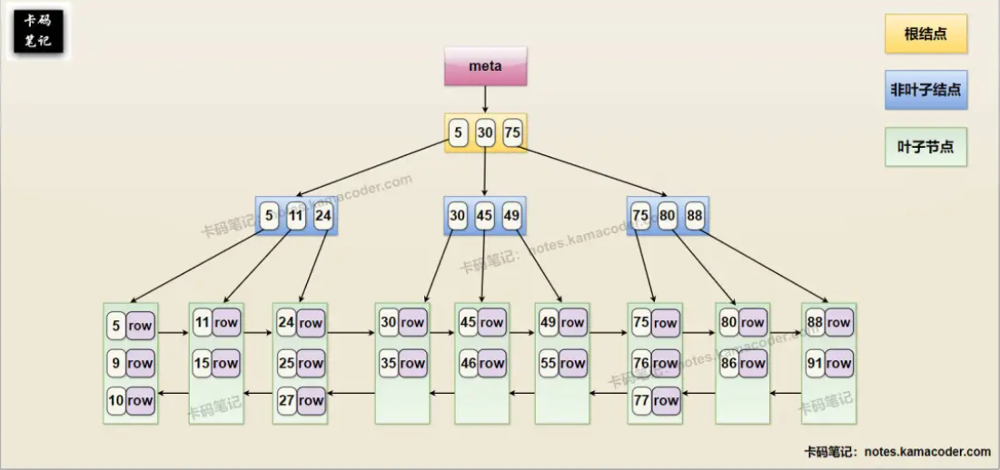
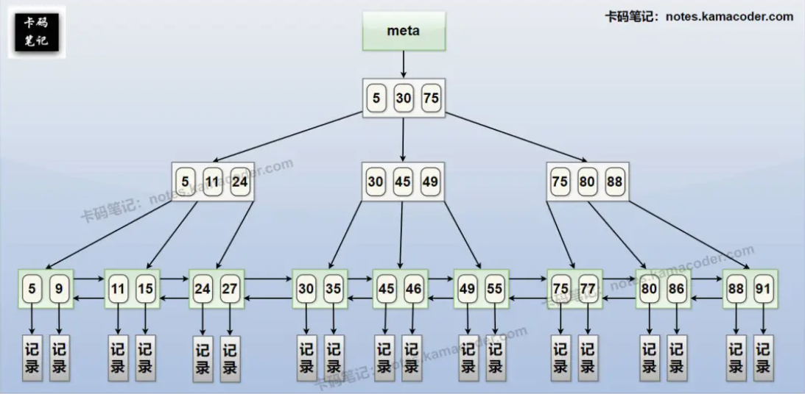
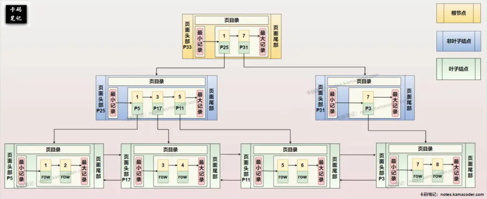

# Bytedance Interview 2

> 来源: https://notes.kamacoder.com/interview/cpp/bytedance-interview-2.html

# `# Bytedance Interview 2 

## `# 1.你是怎么学习的，有学习过计算机的那些基础吗？（因为我是材料专业的，转码可能觉得基础不太行） 

答： 

系统学习计算机四大基础：数据结构与算法、操作系统、计算机网络、数据库 

通过在线课程+实践项目+开源贡献构建完整知识体系 

## `# 2.你们专业是做啥的，为啥学计算机？ 

答： 学计算机的原因：对编程的热爱+计算机的创造力+行业发展前景 

交叉优势：材料计算+数据驱动的材料研发经验 
  - 

专业核心内容： 
    - 材料计算：使用分子动力学、第一性原理计算     - 材料信息学：机器学习预测材料性能     - 实验科学：材料制备、表征、性能测试   - 

转行计算机的契机： 

a) 科研中的发现： 
    - 处理TB级材料模拟数据时，需要编写高效数据处理程序     - 意识到算法和系统设计对科研效率的关键影响 

b) 兴趣驱动： 
    - 享受解决复杂系统问题的成就感     - 喜欢从零构建可运行系统的创造力     - 开源社区"众人拾柴火焰高"的协作文化吸引我 

c) 职业规划： 
    - 计算机技术的普适性和影响力     - AI for Science的交叉领域前景     - 希望用技术解决实际社会问题 

## `# 3.你做的最好的项目是哪个，讲一下？（我选的cmu15445 2024，我建议各位可以打一打排行榜，我当时排名前几，然后他就问我怎么优化的？和现在主流的数据库内核相比有啥区别） 

答： 我选的cmu15445 2024 

项目：CMU 15-445 2024版本BusTub数据库 

优化：实现**buffer pool、B+树索引、查询优化、并发控制** 

**详细回答： ** 

**项目架构与实现：** 
  - 

**存储管理**（Storage Management）：-**Buffer Pool：LRU-K替换策略，实现并发安全的页管理** 
    - **磁盘管理器**：实现可扩展的文件格式，支持页的分配/回收     - **行存储**：实现slot-based页格式，支持变长记录   - 

**索引系统**（Indexing）： 
    - **B+树索引：实现线程安全的B+树，支持并发插入/删除**     - **支持范围查询、等值查询**     - **实现迭代器接口，支持扫描**   - 

**查询执行**（Query Execution）： 
    - **火山模型执行引擎**     - **实现选择、投影、连接、聚合等算子**     - **基于代价的查询优化**（Cardinality Estimation）   - 

**并发控制**（Concurrency Control）： 
    - **实现两阶段锁（2PL）协议**     - **支持多种隔离级别**     - 实现死锁检测和预防 

**关键优化与调优**： 
  - 

**Buffer Pool优化**： 
    - **实现LRU-K替换策略（K=2），比传统LRU更好的局部性**     - **预取优化：顺序扫描时异步预取相邻页**     - **批量刷脏：减少I/O次数**   - 

**B+树优化**： 
    - **实现乐观锁机制，减少锁竞争**     - 批量加载（Bulk Loading）：加速索引构建     - **前缀压缩：减少索引大小**   - 

**查询优化**： 
    - **统计信息收集：直方图维护**     - **连接顺序优化：基于动态规划**     - 谓词下推：尽早过滤数据   - 

**并发优化**： 
    - **锁粒度优化：页锁 vs 记录锁**     - **锁升级机制：减少锁开销**     - 多版本并发控制（MVCC）原型实现 

教学价值与工业启示： 
  - **BusTub的价值在于理解数据库核心原理**   - **工业数据库需要考虑：数据安全、性能监控、备份恢复**   - 但核心思想相通：ACID、查询优化、存储管理 

通过这个项目，我不仅学会了**如何实现数据库，更重要的是理解了为什么这样设计**，这是阅读源码无法获得的深度理解。 

区别：教学**数据库注重概念清晰**，工业数据库考虑生产环境复杂度 

## `# 4.为啥innodb要选B+树呢？这个“+”到底加在哪儿了？ 

答： 

B+树的"+"体现在：**所有数据在叶子节点，形成链表结构** 

优势：**适合磁盘I/O、支持范围查询、树高度低、查询稳定** 

**详细回答:** 

**B+树是B树的变体**，其核心改进在于： 
  - 

**结构特点**（"+"的含义）：
a) **数据全在叶子节点**： 
    - **B树：键和数据分布在所有节点**     - **B+树：只有叶子节点存储数据，内部节点只存键** 

b) **叶子节点形成链表**： 
    - **所有叶子节点通过指针连接**     - **支持高效的范围查询和全表扫描** 

c) **更高的扇出**（Fan-out）： 
    - 内部**节点只存键，不存数据**     - **每个节点能存储更多键**，**树更矮**   - 

为什么**适合数据库索引**：
a) **磁盘I/O友好**： 
    - 每次磁盘读取一页（通常4KB/16KB）     - B+树节点大小=磁盘页大小，一次I/O读一个节点     - 树高通常3-4层，3次I/O可访问千万级数据 

b) **查询性能稳定**： 
    - 任何查询都要走到叶子节点     - 时间复杂度稳定在O(log n) 

c) **范围查询高效**： 
    - 叶子节点链表支持顺序扫描     - 不需要回到根节点重新查找 

d) **适合固态硬盘**（SSD）： 
    - SSD随机读快，但顺序读仍优于随机读     - B+树的顺序扫描特性仍有益   - 

**与其他数据结构的对比**：
a) vs 哈希表： 
    - **哈希：O(1)等值查询，但不支持范围查询**     - **B+树：支持等值和范围查询** 

b) vs **跳表**（Skip List）： 
    - **跳表：内存友好，实现简单**     - **B+树：磁盘友好，工业验证成熟** 

c) vs **LSM树**（Log-Structured Merge-Tree）： 
    - **LSM树：写优化，适合写多读少**     - **B+树：读优化，适合读多写少**     - InnoDB选择B+树因为OLTP读多   - 

实际优化：
a) **页结构优化**： 
    - 页内二分查找     - 页目录（Page Directory）加速 

b) **自适应哈希索引**： 
    - 自动为热点页创建哈希索引     - 内存中加速，不持久化 

c) **更改缓冲区**（Change Buffer）： 
    - **延迟非唯一索引更新** -** 减少随机I/O** 

```
B树结构（对比用）：
        [20|50]
       /   |   \
[10|15] [30|40] [60|70|80]
 数据     数据      数据

B+树结构（InnoDB使用）：
        [20|50]           &lt;- 内部节点只存键
       /   |   \
[10|15|→] [20|30|→] [50|60|→]  &lt;- 叶子节点存数据+链表指针
  ↓         ↓         ↓
[数据]     [数据]     [数据]

```

 

查询过程（查找35）： 
  - **读根节点[20|50]，35在20-50之间，到第二个子节点**   - **读内部节点[20|30|40]，35在30-40之间**   - **读叶子节点[30|35|40]，找到35对应的数据**   - **范围查询[30-50]：找到30后沿链表遍历即可** 
  - 图解 
  - MySQL InnoDB的 B+树索引（主键，聚簇索引） ， 示意图如下：

   - MySQL Innodb的 B+树索引（二级索引，非聚簇） ，示意图如下：

   - InnoDB 存储引擎在页面 (Page) 级别实现的 B+ 树索引结构，示意图如下：
 

## `# 5.raft算法选举？任期作用？超时随机作用？ 

简要回答： 

**选举**：**节点超时后成为候选者，请求投票，获得多数票成为领导者** 

**任期**：**逻辑时钟，保证选举安全性**，识别过时消息 

**超时随机**：**避免选举分裂，提高系统可用性** 

详细回答： 

Raft选举机制详解： 
  - 

**节点状态**： 
    - **Leader：处理所有客户端请求，复制日志**     - **Follower：被动响应Leader和Candidate**     - **Candidate：选举中的临时状态**   - 

**选举流程**：
a) **触发选举**： 
    - **Follower在选举超时内未收到Leader心跳**     - **转为Candidate，任期+1，给自己投票** 

b) **请求投票**： 
    - **向所有节点发送RequestVote RPC**     - **参数：任期、最后日志索引和任期** 

c) **投票规则**： 
    - 每个任期内每个节点只能投一票     - 候选人的日志必须至少和投票者一样新     - 获得超过半数选票则当选Leader 

d) **选举结果**： 
    - 当选：发送心跳确立领导地位     - 失败：收到更高任期，转为Follower     - 平局：重新选举（超时随机性避免活锁）   - 

**任期（Term）机制**：
a) 作用： 
    - 逻辑时钟，识别过期信息     - 保证每个任期最多一个Leader     - 解决网络分区后的脑裂问题 

b) 规则： 
    - 每个任期以选举开始     - 任期内节点只认一个Leader     - 消息携带任期，小的任期服从大的 

c) 任期变化： 
    - 每次选举开始新任期     - Leader定期发送心跳维持任期     - 节点发现更高任期立即转为Follower   - 

**超时随机性**：
a) 选举超时（Election Timeout）： 
    - 范围：150ms~300ms（典型值）     - 每个节点独立随机     - 超时后开始选举 

b) 心跳超时（Heartbeat Timeout）： 
    - 通常50ms~100ms     - Leader定期发送心跳 

c) 随机性的重要性： 
    - 避免多个Follower同时成为Candidate     - 减少选举冲突概率     - 快速选出Leader，提高可用性   - 

**安全性保证：**
a) 选举限制（Election Restriction）： 
    - **只投票给日志至少和自己一样新的Candidate**     - 保证Leader包含所有已提交日志 

b) 日志匹配特性（Log Matching）： 
    - **如果两个日志条目有相同索引和任期，则内容相同**     - 如果条目在不同日志中的前一个日志条目相同，则本条目也相同 

## `# 6.有团队合作经验吗？用过github吗，能发我看一下吗？ 

答：有
GitHub活动亮点： 
  - 

开源贡献：
a) **大型项目贡献**： 
    - Redis：修复内存泄漏问题（PR）     - **CMU 15-445：优化测试用例，被课程采纳** 

b) 个人开源项目： 
    - mini-redis：教学用Redis实现，300+ stars     - db-tutorial：**数据库系统实现教程**   - 

技术博客： 
    - 基于GitHub Pages + Jekyll     - 涵盖：数据库内核、分布式系统、算法   - 

团队合作经验：
a) 开源协作流程： 
    - **Fork & Pull Request工作流**     - 详细的**PR描述和测试用例**     - **Code Review：给予和接受反馈** 

b) 项目管理： 
    - 使用**GitHub Projects管理任务**     - **Milestone和Issue跟踪进度**     - **CI/CD自动化测试和部署** 

c) 协作规范： 
    - **Commit Message规范**（Conventional Commits）     - **分支管理策略**（Git Flow/GitHub Flow）     - **代码质量工具**（ESLint、Prettier）   - 

可展示的项目：
a) **数据库相关**： 
    - **busTub-db：完整的数据库实现**     - **distributed-kv：基于Raft的分布式KV存储**     - **sql-optimizer：查询优化器实现** 

b) **系统编程**： 
    - mini-os：简易操作系统内核     - tcp-stack：用户态TCP协议栈     - thread-pool：高性能线程池 

c) **工具类**： 
    - code-profiler：性能分析工具     - test-framework：单元测试框架     - config-center：配置中心 

## `# 7.算法，给你一个字符串，例如"192168101"，划分成合法的IP地址，输出所有的情况（dfs枚举一下即可） 

答： 这是一个典型的回溯问题，可以用DFS解决
。
IP地址有4段，每段1-3位数字，值在0-255之间，不能有前导零。 

我们从左到右尝试分割字符串，维护当前已分割的段数，当分割出4段且用完所有字符时，得到一个有效IP。 

可以提前剪枝：如果剩余字符太多（>3*剩余段数）或太少（<剩余段数），提前返回。 

```
class SolutionOptimized {
public:
    vector<string> restoreIpAddresses(string s) {
        vector<string> result;
        vector<int> dots;  // 存储分隔点的位置

        // 预计算：快速判断数字是否有效
        vector<vector<bool>> valid(s.length(), vector<bool>(4, false));
        for (int i = 0; i < s.length(); i++) {
            for (int len = 1; len <= 3 && i + len <= s.length(); len++) {
                string part = s.substr(i, len);
                if (isValid(part)) {
                    valid[i][len] = true;
                }
            }
        }

        backtrack(s, 0, dots, valid, result);
        return result;
    }

private:
    void backtrack(const string& s, int start, vector<int>& dots,
                   const vector<vector<bool>>& valid, vector<string>& result) {
        // 已经有3个点，检查最后一段
        if (dots.size() == 3) {
            int lastStart = dots.empty() ? 0 : dots.back() + 1;
            int len = s.length() - lastStart;

            if (len >= 1 && len <= 3 && valid[lastStart][len]) {
                // 构建IP地址
                string ip = s;
                for (int i = 2; i >= 0; i--) {
                    ip.insert(ip.begin() + dots[i] + 1, '.');
                }
                result.push_back(ip);
            }
            return;
        }

        // 尝试在当前位置后插入点
        int prevDot = dots.empty() ? 0 : dots.back() + 1;
        for (int len = 1; len <= 3 && prevDot + len <= s.length(); len++) {
            if (!valid[prevDot][len]) continue;

            int dotPos = prevDot + len - 1;
            dots.push_back(dotPos);
            backtrack(s, dotPos + 1, dots, valid, result);
            dots.pop_back();
        }
    }

    bool isValid(const string& part) {
        if (part.empty() || part.length() > 3) return false;
        if (part[0] == '0' && part.length() > 1) return false;

        int num = stoi(part);
        return num >= 0 && num <= 255;
    }
};

```

 

## `# 8.有了解一下哪些新技术？哪些渠道 

答： 

学习新技术：**官方文档 > 技术博客 > 源码 > 论文** 

信息渠道：**Hacker News、技术周刊、开源项目、技术大会** 

重点关注：**AI工程化、云原生、数据库、编程语言** 

比如最近学向量数据库，我的路径是： 
  - 先看Milvus官网文档   - 在本地跑起来试试   - 看源码理解存储结构   - 写博客总结   - 在工作中找应用场景 

这样学得深，也能用得上。
