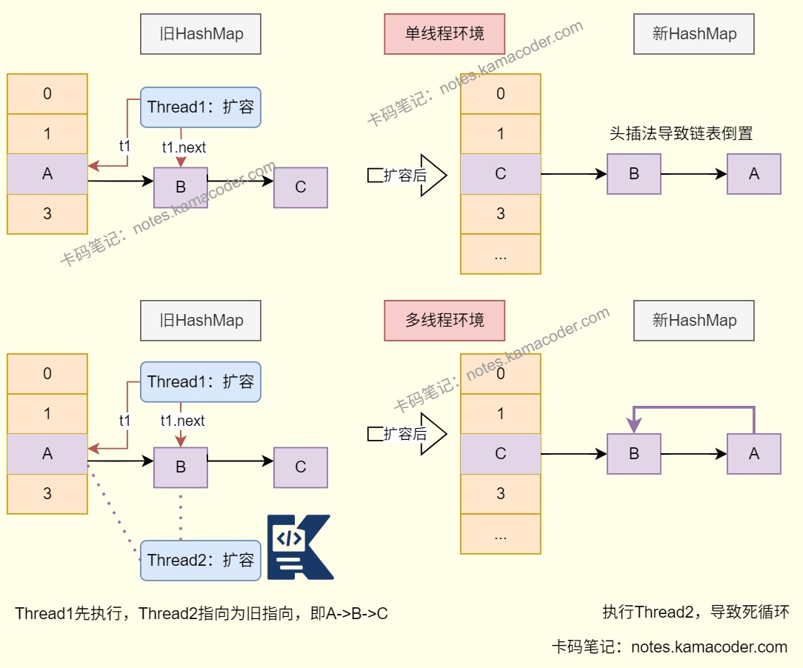

# 字节跳动 Java 二面 面经

> 来源: https://notes.kamacoder.com/interview/java/bytedance-backend-interview-1-10-2.html

# `# 字节跳动 Java 二面 面经 

## `# 怎么监控和优化慢SQL？ 
  - 当出现页面加载过慢或者接口压测响应时间过长时需要检查是否存在慢查询的情况。   - 我一般会通过开启数据库的**慢查询日志**找到慢的Sql，查询SQL的执行时间进行慢SQL筛选。   - 找到慢SQL后就检查SQL语句，可以执行explain语句，观察type字段可以看sql查询数据的方式，全表或者全索引查询会导致查询变慢；key字段可以看到实际使用的索引，判断索引的命中情况；extra字段可以判断是否出现了回表情况，可以尝试添加索引或修改返回字段修复。   - SQL语句还可能有关联表过多或者子查询嵌套过深问题。如果数据量过多，分页查询未优化也会导致查询变慢。   - 如果SQL本身没有问题，可能是数据库的配置不合理或者存在资源瓶颈，可以检查数据库的缓存大小，再看是否有CPU、内存或磁盘IO使用率过高的问题。 

## `# 跳表的原理是啥？ 
  - Redis的Zset对象使用了跳表这种数据结构，跳表是一种**有序的多层索引链表**，在普通有序单链表的基础上建立多级稀疏索引层，最底层是完整的有序数据链表，上层每一级索引都是下一级的部分节点映射；查询时从最顶层索引开始，快速定位数据的区间范围，逐层向下跳转缩小查找范围，最终到原始链表精准匹配；插入和删除时，通过随机算法决定节点的索引层级并同步维护各级索引，保证索引的稀疏性；   - 跳表使用空间换时间，把链表的查询、插入、删除的时间复杂度从O(n)优化到O(logn)。 

## `# HashMap和ConcurrentHashMap在使用场景上有啥区别？ 
  - HashMap适用于单线程下键值对的存储场景，如业务数据临时缓存，通过唯一键快速查询对应值，且有存储null键值的场景。   - ConcurrentHashMap：适用于高并发场景下的键值对存储场景，如多线程读写的缓存，秒杀活动中更新商品库存，能够保证线程安全同时兼顾性能。 

## `# 怎么让HashMap变得线程安全？ 
  - 

HashMap线程不安全：

   - 

在HashMap中有三种常见方式实现线程安全。在HashMap的操作中添加显式锁(如ReentrantLock)可以保证线程安全；或者使用**Collections.synchronizedMap(new HashMap<>())**，通过该方法创建一个线程安全的HashMap对象，底层会对HashMap的所有方法加synchronized关键字以实现线程安全，方法简单但是并发性能较差；也可以使用**ConcurrentHashMap类**，这是专门用于多线程环境中的哈希表实现，JDK1.7是分段锁（Segment数组+ReentrantLock），JDK1.8变为对数组的每个链表头/红黑树根节点加锁使锁的粒度更细，结合CAS和volatile实现线程安全，允许多个线程同时读操作提高并发性能，还能解决HashMap扩容时的死循环问题； 

## `# 实现一个线程池，有哪些要点和方案？ 

 
  - 创建线程池时首先需要考虑线程池参数的合理性，需要关注的参数有**核心线程数**、**最大线程数**、**阻塞队列大小**。   - 需要根据任务类型设置合理的核心线程数，如果是CPU密集型任务核心线程数可以设置为CPU的核心数，充分利用CPU资源；如果是I/O密集型任务，线程大部分时间在等待I/O操作，可以设置大一点的核心线程数，如CPU核心数的2倍；考虑系统的资源限制设置最大线程数，如果过大可能会耗尽系统资源；需要根据场景设置合理的阻塞队列大小，避免队列容量过小任务被拒绝或者过大导致任务等待时间过长；根据实际情况的需求判断任务是否有优先级，可以使用PriorityBlockingQueue作为阻塞队列，实现任务的优先级排序。   - 在编写线程池代码时也需要确保线程池在正确的时机启动和关闭，可以使用shutdown或shutdownNow方法关闭线程池；shutdown会等待执行中的任务完成再关闭线程池，shutdownNow则会尝试中断正在执行的任务，关闭线程池的同时返回尚未执行的任务列表；向线程池提交任务时需要在提交前对任务进行去重，或者在任务本身中增设标志位标识完成情况，避免网络不稳定时浪费线程池资源；如果任务涉及共享资源需要采取同步措施，防止线程池并发执行任务时出现数据不一致或者资源竞争的情况。 

## `# 设计一个评论系统，要支持高并发写入、分页查询、热评展示，还要考虑防刷。 
  - 系统的总体架构可以使用SpringBoot框架，Kafka做消息队列，MySQL做数据库存储，Redis做缓存。   - 实现高并发写入，依靠异步写入、分库分表、缓存实现。客户端提交的评论先写入Kafka消息队列，由后台消费者异步处理，避免高并发写入MySQL；同时给MySQL存储层进行分库分表分散单表数据量和写入压力，解决性能瓶颈；新评论可以优先写入Redis缓存，保证前台可以获取最新评论，兼顾性能与安全。   - 实现分页查询可以使用游标分页，比如使用时间戳+ID的分页方案，避免OFFSET深分页导致的全表扫描问题，保证分页查询效率稳定；   - 热评展示可以使用Redis的Sorted Set数据结构，定义热评计算规则后将score作为排序依据，每次查询时根据score排序返回TopN条数据，实现实时更新的热评展示。   - 设计防刷机制时可以使用**滑动窗口算法**，利用Redis和Lua脚本实现用户ID加IP的滑动窗口限流，限制单个用户/IP在固定时间窗口内的评论次数，避免恶意用户或刷评论行为；还可以设计验证码校验，或者设计异常行为分析，标记风险用户并进行拦截。 

## `# 场景题：100G的数据，怎么找出Top10？ 
  - 我认为应该先使用分治思想，对100G大文件进行**哈希分片切割**，确保相同数据一定在同一个小文件中，并将每个小文件大小控制在内存可处理范围内；然后遍历每一个小文件，使用HashMap进行频次统计，可以为每个小文件创建一个大小等于10的**小顶堆**，遍历哈希表的频次结果后保留当前文件前十的高频数据，压缩数据量；最后将每个小文件的Top10**数据合并**，创建一个大小为10的小顶堆并重新筛选，得到最终结果。 

## `# 算法题 

合并 K 个有序链表
