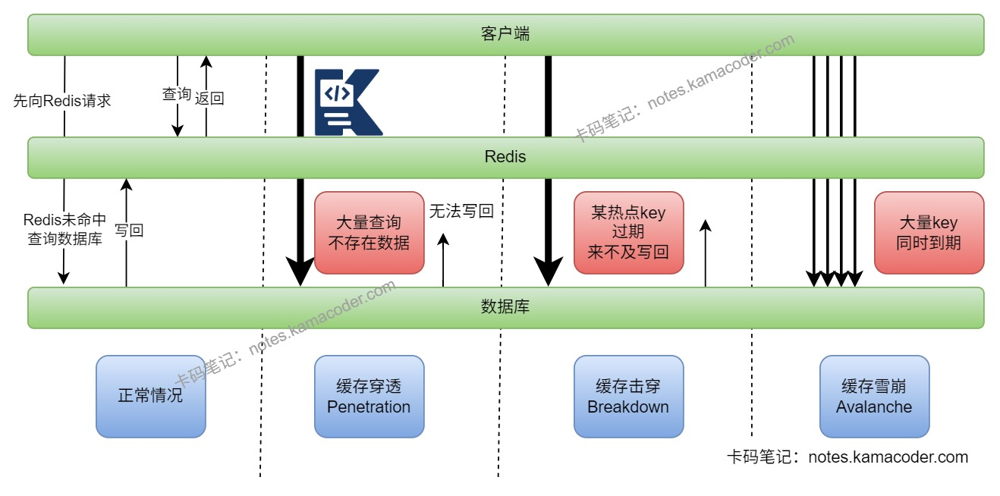

# 小红书 Java 面经

> 来源: https://notes.kamacoder.com/interview/java/xiaohongshu-java-interview-4-3.html

# `# 小红书 Java 面经 

### `# 介绍一下Java线程池？ 
  - Java 线程池本质上是对线程的**复用和统一管理**，核心实现类是 `ThreadPoolExecutor`，它可以避免频繁创建和销毁线程带来的系统开销。   - 使用线程池的好处一是可以**提升性能**，因为线程可以复用；二是**控制并发度**，避免线程无限创建把机器打满；三是**方便统一管理**，比如队列、拒绝策略、线程命名、监控告警。   - 从执行流程来看，任务提交进来后，如果当前线程数小于核心线程数，就先创建核心线程执行；如果核心线程都在忙，就先进入阻塞队列；如果队列满了且线程数还没到最大线程数，就继续创建非核心线程；再放不下就触发拒绝策略。

 

### `# 线程池的核心参数有哪些？ 
  - `ThreadPoolExecutor` 的核心参数一共有七个：**corePoolSize、maximumPoolSize、keepAliveTime、TimeUnit、workQueue、ThreadFactory、RejectedExecutionHandler**。   - **corePoolSize** 是核心线程数，线程池中的线程数如果小于它，会优先创建核心线程；**maximumPoolSize** 是最大线程数，当核心线程满了且队列也满了，才会继续创建非核心线程。   - **keepAliveTime + TimeUnit** 用来控制非核心线程的空闲存活时间；**workQueue** 是任务阻塞队列，用于缓存暂时执行不了的任务。   - **ThreadFactory** 负责创建线程，通常会在这里统一线程命名，方便线上排查；**RejectedExecutionHandler** 是拒绝策略，在线程池和队列都满时决定怎么处理新任务。 

### `# 怎么设计一个线程池？ 
  - 设计线程池时我会先判断任务类型。如果是**CPU 密集型**任务，线程数通常接近 CPU 核数；如果是 **I/O 密集型**任务，线程数可以比 CPU 核数更大一些，因为很多时间线程都在等网络或磁盘。   - 队列一般优先考虑**有界队列**，这样可以限制任务堆积上限，避免流量一上来直接把内存打爆。   - 拒绝策略不能只用默认值糊过去，核心业务我更倾向于自定义拒绝策略，至少要能做到**记录日志、告警、降级**；非核心任务可以考虑 `CallerRunsPolicy` 做反压。   - 线程工厂里我会统一设置**线程名前缀**，这样通过 `jstack`、监控平台、日志都能快速知道是哪个线程池出了问题。   - 另外线程池不是配完就结束，还要配合**活跃线程数、队列长度、任务耗时、拒绝次数**这些监控指标一起看，否则参数很难真正调准。 

### `# Redis的持久化策略是什么？ 
  - Redis 常见的持久化策略有 **RDB**、**AOF**，以及两者结合的**混合持久化**。   - **RDB**是定时生成内存快照，优点是文件紧凑、恢复快，适合做冷备和快速恢复；缺点是两次快照之间如果宕机，会丢失一段时间的数据。   - **AOF**是把写命令追加到日志中，恢复时重放命令。它的数据完整性通常更好，但文件更大，恢复速度也会慢一些。   - AOF 还能通过 `appendfsync always/everysec/no` 调整刷盘策略，在性能和数据安全之间做取舍；文件过大时还会做 **AOF 重写**。   - 线上如果既关心恢复速度，又不希望丢太多数据，通常会把 RDB 和 AOF 一起开。 

 

### `# 布隆过滤器是什么？ 
  - 布隆过滤器本质上是一个**位数组 + 多个哈希函数**组成的概率型数据结构，用来快速判断一个元素“**大概率存在**”还是“**一定不存在**”。   - 它的特点是：如果判断不存在，那就一定不存在；如果判断存在，有可能是**误判**，也就是会有**假阳性**，但不会有假阴性。   - 它最大的优势是**空间占用很小、判断速度很快**，特别适合做大规模数据的预过滤，比如黑名单、URL 去重、缓存穿透防护。   - 缺点是一般不支持直接删除元素，而且随着数据量上升，误判率也会增加，所以要在容量和误判率之间做好预估。 

### `# 布隆过滤器、缓存空对象和互斥锁有什么区别？ 
  - 这三种方案虽然都常出现在缓存问题里，但解决的不是同一个点。   - **布隆过滤器**主要是解决**缓存穿透**，也就是请求一个根本不存在的数据，在到 Redis 和数据库之前，先用布隆过滤器做一次预判，不存在就直接拦截。   - **缓存空对象**也是解决穿透，不过它是当数据库查不到数据时，把一个空值也缓存起来，避免同一个不存在的数据被反复打到数据库。   - **互斥锁**主要解决的是**缓存击穿**，也就是热点 key 失效后，大量并发请求同时回源数据库。加锁后只让一个线程去查库并回填缓存，其他线程等待或快速失败。   - 三者的取舍也不一样：布隆过滤器省数据库但有误判；缓存空对象实现简单但会占缓存空间，还要注意短 TTL；互斥锁能保护数据库，但会增加等待时间和实现复杂度。 

### `# 缓存雪崩 缓存穿透 缓存击穿是什么？怎么解决？ 
  - **缓存穿透**是请求的数据压根不存在，缓存里没有，数据库里也没有，所以请求每次都会落到数据库。解决思路通常是**参数校验、布隆过滤器、缓存空值**。   - **缓存击穿**是某个**热点 key**刚好过期，大量并发请求同时回源数据库。解决方法通常是**互斥锁、热点 key 永不过期、后台异步刷新**。   - **缓存雪崩**是大量 key 在同一时间失效，或者 Redis 整体故障，导致海量请求同时压到数据库。解决办法通常是**过期时间打散、Redis 高可用、服务限流降级、多级缓存**。   - 这三类问题表面上都叫“缓存没命中”，但穿透重点是“数据不存在”，击穿重点是“单热点并发”，雪崩重点是“成片失效”。

 

### `# 分布式缓存架构怎么设计？ 
  - 我会先按“**本地缓存 + Redis 分布式缓存 + 数据库**”这三层来设计。热点、读多写少的数据可以先走本地缓存，再走 Redis，最后兜底数据库，这样能减少远程访问开销。   - Redis 层面要考虑**分片、高可用、持久化、监控**。如果数据量大或者并发高，一般会用 Redis Cluster；如果更关注主从切换和读写分离，也会考虑哨兵模式。   - 数据一致性上要明确缓存更新策略，常见做法是**旁路缓存模式**，也就是先更新数据库，再删除缓存，后续由读请求回填缓存。   - 对热点 key，还要做**热点发现、互斥回源、不过期或逻辑过期、限流兜底**，避免单点热点把数据库打穿。   - 如果业务对性能要求很高，我还会加上**监控告警、慢查询、命中率、内存淘汰、网络耗时**这些指标，否则架构画得再好也很难真正稳定落地。 

### `# redis事务和数据库事务的区别？ 
  - Redis 里的事务一般是指 `MULTI`、`EXEC`、`DISCARD` 这套机制，它更像是“**把一批命令按顺序打包执行**”，而不是严格意义上的数据库事务。   - Redis 事务执行时，命令会先入队，等到 `EXEC` 再统一执行；它能保证这批命令执行时不会被其他命令插进来，但它**不支持数据库那种失败后自动回滚**。   - 数据库事务强调的是 **ACID**，有隔离级别、回滚、持久性这些完整能力，底层会结合锁、MVCC、redo log、undo log 等机制保证一致性。   - 所以 Redis 事务更偏向“批量顺序执行”，数据库事务更偏向“强一致性控制”。如果 Redis 里有复杂原子操作需求，很多时候更适合直接用 **Lua 脚本**。 

### `# 场景题：一个请求的完整调用链可能涉及多个服务，如何快速定位某个接口的性能瓶颈？ 
  - 我会先看**监控和链路追踪**，先判断问题到底是在网关、应用本身、下游服务、数据库、Redis，还是外部依赖。像 RT、QPS、错误率、超时率、线程池队列长度这些指标要先拉出来。   - 如果接了 SkyWalking、Zipkin、Jaeger 这类链路系统，我会先看这个接口在整条调用链上的**分段耗时**，这样能很快定位到底是哪一跳慢。   - 如果瓶颈在应用本身，我会继续看**线程池是否打满、GC 是否异常、日志里有没有大量超时重试**；Java 服务还可以用 `jstack`、`jstat`、Arthas 去看线程状态、GC 和热点方法。   - 如果怀疑是数据库问题，就看**慢查询日志、执行计划、锁等待、连接池指标**；如果怀疑是 Redis，就看**命中率、慢日志、网络耗时、热点 key、是否发生大 key 或阻塞命令**。   - 最后我会把问题收敛成一个明确结论，比如“是某个 SQL 没走索引”“是下游 RPC 超时重试导致线程池堆积”“是 Redis 热点 key 失效引发回源风暴”，而不是只停留在“接口很慢”这种描述上。
