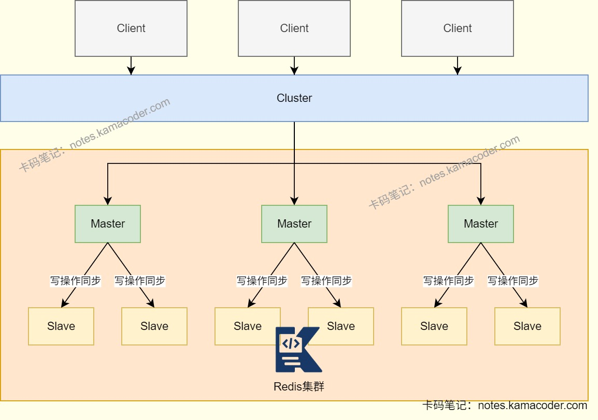

# 快手面经

> 来源: https://notes.kamacoder.com/interview/java/kuaishou-interview.html

# `# 快手面经 

## `# 垃圾回收 

### `# 讲一下常用的垃圾回收器？ 
  - **Serial**：新生代单线程收集器，使用复制算法，简单高效   - **Serial Old**：老年代单线程收集器，使用标记-整理算法   - **ParNew**：新生代并行收集器，使用复制算法，在多核CPU环境下比Serial好   - **Parallel Scavenge**收集器：新生代并行收集器，使用复制算法，追求高吞吐量。   - **Parallel Old**收集器：老年代并行收集器，使用标记-整理算法，吞吐量优先。   - **CMS(Concurrent Mark Sweep)** 收集器：老年代并行收集器，使用标记-清除算法，以获取最短回收停顿时间为目标的收集器，具有高并发、低停顿的特点，追求最短GC回收停顿时间。   - **G1收集器**：Java堆并行收集器，使用标记-整理算法，不会产生内存碎片。 

### `# 新生代和老年代占比？ 
  - 新生代和老年代的堆内存占比通常为**1:2**   - 新生代还可以分为三个区域，占比在**8:1:1** 
    - Eden：对象首次创建时的分配区域     - From Survivor（S0）：存放Eden区GC后存活的对象     - To Survivor（S1）：GC时的“临时交换区”，与from区交替使用。     - 对象在S0/S1间多次存活才会进入老年代 


 

### `# 如果服务器出现线程泄露，应该怎么排查并解决？ 
  - 可以**导出线程栈**,搜索重复出现的线程名称或堆栈   - 若**大量线程处于RUNNABLE状态**，可能是线程未正常退出。在线程执行中存在无限循环，可以添加退出标志；如果是线程阻塞在wait方法未被唤醒，可以通过给阻塞操作设置超时解决；如果是网络/IO操作没有设置超时，可以使用interrupt()中断线程。   - 若**线程名称规律递增**，可能是未复用线程，频繁创建线程。需要检查线程池参数是否合理，并且检查线程池生命周期是否正确。 

## `# RocketMQ 

### `# 使用RocketMQ解决什么问题？ 
  - RocketMQ是**分布式消息中间件**，能够解决分布式系统中的异步通信、解耦、流量削峰等问题。具有**高吞吐、低延迟、高可靠**等特点。   - RocketMQ能够在复杂业务场景下尽可能多的提供思路和解决方案，因为其**消息类型丰富**，包含普通消息、顺序消息、事务消息、定时消息、消息过滤等，能够满足不同业务场景的需求。 

### `# RocketMQ什么情况下会出现重复消费问题,怎么避免？ 
  - 当消费结果与Offset提交的一致性无法强保证时会出现重复消费问题，即**消息已处理，但Offset未被正确记录**。原因是RocketMQ会优先保证消息不丢失，所以可能会出现重复消费问题。   - 在**业务中实现幂等性**可以解决，确保即使消息被重复消费，也不会影响业务状态。可以给每条消息根据生成一个唯一ID，消费时检查该ID是否被处理。如果涉及数据库操作，可以在表中对业务唯一键设置唯一索引，如果出现重复消费会触发唯一约束异常，不影响结果。 

### `# RocketMQ是怎么保证消息顺序的？ 
  - RocketMQ采用了**局部顺序一致性的机制**，实现了**单个队列中的消息严格有序**。想要保证顺序消费，就需要把一组消息发送到同一个队列中。给业务划分不同的队列，然后将需要顺序消费的业务发往同一队列中，不同业务的消息可以并发消费，这样可以在满足顺序消费的同时提高消息处理速度，在一定程度是避免消息堆积问题。   - 生产者将消息发送到同一个队列中，消费者通过**加锁**的机制保证消息消费的顺序性，Broker端通过对MessageQueue进行加锁，保证同一个MessageQueue只能被同一个消费者消费。 

## `# Redis 

### `# Redis分布式锁的实现原理是什么？ 
  - Redis本身可以被多个客户端访问，正好是一个共享存储系统，可以用来保护分布式锁，而且Redis的读写性能高，可以应对高并发的锁操作场景。Redis的SET命令有**NX参数可以实现key不存在时插入**，可以用它实现分布式锁。   - 如果key不存在，显示插入成功，用来表示加锁成功。如果key已经存在，则返回失败，用来表示加锁失败。   - 实现分布式锁时，需要以**原子操作**完成**读取**、**检查**和**设置锁变量值**三个操作，可以通过NX参数实现；为了避免异常导致锁无法释放，需要给锁设置过期时间，通过**EX/PX参数**实现；锁变量的值需要区分不同客户端的加锁操作，避免出现误释放锁的操作，所以设置锁变量值时，**设置一个唯一值，标识客户端**。 

```
SET lock_key_name unique_value NX PX 10000

```

 

### `# Redis集群部署模式了解吗？ 
  - 当Redis缓存数据量一台服务器无法满足时，对Redis集群进行分片，**将数据分布在多台服务器上**，可以降低系统对单主节点的依赖，并**提高Redis服务的读写性能**。   - 集群模式中使用**哈希槽(Hash Slot)处理数据和节点之间的映射关系**，一个集群有16384个哈希槽，类似数据分区，每个键值对都会根据它的key，被映射到一个哈希槽中。这些哈希槽可以通过**平均分配或手动分配**的方式被映射到具体的Redis节点上。 


 

### `# 在主从集群上使用SETNX分布式锁，可能有什么问题，怎么解决？ 
  - **主从切换时可能会导致锁丢失**，SETNX在主节点上成功获取锁后，如果主节点突然宕机，锁的信息没有同步到从节点，那么从节点升级为主节点后，其他客户端会在新主节点上重新获取到相同的锁，导致同一把锁被多个客户端持有。可以通过**Redlock解决**，Redlock是Redis的分布式锁实现，向多个独立的Redis节点发送SETNX请求，只有半数以上节点成功才认为获取锁，此时主从切换不会造成锁丢失。 

## `# MySQL什么情况下需要分库分表？ 
  - 当**单表数据量过大、数据库并发压力过高、存储容量超限或有业务隔离需求**时，MySQL需要分库分表。   - 分库分表的核心目的是将大表拆分，把单库压力分散到多库，提升查询效率、降低并发冲突突破单机存储和性能瓶颈。 

## `# 创建线程池有哪些方式？ 
  - 创建线程池的方式有7种，主要可以通过ThreadPoolExecutor来创建或通过Executors创建。

    - **new ThreadPoolExecutor()** ，有七个参数可以设置：线程池核心线程数、最大线程数、线程空闲时间、时间单位、任务队列、线程工厂、拒绝策略。     - **Executors.newFixedThreadPool(int nThreads)** ：创建一个固定大小的线程池，可控制并发的线程数，超出的线程会在队列中等待。     - **Executors.newCachedThreadPool()** ：创建一个可缓存的线程池，线程数超过处理所需，缓存一段时间后会被回收。     - **Executors.newSingleThreadExecutor()** ：创建单个线程数的线程池，确保所有任务按顺序执行。     - **Executors.newScheduledThreadPool(int corePoolSize)** ：创建一个可以执行延迟任务的线程池，可用于定时任务或周期性任务。     - **Executors.newWorkStealingPool(int parallelism)** ：创建一个抢占式执行的线程池，任务执行顺序不确定。     - **Executors.newSingleThreadScheduledExecutor()** ：创建一个单线程的可以执行延迟任务的线程池。 

## `# 现在有线程A和B如何实现A运行完之后再运行B？ 
  - 可以使用**join()方法**，等待线程A执行完毕后再执行线程B。   - 调用**单线程池**，即创建一个SingleThreadExecutor线程池，将线程A和线程B提交到该线程池，线程B会在线程A执行完毕后才会执行。   - 可以使用**CountDownLatch闭锁**，在线程A执行完毕后，调用countDown()方法，线程B在await()方法阻塞，等待计数器减为0后才会执行。   - 使用**ExecutorService的Future.get()** 方法，等待线程A执行完毕后，再调用线程B的Future.get()方法。 

## `# 介绍一下乐观锁和悲观锁？ 
  - 按照锁的获取机制来看，可以分为悲观锁和乐观锁。 
  - 乐观锁：**假设线程的并发访问不会发生冲突**，操作时不加锁，在更新数据时采用尝试更新，如有冲突则重试。

    - 乐观锁在Java中即**无锁编程**     - 例如原子类，通过CAS自旋实现原子操作的更新。   - 悲观锁：假设线程并发一定会有冲突，**每次操作前必须先加锁**，阻止其他线程干扰。 

## `# HTTP常见的方法？ 
  - HTTP请求共规定了八种方法，分别是GET、POST、PUT、DELETE、HEAD、OPTIONS、TRACE、CONNECT。 
  - **GET**：请求获取指定资源，不改变资源状态，如从服务器获取网页和图片。   - **POST**：提交数据到服务器，可能会改变资源状态，尝尝用于提交表单数据或上传文件。   - **PUT**：更新指定资源，要求客户端提供完整的资源数据，如果资源不存在则创建，多次提交相同数据会覆盖。   - **DELETE**：删除指定资源，请求中包含要删除的资源标识符。   - **HEAD**：请求获取资源的元数据，服务器只返回响应的头部，不返回资源主体。   - **OPTIONS**：请求获取服务器支持的HTTP方法，检查服务器支持哪些请求方法。   - **TRACE**：回显服务器收到的请求，主要用于调试，客户端可以查看请求在服务器中处理路径。   - **CONNECT**：建立一个到服务器的隧道，用于HTTPS连接，客户端可以通过隧道发送加密数据。 

## `# get和post方法的区别？ 
  - GET方法用于从服务器请求获取资源，**不改变资源状态**，参数通过URL传递，对参数长度有限制，并且参数只能是ASCII字符，安全性低。   - POST方法会根据请求体中数据（报文）处理对应资源，**可能会改变资源状态**，参数通过请求体(body)传递，对参数长度和格式无限制，安全性高。 

## `# 讲讲RPC框架？ 
  - RPC(Remote Procedure Call)是**远程过程调用**，允许程序调用运行在另一台计算机上的程序中的过程或函数，就像调用本地程序中的过程或函数一样，不用了解底层机制。   - RPC调用过程包括客户端调用、请求发送、服务器接收与处理、结果返回和客户端接收结果五个步骤。

    - **客户端调用**：客户端调用本地伪函数（存根,Stub）并传入所需参数，处理远程调用相关事宜。     - **请求发送**：客户端存根将调用信息进行序列化，通过网络发送给服务端。     - **服务器接收与处理**：服务端接收到请求，将请求进行反序列化，并调用对应的服务函数并执行。     - **结果返回**：服务端将处理结果进行序列化，并通过网络返回给客户端。     - **客户端接收结果**：客户端接收到服务器返回的结果后，将结果进行反序列化，并返回给调用方。   - 常见的RPC框架有gRPC、Thrift、Dubbo等。 

## `# 介绍dubbo？ 
  - dubbo是阿里巴巴开源的高性能Java RPC框架，核心功能包括**调用远程方法、智能容错和负载均衡、服务注册和发现**。   - dubbo的核心组件包括注册中心、生产者、消费者、容器以及监控。注册中心在此注册并发布内容，消费者在此订阅并接收发布的内容，生产者依赖容器生产内容，监控负责统计服务的调用次数与时间。
