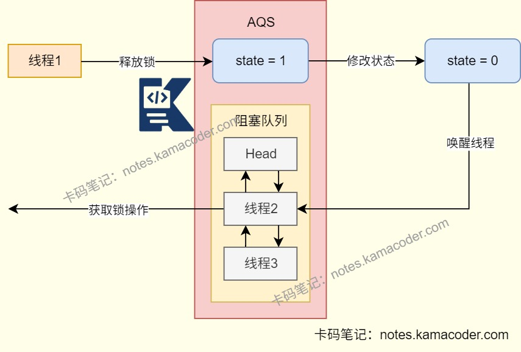
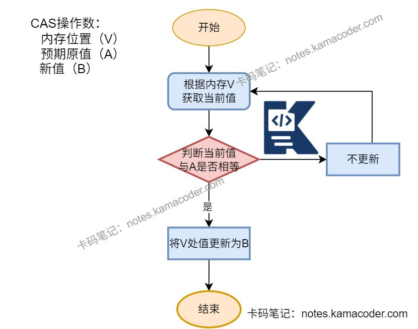

# 盒马面经

> 来源: https://notes.kamacoder.com/interview/java/freshhema-interview.html

# `# 盒马面经 

## `# 怎么理解面向对象 
  - 面向对象是一种编程范式，就是**将现实中的事物抽象为对象**，对象具有属性和行为，对应字段和方法。面向对象的思想就是以对象为中心，通过对象的交互来完成程序的功能，具有灵活性和可扩展性，使用封装和继承可以更好地应对需求变化。 

## `# 面向对象的三大特性 
  - 面向对象的三大特性是**封装继承和多态**。   - 封装是将对象的属性和行为结合，**对外隐藏内部的实现细节**，通过对象提供的接口与外界交互。这样可以使对象更独立，增强安全性。   - 继承使子类可以共享父类数据结构、方法，可以**实现代码复用**，构建类与类的层次关系。   - 多态指不同类的对象对同一消息做出响应，**同一个接口根据子类对象类型执行不同操作**，多态性可以分为编译时多态（重载）和运行时多态（重写），实现用统一的父类接口管理不同子类，无需关注具体类型。 

## `# 多态是怎么实现的 
  - 实现多态需要子类继承父类并重写父类中的方法，同时使用父类型引用子类型对象。 

## `# 抽象类和接口的区别是什么 
  - 抽象类是对类的抽象，**描述共同特性和行为**，可以有成员变量，构造方法和具体方法；接口则用于**定义行为规范**，可以多实现，只能有常量和抽象方法，不过在Java8之后可以有默认方法和静态方法了。   - 继承抽象类的关键字是extends，实现接口的关键字是implements，一个类只能继承一个抽象类但是可以实现多个接口；   - 抽象类的变量不是必须初始化，接口变量默认是public static final，必须初始化且不能修改。   - 抽象类可以有抽象方法和具体方法，接口在Java8前只能有抽象方法，Java8可以有default方法和static方法，Java9后支持private方法。 

## `# 有哪些线程安全的List 
  - **Vector**，是基于数组实现的，它的所有公共方法都用synchronized修饰，多线程并发读写竞争激烈，功能单一。   - **Collections.synchronizedList(List)** ，可以将任何普通的List转换为线程安全的List，它通过在访问方法时加锁来保证线程安全，但是迭代时需要手动加锁。   - **CopyOnWriteArrayList**是支持线程安全操作的动态数组实现，在修改操作时会创建新的数组副本确保读取操作不受影响，适合读多写少的场景。 

## `# 使用ArrayList应该怎么保证线程安全 
  - ArrayList本身线程不安全，多线程环境下可能会出现数组扩容导致的数据丢失或者并发修改异常。   - 实现线程安全可以使用**Collections.synchronizedList()** 包装，临时将ArrayList转为线程安全的场景。还可以通过**锁机制自定义同步**，多线程操作ArrayList时使用synchronized关键字或ReentrantLock等显式锁对临界区代码进行同步控制，适合需要精细控制同步的场景。 

## `# 并发编程三要素是什么 
  - 并发编程三要素是原子性、可见性和有序性。   - **原子性**是一个或多个操作要么全部完成，要么全部不执行，没有部分执行的中间状态。可以使用synchronized关键字、原子类或者ReentrantLock等显式锁保证。   - **可见性**是当一个线程修改了共享变量的值，其他线程可以立即看到修改后的结果。可以使用volatile关键字、synchronized、Lock以及final关键字来实现。   - **有序性**是程序按照代码的逻辑顺序执行，避免指令重排序导致执行混乱，可以使用volatile关键字避免。

 

## `# synchronized和lock有什么区别 
  - synchronized是**JVM内置锁**，由JVM**自动获取和释放**锁，而Lock是**接口**，它的实现类有ReentrantLock，需要**手动调用**lock()获取锁，unlock()释放锁。   - 以ReentrantLock为例，synchronized是非公平锁，ReentrantLock可以支持公平性设置；synchronized只能和wait()/notify()/notifyAll()一起使用，实现线程的等待和通知，适合基础的同步场景，而ReentrantLock可以支持响应中断、超时获取、或者是与多个Condition对象结合实现复杂的线程同步控制，有更细的粒度控制和灵活性。 

## `# Lock有哪些实现 
  - **ReentrantLock是Lock的核心实现**，线程获取锁后可以再次获取同一把锁，释放时需要对应次数的unlock()，支持公平/非公平锁设置、中断等待、超时获取和多条件变量。它基于AQS实现，通过volatile变量state记录锁状态，使用CLH队列管理等待线程。适合需要细粒度控制锁行为的场景。   - **ReentrantReadWriteLock.ReadLock/WriteLock**是基于ReetrantLock的读写锁，读锁可以多线程共享，能够提升并发性能；写锁是排他锁，写时会阻塞所有读和写线程，保持数据的一致性。适合**读多写少**的场景。 

## `# 自旋锁是乐观锁还是悲观锁，使用的时候会不会阻塞线程 
  - 自旋锁的逻辑是当线程获取锁失败时不会立即阻塞，会通过自旋不断尝试获取锁，直到成功或达到自旋次数的上限，它假设冲突概率低，会先尝试操作，所以**属于乐观锁**。   - 自旋锁如果获取锁失败线程会在用户态自旋，**不会进入内核态阻塞**，不会产生内核态切换开销。所以自旋锁适合锁持有时间短，并发线程少的场景，自旋开销小于线程阻塞和唤醒的开销。 

## `# 介绍公平锁和非公平锁 
  - 公平锁是线程**按照申请锁的顺序获取锁**，线程会先到等待队列队尾休眠，一个线程结束会唤醒队首的线程。线程的状态会从运行切换到休眠再切换到运行状态，涉及到用户态和内核态切换，整体执行速度慢，吞吐量小。适合涉及公平性的场景，比如交易。 

**AQS获取锁的过程** 
 **AQS释放锁的过程** 
 
  - 非公平锁则是线程**不按照顺序获取锁**，新线程会尝试通过CAS抢占锁，成功就直接拥有锁，抢不到锁才会进入等待队列。避免了线程休眠和恢复操作，整体的执行速度快，吞吐量大，但是可能会产生线程饥饿的问题，等待队列线程长时间得不到运行。适合普通业务逻辑、高并发读写场景。

   - 公平锁和非公平锁都会依赖AQS和等待队列实现，核心差异在于新线程获取锁时会不会检查队列。 

## `# 讲一下java的异常机制 
  - Java的异常体系以Throwable为根类，有Error和Exception两个子类；   - **Error表示运行时环境的错误**，是程序无法处理的问题，可能是系统崩溃，虚拟机错误等。   - **Exception是程序本身可以处理的异常**，分为**非运行时异常**和**运行时异常**。非运行时异常在编译时就必须被捕获或声明抛出，比如文件不存在(FileNotFoundException)、类未找到(ClassNotFoundException)等，程序员必须进行显式抛出；运行时异常则是由代码逻辑错误导致的，比如数组越界、空指针异常等。一般可以通过try...catch...finally捕获异常或使用throw/throws抛出异常。 

## `# 讲一下反射和应用场景 
  - 反射是一种**动态访问信息的机制**，也就是程序在运行时可以获取类的完整信息并操作类或对象的方法或属性。   - 反射可以动态地适应和扩展程序，能够提高系统的灵活性和适应性；它也是许多框架开发的基础，比如Spring，MyBatis都使用反射实现依赖注入等功能；可以利用反射降低模块之间的依赖，实现通用的对象拷贝。   - 但是反射涉及到动态解析，会产生一定的性能开销；同时可能会破坏封装和代码的可读性，存在安全隐患。 

## `# MySQL有哪些索引？ 
  - 

按照物理存储分类，可以分为聚簇索引和非聚簇索引（二级索引） 
    - 聚簇索引是索引的叶子节点直接存储完整的数据行，查询效率高；而非聚簇索引的叶子节点存储的是主键值，查询时需要先找到主键值再通过聚簇索引定位数据行，进行“回表”，这样会多一次查询开销，适合非主键列的查询。   - 

按照应用分类，可以分为主键索引，唯一索引，普通索引和前缀索引 
    - 主键索引是建立在主键字段上的索引，不允许为空。     - 唯一索引是建立在UNIQUE字段上的索引，允许有一个空值，列值要求唯一。     - 普通索引建立在普通字段上，对字段没有其他要求。     - 前缀索引是指对字符类型字段的前几个字符建立的索引，可以建立在char,varchar,binary,varbinary这些字段类型的列上，比普通索引建立的数据更小，提升查询效率。   - 

按照字段个数可以分为单列索引和联合索引 
    - 像主键索引一样建立在单列上的索引就是单列索引
将多个字段组合成一个索引则是联合索引，可以优化多列联合查询，不用为每个列都单独创建索引。
