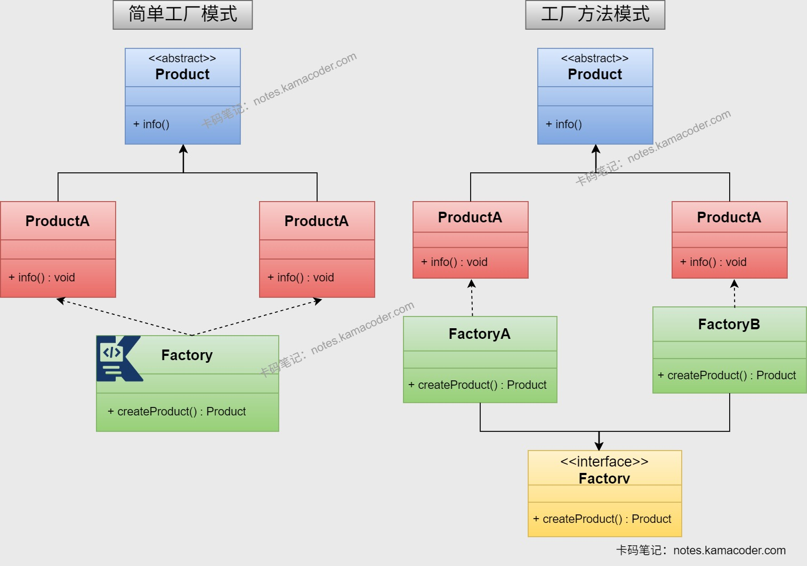
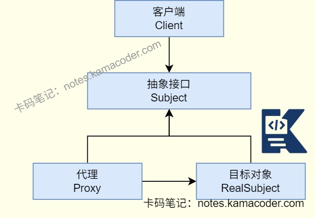
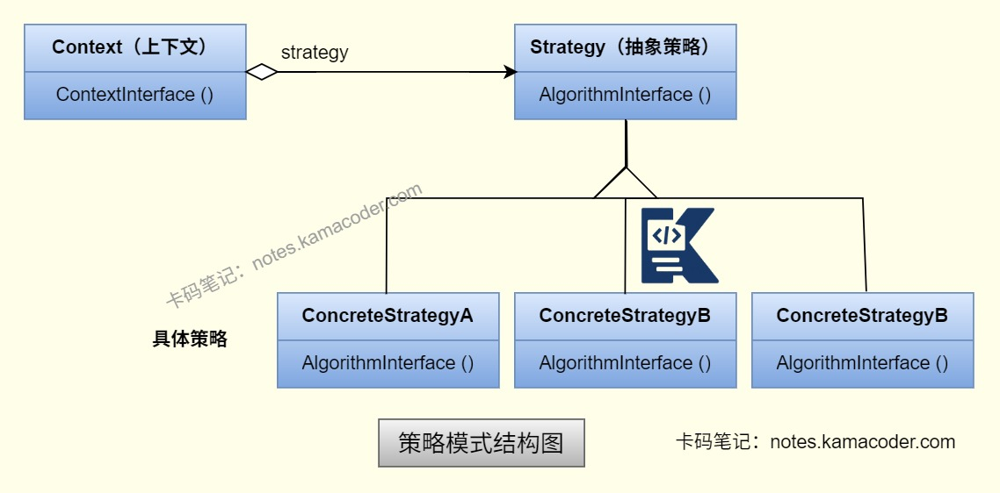

# 美团 Java 后端技术面经

> 来源: https://notes.kamacoder.com/interview/java/meituan-java-backend-tech-3-1.html

# `# 美团 Java 后端技术面经 

### `# 为什么String不可变，StringBuilder可变？ 
  - String是不可变的字符串类，因为其内部数组使用了**final**修饰，且数组本身是私有且不对外开放修改，因此每次改变String对象会创建新的String对象。由于String的不可变，String的线程是安全的，适合常量等字符串不经常变化的场景。   - StringBuilder基于char[] value实现的，数组可扩容，能够高效拼接字符串，还有append()、insert()方法可以直接修改数组内容，扩容时会创建新数组并复制数据，对象引用不变，但是StringBuilder线程不安全，适合单线程场景。 

### `# 介绍一下synchronized和Reentranlock？ 
  - synchronized是基于JVM的内置隐式锁，线程在进入/退出代码是JVM会自动获取释放锁，且只能用于方法和代码块；ReentrantLock是Java提供的显式锁机制，是Lock接口的一个具体实现类，拥有Lock接口的特性，需要手动调用lock与unlock方法。二者都是可重入锁，同一个线程可以多次获取同一个锁。   - synchronized是非公平锁，且不支持响应中断；ReentrantLock可以进行公平性的设置，线程在等待锁时可以中断。   - synchronized不支持绑定多个条件，只能和wait()和notify()/notifyAll()方法一起使用，实现线程等待与通知；ReentrantLock可以与多个Condition对象结合，实现复杂的线程同步机制。   - ReentrantLock可以提供更细粒度的控制和灵活性，性能高于synchronized。 

### `# 使用上面两种锁，有什么注意事项？ 
  - 使用synchronized时，不能让锁的粒度太大，如果给整个方法加锁会造成线程阻塞，仅锁定需要同步的代码块；同时不要使用String常量或者Integer等不可变的对象作为锁，否则会导致不同线程竞争同一把锁；如果是静态方法，锁的是类对象，实例方法的锁则是锁对象实例，两者不互斥。   - 使用ReentrantLock时注意需要手动释放锁，锁必须在finally中释放，否则出现异常时会导致锁无法释放而引发死锁；避免重复释放锁，多次调用unlock()会抛出异常；尽量不要使用公平锁，如果需要保证线程执行顺序时再开启，否则会为了维护等待队列降低性能；可以使用tryLock()避免线程永久阻塞，超时后会返回false，要处理未获取锁的场景；ReentrantLock允许线程在等待锁时被中断，所以要捕获InterruptedException并处理。 

### `# join方法有哪些类型？ 
  - 

join()是Thread类中的一个方法，用于让一个线程等待另一个线程执行完成后再继续执行。主要有三种重载类型：join()、join(long millis)、join(long millis, int nanos)。   - 

join()是无参方法，会在底层调用wait()释放目标线程对象的内置锁，当线程调用thread.join()时，当前线程会进入WAITING状态，等待thread线程执行完毕后恢复； 

join(long millis)能够指定等待时长，若等待millis毫秒后目标线程仍未执行完，当前线程不再等待，继续执行，如果millis=0，则与join()无参方法一样，等待目标线程执行完毕。 

join(long millis, int nanos)能够有更精细的等待时长，底层会将纳秒向上取整为毫秒。 

### `# 怎么优化sql语句？ 
  - 可以给查询条件、排序和分组的字段建立索引，但是不要使用select*语句和对索引字段进行函数/表达式运算避免索引失效，但是如果数据量比较小或者查询低频可以不使用索引，否则还需要维护索引影响开销。   - 还可以把子查询替换为JOIN，子查询可能导致全表扫描，JOIN的性能更好；把OR替换为IN和使用LIMIT限制返回行数也可以优化写法。 

### `# 怎么查看执行计划？ 
  - 在MySQL使用EXPLAIN和待优化的SQL可以查看执行计划，在MySQL8.0开始还可以使用EXPLAIN ANALYZE实际执行SQL并返回执行时间和扫描行数。 

### `# explain的重点属性有哪些？ 
  - 

关注**type字段**：反映查询数据的方式。ALL是全表扫描，效率最差，可能存在索引失效或没有索引的问题； 

index是全索引扫描，没有命中有效筛选；range是索引范围查询； 

ref是使用普通索引作为查询条件，可能会找到多个符合条件的行； 

eq_ref则是联表查询时被关联表的主键或唯一索引的字段作为条件，前一张表的行在当前表只有一行对应； 

system/const是主键或唯一索引匹配，最多返回一条记录，效率最高。   - 

关注key字段，可以看到实际使用的索引，如果为NULL则未使用到。   - 

关注Extra字段，可以看到MySQL执行查询额外信息。 

Using filesort是在排序时使用了外部的索引排序，没有用到表内索引进行排序。 

Using temporary是存在ORDER BY和GROUP BY的情况，需要创建临时表来存储查询的结果。 

Using index是使用了覆盖索引，不用回表； 

Using where表明查询时使用了WHERE进行过滤。需要尽可能避免出现Using temporary和Using filesort的情况。 

### `# 自动装配的原理是什么？ 
  - SpringBoot的自动配置是基于条件的按需配置，本质是通过注解驱动+SPI机制，根据项目依赖、环境配置、自定义规则，自动向IoC容器注入对应Bean，替代传统Spring的XML手动配置。   - SpringBoot是通过@SpringBootApplication注解中的@EnableAutoConfiguration触发自动配置，借助SpringFactoriesLoader加载META-INF/spring.factories中的自动配置类；通过条件注解（如@ ConditionalOnClass）筛选出符合当前环境的配置类后，向IoC容器注入默认Bean；同时遵循 “自定义优先” 原则，开发者可手动配置Bean或禁用自动配置类，覆盖默认行为，最终实现 “按需配置、简化开发” 的目标。 

### `# 自动装配过程是怎样的？ 
  - **扫描阶段**：Spring容器启动，会通过@ComponentScan指定扫描包，扫描所有标注@Component及其衍生注解的类，生成BeanDefinition，也就是bean的定义信息；   - **注册阶段**：将BeanDefinition注册到BeanFactory中，此时仅保存bean的元信息，未创建实例；   - **实例化阶段**：容器首次获取bean时，会通过反射根据BeanDefinition创建 bean 实例；   - **依赖解析阶段**：AutowiredAnnotationBeanPostProcessor扫描bean的字段、setter方法、构造方法上的@Autowired注解，解析需要注入的依赖类型 / 名称；   - **依赖查找阶段**：根据解析的依赖信息，从BeanFactory中查找匹配的bean：优先按类型查找；若找到多个同类型 bean，按名称匹配（byName）；若仍匹配失败，抛出NoUniqueBeanDefinitionException（可通过@Qualifier指定bean名称解决）；   - **注入阶段**：将找到的依赖bean注入到当前bean的字段 / 方法中，完成自动装配；   - **初始化阶段**：调用@PostConstruct注解的方法，完成bean的初始化。 

### `# 设计模式应用场景有哪些？ 
  - **单例模式**用于保证全局唯一的对象（如配置类、连接池、日志工厂、Spring 的 Bean 默认单例），可以分为两类实现方式，其中饿汉式在启动时创建，线程安全、懒汉使用双重检查锁，可以进行延迟加载。

   - 工厂模式有三种类型，**简单工厂**创建同一类别的对象（如不同类型的日志记录器：FileLogger、ConsoleLogger）；**工厂方法**是每个产品对应一个工厂（如 Spring 的BeanFactory，不同子类创建不同 bean）；**抽象工厂**则负责创建一组相关对象（如跨平台 UI 组件：WindowsButton + WindowsText / LinuxButton + LinuxText）。

 
   - **代理模式**可以增强对象功能（如Spring AOP、事务管理、日志记录、权限控制）；典型实现拥有静态代理（手动编写代理类）、动态代理（JDK 动态代理、CGLIB）。

   - **适配器模式**用于兼容不同接口（如 SpringMVC 的HandlerAdapter，适配不同的 Controller 处理器；Java 的InputStreamReader将字节流适配为字符流）。   - **装饰器模式**用于动态增强对象功能（如 Java IO 的BufferedReader装饰FileReader，增加缓冲功能；Spring 的DataSource装饰器，增加连接池功能）。   - **观察者模式**是一对多的通知机制（如 Spring 的事件监听机制、Guava 的 EventBus、消息队列的发布订阅）。

   - **策略模式**用于进行多种算法/规则的动态切换（如支付方式选择：AlipayStrategy、WechatPayStrategy；排序算法选择：QuickSortStrategy、BubbleSortStrategy）。

 

### `# 介绍一下Java的异常？ 
  - 

Java的异常体系以Throwable为根类，有Error和Exception两个子类；   - 

Error表示运行时环境的错误，是程序无法处理的问题，可能是系统崩溃，虚拟机错误等。   - 

Exception是程序本身可以处理的异常，分为非运行时异常和运行时异常。 

**非运行时异常**在编译时就必须被捕获或声明抛出，比如文件不存在(FileNotFoundException)、类未找到(ClassNotFoundException)等，程序员必须进行显式抛出； 

**运行时异常**则是由代码逻辑错误导致的，比如数组越界、空指针异常等。一般可以通过try...catch...finally捕获异常或使用throw/throws抛出异常。 

### `# 你在项目中是怎么打印日志的？ 
  - 一般来说，我会使用**SLF4J+Logback**日志框架统一日志，按照ERROR、WARN、INFO和DEBUG四个级别进行分类打印，ERROR是系统异常、业务错误、必须打堆栈；WARN则是打印参数不合法、调用超时、可恢复异常；INFO是接口入参出参等核心流程节点信息；DEBUG是本地调试的时候使用。   - 我在日志中会打印时间、线程名、类名、方法名、请求ID、业务ID和描述信息等内容。通常在项目的关键位置设置日志打印，如接口入参出参、核心业务逻辑、异常catch块与第三方接口相关的操作处设置。 

### `# 开发项目时遇到性能瓶颈怎么解决？ 
  - 我在开发过程中遇到瓶颈会先尝试定位问题，比如观察接口的响应时间、链路耗时是否合理，是否出现了MySQL的慢查询、Redis的命中率过低等问题；然后判断瓶颈问题属于代码、数据库、中间件还是系统架构问题；   - 如果是SQL相关，可以尝试添加索引避免全表扫描或者分页优化，减少代码中的循环，还可以补充添加缓存内容，将不做同步要求的业务改为异步，进行池化。在架构方面可以采用读写分离、多级缓存和异步解耦以解决。
