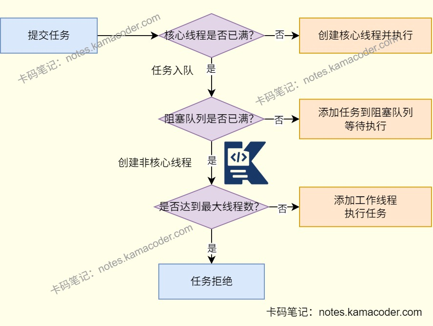
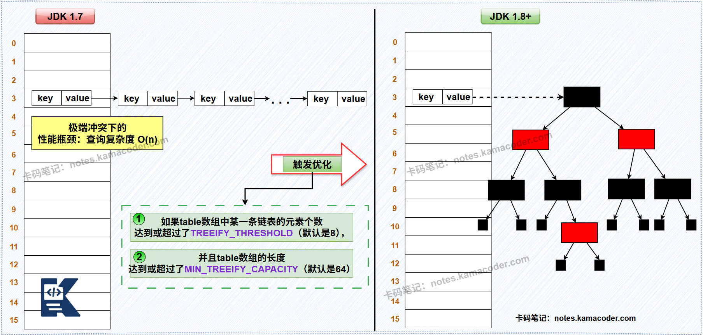

# 美团 Java 实习面经

> 来源: https://notes.kamacoder.com/interview/java/meituan-java-intern-2-5.html

# `# 美团 Java 实习面经 

### `# 怎么解决缓存穿透详细说一下？ 
  - 缓存穿透是用户访问的数据不在缓存和数据库中，大量请求进入数据库且无法通过缓存恢复数据解决，数据库压力过大。   - **缓存空值/默认值**是当MySQL查询结果为空时，将空值“”或null缓存到Redis中，并设置过期时间，避免无缓存导致数据库压力过大，简单易用，但是会消耗内存，但是如果数据库添加了之前没有的数据，缓存中却还是空，产生数据不一致问题   - 使用**布隆过滤器**，将所有有效key存在布隆过滤器中，在查redis前使用布隆过滤器查看数据是否存在，如果数据不存在则直接返回，无需查询缓存/数据库。   - 还可以在接口层添加校验，例如对空字符串或null值等明显的**非法请求进行拦截**，避免进入缓存层。 

### `# redis的使用场景？ 
  - Redis最核心的使用场景是缓存，通过将热点数据缓存到Redis中能够避免频繁访问数据库，提高系统性能。   - 在分布式锁中，会利用SETNX命令配合过期时间实现分布式锁，可以解决分布式系统并发问题；   - 在简单场景下，可以使用Redis的**list**实现简单的消息队列；使用**ZSet**的score存储时间戳，配合zrangebyscore轮询实现延时任务。除此之外，还可以使用Redis实现**布隆过滤器**，**GEO**数据结构实现地理位置的存储。 

### `# Redis和MySQL一致性怎么保证？ 
  - 需要根据业务场景选择适合的一致性方案，对于大多数场景来说，只需保证最终一致性，即允许在缓存删除失败或并发读的情况下导致短暂不一致的发生。基础的方案是先更新数据库，再删除缓存，下次查询数据时会重新从数据库加载数据到缓存中。   - 在并发场景下，可以增加使用**双删策略**，即在删除缓存一段时间后再次删除Redis Key，避免脏读与数据不一致。   - 使用**消息队列实现异步更新缓存**可以保证最终一致性，写操作更新到数据库后向MQ发送消息，消费端异步删除/更新缓存，如果删除失败则重试直到成功。   - 还可以使用Canal模拟MySQL的从库，监听数据库的binlog日志，当数据更新时会自动同步更新/删除Redis的缓存，一致性较高。 

### `# Redis的持久化方式有哪些？ 
  - Redis持久化就是把内存中的数据写到磁盘中，防止服务宕机导致数据丢失。主要方式有RDB（内存快照）和AOF（日志文件），还有Redis4.0新增的AOF+RDB混合持久化方式。   - **RDB(Redis Database)** 会按照一定时间间隔把内存的数据以快照方式保存到硬盘的二进制文件，可以通过save参数定义快照的周期。产生的数据文件是dump.rdb，可以执行save或bgsave命令进行保存。如果两次快照之间宕机，可能会造成一定的数据丢失。   - **AOF(Append Only File)** 会将每一个收到的写命令写入AOF缓冲区(server.aof_buf)中，然后将缓存中的数据写入AOF文件并调用fsync()函数将数据写入磁盘appendonly.aof文件。如果Redis重启会重新执行文件中保存的写命令从而在内存中重建整个数据库的内容。如果日志文件较大，可能恢复速度比较慢。   - 使用**混合持久化**，AOF在重写时会把RDB的内容写到AOF开头，可以在快速加载的同时避免丢失过多数据。 

### `# RDB和AOF谁故障恢复更快？ 
  - **RDB的故障恢复速度更快**。RDB是二进制快照文件，直接加载到内存，无需解析命令；AOF是文本命令日志，恢复时需要执行所有命令。   - 如果AOF文件经过bgrewriteaof重写，被压缩为紧凑的命令集后，可能恢复速度与RDB相近，且数据丢失少。 

### `# Redis的IO多路复用？ 
  - Redis使用**IO多路复用机制**，利用单个线程监听多个FD（客户端连接），当某个Socket有读写事件时通知并触发对应操作，避免无效等待和多线程的上下文切换开销，可以充分利用CPU资源；   - 一般采用epoll实现，在Redis初始化时将监听套接字注册到epoll实例中，主线程调用epoll_wait，阻塞等待FD的读写事件，当有客户端连接/数据请求时，epoll返回就绪的FFD，主线程处理该请求后再次调用epoll_wait。 

### `# MySQL的事务隔离级别有哪些？MySQL默认隔离级别是什么？ 
  - MySQL有四种隔离级别，按照隔离性从低到高分别是读未提交、读已提交、可重复读或串行化。   - **读未提交**是读取其他事务未提交的修改，存在脏读、幻读、不可重复读的问题，适合对数据一致性要求极低的场景。
**读已提交**是只能读取其他事务已提交的修改，能够解决脏读问题，但是仍有不可重复读和幻读问题。
**可重复读**是同一事务内多次读取同一数据时结果保持一致，能够解决脏读和不可重复读问题。它是MySQL InnoDB引擎的**默认隔离级别**，InnoDB使用MVCC和Next-Key Locks间隙锁机制可以解决幻读。
**串行化**会给记录加读写锁，能够完全解决脏读、不可重复读和幻读问题 ，但是并发性能差，适用于对数据一致性要求高的场景。 

### `# MySQL索引数据结构是什么？与其他数据结构相比呢？ 
  - MySQL索引的核心数据结构是**B+树**，是适配磁盘存储的**多路平衡查找树**。B+树采用分层存储，key和data存在叶子节点中，其他节点只有key，叶子节点之间通过双向链表连接，支持范围查询，并且左右子树高度差不超过1，磁盘读写代价低，保证查询效率稳定。   - 与**B树**相比，B树的所有节点都存放键和数据，每个节点存储的索引值少，树的深度大；B树的叶子节点没有链表连接，**范围查询时需要回溯**，效率较低。
与**二叉树/红黑树**相比，B+树搜索的时间复杂度为O(logdN)，其中d是节点允许的最大子节点个数，因此可以保持B+树的高度低，数据查询操作只需要少量次数的IO操作，而二叉树深度大，会导致**磁盘IO次数更多**，成为性能瓶颈。
与**哈希索引**相比，哈希索引仅支持等值查询，不支持范围查询，还可能有哈希冲突问题，B+树更符合多数的业务场景。 

### `# 什么是MySQL回表？ 
  - 索引可以分为聚簇索引和非聚簇索引，也叫二级索引。聚簇索引是将数据和索引放在一块，B+树索引的叶子节点直接存储完整的数据行，查询效率高；而非聚簇索引则是数据与索引分开存储，叶子节点存储的是主键值。   - 如果查询的数据不在聚簇索引中，就会通过二级索引找到对应的主键值，再到聚簇索引中查找整行数据，这个过程称为**回表**，可以使用覆盖索引避免回表操作，查询的字段都在二级索引中。 

### `# MySQL的执行过程？ 
  - SQL语句执行时，首先客户端会通过**连接器**与MySQL建立连接，验证用户名密码等信息；在MySQL8.0之前的版本，MySQL会**查询缓存**，如果之前有执行过这条语句，那么MySQL会从缓存中返回结果，否则进行下一步；   - MySQL中的**分析器进行词法和语法分析**，检查关键字是否正确与表/字段是否存在等，提取出SQL语句中的关键元素，如果正确会构建SQL语法树，不正确则会返回错误信息；
然后由**优化器对语法树进行优化**，如选择合适的索引、多表连接顺序等生成最佳的执行计划。
**执行器**根据优化器生成的执行方案，**校验用户权限**后调用下层存储引擎的API接口**执行**数据读写操作，将结果返回给客户端。如果MySQL是短连接，则会在执行完成后关闭连接； 

### `# MySQL的日志了解吗？redo log、undo log、binlog，谁先写？ 
  - **RedoLog**是InnoDB引擎层的重做日志，会记录数据页的物理修改。当事务提交时会先顺序写入RedoLog中，日志落盘则判定提交成功，这样如果数据库宕机，重启后也会通过重做日志重做所有已提交的事务，实现数据的永久保存。在MySQL中和内存刷盘机制**实现持久性**，即执行时写入，提交时刷盘，保证强持久化。   - **UndoLog**是InnoDB引擎层的回滚日志，记录的是数据修改前的快照。在事务执行的每一步会记录反向日志，事务回滚时可以通过UndoLog撤销已经执行的修改，回滚到日志开始前的状态。常用于实现MVCC（多版本并发控制），提供读已提交/可重复读隔离级别，保证事务**原子性**。   - **Binlog**是MySQL服务层的二进制日志，全局生效、所有引擎共用。记录MySQL中操作的执行顺序、事务提交标记和所有数据变更类的操作事件，包括DDL语句（CREATE/ALTER/DROP）和DML语句（INSERT/UPDATE/DELETE），但是不会存储只读查询操作，常用于主从复制和数据恢复。   - MySQL会先写**undoLog**以便事务在需要回滚时能够撤销已做的修改，然后进入两阶段提交，在Prepare阶段，会将事务的**RedoLog文件**写入内存中并标记为PREPARE状态，在Commit阶段，MySQL服务器层会写入**Binlog**并刷新到磁盘上，确认Binlog成功写入磁盘后会将RedoLog的状态改为COMMIT状态。 

### `# 有没有使用过线程池？怎么用的？ 

 
  - 我在项目中会使用线程池管理线程的创建与销毁，实现线程的复用，减小开销，避免线程过多导致CPU上下文切换频繁，内存溢出。   - **创建线程池**可以通过ThreadPoolExecutor类或者通过Executors类创建，需要考虑线程池参数的合理性，需要重点关注的参数有核心线程数、最大线程数、阻塞队列大小。   - 需要根据任务类型设置合理的**核心线程数**，如果是CPU密集型任务核心线程数可以设置为CPU的核心数，充分利用CPU资源；如果是I/O密集型任务，线程大部分时间在等待I/O操作，可以设置大一点的核心线程数，如CPU核心数的2倍；考虑系统的资源限制设置**最大线程数**，如果过大可能会耗尽系统资源；需要根据场景设置合理的**阻塞队列大小**，避免队列容量过小任务被拒绝或者过大导致任务等待时间过长；根据实际情况的需求判断任务是否有优先级，可以使用PriorityBlockingQueue作为阻塞队列，实现任务的优先级排序。   - 在编写线程池代码时还需要确保线程池在正确的时机启动和关闭，可以使用shutdown或shutdownNow方法关闭线程池；**shutdown**会等待执行中的任务完成再关闭线程池，**shutdownNow**则会尝试中断正在执行的任务，关闭线程池的同时返回尚未执行的任务列表；   - 向线程池提交任务时需要在提交前对任务进行去重，或者在任务本身中增设标志位标识完成情况，避免网络不稳定时浪费线程池资源；如果任务涉及共享资源需要采取同步措施，防止线程池并发执行任务时出现数据不一致或者资源竞争的情况。 

### `# 创建线程的方式？ 
  - Java中创建线程可以**继承Thread类**,重写run()方法，随后调用start()方法启动线程。也可以**实现Runnable接口**，实现run()方法后会将实例传给Thread构造器，再调用start()方法启动线程。还可以**实现Callable接口**（配合Future/FutureTask），实现call()方法，能够有返回值并抛出异常。在实际开发时会使用**线程池**(Executor框架/ThreadPoolExecutor)管理线程而不手动创建线程，避免频繁创建销毁线程的性能开销。 

### `# 怎么实现创建多个线程后把多个线程的运行结果收集起来？ 
  - 可以使用Future和Callable完成，即使用**Callable**定义线程的任务，能够抛出异常并实现结果的返回；然后将任务提交给线程池后会任务可以并发执行。任务执行结束后会得到一组Future对象，可以在主线程从Future列表中使用future.get()方法阻塞等待每个线程结果，这样就可以收集所有线程的运行结果。 

### `# start和run的区别？ 

 
  - run方法是**线程的执行体**，包含线程要执行的**代码**。当**直接调用**run方法时，代码直接在当前线程中作为**普通方法**执行，不会创建新的线程。run方法也**可以被子类重写**，实现特定任务。   - start方法会**启动一个新的线程**，会在新线程中执行run方法代码。start方法会为线程分配系统资源，并将线程置于**就绪状态**，当**调度器选择该线程**时，会**执行run方法**中的代码。start方法**只能调用一次**，如果再次调用，将抛出IllegalThreadStateExeception异常。 

### `# hashmap的实现原理？ 

 
  - 

在JDK1.7及之前HashMap是**数组+链表**的结构，内部有一个 `Entry[]` 类型的数组，名为`table`。`Entry`是 HashMap 的一个内部类，它包含了`key`, `value`, `hash`以及一个指向下一个`Entry`的`next`指针。 

当执行`put(key, value)`时，首先计算`key`的**哈希值**；然后通过这个**哈希值**与数组长度进行运算，定位到`table`数组中的一个索引位置。如果该位置没有元素，就创建一个新的`Entry`对象放进去。如果该位置已经有元素了（即发生**哈希冲突**），就在这个位置形成一个链表。新加入的元素会采用 “**头插法**” 插入到链表的头部，这是因为设计者认为后插入的元素更可能被先访问。

 

这种结构的主要问题是，一旦哈希函数设计不佳或者数据本身就容易产生大量冲突，就会导致某个桶后面的链表变得非常长。在这种极端情况下，`get()`操作需要遍历整个长链表，其时间复杂度会从理想的O(1)退化到**O(n)**，导致性能急剧下降。   - 

JDK 1.8 及之后HashMap是**数组+链表/红黑树**的结构，数组的类型从`Entry[]`变成了 **`Node[]`** ，这个Node类型是HashMap的内部类，它又实现了Map接口的内部接口Entry，`Node`是`Entry`的替代者。`Node`还有一个子类`TreeNode`，用于表示红黑树的节点。 

如果put过程中发生哈希冲突，如果该桶内元素的组织形式是**链表**，那么新元素会采用 “**尾插法**” 加入到链表的末尾。在插入链表后，会检查该链表的长度。如果长度**大于等于树化阈值（TREEIFY_THRESHOLD，默认为8）**，HashMap并不会立即树化，它还会再检查当前数组的长度，如果数组长度小于一个**最小树化容量（MIN_TREEIFY_CAPACITY，默认为64）**，它会优先选择扩容而不是树化。但如果数组长度足够，这条链表就会被重构为一棵**红黑树**。如果该桶内已经是一棵红黑树了，那么新元素会按照红黑树的规则插入，时间复杂度为**O(log n)**。 

通过引入红黑树，即便在最坏的情况下（即所有key都映射到同一个桶），查询一个元素的时间复杂度也从 O(n) 降低到了 **O(log n)** ，极大地提升了HashMap在恶劣情况下的性能稳定性。 

### `# hashmap是线程安全的吗？ 
  - 

HashMap不是线程安全的。   - 

JDK1.7采用数组+链表的数据结构，在多线程背景下，**数组扩容时可能会导致Entry链死循环**。 

HashMap并发执行**put()操作时会出现数据覆盖问题**，因为put()方法没有加锁，多线程环境可能会出现数据覆盖问题。 

HashMap的迭代器是快速失败迭代器，**并发修改会破坏迭代器的遍历逻辑**，导致数据不一致。 

### `# concurrentHashMap的线程安全是怎么保证的？ 

 
  - 

JDK1.7中，ConcurrentHashMap使用了**数组 + 链表**的数据结构，数组分为大数组Segement和小数组HashEntry，采用分段锁技术实现线程安全，即对每个Segment独立加锁，小数组HashEntry用于存储键值对数据。 

读操作无锁，使用volatile保证可见性，根据HashEntry的volatile字段保证读操作能获取最新值。写操作对目标加锁，完成后释放，同一Segment写操作互斥。   - 

JDK1.8中，ConcurrentHashMap使用的是**数组 + 链表 + 红黑树**的结构。并发控制体现在操作时会判断数组节点是否为空，如果为空则使用CAS无锁插入，如果不为空则使用Synchronized锁定当前链表/红黑树节点后进行操作。可以缩小锁的粒度，让发生冲突和加锁的频率降低，实现线程安全的同时提高并发操作性能。 

### `# 延迟消息，怎么保证消息不丢？ 
  - 以RocketMQ为例，可以使用定时存储与轮询策略实现延迟消息，将消息存入延迟队列，到达指定时间后，从延迟队列中取出消息，并开始消费。   - 在生产者端，需要处理消息队列服务端的响应，对于同步和异步发生的消息回调做好try...catch，如果发送失败需要设置重试，并进行预警和日志记录。   - 在消息队列的服务端，在消息写入磁盘后再给生产者成功响应，同时采用主从复制方式可以避免消息的丢失，故障崩溃后可以恢复。   - 在消费者端可以开启手动ACK机制，消费完成后进行手动确认，并将未确认的消息重新投递；还可以使用死信队列存储多次投递失败的消息以避免消息丢失。 

### `# RocketMQ怎么保证消息不重复消费？ 
  - 消息队列中可能会因为网络抖动或消费者重启出现重复消费，需要进行幂等处理，即消息被消费者多次消费后产生的业务结果与消费一次完全一致。   - 在生产者发送消息时可以携带**唯一业务标识**，消费者消费前查看幂等表检查该消息是否已经被消费过，如果已经消费则直接返回，没有消费则在消费后更新幂等表；还可以在业务代码中添加逻辑检验，执行**前置判断**，比如对比消息中的版本号和数据库中的版本号；或者通过**数据库的约束**，使用Redis的SETNX存储消费标识并设置过期时间。
