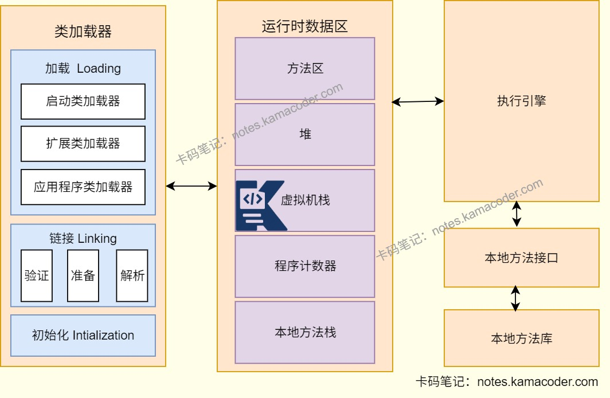

# 美团 Java 日常实习面经

> 来源: https://notes.kamacoder.com/interview/java/meituan-java-intern-2-1.html

# `# 美团 Java 日常实习面经 

### `# 分布式场景下如何解决用户连续两次提交的问题？ 
  - 解决用户连续提交问题，需要保障业务的每个环节，包括前端和后端的防控与检测。   - 在前端可以进行**拦截处理**，如提交后立即将按钮置灰，防止用户手动点击；同时前端请求时可以携带生成的**全局唯一请求标识**，后端接收请求后对该标识进行验证，过滤无效请求。   - 后端请求层可以使用**Redisson实现分布式锁**来防止重复请求，比如按照业务类型+用户ID+前端的唯一请求标识设计锁名称。具体流程：在处理请求之前尝试获取分布式锁，保证同一业务的重复请求对应的是同一把锁，如果获取锁成功则说明这是第一次请求，获取失败则说明已经有相同请求在处理，可直接拒绝。   - 还可以在业务层进行**幂等校验**，如结合数据库的唯一索引特性或业务状态机进行幂等校验，避免重复处理。 

### `# JWT与OAuth 2.0之间是什么关系？ 
  - OAuth2.0是**授权框架**，定义资源所有者授权给客户端以什么方式访问资源的流程，授权成功后生成访问令牌实现。   - JWT是一种轻量级的**令牌格式**，用于安全高效地传递声明，常被用作OAuth2.0流程中Access Token的实现，也可以独立使用，用于身份认证。 

### `# 调研过业界登录功能的其他实现方式吗？除了JWT之外还有哪些？ 
  - 还可以使用**基于Session的登录**，用户登录后服务端创建Session存储用户信息，返回JSESSIONID给前端，前端通过Cookie存储，后续每次请求通过JSESSIONID匹配Session获取用户信息。   - 还有使用**SSO单点登录**，可以在多个应用程序中实现认证和授权，允许用户只登录一次就可以访问多个应用程序，无需重复登录，适合企业级的多系统架构。 

### `# 请解释什么是倒排索引？ 
  - 传统的索引以文档为核心，记录文档ID，无法根据关键词查找文档；而**倒排索引**以关键词为核心，**由关键词和包含该关键词的文档ID列表组成**，即词典和倒排列表。倒排索引作为ElasticSearch中的核心概念，能够解决大量数据的快速全文检索问题。   - ES的执行流程如下：ES会先对查询语句进行分词，然后在词典中进行关键词查找，获取对应倒排列表后进行交集运算，得到对应的文档ID，最后返回给用户。 

### `# ES中的数据是如何导入的？ 
  - ES中提供多种导入方式，在首次初始化时使用**全量导入**，可以通过Logstash工具的jdbc插件读取数据库的全量数据，处理后导入到ES中；   - 日常运行中则是**增量实时同步**，可以通过Canal+Kafka+Logstash实现，Canal可以模拟MySQL的从库，监听MySQL的binlog，将变更的数据发送到Kafka做削峰填谷、消息缓冲，然后Logstash或自定义的消费程序会从Kafka中拉取数据，并写入ES中；   - 也可以自定义**定时任务**，固定时间间隔，将数据同步到ES中。 

### `# 使用RocketMQ时，是否调研过其他开源消息队列？对比结果如何？ 
  - 还了解过Kafka和RabbitMQ，**Kafka**的优点是吞吐量高，但是部署比较复杂，需要配合ZooKeeper实现，运维成本较高，适配大数据生态；**RabbitMQ**则是吞吐量一般，比较适合轻量级低并发场景的通知。   - 最后选择**RocketMQ**则是因为本身适配Java技术栈，支持事务消息，满足分布式业务的需求，还能够做到**高吞吐的同时低延迟**，消息堆积时性能没有明显下降，非常符合业务场景。 

### `# 消息队列中如何处理消息的幂等问题？ 
  - 消息队列中可能出现重复消费，需要幂等处理，即消息被消费者多次消费后产生的业务结果与消费一次完全一致。   - 可以使用消息队列的本身特性做幂等处理，需要先开启**消息确认机制**，即消费者执行业务成功后需要手动发送ACK，没有ACK的消息会被重新投递；然后**设置消费重试次数**，能够避免无限重发导致的重复消费；利用RocketMQ的**全局唯一消息ID**，自定义业务唯一ID作为幂等标识。 

### `# 了解类加载的完整过程吗？ 
  - 类加载过程可以分为**加载**、**链接**和**初始化**三个阶段，其中链接阶段可以划分为**验证、准备和解析**三个子阶段。 
  - 在**加载**阶段，类加载器负责查找类的字节码文件并将其加载到内存中。   - **链接(Linking)** 包含三个子阶段：验证、准备、解析

    - 验证(Verification)：在验证阶段，会确保加载的类文件格式正确，并且不包含不安全的构造。     - 准备(Preparation)：在准备阶段，在内存中为类的静态变量分配内存空间，并设置默认初始值。     - 解析(Resolution)：在解析阶段，会将类、接口、字段和方法的符号引用解析为直接引用，也就是内存地址。   - 在**初始化**阶段，执行类的静态初始化代码，包括静态字段的赋值和静态代码块的执行。静态初始化在类的首次使用时进行，可以是创建实例、访问静态字段或调用静态方法。

 

### `# 类初始化时，静态代码块、静态常量、复合函数的执行顺序是什么？ 
  - **final static**作为编译期常量在编译时会被存入调用类的常量池，类加载阶段中的链接阶段进行内存分配与赋值；   - **静态变量的赋值和静态代码块**则是在初始化阶段执行，二者的执行顺序是代码编写的先后顺序；   - **复合函数**（静态方法）属于方法调用，静态方法不会在类初始化阶段自动执行，如果静态变量通过调用静态方法赋值，此时方法会随变量赋值执行。

 

### `# 请讲解JVM的内存结构？ 
  - JVM内存结构（**运行时数据区**）可以分为Java虚拟机栈、堆、方法区、本地方法栈和程序计数器五个部分。在JDK8之前，方法区通过永久代实现，JDK8及以后，永久代被元空间取代。   - 其中堆和方法区是线程共享的，虚拟机栈、程序计数器和本地方法栈是线程私有的。   - **Java虚拟机栈**存储方法执行时的栈帧，用来存储局部变量、操作数栈动态链接和返回地址，每个线程的虚拟机栈生命周期和线程相同；**堆**存放对象的实例和数组，是垃圾回收的主要区域；**本地方法栈**登记本地方法，管理本地方法的调用；**程序计数器**记录当前线程执行的字节码指令地址；**方法区**保存已经被加载的类信息、静态变量和即时编译后的代码等数据，关闭JVM后释放。

 

### `# 常见的垃圾回收器有哪些？ 
  - **Serial**：新生代单线程收集器，使用复制算法，简单高效   - **Serial Old**：老年代单线程收集器，使用标记-整理算法   - **ParNew**：新生代并行收集器，使用复制算法，在多核CPU环境下比Serial好   - **Parallel Scavenge**收集器：新生代并行收集器，使用复制算法，追求高吞吐量。   - **Parallel Old**收集器：老年代并行收集器，使用标记-整理算法，吞吐量优先。   - **CMS(Concurrent Mark Sweep)** 收集器：老年代并行收集器，使用标记-清除算法，以获取最短回收停顿时间为目标的收集器，具有高并发、低停顿的特点，追求最短GC回收停顿时间。   - **G1收集器**：Java堆并行收集器，使用标记-整理算法，不会产生内存碎片。 

### `# G1相对于CMS有哪些核心提升？ 
  - G1收集器在JDK1.7被引入，后面取代CMS为默认收集器。   - **适配大内存场景**：G1收集器将**堆内存分为多个区域(Region)** ，维护一个优先列表，根据允许的收集时间选择回收价值最大的Region，尽可能提高收集效率；   - **兼顾吞吐量与低延迟**：G1可以充分利用CPU资源缩短停顿时间，合理控制并发线程数，CMS大部分阶段会和用户线程并行，抢占CPU资源；   - **解决内存碎片问题**：CMS的标记-清除算法，没有进行内存整理，可能会产生大量内存碎片；G1使用标记-整理算法，筛选回收阶段会把存活对象移动到空闲Region中进行内存整理，不会因碎片触发Full GC；   - G1可以管理新生代和老年代的内存，可以对整堆进行垃圾回收，而CMS只能对老年代进行回收。 

 

### `# 了解JVM的相关参数吗？请举例说明。 
  - JVM参数为JVM运行提供配置依据，可以对内存分配、垃圾回收、日志等方面进行配置，为不同的业务场景选择合适的参数。   - 进行**内存配置**时可以使用-Xms和-Xmx设置堆内存的初始值和最大值；-Xmn设置新生代大小，-XX:NewRatio设置老年代与新年代比例；   - 进行**垃圾回收**时可以使用-XX:+UseParallelGC、-XX:+UseConcMarkSweepGC、-XX:+UseG1GC等参数进行垃圾回收器的选择。   - 关于**日志**可以使用-XX:PrintGCDetails打印GC详细信息，使用-XX:PrintGCDateStamps打印GC日期和时间，还可以使用-Xloggc:/path/to/gc-%t.log打印GC日志到指定文件。%t表示当前时间。   - JVM参数也可以**处理OOM异常**，使用-XX:+HeapDumpOnOutOfMemoryError可以在OOM时自动生成堆快照，使用-XX:HeapDumpPath=/path/to/heapdump.hprof可以指定堆快照文件路径。 

### `# Spring中注入Bean有几种方式？ 
  - 使用 **@Compoment的注解和@Autowired的注解** 进行注入，在类上使用@Service、@Repository、@Component注解，在需要注入的字段上使用@Autowired注解，Spring就会自动注入Bean。   - 还可以使用**构造器注入**的方式，将@Autowired注解添加到构造器上，类只有一个构造器时可以直接省略。通过构造器注入可以把依赖设置为final，避免空指针。   - 对于第三方组件，可以使用 **@Configuration注解和@Bean注解** 进行配置，给配置类添加@Configuration注解并在方法上添加@Bean注解，此时方法的返回值就是Spring Bean，以后可以在其他Bean中使用@Autowired注解进行注入。   - 还可以使用**XML**进行配置，不过XML配置方式比较繁琐，不推荐使用。 

### `# 请讲解Spring中AOP的原理及应用场景。 
  - AOP就是**面向切面编程**，横向把日志、事务、权限这些跨所有业务模块的通用逻辑，封装成一个 “切面”，不用在每个业务方法里重复写，直接切入到业务逻辑中，实现通用逻辑和业务逻辑的解耦，业务代码更干净。   - AOP使用Java的**动态代理机制**，Spring会为被切入的对象（目标对象）创建一个代理对象，所有通用逻辑都织入到代理对象里，我们调用业务方法时，实际调用的是代理对象的方法，代理对象先执行通用逻辑，再执行原始的业务方法，最后执行后续的通用逻辑，目标对象完全不用改。，动态代理包含基于JDK的动态代理和基于CGLIB的动态代理。   - AOP可以用于日志记录、实现声明式事务、权限控制、进行统一的异常处理等场景，不用在每个业务方法里重复写这些通用逻辑。 

### `# 场景题：设计话费充值功能的MySQL表结构，需要设计几张表才能实现核心功能？ 
  - 可以使用用户表、订单表和回调表三张表实现核心功能，三张业务表通过主键-外键关联，以用户ID和订单ID为核心关联字段，数据流转单向且关联关系简单，符合用户下单-支付确认-运营商回调-订单结束的业务流程。 
  - 用户表：用于存储用户的基本信息，主要包含用户ID、手机号、用户昵称、账户余额和状态、注册时间等。   - 话费充值订单表：用于记录用户的每一笔充值订单，是核心业务表。主要字段有订单ID、用户ID、手机号、充值金额和支付金额及状态，还有下单时间与确认时间。   - 话费充值回调表：用于记录运营商的所有回调请求，主要字段是日志ID、关联的订单ID、运营商渠道订单号、回调参数、处理结果、回调时间和系统处理时间。
