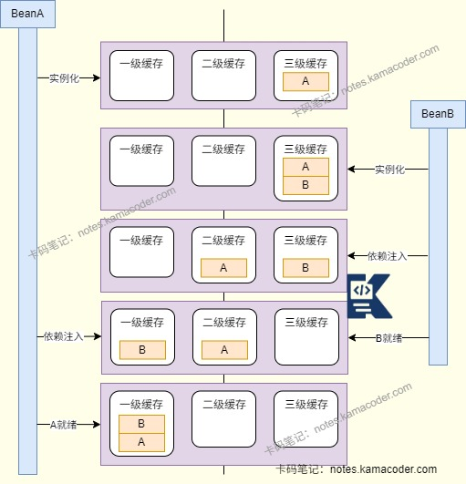

# 美团一二面面经

> 来源: https://notes.kamacoder.com/interview/java/meituan-round1-2-interview-2-8.html

# `# 美团一二面面经 

### `# mysql能否保证数据不丢失？ 
  - 

MySQL本身不能保证数据不丢失，但是InnoDB有一系列机制降低数据丢失概率，需要开启MySQL的双1配置，即**innodb_flush_log_at_trx_commit=1**和**sync_binlog=1**。   - 

InnoDB为了减少磁盘IO开销，DML操作在执行时会检查**Buffer Pool内存工作台**，优先在缓存页中执行修改操作，没有就会从磁盘中读取到缓存页中执行修改操作，修改后的缓存页为脏页，会被异步刷新到磁盘，平衡性能与数据持久化。   - 

MySQL使用WAL日志先行机制，事务执行时在**Redo Log重做日志**中记录修改操作再写入缓冲区，MySQL崩溃重启后通过redoLog可以恢复还没有刷入磁盘的数据，保证事务已经提交的数据不丢失。 

**binlog**也能用作主从复制与数据恢复，如果redoLog恢复后还有数据缺失，可以通过binlog做时间点恢复。   - 

InnoDB还使用了双写机制防止页损坏问题，在将脏页刷新到硬盘之前，会先把脏页写到**DoubleWrite Buffer双写缓冲区**中，再顺序写到硬盘的双写区中，备份后就异步把脏页到硬盘的正式表空间中，如果刷新到正式库时出现页损坏，则会从硬盘双写区取出备份页覆盖损坏的页，再配合RedoLog进行数据恢复，防止数据丢失。 

### `# 事务注解失效的情况，你是怎么避免的？ 
  - 给@Transactional注解**手动指定rollbackFor=Exception.class**，避免受检异常导致的回滚失效。   - 在核心业务方法中应该**避免内部调用事务方法**，如果被调用的方法没有事务注解可能会导致外层事务失效，尽量通过Spring Bean之间的调用触发代理，可以把两个方法拆到不同的类，通过@Autowired调用；或者用AopContext.currentProxy()获取代理对象，并调用方法。   - 使用try-catch捕获异常时，一定要在catch块中处理或重新抛出异常。 

### `# spring循环依赖问题怎么解决？ 

 
  - 

Spring通过**三级缓存**和**提前暴露未完全初始化的对象引用**机制来解决单例作用域Bean的循环依赖问题。   - 

三级缓存是Spring在DefaultSingletonBeanRegistry中维护的三个重要的缓存(Map)。 

**一级缓存(singletonObjects)** 存放完全创建好的Bean实例，可以直接使用，Bean已经进行了实例化，依赖注入、初始化，有AOP代理也已经生成； 

**二级缓存(earlySingletonObjects)** 存放提前暴露的Bean的原始对象引用或者早期代理对象引用，专门用来处理循环依赖。此时Bean已经实例化但是还没有完成依赖注入与初始化。 

**三级缓存(singletonFactories)** 存放Bean的ObjectFactory工厂对象，当Bean被实例化后Spring会创建一个工厂对象放入三级缓存。当其他Bean需要获取三级缓存中的Bean时，三级缓存可以动态返回半成品Bean，原始对象或代理对象。   - 

假设A和B存在循环依赖问题，A创建实例后未注入属性时会存放ObjectFactory对象到三级缓存中，开始给A注入属性时发现A依赖B，此时容器开始创建B，B实例化后也会被存放ObjectFactory对象到三级缓存中，Spring给B注入属性时发现B依赖A，容器在三级缓存中找到A的ObjectFactory对象，获取A的早期引用并放入二级缓存，并清理三级缓存。将A的早期引用注入到B中，完成B的初始化后进入一级缓存。回到A的属性注入环节，将就绪的B注入A，完成A的初始化后进入一级缓存，解决循环依赖问题。 

### `# 两级缓存能否解决？ 
  - 二级缓存不能解决带有AOP代理的Bean之间的循环依赖问题，如果Bean没有AOP代理，二级缓存可以通过提前暴露早期实例解决循环依赖。   - 如果只有两级缓存，需要在Bean实例化后立即创建代理对象，放入二级缓存，会破坏Spring的代理创建时机，给所有Bean都提前创建代理，会造成性能开销，还有可能会出现同一个Bean中出现原始对象和代理对象两个不同的实例，违反单例约束。 

### `# mybatis的执行流程是什么？ 
  - Mybatis是一个半ORM框架，内部封装了JDBC，简化数据库操作。从SqlSession开始经过映射器、解析器、执行器，最终调用JDBC操作数据库。   - Mybatis在启动时，会加载核心配置文件和Mapper映射文件，解析配置信息后生成Configuration对象；然后通过SqlSessionFactoryBuilder创建SqlSessionFactory对象，然后通过SqlSessionFactory创建SqlSession对象；SqlSession通过getMapper方法获取Mapper接口的动态代理对象，Mybatis会根据方法名和参数对SQL进行解析，并通过Executor执行SQL，最后使用ResultHandler将结果集映射为Java对象。 

### `# 对Mybatis的缓存有了解吗，说一下优缺点？ 
  - Mybatis提供两级缓存，能够减少数据库的查询次数，提升查询效率，默认情况下会开启一级缓存，二级缓存需要手动配置；可以在重复查询相同SQL时直接从缓存中获取数据，减轻数据库压力，但是缓存数据会占用内存空间，缓存的延迟不适合对实时性要求高的业务。   - **一级缓存**是本地缓存，每个SqlSession都有自己的一级缓存并相互隔离，在同一个SqlSession中，查询相同的数据，会从缓存中获取，而不是从数据库中查询；为了保证数据一致性，执行增删改操作时，会清空缓存，也可以调用clearCache()方法手动清空缓存。   - **二级缓存**是全局缓存，在同一个Mapper中所有SqlSession共享二级缓存，在SqlSession执行查询后，会将一级缓存的数据刷入二级缓存，其他SqlSession查询相同SQL时，会先查二级缓存，再查一级缓存，最后查询数据库。需要使用二级缓存时，要在核心配置文件中加入< setting name="cacheEnabled" value="true"/>，或者在Mapper映射文件中添加cache标签。 

### `# 介绍一下HashMap? 
  - 

HashMap适用于单线程下键值对的存储场景，底层结构是数组+链表/红黑树，通过哈希算法定位查询对应值，且允许存储null键值，默认的初始容量为16。   - 

HashMap在**put**元素时，会通过key的hashCode()计算hash值，然后通过(hash & (table.length - 1))定位到数组中的索引位置，如果该位置的元素为null，则创建一个Node对象，并设置到table[index]中。 

如果该位置的元素不为null，发生哈希冲突时，先判断Key是否已经存在，如果存在则更新value；如果Key不存在则在链表的末尾添加新节点并存储； 

如果此时链表的长度超过阈值（默认为8）且HashMap的元素数量少于64，会将链表转换为红黑树，查找提高效率。   - 

如果HashMap的元素数量超过了扩容阈值threshold，会进行扩容操作。新容量是旧容量的2倍，生成新数组后，则会遍历老数组中的每个链表/红黑树。计算每个元素在新数组中的下标，将元素放入新数组中，元素转移完后将新数组赋值给HashMap对象的table属性。   - 

put操作示意图如下：

 

### `# 树化的优缺点有哪些？ 
  - 加入红黑树可以提升查询和删除的效率，因为红黑树是二叉平衡树，查询的时间复杂度是O(logN)，而链表的时间复杂度是O(N)；哈希冲突严重的情况下也能保证稳定的查询效率；红黑树还会按Key的hash值进行排序，链表则是无序的。   - 相比链表，红黑树的代码复杂度更高，需要做平衡操作，也会占据更多的内存空间，如果链表长度在6和8之间反复波动，会导致频繁的树化和退化，造成性能开销。 

### `# 介绍一下B+树？ 
  - 

B+树是平衡多路查找树，是MySQL的InnoDB索引的核心数据结构。B+树只在**叶子节点存储数据，在非叶子节点存储索引**，并且左右子树高度差不超过1，能够保证查询效率稳定。   - 

B+树每个节点可以有多个子节点，多叉设计能够减少树的层数，还可以让每个节点存储更多的索引项，降低磁盘的IO次数，提升查询效率； 

B+树的所有节点会按关键字进行排序，且叶子节点之间使用双向链表连接，方便进行范围查询，只需要遍历叶子节点的双向链表； 

### `# 说一下常用的jdk，1.8的新特性？ 
  - Java8引入的核心新特性包括Lambda表达式，Stream API、函数式接口、默认方法、Optional类和新的日期与时间API。   - **Lambda表达式**把函数作为一个方法的参数，提供简洁的语法编写匿名函数。   - 引入的**函数式接口**注解@ FunctionalInterface，作为Lambda表达式的接口，比如Consumer、Supplier、Function和Predicate。   - **Stream API**是数据流处理工具，提供了一种声明式的方式来对集合进行操作，如过滤、映射、排序和去重等。   - Java8也引入了**java.time包**，提供了全新的日期和时间API，线程安全且易用，加强了对日期与时间的处理。 

### `# lambda实现原理是什么？ 
  - **Lambda表达式**：是Java8的核心特性，本质是匿名函数，即允许**函数作为方法参数传递**，简化代码编写。其语法结构是 **(参数列表) -> {方法体}** ，其中参数类型可以省略，由编译器类型判断，单参数可省略括号，单行逻辑可以省略大括号与return。   - lambda表达式替代匿名内部类，简化集合遍历、线程创建等场景的代码。依赖函数式接口实现，编译后会生成私有静态方法，通过invokedynamic指令调用，避免匿名内部类产生过多的class文件。 

### `# 功能性接口有哪些？ 
  - 

函数式接口是只有一个抽象方法的接口，JDK8开始，接口可以定义默认方法、静态方法，使用@FunctionalInterface注解声明为函数式接口。其中的核心内置接口有Consumer< T >、Function<T,R>、Predicate< T >、Supplier< T >等。 

**Consumer< T >** 是消费型接口，接收参数但无返回值(void accept(T t))，比如遍历集合场景。 

**Suppplier< T >** 是供给型接口，无参数有返回值(T get())，生成随机数场景。 

**Function<T,R>** 是函数型接口，接收参数并返回值(R apply(T t))，比如映射场景。 

**Predicate< T >** 是断言型接口，接收参数返回boolean值(boolean test(T t))，比如集合过滤场景。
