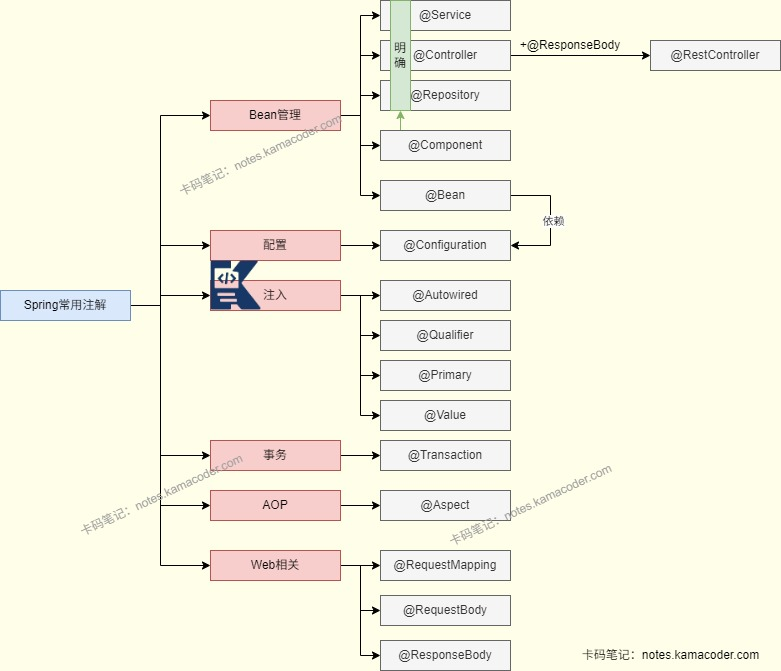
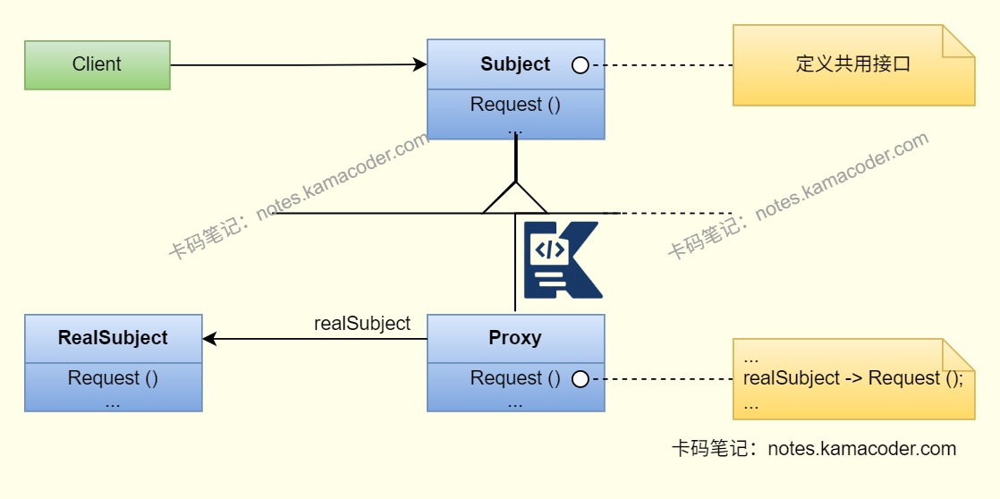

# 美团后端面经

> 来源: https://notes.kamacoder.com/interview/java/meituan-backend-interview-2-22.html

# `# 美团后端面经 

### `# 介绍一下RabbitMQ消息队列？ 
  - RabbitMQ是基于AMQP协议、Erlang开发的消息队列，特点是路由灵活、可靠性高、易用性强，支持direct/topic/fanout等交换机，通过confirm机制、持久化、手动ACK保证消息不丢失，适合微服务异步解耦、业务消息分发，和Kafka比更侧重业务灵活与可靠，和RocketMQ比更轻量、生态更广。   - 使用RabbitMQ时，可以对不需要立即生效的操作进行拆分并异步执行；还可以使用消息队列缓冲所有的订单，进行流量削峰；在系统发生故障时，消息队列可以进行应用解耦，等待恢复后处理缓存在消息队列中的消息。 

### `# 用过kafka吗？ 
  - Kafka可以作为消息系统，能够系统解耦、冗余存储与流量的削峰、缓冲、异步通信和扩展性等；Kafka可以通过消息持久化和多副本机制把消息持久化到磁盘，能够降低消息丢失的风险；Kafka提供流式处理框架，如窗口、连接、变换和聚合等各类操作。   - Kafka的特点是具有高吞吐量和低延迟，Kafka每秒可以处理几十万条消息，延迟最低几毫秒，每个topic可以分为多个partition，consumer group对partition进行consume操作，支持数千个客户端同时读写；同时Kafka集群支持热扩展，并且允许集群中节点的失败。 

### `# 对比kafka和rabbitmq？ 
  - 在架构方面，RabbitMQ路由灵活、支持复杂的规则，Kafka则采用分布式分区存储，水平扩展强，路由简单；从性能来看，RabbitMQ的吞吐量中等，Kafka的吞吐量高于RabbitMQ且延迟较低；RabbitMQ适合在微服务解耦、业务系统异步执行，订单支付和通知等对可靠性要求高的场景，Kafka则适合日志收集、大数据同步与高并发场景。   - 除此之外，二者都具有可靠性，但是RabbitMQ侧重于消息不丢失，Kafka强调分布式高可用。 

### `# 常用注解有哪些？ 

 
  - 我经常使用的注解就是Spring框架的核心注解，比如使用@Autowired按类型注入或者使用@ Resource按名称注入，还可以使用@ Qualifier指定名字；**@Component** 进行组件注册，使用 **@Controller/@Service/@Repository** 进行控制器、服务、数据访问对象的注册；在进行接口映射时使用 **@RequestMapping/@GetMapping/@PostMapping** 注解；   - 我还会用到Java的原生注解，如使用 **@Override**用于重写方法， **@Deprecated** 用于标记方法或类已过时；在Junit测试时使用 **@Test**进行测试。 

### `# 介绍一下Spring的AOP和IOC？ 
  - 

AOP就是**面向切面编程**，横向地把日志、事务、权限这些跨所有业务模块的通用逻辑，封装成一个 “切面”，不用在每个业务方法里重复写，直接切入到业务逻辑中，实现通用逻辑和业务逻辑的解耦，业务代码更干净。 

AOP使用Java的**动态代理机制**，Spring会为被切入的对象（目标对象）创建一个代理对象，所有通用逻辑都织入到代理对象里，我们调用业务方法时，实际调用的是代理对象的方法，代理对象先执行通用逻辑，再执行原始的业务方法，最后执行后续的通用逻辑，目标对象完全不用改。

   - 

SpringIOC是**控制反转**的设计思想，原先由程序员控制整个程序的执行，使用IOC思想后将控制权交给了IOC容器，由Spring IOC容器来控制Bean的生命周期，对象的创建、初始化和销毁。在程序中不手动new对象，而是通过@Component或@Autowired注解来配置，容器会自动实例化Bean，注入依赖，降低代码耦合，简化开发。   - 

因此IOC是基础，AOP是基于IOC实现的。IOC使对象之间解耦，管理Bean的生命周期，而AOP让横切逻辑解耦，实现方法增强。 

### `# 了解哪些设计模式？ 
  - 

Spring中使用的设计模式有工厂设计模式、代理设计模式、单例模式、模版方法模式、包装器设计模式、观察者模式和适配器模式等。   - 

**工厂模式**是Spring通过BeanFactory和ApplicationContext等容器来创建和管理Bean对象，解耦对象的创建和使用。

 

**单例模式**即Spring中的Bean默认是单例的，Bean对象在Spring容器中唯一。

 

Spring中jdbcTemplate等以template结尾的类使用了**模版方法模式**，与Callback模式配合操作数据库。 

**观察者模式**在Spring中的事件驱动模型中使用，在一个事件触发时，会触发监听器，执行对应的方法。

 

Spring AOP是基于**代理模式**的，SpringAOP的增强或通知需要使用适配器模式，Spring MVC中也使用适配器模式适配不同类型的Controller。

 

### `# hashMap的底层结构是什么？ 

 
  - 

在JDK1.7及之前HashMap是**数组+链表**的结构，内部有一个 Entry[] 类型的数组，名为table。Entry是 HashMap 的一个内部类，它包含了key, value, hash以及一个指向下一个Entry的next指针。 

当执行put(key, value)时，首先计算key的哈希值；然后通过这个哈希值与数组长度进行运算，定位到table数组中的一个索引位置。如果该位置没有元素，就创建一个新的Entry对象放进去。如果该位置已经有元素了（即发生哈希冲突），就在这个位置形成一个链表。新加入的元素会采用 “**头插法**” 插入到链表的头部，这是因为设计者认为后插入的元素更可能被先访问。 

这种结构的主要问题是，一旦哈希函数设计不佳或者数据本身就容易产生大量冲突，就会导致某个桶后面的链表变得非常长。在这种极端情况下，get()操作需要遍历整个长链表，其时间复杂度会从理想的O(1)退化到O(n)，导致性能急剧下降。   - 

JDK 1.8 及之后HashMap是**数组+链表/红黑树**的结构，数组的类型从Entry[]变成了 Node[] ，这个Node类型是HashMap的内部类，它又实现了Map接口的内部接口Entry，Node是Entry的替代者。Node还有一个子类TreeNode，用于表示红黑树的节点。 

如果put过程中发生哈希冲突，如果该桶内元素的组织形式是链表，那么新元素会采用 “**尾插法**” 加入到链表的末尾。在插入链表后，会检查该链表的长度。如果长度大于等于树化阈值（TREEIFYTHRESHOLD，默认为8），HashMap并不会立即树化，它还会再检查当前数组的长度，如果数组长度小于一个最小树化容量（MINTREEIFY_CAPACITY，默认为64），它会优先选择扩容而不是树化。但如果数组长度足够，这条链表就会被重构为一棵红黑树。如果该桶内已经是一棵红黑树了，那么新元素会按照红黑树的规则插入，时间复杂度为O(log n)。 

通过引入红黑树，即便在最坏的情况下（即所有key都映射到同一个桶），查询一个元素的时间复杂度也从 O(n) 降低到了 O(log n) ，极大地提升了HashMap在恶劣情况下的性能稳定性。 

### `# concurrenthashmap的实现原理？ 
  - JDK1.7中，ConcurrentHashMap使用了**数组 + 链表**的数据结构，数组分为大数组Segement和小数组HashEntry，采用分段锁技术实现线程安全，即对每个Segment独立加锁，小数组HashEntry用于存储键值对数据。读操作无锁，使用volatile保证可见性，根据HashEntry的volatile字段保证读操作能获取最新值。写操作对目标加锁，完成后释放，同一Segment写操作互斥。   - JDK1.8中，ConcurrentHashMap使用的是**数组 + 链表 + 红黑树**的结构。并发控制体现在操作时会判断数组节点是否为空，如果为空则使用CAS无锁插入，如果不为空则使用Synchronized锁定当前链表/红黑树节点后进行操作。可以缩小锁的粒度，让发生冲突和加锁的频率降低，实现线程安全的同时提高并发操作性能。

 

### `# java线程池怎么进行参数设计？ 

 
  - 需要根据任务类型设置合理的**核心线程数**，如果是CPU密集型任务核心线程数可以设置为CPU的核心数，充分利用CPU资源；如果是I/O密集型任务，线程大部分时间在等待I/O操作，可以设置大一点的核心线程数，如CPU核心数的2倍；   - 考虑系统的资源限制设置**最大线程数**，如果过大可能会耗尽系统资源；   - 需要根据场景设置合理的**阻塞队列大小**，避免队列容量过小任务被拒绝或者过大导致任务等待时间过长；根据实际情况的需求判断任务是否有优先级，可以使用PriorityBlockingQueue作为阻塞队列，实现任务的优先级排序。 

### `# volatile关键字有什么用？ 

 
  - 

保证可见性：一个线程修改了变量值，其他线程能够立即看到修改的值。 

当一个变量被volatile修饰时，对这个变量进行写操作后，JMM会立即把工作内存中的最新变量强制刷新到主内存中，并通知其他线程该变量已被修改，同时写操作会使其他线程中的缓存失效，使用变量时只能到主存中读取。 

当一个线程修改了volatile变量，CPU会将该变量所在的缓存行标记为Modified状态，然后会通知其他CPU核心，让其他核心将缓存行标记为Invalid状态，之后其他线程需要读取该变量时，会重新从主内存中读取该变量，因此所有线程都能看到最新值。   - 

禁止指令重排：对一个volatile变量的写操作，执行在任意后续对这个volatile变量的读操作之前。 

原理是volatile会在读写操作指令前后插入内存屏障，指令重排序时不能把后面的指令重排序到内存屏障内。 

### `# Synchronized的底层原理是什么？ 
  - synchronized是Java提供的内置锁，依赖JVM层面的锁机制实现，主要通过对象头、和监视器锁实现同步，并且配合锁升级机制提升性能。   - 通过Java对象的对象头MarkWord可以判断当前锁的状态。如果是偏向锁，Mark Work会记录线程ID，后续线程可直接复用锁；如果是轻量级锁，线程使用CAS将MarkWork替换成自己的锁记录指针，其余线程自旋重试，不阻塞；如果是重量级锁，会变成Monitor监视器锁，MarkWord是Monitor地址，其余线程会进入阻塞状态。   - 监视器锁的实现原理是给每个对象关联一个Monitor，包含当前持有锁的线程owner、等待队列WaitSet和阻塞队列EntryList，以及锁的计数器。owner会指向执行中的线程，当线程调用wait()方法时，计数器归零，线程进入等待队列，等待被唤醒后进入阻塞队列，随后唤醒阻塞队列的线程获取Monitor并执行下一个线程。

 

### `# 了解哪些垃圾回收器？ 
  - **Serial**：新生代单线程收集器，使用复制算法，简单高效   - **Serial Old**：老年代单线程收集器，使用标记-整理算法   - **ParNew**：新生代并行收集器，使用复制算法，在多核CPU环境下比Serial好   - **Parallel Scavenge**收集器：新生代并行收集器，使用复制算法，追求高吞吐量。   - **Parallel Old**收集器：老年代并行收集器，使用标记-整理算法，吞吐量优先。   - **CMS(Concurrent Mark Sweep)** 收集器：老年代并行收集器，使用标记-清除算法，以获取最短回收停顿时间为目标的收集器，具有高并发、低停顿的特点，追求最短GC回收停顿时间。   - **G1收集器**：Java堆并行收集器，使用标记-整理算法，不会产生内存碎片。 

### `# 数据库的索引有哪些？ 
  - 

按照物理存储分类，可以分为聚簇索引和非聚簇索引（二级索引）。 

**聚簇索引**是将数据和索引放在一块，B+树索引的叶子节点直接存储完整的数据行，查询效率高；而**非聚簇索引**则是数据与索引分开存储，叶子节点存储的是主键值。查询时需要先找到主键值再通过聚簇索引定位数据行，进行“回表”，这样会多一次查询开销，适合非主键列的查询。   - 

按照应用分类，可以分为主键索引，唯一索引，普通索引和前缀索引**主键索引**是建立在主键字段上的索引，不允许为空。 

**唯一索引**是建立在UNIQUE字段上的索引，允许有一个空值，列值要求唯一。**普通索引**建立在普通字段上，对字段没有其他要求。**前缀索引**是指对字符类型字段的前几个字符建立的索引，可以建立在char,varchar,binary,varbinary这些字段类型的列上，比普通索引建立的数据更小，提升查询效率。   - 

按照字段个数可以分为单列索引和联合索引，像主键索引一样建立在单列上的索引就是**单列索引**；将多个字段组合成一个索引则是**联合索引**，可以优化多列联合查询，不用为每个列都单独创建索引，适合在多条件查询时使用，能够减少索引数量和实现索引覆盖，但是使用时必须遵循最左前缀原则，否则会导致索引失效。 

### `# 介绍一下MySQL的事务？ 
  - 

MySQL的事务是一组SQL操作，要么全部执行成功，要么全部执行失败，具有原子性、一致性、隔离性、持久性四个特性。 

**原子性**(Atomicity)指事务是最小执行单位，不可分割，保证动作要么全部完成要么全部失败。 

**一致性**(Consistency)指执行事务前后数据保持一致，数据库从一个状态转换到另一个一致状态。 

**隔离性**(Isolation)指并发访问数据库时用户不被其他事务干扰，并发事务之间的数据库独立。 

**持久性**(Durability)指在一个事务被提交之后对数据库中数据的改变是持久的，数据库发生故障也不会影响数据。   - 

事务有四种隔离级别，从低到高分别是**读未提交(RU)、读已提交(RC)、可重复读(RR)、串行化(Serializable)** ，默认级别是可重复读(RR)。能够解决并发事务中可能出现的3类问题，分别是**脏读**：读取到其他事务未提交的数据；**不可重复读**：因为其他事务修改提交，导致同一事务内多次读取同一数据时结果不一致；和**幻读**：其他事务新增或删除提交，导致同一事务内多次执行同一查询时返回的结果行数不一致。 

### `# 给出一个sql语句，怎么判断加了什么锁？ 
  - 在InnoDB引擎下，有共享锁、排他锁、记录锁和间隙锁和邻键锁等。如果是普通的查询，MySQL不会加锁，只会使用MVCC快照读。   - 如果该SQL语句使用了select...for update会添加排他锁，也就是X锁；如果是select...lock in share mode会添加共享锁，也就是S锁。   - 在SQL语句的where条件中，如果使用的是主键/唯一索引且是精确匹配查询，则语句执行时会添加记录锁，锁住当前行；如果使用的是普通索引，在RR可重复读级别下，会添加邻键锁(Next-Key Lock)，锁住记录与两边的间隙，在RC读已提交级别下，只会添加记录锁；如果where条件没有索引或者索引失效时，会扫全表，锁住所有的行和间隙，容易发生死锁。   - 当SQL进行范围查询时，如</>/like等语句，在索引有效的情况下，RR级别会添加邻键锁，锁住所有范围区间，RC级别则锁住命中的行。 

### `# redis内存淘汰机制是什么？ 
  - 

Redis的淘汰策略一共有八种，可以分为**不进行数据淘汰**和**进行数据淘汰**两类。策略策略是不进行数据淘汰的noeviction,进行数据淘汰的策略有lru、lfu、random、ttl几种。   - 

**no-eviction**：表示当运行内存超过最大设置内存时，不淘汰数据，同时不再提供服务，返回错误。 

**volatile-random**：随机淘汰设置了过期时间的任意键值。 

**allkeys-random**：随机淘汰任意键值。 

**volatile-lru**：淘汰设置了过期时间的键值中最久未使用的键值。 

**allkeys-lru**：淘汰最久未使用的键值。 

**volatile-lfu**：淘汰设置了过期时间的键值中访问频次最低的键值。 

**allkeys-lfu**：淘汰访问频次最低的键值。 

**volatile-ttl**：淘汰设置了过期时间的键值中即将过期的键值。
