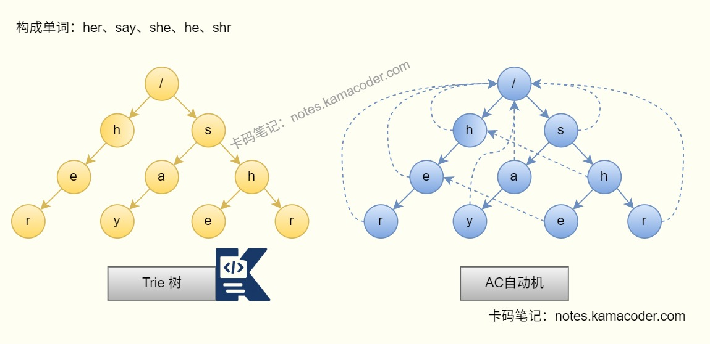
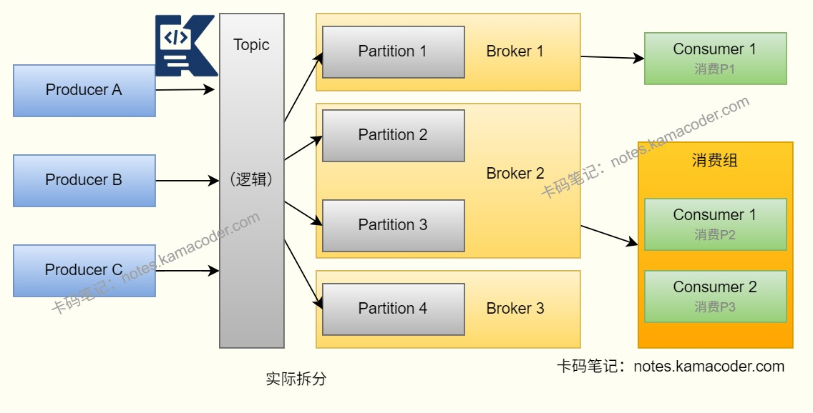
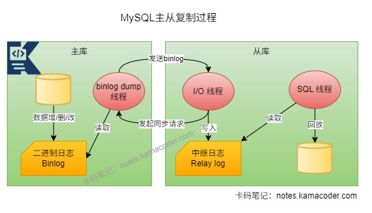

# 腾讯 Java 秋招面经

> 来源: https://notes.kamacoder.com/interview/java/tencent-java-autumn-3-7.html

# `# 腾讯 Java 秋招面经 

### `# 项目中大事务和幂等性是怎么实现的？ 
  - 在项目里如果一个事务里同时包含**大量数据更新、远程调用、消息发送**，我一般不会直接做成一个长事务，因为事务时间越长，锁持有时间越久，越容易影响并发，还会增加回滚成本。   - 处理**大事务**时，常见做法是把事务边界尽量收缩，只把必须原子提交的数据库操作放在同一个本地事务里；像调用第三方接口、发MQ、刷新缓存这类操作，通常会拆出去做成**异步化**或者**补偿机制**。   - 如果是批量数据处理，我会采用**分批提交**的方式，例如一批 500 条或 1000 条提交一次，避免一次事务过大导致 undo log、redo log 压力过大。   - 对于跨服务一致性场景，如果确实不能只靠本地事务解决，我会考虑使用**消息最终一致性**、**TCC**、**Saga** 这类方案，而不是强行做分布式大事务。   - **幂等性**方面，本质上就是让同一请求执行多次，结果仍然一致。常见做法是给请求加一个**唯一业务标识**，比如订单号、流水号、requestId。   - 落地时一般会配合以下几种方式：

    - **数据库唯一索引**：例如订单表对 `orderNo` 建唯一索引，重复请求直接插入失败。     - 利用**去重表 / 幂等表**先记录请求唯一标识，处理过的请求直接返回。     - **Redis SETNX**适合在短时去重、防重复提交。     - **状态机控制**可以实现订单只能从“待支付”流转到“已支付”，不能重复扣款。   - 如果是**MQ消费幂等**，我会结合消息ID或业务ID落库去重，因为消息队列通常只能保证“至少一次投递”，消费端必须自己兜底幂等。 

### `# Bitmap的使用场景是什么？ 
  - Bitmap本质上是用**一个bit位表示一个状态**，非常适合做海量数据的布尔状态统计。   - 常见场景有：

    - **用户签到**：一个月 31 天，只需要 31 个 bit 就能表示是否签到。     - **用户在线状态**：某个用户是否在线、是否活跃。     - **标签命中**：某个用户是否属于某类人群。     - **批量去重/判重**：例如某个 ID 是否出现过。   - Bitmap 的优点是**极省内存、按位运算快**，适合做交集、并集、统计数量。例如 Redis 的 `SETBIT`、`GETBIT`、`BITCOUNT`、`BITOP` 就很适合做签到统计、连续签到、活跃用户分析。   - 因此Bitmap适合表示**0/1状态**，而且通常要求数据可以映射成连续整数下标；如果 ID 很离散，空间利用率就会比较差。 

### `# 介绍下AC自动机算法？ 
  - AC 自动机本质上是**Trie 树 + 失败指针（fail指针）**，用于解决**多模式串匹配**问题。   - 如果只有一个模式串，可以用 KMP；如果有很多关键词需要同时在一段文本中查找，比如敏感词过滤、搜索词匹配、DNA序列匹配，就更适合用 AC 自动机。   - 它的构建过程主要有两步：

    - 先把所有模式串插入到 **Trie 树** 中。     - 再通过 BFS 为每个节点构建 **fail 指针**，表示当前匹配失败时，应该跳转到哪个前缀节点继续匹配。   - 匹配文本时，从左到右扫描字符，如果当前节点没有对应字符，就沿着 fail 指针回退，直到找到可以继续匹配的位置。   - 这样就避免了每个模式串都单独匹配一遍，整体效率很高。通常时间复杂度可以理解为：

    - **构建**：和所有模式串总长度有关。     - **匹配**：接近 **O(文本长度 + 匹配结果数)** 。   - 实际应用中，AC 自动机最典型的场景就是**敏感词检测**、**关键词高亮**、**输入法词库匹配**。

 

### `# kafka为什么比较快？ 
  - Kafka 快的核心原因不是“完全不落盘”，它将消息顺序写入磁盘，减少了磁盘的寻道时间，吞吐量高，优于随机写。   - Kafka 大量利用了**操作系统 Page Cache**。生产者写入后，数据先进入页缓存，后续再由系统异步刷盘，因此吞吐量很高。   - Kafka 使用了**零拷贝**技术，比如发送数据时通过 `sendfile` 等机制减少用户态和内核态之间的数据拷贝次数，降低 CPU 开销。   - Kafka 支持**批量发送消息**，生产者可以把很多小请求合并成少量大请求发送，减少网络往返和系统调用次数。   - 它的存储模型也很适合高吞吐场景：Topic 会被拆成多个 **Partition**，不同 Partition 可以分布在不同 Broker 上并行读写，Consumer Group 也能并行消费多个 Partition。

 

### `# RocketMQ的延时队列的实现原理是什么? 
  - 以**RocketMQ 4.x**为例，它的延时消息不是给每条消息单独维护一个定时器，而是基于**延迟级别**来做的。   - 生产者发送延时消息时，会指定一个 `delayLevel`，比如延迟 1s、5s、10s、1m 这类固定级别。   - Broker 收到后，不会立刻把消息投递到真实 Topic，而是先存到内部的**调度 Topic**，经典实现里是 `SCHEDULE_TOPIC_XXXX`。   - Broker 后台会有一个**定时任务线程**不断扫描这个调度 Topic 对应的 ConsumeQueue，判断消息是否到达投递时间。   - 如果到了时间，就把消息重新恢复成原来的 Topic 和 Queue，再次写入 CommitLog，随后消费者就能像普通消息一样消费到它。   - 这种设计的优点是实现简单、吞吐高，缺点是：只能使用**预定义的延迟级别**，且精度是“够用型”，不是每条消息精确到绝对毫秒级。 

### `# MySQL的事务隔离级别有哪些？ 
  - MySQL 常见的四种事务隔离级别，从低到高分别是：

    - **读未提交（Read Uncommitted）**     - **读已提交（Read Committed）**     - **可重复读（Repeatable Read）**     - **串行化（Serializable）**   - **读未提交**下，一个事务可以读到另一个事务还没有提交的数据，所以会出现**脏读**、**不可重复读**、**幻读**。   - **读已提交**下，只能读到已经提交的数据，解决了**脏读**，但仍然会出现**不可重复读**和**幻读**。   - **可重复读**下，同一个事务里多次读取同一条记录，结果保持一致，解决了**脏读**和**不可重复读**。在 MySQL InnoDB 中，还会结合 **MVCC + Next-Key Lock** 来尽量解决幻读问题。也是MySQL InnoDB 默认的隔离级别。   - **串行化**隔离级别最高，事务串行执行，可以避免脏读、不可重复读和幻读，但并发性能最差。 

### `# 当前读和快照读的区别？ 
  - **快照读**读的是某个时间点的一致性版本，依赖 **MVCC**，典型就是普通的 `select`，默认不加锁。   - **当前读**读的是数据的**最新版本**，并且通常会加锁，目的是保证后续更新的正确性。   - 常见的当前读包括：

    - `select ... for update`     - `select ... lock in share mode`（或新语法 `for share`）     - `update`     - `delete`     - `insert`   - 快照读更偏向于提高并发性能，读写之间尽量不互相阻塞。   - 当前读更偏向于保证数据一致性，尤其是“先查再改”“扣减库存”这类业务，通常要用当前读配合锁来避免并发问题。 

### `# MVCC在读已提交和可重复读两种隔离级别的区别？ 
  - MVCC 的核心是**版本链 + Read View**。区别主要在于 **Read View 生成的时机不同**。   - 在 **读已提交（RC）** 下，事务中每执行一次快照读，都会生成一个新的 Read View。   - 这意味着同一个事务里，两次 `select` 之间如果别的事务提交了更新，那么第二次查询就可能看到新结果，所以会出现**不可重复读**。   - 在 **可重复读（RR）** 下，事务第一次执行快照读时会生成一个 Read View，后续同一事务里的快照读通常都会复用这个 Read View。   - 因此即使其他事务已经提交了更新，这个事务后续的快照读看到的仍然是第一次读到的那个一致性视图，所以能实现**可重复读**。 

### `# 介绍一下MySQL中的三种日志？ 
  - MySQL经常使用三种日志是：**undo log、redo log、binlog**。   - **undo log**：

    - 用于记录数据被修改前的旧版本。可以进行事务回滚，还可以给 MVCC 提供历史版本。   - **redo log**：

    - 是 InnoDB 存储引擎层的日志。用于保证事务的**持久性**。     - 因为数据库页先在内存中修改，不会每次都立刻刷盘，所以要先把修改操作顺序写到 redo log，崩溃恢复时可以重做。   - **binlog**：

    - 是 MySQL Server 层的日志。     - 记录的是逻辑操作，用于**主从复制**和**数据恢复**。

   - 三者的关系可以简单理解为：undo log 负责“出问题怎么回滚”，redo log 负责“提交后怎么保证不丢”，binlog 负责“怎么复制、怎么归档恢复” 

### `# 为什么一张MySQL表通常不超过2000万行？ 
  - 这其实不是 MySQL 的硬性限制，而是一个比较常见的**工程经验值**。   - 理论上 MySQL 表远不止 2000 万行还能存，但当数据量非常大时，会带来一系列问题：

    - 索引变大，查询路径变长。     - 回表、排序、分页的成本更高。     - DDL、备份、恢复、归档都更慢。     - 热点更新和锁竞争更明显。   - InnoDB 的索引是 **B+Tree**，即使有几千万行，树高通常也不会特别夸张，真正的问题不是“查不到”，而是**整体维护成本和性能抖动会明显上升**。特别是如果表里还有很多二级索引时，索引文件膨胀得会很快，写入放大、缓存命中率下降都会更明显。   - 所以在工程上，数据量大到一定程度后，往往会**按时间分表**、**按业务维度分库分表**或者进行**冷热数据分离**。因此表达到两千万行这个量级，就应该评估**拆分、归档、分片**了，而不是说 MySQL 到 2000 万就不能用了。 

### `# 唯一索引和主键索引的区别？ 
  - **主键索引**要求主键值**唯一且不能为空**，而且一张表只能有一个主键。   - **唯一索引**也要求索引列值唯一，但一张表可以有多个唯一索引。   - 在 InnoDB 里，主键索引本质上就是**聚簇索引**，叶子节点存放的是整行数据。唯一索引通常是**二级索引**，叶子节点存放的是主键值，查到后如果需要非索引列，还要回表。   - 唯一索引和主键索引在约束意义上相似，但主键更强调“这条记录的唯一身份”，通常用于表的核心标识。不过MySQL 的唯一索引对于 `NULL` 的处理要注意：一般允许出现多个 `NULL`，因为 `NULL` 和 `NULL` 不认为相等。 

### `# 怎么选择主键的生成方式？ 
  - 选择主键方式时，我会优先考虑几个点：**是否分布式、是否高并发、是否要求趋势递增、是否要求全局唯一**。   - 如果是单库单表或者分库压力不大，最常见的是用**数据库自增主键**：实现简单、趋势递增，符合 B+Tree 插入特点，且页分裂少，写入性能比较稳定   - 如果是分布式系统，更常见的是用**雪花算法（Snowflake）**、号段模式这类分布式 ID：保证全局唯一，大致递增，不依赖单点数据库发号。   - 一般不推荐直接把 **UUID** 当主键，首先UUID太长，占空间；且无序，容易导致页分裂，同时二级索引也会跟着变大。   - 如果业务上有天然唯一键，比如订单号、流水号，也可以把它作为业务唯一字段，但是否直接拿来做主键，要看长度、是否递增、是否频繁作为关联字段。   - 总体上，数据库主键我更倾向于选**短、稳定、唯一、趋势递增**的方案。 

### `# varchar和char的区别是什么？用varchar可能造成的影响是什么？ 
  - `char` 是**定长字符串**，例如 `char(10)` 即使只存 `"abc"`，底层也会按固定长度存储，适合长度基本固定的字段，比如身份证状态码、性别这类短字段。   - `varchar` 是**变长字符串**，只占用实际长度加上额外长度信息，空间利用率更高，更适合用户名、地址、备注这类长度变化大的字段。   - 二者的主要区别是`char` 查询时处理简单，长度固定。`varchar` 更省空间，但记录长度不固定。   - 使用 `varchar`时，如果后续更新把字段变长，而当前数据页剩余空间不足，就可能触发**页分裂**或**行迁移**，导致数据页碎片增加，索引维护成本增加，且插入和更新性能下降。   - 不过大多数业务字段依然更适合 `varchar`，只是不要把长度变化不大的短字段一律无脑设成超长 `varchar`。另外如果主键本身是无序的，再叠加变长字段更新，页分裂问题会更明显。 

### `# redis为什么快？ 
  - Redis 快的第一原因是它是**基于内存**的，绝大部分操作都不需要像 MySQL 那样频繁访问磁盘。   - 第二个原因是 Redis 的数据结构设计得比较高效，比如：`String`、`Hash`、`List`、`Set`和`ZSet`。Redis 的很多操作时间复杂度都比较低，而且针对不同场景做了专门优化。   - 第三个原因是Redis 采用 **IO 多路复用机制**，一个线程可以高效处理大量网络连接。   - Redis 6 之后还引入了 **IO 线程** 来分担网络读写压力，但核心命令执行仍然是单线程，这样做可以减少锁竞争和上下文切换。此外 Redis 协议简单、实现轻量、数据局部性好，所以整体响应延迟非常低。 

### `# MySQL中的索引下推是什么？ 
  - 索引下推，英文叫 **ICP（Index Condition Pushdown）**。它的作用是：在使用二级索引查询时，把原本可以在存储引擎层判断的过滤条件，尽量**下推到存储引擎层**提前过滤，减少回表次数。   - 举个例子，如果有联合索引 `(name, age)`，SQL 是：
`select * from user where name = 'Tom' and age > 20;`   - 没有索引下推时，可能先通过索引找到 `name='Tom'` 的记录，再一条条回表，由 Server 层继续判断 `age > 20`。   - 有索引下推后，存储引擎在扫描二级索引时，就能顺便判断 `age > 20`，把不满足条件的记录先过滤掉，只让满足条件的记录回表。   - 这样做的好处是**减少回表次数、减少磁盘IO和 CPU 开销**，尤其是在二级索引命中较多但过滤条件还能进一步筛选时，效果比较明显。 

### `# 介绍一下redis中的事务、lua脚本和pipeline？ 
  - Redis 的 **事务** 一般是指 `MULTI`、`EXEC`、`DISCARD` 这套机制。事务的特点是：命令会先进入队列，等 `EXEC` 时按顺序执行，但它**不支持像数据库事务那样的回滚**。如果命令语法本身没问题，`EXEC` 后会逐条执行；即使中间某条命令执行失败，前面成功的命令也不会自动回滚。   - **Lua 脚本**的特点是**原子性**更强。Redis 会单线程执行整段 Lua 脚本，脚本执行期间不会被其他命令打断，所以适合做“读+判断+写”这类需要原子性的操作。   - **Pipeline** 的核心是**批量发送命令，减少网络往返次数**，提高吞吐量。Pipeline 只解决性能问题，不保证原子性；事务更偏向“顺序执行”，Lua 脚本则适合“复杂原子操作”。 

### `# redis分布式锁的实现？ 
  - Redis 分布式锁最常见的实现方式如下，加锁成功后，业务线程开始执行任务。
`SET lockKey uniqueValue NX PX 30000`   - 这里几个参数的含义是：

    - `NX`：只有 key 不存在时才加锁成功     - `PX`：设置过期时间，防止死锁     - `uniqueValue`：锁的唯一标识，通常是 UUID + 线程标识   - 解锁时不能直接 `DEL lockKey`，因为可能出现这种情况： 线程 A 锁超时了，线程 B 拿到了新锁，线程 A 业务执行完后直接删锁，结果把线程 B 的锁删掉了。解锁必须使用 **Lua 脚本**保证原子性：先判断当前锁的 value 是否还是自己，再删除。   - 如果业务执行时间可能超过过期时间，还需要配合**锁续期**机制，比如 watchdog 定时续命。 

### `# 出现单机redis挂掉场景，如何保证分布式锁可用？ 
  - 单机 Redis 做分布式锁，最大的问题就是**单点故障**。一旦 Redis 挂了，锁服务就不可用了。   - 如果只是从“可用性”角度考虑，可以上 **Redis 主从 + Sentinel**，让 Redis 节点故障后自动切主，但是Redis 主从复制是**异步复制**。主节点刚把锁写进去，还没来得及同步到从节点就挂了，这时从节点提升为新主节点，其他客户端又可能重新拿到同一把锁，导致**锁不一致**。   - 如果业务对锁的一致性要求很高，仅靠普通主从切换并不稳妥。如果希望**提高可用性**：用主从、哨兵、集群，保证 Redis 服务不容易挂。想**提高锁可靠性**，可以用 **RedLock** 或者直接换成 **ZooKeeper / etcd** 这类更适合做强一致分布式协调的组件。   - 在生产中，如果对性能要求高、能接受小概率锁异常，可以用 Redis 锁；如果对一致性要求非常高，比如金融扣款、核心调度，更建议用 ZooKeeper / etcd 这类 CP 系统。 

### `# redis的集群模式，为什么槽位是16384，不是1024？ 
  - Redis Cluster 会把整个键空间分成 **16384 个槽位（slot）**，每个 key 通过：`CRC16(key) % 16384`计算出自己属于哪个槽，再由槽映射到具体节点。16384是Redis在**路由粒度、实现复杂度、网络开销**之间做出来的一个折中选择。   - 选择16384，首先是因为**足够多**16384 个槽已经能把数据分布得比较均匀。且**元数据开销可控**：节点之间通过 gossip 协议交换槽位信息，如果槽位过多，元数据同步成本会明显上升。同时**位图表示方便**：16384 个槽只需要 2KB 位图，节点间传播成本较低。   - 如果槽位只有 1024，粒度会偏粗，数据迁移和负载均衡不够细；如果槽位太大，比如 65536，又会增加协议和维护成本。
