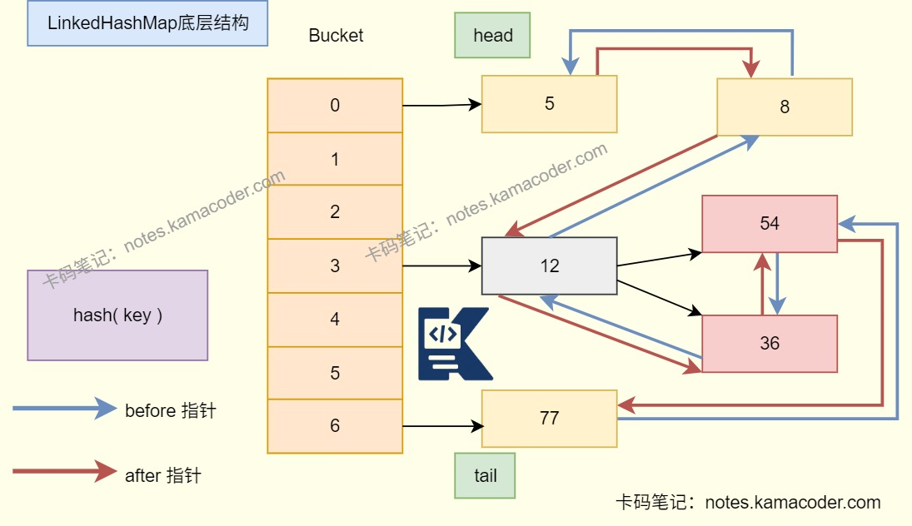
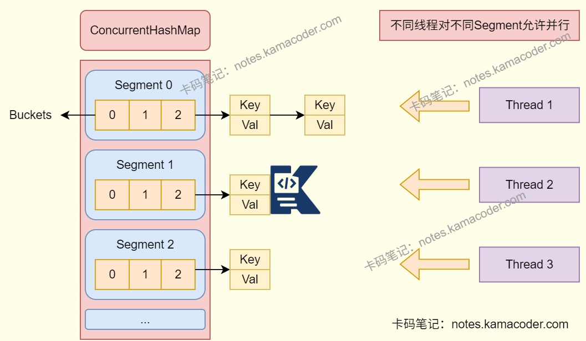

# 腾讯云面经

> 来源: https://notes.kamacoder.com/interview/java/tencent-cloud-interview.html

# `# 腾讯云面经 

## `# linkedHashMap 

### `# LinkedHashMap的底层实现是什么？ 
  - LinkedHashMap底层是**数组+双向链表+红黑树**。   - 是在HashMap的基础上维护了一条双向链表，用于记录节点的插入顺序或者访问顺序，通过accessOrder参数来指定。   - 继承自HashMap,其Entry节点新增before指针和after指针，保证**迭代时可以按顺序访问元素**。

 

### `# LinkedHashMap是线程安全的吗？ 
  - LinkedHashMap继承自HashMap，所以LinkedHashMap是**线程不安全**的。 

### `# 既然它不是线程安全的，如何实现来保证线程安全？ 
  - 在多线程环境下使用LinkedHashMap的同时实现线程安全可以使用**Collections.synchronizedMap(new LinkedHashMap())**,该方法会返回一个线程安全的包装类，对所有方法加锁保证线程安全。   - 或者手动在LinkedHashMap的代码块中使用**synchronized关键字加锁**，或者**使用ReentrantLock**等锁机制控制并发访问。 

## `# 算法中为什么要加一个makeRecently(key) 
  - LRU（最近最少使用算法）中，makeRecently(key)函数的核心作用是**将指定key标记为最近使用**，从而在缓存满时优先保留常用数据，淘汰真正不常用的数据。   - 所以每次get/put操作后调用makeRecently(key)方法，可以**维护访问顺序，确保链表尾端是最久未使用的元素，保证淘汰的准确性**。 

## `# ConcurrentHashMap底层是怎么实现的？ 
  - ConcurrentHashMap在JDK1.7中使用**数组+链表**的结构，数组分为大数组**Segment**和小数组**HashEntry**。ConcurrentHashMap的线程安全主要通过**Segment加ReentrantLock**来实现的。

   - 在JDK1.8中，ConcurrentHashMap使用**数组+链表+红黑树**的结构,通过**CAS操作或者synchronized**来保证线程安全，缩小了锁的粒度，从而提高并发性能。 

## `# Cache.keySet()返回的集合是有序的吗？ 
  - 取决于Cache的底层结构，如果是LinkedHashMap或者TreeMap等**有序结构**，那么keySet返回的集合就是有序的，会**按照插入顺序或者自然顺序**；   - 如果是基于ConcurrentHashMap或者HashMap等**无序结构**，那么keySet返回的集合就是无序的，无法保证遍历顺序。 

## `# 怎么保证链表里面的结点都是有序的？ 
  - 如果希望链表结点有顺序，需要在**插入链表时就将元素放在正确的位置**上，同时**禁止随机插入**。如果有频繁插入/删除的需求，则可以考虑使用双向链表结构，可以避免从表头重新遍历，直接定位前驱节点，提升操作效率。 

## `# keySet方法返回的结构是什么？ 
  - keySet()**返回的是一个包含容器所有键的Set视图**，它的有序性、并发性能与底层容器保持一致。   - **HashMap会返回一个无序集合**，不保证遍历顺序。   - **LinkedHashMap会返回一个有序集合**，保证遍历顺序和插入顺序/访问顺序一致。   - **TreeMap会返回一个有序集合**，顺序按键的自然排序或者自定义比较器顺序。   - **ConcurrentHashMap会返回一个支持并发操作的无序集合**。 

## `# HTTP协议里面是怎么表示报文的长度？ 
  - HTTP协议通过**请求头/响应头字段**表示报文长度，对于定长报文和不定长报文有不同的处理方式。   - 如果是**定长报文**，可以使用**Content-Length字段**在报文头部表示出本次请求/响应长度，记录Body的字节数，接收方读取到对应字节数后就可以认为本次请求/响应结束。   - 如果是**不定长报文**，也就是发送前无法确定Body长度时，使用**分块传输模式**，需要发送方在**头部添加Transfer-Encoding:chunked**,不提前指定总长度，将Body拆成多个数据块，**每个块第一行会标注自身长度**，最后使用一个空块表示传输结束。 

## `# Spring 

### `# SpringBoot和Spring有什么区别？ 
  - **Spring**是**提供基础IoC容器和AOP等核心功能**，适合对配置有精细控制的场景。**SpringBoot**则是**基于Spring的快速开发框架**，简化配置和部署。   - **Spring需要手动**编写xml或Java配置，管理各组件的依赖版本，部署时需要手动打包为WAR包，而**SpringBoot提供了自动化配置**，使用不同的Starter可以快速集成常用的框架和库，同时集成了多种内嵌服务器，应用可以直接打包成可执行的JAR文件，方便部署运行。 

### `# SpringBoot是如何实现自动配置的？ 
  - SpringBoot依靠@SpringBootApplication中的 **@EnableAutoConfiguration** 注解开启自动配置。   - SpringBoot启动时扫描spring.factories文件中列出的自动配置类，根据注解和条件判断是否要加载这些自动配置类，自动配置Bean和依赖。 

## `# Redis 

### `# Redis的分布式锁是如何实现的？ 
  - Redis的SET命令有一个**NX参数可以实现key不存在，才插入的功能**，所以可以用它实现分布式锁。   - Redis分布式锁需要通过**原子命令抢占锁**、还要设置**锁的过期时间**防止死锁并使用**唯一标识验证身份**，加锁的命令是SET key value NX PX timeout。   - 解锁的时候需要**Lua脚本**保证解锁的原子性，判断锁的拥有者，并删除锁。 

### `# 如果设置分布式锁的时候，设置超时时间是10s，但是任务执行需要12s，那么任务运行的时候锁就被自动释放了，这种场景该怎么处理？ 
  - 采用**锁续命机制（Watch Dog）**,在任务执行过程中，守护线程会定期检查任务是否完成，若未完成则延长锁的过期时间，确保锁不会在任务结束前释放。   - 具体实现：设置一个基础过期时间，在任务执行过程中，每隔一段时间执行一次“续期”操作，通过Lua脚本判断锁是否仍由自己持有，如果持有则延长过期时间，任务结束后会正常释放锁。 

### `# 讲讲Redlock? 
  - 基于Redis实现的分布式锁在**节点故障**时，由于主从复制模式中的数据是异步复制的，会导致并发问题，也是**分布式锁的不可靠性**。**Redlock是Redis官方设计的分布式锁算法**，保证集群环境下分布式锁的可靠性。   - Redlock让客户端和多个独立的Redis节点依次请求申请加锁，如果客户端能够和半数以上节点加锁即认为客户端成功地获取了分布式锁，否则加锁失败，这样就可以避免单节点故障导致锁失效问题。   - Redlock适合对分布式锁可靠性要求高且可以接受损耗的场景。 

### `# Redis释放锁时候有哪些原子性问题？ 
  - Redis释放锁时原子性问题在于**“检查锁持有者”与“删除锁”这两个操作不是原子的**，可能会导致误删锁，使用lua脚本可以解决这个问题。   - **lua脚本**的作用是将这两个操作封装为原子操作，Redis会单线程执行整个脚本，中途不被打断。 

### `# 如果不用lua脚本释放，有什么问题？ 
  - 如果不用lua脚本，那么就无法保证这两个操作的原子性，存在**误删新线程持有的锁**的风险，甚至可能**导致多个线程同时持有锁**，引发数据不一致。 

### `# 往Redis里写一个hash结构的数据，命令是什么？ 
  - 核心命令是**HSET**   - 如果是**单字段写入**：HSET key field value   - 如果是**多个字段写入**：HSET key field1 value1 field2 value2 ...
执行成功后会返回写入的字段数量（新增字段数、修改已存在的字段返回0） 

## `# final关键字的作用？ 
  - **修饰类**：final修饰的类不可被继承，是最终类   - **修饰方法**：final修饰的方法不能被重写   - **修饰变量**：

    - 修饰基本数据类型的变量，其数值在初始化之后便不能修改，为常量。     - 修饰引用类型的变量，在对其初始化之后便不能再让其指向另一个对象。虽然不能再指向其他对象，但是它指向的对象的内容是可变的。 

## `# MySQL 

### `# MySQL中表示时间的字段有哪些？ 
  - **DATE**:YYYY-MM-DD，存储日期（年月日）   - **TIME**:HH:MM:SS，存储时间（时分秒）   - **DATETIME**:YYYY-MM-DD HH:MM:SS，存储日期和时间（年月日时分秒）   - **TIMESTAMP**:时间戳，存储日期时间（年月日时分秒），与DATETIME不同的是，TIMESTAMP会根据时区自动转换为当前时区的时间，而DATETIME则不会。   - **YEAR**:YYYY，存储年份 

### `# 讲讲MySQL中的MVCC？ 
  - MySQL中的**MVCC（多版本并发控制）**，可以实现在并发读取数据库时，在读操作时不会阻塞写操作，写操作不会阻塞读操作，能够**提高数据库并发读写的性能**。还可以**解决脏读、不可重复读、幻读**等事务隔离问题，不能解决更新丢失问题。   - 主要原理是通过**版本链+Read View机制**实现，每行数据有两个隐藏列，trx_id用于记录最后修改该数据的事务ID，roll_pointer用于指向undo log中该数据的历史版本，形成版本链。   - 旧的版本会被写入**undo log**，新版本保留当前事务ID，通过版本链串联所有历史版本。   - **Read View控制可见性**：事务启动时生成一个读视图，包含活跃事务ID列表、最小活跃事务ID、最大活跃事务ID，读取数据时，比较记录的trx_id和Read View判断版本是否可见，以此让事务看到自己对应的版本。
