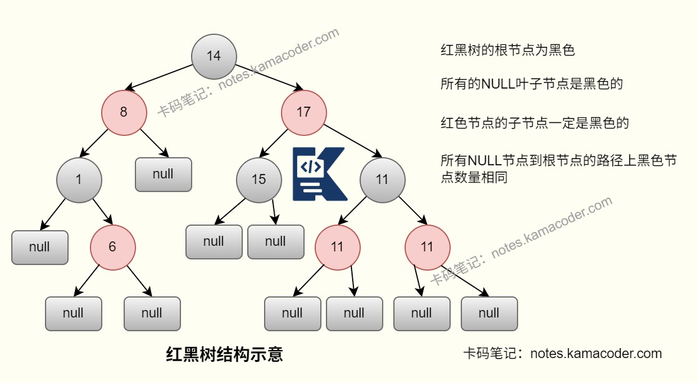
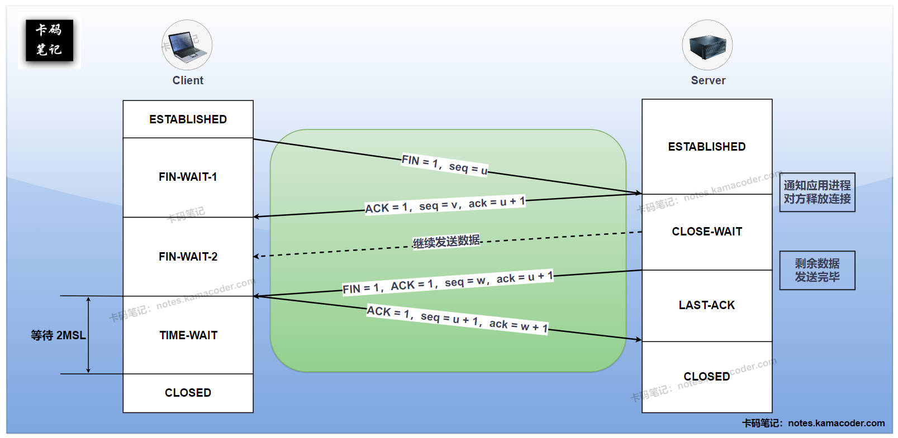

# 腾讯日常实习 Java 技术面经

> 来源: https://notes.kamacoder.com/interview/java/tencent-java-intern-tech.html

# `# 腾讯日常实习 Java 技术面经 

### `# private和protected有啥不一样？不写get/set方法的话，怎么访问私有变量/属性？ 
  - `private` 只能在**当前类内部**访问，哪怕是子类也不能直接访问父类的 `private` 成员；`protected` 的访问范围更大，在**同包类**中可见，在**不同包的子类**中也可以通过继承关系访问。   - 如果不写 `get/set`，访问私有属性的常见方式有三种：

    - 在**类自己的方法、构造器**里直接访问。     - 通过**内部类**访问外部类的私有成员。     - 通过**反射**强行访问，比如 `setAccessible(true)`，不过这通常只在框架、测试或底层工具里使用，业务代码不会这样做。 

### `# 反射这个特性设计出来的目的是什么？为啥需要反射？ 
  - 反射的核心价值是让程序在**运行时**获取类的信息，并动态创建对象、调用方法、修改字段。这样程序就不必在编译期把所有类型都写死。   - 很多框架都依赖反射，比如**Spring** 通过反射创建 Bean、注入依赖；**MyBatis** 通过反射把查询结果映射到对象；**JDK 动态代理** 会在运行时生成代理对象去增强目标方法。   - 反射机制**灵活、解耦、可扩展**，插件化、配置化、通用工具都离不开它；但缺点是性能比直接调用差一些，而且会破坏一定的封装性，所以一般不在高频核心链路滥用。

 

### `# Java里都有哪些集合类？红黑树有啥特点？ 
  - Java 集合大体可以分成两类：**Collection 体系**：包含 `List`、`Set`、`Queue`。和 **Map 体系**：存储键值对。   - 常见实现类：

    - `ArrayList`：底层动态数组，查询快，插入删除中间元素较慢。     - `LinkedList`：底层链表，插入删除方便，随机访问慢。     - `HashSet`：底层本质是 `HashMap`，元素无序且不能重复。     - `TreeSet`：底层红黑树，天然有序。     - `HashMap`：哈希表结构，JDK8 后桶冲突严重时会树化。     - `TreeMap`：底层红黑树，按 key 有序。     - `ConcurrentHashMap`：线程安全的高并发 Map。   - 红黑树本质上是**自平衡二叉搜索树**，它不是绝对平衡，但能保证最长路径不会超过最短路径的 2 倍，因此查询、插入、删除复杂度都能稳定在 **O(logn)**。红黑树的**增删改查性能比较稳定**，比普通二叉搜索树更不容易退化成链表，所以在 `TreeMap`、`TreeSet` 以及 `HashMap` 树化桶里都会使用。 

 

### `# Java中的锁都分哪些类型？各有什么区别？ 
  - 从实现方式看，常见的有两大类：

    - **synchronized**：JVM 内置锁，语法简单，进入和退出同步块时自动加解锁。     - **Lock 接口实现类**：比如 `ReentrantLock`、`ReadWriteLock`、`StampedLock`，需要手动加锁和释放，控制更灵活。   - 从并发思想看，又可以分成：

    - **悲观锁**：默认认为会发生竞争，先加锁再操作，比如 `synchronized`、`ReentrantLock`。     - **乐观锁**：默认冲突不多，先操作再校验，常见实现是 **CAS**。   - 从线程能否重复获取来看，可以分成**可重入锁**和**不可重入锁**。Java 里常见的 `synchronized` 和 `ReentrantLock` 都是可重入锁。   - 从共享方式看，可以分成：

    - **独占锁**：同一时刻只能一个线程持有。     - **共享锁**：多个线程可同时持有读锁，比如 `ReadWriteLock` 的读锁。 

### `# 在Java里怎么创建线程？有几种方式？ 
  - 最基础的方式是**继承 `Thread` 类**，重写 `run()` 方法，然后调用 `start()`。这种方式简单，但因为Java只能单继承，扩展性一般。   - 更常用的是**实现 `Runnable` 接口**，把任务和线程本身解耦，适合大多数场景。   - 如果任务需要返回结果或抛异常，可以用**实现 `Callable` 接口**，然后配合 `FutureTask` 或线程池提交执行。

   - 生产环境里最推荐的是**线程池**，比如 `ThreadPoolExecutor`，因为它可以统一管理线程数量、任务队列、拒绝策略和线程复用，避免频繁创建销毁线程带来的开销。 

### `# 聊聊Spring里的AOP和IOC？ 
  - **IOC** 就是控制反转，本来对象是由业务代码自己 `new` 出来并管理生命周期，现在把这件事交给 Spring 容器来做。最常见的落地方式就是 **DI（依赖注入）**，也就是让容器把依赖对象自动注入到目标对象里，减少类与类之间的硬编码依赖。

   - **AOP** 就是面向切面编程，它的核心思想是把日志、事务、权限校验、监控这些**横切关注点**从业务逻辑中抽离出来，统一增强。Spring AOP 底层一般通过**动态代理**实现：有接口时优先用 JDK 动态代理，没有接口时通常用 CGLIB。   - 这两个能力结合起来以后，Spring 既能负责对象创建和装配，也能在方法调用前后做增强，所以像 `@Transactional`、统一日志、限流拦截这类能力都很好落地。 

### `# @Autowired和@Resource注解有啥不一样？用的时候该怎么选？ 
  - `@Autowired` 是 Spring 提供的注解，默认按照**类型**注入；如果存在多个同类型 Bean，一般要结合 `@Qualifier` 指定具体名字。   - `@Resource` 来源于 JSR-250，默认优先按**名称**注入，找不到同名 Bean 时再尝试按类型匹配。   - 在使用方式上，`@Autowired` 更适合 Spring 生态，尤其是**构造器注入**；如果类里只有一个构造器，Spring 甚至可以省略 `@Autowired`。   - 实际开发里我一般优先使用**构造器注入**，因为依赖更明确，也更利于单元测试；如果确实要根据 Bean 名称精确注入，可以用 `@Qualifier` 或 `@Resource`。 

### `# 常见的设计模式都有哪些？简单说说各自的用途？ 
  - **创建型模式**主要解决对象创建问题：

    - **单例模式**：用于保证全局唯一的对象（如配置类、连接池、日志工厂、Spring 的 Bean 默认单例），可以分为两类实现方式，其中饿汉式在启动时创建，线程安全、懒汉使用双重检查锁，可以进行延迟加载。     - **工厂模式**：把对象创建逻辑封装起来，调用方不关心具体实现。**简单工厂**创建同一类别的对象（如不同类型的日志记录器：FileLogger、ConsoleLogger）；**工厂方法**是每个产品对应一个工厂（如 Spring 的BeanFactory，不同子类创建不同 bean）；**抽象工厂**则负责创建一组相关对象（如跨平台 UI 组件：WindowsButton + WindowsText / LinuxButton + LinuxText）。     - **建造者模式**：适合构建参数很多、构造过程复杂的对象。   - **结构型模式**主要解决类和对象的组合问题：

    - **代理模式**：代理模式可以增强对象功能（如Spring AOP、事务管理、日志记录、权限控制）；典型实现拥有静态代理（手动编写代理类）、动态代理（JDK 动态代理、CGLIB）。     - **适配器模式**：把不兼容的接口转换成可用接口，如 SpringMVC 的HandlerAdapter，适配不同的 Controller 处理器；Java 的InputStreamReader将字节流适配为字符流。     - **装饰器模式**：在不改变原有接口的情况下动态增强对象功能（如 Java IO 的BufferedReader装饰FileReader，增加缓冲功能；Spring 的DataSource装饰器，增加连接池功能）。   - **行为型模式**主要解决对象之间职责划分和交互问题：

    - **策略模式**：把一组可替换算法封装起来，可以进行多种算法/规则的动态切换（如支付方式选择：AlipayStrategy、WechatPayStrategy；排序算法选择：QuickSortStrategy、BubbleSortStrategy）。     - **观察者模式**：是一对多的通知机制（如 Spring 的事件监听机制、Guava 的 EventBus、消息队列的发布订阅）。     - **模板方法模式**：固定流程骨架，把可变步骤交给子类实现。     - **责任链模式**：多个处理器串起来依次处理请求。 

### `# TCP三次握手、四次挥手是啥过程？TIME_WAIT状态有啥作用？ 
  - **三次握手**过程：第一次由客户端发送 `SYN`，表示想建立连接。第二次则是服务端回复 `SYN + ACK`，表示收到并同意建立连接。第三次客户端再回一个 `ACK`，双方进入 `ESTABLISHED` 状态。

   - **四次挥手**过程：主动关闭方先发送 `FIN`。被动关闭方回复 `ACK`，表示知道你不再发数据了。等它自己的数据发送完后，再发一个 `FIN`。然后主动关闭方最后回复 `ACK`，连接真正关闭。

   - `TIME_WAIT` 主要有两个作用：它保证最后一个 `ACK` 能让被动关闭方收到，如果丢了还能重发。还能让旧连接里延迟到达的报文在网络中自然消失，避免污染后续同四元组的新连接。它是TCP为了**可靠关闭连接**做的兜底设计。 

### `# 多进程和多线程有啥区别？都适合哪些场景？ 
  - 进程是**资源分配的基本单位**，线程是**CPU 调度的基本单位**。一个进程里可以有多个线程，它们共享进程的堆和方法区资源。   - 多进程的优点是**隔离性好、稳定性高**，一个进程崩了通常不会直接拖垮另一个进程；缺点是创建和上下文切换成本更高，进程间通信也更重。   - 多线程的优点是**切换成本低、共享内存方便、通信快**，适合高并发业务；缺点是因为共享资源，容易出现线程安全、死锁、可见性问题。   - 服务治理通常是**多进程/多服务部署**，单个服务内部再通过**多线程**提升吞吐量。 

### `# 常见的排序算法有哪些？时间复杂度分别是多少？为啥说最低复杂度是nlogn？基数排序算不算更优的？ 
  - 常见排序算法：

    - **冒泡、选择、插入排序**：平均时间复杂度一般是 **O(n²)**。     - **归并排序、堆排序**：时间复杂度稳定在 **O(nlogn)**。     - **快速排序**：平均 **O(nlogn)**，最坏可能退化到 **O(n²)**。   - “排序下界是 `nlogn`”，严格来说指的是**基于比较的排序**。因为比较排序可以抽象成决策树，决策树叶子节点至少要覆盖所有排列，推导出的下界就是 `O(nlogn)`。   - **基数排序、计数排序、桶排序**不属于纯比较排序，它们可以做到线性级别，但有前提条件，比如：数据范围不能太大、关键字可拆位或可映射、往往也需要额外空间。所以不能简单说基数排序“绝对更优”，只能说在特定数据分布和业务前提下它可能比比较排序更快。 

### `# B+树和B树的区别是啥？各自用在哪里？ 
  - **B 树**中，非叶子节点和叶子节点都可以存数据；**B+ 树**则通常只在叶子节点存完整数据，非叶子节点只存键和子节点指针。   - B+ 树的所有数据都落在叶子节点，叶子节点之间通常还有链表连接，所以它做**范围查询、排序扫描**会更方便。   - 因为非叶子节点不存完整数据，B+ 树单个节点能容纳更多 key，所以树更矮，磁盘 I/O 次数更稳定，更适合数据库索引这种依赖页读取的场景。所以 MySQL InnoDB 的索引结构采用的是**B+ 树**，而不是 B 树。 

### `# 动态规划（DP）和贪心算法的区别是啥？咋判断该用哪种？ 
  - **动态规划**适合解决具有**最优子结构**和**重叠子问题**的问题。它会把问题拆成很多状态，保存子问题结果，再一步步推出最终答案。   - **贪心算法**则是在每一步都选择当前看起来最优的方案，希望局部最优最终能导向全局最优。   - 二者最大的区别在于：DP 会把多种可能性都考虑进去，结果更稳，但状态设计可能更复杂。贪心更简洁高效，但前提是问题满足**贪心选择性质**。   - 判断方法一般有两个：能不能证明“当前最优选择不会影响整体最优”。能证明，往往可用贪心。如果某一步的局部最优可能把后续选择卡死，那通常更适合 DP。 

### `# MySQL里的MVCC原理是什么？ 
  - MVCC 是**多版本并发控制**，它的核心目标是让读写尽量不互相阻塞，从而提升数据库并发能力。InnoDB 里每行记录都会配合隐藏字段和 `undo log` 形成**版本链**，新事务修改数据时不会直接把旧版本彻底抹掉，而是把旧版本保存在 `undo log` 里。   - 事务做一致性读时，会结合 **Read View** 判断当前事务能看到哪个版本，从而实现“不同事务在同一时刻看到的数据版本可能不同”。所以 MVCC 主要解决的是**快照读**场景下的并发读问题，普通的当前读（比如 `select ... for update`）仍然要加锁。 

### `# ACID指的是什么？ 
  - **A（Atomicity，原子性）**：事务要么全部成功，要么全部失败，不会只执行一半。   - **C（Consistency，一致性）**：事务执行前后，数据库都要满足业务约束和完整性规则。   - **I（Isolation，隔离性）**：并发事务之间互不干扰，不同隔离级别对应不同的一致性和性能权衡。   - **D（Durability，持久性）**：事务一旦提交，数据就要被持久保存，即使系统宕机也不能轻易丢失。 

### `# redo log和undo log有啥区别？binlog又是干啥的？ 
  - `redo log` 是 InnoDB 的**重做日志**，会记录数据页的物理修改。当事务提交时会先顺序写入RedoLog中，日志落盘则判定提交成功，这样如果数据库宕机，重启后也会通过重做日志重做所有已提交的事务，实现数据的永久保存。在MySQL中和内存刷盘机制实现持久性，即执行时写入，提交时刷盘，保证强持久化。   - `undo log` 是**回滚日志**，记录的是数据修改前的快照。在事务执行的每一步会记录反向日志，事务回滚时可以通过UndoLog撤销已经执行的修改，回滚到日志开始前的状态。常用于实现MVCC（多版本并发控制），提供读已提交/可重复读隔离级别，保证事务原子性。   - `binlog` 是MySQL Server层的**归档日志**，记录的是逻辑层面的数据变更，包括DDL语句（CREATE/ALTER/DROP）和DML语句（INSERT/UPDATE/DELETE），常用于主从复制、数据恢复和增量订阅。

   - 事务提交时通常会涉及 `redo log` 和 `binlog` 的一致性问题，MySQL 通过**两阶段提交**来降低二者不一致的风险。 

### `# binlog有哪三种格式？ 
  - **Statement**：记录原始 SQL 语句，日志量小，但某些函数或非确定性语句在主从上可能出现不一致。   - **Row**：记录每一行数据变化前后的内容，一致性更好，主从复制更稳，但日志会更大。   - **Mixed**：MySQL 自动在 Statement 和 Row 之间选择，尽量兼顾日志大小和一致性。 

### `# left join和inner join的区别是啥？ 
  - `inner join` 只返回两张表中**能够匹配上**的记录。`left join` 会保留左表的所有记录，即使右表没有匹配项，也会返回，只不过右表字段补 `NULL`。   - 如果业务要求“主表数据必须都保留”，一般更适合 `left join`；如果只关心存在关联关系的数据，用 `inner join` 更直接。 

### `# SQL语句的执行流程是啥样的？ 
  - 客户端先通过**连接器**与MySQL建立连接，验证用户名密码等信息；在MySQL8.0之前的版本，MySQL会**查询缓存**，如果之前有执行过这条语句，那么MySQL会从缓存中返回结果，否则进行下一步；   - SQL 进入服务端后，**分析器**会进行词法和语法分析，检查关键字是否正确与表/字段是否存在等，提取出SQL语句中的关键元素，如果正确会构建SQL语法树，不正确则会返回错误信息；   - 解析完成后会生成内部表示，再由**优化器**决定执行计划，比如选哪个索引、表连接顺序怎么排。   - 最后**执行器**根据优化器生成的执行方案，校验用户权限后调用下层存储引擎的API接口执行数据读写操作，真正去查 B+ 树索引、回表、过滤、排序，再把结果返回给客户端。   - 如果是更新语句，还会涉及 buffer pool、redo log、binlog、刷盘等一整套流程。 
  - MySQL结构示意如下：

 

### `# 解析器生成的语法树具体是啥结构？ 
  - 它本质上是一棵**抽象语法树（AST）**。这棵树会把一条 SQL 拆成层级结构，比如`SELECT` 节点表示查询类型。投影列、`FROM`、`WHERE`、`GROUP BY`、`ORDER BY`、`LIMIT` 等会挂成不同子节点。表达式条件如 `a = 1 and b > 2` 也会被拆成布尔表达式树。   - 后续优化器会基于这棵树继续做语义绑定、等价改写和执行计划选择，所以它是 SQL 从文本走向执行计划的中间表示。 

### `# 日常开发中常用的SQL优化方法有哪些？ 
  - **先看执行计划**，通过 `EXPLAIN` 判断有没有走索引、扫描行数多不多、有没有 `Using filesort`、`Using temporary`。   - **合理建索引**，优先给高频查询条件、排序字段、分组字段建索引，但不要盲目建太多索引，因为写入也要维护索引。   - **避免索引失效**，比如对索引列做函数运算、隐式类型转换、前导模糊查询、`or` 条件使用不当等。   - **减少不必要的数据量**，避免使用 `select *`，能分页就分页，能只查需要字段就别多查。   - **优化 SQL 写法**，比如把复杂子查询改写成更合理的 `join`，把批量单条更新改成批量操作。   - **从架构层面优化**，高频热点数据可以加 Redis 缓存，超大表可以考虑分库分表或冷热数据拆分。 

### `# 前缀索引是啥意思？咋用？ 
  - 前缀索引就是对字符串字段的**前几个字符**建立索引，而不是对整个字段建立完整索引。它的好处是可以减少索引占用空间，提高索引页利用率，适合像邮箱、URL、手机号扩展字段这类前缀区分度较高的字段。使用前一般会先评估不同前缀长度的区分度，尽量找到一个“索引足够小、区分度又足够高”的平衡点。   - 但前缀索引也有局限：不能完整覆盖整个字段值；某些排序、分组场景不一定能充分利用；如果前缀区分度不高，效果会比较一般。
