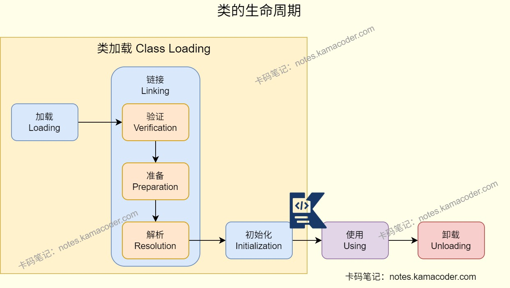

# 阿里 Java 后端开发面经

> 来源: https://notes.kamacoder.com/interview/java/alibaba-java-backend-4-21.html

# `# 阿里 Java 后端开发面经 

### `# Java动态代理了解吗？ 
  - Java 动态代理是在**运行时生成代理对象**，在不改业务代码的前提下，对目标方法做增强，比如日志、事务、权限、埋点。常见有两种实现，分别是**JDK 动态代理**和**CGLIB**。JDK 动态代理基于接口，目标类要实现接口；CGLIB 通过生成子类做增强，适合没有接口的类。   - Spring AOP 默认策略则是在目标类有接口时优先走 JDK 动态代理，没有接口时走 CGLIB；方法调用时先执行代理增强逻辑，再执行目标方法。 

### `# Java类的加载了解吗？ 
  - 类加载过程可以分为**加载、链接、初始化**三个阶段，其中链接又包含**验证、准备、解析**。   - 在**加载**阶段，类加载器把 `.class` 字节码读入内存，创建 `Class` 对象。在**链接**阶段，验证是校验字节码格式和安全性；然后给类变量分配内存并设置默认值；**解析**时，还会把符号引用替换成直接引用。   - **初始化**阶段：执行静态变量赋值和静态代码块（`<clinit>`），并且同一个类的初始化只会执行一次。 

 

### `# Spring框架了解吗？ 
  - Spring 的核心能力是 **IoC** 和 **AOP**。IoC 负责对象创建和依赖注入，AOP 负责把日志、事务、权限这类横切逻辑从业务代码中解耦出来。   - IoC 落地上是由容器管理 Bean 的创建、初始化、依赖注入和销毁，开发中通过 `@Component`、`@Service`、`@Autowired` 等注解让容器接管对象。   - AOP 底层主要依赖动态代理实现，业务代码只关注主流程，通用增强逻辑由切面统一处理。 

 

 

### `# StringBuilder和StringBuffer的区别？ 
  - 两者都是可变字符串，支持 `append()`、`insert()`，修改字符串时不会像 `String` 一样频繁创建新对象。   - `StringBuilder` **线程不安全**，但性能更高，适合单线程下的字符串拼接。   - `StringBuffer` 的方法大多带 `synchronized`，**线程安全**，适合多线程环境，但性能会低一些。 

### `# Java中Bean的生命周期了解过吗？ 
  - Bean的生命周期可以概括为**容器初始化、Bean实例化、依赖注入、初始化、使用和销毁阶段**，由Spring容器进行管理，通过注解、配置文件或接口进行配置管理。   - 在**容器初始化**阶段，Bean容器通过XML或注解扫描Spring Bean的定义，将其封装成BeanDefinition对象并注册到BeanFactory中。
在**实例化**阶段中，容器会通过构造器反射创建Bean实例。
在**依赖注入**阶段中，容器通过Autowired、Resource或者XML配置将Bean实例的属性值或者引用注入到其他Bean中。
在**Bean初始化**阶段：容器会检查**Aware相关的接口**。执行**前置处理**：如果Bean实现了BeanPostProcessor接口，Spring会调用它们的postProcessBeforeInitialization()方法。执行**自定义初始化方法**，调用Bean使用@PostConstruct或XML方式init-method声明的初始化方法，如果Bean实现了InitializingBean接口，Spring将调用他们的afterPropertiesSet()方法；执行**后置处理**：如果Bean实现了BeanPostProcessor接口，Spring就调用他们的postProcessAfterInitialization()方法。   - Bean在初始化后就可以被应用程序使用，使用结束后进行**销毁**，执行@PreDestroy标注或者在XML中使用destroy-method指定的方法，如果Bean实现了DisposableBean接口，Spring会调用destroy()方法。 

 

### `# 简单说一下LRU缓存结构的实现？ 
  - LRU 的核心结构是 **HashMap + 双向链表**，其中HashMap 负责 O(1) 定位节点，双向链表维护访问顺序，实现头部最近使用，尾部最久未使用。   - `get(key)`方法在命中后把节点移动到链表头；`put(key, value)`方法会判断是否存在，已存在就更新并移到头部，不存在就新建并插头。当容量超限时，淘汰链表尾节点，同时从 HashMap 删除对应 key，实现 O(1) 的插入、查询和淘汰。 

### `# 你有两个小球，怎么确定小球摔碎的楼高？ 
  - 这是一个比较经典的“两球找临界楼层”问题。可以设总楼层是 `N`，最坏情况下最少次数是找最小 `m`，满足 `m(m+1)/2 >= N`。这样第一颗球按递减步长试探：先扔第 `m` 层，再加 `m-1` 层、`m-2` 层……一旦碎了，用第二颗球在上一个安全区间线性查找。例如N=100时，最小 `m=14`（因为 `14*15/2=105`），最坏情况只需要 14 次；第一颗球可以按 `14, 27, 39, 50, ...` 这样的楼层序列测试。
